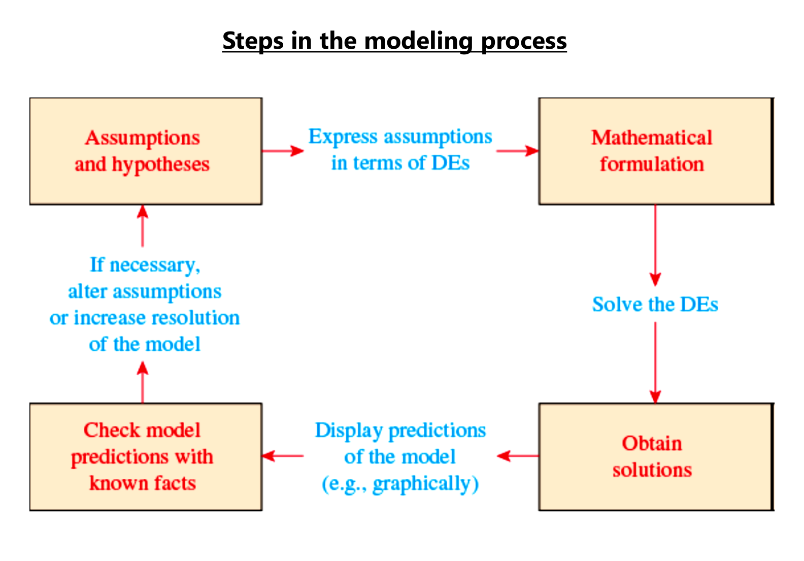
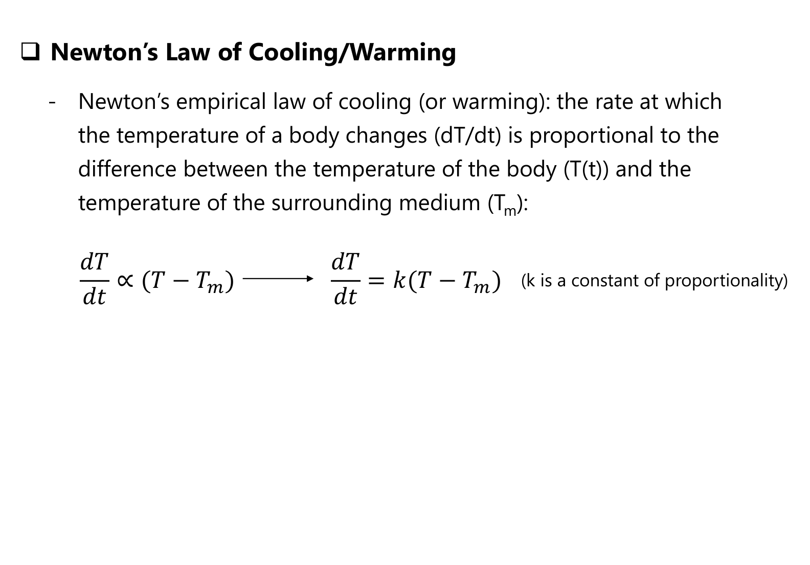
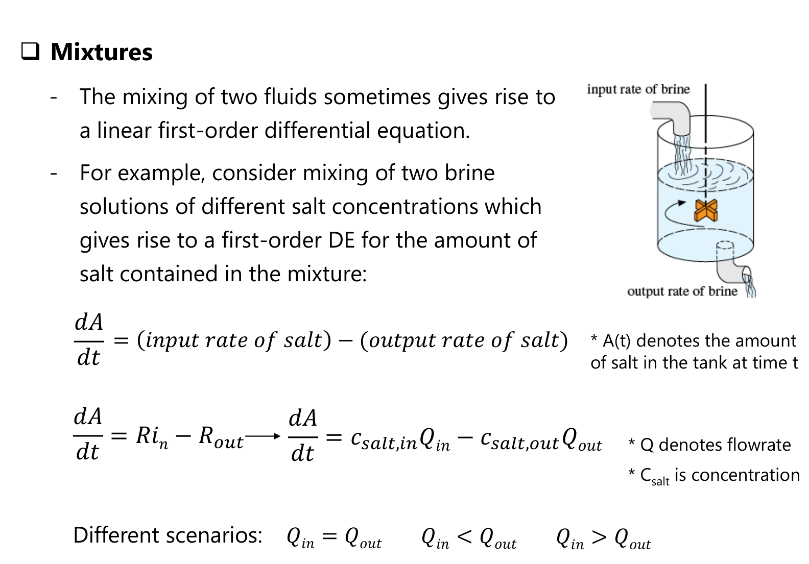
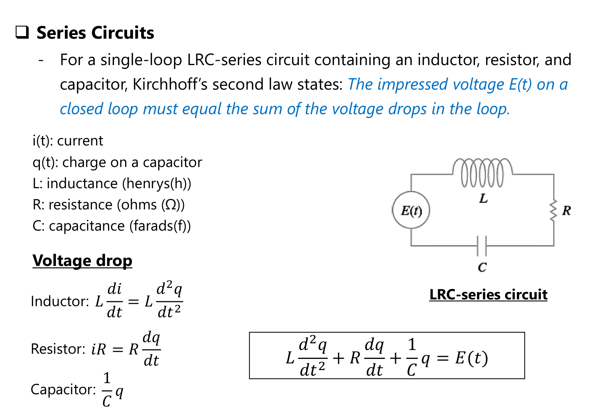

# ENGR 213 · Applied Ordinary Differential Equations
# Lecture 6: Differential Equations as Mathematical Models & Linear Models (Explained)
**Concordia University · Department of Building, Civil and Environmental Engineering**  
**Instructor**: Dr. A. Haghighat M. · **Textbook Reference**: *Advanced Engineering Mathematics*, 7th Edition, Section 2.7

---

## Executive Overview & Lecture Roadmap

Lecture 6 marks the fundamental bridge between purely formal ODE integration techniques and real-world engineering systems. When describing physical phenomena, empirical principles and conservation laws are formulated as **rates of change** ($\frac{dy}{dt}$), naturally producing differential equations.

| Phenomenon | Governing differential equation | Solution method |
| :--- | :--- | :--- |
| Population growth | $\dfrac{dP}{dt} = kP$ ($k > 0$) | Separable |
| Radioactive decay | $\dfrac{dA}{dt} = kA$ ($k < 0$) | Separable |
| Newton's cooling/warming | $\dfrac{dT}{dt} = k(T - T_m)$ ($k < 0$) | Separable or linear |
| Single-tank mixture | $\dfrac{dA}{dt} = R_{in} - R_{out}$ | First-order linear |
| LR series circuit | $L\dfrac{di}{dt} + Ri = E(t)$ | First-order linear |
| RC series circuit | $R\dfrac{dq}{dt} + \dfrac{1}{C}q = E(t)$ | First-order linear |

---

## 1. Steps in the Mathematical Modeling Process

Building a reliable engineering model follows five systematic stages:

*Figure 1: Steps in the modeling process, Lecture 6, slide 4 (Zill Fig. 1.3.1).*

**Reading the cycle, clockwise from the top left:**

1. **Assumptions and hypotheses** about the real system (which variables matter, which effects to ignore).
2. **Express the assumptions in terms of DEs**, producing the **mathematical formulation**.
3. **Solve the DEs** to **obtain solutions**.
4. **Display predictions of the model** (for example graphically).
5. **Check the model predictions with known facts** (experimental data).
6. **If necessary, alter the assumptions or increase the resolution of the model**, and go around again.

The loop is the point: a model is never "done" after one pass. If the predictions compare poorly with data, you refine the assumptions, usually at the price of more mathematical complexity.

---

## 2. Exponential Growth & Radioactive Decay

### 2.1 Theoretical Derivation
* **Hypothesis**: The rate of change of a quantity is directly proportional to the amount currently present:
  $$\frac{dP}{dt} \propto P \implies \frac{dP}{dt} = k P$$
  where $k$ is the constant of proportionality.
  * If $k > 0$: Exponential growth (microbiology, unrestricted population, compound interest).
  * If $k < 0$: Exponential decay (nuclear physics, radioisotope dating, drug pharmacokinetics).
* **Integration**:
  $$\frac{dP}{P} = k \, dt \implies \ln|P| = kt + C_1 \implies P(t) = P_0 e^{kt}$$
  where $P_0 = P(0)$ represents the initial quantity at $t = 0$.

### 2.2 Lecture 6 — Example 1: Bacterial Growth
* **Problem**: A culture initially has $P_0$ bacteria. At $t = 1\text{ h}$, the number is measured to be $\frac{3}{2} P_0$. Assuming growth is proportional to the current population, determine the time necessary for the population to triple.
* **Step 1: Formulate the Model & General Solution**:
  $$\frac{dP}{dt} = k P \implies P(t) = P_0 e^{kt}$$
* **Step 2: Determine Rate Constant $k$ from Benchmark Data**:
  $$P(1) = \frac{3}{2} P_0 \implies P_0 e^{k(1)} = \frac{3}{2} P_0 \implies e^k = 1.5$$
  $$k = \ln(1.5) = \ln\left(\frac{3}{2}\right) \approx 0.405465\text{ h}^{-1}$$
* **Step 3: Solve for Tripling Condition $P(t) = 3 P_0$**:
  $$P_0 e^{kt} = 3 P_0 \implies e^{kt} = 3 \implies kt = \ln 3$$
  $$t = \frac{\ln 3}{k} = \frac{\ln 3}{\ln(1.5)} = \frac{1.098612}{0.405465} \approx 2.7095\text{ hours}$$
* **Step 4: Engineering Conversion**:
  $$t \approx 2\text{ hours and } (0.7095 \times 60)\text{ min} \approx 2\text{ h } 43\text{ min}$$

---

## 3. Newton's Law of Cooling and Warming

### 3.1 Physical Principles & Governing Equation
Newton's empirical law states that the rate of change of temperature $\frac{dT}{dt}$ of a body is proportional to the instantaneous temperature difference between the body $T(t)$ and the surrounding medium $T_m$:
$$\frac{dT}{dt} = k (T - T_m)$$

*Figure 2: Newton's law of cooling/warming, Lecture 6, slide 8.*

| Case | Sign of $T - T_m$ | Direction of change | So $k$ must be |
| :--- | :---: | :--- | :---: |
| Object hotter than the room ($T > T_m$) | $+$ | Cools: $dT/dt < 0$ | negative |
| Object colder than the room ($T < T_m$) | $-$ | Warms: $dT/dt > 0$ | negative |

In both cases $k < 0$: the rate is proportional to the temperature **difference**, and the temperature always moves toward $T_m$.

### 3.2 Analytic Solution
$$\frac{dT}{T - T_m} = k \, dt \implies \ln|T - T_m| = kt + C_1 \implies T(t) - T_m = c e^{kt}$$
$$T(t) = T_m + c e^{kt}$$
Using the initial temperature $T(0) = T_0 \implies c = T_0 - T_m$:
$$T(t) = T_m + (T_0 - T_m) e^{kt}$$
As $t \to \infty$, since $k < 0$, $e^{kt} \to 0$, proving that $\lim_{t \to \infty} T(t) = T_m$.

### 3.3 Lecture 6 — Example 2: Cooling of a Cake
* **Problem**: When a cake is removed from an oven, its temperature is $300^\circ\text{F}$. Three minutes later, its temperature is $200^\circ\text{F}$. The room temperature is $70^\circ\text{F}$. How long will it take for the cake to cool off to room temperature?
* **Step 1: Set Up Initial Parameters**:
  * Medium temperature: $T_m = 70^\circ\text{F}$
  * Initial temperature: $T(0) = 300^\circ\text{F}$
  * Temperature difference: $T_0 - T_m = 300 - 70 = 230^\circ\text{F}$
  * Governing formula: $T(t) = 70 + 230 e^{kt}$
* **Step 2: Solve for Heat Dissipation Constant $k$**:
  $$T(3) = 200 \implies 70 + 230 e^{3k} = 200 \implies 230 e^{3k} = 130$$
  $$e^{3k} = \frac{130}{230} = \frac{13}{23} \implies 3k = \ln\left(\frac{13}{23}\right)$$
  $$k = \frac{1}{3} \ln\left(\frac{13}{23}\right) \approx -0.19018\text{ min}^{-1}$$
* **Step 3: Rigorous Mathematical vs. Engineering Resolution**:
  * **Pure Mathematical Limit**:
    $$T(t) = 70 + 230 e^{kt} = 70 \implies 230 e^{kt} = 0 \implies e^{kt} = 0$$
    Since $e^{kt} > 0$ for all finite $t$, the cake mathematically reaches exactly $70^\circ\text{F}$ only as $t \to \infty$.
  * **Practical Thermal Equilibrium (Engineering Threshold)**:
    In physical thermodynamics, thermal equilibrium is achieved when the temperature difference is imperceptible ($< 0.5^\circ\text{F}$):
    $$70 + 230 e^{kt} = 70.5 \implies e^{kt} = \frac{0.5}{230} = \frac{1}{460}$$
    $$t = \frac{\ln(1/460)}{-0.19018} = \frac{-6.13123}{-0.19018} \approx 32.24\text{ minutes}$$

---

## 4. Tank Mixture Dynamics

### 4.1 Conservation of Mass & General Formulation
The rate of accumulation of solute $A(t)$ (salt, chemical, pollutant) in a thoroughly mixed liquid tank equals input rate minus output rate:
$$\frac{dA}{dt} = R_{in} - R_{out} = c_{in} Q_{in} - c_{out}(t) Q_{out}$$
Where:
* $A(t)$ = mass of solute in the tank at time $t$ [e.g., $\text{lb}$ or $\text{kg}$]
* $Q_{in}, Q_{out}$ = volumetric flow rates in and out [e.g., $\text{gal/min}$ or $\text{L/min}$]
* $c_{in}$ = concentration of incoming brine [e.g., $\text{lb/gal}$ or $\text{kg/L}$]
* $V(t) = V_0 + (Q_{in} - Q_{out})t$ = instantaneous liquid volume in tank
* $c_{out}(t) = \frac{A(t)}{V(t)}$ = instantaneous concentration leaving tank

*Figure 3: Mixtures, Lecture 6, slide 11.*

**Reading the slide:** brine flows in at a rate $Q_{in}$ with concentration $c_{in}$, the tank is kept well mixed, and the mixture flows out at $Q_{out}$ with the tank's own concentration $c_{out} = A(t)/V(t)$. The net rate of change of salt is **input rate minus output rate**:

$$\frac{dA}{dt} = R_{in} - R_{out} = c_{in}\,Q_{in} - \frac{A(t)}{V(t)}\,Q_{out}, \qquad V(t) = V_0 + (Q_{in} - Q_{out})\,t$$

The slide's three scenarios: $Q_{in} = Q_{out}$ (constant volume), $Q_{in} < Q_{out}$ (the tank drains), $Q_{in} > Q_{out}$ (the tank fills).

The universal linear ODE is:
$$\frac{dA}{dt} + \frac{Q_{out}}{V_0 + (Q_{in} - Q_{out})t} A(t) = c_{in} Q_{in}$$

---

### 4.2 Lecture 6 — Example 3: Mixture of Two Salt Solutions
* **Problem**: A large tank holds $300\text{ gal}$ of brine. Brine is pumped in at $3\text{ gal/min}$ with salt concentration $2\text{ lb/gal}$, thoroughly mixed, and pumped out at the same rate of $3\text{ gal/min}$. The tank initially contains $50\text{ lb}$ of dissolved salt. How much salt will be in the tank after a long time? Find $A(t)$.
* **Step 1: Parameter Identification**:
  * Initial volume: $V_0 = 300\text{ gal}$
  * Flow rates: $Q_{in} = 3\text{ gal/min}$, $Q_{out} = 3\text{ gal/min} \implies V(t) = 300\text{ gal}$ (constant volume).
  * Inflow concentration: $c_{in} = 2\text{ lb/gal}$
  * Salt inflow rate: $R_{in} = c_{in} Q_{in} = (2\text{ lb/gal})(3\text{ gal/min}) = 6\text{ lb/min}$.
  * Salt outflow rate: $R_{out} = \left(\frac{A(t)}{300}\right)(3) = \frac{A(t)}{100}\text{ lb/min}$.
  * Initial condition: $A(0) = 50\text{ lb}$.
* **Step 2: Construct & Solve Linear ODE**:
  $$\frac{dA}{dt} + \frac{1}{100} A = 6$$
  * Integrating factor:
    $$\mu(t) = e^{\int \frac{1}{100} dt} = e^{t/100}$$
  * Multiply and integrate:
    $$\frac{d}{dt}\left[ A(t) e^{t/100} \right] = 6 e^{t/100}$$
    $$A(t) e^{t/100} = 6 \int e^{t/100} dt = 6(100) e^{t/100} + C = 600 e^{t/100} + C$$
    $$A(t) = 600 + C e^{-t/100}$$
* **Step 3: Apply Initial Condition $A(0) = 50$**:
  $$50 = 600 + C e^0 \implies C = 50 - 600 = -550$$
  $$A(t) = 600 - 550 e^{-t/100}\text{ lb}$$
* **Step 4: Long-Term Asymptotic Behavior ($t \to \infty$)**:
  $$\lim_{t \to \infty} A(t) = 600 - 550(0) = 600\text{ lb}$$
  * **Physical Verification**:
    The steady-state amount equals total tank volume multiplied by inflow concentration:
    $$A_{\infty} = V_0 \times c_{in} = (300\text{ gal}) \times (2\text{ lb/gal}) = 600\text{ lb}$$

---

## 5. First-Order Series Electric Circuits

### 5.1 Kirchhoff's Voltage Law (KVL)
In any closed electrical loop, the impressed electromotive force $E(t)$ equals the sum of voltage drops across circuit components:
$$V_L + V_R + V_C = E(t)$$

| Component | Voltage drop | In terms of charge $q$ ($i = dq/dt$) |
| :--- | :--- | :--- |
| Inductor $L$ | $L\dfrac{di}{dt}$ | $L\dfrac{d^{2}q}{dt^{2}}$ |
| Resistor $R$ | $iR$ | $R\dfrac{dq}{dt}$ |
| Capacitor $C$ | $\dfrac{1}{C}q$ | $\dfrac{1}{C}q$ |

*Figure 4: Series circuits, Lecture 6, slide 15.*

**Reading the slide:** the single loop contains a source $E(t)$, an inductor $L$, a resistor $R$ and a capacitor $C$. Kirchhoff's second law adds the three drops to give the **second-order** equation in the boxed formula, $L\,q'' + R\,q' + \frac{1}{C}q = E(t)$. Removing the capacitor leaves the **LR circuit**, $L\,i' + R\,i = E(t)$, which is first-order and linear in $i$: that is why it belongs in this lecture.

---

### 5.2 LR-Series Circuit Analysis
When an inductor $L$ and resistor $R$ are connected in series with voltage source $E(t)$:
$$L \frac{di}{dt} + R i = E(t) \implies \frac{di}{dt} + \frac{R}{L} i = \frac{E(t)}{L}$$
* Integrating factor: $\mu(t) = e^{\int \frac{R}{L} dt} = e^{\frac{R}{L} t}$
* For constant voltage $E(t) = E_0$:
  $$i(t) = \frac{E_0}{R} + c e^{-\frac{R}{L} t}$$
  If $i(0) = 0$:
  $$i(t) = \frac{E_0}{R}\left(1 - e^{-\frac{R}{L} t}\right)$$
* **Steady-State Current**: $i_{ss} = \frac{E_0}{R}$ (inductor acts as a short circuit).
* **Transient Current**: $i_{tr}(t) = -\frac{E_0}{R} e^{-\frac{R}{L} t}$.
* **Inductive Time Constant**: $\tau = \frac{L}{R}$. At $t = \tau$, $i(\tau) = 0.632 \, i_{ss}$.

---

### 5.3 Lecture 6 — Example 4: LR-Series Circuit
* **Problem**: A $12\text{ V}$ battery is connected to an LR series circuit with inductance $L = 0.5\text{ H}$ and resistance $R = 10\ \Omega$. Determine current $i(t)$ if initial current is zero.
* **Step 1: Set Up Governing Equation**:
  $$0.5 \frac{di}{dt} + 10 i = 12 \implies \frac{di}{dt} + 20 i = 24$$
* **Step 2: Solve Using Integrating Factor**:
  $$\mu(t) = e^{\int 20 dt} = e^{20t}$$
  $$\frac{d}{dt}\left[ i e^{20t} \right] = 24 e^{20t} \implies i(t) e^{20t} = \frac{24}{20} e^{20t} + C = 1.2 e^{20t} + C$$
  $$i(t) = 1.2 + C e^{-20t}$$
* **Step 3: Apply Initial Condition $i(0) = 0$**:
  $$0 = 1.2 + C \implies C = -1.2$$
  $$i(t) = 1.2\left(1 - e^{-20t}\right)\text{ Amperes}$$
* **Step 4: Engineering Interpretation**:
  * Steady-state current: $\lim_{t \to \infty} i(t) = 1.2\text{ A}$.
  * Time constant: $\tau = \frac{L}{R} = \frac{0.5}{10} = 0.05\text{ seconds}$.
  * By $t = 5\tau = 0.25\text{ seconds}$, current reaches $99.3\%$ of its maximum value.

---
*Concordia University · Department of Building, Civil and Environmental Engineering · ENGR 213 Lecture 6*
