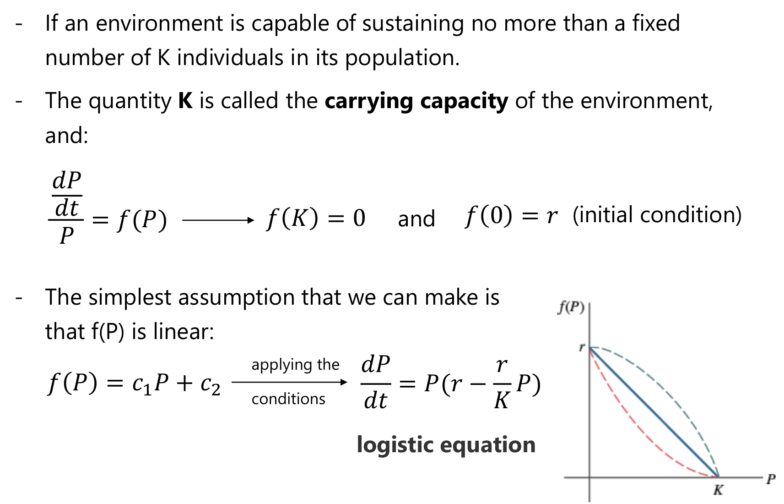
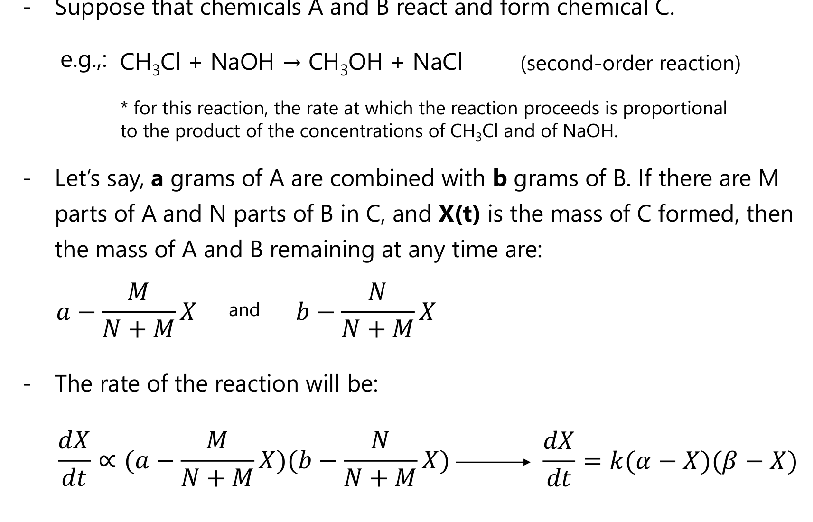
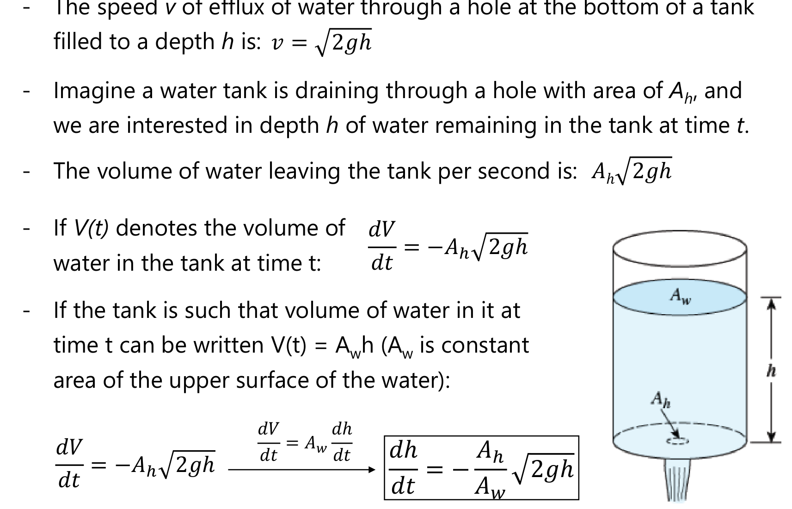

# ENGR 213 · Applied Ordinary Differential Equations
# Lecture 7: Non-Linear Mathematical Models (Explained)
**Concordia University · Department of Building, Civil and Environmental Engineering**  
**Instructor**: Dr. A. Haghighat M. · **Textbook Reference**: *Advanced Engineering Mathematics*, 7th Edition, Section 2.8  
**Lecture Date**: September 30, 2026

---

## Executive Overview & Lecture Roadmap

Lecture 7 expands first-order mathematical modeling into **non-linear phenomena**. In Lecture 6, models were linear because the per-capita rate of change was assumed constant (e.g., $\frac{1}{P}\frac{dP}{dt} = k$). In real-world engineering, environmental limitations, resource depletion, molecular collisions, and fluid efflux create non-linear dependencies.

All three core physical models introduced in Lecture 7 lead to **separable first-order differential equations** solved using **partial fraction decomposition**:

| Physical Phenomenon | Governing Non-Linear DE | Non-Linearity Mechanism | Key Physical Constant / Parameter |
| :--- | :--- | :--- | :--- |
| **Population Dynamics** | $\dfrac{dP}{dt} = P(a - bP) = aP - bP^2$ | Fatal competition / crowding (quadratic $-bP^2$) | Carrying Capacity: $K = \dfrac{a}{b}$ |
| **Spread of an Epidemic** | $\dfrac{dx}{dt} = k x (N - x)$ | Interactions between infected ($x$) and uninfected ($N-x$) | Campus Population: $N$ |
| **Second-Order Chemical Reaction** | $\dfrac{dX}{dt} = k (\alpha - X)(\beta - X)$ | Collision frequency of reactants A and B | Limiting Reactant determines $\lim_{t \to \infty} X(t)$ |
| **Leaking Water Tank (Torricelli)** | $\dfrac{dh}{dt} = -\dfrac{A_h}{A_w} \sqrt{2gh}$ | Efflux speed scales with square root of head: $v = \sqrt{2gh}$ | Emptying Time: $t_{\text{empty}} = \dfrac{A_w}{A_h}\sqrt{\dfrac{2H}{g}}$ |

---

## 1. Population Dynamics & The Logistic Equation

### 1.1 Physical Motivation: Why Exponential Growth Fails
In Lecture 6, the model for exponential growth assumed that the rate of population change is strictly proportional to the current population:
$$\frac{dP}{dt} = k P \implies P(t) = P_0 e^{kt} \quad (k > 0)$$
The **relative (or specific) growth rate** is defined as:
$$\frac{1}{P}\frac{dP}{dt} = k = \text{constant}$$
While accurate for short initial phases of bacteria or yeast cultures with unlimited nutrient supplies, **true exponential growth cannot continue indefinitely**. In any real physical or biological system, space, food, oxygen, and resources are finite. As the population expands, competition, waste accumulation, and resource depletion force the specific growth rate $\frac{1}{P}\frac{dP}{dt}$ to decrease.

This leads to the **density-dependent hypothesis**:
$$\frac{1}{P}\frac{dP}{dt} = f(P)$$

---

### 1.2 Derivation of the Logistic Model & Carrying Capacity
If an environment can sustain at most a fixed maximum population of $K$ individuals, then $K$ is called the **carrying capacity** of the environment. The growth rate must shut down when $P = K$:
1. $f(0) = r$ (maximum intrinsic birth rate when competition is zero).
2. $f(K) = 0$ (net growth ceases when the population reaches carrying capacity).

Assuming the simplest reasonable relationship—a **linear** decline in specific growth rate:
$$f(P) = c_1 P + c_2$$
Applying boundary conditions:
* $f(0) = c_2 = r$
* $f(K) = c_1 K + r = 0 \implies c_1 = -\frac{r}{K}$

Substituting $f(P)$ into the density-dependent equation:
$$\frac{1}{P}\frac{dP}{dt} = r - \frac{r}{K} P \implies \frac{dP}{dt} = P\left( r - \frac{r}{K} P \right)$$
Letting $a = r$ and $b = \frac{r}{K}$, we obtain the canonical **Verhulst Logistic Equation**:
$$\frac{dP}{dt} = P(a - bP) = aP - bP^2$$
* $aP$: The **vital growth term** (birth drive proportional to population).
* $-bP^2$: The **inhibition or competition term** (death/suppression rate driven by pairs of individuals competing for limited resources).
* **Carrying capacity**: $K = \frac{a}{b}$.

---

### 1.3 Analytical Solution via Partial Fractions
We solve the initial value problem:
$$\frac{dP}{dt} = P(a - bP), \quad P(0) = P_0 \quad (0 < P_0 < a/b)$$

#### Step 1: Separate Variables
$$\frac{dP}{P(a - bP)} = dt$$

#### Step 2: Partial Fraction Decomposition
Express the integrand as:
$$\frac{1}{P(a - bP)} = \frac{A}{P} + \frac{B}{a - bP}$$
Multiplying by $P(a - bP)$:
$$1 = A(a - bP) + B P$$
* Set $P = 0$: $1 = A(a) \implies A = \frac{1}{a}$
* Set $P = \frac{a}{b}$: $1 = B\left(\frac{a}{b}\right) \implies B = \frac{b}{a}$

Thus:
$$\frac{1}{a}\left( \frac{1}{P} + \frac{b}{a - bP} \right) dP = dt$$

#### Step 3: Integrate Both Sides
$$\int \left( \frac{1}{P} + \frac{b}{a - bP} \right) dP = \int a \, dt$$
$$\ln|P| - \ln|a - bP| = at + C_1$$
$$\ln\left| \frac{P}{a - bP} \right| = at + C_1 \implies \frac{P}{a - bP} = C e^{at}$$

#### Step 4: Apply Initial Condition $P(0) = P_0$
$$\frac{P_0}{a - bP_0} = C e^0 = C$$
$$\frac{P}{a - bP} = \left( \frac{P_0}{a - bP_0} \right) e^{at}$$

#### Step 5: Solve Explicitly for $P(t)$
Multiply both sides by $(a - bP)$:
$$P = \left( \frac{P_0}{a - bP_0} e^{at} \right)(a - bP) = \frac{a P_0 e^{at}}{a - bP_0} - \frac{b P_0 e^{at}}{a - bP_0} P$$
$$P \left[ 1 + \frac{b P_0 e^{at}}{a - bP_0} \right] = \frac{a P_0 e^{at}}{a - bP_0}$$
Multiply the entire equation by $(a - bP_0) e^{-at}$:
$$P \left[ (a - bP_0)e^{-at} + b P_0 \right] = a P_0$$
$$P(t) = \frac{a P_0}{b P_0 + (a - b P_0)e^{-at}}$$

Dividing numerator and denominator by $b$:
$$P(t) = \frac{K P_0}{P_0 + (K - P_0)e^{-at}} \quad \text{where } K = \frac{a}{b}$$

---

### 1.4 Qualitative Behavior, Inflection Point & Asymptotes

*Figure 1: Logistic population growth curve, Lecture 7, Slide 4 (Zill Section 2.8).*

#### Essential Qualitative Features:
1. **Long-Term Asymptotic Limit**:
   $$\lim_{t \to \infty} P(t) = \lim_{t \to \infty} \frac{a P_0}{b P_0 + (a - b P_0)e^{-at}} = \frac{a P_0}{b P_0} = \frac{a}{b} = K$$
   Regardless of whether the initial population starts small ($P_0 < K$) or large ($P_0 > K$), the population asymptotically converges to the carrying capacity $K$.
2. **Point of Inflection (Maximum Growth Rate)**:
   Differentiating the differential equation with respect to $t$ using the chain rule:
   $$\frac{d^2P}{dt^2} = \frac{d}{dt}[aP - bP^2] = (a - 2bP)\frac{dP}{dt}$$
   Setting $\frac{d^2P}{dt^2} = 0$:
   $$a - 2bP = 0 \implies P = \frac{a}{2b} = \frac{K}{2}$$
   * **Physical Meaning**: The population grows fastest when it is **exactly at half its carrying capacity** ($P = K/2$).
   * For $0 < P < K/2$: $\frac{d^2P}{dt^2} > 0$ (graph is concave up; accelerating growth).
   * For $K/2 < P < K$: $\frac{d^2P}{dt^2} < 0$ (graph is concave down; growth decelerates as resources dwindle).

---

### 1.5 Lecture 7 — Example 1: Spread of a Flu Virus on Campus

* **Problem Statement (Slide 8)**:
  Suppose a student carrying a flu virus returns to an isolated college campus of $1000$ students. If it is assumed that the rate at which the virus spreads is proportional not only to the number $x$ of infected students but also to the number of students not infected, determine the number of infected students after $6$ days if it is further observed that after $4$ days $x(4) = 50$.

#### Step 1: Formulate the Mathematical Model
* Let $x(t)$ = number of infected students at time $t$ (days).
* Number of uninfected students at time $t$ = $1000 - x(t)$.
* Initial condition: $x(0) = 1$ (one carrier arrives).
* Benchmark condition: $x(4) = 50$.
* Governing differential equation:
  $$\frac{dx}{dt} = k x (1000 - x)$$

#### Step 2: Separate Variables and Integrate
$$\frac{dx}{x(1000 - x)} = k \, dt$$
Using partial fractions:
$$\frac{1}{1000}\left( \frac{1}{x} + \frac{1}{1000 - x} \right) dx = k \, dt$$
$$\int \left( \frac{1}{x} + \frac{1}{1000 - x} \right) dx = \int 1000k \, dt$$
$$\ln|x| - \ln|1000 - x| = 1000 k t + C_1$$
$$\frac{x}{1000 - x} = C e^{1000kt}$$

#### Step 3: Apply Initial Condition $x(0) = 1$
$$\frac{1}{1000 - 1} = C e^0 \implies C = \frac{1}{999}$$
$$\frac{x}{1000 - x} = \frac{1}{999} e^{1000kt}$$

#### Step 4: Determine Rate Constant $k$ Using $x(4) = 50$
$$\frac{50}{1000 - 50} = \frac{50}{950} = \frac{1}{19} = \frac{1}{999} e^{1000k(4)}$$
$$e^{4000k} = \frac{999}{19} \approx 52.5789$$
$$4000k = \ln\left( \frac{999}{19} \right) \approx 3.9623$$
$$1000k = \frac{3.9623}{4} \approx 0.9906\text{ day}^{-1}$$

#### Step 5: Calculate Number of Infected Students at $t = 6$ Days
At $t = 6$:
$$1000k(6) = 6(0.9906) = 5.9435$$
$$\frac{x(6)}{1000 - x(6)} = \frac{1}{999} e^{5.9435} = \frac{1}{999}(381.25) \approx 0.3816$$
$$x(6) = 0.3816(1000 - x(6)) = 381.6 - 0.3816 x(6)$$
$$1.3816 x(6) = 381.6 \implies x(6) = \frac{381.6}{1.3816} \approx 276.2$$

* **Final Result**: After $6$ days, approximately **$276$ students** are infected.

---

## 2. Second-Order Chemical Reactions

### 2.1 The Law of Mass Action in Chemical Kinetics
Chemical kinetics investigates the rates at which chemical reactions proceed. Under the **Law of Mass Action**, the rate of a chemical reaction is proportional to the product of the active concentrations (or masses) of the reacting molecules.

*Figure 2: Second-order bimolecular chemical reaction formulation, Lecture 7, Slide 10 (Zill Section 2.8).*

#### Derivation of the Reactant Mass Balance:
Consider two chemicals $A$ and $B$ combining to form a compound $C$:
$$A + B \longrightarrow C$$
* Suppose $M$ parts of $A$ combine with $N$ parts of $B$ to form $M+N$ parts of $C$.
* Let $a$ = initial mass of $A$ (grams), and $b$ = initial mass of $B$ (grams).
* Let $X(t)$ = mass of compound $C$ formed at time $t$.

By stoichiometric conservation of mass:
* For each gram of $C$ formed, $\frac{M}{M+N}$ grams of $A$ are consumed.
* For each gram of $C$ formed, $\frac{N}{M+N}$ grams of $B$ are consumed.

Therefore, the masses of unreacted $A$ and $B$ remaining in the solution at time $t$ are:
$$\text{Mass of } A \text{ remaining} = a - \frac{M}{M+N}X$$
$$\text{Mass of } B \text{ remaining} = b - \frac{N}{M+N}X$$

The rate of formation of $C$ is proportional to the product of remaining reactants:
$$\frac{dX}{dt} \propto \left( a - \frac{M}{M+N}X \right) \left( b - \frac{N}{M+N}X \right)$$
Factoring out the stoichiometric fractions:
$$\frac{dX}{dt} = k_1 \left( \frac{M}{M+N} \right) \left( \frac{N}{M+N} \right) \left( a\frac{M+N}{M} - X \right) \left( b\frac{M+N}{N} - X \right)$$
Defining effective stoichiometric limits:
$$\alpha = a \left( \frac{M+N}{M} \right), \quad \beta = b \left( \frac{M+N}{N} \right), \quad k = k_1 \frac{MN}{(M+N)^2}$$
We arrive at the standard **Second-Order Rate Equation**:
$$\frac{dX}{dt} = k (\alpha - X)(\beta - X), \quad X(0) = 0$$

---

### 2.2 Analytical Integration
#### Case 1: Distinct Proportions ($\alpha \neq \beta$)
$$\frac{dX}{(\alpha - X)(\beta - X)} = k \, dt$$
Decomposing by partial fractions:
$$\frac{1}{(\alpha - X)(\beta - X)} = \frac{1}{\alpha - \beta}\left( \frac{1}{\beta - X} - \frac{1}{\alpha - X} \right)$$
Integrating:
$$\frac{1}{\alpha - \beta} \left[ -\ln|\beta - X| + \ln|\alpha - X| \right] = k t + C_1$$
$$\ln\left| \frac{\alpha - X}{\beta - X} \right| = (\alpha - \beta) k t + C_2 \implies \frac{\alpha - X}{\beta - X} = C e^{(\alpha - \beta)kt}$$
Applying initial condition $X(0) = 0$:
$$C = \frac{\alpha}{\beta}$$
$$\frac{\alpha - X}{\beta - X} = \frac{\alpha}{\beta} e^{(\alpha - \beta)kt}$$

#### Asymptotic Behavior ($t \to \infty$):
If $\alpha > \beta$, then $(\alpha - \beta) > 0$. As $t \to \infty$, $e^{(\alpha - \beta)kt} \to \infty$, which forces:
$$\beta - X \to 0 \implies \lim_{t \to \infty} X(t) = \beta$$
* **Physical Principle**: The reaction terminates when the **limiting reactant** is completely exhausted. The maximum amount of $C$ that can ever form is $\min(\alpha, \beta)$.

---

### 2.3 Lecture 7 — Example 2: Formation of Compound C

* **Problem Statement (Slide 12)**:
  A compound $C$ is formed when two chemicals $A$ and $B$ are combined. During the reaction, for each gram of $A$, $4$ grams of $B$ are used. It is observed that $30$ grams of $C$ are formed in $10$ minutes. Initially there are $50$ grams of $A$ and $32$ grams of $B$.
  * (a) Determine the amount of $C$ at time $t$ if the rate of reaction is proportional to the amounts of $A$ and $B$ remaining.
  * (b) How much of the compound $C$ is present at $15$ minutes?
  * (c) Interpret the solution as $t \to \infty$.

#### Step 1: Establish Stoichiometric Coefficients & Limits
* $M = 1$ part $A$, $N = 4$ parts $B \implies M + N = 5$ parts $C$.
* Fractions: Each gram of $C$ consumes $\frac{1}{5}\text{ g}$ of $A$ and $\frac{4}{5}\text{ g}$ of $B$.
* Initial amounts: $a = 50\text{ g}$ of $A$, $b = 32\text{ g}$ of $B$.
* Unreacted masses:
  $$\text{Remaining } A = 50 - \frac{1}{5}X = \frac{1}{5}(250 - X)$$
  $$\text{Remaining } B = 32 - \frac{4}{5}X = \frac{4}{5}(40 - X)$$
* Thus: $\alpha = 250$ and $\beta = 40$.
* The differential equation becomes:
  $$\frac{dX}{dt} = k_1 \left(\frac{1}{5}\right)(250 - X)\left(\frac{4}{5}\right)(40 - X) = k (250 - X)(40 - X)$$

#### Step 2: Separate Variables & Integrate
$$\frac{dX}{(250 - X)(40 - X)} = k \, dt$$
Partial fractions with $\alpha - \beta = 250 - 40 = 210$:
$$\frac{1}{210}\left( \frac{1}{40 - X} - \frac{1}{250 - X} \right) dX = k \, dt$$
Integrating both sides:
$$\ln\left( \frac{250 - X}{40 - X} \right) = 210 k t + C_1 \implies \frac{250 - X}{40 - X} = C e^{210 k t}$$

#### Step 3: Apply Initial Condition $X(0) = 0$
$$\frac{250 - 0}{40 - 0} = C \implies C = \frac{250}{40} = \frac{25}{4} = 6.25$$
$$\frac{250 - X}{40 - X} = \frac{25}{4} e^{210 k t}$$

#### Step 4: Determine Rate Parameter Using $X(10) = 30\text{ g}$
At $t = 10$:
$$\frac{250 - 30}{40 - 30} = \frac{220}{10} = 22$$
$$22 = \frac{25}{4} e^{210 k (10)} \implies e^{2100 k} = \frac{22 \times 4}{25} = \frac{88}{25} = 3.52$$
$$2100 k = \ln(3.52) \approx 1.25846$$
$$210 k = \frac{1.25846}{10} = 0.12585\text{ min}^{-1}$$

#### Step 5: Solve Explicitly for $X(t)$
$$\frac{250 - X}{40 - X} = \frac{25}{4} e^{0.12585 t}$$
$$4(250 - X) = 25(40 - X) e^{0.12585 t}$$
$$1000 - 4X = 1000 e^{0.12585 t} - 25X e^{0.12585 t}$$
$$X(t) \left[ 25 e^{0.12585 t} - 4 \right] = 1000 \left( e^{0.12585 t} - 1 \right)$$
$$X(t) = \frac{1000(e^{0.12585 t} - 1)}{25 e^{0.12585 t} - 4} = \frac{1000(1 - e^{-0.12585 t})}{25 - 4 e^{-0.12585 t}}$$

#### Part (b): Mass of $C$ Present at $t = 15\text{ minutes}$
At $t = 15$:
$$0.12585 \times 15 = 1.88775$$
$$e^{1.88775} \approx 6.6045$$
$$X(15) = \frac{1000(6.6045 - 1)}{25(6.6045) - 4} = \frac{1000(5.6045)}{165.11 - 4} = \frac{5604.5}{161.11} \approx 34.787\text{ grams}$$
* **Result**: At $15\text{ minutes}$, approximately **$34.79\text{ g}$** of compound $C$ has formed.

#### Part (c): Asymptotic Interpretation as $t \to \infty$
$$\lim_{t \to \infty} X(t) = \lim_{t \to \infty} \frac{1000(1 - e^{-0.12585 t})}{25 - 4 e^{-0.12585 t}} = \frac{1000(1 - 0)}{25 - 0} = \frac{1000}{25} = 40\text{ grams}$$
* **Physical Interpretation**:
  * Chemical $B$ is the **limiting reactant**.
  * Initially there were $32\text{ g}$ of $B$. Since each gram of $C$ requires $0.8\text{ g}$ of $B$, the $32\text{ g}$ of $B$ can produce at most:
    $$X_{\max} = \frac{32\text{ g}}{0.8\text{ g of } B / \text{g of } C} = 40\text{ grams of } C$$
  * When $X = 40\text{ g}$, all $32\text{ g}$ of $B$ is completely consumed.
  * Mass of $A$ consumed $= \frac{1}{5}(40) = 8\text{ g}$.
  * Mass of $A$ remaining $= 50 - 8 = 42\text{ g}$ of unreacted $A$ left in the container.

---

## 3. Draining / Leaking Tanks & Torricelli's Law

### 3.1 Fluid Mechanics Principles & Efflux Velocity
Consider a water tank filled to depth $h$ draining through a small orifice of area $A_h$ at the bottom.

*Figure 3: Efflux from a leaking water tank, Lecture 7, Slide 15 (Zill Section 2.8).*

#### Torricelli's Law:
Under ideal (frictionless) conditions, equating potential energy at the free surface to kinetic energy at the orifice gives the **efflux velocity**:
$$v = \sqrt{2gh}$$
* $h$: Instantaneous depth of fluid above the orifice ($	ext{m}$ or $	ext{ft}$).
* $g$: Acceleration due to gravity ($9.8\text{ m/s}^2$ or $32\text{ ft/s}^2$).

#### Volumetric Flow Rate Conservation:
The rate at which volume escapes through the hole is:
$$\frac{dV}{dt} = - A_h v = - A_h \sqrt{2gh}$$
If the cross-sectional area of the water's upper surface is $A_w(h)$, then $dV = A_w(h) dh$. Therefore:
$$A_w(h) \frac{dh}{dt} = - A_h \sqrt{2gh}$$
For a cylindrical tank with **constant surface area $A_w$**:
$$\frac{dh}{dt} = -\frac{A_h}{A_w} \sqrt{2gh}$$

---

### 3.2 Analytical Solution & Total Draining Time
We solve the initial value problem:
$$\frac{dh}{dt} = -\frac{A_h}{A_w} \sqrt{2g} \, h^{1/2}, \quad h(0) = H$$

#### Step 1: Separate Variables
$$h^{-1/2} \, dh = -\frac{A_h}{A_w} \sqrt{2g} \, dt$$

#### Step 2: Integrate
$$2 \sqrt{h} = -\frac{A_h}{A_w} \sqrt{2g} \, t + C$$
At $t = 0, h = H$:
$$C = 2\sqrt{H}$$
$$2 \sqrt{h(t)} = 2\sqrt{H} - \frac{A_h}{A_w} \sqrt{2g} \, t$$
$$\sqrt{h(t)} = \sqrt{H} - \frac{A_h}{2 A_w} \sqrt{2g} \, t$$

#### Step 3: Explicit Height Function
$$h(t) = \left( \sqrt{H} - \frac{A_h}{2 A_w} \sqrt{2g} \, t \right)^2$$

#### Step 4: Emptying Time ($t_{\text{empty}}$) & Interval of Definition
The tank is empty when water depth reaches zero ($h(t) = 0$):
$$\sqrt{H} - \frac{A_h}{2 A_w} \sqrt{2g} \, t_{\text{empty}} = 0$$
$$t_{\text{empty}} = \frac{2 A_w \sqrt{H}}{A_h \sqrt{2g}} = \frac{A_w}{A_h} \sqrt{\frac{2H}{g}}$$

* **Crucial Physical Note on Interval of Definition**:
  The mathematical solution is a parabola $h(t) = (c_1 - c_2 t)^2$. However, after $t_{\text{empty}}$, the parabola curves back upward! In physical reality, water cannot spontaneously flow backwards out of an empty hole. Therefore, the **valid physical interval of definition** is strictly:
  $$I = [0, t_{\text{empty}}]$$
  For all $t > t_{\text{empty}}$, $h(t) \equiv 0$.

---

### 3.3 Lecture 7 — Example 3: Leaking Cylindrical Tank

* **Problem Statement (Slide 17)**:
  A tank in the form of a right-circular cylinder standing on end is leaking water through a circular hole in its bottom.
  * (a) Solve for $h(t)$ if the initial height of water is $H$. Draw graph of $h(t)$ and give its interval $I$ of definition in terms of the symbols $A_w, A_h$, and $H$.
  * (b) Suppose the tank is $10\text{ ft}$ high and has radius $2\text{ ft}$ and the circular hole has radius $0.5\text{ in}$. If the tank is initially full, how long will it take to empty?

#### Part (a): General Formula & Interval of Definition
From our derivation above:
$$h(t) = \left( \sqrt{H} - \frac{A_h}{2 A_w} \sqrt{2g} \, t \right)^2$$
The tank completely empties at:
$$t_{\text{empty}} = \frac{A_w}{A_h} \sqrt{\frac{2H}{g}}$$
* **Interval of Definition**:
  $$I = \left[ 0, \, \frac{A_w}{A_h} \sqrt{\frac{2H}{g}} \right]$$

#### Part (b): Numerical Calculation
* **Tank Height**: $H = 10\text{ ft}$
* **Tank Radius**: $R = 2\text{ ft}$
* **Hole Radius**: $r_h = 0.5\text{ in} = \frac{0.5}{12}\text{ ft} = \frac{1}{24}\text{ ft}$
* **Gravitational Constant**: $g = 32\text{ ft/s}^2$

#### Step 1: Compute Cross-Sectional Areas
$$A_w = \pi R^2 = \pi (2\text{ ft})^2 = 4\pi\text{ ft}^2$$
$$A_h = \pi r_h^2 = \pi \left(\frac{1}{24}\text{ ft}\right)^2 = \frac{\pi}{576}\text{ ft}^2$$

#### Step 2: Compute Area Ratio
$$\frac{A_w}{A_h} = \frac{4\pi}{\pi / 576} = 4 \times 576 = 2304$$

#### Step 3: Compute Emptying Time
$$t_{\text{empty}} = \frac{A_w}{A_h} \sqrt{\frac{2H}{g}} = 2304 \sqrt{\frac{2(10\text{ ft})}{32\text{ ft/s}^2}} = 2304 \sqrt{\frac{20}{32}} = 2304 \sqrt{0.625}$$
$$\sqrt{0.625} \approx 0.790569$$
$$t_{\text{empty}} = 2304 \times 0.790569 \approx 1821.47\text{ seconds}$$

#### Step 4: Convert to Minutes
$$t_{\text{empty}} = \frac{1821.47}{60} \approx 30.36\text{ minutes} \approx 30\text{ min } 22\text{ s}$$

---

## 4. First-Principles Exam Pitfalls & Non-Linear Traps

### Trap 1: Dimensional Inconsistency in Torricelli's Law
* **The Error**: Mixing inches and feet ($R = 2\text{ ft}$ with $r_h = 0.5\text{ in}$).
* **The Rule**: Always convert all linear dimensions into feet before calculating areas:
  $$r_h = 0.5\text{ in} = \frac{1}{24}\text{ ft} \implies A_h = \frac{\pi}{576}\text{ ft}^2$$
  Similarly, ensure $g$ is in $\text{ft/s}^2$ ($g = 32$) for Imperial units, or $\text{m/s}^2$ ($g = 9.8$) for SI units.

### Trap 2: Extending $h(t)$ Past the Emptying Time
* **The Error**: Plugging a time $t > t_{\text{empty}}$ into $h(t) = (\sqrt{H} - c t)^2$.
* **The Rule**: Because the square makes the expression positive, math says depth rises after emptying! In an engineering exam, state explicitly:
  $$h(t) = \begin{cases} \left( \sqrt{H} - \dfrac{A_h}{2 A_w} \sqrt{2g} \, t \right)^2, & 0 \le t \le t_{\text{empty}} \\ 0, & t > t_{\text{empty}} \end{cases}$$

### Trap 3: Chemical Reaction Stoichiometric Fractions
* **The Error**: Writing $\frac{dX}{dt} = k(a - X)(b - X)$ when the reactants do not combine in a $1:1$ mass ratio.
* **The Rule**: If $M$ grams of $A$ react with $N$ grams of $B$, the consumption factors are $\frac{M}{M+N}$ and $\frac{N}{M+N}$. Factoring them out scales the effective limits:
  $$\alpha = a\left(\frac{M+N}{M}\right), \quad \beta = b\left(\frac{M+N}{N}\right)$$

### Trap 4: Logistic Inflection Point vs. Maximum Population
* **The Error**: Confusing the point of maximum growth rate with maximum carrying capacity.
* **The Rule**:
  * The **maximum growth rate** occurs at the inflection point: $P = \frac{K}{2}$.
  * The **maximum population** is the asymptotic limit: $P = K$.
