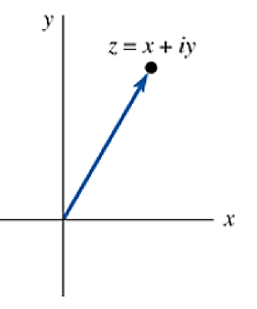
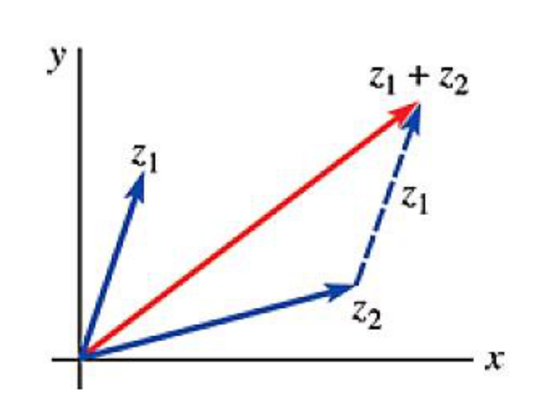
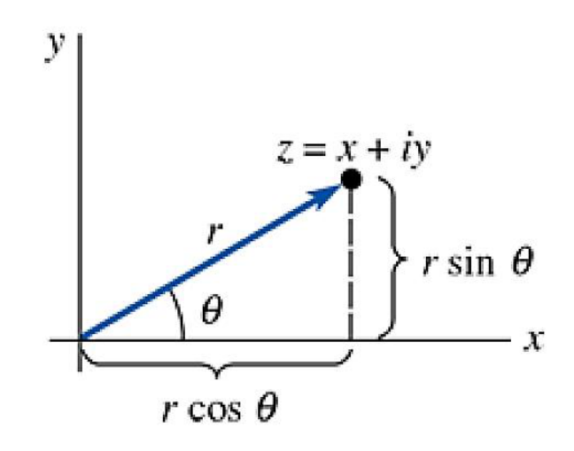

# ENGR 213 · Applied Ordinary Differential Equations
# Lecture 8: Complex Numbers, Powers & Roots (Explained)
**Concordia University · Department of Building, Civil and Environmental Engineering**  
**Instructor**: Dr. A. Haghighat M. · **Textbook Reference**: *Advanced Engineering Mathematics*, 7th Edition, Sections 17.1–17.2  
**Lecture Date**: October 2, 2026

---

## Executive Overview & Lecture Roadmap

Lecture 8 steps away from differential equations for one class to build a tool you will need constantly from here on: **complex numbers**. When we reach second-order linear ODEs such as $y'' + 2y' + 5y = 0$, the characteristic equation $m^2 + 2m + 5 = 0$ has roots $m = -1 \pm 2i$. Without complex arithmetic, polar form and De Moivre's formula, those solutions (damped oscillations of springs, circuits and structures) cannot be written down.

The lecture has two halves, matching Zill Sections 17.1 and 17.2:

| Part | Slides | Core Idea | Key Formula |
| :--- | :---: | :--- | :--- |
| **Complex numbers (17.1)** | 3–8 | Arithmetic on $z = x + iy$ treated as an ordered pair | $\dfrac{z_1}{z_2} = \dfrac{z_1 \bar{z}_2}{z_2 \bar{z}_2}$ |
| **Geometric interpretation** | 9–10 | $z$ is a point / vector in the complex plane | $\lvert z \rvert = \sqrt{x^2 + y^2}$, $\ \lvert z_1 + z_2 \rvert \le \lvert z_1 \rvert + \lvert z_2 \rvert$ |
| **Polar form (17.2)** | 11–14 | Describe $z$ by length $r$ and angle $\theta$ | $z = r(\cos\theta + i\sin\theta)$ |
| **Powers & roots (17.2)** | 15–16 | Multiply lengths, add angles | $z^n = r^n(\cos n\theta + i\sin n\theta)$, $\ w_k = r^{1/n}\left[\cos\dfrac{\theta + 2k\pi}{n} + i \sin\dfrac{\theta + 2k\pi}{n}\right]$ |

The three in-class examples (slides 7, 12 and 16) are left blank on the slides; they are fully solved below.

---

## 1. What Is a Complex Number? (Slide 3)

A **complex number** is any number of the form
$$z = x + iy, \qquad x, y \in \mathbb{R}, \qquad i^2 = -1$$

* $x = \operatorname{Re}(z)$ is the **real part**; $y = \operatorname{Im}(z)$ is the **imaginary part**. Note that the imaginary part is the *real number* $y$, not $iy$. For $z = 4 - 7i$, $\operatorname{Im}(z) = -7$.
* A real multiple of $i$ (e.g. $z = 6i$) is a **pure imaginary** number.
* **Equality**: $z_1 = z_2$ if and only if $\operatorname{Re}(z_1) = \operatorname{Re}(z_2)$ **and** $\operatorname{Im}(z_1) = \operatorname{Im}(z_2)$. One complex equation is therefore two real equations. This is the trick used later to match coefficients when solving ODEs.
* **Zero**: $x + iy = 0$ only if $x = 0$ and $y = 0$.

**Intuition.** Think of $i$ as a bookkeeping label that keeps two real numbers apart in one package. Every rule below is ordinary algebra plus the single replacement $i^2 \to -1$.

Powers of $i$ cycle with period 4, which makes simplifying quick:
$$i^1 = i, \quad i^2 = -1, \quad i^3 = -i, \quad i^4 = 1, \quad i^{4k + r} = i^r$$

---

## 2. Arithmetic Operations (Slides 4–5)

For $z_1 = x_1 + iy_1$ and $z_2 = x_2 + iy_2$:

| Operation | Result | How to remember it |
| :--- | :--- | :--- |
| **Addition** | $z_1 + z_2 = (x_1 + x_2) + i(y_1 + y_2)$ | Add like parts |
| **Subtraction** | $z_1 - z_2 = (x_1 - x_2) + i(y_1 - y_2)$ | Subtract like parts |
| **Multiplication** | $z_1 z_2 = (x_1 x_2 - y_1 y_2) + i(y_1 x_2 + x_1 y_2)$ | FOIL, then $i^2 = -1$ |
| **Division** | $\dfrac{z_1}{z_2} = \dfrac{x_1 x_2 + y_1 y_2}{x_2^2 + y_2^2} + i\,\dfrac{y_1 x_2 - x_1 y_2}{x_2^2 + y_2^2}$ | Multiply top and bottom by $\bar{z}_2$ |

**Where the multiplication formula comes from:**
$$(x_1 + iy_1)(x_2 + iy_2) = x_1x_2 + ix_1y_2 + iy_1x_2 + i^2 y_1y_2 = (x_1x_2 - y_1y_2) + i(x_1y_2 + y_1x_2)$$

Do not memorise the division formula. Derive it every time by multiplying numerator and denominator by the conjugate of the denominator (Section 3). That turns the denominator into the real number $x_2^2 + y_2^2$.

The **modulus** (absolute value) is
$$\lvert z \rvert = \sqrt{x^2 + y^2}$$

The usual algebra laws all hold (slide 5):
* **Commutative**: $z_1 + z_2 = z_2 + z_1$ and $z_1 z_2 = z_2 z_1$
* **Associative**: $z_1 + (z_2 + z_3) = (z_1 + z_2) + z_3$ and $z_1(z_2 z_3) = (z_1 z_2) z_3$
* **Distributive**: $z_1(z_2 + z_3) = z_1 z_2 + z_1 z_3$

---

## 3. The Complex Conjugate (Slides 5–6)

Changing the sign of the imaginary part gives the **conjugate**:
$$z = x + iy \quad \Longrightarrow \quad \bar{z} = x - iy$$

If $z$ is real (e.g. $z = 7$), then $\bar{z} = z = 7$. Geometrically, $\bar{z}$ is the **mirror image of $z$ across the real axis**.

**Conjugation passes through every operation** (slide 6):
$$\overline{z_1 + z_2} = \bar{z}_1 + \bar{z}_2, \qquad \overline{z_1 - z_2} = \bar{z}_1 - \bar{z}_2, \qquad \overline{z_1 z_2} = \bar{z}_1 \bar{z}_2, \qquad \overline{\left(\frac{z_1}{z_2}\right)} = \frac{\bar{z}_1}{\bar{z}_2}$$

**Sum, difference and product with the conjugate:**
$$z + \bar{z} = 2x, \qquad z - \bar{z} = 2iy, \qquad z\bar{z} = x^2 + y^2 = \lvert z \rvert^2$$

which can be rearranged to extract the parts:
$$\operatorname{Re}(z) = \frac{z + \bar{z}}{2}, \qquad \operatorname{Im}(z) = \frac{z - \bar{z}}{2i}$$

**Why $z\bar{z}$ matters.** $z\bar{z} = x^2 + y^2$ is always **real and non-negative**. That is exactly why multiplying by the conjugate removes $i$ from a denominator.

**ODE connection.** Real polynomials (such as characteristic polynomials) have complex roots in **conjugate pairs** $\alpha \pm i\beta$. Adding and subtracting the two complex solutions (using $z + \bar{z} = 2x$ and $z - \bar{z} = 2iy$) is how we will get the *real* solutions $e^{\alpha x}\cos\beta x$ and $e^{\alpha x}\sin\beta x$.

---

## 4. Example 1 — Division and Reciprocal (Slide 7, solved)

> **Problem.** If $z_1 = 2 - 3i$ and $z_2 = 4 + 6i$, find $\dfrac{z_1}{z_2}$ and $\dfrac{1}{z_1}$.

### Part (a): $z_1 / z_2$

**Step 1 — Multiply top and bottom by the conjugate of the denominator**, $\bar{z}_2 = 4 - 6i$:
$$\frac{z_1}{z_2} = \frac{2 - 3i}{4 + 6i} \cdot \frac{4 - 6i}{4 - 6i}$$

**Step 2 — Numerator** (FOIL):
$$(2 - 3i)(4 - 6i) = 8 - 12i - 12i + 18i^2 = 8 - 24i - 18 = -10 - 24i$$

**Step 3 — Denominator** ($z\bar{z} = x^2 + y^2$):
$$(4 + 6i)(4 - 6i) = 4^2 + 6^2 = 16 + 36 = 52$$

**Step 4 — Divide each part and reduce:**
$$\frac{z_1}{z_2} = \frac{-10 - 24i}{52} = -\frac{10}{52} - \frac{24}{52}i = \boxed{-\frac{5}{26} - \frac{6}{13}i}$$

### Part (b): $1 / z_1$

$$\frac{1}{z_1} = \frac{1}{2 - 3i} \cdot \frac{2 + 3i}{2 + 3i} = \frac{2 + 3i}{2^2 + 3^2} = \frac{2 + 3i}{13} = \boxed{\frac{2}{13} + \frac{3}{13}i}$$

**Check.** $z_1 \cdot \dfrac{1}{z_1}$ should equal 1:
$$(2 - 3i)\left(\frac{2 + 3i}{13}\right) = \frac{4 + 6i - 6i - 9i^2}{13} = \frac{4 + 9}{13} = 1 \ \checkmark$$

> **Exam habit:** always present the answer in the form $a + bi$ with the real and imaginary parts separated. $\dfrac{-10 - 24i}{52}$ is not a finished answer.

---

## 5. Geometric Interpretation: The Complex Plane (Slide 9)

*Figure 1: The complex number $z = x + iy$ drawn as the point $(x, y)$ and as a vector from the origin (Lecture 8, slide 9; Zill Fig. 17.1.1).*

**What the figure shows.** Since $z = x + iy$ is fixed by the ordered pair $(x, y)$, every complex number is a point in a plane called the **complex plane** or **z-plane**:
* the horizontal axis is the **real axis** (it carries $x = \operatorname{Re} z$);
* the vertical axis is the **imaginary axis** (it carries $y = \operatorname{Im} z$);
* the blue arrow is the **position vector** of $z$, from the origin to $(x, y)$.

For example $z = 2 - 3i$ is the point $(2, -3)$ in the fourth quadrant. The **length of the arrow** is the distance from the origin, which is exactly the modulus:
$$\lvert z \rvert = \sqrt{x^2 + y^2}$$

This picture is what makes complex numbers useful. Addition becomes vector addition, the conjugate becomes reflection in the real axis, and (Section 7) multiplication becomes *stretching and rotating*.

---

## 6. Modulus and the Triangle Inequality (Slide 10)

*Figure 2: The sum $z_1 + z_2$ (red) is the diagonal of the parallelogram built on $z_1$ and $z_2$ (Lecture 8, slide 10).*

**What the figure shows.** Complex numbers add exactly like vectors. Put the tail of $z_1$ (dashed copy) on the head of $z_2$; the red arrow from the origin to the end is $z_1 + z_2$. The three arrows form a triangle, and **one side of a triangle can never be longer than the other two sides combined**:
$$\lvert z_1 + z_2 \rvert \le \lvert z_1 \rvert + \lvert z_2 \rvert \qquad \text{(triangle inequality)}$$

Equality holds only when $z_1$ and $z_2$ point in the same direction (the triangle collapses into a line). Applying the rule repeatedly gives the general form:
$$\lvert z_1 + z_2 + z_3 + \cdots + z_n \rvert \le \lvert z_1 \rvert + \lvert z_2 \rvert + \lvert z_3 \rvert + \cdots + \lvert z_n \rvert$$

**Quick check with numbers.** $z_1 = 3$, $z_2 = 4i$: $\lvert z_1 + z_2 \rvert = \lvert 3 + 4i \rvert = 5$, while $\lvert z_1 \rvert + \lvert z_2 \rvert = 3 + 4 = 7$. Indeed $5 \le 7$.

---

## 7. Polar Form (Slide 11)

*Figure 3: Rectangular coordinates $(x, y)$ and polar coordinates $(r, \theta)$ of the same complex number (Lecture 8, slide 11).*

**What the figure shows.** Instead of giving the point by its horizontal and vertical distances $(x, y)$, we can give its **distance from the origin $r$** and its **angle $\theta$** from the positive real axis. The right triangle in the figure gives
$$x = r\cos\theta, \qquad y = r\sin\theta$$

so
$$z = x + iy = r(\cos\theta + i\sin\theta) \qquad \text{(polar form of } z\text{)}$$

with
$$r = \lvert z \rvert = \sqrt{x^2 + y^2}, \qquad \tan\theta = \frac{y}{x}$$

**Rules for the angle:**
* $\theta$ is the **argument** of $z$, written $\theta = \arg z$.
* $\theta$ is in **radians**, positive counter-clockwise and negative clockwise from the positive real axis.
* The argument is not unique: $\theta$, $\theta + 2\pi$, $\theta - 2\pi$, … all describe the same point.
* The value in $-\pi < \theta \le \pi$ is the **principal argument**, written $\operatorname{Arg} z$.

### The most common mistake: $\tan^{-1}(y/x)$ alone is not enough

A calculator returns $\tan^{-1}(y/x)$ in $(-\pi/2, \pi/2)$, i.e. only quadrants I and IV. Always **sketch the point first** and correct for the quadrant:

| Quadrant of $(x, y)$ | Principal argument |
| :--- | :--- |
| I ($x > 0, y > 0$) or IV ($x > 0, y < 0$) | $\theta = \tan^{-1}(y/x)$ |
| II ($x < 0, y > 0$) | $\theta = \tan^{-1}(y/x) + \pi$ |
| III ($x < 0, y < 0$) | $\theta = \tan^{-1}(y/x) - \pi$ |

For example $z = -1 - i$ and $z = 1 + i$ both have $y/x = 1$, but their arguments are $-3\pi/4$ and $\pi/4$.

---

## 8. Example 2 — Converting to Polar Form (Slide 12, solved)

> **Problem.** Express $z = 1 - \sqrt{3}\,i$ in polar form.

**Step 1 — Locate the point.** $x = 1 > 0$ and $y = -\sqrt{3} < 0$: the point $(1, -\sqrt{3})$ is in **quadrant IV**.

**Step 2 — Modulus:**
$$r = \lvert z \rvert = \sqrt{1^2 + (-\sqrt{3})^2} = \sqrt{1 + 3} = 2$$

**Step 3 — Argument:**
$$\tan\theta = \frac{y}{x} = \frac{-\sqrt{3}}{1} = -\sqrt{3}$$
The reference angle with $\tan = \sqrt{3}$ is $\pi/3$. In quadrant IV, the principal argument is
$$\theta = -\frac{\pi}{3}$$

**Step 4 — Write the polar form:**
$$\boxed{z = 2\left[\cos\left(-\frac{\pi}{3}\right) + i\sin\left(-\frac{\pi}{3}\right)\right]}$$

**Check:** $2\cos(-\pi/3) = 2 \cdot \tfrac{1}{2} = 1$ and $2\sin(-\pi/3) = 2 \cdot \left(-\tfrac{\sqrt{3}}{2}\right) = -\sqrt{3}$. ✓

> Any other argument $-\dfrac{\pi}{3} + 2k\pi$ (for example $\dfrac{5\pi}{3}$) is also correct, but $-\dfrac{\pi}{3}$ is the **principal** one because it lies in $(-\pi, \pi]$.

---

## 9. Multiplication and Division in Polar Form (Slide 14)

For $z_1 = r_1(\cos\theta_1 + i\sin\theta_1)$ and $z_2 = r_2(\cos\theta_2 + i\sin\theta_2)$:
$$z_1 z_2 = r_1 r_2\left[\cos(\theta_1 + \theta_2) + i\sin(\theta_1 + \theta_2)\right]$$
$$\frac{z_1}{z_2} = \frac{r_1}{r_2}\left[\cos(\theta_1 - \theta_2) + i\sin(\theta_1 - \theta_2)\right]$$

**Proof of the product rule** (it is just the angle-addition identities):
$$z_1 z_2 = r_1 r_2\left[(\cos\theta_1\cos\theta_2 - \sin\theta_1\sin\theta_2) + i(\sin\theta_1\cos\theta_2 + \cos\theta_1\sin\theta_2)\right] = r_1 r_2\left[\cos(\theta_1 + \theta_2) + i\sin(\theta_1 + \theta_2)\right]$$

In words: **multiply (divide) the lengths, add (subtract) the angles.**
$$\lvert z_1 z_2 \rvert = \lvert z_1 \rvert \lvert z_2 \rvert, \qquad \arg(z_1 z_2) = \arg z_1 + \arg z_2$$
$$\left\lvert \frac{z_1}{z_2} \right\rvert = \frac{\lvert z_1 \rvert}{\lvert z_2 \rvert}, \qquad \arg\left(\frac{z_1}{z_2}\right) = \arg z_1 - \arg z_2$$

**Geometric meaning.** Multiplying by $z_2$ **stretches** a vector by $r_2$ and **rotates** it by $\theta_2$. Multiplying by $i = 1(\cos\frac{\pi}{2} + i\sin\frac{\pi}{2})$ is a pure $90°$ counter-clockwise rotation.

> **Caution:** $\arg(z_1 z_2) = \arg z_1 + \arg z_2$ holds for *some* choice of arguments, but not always for the *principal* ones. Example: $\operatorname{Arg}(-1) = \pi$, but $\operatorname{Arg}((-1)(-1)) = \operatorname{Arg}(1) = 0 \ne 2\pi$. Reduce the sum back into $(-\pi, \pi]$.

---

## 10. Integer Powers and De Moivre's Formula (Slide 15)

Applying the product rule $n$ times to $z = r(\cos\theta + i\sin\theta)$:
$$z^n = r^n(\cos n\theta + i\sin n\theta), \qquad n = 0, \pm 1, \pm 2, \ldots$$

When $r = 1$ this is **De Moivre's formula**:
$$(\cos\theta + i\sin\theta)^n = \cos n\theta + i\sin n\theta$$

> **Slide 15 typo:** the slide prints the right-hand side as $\cos n\theta + i\sin\theta$. The angle in the sine must also be multiplied by $n$: $\cos n\theta + i\sin n\theta$.

**Worked illustration: $(1 + i)^8$ the fast way.** $1 + i = \sqrt{2}\left(\cos\frac{\pi}{4} + i\sin\frac{\pi}{4}\right)$, so
$$(1 + i)^8 = (\sqrt{2})^8\left[\cos 2\pi + i\sin 2\pi\right] = 16(1 + 0i) = 16$$
Expanding $(1 + i)^8$ with the binomial theorem would take eight terms. In polar form it takes one line.

**Bonus — De Moivre generates trig identities.** With $n = 2$:
$$(\cos\theta + i\sin\theta)^2 = \cos^2\theta - \sin^2\theta + 2i\sin\theta\cos\theta = \cos 2\theta + i\sin 2\theta$$
Matching real and imaginary parts gives $\cos 2\theta = \cos^2\theta - \sin^2\theta$ and $\sin 2\theta = 2\sin\theta\cos\theta$.

---

## 11. $n$th Roots of a Complex Number (Slide 15)

A number $w$ is an **$n$th root** of a nonzero $z$ if $w^n = z$. Write both in polar form:
$$z = r(\cos\theta + i\sin\theta), \qquad w = \rho(\cos\phi + i\sin\phi)$$

**Derivation.** By De Moivre, $w^n = z$ becomes
$$\rho^n(\cos n\phi + i\sin n\phi) = r(\cos\theta + i\sin\theta)$$
Two complex numbers in polar form are equal when their **lengths are equal** and their **angles differ by a multiple of $2\pi$**:
$$\rho^n = r \implies \rho = r^{1/n} \quad (\text{the real positive root}), \qquad n\phi = \theta + 2k\pi \implies \phi = \frac{\theta + 2k\pi}{n}$$

so the roots are
$$w_k = r^{1/n}\left[\cos\left(\frac{\theta + 2k\pi}{n}\right) + i\sin\left(\frac{\theta + 2k\pi}{n}\right)\right], \qquad k = 0, 1, 2, \ldots, n - 1$$

**Why only $k = 0, \ldots, n - 1$?** At $k = n$ the angle is $\frac{\theta}{n} + 2\pi$, which is the same as $k = 0$. So there are **exactly $n$ distinct roots**.

**Geometry of the roots.** All $n$ roots have the same length $r^{1/n}$, so they lie on a **circle of radius $r^{1/n}$**. Consecutive roots are separated by an angle of $2\pi/n$, so they form the vertices of a **regular $n$-sided polygon**. This is a good check on any answer.

---

## 12. Example 3 — Fourth Roots of $1 + i$ (Slide 16, solved)

> **Problem.** Find the fourth roots of $z = 1 + i$.

**Step 1 — Polar form of $z$.** The point $(1, 1)$ is in quadrant I:
$$r = \sqrt{1^2 + 1^2} = \sqrt{2}, \qquad \theta = \tan^{-1}(1) = \frac{\pi}{4}$$

**Step 2 — Modulus of every root** ($n = 4$):
$$r^{1/4} = (\sqrt{2})^{1/4} = 2^{1/8} \approx 1.0905$$

**Step 3 — Angles:**
$$\phi_k = \frac{\frac{\pi}{4} + 2k\pi}{4} = \frac{\pi}{16} + \frac{k\pi}{2}, \qquad k = 0, 1, 2, 3$$

**Step 4 — List the four roots:**

| $k$ | Angle $\phi_k$ | Exact root | Numerical value |
| :---: | :---: | :--- | :--- |
| 0 | $\dfrac{\pi}{16}$ ($11.25°$) | $2^{1/8}\left[\cos\frac{\pi}{16} + i\sin\frac{\pi}{16}\right]$ | $w_0 \approx 1.0696 + 0.2127i$ |
| 1 | $\dfrac{9\pi}{16}$ ($101.25°$) | $2^{1/8}\left[\cos\frac{9\pi}{16} + i\sin\frac{9\pi}{16}\right]$ | $w_1 \approx -0.2127 + 1.0696i$ |
| 2 | $\dfrac{17\pi}{16}$ ($191.25°$) | $2^{1/8}\left[\cos\frac{17\pi}{16} + i\sin\frac{17\pi}{16}\right]$ | $w_2 \approx -1.0696 - 0.2127i$ |
| 3 | $\dfrac{25\pi}{16}$ ($281.25°$) | $2^{1/8}\left[\cos\frac{25\pi}{16} + i\sin\frac{25\pi}{16}\right]$ | $w_3 \approx 0.2127 - 1.0696i$ |

(Using $\cos\frac{\pi}{16} \approx 0.98079$ and $\sin\frac{\pi}{16} \approx 0.19509$, so $2^{1/8}\cos\frac{\pi}{16} \approx 1.0696$ and $2^{1/8}\sin\frac{\pi}{16} \approx 0.2127$.)

**Step 5 — Sanity checks:**
* The roots are $90°$ ($= 2\pi/4$) apart: each one is the previous one multiplied by $i$. The numbers show it: $i \cdot (1.0696 + 0.2127i) = -0.2127 + 1.0696i$. ✓
* They are the corners of a **square** on the circle of radius $2^{1/8} \approx 1.09$.
* $w_0^4 = 2^{4/8}\left[\cos\frac{\pi}{4} + i\sin\frac{\pi}{4}\right] = \sqrt{2}\left(\frac{1}{\sqrt{2}} + \frac{i}{\sqrt{2}}\right) = 1 + i$. ✓

---

## 13. Why This Matters for ODEs (Looking Ahead)

Complex numbers are the language of second-order linear equations:
* The characteristic equation $am^2 + bm + c = 0$ has complex roots $m = \alpha \pm i\beta$ whenever $b^2 - 4ac < 0$. The conjugate rules (Section 3) guarantee they come in pairs.
* **Euler's formula** $e^{i\theta} = \cos\theta + i\sin\theta$ makes the polar form compact: $z = re^{i\theta}$. The product rule then reads $r_1e^{i\theta_1} \cdot r_2e^{i\theta_2} = r_1r_2e^{i(\theta_1 + \theta_2)}$, which is just the law of exponents.
* The complex solution $e^{(\alpha + i\beta)x} = e^{\alpha x}(\cos\beta x + i\sin\beta x)$ splits into the two real solutions $e^{\alpha x}\cos\beta x$ and $e^{\alpha x}\sin\beta x$, describing **damped vibrations** of springs, RLC circuits and building structures.
* Roots of $m^n = c$ (Section 11) appear in higher-order equations such as $y^{(4)} + 4y = 0$, whose characteristic roots are the fourth roots of $-4$.

---

## 14. Exam Pitfalls & Traps

### Trap 1: Writing $\operatorname{Im}(z) = iy$
$\operatorname{Im}(3 - 5i) = -5$, not $-5i$. Both the real and imaginary parts are **real numbers**.

### Trap 2: Wrong quadrant for the argument
$\tan^{-1}(y/x)$ only gives quadrants I and IV. For $z = -1 + \sqrt{3}i$ (quadrant II), $\tan^{-1}(-\sqrt{3}) = -\pi/3$ is **wrong**; the principal argument is $-\pi/3 + \pi = 2\pi/3$. Always sketch the point.

### Trap 3: Degrees vs. radians
The course states the argument in **radians**. Write $-\pi/3$, not $-60°$, in final answers (degrees are fine as a side note).

### Trap 4: Only one root
"Find the cube roots" means **all three**. An $n$th root problem always has $n$ answers ($k = 0$ to $n - 1$).

### Trap 5: Forgetting to take the root of the modulus
The roots have modulus $r^{1/n}$, not $r$. For the fourth roots of $1 + i$ that is $(\sqrt{2})^{1/4} = 2^{1/8}$, not $\sqrt{2}$.

### Trap 6: Leaving $i$ in a denominator
Answers such as $\dfrac{1}{2 - 3i}$ are not simplified. Multiply by the conjugate and write $a + bi$.

---

## 15. One-Glance Formula Summary

| Concept | Formula |
| :--- | :--- |
| Conjugate | $\bar{z} = x - iy$ |
| Modulus | $\lvert z \rvert = \sqrt{x^2 + y^2} = \sqrt{z\bar{z}}$ |
| Real / imaginary part | $\operatorname{Re} z = \dfrac{z + \bar{z}}{2}$, $\ \operatorname{Im} z = \dfrac{z - \bar{z}}{2i}$ |
| Division | $\dfrac{z_1}{z_2} = \dfrac{z_1\bar{z}_2}{\lvert z_2 \rvert^2}$ |
| Triangle inequality | $\lvert z_1 + z_2 \rvert \le \lvert z_1 \rvert + \lvert z_2 \rvert$ |
| Polar form | $z = r(\cos\theta + i\sin\theta)$, $\ r = \lvert z \rvert$, $\ \tan\theta = y/x$ |
| Product / quotient | Multiply / divide the moduli; add / subtract the arguments |
| Powers | $z^n = r^n(\cos n\theta + i\sin n\theta)$ |
| Roots | $w_k = r^{1/n}\left[\cos\dfrac{\theta + 2k\pi}{n} + i\sin\dfrac{\theta + 2k\pi}{n}\right]$, $\ k = 0, \ldots, n - 1$ |
