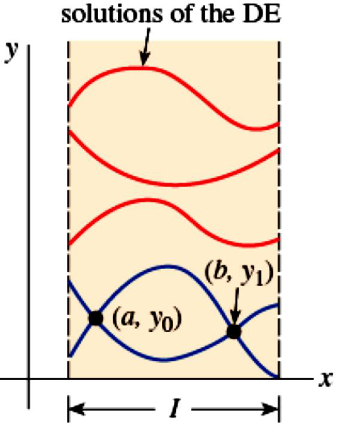
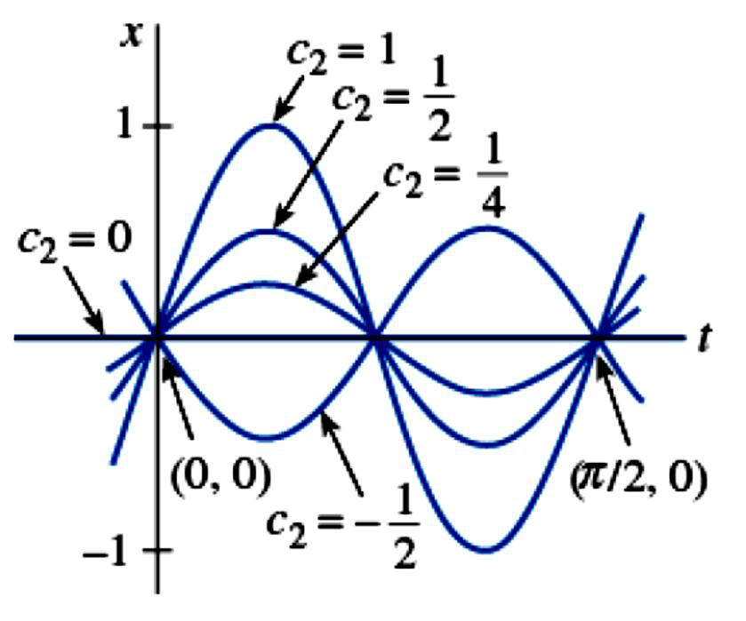
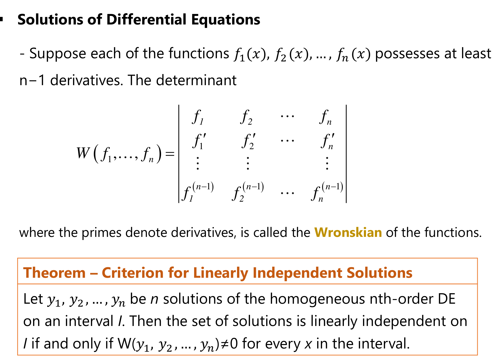
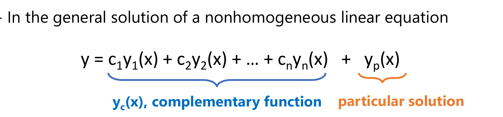

# ENGR 213 · Applied Ordinary Differential Equations
# Lecture 9: Theory of Higher-Order Linear Equations (Explained)
**Concordia University · Department of Building, Civil and Environmental Engineering**  
**Instructor**: Dr. A. Haghighat M. · **Textbook Reference**: *Advanced Engineering Mathematics*, 7th Edition, Section 3.1  
**Lecture Date**: October 7, 2026

---

## Executive Overview & Lecture Roadmap

Lecture 9 opens Chapter 3 (higher-order differential equations). Before learning *how* to solve $ay'' + by' + cy = g(x)$, the lecture sets out *what a solution looks like* and *when one exists*. The answer is the same for every linear equation, whatever its order:

$$\boxed{\;y = \underbrace{c_1y_1 + c_2y_2 + \cdots + c_ny_n}_{y_c\text{: complementary function}} \;+\; \underbrace{y_p}_{\text{particular solution}}\;}$$

Lectures 10 onward show how to find $y_1, \dots, y_n$ (constant coefficients, Cauchy–Euler, reduction of order) and $y_p$ (undetermined coefficients, variation of parameters). Today gives the rules that make those methods valid.

| Part | Slides | Core idea | Key test or formula |
| :--- | :---: | :--- | :--- |
| **IVPs: existence & uniqueness** | 3–5 | $n$ conditions at one point give exactly one solution | $a_i(x)$, $g(x)$ continuous and $a_n(x) \neq 0$ on $I$ |
| **Boundary-value problems** | 7–9 | Conditions at two points: zero, one or infinitely many solutions | Solve for $c_1, c_2$ and check consistency |
| **Homogeneous equations & operators** | 11–13 | Write the DE as $L(y) = 0$ with $L$ linear | $L\{\alpha f + \beta g\} = \alpha L(f) + \beta L(g)$ |
| **Superposition** | 14 | Linear combinations of solutions are solutions | $y = c_1y_1 + \cdots + c_ky_k$ |
| **Linear independence & the Wronskian** | 16–19 | Independent solutions are the "building blocks" | $W(y_1, \dots, y_n) \neq 0$ |
| **Fundamental set & general solution** | 21–22 | $n$ independent solutions give every solution | $y = c_1y_1 + \cdots + c_ny_n$ |
| **Nonhomogeneous equations** | 24–27 | General solution $= y_c + y_p$; particular solutions add | $y_p = y_{p_1} + \cdots + y_{p_k}$ |

The seven in-class examples (slides 4, 5, 8–9, 19, 22, 25 and 27) are left blank on the slides. Every one of them is fully solved below. Slides 6, 10, 15, 20 and 23 are question breaks with no content.

---

## 1. Initial-Value Problems for $n$th-Order Linear Equations (Slide 3)

An **$n$th-order linear initial-value problem** is

$$a_n(x)\frac{d^ny}{dx^n} + a_{n-1}(x)\frac{d^{n-1}y}{dx^{n-1}} + \cdots + a_1(x)\frac{dy}{dx} + a_0(x)\,y = g(x) \tag{1}$$

subject to $n$ conditions **all at the same point** $x_0$:

$$y(x_0) = y_0, \qquad y'(x_0) = y_1, \qquad \dots, \qquad y^{(n-1)}(x_0) = y_{n-1}$$

**Theorem (existence of a unique solution).** Let $a_n(x), a_{n-1}(x), \dots, a_0(x)$ and $g(x)$ be continuous on an interval $I$, and let $a_n(x) \neq 0$ for every $x$ in $I$. If $x_0$ is any point of $I$, then a solution $y(x)$ of the IVP exists on $I$ and is **unique**.

**Why $n$ conditions?** An $n$th-order equation "integrates" $n$ times, so its general solution carries $n$ arbitrary constants. Each condition removes one constant. With fewer conditions you get a family; with exactly $n$ at one point you get a single curve.

**Why $a_n(x) \neq 0$?** Divide (1) by $a_n(x)$ to get the standard form $y^{(n)} = \dfrac{g - a_{n-1}y^{(n-1)} - \cdots - a_0y}{a_n}$. At a point where $a_n(x) = 0$, the highest derivative is not determined by the equation and uniqueness can fail. This is the higher-order version of the first-order Picard theorem from Lecture 2.

**How to use the theorem on an exam (3 checks):**
1. Are all coefficients $a_i(x)$ and $g(x)$ continuous on $I$?
2. Is the leading coefficient $a_n(x)$ never zero on $I$?
3. Is $x_0$ inside $I$?

If all three are yes, the solution exists and is unique. If you can *find* one function that satisfies the DE and the ICs, it is *the* solution.

---

### Example 1 (Slide 4): The trivial solution is the only solution

> For the IVP $3y''' + 5y'' - y' + 7y = 0$, $\;y(1) = 0,\; y'(1) = 0,\; y''(1) = 0$, verify the existence and uniqueness of the trivial solution $y = 0$.

**Step 1: check the hypotheses.** The equation is third-order linear with constant coefficients $a_3 = 3$, $a_2 = 5$, $a_1 = -1$, $a_0 = 7$ and $g(x) = 0$. Constants are continuous everywhere, and $a_3 = 3 \neq 0$ for all $x$. Take $I = (-\infty, \infty)$, which contains $x_0 = 1$. The theorem applies: there is **exactly one** solution on $(-\infty, \infty)$.

**Step 2: exhibit a solution.** Try $y = 0$. Then $y' = y'' = y''' = 0$, so
$$3(0) + 5(0) - 0 + 7(0) = 0 \;\checkmark, \qquad y(1) = y'(1) = y''(1) = 0 \;\checkmark$$

**Conclusion.** $y = 0$ satisfies the DE and all three ICs. By uniqueness, $y = 0$ is the **only** solution on any interval containing $x = 1$.

> **Exam insight.** A homogeneous linear DE with all-zero initial conditions (and valid hypotheses) can only have the trivial solution. Physically: a spring–mass system at rest at equilibrium with no external force stays at rest forever.

---

### Example 2 (Slide 5): Verifying a solution of a nonhomogeneous IVP

> For the IVP $y'' - 4y = 12x$, $\;y(0) = 4,\; y'(0) = 1$, verify that $y = 3e^{2x} + e^{-2x} - 3x$ is a solution.

**Step 1: differentiate.**
$$y' = 6e^{2x} - 2e^{-2x} - 3, \qquad y'' = 12e^{2x} + 4e^{-2x}$$

**Step 2: substitute into the DE.**
$$y'' - 4y = \left(12e^{2x} + 4e^{-2x}\right) - 4\left(3e^{2x} + e^{-2x} - 3x\right) = 12e^{2x} + 4e^{-2x} - 12e^{2x} - 4e^{-2x} + 12x = 12x \;\checkmark$$

**Step 3: check the initial conditions.**
$$y(0) = 3 + 1 - 0 = 4 \;\checkmark, \qquad y'(0) = 6 - 2 - 3 = 1 \;\checkmark$$

**Step 4: uniqueness.** $a_2 = 1 \neq 0$, $a_1 = 0$, $a_0 = -4$ are constants and $g(x) = 12x$ is continuous on $(-\infty, \infty)$, which contains $x_0 = 0$. So this is **the unique** solution on $(-\infty, \infty)$.

> **Preview of the structure.** Notice the shape of the answer: $\underbrace{3e^{2x} + e^{-2x}}_{\text{solves } y'' - 4y = 0} \;\underbrace{-\,3x}_{\text{solves } y'' - 4y = 12x}$. This is exactly $y = y_c + y_p$ from Section 7. Check: $(-3x)'' - 4(-3x) = 12x$.

---

## 2. Boundary-Value Problems (Slides 7–9)

A **boundary-value problem (BVP)** is a linear DE of order two or more where $y$ or its derivatives are specified at **different points**. A typical second-order BVP is

$$a_2(x)\frac{d^2y}{dx^2} + a_1(x)\frac{dy}{dx} + a_0(x)\,y = g(x), \qquad y(a) = y_0, \quad y(b) = y_1$$

The most general boundary conditions for a second-order BVP mix the value and the slope at each end:

$$A_1y(a) + B_1y'(a) = C_1, \qquad A_2y(b) + B_2y'(b) = C_2$$

(For example $B_1 = B_2 = 0$ fixes the values; $A_1 = A_2 = 0$ fixes the slopes.)

*Figure 1: Solution curves of a second-order BVP on the interval I, from Lecture 9, slide 7.*

**Reading Figure 1.** The shaded strip is the interval $I = [a, b]$. The red curves are all solutions of the DE: the general solution is a two-parameter family, so infinitely many curves satisfy the equation. The blue curves are the members that also pass through **both** marked points $(a, y_0)$ and $(b, y_1)$. Compare with an IVP: there both conditions sit at the same point (a position and a slope), which pins down a single curve. In a BVP the two conditions sit at different points, and nothing guarantees a curve through both. The figure deliberately shows **two** blue curves through the same pair of points to make that point: a BVP may have more than one solution.

**The key fact.** Even when the existence–uniqueness hypotheses hold, a BVP can have:
* **a unique solution**,
* **no solution**, or
* **infinitely many solutions**.

The only way to tell is to plug the boundary conditions into the general solution and solve for the constants.

### Example 3 (Slides 8–9): One DE, three different boundary conditions

> The DE $x'' + 16x = 0$ has the two-parameter family of solutions $x = c_1\cos 4t + c_2\sin 4t$. Solve it subject to (a) $x(0) = 0,\ x(\pi/2) = 0$; (b) $x(0) = 0,\ x(\pi/8) = 0$; (c) $x(0) = 0,\ x(\pi/2) = 1$.

First, the condition shared by all three parts:
$$x(0) = c_1\cos 0 + c_2\sin 0 = c_1 = 0 \quad\Longrightarrow\quad x = c_2\sin 4t$$

**(a) $x(\pi/2) = 0$.**
$$x(\pi/2) = c_2\sin(2\pi) = c_2 \cdot 0 = 0$$
This holds for **every** $c_2$. The BVP has **infinitely many solutions**: $x = c_2\sin 4t$, $c_2$ arbitrary.

*Figure 2: Example 3(a), from Lecture 9, slide 8. Every curve $x = c_2 \sin 4t$ passes through both boundary points.*

**Reading Figure 2.** The curves drawn are $c_2 = 1, \tfrac12, \tfrac14, 0, -\tfrac12$. The function $\sin 4t$ has period $\dfrac{2\pi}{4} = \dfrac{\pi}{2}$, so it is zero at $t = 0, \tfrac{\pi}{4}, \tfrac{\pi}{2}, \dots$ regardless of its amplitude. Scaling by $c_2$ stretches the curve vertically but cannot move these zeros. That is why every curve passes through both $(0, 0)$ and $(\pi/2, 0)$, and why the boundary conditions fail to fix $c_2$. Physically: a vibrating string fixed at both ends whose length matches a natural mode can vibrate at that mode with any amplitude.

**(b) $x(\pi/8) = 0$.**
$$x(\pi/8) = c_2\sin\left(\frac{\pi}{2}\right) = c_2 \cdot 1 = 0 \quad\Longrightarrow\quad c_2 = 0$$
The BVP has the **unique** solution $x = 0$. Here $t = \pi/8$ is a quarter period, where $\sin 4t$ is at its peak, so only the zero-amplitude curve is zero there.

**(c) $x(\pi/2) = 1$.**
$$x(\pi/2) = c_2\sin(2\pi) = 0 \neq 1$$
This is a contradiction for every $c_2$. The BVP has **no solution**: every curve satisfying $x(0) = 0$ is forced through $(\pi/2, 0)$, so none can reach $(\pi/2, 1)$.

| Part | Boundary conditions | Equation for $c_2$ | Result |
| :---: | :--- | :--- | :--- |
| (a) | $x(0) = 0,\ x(\pi/2) = 0$ | $0 = 0$ | Infinitely many: $x = c_2\sin 4t$ |
| (b) | $x(0) = 0,\ x(\pi/8) = 0$ | $c_2 = 0$ | Unique: $x = 0$ |
| (c) | $x(0) = 0,\ x(\pi/2) = 1$ | $0 = 1$ | None |

> **Exam trap.** Never assume a BVP has a unique solution. Always substitute the boundary values, write the equations for the constants, and state clearly which of the three cases you are in.

---

## 3. Homogeneous vs. Nonhomogeneous Equations (Slide 11)

$$\underbrace{a_n(x)y^{(n)} + \cdots + a_1(x)y' + a_0(x)y = 0}_{\text{homogeneous}} \qquad\qquad \underbrace{a_n(x)y^{(n)} + \cdots + a_1(x)y' + a_0(x)y = g(x)}_{\text{nonhomogeneous},\ g \not\equiv 0}$$

"Homogeneous" here means the right-hand side is zero. (This is a different use of the word from the homogeneous first-order equations $y = ux$ of Lecture 5.) Throughout the lecture, on a common interval $I$, we assume:

1. the coefficients $a_i(x)$, $i = 0, 1, \dots, n$, are continuous;
2. the right-hand side $g(x)$ is continuous; and
3. $a_n(x) \neq 0$ for every $x$ in $I$.

**Strategy for the whole chapter.** To solve a nonhomogeneous equation we will *first* solve the associated homogeneous equation (set $g = 0$), *then* find one particular solution. Sections 4–6 handle the homogeneous part; Section 7 adds $g(x)$.

---

## 4. Differential Operators (Slides 12–13)

Write differentiation as the operator $D$: $\dfrac{dy}{dx} = Dy$. Higher derivatives are repeated applications:

$$\frac{d}{dx}\left(\frac{dy}{dx}\right) = \frac{d^2y}{dx^2} = D(Dy) = D^2y, \qquad \text{and in general} \qquad \frac{d^ny}{dx^n} = D^ny$$

The **$n$th-order differential operator** packages the whole left-hand side of the DE:

$$L = a_n(x)D^n + a_{n-1}(x)D^{n-1} + \cdots + a_1(x)D + a_0(x)$$

so the homogeneous and nonhomogeneous equations become simply

$$L(y) = 0 \qquad\text{and}\qquad L(y) = g(x)$$

**Example (slide 13).** $y'' + 5y' + 6y = 5x - 3$ becomes $(D^2 + 5D + 6)\,y = 5x - 3$. With constant coefficients the operator can even be factored like a polynomial: $D^2 + 5D + 6 = (D + 2)(D + 3)$. This idea returns when we study annihilator operators.

**Linearity: the property everything else rests on (slide 12).**
$$D(cf) = c\,Df, \qquad D(f + g) = Df + Dg \qquad\Longrightarrow\qquad L\{\alpha f(x) + \beta g(x)\} = \alpha L(f(x)) + \beta L(g(x))$$

In words: $L$ of a combination is the same combination of the $L$'s. Because derivatives of sums are sums of derivatives, and multiplying by $a_i(x)$ distributes, $L$ inherits this from $D$. A **nonlinear** term such as $y^2$ or $\sin y$ breaks it: $(y_1 + y_2)^2 \neq y_1^2 + y_2^2$. That is why none of the theory below applies to nonlinear equations such as the logistic model of Lecture 7.

---

## 5. The Superposition Principle (Slide 14)

**Theorem (superposition, homogeneous equations).** If $y_1, y_2, \dots, y_k$ are solutions of the homogeneous $n$th-order equation on $I$, then the linear combination
$$y = c_1y_1(x) + c_2y_2(x) + \cdots + c_ky_k(x)$$
is also a solution on $I$ for any constants $c_1, \dots, c_k$.

**One-line proof using linearity:**
$$L(c_1y_1 + \cdots + c_ky_k) = c_1\underbrace{L(y_1)}_{0} + \cdots + c_k\underbrace{L(y_k)}_{0} = 0$$

**Corollaries.**
* (a) A constant multiple $y = c_1y_1$ of a solution is a solution. (Take $k = 1$.)
* (b) A homogeneous linear DE always has the **trivial solution** $y = 0$. (Take every $c_i = 0$.)

**Quick check.** $y_1 = x^2$ and $y_2 = x^2\ln x$ both solve $x^3y''' - 2xy' + 4y = 0$ on $(0, \infty)$ (Zill §3.1), so $y = c_1x^2 + c_2x^2\ln x$ does as well.

> **Warning.** Superposition is for **homogeneous** equations. If $L(y_1) = g$ and $L(y_2) = g$, then $L(y_1 + y_2) = 2g \neq g$. The sum of two solutions of a nonhomogeneous equation is **not** a solution of the same equation. Section 7 states the correct version.

---

## 6. Linear Independence, the Wronskian and the General Solution (Slides 16–22)

Superposition lets us combine solutions, but which ones, and how many? If $y_2 = 3y_1$, then $c_1y_1 + c_2y_2 = (c_1 + 3c_2)y_1$ is really a one-constant family, and adding $y_2$ gained nothing. We need solutions that are genuinely different: **linearly independent** ones.

### 6.1 Definition (slides 16–17)

Functions $f_1, f_2, \dots, f_n$ are **linearly dependent** on $I$ if there are constants $c_1, \dots, c_n$, **not all zero**, with
$$c_1f_1(x) + c_2f_2(x) + \cdots + c_nf_n(x) = 0 \quad \text{for every } x \text{ in } I$$
If the only way to make the combination identically zero is $c_1 = c_2 = \cdots = c_n = 0$, the functions are **linearly independent**.

**Two functions.** Suppose $c_1f_1 + c_2f_2 = 0$ with $c_1 \neq 0$. Then $f_1(x) = \left(-\dfrac{c_2}{c_1}\right)f_2(x)$. So two functions are dependent exactly when **one is a constant multiple of the other**. Equivalently, $f_1, f_2$ are independent on $I$ when the ratio $f_1/f_2$ is **not constant** on $I$.

**$n$ functions.** The set is dependent when **at least one function is a linear combination of the others**. For three functions: $f_3(x) = c_1f_1(x) + c_2f_2(x)$ for all $x$ in $I$.

**Worked examples for the blank "e.g." on slide 17 (Zill §3.1):**
* $f_1 = \sin 2x$, $f_2 = \sin x\cos x$ are **dependent** on $(-\infty, \infty)$: $\tfrac12\sin 2x - \sin x\cos x = 0$ (from $\sin 2x = 2\sin x\cos x$), with $c_1 = \tfrac12$, $c_2 = -1$.
* $f_1 = \cos^2 x$, $f_2 = \sin^2 x$, $f_3 = \sec^2 x$, $f_4 = \tan^2 x$ are **dependent** on $(-\pi/2, \pi/2)$: $c_1\cos^2 x + c_2\sin^2 x + c_3\sec^2 x + c_4\tan^2 x = 0$ with $c_1 = c_2 = 1$, $c_3 = -1$, $c_4 = 1$, using $\cos^2 x + \sin^2 x = 1$ and $1 + \tan^2 x = \sec^2 x$.
* $f_1 = \sqrt{x} + 5$, $f_2 = \sqrt{x} + 5x$, $f_3 = x - 1$, $f_4 = x^2$ are **dependent** on $(0, \infty)$, because $f_2 = 1\cdot f_1 + 5\cdot f_3 + 0\cdot f_4$. Check: $(\sqrt{x} + 5) + 5(x - 1) = \sqrt{x} + 5x$.
* $f_1 = x$, $f_2 = \lvert x \rvert$ are **independent** on $(-\infty, \infty)$: the ratio is $+1$ for $x > 0$ and $-1$ for $x < 0$, so it is not constant. On $(0, \infty)$ alone they are identical, hence dependent. **The interval matters.**

### 6.2 The Wronskian (slide 18)

Checking the definition by hand gets messy beyond two functions. The **Wronskian** turns the test into a determinant. If each $f_i$ has at least $n - 1$ derivatives,

$$W(f_1, f_2, \dots, f_n) = \begin{vmatrix} f_1 & f_2 & \cdots & f_n \\ f_1' & f_2' & \cdots & f_n' \\ \vdots & \vdots & & \vdots \\ f_1^{(n-1)} & f_2^{(n-1)} & \cdots & f_n^{(n-1)} \end{vmatrix}$$

Row 1 holds the functions, row 2 their first derivatives, and so on down to the $(n-1)$th derivatives. For two functions:
$$W(f_1, f_2) = \begin{vmatrix} f_1 & f_2 \\ f_1' & f_2' \end{vmatrix} = f_1f_2' - f_2f_1'$$

*Figure 3: The Wronskian and the independence criterion, from Lecture 9, slide 18.*

**Theorem (criterion for linearly independent solutions).** Let $y_1, \dots, y_n$ be $n$ **solutions** of the homogeneous $n$th-order linear DE on $I$. Then the set is linearly independent on $I$ **if and only if** $W(y_1, \dots, y_n) \neq 0$ for every $x$ in $I$.

**Why the determinant works.** Suppose $c_1y_1 + \cdots + c_ny_n = 0$ for all $x$. Differentiating $n - 1$ times gives $n$ linear equations in the unknowns $c_1, \dots, c_n$, and the coefficient matrix of that system is exactly the Wronskian matrix. A nonzero determinant means the only solution is $c_1 = \cdots = c_n = 0$: independence.

**Reading Figure 3 carefully.** The theorem's hypothesis is that the $y_i$ are *solutions of the same homogeneous linear DE*. For such solutions a stronger fact holds (Abel's identity): $W$ is either **identically zero** on $I$ or **never zero** on $I$. So computing $W$ at one convenient point is enough. For arbitrary functions that are not solutions of one DE, $W = 0$ does *not* prove dependence. Use the "if and only if" only for solutions.

### Example 4 (Slide 19): A Cauchy–Euler equation with oscillating solutions

> For $x^2y'' + 7xy' + 13y = 0$ on $(0, \infty)$, show that $y_1 = \dfrac{\cos(2\ln x)}{x^3}$ and $y_2 = \dfrac{\sin(2\ln x)}{x^3}$ form a fundamental set, and write the general solution.

Write $C = \cos(2\ln x)$ and $S = \sin(2\ln x)$. By the chain rule, $\dfrac{d}{dx}C = -\dfrac{2S}{x}$ and $\dfrac{d}{dx}S = \dfrac{2C}{x}$.

**Step 1: verify $y_1 = x^{-3}C$ is a solution.**
$$y_1' = -3x^{-4}C + x^{-3}\left(-\frac{2S}{x}\right) = x^{-4}(-3C - 2S)$$
$$\begin{aligned} y_1'' &= -4x^{-5}(-3C - 2S) + x^{-4}\left(\frac{6S}{x} - \frac{4C}{x}\right) \\ &= x^{-5}(12C + 8S + 6S - 4C) = x^{-5}(8C + 14S) \end{aligned}$$
Substitute:
$$\begin{aligned} x^2y_1'' + 7xy_1' + 13y_1 &= x^{-3}\left[(8C + 14S) + 7(-3C - 2S) + 13C\right] \\ &= x^{-3}\left[(8 - 21 + 13)C + (14 - 14)S\right] = 0 \;\checkmark \end{aligned}$$

**Step 2: verify $y_2 = x^{-3}S$ the same way.**
$$y_2' = x^{-4}(-3S + 2C), \qquad y_2'' = x^{-5}(8S - 14C)$$
$$x^{-3}\left[(8S - 14C) + 7(-3S + 2C) + 13S\right] = x^{-3}\left[(8 - 21 + 13)S + (-14 + 14)C\right] = 0 \;\checkmark$$

**Step 3: the Wronskian.**
$$W(y_1, y_2) = y_1y_2' - y_2y_1' = x^{-3}C \cdot x^{-4}(2C - 3S) - x^{-3}S \cdot x^{-4}(-3C - 2S)$$
$$= x^{-7}\left[2C^2 - 3CS + 3CS + 2S^2\right] = x^{-7}\cdot 2\left(C^2 + S^2\right) = \frac{2}{x^7}$$

**Step 4: conclude.** $W = 2/x^7 \neq 0$ for every $x$ in $(0, \infty)$, so $y_1, y_2$ are linearly independent: a fundamental set for this second-order equation. The general solution is
$$\boxed{\,y = \frac{1}{x^3}\left[c_1\cos(2\ln x) + c_2\sin(2\ln x)\right], \qquad x > 0\,}$$

> **Where do these come from? (preview of Cauchy–Euler, Zill §3.6).** Try $y = x^m$: $x^2 m(m-1)x^{m-2} + 7x\,m x^{m-1} + 13x^m = x^m(m^2 + 6m + 13) = 0$, so $m = -3 \pm 2i$. Using $x^{2i} = e^{2i\ln x} = \cos(2\ln x) + i\sin(2\ln x)$ (Euler's formula, Lecture 8), the real and imaginary parts of $x^{-3 + 2i}$ are exactly $y_1$ and $y_2$. Why is the interval $(0, \infty)$? Because $\ln x$ needs $x > 0$, and the leading coefficient $x^2$ vanishes at $x = 0$.

### 6.3 Fundamental set and general solution (slide 21)

* A **fundamental set of solutions** on $I$ is any set of $n$ linearly independent solutions $y_1, \dots, y_n$ of the homogeneous $n$th-order equation.
* **Existence theorem.** A fundamental set always exists on $I$ (under the standing assumptions).
* **General solution (homogeneous).** If $y_1, \dots, y_n$ is a fundamental set on $I$, then **every** solution on $I$ has the form
$$y = c_1y_1(x) + c_2y_2(x) + \cdots + c_ny_n(x)$$

Two consequences to remember:
* You need **exactly $n$** independent solutions for an $n$th-order equation: 2 for $y''$, 3 for $y'''$.
* A fundamental set is **not unique**. Any $n$ independent solutions work (Example 5 shows a second choice).

### Example 5 (Slide 22): $y'' - 9y = 0$ with $y_1 = e^{3x}$, $y_2 = e^{-3x}$ on $(-\infty, \infty)$

**Step 1: both are solutions.** $(e^{3x})'' - 9e^{3x} = 9e^{3x} - 9e^{3x} = 0$ and $(e^{-3x})'' - 9e^{-3x} = 9e^{-3x} - 9e^{-3x} = 0$. ✓

**Step 2: Wronskian.**
$$W(e^{3x}, e^{-3x}) = \begin{vmatrix} e^{3x} & e^{-3x} \\ 3e^{3x} & -3e^{-3x} \end{vmatrix} = -3e^{0} - 3e^{0} = -6 \neq 0$$

**Step 3: conclude.** The functions form a fundamental set on $(-\infty, \infty)$ and
$$\boxed{\,y = c_1e^{3x} + c_2e^{-3x}\,}$$

> **A second fundamental set.** $\cosh 3x = \tfrac12(e^{3x} + e^{-3x})$ and $\sinh 3x = \tfrac12(e^{3x} - e^{-3x})$ are combinations of $y_1, y_2$, so by superposition they are solutions too, and $W(\cosh 3x, \sinh 3x) = 3\cosh^2 3x - 3\sinh^2 3x = 3 \neq 0$. Therefore $y = c_1\cosh 3x + c_2\sinh 3x$ is an equally valid general solution. This form is convenient for BVPs on $[0, L]$ since $\sinh 0 = 0$.

### Example 6 (Slide 22): $y''' - 6y'' + 11y' - 6y = 0$ with $y_1 = e^x$, $y_2 = e^{2x}$, $y_3 = e^{3x}$

**Step 1: all three are solutions.** For $y = e^{mx}$, each derivative multiplies by $m$:
$$L(e^{mx}) = (m^3 - 6m^2 + 11m - 6)\,e^{mx} = (m - 1)(m - 2)(m - 3)\,e^{mx}$$
This is zero for $m = 1, 2, 3$. ✓

**Step 2: Wronskian (third order, so three rows).**
$$W = \begin{vmatrix} e^{x} & e^{2x} & e^{3x} \\ e^{x} & 2e^{2x} & 3e^{3x} \\ e^{x} & 4e^{2x} & 9e^{3x} \end{vmatrix} = e^{x}e^{2x}e^{3x}\begin{vmatrix} 1 & 1 & 1 \\ 1 & 2 & 3 \\ 1 & 4 & 9 \end{vmatrix}$$
(factor $e^{x}$ out of column 1, $e^{2x}$ out of column 2 and $e^{3x}$ out of column 3). Expand along row 1:
$$\begin{vmatrix} 1 & 1 & 1 \\ 1 & 2 & 3 \\ 1 & 4 & 9 \end{vmatrix} = 1(18 - 12) - 1(9 - 3) + 1(4 - 2) = 6 - 6 + 2 = 2$$
$$\Longrightarrow\quad W = 2e^{6x} \neq 0 \text{ for every } x$$

**Step 3: conclude.** A fundamental set on $(-\infty, \infty)$, and
$$\boxed{\,y = c_1e^{x} + c_2e^{2x} + c_3e^{3x}\,}$$

> **Shortcut worth knowing.** For $e^{m_1x}, \dots, e^{m_nx}$ the reduced determinant is a Vandermonde determinant, equal to $\prod_{i<j}(m_j - m_i)$. Here $(2 - 1)(3 - 1)(3 - 2) = 2$. Exponentials with **distinct** exponents are always independent, which is the reason the constant-coefficient method of the next lectures works.

---

## 7. Nonhomogeneous Equations (Slides 24–27)

### 7.1 Particular solution and general solution (slide 24)

A **particular solution** $y_p$ is *any* function, free of arbitrary constants, that satisfies $L(y) = g(x)$. Example from the slide (Zill): $y_p = 3$ solves $y'' + 9y = 27$, since $0 + 9(3) = 27$.

**Theorem (general solution, nonhomogeneous equations).** Let $y_p$ be any particular solution of the nonhomogeneous $n$th-order linear DE on $I$, and let $y_1, \dots, y_n$ be a fundamental set of the associated homogeneous DE. Then the general solution on $I$ is
$$y = c_1y_1(x) + c_2y_2(x) + \cdots + c_ny_n(x) + y_p(x)$$

**Why this captures every solution.** If $Y$ is any solution, then $L(Y - y_p) = g - g = 0$. So $Y - y_p$ solves the *homogeneous* equation and must equal $c_1y_1 + \cdots + c_ny_n$ for some constants.

### 7.2 Complementary function (slide 25)

*Figure 4: Anatomy of the general solution of a nonhomogeneous linear equation, from Lecture 9, slide 25.*

**Reading Figure 4.** The blue brace groups the $n$ terms carrying arbitrary constants. Together they form $y_c(x)$, the **complementary function**: the general solution of the associated homogeneous equation $L(y) = 0$. The orange brace marks $y_p(x)$, a single fixed function that produces the forcing $g(x)$. So

$$\boxed{\;y = y_c + y_p = (\text{general solution of } L(y) = 0) + (\text{any one solution of } L(y) = g)\;}$$

**Physical meaning.** For a forced spring–mass or RLC system, $y_c$ is the system's own (natural or transient) response, which depends on the initial conditions through the $c_i$. $y_p$ is the response driven by the forcing $g$. The constants $c_i$ are fixed **only after** $y_p$ is added: apply the ICs to $y_c + y_p$, never to $y_c$ alone.

### Example 6, continued (Slide 25): $y''' - 6y'' + 11y' - 6y = 3x$ with $y_p = -\dfrac{11}{12} - \dfrac{x}{2}$

**Step 1: verify $y_p$.** $y_p' = -\tfrac12$, $y_p'' = 0$, $y_p''' = 0$:
$$0 - 6(0) + 11\left(-\frac12\right) - 6\left(-\frac{11}{12} - \frac{x}{2}\right) = -\frac{11}{2} + \frac{11}{2} + 3x = 3x \;\checkmark$$

**Step 2: complementary function.** The associated homogeneous equation is exactly Example 6 from slide 22, so $y_c = c_1e^x + c_2e^{2x} + c_3e^{3x}$.

**Step 3: general solution.**
$$\boxed{\,y = c_1e^{x} + c_2e^{2x} + c_3e^{3x} - \frac{11}{12} - \frac{x}{2}\,}$$

### 7.3 Superposition for nonhomogeneous equations (slide 26)

**Theorem.** If $y_{p_i}$ is a particular solution of $L(y) = g_i(x)$ for $i = 1, 2, \dots, k$, then
$$y_p = y_{p_1} + y_{p_2} + \cdots + y_{p_k} \quad\text{is a particular solution of}\quad L(y) = g_1(x) + g_2(x) + \cdots + g_k(x)$$

**Proof by linearity:** $L(y_{p_1} + \cdots + y_{p_k}) = L(y_{p_1}) + \cdots + L(y_{p_k}) = g_1 + \cdots + g_k$.

**How to use it.** Split a complicated right-hand side into simple pieces, find a particular solution for each piece separately, and add the answers. This "divide and conquer" step is used constantly with undetermined coefficients.

### Example 7 (Slide 27): Building $y_p$ piece by piece

> $y'' - 3y' + 4y = -16x^2 + 24x - 8 + 2e^{2x} + 2xe^{x} - e^{x}$

Split the right-hand side into three groups and use the candidate particular solutions from Zill §3.1:

| Piece $g_i(x)$ | Candidate $y_{p_i}$ | $y_{p_i}'$ | $y_{p_i}''$ | $L(y_{p_i}) = y'' - 3y' + 4y$ |
| :--- | :--- | :--- | :--- | :--- |
| $-16x^2 + 24x - 8$ | $-4x^2$ | $-8x$ | $-8$ | $-8 + 24x - 16x^2$ ✓ |
| $2e^{2x}$ | $e^{2x}$ | $2e^{2x}$ | $4e^{2x}$ | $(4 - 6 + 4)e^{2x} = 2e^{2x}$ ✓ |
| $2xe^{x} - e^{x}$ | $xe^{x}$ | $(x + 1)e^{x}$ | $(x + 2)e^{x}$ | $[(x + 2) - 3(x + 1) + 4x]e^{x} = (2x - 1)e^{x}$ ✓ |

Detail for the third row: $(x + 2) - 3x - 3 + 4x = 2x - 1$, and $(2x - 1)e^x = 2xe^x - e^x$ ✓.

By superposition:
$$\boxed{\,y_p = -4x^2 + e^{2x} + xe^{x}\,}$$

> **Looking ahead.** To finish the general solution we need $y_c$. Trying $y = e^{mx}$ in $y'' - 3y' + 4y = 0$ gives $m^2 - 3m + 4 = 0$, so $m = \dfrac{3 \pm i\sqrt{7}}{2}$. Complex roots give $y_c = e^{3x/2}\left(c_1\cos\dfrac{\sqrt7}{2}x + c_2\sin\dfrac{\sqrt7}{2}x\right)$, which is next lecture's topic. The full answer is then $y = y_c - 4x^2 + e^{2x} + xe^x$. In this lecture you were given the $y_{p_i}$. Finding them systematically is the method of undetermined coefficients (Zill §3.4).

---

## 8. Exam Toolkit & Common Pitfalls

**Decision checklist for any linear problem:**
1. **Linear?** $y$ and its derivatives appear only to the first power, with coefficients depending on $x$ only. If not, none of this theory applies.
2. **IVP or BVP?** All conditions at one point means IVP: check the 3 hypotheses and conclude uniqueness. Conditions at different points means BVP: solve for the constants and state whether there is one, none or infinitely many solutions.
3. **Homogeneous?** If yes, find $n$ solutions, prove independence with the Wronskian, and write $y = \sum c_iy_i$.
4. **Nonhomogeneous?** Use $y = y_c + y_p$. Split $g$ into pieces and add the particular solutions.
5. **Apply ICs/BCs last**, to the *full* $y_c + y_p$.

| Pitfall | Correct statement |
| :--- | :--- |
| "A BVP that satisfies the hypotheses has a unique solution." | Only IVPs are guaranteed unique. BVPs can have 0, 1 or infinitely many solutions (Example 3). |
| Forgetting to check $a_n(x) \neq 0$ | The interval must avoid zeros of the leading coefficient (e.g. $x = 0$ in Example 4). |
| Adding two solutions of $L(y) = g$ | The result solves $L(y) = 2g$. Superposition of *solutions* is for homogeneous equations only. |
| Applying the ICs to $y_c$, then adding $y_p$ | The constants must be found from $y = y_c + y_p$. |
| Using $W = 0$ at a point to call arbitrary functions dependent | The iff test is for *solutions of one homogeneous linear DE* only. |
| Writing only 2 constants for a third-order equation | An $n$th-order equation needs $n$ independent solutions and $n$ constants. |
| Wronskian rows in the wrong order | Row $k$ holds the $(k - 1)$th derivatives: functions, then $'$, then $''$, … |

**Formula card.**
$$W(f_1, f_2) = f_1f_2' - f_2f_1' \qquad\quad W(e^{m_1x}, \dots, e^{m_nx}) = e^{(m_1 + \cdots + m_n)x}\prod_{i<j}(m_j - m_i)$$
$$L\{\alpha f + \beta g\} = \alpha L(f) + \beta L(g) \qquad\quad y = y_c + y_p, \quad y_c = \sum_{i=1}^n c_iy_i \qquad\quad y_p = \sum_{i=1}^k y_{p_i} \text{ for } g = \sum_{i=1}^k g_i$$

---
*ENGR 213 · Concordia University · Course Engineering Hub · Lecture 9 expanded study notes (Zill §3.1)*
