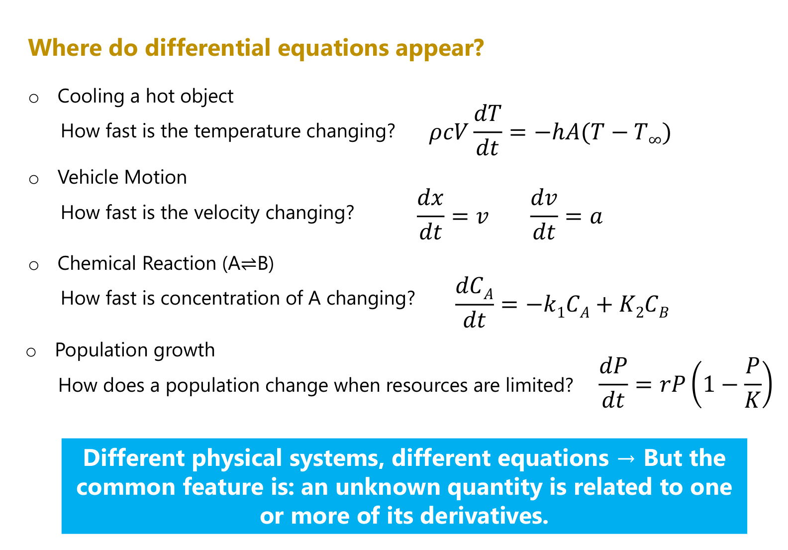
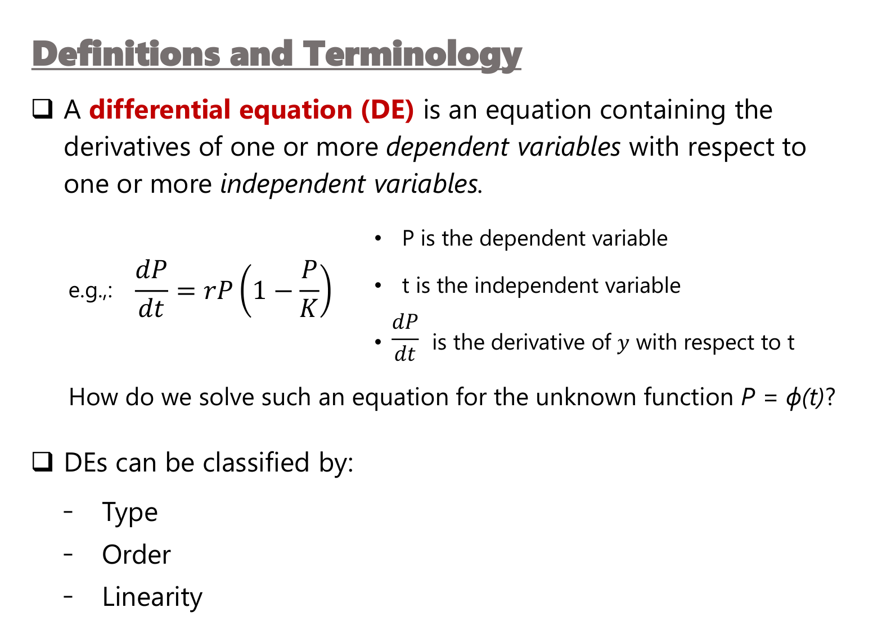
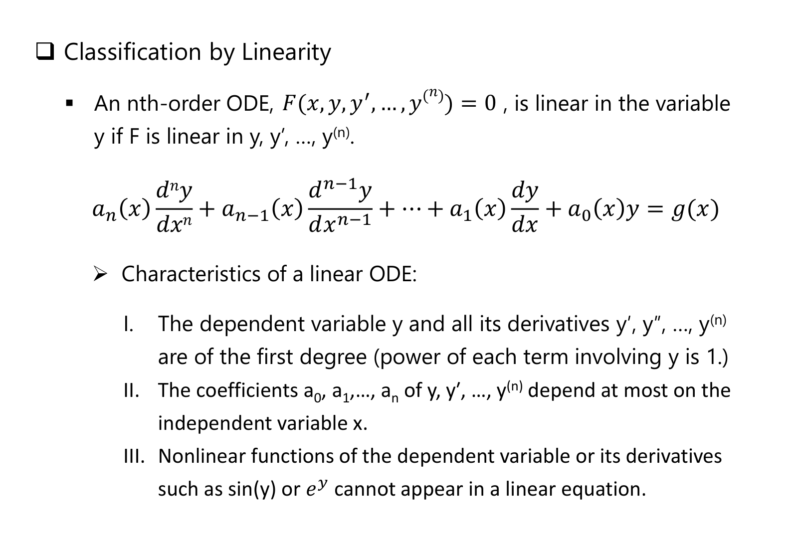
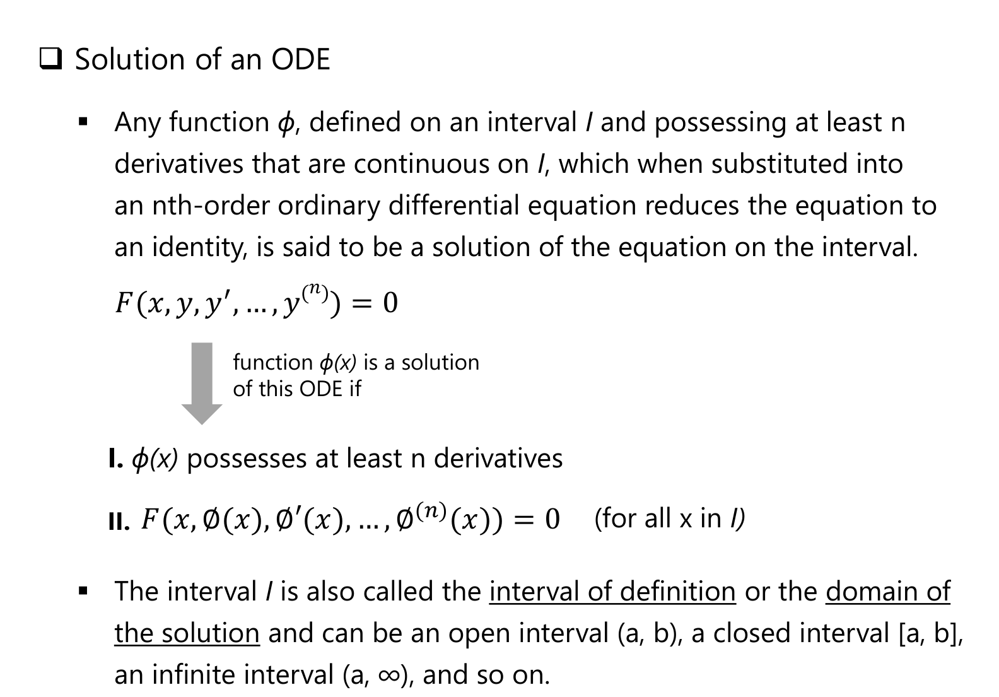
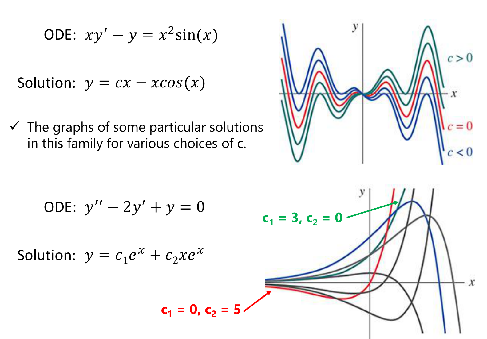

# Appendix: Lecture 1 Slide Figures
*ENGR 213 · Introduction to Differential Equations · figures from the teacher's Lecture 1 slides, with a guide to reading each one*

---

*Figure A1: Where do differential equations appear?, Lecture 1, slide 4.*

**Reading the slide:** four unrelated systems, one pattern. Cooling ($\rho c V\,\frac{dT}{dt} = -hA(T - T_\infty)$), vehicle motion ($\frac{dx}{dt} = v$, $\frac{dv}{dt} = a$), a reversible reaction ($\frac{dC_A}{dt} = -k_1C_A + K_2C_B$) and limited population growth ($\frac{dP}{dt} = rP(1 - \frac{P}{K})$) all state **how fast something changes** in terms of its current value. The blue box is the definition you need: *an unknown quantity is related to one or more of its derivatives*.

---

*Figure A2: Definitions and terminology, Lecture 1, slide 6.*

**Reading the slide:** in the logistic example $P$ is the **dependent** variable (the unknown function), $t$ the **independent** variable, and $\frac{dP}{dt}$ its derivative. Solving means finding the function $P = \phi(t)$. (The third bullet on the slide says "derivative of $y$"; read it as the derivative of $P$.) Every DE is classified three ways: **type** (ODE or PDE), **order** (highest derivative) and **linearity**.

---

*Figure A3: Classification by linearity, Lecture 1, slide 10.*

**Reading the slide:** a linear ODE has the form $a_n(x)y^{(n)} + \dots + a_1(x)y' + a_0(x)y = g(x)$. The three tests: (I) $y$ and every derivative appear to the **first power**; (II) the coefficients depend **at most on $x$**; (III) no nonlinear function of $y$ such as $\sin y$ or $e^{y}$. A term like $x^{3}y'''$ is fine; $y\,y'$ or $(y')^{2}$ is not.

---

*Figure A4: Solution of an ODE, Lecture 1, slide 13.*

**Reading the slide:** a function $\phi$ is a solution on an interval $I$ if (I) it has at least $n$ derivatives that are continuous on $I$, and (II) substituting it turns the ODE into an identity **for every $x$ in $I$**. The interval (the interval of definition) is part of the answer: $1/x$ solves $xy' + y = 0$ only on $(-\infty, 0)$ or $(0, \infty)$, never across 0.

---

*Figure A5: Families of solutions, Lecture 1, slide 19.*

**Reading the graphs:** the first-order ODE $xy' - y = x^{2}\sin x$ has the one-parameter family $y = cx - x\cos x$; green curves have $c > 0$, the red curve $c = 0$ and blue curves $c < 0$, and all of them pass through the origin. The second-order ODE $y'' - 2y' + y = 0$ needs **two** constants, $y = c_1e^{x} + c_2xe^{x}$, and each pair $(c_1, c_2)$ picks one curve: the green arrow marks $3e^{x}$ ($c_1 = 3$, $c_2 = 0$) and the red arrow marks $5xe^{x}$ ($c_1 = 0$, $c_2 = 5$). This is why an $n$th-order ODE needs $n$ initial conditions.
