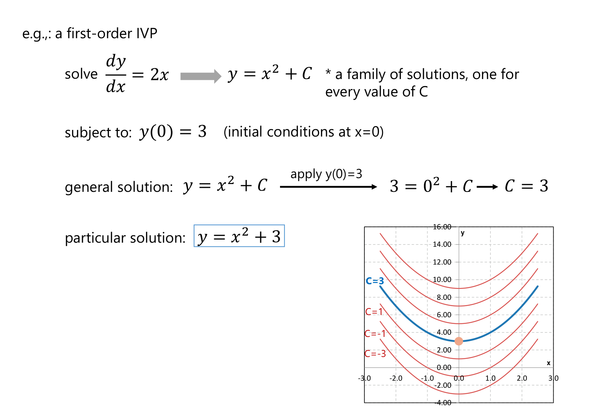
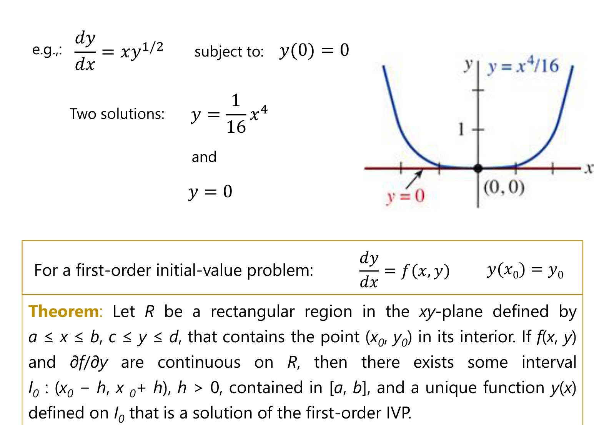
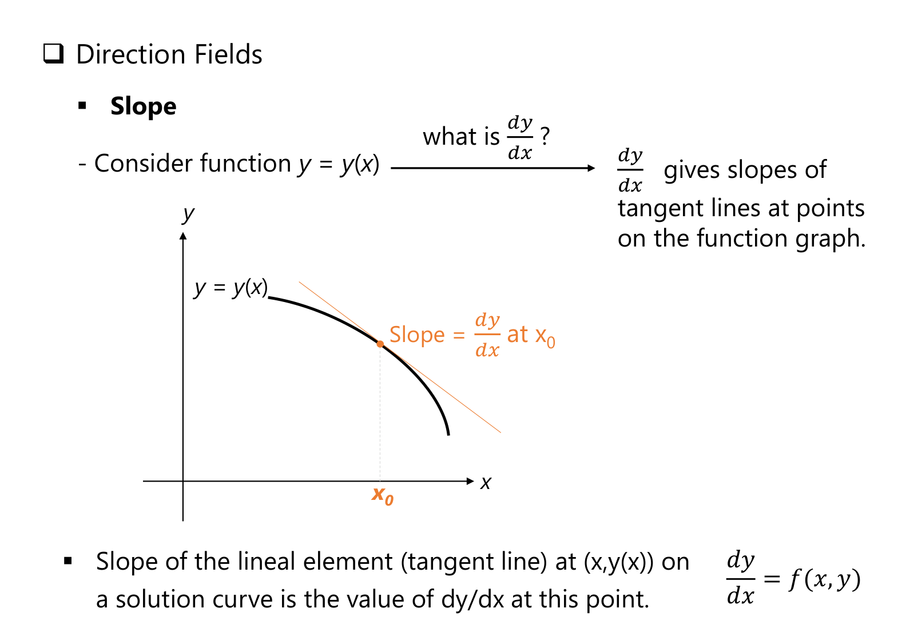
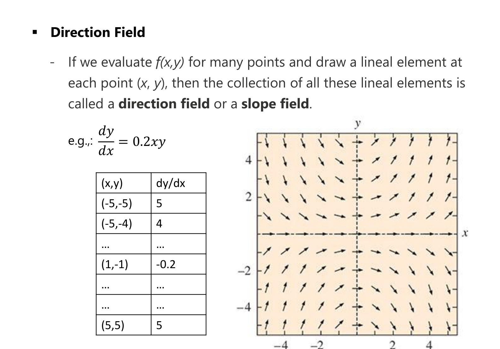
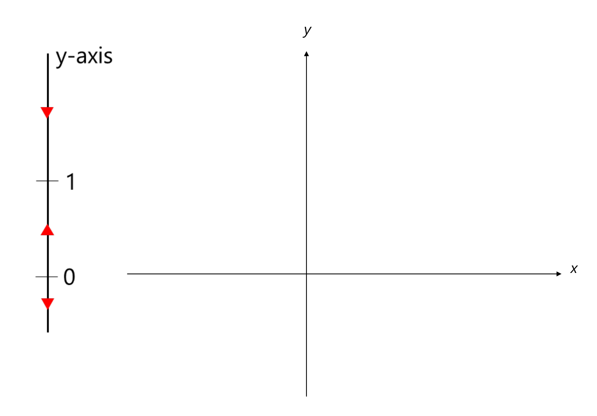
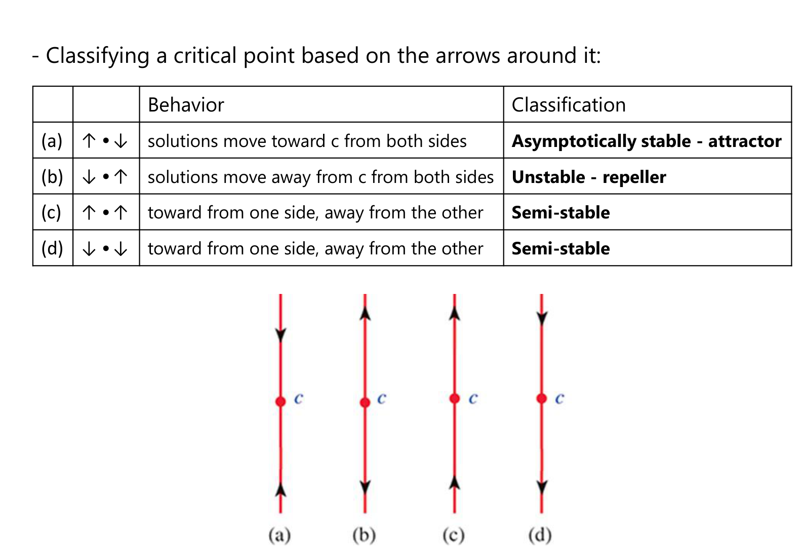

# Appendix: Lecture 2 Slide Figures
*ENGR 213 · IVPs and Direction Fields · figures from the teacher's Lecture 2 slides, with a guide to reading each one*

---

*Figure A1: A first-order IVP, Lecture 2, slide 4.*

**Reading the slide:** $\frac{dy}{dx} = 2x$ integrates to the family $y = x^{2} + C$, the stack of red parabolas on the right (one per value of $C$). The initial condition $y(0) = 3$ gives $3 = 0^{2} + C$, so $C = 3$, and the blue curve through the orange point $(0, 3)$ is the **particular solution** $y = x^{2} + 3$.

---

*Figure A2: Existence and uniqueness, Lecture 2, slide 8.*

**Reading the slide:** the IVP $\frac{dy}{dx} = xy^{1/2}$, $y(0) = 0$ has **two** solutions through $(0, 0)$: $y = 0$ (red) and $y = x^{4}/16$ (blue). The theorem in the box explains why this is allowed: uniqueness is guaranteed only if $f$ **and** $\partial f/\partial y$ are continuous on a rectangle around the point. Here $\partial f/\partial y = \frac{x}{2\sqrt y}$ blows up at $y = 0$, so the theorem says nothing at $(0, 0)$.

---

*Figure A3: Direction fields: slope, Lecture 2, slide 10.*

**Reading the slide:** at any point of a solution curve $y(x)$, the tangent line has slope $\frac{dy}{dx}$. Since the ODE says $\frac{dy}{dx} = f(x, y)$, you can compute that slope **without solving**: just evaluate $f$ at the point. That short tangent segment is the **lineal element**.

---

*Figure A4: Direction field, Lecture 2, slide 12.*

**Reading the slide:** the table evaluates $f = 0.2xy$ at grid points ($(-5,-5) \to 5$, $(1,-1) \to -0.2$, …) and the plot draws a lineal element at each one. Along the axes $f = 0$, so the segments are flat; in the first and third quadrants $xy > 0$ and they tilt up; in the second and fourth they tilt down. Any solution curve must follow these arrows.

---

*Figure A5: One-dimensional phase portrait, Lecture 2, slide 16.*

**Reading the drawing:** the red arrowheads on the vertical $y$-axis form a phase line with critical points at 0 and 1 (the arrow pattern of, for example, $y' = y(1 - y)$). The empty $xy$-plane beside it is where the matching solution curves are sketched in class. Above 1 the arrow points **down** ($f < 0$), between 0 and 1 it points **up** ($f > 0$), and below 0 it points **down** ($f < 0$). So solutions move toward $y = 1$ from both sides (attractor) and away from $y = 0$ on both sides (repeller).

---

*Figure A6: Classifying a critical point from the arrows, Lecture 2, slide 17.*

**Reading the table:** (a) arrows point toward $c$ from both sides: **asymptotically stable (attractor)**; (b) away on both sides: **unstable (repeller)**; (c) and (d) toward on one side and away on the other: **semi-stable**. To classify, only the **sign of $f$** just above and just below $c$ is needed.
