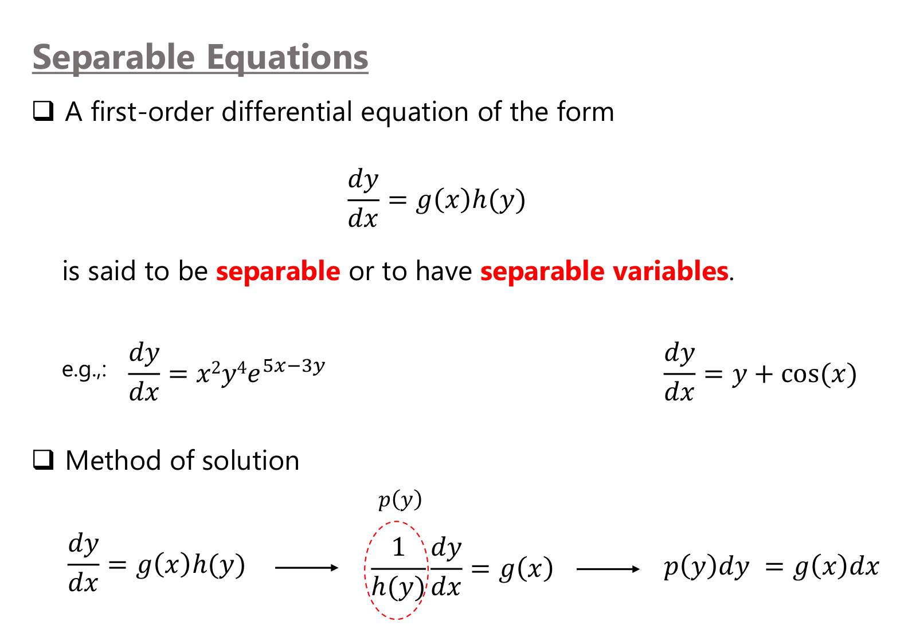
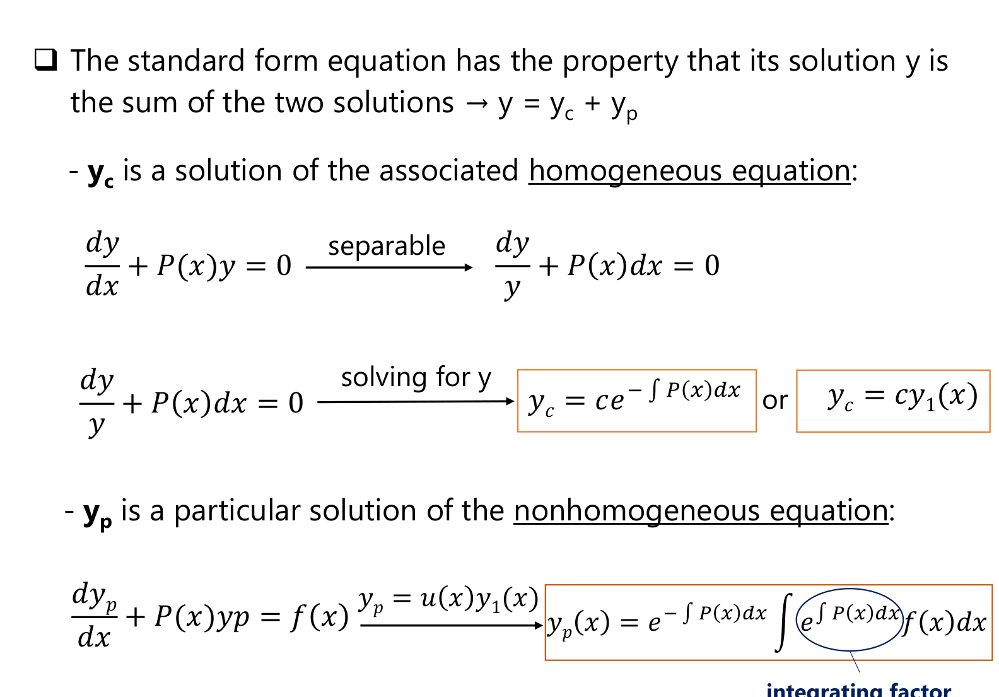
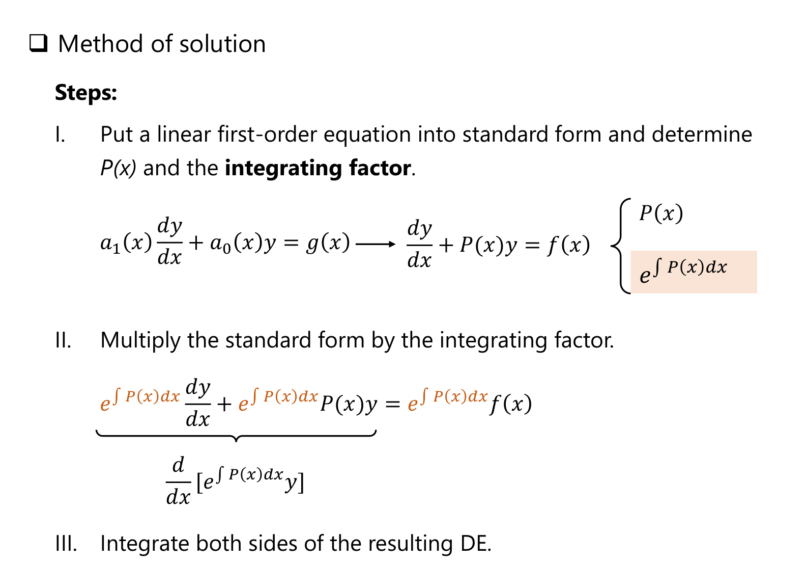
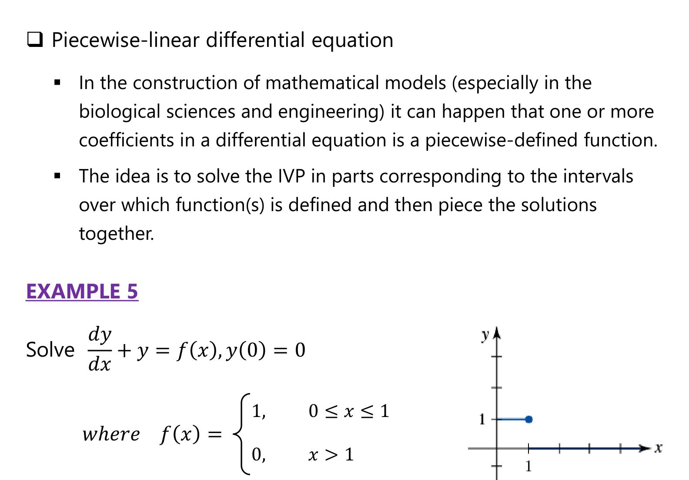

# Appendix: Lecture 3 Slide Figures
*ENGR 213 · Separable and Linear Equations · figures from the teacher's Lecture 3 slides, with a guide to reading each one*

---

*Figure A1: Separable equations, Lecture 3, slide 3.*

**Reading the slide:** an equation is separable when the right side **factors** into a function of $x$ times a function of $y$: $\frac{dy}{dx} = g(x)h(y)$. The first example, $x^{2}y^{4}e^{5x - 3y} = (x^{2}e^{5x})(y^{4}e^{-3y})$, factors; $y + \cos x$ does not. The method is to divide by $h(y)$; the dashed red circle marks $p(y) = 1/h(y)$, so that $p(y)\,dy = g(x)\,dx$, then integrate each side.

---

*Figure A2: Solution of the standard linear form, Lecture 3, slide 9.*

**Reading the slide:** the solution of $\frac{dy}{dx} + P(x)y = f(x)$ is the sum $y = y_c + y_p$. The **complementary** part $y_c = c\,e^{-\int P\,dx}$ solves the homogeneous equation (which is separable). The **particular** part $y_p$ comes from substituting $y_p = u(x)y_1(x)$ (variation of parameters). The results are in the orange boxes, and the circled factor $e^{\int P\,dx}$ is exactly the **integrating factor** used in the method on the next slide.

---

*Figure A3: Method of solution for linear equations, Lecture 3, slide 10.*

**Reading the steps:**

1. Divide by $a_1(x)$ to reach standard form $\frac{dy}{dx} + P(x)y = f(x)$ and read off $P(x)$; the shaded box shows the integrating factor $e^{\int P\,dx}$ built from it.
2. Multiply **every term** by $\mu = e^{\int P\,dx}$. The left side is then exactly the derivative of a product, $\frac{d}{dx}\left[e^{\int P\,dx}\,y\right]$ (brace on the slide).
3. Integrate both sides, then divide by $\mu$.

The most common mistakes are skipping step 1 (so $P$ is wrong) and multiplying only the left side by $\mu$.

---

*Figure A4: Piecewise-linear differential equation, Lecture 3, slide 14.*

**Reading the slide:** the forcing $f(x)$ is 1 on $[0, 1]$ and 0 for $x > 1$ (the small graph). Solve on each piece separately: $y = 1 - e^{-x}$ on $[0, 1]$ (using $y(0) = 0$), then $y = c\,e^{-x}$ for $x > 1$, with $c$ chosen so the two pieces **join continuously** at $x = 1$: $c = e - 1$.
