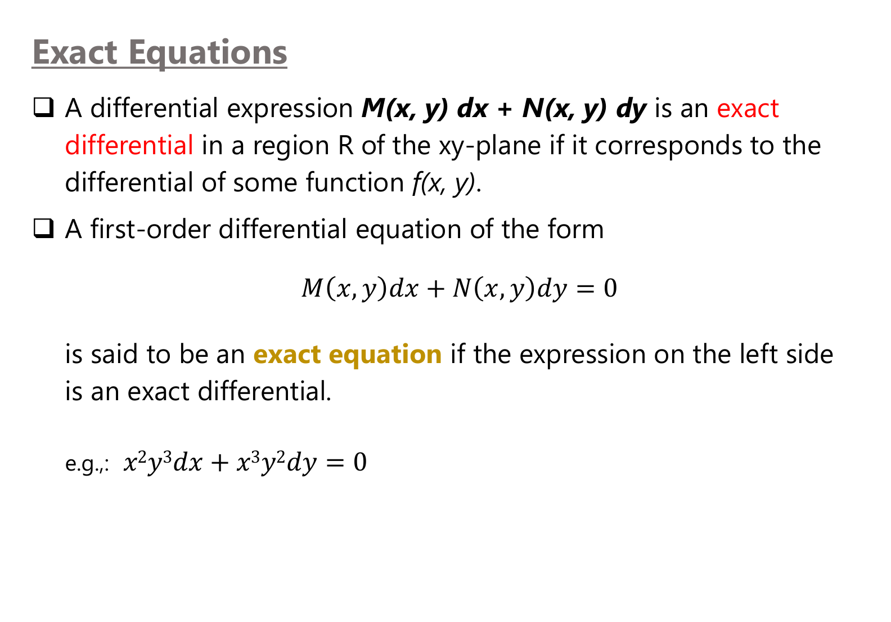
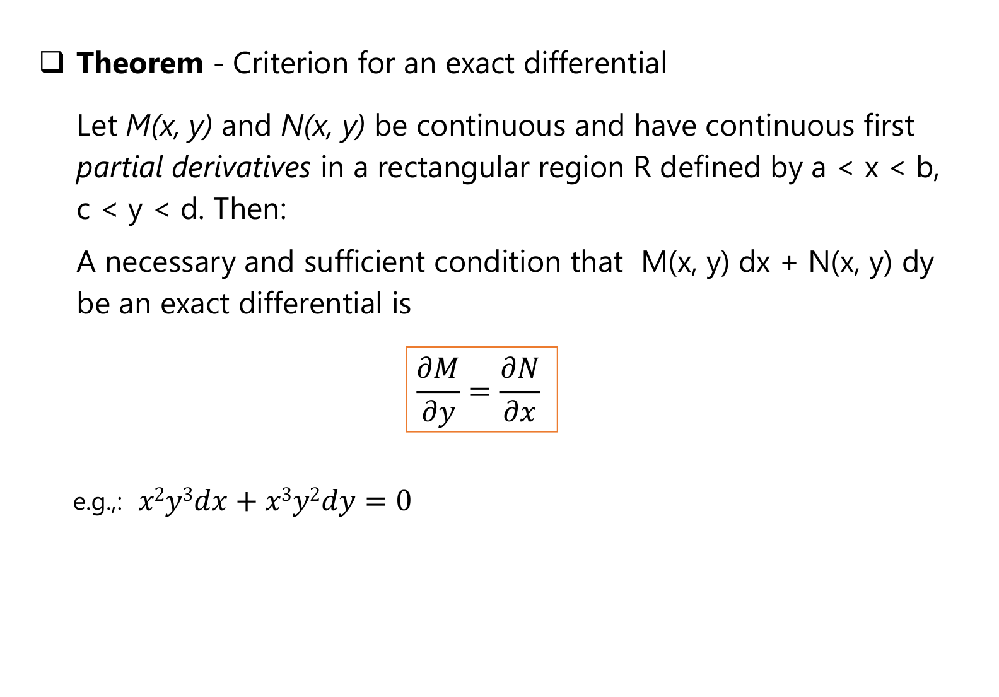
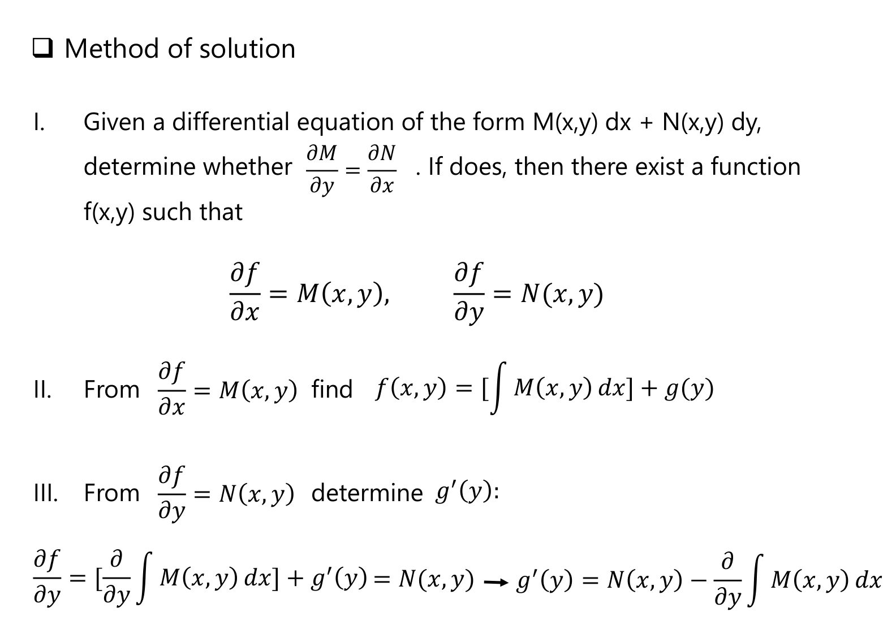
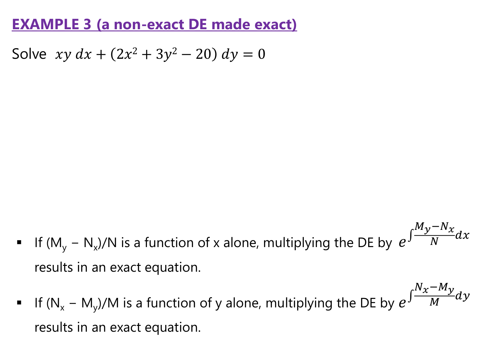

# Appendix: Lecture 4 Slide Figures
*ENGR 213 · Exact Equations · figures from the teacher's Lecture 4 slides, with a guide to reading each one*

---

*Figure A1: Exact equations, Lecture 4, slide 3.*

**Reading the slide:** $M(x, y)\,dx + N(x, y)\,dy$ is an **exact differential** if it is the total differential $df = f_x\,dx + f_y\,dy$ of some function $f(x, y)$. When it is, the ODE $M\,dx + N\,dy = 0$ says $df = 0$, so its solution is simply $f(x, y) = c$. For the example $x^{2}y^{3}dx + x^{3}y^{2}dy$, the function is $f = \frac13x^{3}y^{3}$.

---

*Figure A2: Criterion for an exact differential, Lecture 4, slide 4.*

**Reading the theorem:** if $M$, $N$ and their first partial derivatives are continuous on a rectangle, then the expression is exact **if and only if** $\frac{\partial M}{\partial y} = \frac{\partial N}{\partial x}$. The reason: if $M = f_x$ and $N = f_y$, then $M_y = f_{xy}$ and $N_x = f_{yx}$, and mixed partials of a smooth function are equal. Check: $x^{2}y^{3}$ gives $M_y = 3x^{2}y^{2}$ and $x^{3}y^{2}$ gives $N_x = 3x^{2}y^{2}$ ✓.

---

*Figure A3: Method of solution, Lecture 4, slide 5.*

**Reading the steps:**

1. Test $M_y = N_x$. If it holds, $f$ exists with $f_x = M$ and $f_y = N$.
2. Integrate $M$ with respect to $x$ (holding $y$ constant) and add an unknown $g(y)$: $f = \int M\,dx + g(y)$.
3. Differentiate that $f$ with respect to $y$, set it equal to $N$, and solve for $g'(y)$; then integrate to get $g(y)$.

The answer is $f(x, y) = c$. Forgetting $g(y)$ in step 2 is the most common way to lose terms.

---

*Figure A4: A non-exact DE made exact, Lecture 4, slide 10.*

**Reading the two rules at the bottom:**

* If $\dfrac{M_y - N_x}{N}$ depends on $x$ only, multiply by $\mu(x) = e^{\int \frac{M_y - N_x}{N}dx}$.
* If $\dfrac{N_x - M_y}{M}$ depends on $y$ only, multiply by $\mu(y) = e^{\int \frac{N_x - M_y}{M}dy}$.

For the slide's Example 3, $xy\,dx + (2x^{2} + 3y^{2} - 20)\,dy = 0$: $M_y = x$, $N_x = 4x$; the first ratio still contains $y$, but $\frac{N_x - M_y}{M} = \frac{3x}{xy} = \frac3y$, so $\mu = y^{3}$ makes the equation exact. Note the numerator order is reversed between the two rules.
