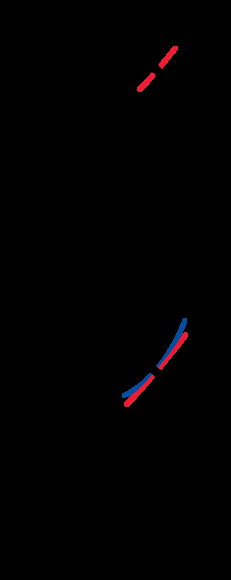

# Chapter 01: Introduction to Differential Equations & Initial-Value Problems
### Concordia University · Department of Mechanical, Industrial & Aerospace Engineering
**Course**: Applied Ordinary Differential Equations (ENGR 213)  
**Textbook**: *Advanced Engineering Mathematics* (7th Edition) by Dennis G. Zill — Chapter 1 (§1.1, §1.2, §1.3)

---

## 1. Executive Overview & First-Principles Philosophy

In engineering and applied physics, fundamental laws rarely state the value of a physical state directly. Instead, nature governs the universe through **rates of change**:
* Newton's Second Law of Motion relates acceleration (the second derivative of position) to net force: $\sum F = m \frac{d^2x}{dt^2}$.
* Fourier's Law of Heat Conduction states that heat flux is proportional to the spatial temperature gradient: $q = -k \frac{\partial T}{\partial x}$.
* Faraday's and Kirchhoff's Laws describe electrical circuits in terms of the rate of change of charge and current: $L \frac{di}{dt} + R i = E(t)$.

A **Differential Equation (DE)** is any mathematical equation containing the derivatives of one or more unknown functions (dependent variables) with respect to one or more independent variables.

Solving a differential equation represents the inverse process of differentiation: starting from localized rate relationships and geometric constraints, determine the global function $y(x)$ that describes the state of the system across its domain.

---

## 2. Mathematical Framework & Analytical Mechanics

### 2.1 Classification of Differential Equations

Every differential equation encountered in engineering mathematics is categorized across three foundational characteristics: **Type**, **Order**, and **Linearity**.

```
Differential Equations Classification
 ├── 1. By Type
 │     ├── Ordinary Differential Equation (ODE): Single independent variable
 │     └── Partial Differential Equation (PDE): Two or more independent variables
 ├── 2. By Order
 │     └── Highest derivative present in the equation: dⁿy/dxⁿ
 └── 3. By Linearity
       ├── Linear: First degree in y, y', y'', ..., coefficients depend only on x
       └── Nonlinear: Powers of y or derivatives, cross-products, transcendental functions
```

#### A. Classification by Type
1. **Ordinary Differential Equation (ODE)**: An equation containing only ordinary derivatives of one or more dependent variables with respect to a **single** independent variable:
   $$\frac{dy}{dx} + 5y = e^x, \qquad \frac{d^2x}{dt^2} + \frac{dx}{dt} + 6x = 0, \qquad \frac{dx}{dt} + \frac{dy}{dt} = 2x + y$$
2. **Partial Differential Equation (PDE)**: An equation involving partial derivatives of one or more dependent variables with respect to **two or more** independent variables:
   $$\frac{\partial^2 u}{\partial x^2} + \frac{\partial^2 u}{\partial y^2} = 0 \quad (\text{Laplace's Eq.}), \qquad k \frac{\partial^2 u}{\partial x^2} = \frac{\partial u}{\partial t} \quad (\text{Heat Eq.})$$

#### B. Classification by Order
* The **order** of an ODE is the order of the **highest derivative** present in the equation.
* *Example 1*: $\frac{d^2y}{dx^2} + 5\left(\frac{dy}{dx}\right)^3 - 4y = e^x$ is **Second-Order** (highest derivative is $\frac{d^2y}{dx^2}$, despite the first derivative being cubed).
* *Example 2*: $4 x y''' + 2 y'' - (\sin x) y' + y = 0$ is **Third-Order**.
* **Normal Form**: An $n$-th order ODE can be expressed in general implicit form:
  $$F\left(x, y, y', y'', \dots, y^{(n)}\right) = 0$$
  Whenever algebraically possible, we isolate the highest derivative to express the ODE in **normal form**:
  $$\frac{d^ny}{dx^n} = f\left(x, y, y', \dots, y^{(n-1)}\right)$$
  For first-order ODEs, the normal form is simply $\frac{dy}{dx} = f(x, y)$. For second-order ODEs, it is $\frac{d^2y}{dx^2} = f(x, y, y')$.

#### C. Classification by Linearity
An $n$-th order ordinary differential equation is defined as **linear** if it can be written strictly in the form:
$$a_n(x)\frac{d^ny}{dx^n} + a_{n-1}(x)\frac{d^{n-1}y}{dx^{n-1}} + \dots + a_1(x)\frac{dy}{dx} + a_0(x)y = g(x)$$

**The Two Non-Negotiable Tests for Linearity**:
1. **First-Degree Rule**: The dependent variable $y$ and all its derivatives $y', y'', \dots, y^{(n)}$ must appear strictly to the first power (exponent 1). There can be no terms such as $y^2$, $\sqrt{y}$, or $(y')^3$.
2. **Coefficient Rule**: The coefficients $a_0(x), a_1(x), \dots, a_n(x)$ and the non-homogeneous driving term $g(x)$ must depend **solely on the independent variable $x$** (or be constant). They cannot depend on $y$ or any derivatives of $y$.
3. **No Nonlinear Compositions**: No transcendental functions of the dependent variable may appear (e.g., $\sin(y), \cos(y), e^y, \ln(y)$).
4. **No Cross-Products**: No products of the dependent variable with its derivatives may appear (e.g., $y \cdot y'$, $y' \cdot y''$).

| Differential Equation | Order | Linear? | Rationale / Non-Linear Term |
| :--- | :---: | :---: | :--- |
| $(y - x)dx + 4x dy = 0$ | 1 | **Linear** in $y$ | Rewrites as $4x \frac{dy}{dx} + y = x$. Linear coefficients in $x$. |
| $y'' - 2y' + y = \sin x$ | 2 | **Linear** | Constant coefficients; $y$ and derivatives to power 1. |
| $x^3 y''' + x y' - 5y = e^x$ | 3 | **Linear** | Coefficients depend only on $x$; linear in $y$. |
| $(1 - y)y' + 2y = e^x$ | 1 | **Nonlinear** | Term $-y y'$ has dependent variable multiplying its derivative. |
| $\frac{d^2y}{dx^2} + \sin y = 0$ | 2 | **Nonlinear** | Transcendental function $\sin y$ depends on $y$. |
| $\frac{d^4y}{dx^4} + y^2 = 0$ | 4 | **Nonlinear** | Term $y^2$ is second-degree in $y$. |
| $\left(\frac{dy}{dx}\right)^2 + y = x$ | 1 | **Nonlinear** | Derivative is squared $(y')^2$. |

---

### 2.2 Solutions of Differential Equations

#### A. Definition of a Solution
A function $\phi$ defined on an interval $I$ and possessing at least $n$ derivatives that are continuous on $I$ is called a **solution** of an $n$-th order ODE on $I$ if, when $y = \phi(x)$ and its derivatives are substituted into the equation, it reduces the equation to an identity for all $x \in I$:
$$F\left(x, \phi(x), \phi'(x), \dots, \phi^{(n)}(x)\right) \equiv 0 \quad \forall x \in I$$

#### B. Interval of Definition (Domain of Solution)
The interval $I$ is variously called the **interval of definition**, the **interval of existence**, the **domain of the solution**, or the **interval of validity**. The interval $I$ must be continuous: it can be an open interval $(a, b)$, a closed interval $[a, b]$, or an infinite interval $(-\infty, \infty)$. A solution cannot bridge across a point of discontinuity or singularity.

#### C. Explicit vs. Implicit Solutions
1. **Explicit Solution**: A solution in which the dependent variable is expressed entirely in terms of the independent variable and constants:
   $$y = \phi(x)$$
   *Example*: $y = c e^{2x} + 4$ is an explicit solution of $y' - 2y = -8$.
2. **Implicit Solution**: A relation $G(x, y) = 0$ is said to be an implicit solution of an ODE on interval $I$, provided that there exists at least one function $y = \phi(x)$ that satisfies the relation as well as the differential equation on $I$.
   *Example*: $x^2 + y^2 - 25 = 0$ is an implicit solution of $\frac{dy}{dx} = -\frac{x}{y}$ on the open interval $(-5, 5)$. Implicit differentiation yields:
   $$\frac{d}{dx}[x^2 + y^2 - 25] = 2x + 2y\frac{dy}{dx} = 0 \implies \frac{dy}{dx} = -\frac{x}{y}$$
   This implicit relation defines two distinct explicit solutions:
   $$\phi_1(x) = +\sqrt{25 - x^2} \quad \text{and} \quad \phi_2(x) = -\sqrt{25 - x^2}, \quad x \in (-5, 5)$$

#### D. Families of Solutions & Singular Solutions
* **$n$-Parameter Family of Solutions**: When solving an $n$-th order ODE $F(x, y, y', \dots, y^{(n)}) = 0$, we integrate $n$ times, yielding a solution containing $n$ arbitrary constants:
  $$G(x, y, c_1, c_2, \dots, c_n) = 0$$
  This is called a **general solution** or **$n$-parameter family**.
* **Particular Solution**: A solution free of arbitrary parameters, obtained by choosing specific numerical values for $c_1, \dots, c_n$ (usually enforced by initial conditions).
* **Singular Solution**: A solution that cannot be obtained by any choice of the parameters $c_1, \dots, c_n$ in the family.
  *Textbook Classic*: For the first-order nonlinear ODE $(y')^2 - x y' + y = 0$, the one-parameter family is the family of straight lines:
  $$y = c x - c^2$$
  However, the parabola $y = \frac{1}{4}x^2$ is also a solution:
  $$y' = \frac{1}{2}x \implies \left(\frac{1}{2}x\right)^2 - x\left(\frac{1}{2}x\right) + \frac{1}{4}x^2 = \frac{1}{4}x^2 - \frac{1}{2}x^2 + \frac{1}{4}x^2 = 0 \equiv 0$$
  Because no choice of constant $c$ in $y = cx - c^2$ can produce the quadratic curve $y = \frac{1}{4}x^2$, this parabola is a **singular solution**. Geometrically, it is the envelope of the family of tangent lines.
* **Trivial Solution**: If $y \equiv 0$ identically satisfies an ODE (common in homogeneous linear equations), it is called the **trivial solution**.

---

### 2.3 Initial-Value Problems (IVPs) & The Picard-Lindelöf Theorem

#### A. Mathematical Definition of an IVP
An **Initial-Value Problem** seeks a solution $y(x)$ to an ODE on an interval $I$ containing $x_0$, subject to side conditions prescribed at a **single point** $x_0$:
* **First-Order IVP**:
  $$\frac{dy}{dx} = f(x, y), \quad y(x_0) = y_0$$
* **Second-Order IVP**:
  $$\frac{d^2y}{dx^2} = f(x, y, y'), \quad y(x_0) = y_0, \quad y'(x_0) = y_1$$
* **$n$-th Order IVP**:
  $$\frac{d^ny}{dx^n} = f(x, y, y', \dots, y^{(n-1)}), \quad y(x_0) = y_0, \; y'(x_0) = y_1, \; \dots, \; y^{(n-1)}(x_0) = y_{n-1}$$

Geometrically, for a first-order ODE, the initial condition $y(x_0) = y_0$ picks out a single integral curve passing through the specific Cartesian coordinate point $(x_0, y_0)$. For a second-order ODE, $y(x_0) = y_0$ specifies the starting position, and $y'(x_0) = y_1$ specifies the initial tangent slope.

#### B. The Existence and Uniqueness Theorem (Theorem 1.2.1)

In engineering, we must know:
1. **Existence**: Does a mathematical model have at least one solution?
2. **Uniqueness**: Is the solution unique, or does the system permit unpredictable branching?

> **Theorem 1.2.1 (Existence of a Unique Solution — Picard-Lindelöf)**:
> Let $R$ be a rectangular region in the $xy$-plane defined by:
> $$R = \{(x, y) \in \mathbb{R}^2 \mid a \le x \le b, \; c \le y \le d\}$$
> containing the interior point $(x_0, y_0)$. If both:
> 1. $f(x, y)$ is **continuous** on $R$, and
> 2. $\frac{\partial f}{\partial y}$ is **continuous** on $R$,
> 
> then there exists some open subinterval $I_0 = (x_0 - h, x_0 + h)$ contained in $[a, b]$, and a **unique function** $y(x)$ defined on $I_0$ that satisfies the IVP:
> $$\frac{dy}{dx} = f(x, y), \quad y(x_0) = y_0$$

```
Condition 1: f(x, y) is continuous on R          --> Existence of a solution is GUARANTEED
Condition 2: ∂f/∂y is continuous on R           --> UNIQUENESS of the solution is GUARANTEED
If Condition 2 fails at (x₀, y₀)                --> Solutions may exist, but UNIQUENESS FAILS!
```

#### C. Exhaustive Analysis of Theorem 1.2.1 Failure Modes

##### Case Study 1: Complete Failure of Uniqueness ($y' = xy^{1/2}, \; y(0) = 0$)
Consider the first-order IVP:
$$\frac{dy}{dx} = x y^{1/2}, \quad y(0) = 0$$
* Step 1 ($f(x, y)$): $f(x, y) = x\sqrt{y}$. This function is continuous everywhere on the half-plane $y \ge 0$. Since $(0, 0)$ is on the boundary, existence is guaranteed.
* Step 2 ($\partial f/\partial y$):
  $$\frac{\partial f}{\partial y} = \frac{\partial}{\partial y}\left[x y^{1/2}\right] = \frac{x}{2\sqrt{y}}$$
  Evaluating at the initial condition point $(x_0, y_0) = (0, 0)$:
  $$\left.\frac{\partial f}{\partial y}\right|_{(0, 0)} = \frac{0}{2\sqrt{0}} \implies \text{UNDEFINED (division by zero!)}$$
  Because $\frac{\partial f}{\partial y}$ is discontinuous across the line $y = 0$, **uniqueness is NOT guaranteed**.
* Analytical Consequence:
  Separating variables:
  $$\frac{dy}{y^{1/2}} = x dx \implies 2y^{1/2} = \frac{x^2}{2} + C \implies y(x) = \left(\frac{x^2}{4} + \frac{C}{2}\right)^2$$
  Applying $y(0) = 0 \implies C = 0 \implies y_1(x) = \frac{x^4}{16}$.
  However, notice that $y_2(x) \equiv 0$ is also a completely valid solution satisfying $y(0) = 0$.
  Furthermore, we can construct infinitely many piecewise solutions:
  $$y(x) = \begin{cases} 0, & x < c \\ \frac{1}{16}(x^2 - c^2)^2, & x \ge c \end{cases}$$
  Through the single point $(0, 0)$, infinitely many distinct integral curves emerge!

##### Case Study 2: Existence and Uniqueness Guaranteed Everywhere Except Vertical Lines ($y' = \frac{y}{x}$)
For the ODE $\frac{dy}{dx} = \frac{y}{x}$:
* $f(x, y) = \frac{y}{x}$ is continuous for all $x \ne 0$.
* $\frac{\partial f}{\partial y} = \frac{1}{x}$ is continuous for all $x \ne 0$.
* Conclusion: For any initial condition $(x_0, y_0)$ with $x_0 \ne 0$, Theorem 1.2.1 guarantees a unique solution. Across the $y$-axis ($x = 0$), existence and uniqueness guarantees fail. Indeed, general solution is $y = c x$. At $(0, 0)$, all lines $y = cx$ pass through (infinitely many solutions). At $(0, 1)$, no solution passes through (zero solutions).

---

## 3. Mathematical Modeling & First-Principles Derivations

In §1.3 of the textbook, Dennis Zill establishes that formulating a mathematical model follows a four-step engineering cycle:
1. **Identify Variables**: Formulate dependent variables representing state quantities (mass, temperature, voltage) and independent variables (time, distance).
2. **Apply Physical Laws**: Enforce conservation principles (conservation of mass, energy, momentum, charge).
3. **Formulate the DE**: Express empirical relations (rates of change proportional to driving forces).
4. **Solve, Validate & Interpret**: Obtain analytical solutions, compare against experimental data, and verify physical limits ($t \to \infty$).

```
Physical Phenomenon ──> Idealizing Assumptions ──> Conservation Laws ──> Differential Equation
                                                                               │
Model Refinement <──── Compare with Physical Reality <──── Analytical Solution ┘
```

---

### Model 3.1: Population Dynamics & The Malthusian Law

* **Physical Axiom**: In an unrestricted environment with abundant nutrients and space, the rate of population growth is directly proportional to the total population present at that instant.
* **Mathematical Derivation**:
  Let $P(t)$ be the population at time $t$:
  $$\frac{dP}{dt} \propto P(t) \implies \frac{dP}{dt} = k P$$
  where $k$ is the constant of proportionality (birth rate minus death rate).
* **Step-by-Step Analytical Solution**:
  $$\frac{dP}{P} = k\,dt \implies \ln|P| = kt + C_1 \implies P(t) = C e^{kt}$$
  Applying initial condition $P(0) = P_0$:
  $$P_0 = C e^0 \implies C = P_0 \implies P(t) = P_0 e^{kt}$$
* **Limitation**: As $t \to \infty$, $P(t) \to \infty$. Real populations experience space/food limitations, leading directly to the nonlinear logistic equation (Chapter 2, §2.8).

---

### Model 3.2: Radioactive Decay & Half-Life Radiocarbon Dating

* **Physical Axiom**: The rate at which the nuclei of a radioactive substance decay is directly proportional to the remaining number of nuclei (or mass $A(t)$) at that time.
* **Mathematical Formulation**:
  $$\frac{dA}{dt} = -k A, \quad k > 0$$
  The negative sign explicitly represents loss of mass over time.
* **Derivation of Half-Life ($t_{1/2}$)**:
  The solution is $A(t) = A_0 e^{-kt}$. The half-life is the time required for half the original atoms to disintegrate:
  $$A(t_{1/2}) = \frac{1}{2}A_0 \implies A_0 e^{-k t_{1/2}} = \frac{1}{2}A_0 \implies e^{-k t_{1/2}} = \frac{1}{2}$$
  Taking the natural logarithm:
  $$-k t_{1/2} = \ln\left(\frac{1}{2}\right) = -\ln 2 \implies t_{1/2} = \frac{\ln 2}{k} \approx \frac{0.693147}{k}$$
* **Carbon-14 Dating**: Carbon-14 has a half-life of $t_{1/2} \approx 5730\text{ years}$.
  $$k = \frac{\ln 2}{5730} \approx 0.00012097\text{ year}^{-1}$$
  By measuring the residual ${}^{14}\text{C}$ activity ratio $A(t)/A_0$ in an organic artifact, the elapsed time since death is determined explicitly by:
  $$t = -\frac{1}{k}\ln\left(\frac{A(t)}{A_0}\right)$$

---

### Model 3.3: Newton's Law of Cooling and Warming

* **Physical Axiom**: The rate of change of the temperature $T(t)$ of a body is proportional to the difference between its temperature and the ambient temperature $T_m$ of the surrounding medium.
* **Mathematical Formulation**:
  $$\frac{dT}{dt} = -k(T - T_m), \quad k > 0$$
  * Physical check: If $T > T_m$ (body is hotter than room), $(T - T_m) > 0$, so $\frac{dT}{dt} < 0$ (the body cools). If $T < T_m$ (body is colder than room), $(T - T_m) < 0$, so $\frac{dT}{dt} > 0$ (the body warms).
* **Step-by-Step Analytical Solution**:
  $$\frac{dT}{T - T_m} = -k\,dt \implies \ln|T - T_m| = -kt + C_1 \implies T(t) - T_m = C e^{-kt}$$
  Applying initial temperature $T(0) = T_0$:
  $$T_0 - T_m = C \implies T(t) = T_m + (T_0 - T_m)e^{-kt}$$
* **Asymptotic Behavior**:
  $$\lim_{t \to \infty} T(t) = T_m + (T_0 - T_m)(0) = T_m$$
  The body asymptotically approaches thermal equilibrium with its environment.

---

### Model 3.4: Mixtures & Dynamic Tank Concentration Mechanics

Mixing tanks are quintessential industrial and chemical engineering systems:

```
 Inflow Rate: r_in (gal/min)
 Inflow Concentration: c_in (lb/gal)
            │
            ▼
┌───────────────────────────┐
│     Well-Stirred Tank     │
│   Volume: V(t) (gal)      │
│   Salt Mass: A(t) (lb)    │
│   Concentration: A(t)/V(t)│
└───────────────────────────┘
            │
            ▼
 Outflow Rate: r_out (gal/min)
 Outflow Concentration: c_out = A(t)/V(t)
```

* **Conservation Law**:
  $$\frac{dA}{dt} = \text{Rate of chemical entering} - \text{Rate of chemical leaving} = R_{\text{in}} - R_{\text{out}}$$
* **Detailed Derivation**:
  1. **Input Rate ($R_{\text{in}}$)**:
     $$R_{\text{in}} = (\text{volumetric inflow rate } r_{\text{in}}) \times (\text{solute inflow concentration } c_{\text{in}}) = r_{\text{in}} \cdot c_{\text{in}}\quad \left[\frac{\text{gal}}{\text{min}} \cdot \frac{\text{lb}}{\text{gal}} = \frac{\text{lb}}{\text{min}}\right]$$
  2. **Fluid Volume Dynamics ($V(t)$)**:
     $$\frac{dV}{dt} = r_{\text{in}} - r_{\text{out}} \implies V(t) = V_0 + (r_{\text{in}} - r_{\text{out}})t$$
  3. **Output Rate ($R_{\text{out}}$)**:
     Assuming instantaneous, complete uniform mixing via an impeller, the concentration of solute leaving the tank equals the internal concentration:
     $$c_{\text{out}}(t) = \frac{A(t)}{V(t)} = \frac{A(t)}{V_0 + (r_{\text{in}} - r_{\text{out}})t}$$
     $$R_{\text{out}} = r_{\text{out}} \cdot c_{\text{out}}(t) = r_{\text{out}} \frac{A(t)}{V_0 + (r_{\text{in}} - r_{\text{out}})t}$$
  4. **The Governing Linear ODE**:
     $$\frac{dA}{dt} = r_{\text{in}} c_{\text{in}} - r_{\text{out}} \frac{A(t)}{V_0 + (r_{\text{in}} - r_{\text{out}})t}$$
     In standard linear form:
     $$\frac{dA}{dt} + \left(\frac{r_{\text{out}}}{V_0 + (r_{\text{in}} - r_{\text{out}})t}\right)A = r_{\text{in}} c_{\text{in}}$$
* **Two Operating Regimes**:
  * **Equal Flow Rates ($r_{\text{in}} = r_{\text{out}} = r$)**: Constant volume $V(t) = V_0$. The ODE has constant coefficients:
    $$\frac{dA}{dt} + \frac{r}{V_0}A = r c_{\text{in}}$$
  * **Unequal Flow Rates ($r_{\text{in}} \ne r_{\text{out}}$)**: The volume changes linearly with time. If $r_{\text{in}} > r_{\text{out}}$, the tank fills and will overflow at $t_{\text{overflow}} = \frac{V_{\text{max}} - V_0}{r_{\text{in}} - r_{\text{out}}}$. If $r_{\text{in}} < r_{\text{out}}$, the tank empties completely at $t_{\text{empty}} = \frac{V_0}{r_{\text{out}} - r_{\text{in}}}$.

---

### Model 3.5: Draining Tanks & Torricelli's Law

* **Physical Axiom**: Water flows through a hole of area $a$ at the bottom of an open tank with velocity $v = \sqrt{2gh}$, where $h$ is the water depth (Torricelli's Law of Torricellian Efflux, derived from Bernoulli's principle).
* **Volumetric Balance**:
  The volume of water exiting the tank in time $dt$ is:
  $$dV = -a v dt = -a c \sqrt{2gh}\,dt$$
  where $c$ is an empirical discharge contraction coefficient ($0 < c \le 1$).
  If the tank has a cross-sectional area $A_h(h)$ at height $h$:
  $$dV = A_h(h)dh$$
* **The Governing Nonlinear ODE**:
  $$A_h(h)\frac{dh}{dt} = -a c \sqrt{2gh}$$
  * For a cylindrical tank with constant cross-section $A_w$:
    $$\frac{dh}{dt} = -\frac{a c \sqrt{2g}}{A_w}\sqrt{h}$$
    This is a separable nonlinear ODE whose solution shows that $h(t)$ decreases quadratically, reaching zero at finite time $t_{\text{empty}}$.

---

### Model 3.6: Series Electrical Circuits (LR, RC, LRC)

By Kirchhoff's Second Law (Loop Rule), the algebraic sum of all voltage drops across a closed loop equals the applied electromotive force $E(t)$:

```
   ┌───── Resistor (R) ───── Inductor (L) ───── Capacitor (C) ─────┐
   │         Drop: R·i            Drop: L·di/dt         Drop: q/C      │
   │                                                                   │
   └──────────────────────── Voltage Source E(t) ──────────────────────┘
```

* **Component Voltage Drop Formulas**:
  * Resistor: $E_R = R \cdot i = R \frac{dq}{dt}$
  * Inductor: $E_L = L \cdot \frac{di}{dt} = L \frac{d^2q}{dt^2}$
  * Capacitor: $E_C = \frac{1}{C} q$
* **Governing Circuit Equations**:
  1. **Series LR Circuit**:
     $$L \frac{di}{dt} + R i = E(t)$$
  2. **Series RC Circuit**:
     $$R \frac{dq}{dt} + \frac{1}{C} q = E(t)$$
     Differentiating with respect to $t$ gives the current formulation:
     $$R \frac{di}{dt} + \frac{1}{C} i = \frac{dE}{dt}$$
  3. **Series LRC Circuit**:
     $$L \frac{d^2q}{dt^2} + R \frac{dq}{dt} + \frac{1}{C}q = E(t)$$

---

### Model 3.7: Falling Bodies, Gravitation & Drag Resistance

By Newton's Second Law: $m \frac{dv}{dt} = \sum F$.
Taking the downward direction as positive ($x$ downward, $v = \frac{dx}{dt} > 0$):

1. **No Air Resistance**:
   $$m \frac{dv}{dt} = mg \implies \frac{dv}{dt} = g \implies v(t) = gt + v_0$$
2. **Linear Drag (Low-Velocity / Laminar Flow, Stokes' Law)**:
   Retarding force $F_{\text{drag}} = -k v$ ($k > 0$):
   $$m \frac{dv}{dt} = mg - kv \implies \frac{dv}{dt} + \frac{k}{m}v = g$$
   Solving via integrating factor $\mu(t) = e^{kt/m}$:
   $$v(t) = \frac{mg}{k} + \left(v_0 - \frac{mg}{k}\right)e^{-kt/m}$$
   As $t \to \infty$, the exponential vanishes, yielding the **terminal velocity**:
   $$v_{\text{term}} = \lim_{t \to \infty} v(t) = \frac{mg}{k}$$
3. **Quadratic Drag (High-Velocity / Turbulent Flow)**:
   Retarding force $F_{\text{drag}} = -k v^2$:
   $$m \frac{dv}{dt} = mg - k v^2 \implies \frac{dv}{dt} = g\left(1 - \frac{k}{mg}v^2\right)$$
   Terminal velocity occurs when acceleration $\frac{dv}{dt} = 0$:
   $$v_{\text{term}} = \sqrt{\frac{mg}{k}}$$
   Separating variables:
   $$\int \frac{dv}{v_{\text{term}}^2 - v^2} = \frac{k}{m}\int dt \implies v(t) = v_{\text{term}}\tanh\left(\frac{gt}{v_{\text{term}}}\right)$$

---

## 4. Visual Architecture & Textbook Figure Deep Dives

### Visual 4.1: Direction Fields & Lineal Elements (Textbook Fig. 2.1.1)


*Figure 1.1: Lineal element indicating slope at point $(x, y)$ — from Textbook 7th Ed. Chapter 2 (Fig. 2.1.1).*

#### Pedagogical Breakdown:
1. **Mathematical Representation of Slope**:
   * The first-order differential equation in normal form $\frac{dy}{dx} = f(x, y)$ is a direct statement that the slope of the tangent line to the solution curve at $(x, y)$ is given by the function value $f(x, y)$.
   * At any coordinate point $(x_0, y_0)$, we draw a short line segment (lineal element) centered at $(x_0, y_0)$ with slope $m = f(x_0, y_0)$.
2. **Geometric Interpretation of Solutions**:
   * A solution curve $y = \phi(x)$ is a smooth curve that passes through the direction field in such a manner that at every point $(x, \phi(x))$, the curve is strictly tangent to the lineal element.
   * If a grid of lineal elements is drawn across a rectangular region, the overall pattern displays the **flow lines** or stream trajectories of all possible solutions without calculating a single integral!

---

## 5. Fully Worked Textbook & Exam Archetypes

### Archetype 5.1: Rigorous Verification of an Implicit Solution
**Problem**: Verify that $x^2 + y^2 = 25$ is an implicit solution to the ODE $\frac{dy}{dx} = -\frac{x}{y}$ on the open interval $-5 < x < 5$, and clearly identify all explicit solutions.

#### Step-by-Step Baby-Step Solution:
* **Step 1: Differentiate the implicit relation with respect to $x$**:
  Applying the chain rule to the term $y^2$:
  $$\frac{d}{dx}\left[x^2 + y^2\right] = \frac{d}{dx}[25]$$
  $$2x + 2y\frac{dy}{dx} = 0$$
* **Step 2: Solve algebraically for the derivative $\frac{dy}{dx}$**:
  $$2y\frac{dy}{dx} = -2x \implies \frac{dy}{dx} = -\frac{2x}{2y} = -\frac{x}{y}$$
  This matches the given differential equation identically!
* **Step 3: Determine the explicit solutions and their domain**:
  Solving $x^2 + y^2 = 25$ explicitly for $y$:
  $$y^2 = 25 - x^2 \implies y = \pm\sqrt{25 - x^2}$$
  This yields two distinct continuous explicit solutions:
  $$\phi_1(x) = +\sqrt{25 - x^2}, \quad -5 < x < 5$$
  $$\phi_2(x) = -\sqrt{25 - x^2}, \quad -5 < x < 5$$
* **Step 4: Check interval boundaries ($x = \pm 5$)**:
  At $x = 5$ and $x = -5$, $y = 0$. The derivative $\frac{dy}{dx} = -\frac{x}{y} = -\frac{\pm 5}{0}$ becomes infinite (vertical tangent). Therefore, the endpoints $x = \pm 5$ cannot be included in the interval of definition. The domain must be the open interval $I = (-5, 5)$.

---

### Archetype 5.2: Investigating Existence & Uniqueness via Theorem 1.2.1
**Problem**: For the differential equation $\frac{dy}{dx} = \frac{y^2 - 1}{x - 2}$, determine the regions in the $xy$-plane where:
1. At least one solution is guaranteed to exist.
2. A unique solution is guaranteed to exist.
3. Does Theorem 1.2.1 guarantee a unique solution through $(2, 3)$? Through $(0, 1)$?

#### Step-by-Step Baby-Step Solution:
* **Step 1: Identify $f(x, y)$ and check continuity**:
  $$f(x, y) = \frac{y^2 - 1}{x - 2}$$
  $f(x, y)$ is a rational function. Rational functions are continuous everywhere their denominator is non-zero.
  Therefore, $f(x, y)$ is continuous on the entire $xy$-plane **except along the vertical line $x = 2$**.
  *Conclusion 1*: Existence of solutions is guaranteed in any region that does not intersect the line $x = 2$.
* **Step 2: Compute $\frac{\partial f}{\partial y}$ and check continuity**:
  Treat $x$ as a constant and differentiate $f(x, y)$ with respect to $y$:
  $$\frac{\partial f}{\partial y} = \frac{\partial}{\partial y}\left[\frac{y^2 - 1}{x - 2}\right] = \frac{1}{x - 2}\frac{d}{dy}(y^2 - 1) = \frac{2y}{x - 2}$$
  $\frac{\partial f}{\partial y}$ is also continuous everywhere except along the vertical line $x = 2$.
  *Conclusion 2*: Uniqueness of solutions is guaranteed in any region that does not intersect the line $x = 2$.
* **Step 3: Evaluate specific points**:
  * **Point $(2, 3)$**: Here $x = 2$. The denominator of both $f$ and $\frac{\partial f}{\partial y}$ evaluates to zero:
    $$f(2, 3) = \frac{3^2 - 1}{2 - 2} = \frac{8}{0} \quad (\text{UNDEFINED})$$
    Since neither $f$ nor $\frac{\partial f}{\partial y}$ is continuous at $(2, 3)$, Theorem 1.2.1 **guarantees NOTHING** (neither existence nor uniqueness).
  * **Point $(0, 1)$**: Here $x = 0 \ne 2$.
    $$f(0, 1) = \frac{1^2 - 1}{0 - 2} = \frac{0}{-2} = 0$$
    $$\left.\frac{\partial f}{\partial y}\right|_{(0, 1)} = \frac{2(1)}{0 - 2} = -1$$
    We can construct a rectangle $R$ centered at $(0, 1)$ (for example, $-1 \le x \le 1, \; 0 \le y \le 2$) that does not contain the line $x = 2$. Both $f$ and $\frac{\partial f}{\partial y}$ are continuous on $R$.
    *Conclusion*: Theorem 1.2.1 **GUARANTEES** that there exists an open interval around $x = 0$ on which there is a **unique** solution passing through $(0, 1)$. (Notice that $y(x) \equiv 1$ is that unique constant solution!).

---

### Archetype 5.3: Formulating an Industrial Two-Fluid Mixture Model
**Problem**: A tank initially contains $200\text{ liters}$ of pure water. A brine solution containing $0.5\text{ kg}$ of salt per liter is pumped into the tank at a rate of $4\text{ L/min}$. The well-stirred mixture is pumped out at a faster rate of $6\text{ L/min}$.
1. Formulate the initial-value problem for the mass of salt $A(t)$ in the tank.
2. Determine the time at which the tank is completely empty, and the valid time domain of the differential equation.

#### Step-by-Step Baby-Step Solution:
* **Step 1: Determine the inflow rate of salt ($R_{\text{in}}$)**:
  $$r_{\text{in}} = 4\text{ L/min}, \quad c_{\text{in}} = 0.5\text{ kg/L}$$
  $$R_{\text{in}} = r_{\text{in}} \cdot c_{\text{in}} = (4\text{ L/min}) \times (0.5\text{ kg/L}) = 2.0\text{ kg/min}$$
* **Step 2: Determine the liquid volume $V(t)$ in the tank**:
  The net change in volume per minute is:
  $$\frac{dV}{dt} = r_{\text{in}} - r_{\text{out}} = 4 - 6 = -2\text{ L/min}$$
  Integrating with initial condition $V(0) = 200\text{ L}$:
  $$V(t) = V_0 + (r_{\text{in}} - r_{\text{out}})t = 200 - 2t\text{ liters}$$
* **Step 3: Determine the concentration and outflow rate of salt ($R_{\text{out}}$)**:
  $$\text{Salt concentration in tank } c(t) = \frac{A(t)}{V(t)} = \frac{A(t)}{200 - 2t}\text{ kg/L}$$
  $$R_{\text{out}} = r_{\text{out}} \cdot c(t) = 6 \cdot \frac{A(t)}{200 - 2t} = \frac{6A(t)}{2(100 - t)} = \frac{3A(t)}{100 - t}\text{ kg/min}$$
* **Step 4: Assemble the differential equation and initial condition**:
  $$\frac{dA}{dt} = R_{\text{in}} - R_{\text{out}} \implies \frac{dA}{dt} = 2 - \frac{3A}{100 - t}$$
  In standard linear form:
  $$\frac{dA}{dt} + \frac{3}{100 - t}A = 2, \quad A(0) = 0$$
* **Step 5: Determine the empty time and domain**:
  The tank empties when $V(t) = 0$:
  $$200 - 2t = 0 \implies 2t = 200 \implies t_{\text{empty}} = 100\text{ minutes}$$
  The differential equation is valid on the physical time interval:
  $$0 \le t < 100\text{ minutes}$$
  At $t = 100$, the denominator $100 - t = 0$, creating a physical and mathematical singularity.

---

## 6. Comprehensive Diagnostic Traps & Exam Pitfalls

* ⚠️ **Trap 1: Derivative Order vs. Polynomial Power**:
  $$\left(\frac{dy}{dx}\right)^5 + 3\frac{d^2y}{dx^2} = 0$$
  *Mistake*: Calling this fifth-order because of the exponent 5.
  *Correction*: This equation is **Second-Order**, because the highest derivative present is $\frac{d^2y}{dx^2}$. Its degree in the first derivative is 5 (which makes it nonlinear).

* ⚠️ **Trap 2: Variable Coefficients vs. Nonlinearity**:
  $$x^4 y'' + (\cos x)y' + e^{x^2}y = \ln x$$
  *Mistake*: Declaring the equation nonlinear because of $\cos x, e^{x^2}$, and $\ln x$.
  *Correction*: This ODE is **strictly Linear**! Linearity restricts only the dependent variable $y$ and its derivatives. The independent variable $x$ is completely unrestricted and may appear inside any nonlinear transcendental function.

* ⚠️ **Trap 3: Theorem 1.2.1 is SUFFICIENT, Not Necessary**:
  * If $f(x, y)$ and $\frac{\partial f}{\partial y}$ are continuous, a unique solution is *guaranteed*.
  * If either condition fails, the theorem makes **NO statement**. A unique solution *might* still exist, multiple solutions might exist, or no solution might exist! Never state that failure of Theorem 1.2.1 proves that no solution exists.

* ⚠️ **Trap 4: Forgetting the Singular Solution During Separation**:
  When solving $\frac{dy}{dx} = y(1 - y)$, dividing by $y(1 - y)$ assumes $y \ne 0$ and $y \ne 1$. Both $y(x) \equiv 0$ and $y(x) \equiv 1$ are constant solutions. If an initial condition is $y(0) = 1$, the unique solution is simply the constant equilibrium line $y(x) = 1$, which is lost if division is performed carelessly!
