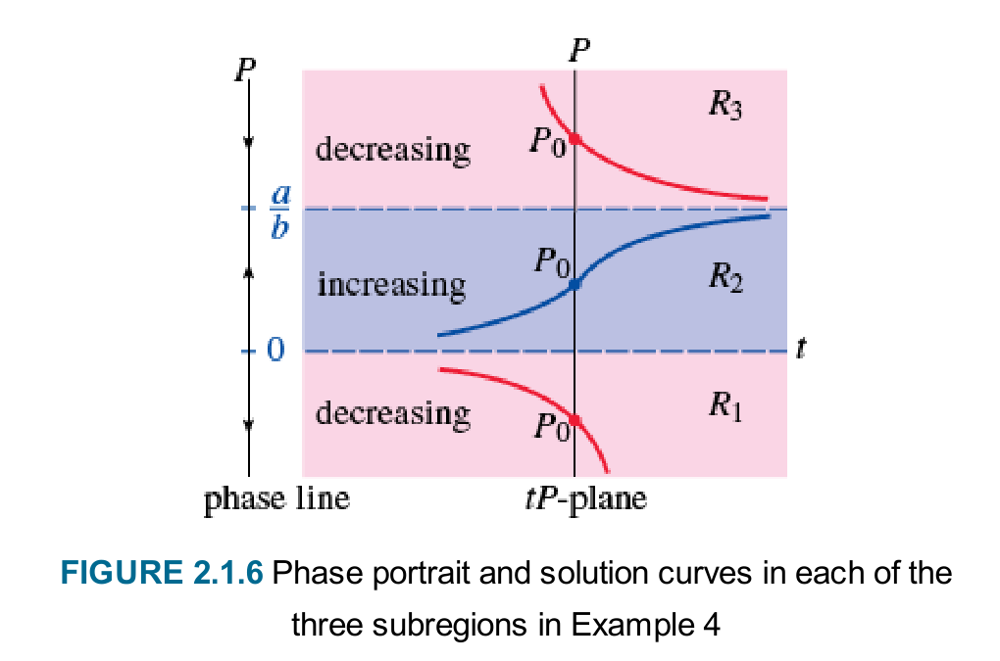
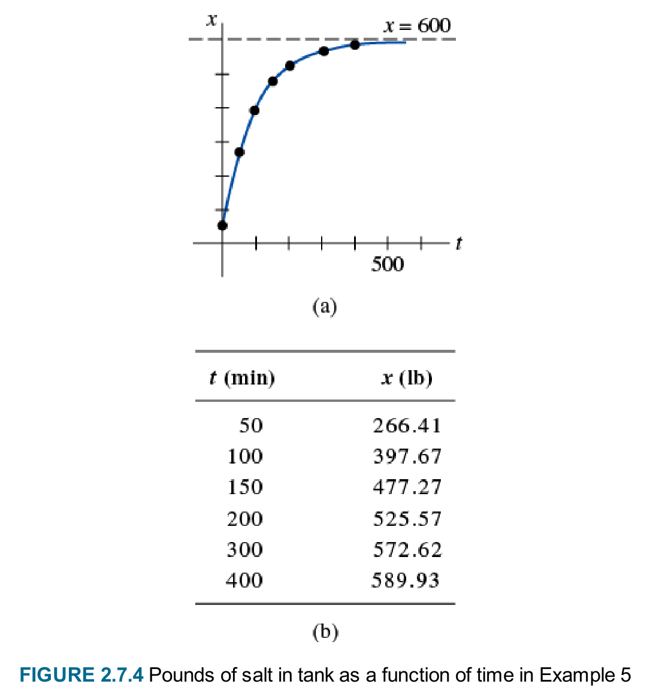
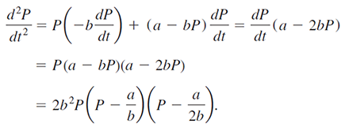

# Chapter 02: First-Order Differential Equations & Modeling
### Concordia University · Department of Mechanical, Industrial & Aerospace Engineering
**Course**: Applied Ordinary Differential Equations (ENGR 213)  
**Textbook**: *Advanced Engineering Mathematics* (7th Edition) by Dennis G. Zill — Chapter 2 (§2.1, §2.2, §2.3, §2.4, §2.5, §2.7, §2.8)

---

## 1. Executive Summary & Road Map

Chapter 2 forms the analytical and practical core of first-order ordinary differential equations. In this chapter, we master the complete toolkit for analyzing, solving, and interpreting first-order equations:

```
First-Order Differential Equations (§2.1 - §2.8)
 ├── Qualitative Analysis (§2.1)
 │     ├── Direction fields & lineal elements
 │     └── Autonomous ODEs, phase line portraits & stability (attractor, repeller, semi-stable)
 ├── Analytical Methods (§2.2 - §2.5)
 │     ├── §2.2 Separation of Variables: g(x)dx = h(y)dy & lost singular solutions
 │     ├── §2.3 First-Order Linear: y' + P(x)y = f(x) via Integrating Factor μ(x) = exp(∫P dx)
 │     ├── §2.4 Exact Equations: M dx + N dy = 0 (My = Nx) & integrating multipliers
 │     └── §2.5 Substitutions:
 │           ├── Homogeneous equations: y = u·x
 │           ├── Bernoulli equations: w = y^(1-n)
 │           └── Linear composition: u = Ax + By + C
 └── Physical Modeling (§2.7 - §2.8)
       ├── §2.7 Linear Models: growth/decay, Newton cooling, mixture tanks (equal/unequal rates), LR/RC circuits
       └── §2.8 Nonlinear Models: logistic population dynamics, carrying capacity, Torricelli tank draining
```

---

## 2. Qualitative Analysis: Direction Fields & Stability (§2.1)

### 2.1 Direction Fields and Flow Trajectories
When an analytical formula for the solution of $\frac{dy}{dx} = f(x, y)$ cannot be obtained, or when global behavior must be visualized immediately, we employ **Direction Fields** (also known as slope fields).

1. **Lineal Elements**: At each point $(x, y)$, the value $f(x, y)$ represents the slope of the tangent line. A short line segment with slope $m = f(x, y)$ centered at $(x, y)$ is a **lineal element**.
2. **Isoclines**: Curves along which the slope is constant ($f(x, y) = c$). Connecting points of identical slope assists in hand-sketching direction fields.
3. **Integral Curves**: Any solution $y = \phi(x)$ must pass through the direction field such that its tangent line at every point coincides with the lineal element.


*Figure 2.1: Direction field and family of integral solution curves for $\frac{dy}{dx} = 0.2xy$ — extracted directly from Official Textbook (7th Ed., Chapter 2, Fig. 2.1.2).*

#### In-Depth Pedagogical Breakdown:
* **Symmetries and Zeros (Fig. 2.1.2a)**:
  - Along the axes ($x = 0$ or $y = 0$), the slope is strictly zero ($0.2(0) = 0$). All lineal elements on the axes are strictly horizontal.
  - In Quadrants I ($x>0, y>0$) and III ($x<0, y<0$), the product $xy > 0$, so all slopes are positive.
  - In Quadrants II ($x<0, y>0$) and IV ($x>0, y<0$), the product $xy < 0$, so all slopes are negative.
* **Integral Solution Curves (Fig. 2.1.2b)**:
  - Solving $\frac{dy}{y} = 0.2x dx \implies \ln|y| = 0.1x^2 + C_1 \implies y(x) = c e^{0.1x^2}$.
  - For $c > 0$, the curves form upward-opening exponential profiles.
  - The line $y \equiv 0$ ($c = 0$) serves as an equilibrium barrier that solution curves never cross.

---

### 2.2 Autonomous First-Order ODEs & Phase Line Analysis

An ODE is **autonomous** if the independent variable $x$ (or time $t$) does not appear explicitly:
$$\frac{dy}{dx} = f(y)$$

#### A. Critical Points & Equilibrium Solutions
The zeros of the function $f(y)$ are called **critical points**, **equilibrium points**, or **stationary points**.
If $f(c) = 0$, then the constant function:
$$y(x) \equiv c$$
is a solution of the ODE, called an **equilibrium solution**. On the direction field, equilibrium solutions are horizontal straight lines.

#### B. The One-Dimensional Phase Line
The critical points divide the $y$-axis into distinct open intervals. Because $f(y)$ is continuous, it cannot change sign on any interval between adjacent critical points:
* If $f(y) > 0$ on $(c_1, c_2)$, then $\frac{dy}{dx} > 0$, meaning every solution curve in this region is strictly **increasing** (represented by an **upward arrow** $\uparrow$ on the phase line).
* If $f(y) < 0$ on $(c_1, c_2)$, then $\frac{dy}{dx} < 0$, meaning every solution curve in this region is strictly **decreasing** (represented by a **downward arrow** $\downarrow$ on the phase line).

#### C. Classification of Critical Points
1. **Asymptotically Stable (Attractor / Sink)**:
   - Arrows on both sides point toward $c$ ($\downarrow$ from above, $\uparrow$ from below).
   - Any solution starting near $c$ converges to $c$ as $x \to \infty$: $\lim_{x \to \infty} y(x) = c$.
   - **Derivative Test**: If $f'(c) < 0$, then $c$ is asymptotically stable.
2. **Unstable (Repeller / Source)**:
   - Arrows on both sides point away from $c$ ($\uparrow$ above, $\downarrow$ below).
   - Solutions diverge away from $c$ as $x \to \infty$.
   - **Derivative Test**: If $f'(c) > 0$, then $c$ is unstable.
3. **Semi-Stable (Shunt)**:
   - Arrows on both sides point in the same direction ($\uparrow$ on both sides, or $\downarrow$ on both sides).
   - Solutions approach $c$ from one side but diverge from the other. Occurs when $f(y)$ has a root of even multiplicity (e.g., $f(y) = (y - c)^2$).
   - **Derivative Test**: If $f'(c) = 0$ and $f''(c) \ne 0$, $c$ is semi-stable.


*Figure 2.2: Autonomous phase line mapped to solution trajectories in the $tP$-plane across regions $R_1, R_2, R_3$ — from Textbook 7th Ed. (Fig. 2.1.6).*

#### D. Translation Property of Autonomous ODEs
If $y(x)$ is a solution of an autonomous ODE $\frac{dy}{dx} = f(y)$, then $y(x - x_0)$ is also a solution for any constant $x_0$.
*Geometrical Meaning*: Every solution curve in a given region between critical points is simply a horizontal translation of any other solution curve in that region.

---

## 3. Analytical Solution Engine (§2.2 - §2.5)

### 3.1 Separation of Variables (§2.2)

An equation is separable if it can be factored into a product of a function of $x$ and a function of $y$:
$$\frac{dy}{dx} = g(x)h(y)$$

#### Step-by-Step Algorithm:
1. **Identify Critical Points**: Solve $h(y) = 0$. Each real root $y = r$ gives an immediate constant solution $y(x) \equiv r$.
2. **Separate**: Assuming $h(y) \ne 0$, divide by $h(y)$ and multiply by $dx$:
   $$\frac{1}{h(y)}dy = g(x)dx$$
3. **Integrate**:
   $$\int \frac{1}{h(y)}dy = \int g(x)dx + C$$
4. **Isolate $y$ (if possible)**: Solve explicitly for $y = \phi(x, C)$.
5. **Check for Lost (Singular) Solutions**: Compare the constant solutions $y \equiv r$ found in Step 1 with the family obtained in Step 4. If $y \equiv r$ cannot be obtained by any choice of $C$, it is a **singular solution** and must be listed separately.

---

### 3.2 First-Order Linear Equations (§2.3)

A first-order linear ODE can always be written in **standard form**:
$$\frac{dy}{dx} + P(x)y = f(x)$$

#### Theoretical Derivation of the Integrating Factor:
We seek a multiplying function $\mu(x)$ such that the left-hand side transforms into the derivative of a single product:
$$\mu(x)\left[\frac{dy}{dx} + P(x)y\right] = \frac{d}{dx}[\mu(x)y] = \mu(x)\frac{dy}{dx} + \mu'(x)y$$
Equating coefficients of $y$:
$$\mu(x)P(x) = \mu'(x) \implies \frac{1}{\mu}\frac{d\mu}{dx} = P(x) \implies \ln|\mu| = \int P(x)dx \implies \mu(x) = e^{\int P(x)dx}$$

#### Complete Master Solution Formula:
1. Put the ODE in standard form (divide by leading coefficient $a_1(x)$ if $a_1(x) \ne 1$):
   $$\frac{dy}{dx} + P(x)y = f(x)$$
2. Calculate the integrating factor:
   $$\mu(x) = e^{\int P(x)dx}$$
3. Multiply the entire standard equation by $\mu(x)$:
   $$\frac{d}{dx}[\mu(x)y] = \mu(x)f(x)$$
4. Integrate both sides with respect to $x$:
   $$\mu(x)y = \int \mu(x)f(x)dx + C$$
5. Divide by $\mu(x)$ to obtain the explicit general solution:
   $$y(x) = \frac{1}{\mu(x)}\int \mu(x)f(x)dx + \frac{C}{\mu(x)}$$

#### Theorem 2.3.1 (Continuity & Interval of Definition):
If $P(x)$ and $f(x)$ are continuous on an open interval $I$ containing $x_0$, then there exists a unique solution to the IVP $y' + P(x)y = f(x), \; y(x_0) = y_0$, and this solution is **continuous on the entire interval $I$**.
*Critical Insight*: Unlike nonlinear equations, the domain of validity of a linear ODE's solution is completely known in advance simply by finding the discontinuities of $P(x)$ and $f(x)$!

---

### 3.3 Exact Equations & Integrating Multipliers (§2.4)

A differential expression $M(x, y)dx + N(x, y)dy$ is an **exact differential** in a region $R$ of the $xy$-plane if it corresponds to the total differential $df$ of some multivariable potential function $f(x, y)$:
$$df = \frac{\partial f}{\partial x}dx + \frac{\partial f}{\partial y}dy = M(x, y)dx + N(x, y)dy$$

#### Theorem 2.4.1 (Test for Exactness):
Let $M(x, y)$ and $N(x, y)$ be continuous and have continuous first partial derivatives in a simply connected region $R$. Then:
$$M(x, y)dx + N(x, y)dy = 0 \quad \text{is EXACT} \iff \frac{\partial M}{\partial y} = \frac{\partial N}{\partial x}$$

#### Exhaustive Step-by-Step Solving Algorithm:
* **Step 1**: Check exactness: compute $M_y = \frac{\partial M}{\partial y}$ and $N_x = \frac{\partial N}{\partial x}$. If $M_y = N_x$, proceed.
* **Step 2**: Since $\frac{\partial f}{\partial x} = M(x, y)$, integrate $M$ with respect to $x$ (treating $y$ as a constant):
  $$f(x, y) = \int M(x, y)dx + g(y)$$
  where $g(y)$ is the arbitrary function of integration.
* **Step 3**: Differentiate $f(x, y)$ with respect to $y$:
  $$\frac{\partial f}{\partial y} = \frac{\partial}{\partial y}\left[\int M(x, y)dx\right] + g'(y)$$
* **Step 4**: Set this partial derivative equal to $N(x, y)$ and solve for $g'(y)$:
  $$\frac{\partial}{\partial y}\left[\int M(x, y)dx\right] + g'(y) = N(x, y) \implies g'(y) = N(x, y) - \frac{\partial}{\partial y}\left[\int M(x, y)dx\right]$$
  *(Verification checkpoint: all $x$ variables MUST cancel out. If $x$ remains in $g'(y)$, an error occurred!)*
* **Step 5**: Integrate $g'(y)$ with respect to $y$ to obtain $g(y)$.
* **Step 6**: State the final implicit solution:
  $$f(x, y) = C$$

#### Integrating Multipliers for Non-Exact Equations:
If $M_y \ne N_x$, multiply by an integrating factor $\mu(x, y)$ such that $(\mu M)_y = (\mu N)_x$:
1. **Case 1: Factor of $x$ alone**:
   If $\frac{M_y - N_x}{N} = p(x)$ (depends only on $x$), then:
   $$\mu(x) = e^{\int \frac{M_y - N_x}{N}dx}$$
2. **Case 2: Factor of $y$ alone**:
   If $\frac{N_x - M_y}{M} = q(y)$ (depends only on $y$), then:
   $$\mu(y) = e^{\int \frac{N_x - M_y}{M}dy}$$

---

### 3.4 Solutions by Substitution (§2.5)

```
Substitutions Toolkit (§2.5)
 ├── 1. Homogeneous Equations: M(tx, ty) = tⁿ M(x, y) & N(tx, ty) = tⁿ N(x, y)
 │     └── Substitute y = u·x  ==>  dy = u dx + x du  (Separable in u and x)
 ├── 2. Bernoulli Equations: y' + P(x)y = Q(x)yⁿ
 │     └── Multiply by y^(-n), let w = y^(1-n)  ==>  Linear in w!
 └── 3. Linear Composition: y' = f(Ax + By + C)
       └── Let u = Ax + By + C  ==>  du/dx = A + B·y'  (Separable in u and x)
```

#### A. Homogeneous Equations
A function $f(x, y)$ is homogeneous of degree $n$ if $f(tx, ty) = t^n f(x, y)$.
If $M(x, y)$ and $N(x, y)$ are both homogeneous of the same degree $n$, the ODE $M dx + N dy = 0$ can be written as $\frac{dy}{dx} = F\left(\frac{y}{x}\right)$.
* **Substitution**: Let $y = u x \implies \frac{dy}{dx} = u + x\frac{du}{dx}$.
* **Separable Form**:
  $$u + x\frac{du}{dx} = F(u) \implies x\frac{du}{dx} = F(u) - u \implies \frac{du}{F(u) - u} = \frac{dx}{x}$$
* *Alternative*: If $M(x, y)$ is simpler than $N(x, y)$, substitute $x = v y \implies dx = v dy + y dv$.

#### B. Bernoulli Equations
An ODE of the form:
$$\frac{dy}{dx} + P(x)y = f(x)y^n, \quad n \ne 0, 1$$
is called a **Bernoulli Equation**.
* **Baby-Step Linearization**:
  1. Divide through by $y^n$:
     $$y^{-n}\frac{dy}{dx} + P(x)y^{1-n} = f(x)$$
  2. Substitute $w = y^{1-n}$. By the chain rule:
     $$\frac{dw}{dx} = (1 - n)y^{-n}\frac{dy}{dx} \implies y^{-n}\frac{dy}{dx} = \frac{1}{1 - n}\frac{dw}{dx}$$
  3. Substitute into the equation:
     $$\frac{1}{1 - n}\frac{dw}{dx} + P(x)w = f(x)$$
  4. Multiply by $(1 - n)$ to achieve standard linear form:
     $$\frac{dw}{dx} + (1 - n)P(x)w = (1 - n)f(x)$$
  5. Solve for $w(x)$ using an integrating factor, then back-substitute $y = w^{1/(1-n)}$.

#### C. Reduction to Separation of Variables
An ODE of the form $\frac{dy}{dx} = f(Ax + By + C)$ with $B \ne 0$:
1. Substitute $u = Ax + By + C$.
2. Differentiate with respect to $x$: $\frac{du}{dx} = A + B\frac{dy}{dx} \implies \frac{dy}{dx} = \frac{1}{B}\left(\frac{du}{dx} - A\right)$.
3. Substitute: $\frac{1}{B}\left(\frac{du}{dx} - A\right) = f(u) \implies \frac{du}{dx} = A + B f(u)$.
4. Separate: $\frac{du}{A + B f(u)} = dx$.

---

## 4. Applied Physical Modeling Engine (§2.7 - §2.8)

### 4.1 Industrial Mixture Tanks (Equal vs. Unequal Flow Rates)


*Figure 2.3: Mixing tank schematic showing fluid inflow, impeller agitation, and bottom drainage — from Textbook 7th Ed. (Fig. 1.3.3).*


*Figure 2.4: Salt accumulation curve $x(t)$ approaching horizontal asymptote $x = 600\text{ lb}$ — from Textbook 7th Ed. (Fig. 2.7.4).*

#### In-Depth Mathematical Modeling:
1. **Governing Equation**:
   $$\frac{dA}{dt} + \left(\frac{r_{\text{out}}}{V_0 + (r_{\text{in}} - r_{\text{out}})t}\right)A = r_{\text{in}} c_{\text{in}}$$
2. **Case Study (Equal Flow Rates $r_{\text{in}} = r_{\text{out}} = 3\text{ gal/min}$)**:
   - Tank volume $V(t) = 300\text{ gal}$, initial salt $A(0) = 50\text{ lb}$, input concentration $c_{\text{in}} = 2\text{ lb/gal}$.
   - Input rate: $R_{\text{in}} = (3\text{ gal/min})(2\text{ lb/gal}) = 6\text{ lb/min}$.
   - Output rate: $R_{\text{out}} = (3\text{ gal/min})\left(\frac{A}{300}\text{ lb/gal}\right) = \frac{1}{100}A\text{ lb/min}$.
   - Standard Form: $\frac{dA}{dt} + \frac{1}{100}A = 6$.
   - Integrating Factor: $\mu(t) = e^{\int 0.01 dt} = e^{0.01 t}$.
   - Integration: $\frac{d}{dt}[e^{0.01 t} A] = 6 e^{0.01 t} \implies e^{0.01 t} A = 600 e^{0.01 t} + C \implies A(t) = 600 + C e^{-0.01 t}$.
   - Apply $A(0) = 50 \implies 50 = 600 + C \implies C = -550$.
   - Analytical Solution:
     $$A(t) = 600 - 550 e^{-t/100}\text{ lb}$$
   - As $t \to \infty$, $A(t) \to 600\text{ lb}$, which equals $V \times c_{\text{in}} = 300 \times 2 = 600\text{ lb}$ (asymptote in Fig. 2.7.4).

---

### 4.2 Nonlinear Population Dynamics: The Logistic Model (§2.8)

In 1840, Pierre François Verhulst modified the Malthusian law by adding an environment-limiting competition term $-b P^2$:
$$\frac{dP}{dt} = P(a - b P), \quad a, b > 0$$

Writing in terms of intrinsic growth rate $r = a$ and carrying capacity $K = a/b$:
$$\frac{dP}{dt} = r P\left(1 - \frac{P}{K}\right)$$


*Figure 2.5: Family of logistic curves showing sigmoidal growth and asymptotic convergence to carrying capacity $K$ — from Textbook 7th Ed. (Fig. 2.8.2).*

#### Exhaustive Step-by-Step Derivation of the Logistic Formula:
1. **Separate Variables**:
   $$\frac{dP}{P(a - b P)} = dt$$
2. **Partial Fraction Decomposition**:
   $$\frac{1}{P(a - b P)} = \frac{A}{P} + \frac{B}{a - b P} \implies 1 = A(a - b P) + B P$$
   - Setting $P = 0 \implies 1 = A(a) \implies A = \frac{1}{a}$.
   - Setting $P = \frac{a}{b} \implies 1 = B\left(\frac{a}{b}\right) \implies B = \frac{b}{a}$.
   $$\frac{1}{a}\left(\frac{1}{P} + \frac{b}{a - b P}\right)dP = dt \implies \left(\frac{1}{P} + \frac{b}{a - b P}\right)dP = a\,dt$$
3. **Integrate Both Sides**:
   $$\ln|P| - \ln|a - b P| = at + C_1 \implies \ln\left|\frac{P}{a - b P}\right| = at + C_1 \implies \frac{P}{a - b P} = C e^{at}$$
4. **Solve for $P(t)$**:
   $$P = C e^{at}(a - b P) = a C e^{at} - b C e^{at} P \implies P(1 + b C e^{at}) = a C e^{at}$$
   $$P(t) = \frac{a C e^{at}}{1 + b C e^{at}} = \frac{a C}{e^{-at} + b C}$$
5. **Apply Initial Condition $P(0) = P_0$**:
   $$\frac{P_0}{a - b P_0} = C$$
   Substituting $C$ and simplifying yields the **Canonical Logistic Formula**:
   $$P(t) = \frac{a P_0}{b P_0 + (a - b P_0)e^{-at}} = \frac{K P_0}{P_0 + (K - P_0)e^{-rt}}$$

#### Important Qualitative Features:
* **Asymptote**: For any initial population $P_0 > 0$:
  $$\lim_{t \to \infty} P(t) = \frac{K P_0}{P_0 + 0} = K$$
* **Inflection Point**: Differentiating $\frac{dP}{dt} = a P - b P^2$:
  $$\frac{d^2P}{dt^2} = (a - 2b P)\frac{dP}{dt} = (a - 2b P) P(a - b P)$$
  The inflection point occurs at $a - 2b P = 0 \implies P = \frac{a}{2b} = \frac{K}{2}$.
  The growth rate $\frac{dP}{dt}$ is at its **maximum** when the population reaches exactly **half its carrying capacity**!

---

## 5. Fully Worked Master Archetypes

### Archetype 5.1: Linear First-Order ODE with Trigonometric Integrating Factor
**Problem**: Solve the initial-value problem:
$$x \frac{dy}{dx} + 2y = \frac{\sin x}{x}, \quad y(\pi) = 1, \quad x > 0$$

#### Step-by-Step Solution:
* **Step 1: Convert to Standard Form**:
  Divide the entire equation by $x$:
  $$\frac{dy}{dx} + \frac{2}{x}y = \frac{\sin x}{x^2}$$
  Here $P(x) = \frac{2}{x}$ and $f(x) = \frac{\sin x}{x^2}$. Both are continuous on $(0, \infty)$.
* **Step 2: Calculate the Integrating Factor**:
  $$\mu(x) = e^{\int \frac{2}{x}dx} = e^{2\ln x} = e^{\ln(x^2)} = x^2$$
* **Step 3: Multiply Standard Form by $\mu(x)$**:
  $$x^2 \frac{dy}{dx} + 2x y = \sin x \implies \frac{d}{dx}[x^2 y] = \sin x$$
* **Step 4: Integrate Both Sides**:
  $$x^2 y = \int \sin x\,dx = -\cos x + C$$
* **Step 5: Isolate $y(x)$**:
  $$y(x) = -\frac{\cos x}{x^2} + \frac{C}{x^2}$$
* **Step 6: Apply Initial Condition $y(\pi) = 1$**:
  $$1 = -\frac{\cos(\pi)}{\pi^2} + \frac{C}{\pi^2} = -\frac{-1}{\pi^2} + \frac{C}{\pi^2} = \frac{1 + C}{\pi^2}$$
  $$\pi^2 = 1 + C \implies C = \pi^2 - 1$$
* **Final Solution**:
  $$y(x) = \frac{\pi^2 - 1 - \cos x}{x^2}, \quad x \in (0, \infty)$$

---

### Archetype 5.2: Exact ODE Requiring an Integrating Multiplier $\mu(y)$
**Problem**: Solve the differential equation:
$$(2x y^4 e^y + 2x y^3 + y)dx + (x^2 y^4 e^y - x^2 y^2 - 3x)dy = 0$$

#### Step-by-Step Solution:
* **Step 1: Test for Exactness**:
  $$M(x, y) = 2x y^4 e^y + 2x y^3 + y \implies \frac{\partial M}{\partial y} = 2x(4y^3 e^y + y^4 e^y) + 6x y^2 + 1 = 8x y^3 e^y + 2x y^4 e^y + 6x y^2 + 1$$
  $$N(x, y) = x^2 y^4 e^y - x^2 y^2 - 3x \implies \frac{\partial N}{\partial x} = 2x y^4 e^y - 2x y^2 - 3$$
  $$M_y - N_x = 8x y^3 e^y + 8x y^2 + 4 = 4(2x y^3 e^y + 2x y^2 + 1)$$
  Because $M_y \ne N_x$, the equation is not exact.
* **Step 2: Evaluate Integrating Factor Criteria**:
  Notice $M(x, y) = y(2x y^3 e^y + 2x y^2 + 1)$.
  Therefore:
  $$\frac{N_x - M_y}{M} = \frac{-4(2x y^3 e^y + 2x y^2 + 1)}{y(2x y^3 e^y + 2x y^2 + 1)} = -\frac{4}{y}$$
  This depends solely on $y$!
* **Step 3: Compute Integrating Factor $\mu(y)$**:
  $$\mu(y) = e^{\int -\frac{4}{y}dy} = e^{-4\ln|y|} = y^{-4} = \frac{1}{y^4}$$
* **Step 4: Multiply the Entire ODE by $\mu(y) = y^{-4}$**:
  $$\left(2x e^y + \frac{2x}{y} + \frac{1}{y^3}\right)dx + \left(x^2 e^y - \frac{x^2}{y^2} - \frac{3x}{y^4}\right)dy = 0$$
* **Step 5: Re-test Exactness**:
  $$M_{\text{new}, y} = 2x e^y - \frac{2x}{y^2} - \frac{3}{y^4}$$
  $$N_{\text{new}, x} = 2x e^y - \frac{2x}{y^2} - \frac{3}{y^4} \quad \checkmark \text{ EXACT!}$$
* **Step 6: Integrate with Respect to $x$**:
  $$f(x, y) = \int \left(2x e^y + \frac{2x}{y} + \frac{1}{y^3}\right)dx = x^2 e^y + \frac{x^2}{y} + \frac{x}{y^3} + g(y)$$
* **Step 7: Match with $N_{\text{new}}$**:
  $$\frac{\partial f}{\partial y} = x^2 e^y - \frac{x^2}{y^2} - \frac{3x}{y^4} + g'(y) = x^2 e^y - \frac{x^2}{y^2} - \frac{3x}{y^4}$$
  $$g'(y) = 0 \implies g(y) = C_1$$
* **Final General Solution**:
  $$x^2 e^y + \frac{x^2}{y} + \frac{x}{y^3} = C$$

---

### Archetype 5.3: Bernoulli Equation Transformation
**Problem**: Solve the initial-value problem:
$$x^2 \frac{dy}{dx} - 2xy = 3y^4, \quad y(1) = \frac{1}{2}$$

#### Step-by-Step Solution:
* **Step 1: Identify Bernoulli Form and Divide by $x^2$**:
  $$\frac{dy}{dx} - \frac{2}{x}y = \frac{3}{x^2}y^4$$
  Here $P(x) = -\frac{2}{x}$, $Q(x) = \frac{3}{x^2}$, and $n = 4$.
* **Step 2: Divide by $y^4$**:
  $$y^{-4}\frac{dy}{dx} - \frac{2}{x}y^{-3} = \frac{3}{x^2}$$
* **Step 3: Define the Substitution**:
  $$w = y^{1 - n} = y^{1 - 4} = y^{-3}$$
  $$\frac{dw}{dx} = -3y^{-4}\frac{dy}{dx} \implies y^{-4}\frac{dy}{dx} = -\frac{1}{3}\frac{dw}{dx}$$
* **Step 4: Substitute into the ODE**:
  $$-\frac{1}{3}\frac{dw}{dx} - \frac{2}{x}w = \frac{3}{x^2}$$
  Multiply by $-3$:
  $$\frac{dw}{dx} + \frac{6}{x}w = -\frac{9}{x^2}$$
* **Step 5: Solve the Linear ODE for $w(x)$**:
  $$\mu(x) = e^{\int \frac{6}{x}dx} = e^{6\ln x} = x^6$$
  $$\frac{d}{dx}[x^6 w] = x^6 \left(-\frac{9}{x^2}\right) = -9x^4$$
  $$x^6 w = \int -9x^4 dx = -\frac{9}{5}x^5 + C$$
  $$w(x) = -\frac{9}{5x} + \frac{C}{x^6}$$
* **Step 6: Back-Substitute $w = y^{-3}$**:
  $$\frac{1}{y^3} = \frac{C - \frac{9}{5}x^5}{x^6} \implies y(x) = \left(\frac{x^6}{C - \frac{9}{5}x^5}\right)^{1/3}$$
* **Step 7: Apply Initial Condition $y(1) = 1/2$**:
  $$y(1) = \frac{1}{2} \implies \frac{1}{(1/2)^3} = 8 = \frac{C - 9/5}{1} \implies C = 8 + \frac{9}{5} = \frac{49}{5}$$
* **Final Explicit Solution**:
  $$y(x) = \left(\frac{5x^6}{49 - 9x^5}\right)^{1/3}$$

---

## 6. Diagnostic Traps, Common Pitfalls & Exam Warnings

* ⚠️ **Trap 1: Dropping Negative Signs in Integrating Factors**:
  For $\frac{dy}{dx} - \frac{3}{x}y = x^2$, the coefficient is $P(x) = -\frac{3}{x}$.
  $$\mu(x) = e^{\int -\frac{3}{x}dx} = e^{-3\ln x} = x^{-3} = \frac{1}{x^3}$$
  *Never* write $x^3$! Dropping the negative sign completely ruins the product rule on the LHS.

* ⚠️ **Trap 2: Forgetting to Multiply $f(x)$ by the Integrating Factor**:
  $$\frac{d}{dx}[\mu(x)y] = \mu(x)f(x)$$
  Students frequently write $\frac{d}{dx}[\mu y] = f(x)$, forgetting to multiply the right-hand side by $\mu(x)$ before integrating.

* ⚠️ **Trap 3: Variable Volume Mixing Pitfalls**:
  When $r_{\text{in}} \ne r_{\text{out}}$, the volume is $V(t) = V_0 + (r_{\text{in}} - r_{\text{out}})t$.
  *Common mistake*: Treating volume as constant $V_0$. This turns a variable-coefficient integrating factor $\mu(t) = (V_0 + \Delta r \cdot t)^k$ into an incorrect exponential $e^{kt}$.

* ⚠️ **Trap 4: Forgetting the Integrating Constant on Partial Integrals in Exact ODEs**:
  When integrating $M(x, y)$ with respect to $x$, the constant of integration is a function of $y$: $g(y)$.
  Writing a numerical constant $+ C$ prevents solving for $N(x, y)$ and breaks the exact algorithm.
