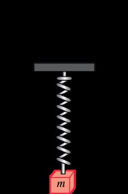

# Chapter 03: Higher-Order Linear Differential Equations & Mechanical Oscillators
### Concordia University · Department of Mechanical, Industrial & Aerospace Engineering
**Course**: Applied Ordinary Differential Equations (ENGR 213)  
**Textbook**: *Advanced Engineering Mathematics* (7th Edition) by Dennis G. Zill — Chapter 3 (§3.1, §3.2, §3.3, §3.4, §3.5, §3.6, §3.8)

---

## 1. Executive Overview & Structural Taxonomy

Higher-order linear differential equations govern physical systems with inertia, elasticity, energy dissipation, and external periodic forcing. While first-order equations describe relaxation, decay, and transient accumulation, second-order and higher-order equations capture **vibrations, waves, resonance, and multidimensional feedback loops**.

```
Higher-Order Linear Differential Equations (Chapter 3)
 ├── 1. Theoretical Foundations (§3.1)
 │     ├── Existence & Uniqueness Theorem 3.1.1 (IVP vs BVP)
 │     ├── Superposition principle & linear independence
 │     └── The Wronskian determinant W(y₁, y₂, ..., yₙ) & Abel's formula
 ├── 2. Solution of Homogeneous Equations
 │     ├── §3.2 Reduction of Order: Given y₁, find y₂ via y₂ = y₁ ∫(e^(-∫P dx)/y₁²) dx
 │     ├── §3.3 Constant Coefficients: a y'' + b y' + c y = 0 via ar² + br + c = 0
 │     │     ├── Case 1: Real distinct roots (r₁ ≠ r₂)
 │     │     ├── Case 2: Repeated real root (r₁ = r₂ ==> y = (c₁ + c₂x)e^(rx))
 │     │     └── Case 3: Complex conjugate roots (α ± iβ ==> e^(αx)[c₁ cos βx + c₂ sin βx])
 │     └── §3.6 Cauchy-Euler Equations: a x² y'' + b x y' + c y = 0 via a m(m-1) + bm + c = 0
 ├── 3. Non-Homogeneous Equations (y = y_c + y_p)
 │     ├── §3.4 Method of Undetermined Coefficients (Superposition & Annihilator)
 │     │     └── The Duplication Rule: Multiply trial terms by xˢ when colliding with y_c
 │     └── §3.5 Method of Variation of Parameters: y_p = u₁y₁ + u₂y₂
 │           ├── u₁' = -y₂ f(x)/W  and  u₂' = y₁ f(x)/W
 │           └── Handles non-elementary forcing (tan x, sec x, 1/x, eˣ/x)
 └── 4. Engineering Applications (§3.8)
       ├── Mass-spring-damper mechanical systems: m x'' + β x' + k x = F(t)
       ├── Free vibrations: Underdamped, Critically Damped, Overdamped
       └── Forced vibrations & Pure Resonance: Catastrophic linear amplitude growth (t·sin ωt)
```

---

## 2. Theoretical Foundations of Linear Equations (§3.1)

### 2.1 Initial-Value vs. Boundary-Value Problems

An $n$-th order linear differential equation in normal standard form is written as:
$$y^{(n)} + P_{n-1}(x)y^{(n-1)} + \dots + P_1(x)y' + P_0(x)y = g(x)$$

#### A. Initial-Value Problem (IVP)
All conditions are prescribed at a **single point** $x_0$:
$$y(x_0) = y_0, \quad y'(x_0) = y_1, \quad \dots, \quad y^{(n-1)}(x_0) = y_{n-1}$$

> **Theorem 3.1.1 (Existence and Uniqueness for Linear IVPs)**:
> Let $P_0(x), P_1(x), \dots, P_{n-1}(x)$ and $g(x)$ be **continuous** on an open interval $I$, and let $x_0 \in I$.
> Then a solution $y(x)$ of the initial-value problem **exists on the entire interval $I$ and is UNIQUE**.

*Crucial Engineering Takeaway*: For linear ODEs, discontinuities in the coefficients $P_i(x)$ or $g(x)$ are the **only** points where uniqueness or existence can break down. Unlike nonlinear equations, the interval of definition is completely known beforehand!

#### B. Boundary-Value Problem (BVP)
Conditions are prescribed at **two or more distinct points** $a$ and $b$:
$$y(a) = y_0, \quad y(b) = y_1 \quad \text{or} \quad y'(a) = y_0, \quad y(b) = y_1$$
Unlike IVPs, Theorem 3.1.1 does **NOT** apply to BVPs! A boundary-value problem can possess:
1. A **unique solution**,
2. **Infinitely many solutions** (eigenfunction resonance), or
3. **No solution at all**!

*Textbook Example*: Solve $y'' + 16y = 0$ with $y(0) = 0$.
The general solution is $y(x) = c_1 \cos(4x) + c_2 \sin(4x)$.
Condition $y(0) = 0 \implies c_1(1) + c_2(0) = 0 \implies c_1 = 0$, so $y(x) = c_2 \sin(4x)$.
* If boundary condition is $y(\pi/2) = 0$: $c_2 \sin(2\pi) = 0 \implies 0 = 0$. This holds for **any** constant $c_2$. Hence, **infinitely many solutions** exist!
* If boundary condition is $y(\pi/2) = 1$: $c_2 \sin(2\pi) = 1 \implies 0 = 1$ (Contradiction!). Hence, **no solution** exists!

---

### 2.2 Linear Independence & The Wronskian Determinant

A set of functions $\{f_1(x), f_2(x), \dots, f_n(x)\}$ is **linearly dependent** on an interval $I$ if there exist constants $c_1, c_2, \dots, c_n$, not all zero, such that:
$$c_1 f_1(x) + c_2 f_2(x) + \dots + c_n f_n(x) \equiv 0 \quad \forall x \in I$$
If the only constants that satisfy this identity are $c_1 = c_2 = \dots = c_n = 0$, the functions are **linearly independent**.

#### The Wronskian Determinant:
For $n$ real-valued functions possessing at least $n - 1$ derivatives on $I$, the **Wronskian** is the determinant:
$$W(f_1, f_2, \dots, f_n)(x) = \begin{vmatrix} f_1(x) & f_2(x) & \dots & f_n(x) \\ f_1'(x) & f_2'(x) & \dots & f_n'(x) \\ \vdots & \vdots & \ddots & \vdots \\ f_1^{(n-1)}(x) & f_2^{(n-1)}(x) & \dots & f_n^{(n-1)}(x) \end{vmatrix}$$

For two functions $y_1, y_2$:
$$W(y_1, y_2) = \begin{vmatrix} y_1 & y_2 \\ y_1' & y_2' \end{vmatrix} = y_1 y_2' - y_1' y_2$$

> **Theorem 3.1.5 (Test for Linearly Independent Solutions)**:
> Let $y_1, y_2, \dots, y_n$ be $n$ solutions of the homogeneous $n$-th order linear differential equation $L(y) = 0$ on interval $I$.
> The set of solutions is **linearly independent** on $I$ if and only if:
> $$W(y_1, y_2, \dots, y_n)(x) \ne 0 \quad \text{for EVERY } x \in I$$

#### Abel's Formula for the Wronskian:
If $y_1, y_2$ are solutions of $y'' + P(x)y' + Q(x)y = 0$, then their Wronskian satisfies the first-order differential equation:
$$\frac{dW}{dx} + P(x)W = 0 \implies W(x) = C e^{-\int P(x)dx}$$
*Immediate Consequence*: Either $W(x) = 0$ for all $x \in I$ (if $C = 0$), or $W(x)$ is never zero on $I$ (since the exponential is strictly positive). The Wronskian of solutions to a linear ODE can **never change sign or cross zero** on $I$!

---

## 3. Analytical Methods for Homogeneous Equations (§3.2, §3.3, §3.6)

### 3.1 Reduction of Order (§3.2)

If one non-zero solution $y_1(x)$ of the second-order homogeneous linear ODE:
$$y'' + P(x)y' + Q(x)y = 0$$
is known, a second linearly independent solution $y_2(x)$ can be discovered by substituting:
$$y_2(x) = u(x)y_1(x)$$

#### First-Principles Step-by-Step Derivation:
1. **Compute Derivatives of $y_2$**:
   $$y_2' = u' y_1 + u y_1'$$
   $$y_2'' = u'' y_1 + 2u' y_1' + u y_1''$$
2. **Substitute into the ODE**:
   $$(u'' y_1 + 2u' y_1' + u y_1'') + P(x)(u' y_1 + u y_1') + Q(x)(u y_1) = 0$$
3. **Regroup Coefficients of $u'', u', u$**:
   $$y_1 u'' + (2y_1' + P y_1)u' + \underbrace{(y_1'' + P y_1' + Q y_1)}_{= 0 \text{ because } y_1 \text{ is a solution!}}u = 0$$
   The term multiplying $u$ vanishes identically!
   $$y_1 u'' + (2y_1' + P y_1)u' = 0$$
4. **Reduce to First-Order via $w = u'$**:
   $$y_1 w' + (2y_1' + P y_1)w = 0 \implies \frac{w'}{w} = -2\frac{y_1'}{y_1} - P(x)$$
5. **Integrate**:
   $$\ln|w| = -2\ln|y_1| - \int P(x)dx = \ln|y_1|^{-2} - \int P(x)dx \implies w = u' = \frac{e^{-\int P(x)dx}}{y_1^2}$$
6. **Integrate to find $u(x)$ and $y_2(x)$**:
   $$u(x) = \int \frac{e^{-\int P(x)dx}}{[y_1(x)]^2}dx$$

$$\mathbf{y_2(x) = y_1(x)\int \frac{e^{-\int P(x)dx}}{[y_1(x)]^2}dx}$$

---

### 3.2 Homogeneous Linear Equations with Constant Coefficients (§3.3)

Consider:
$$a y'' + b y' + c y = 0, \quad a \ne 0$$
Since $\frac{d}{dx}[e^{rx}] = r e^{rx}$, trial solution $y = e^{rx}$ yields:
$$a r^2 e^{rx} + b r e^{rx} + c e^{rx} = 0 \implies e^{rx}(a r^2 + b r + c) = 0$$
Since $e^{rx} \ne 0$ for all real $x$, we obtain the **Auxiliary (Characteristic) Equation**:
$$a r^2 + b r + c = 0$$
Roots are determined by the quadratic formula: $r = \frac{-b \pm \sqrt{b^2 - 4ac}}{2a}$.

```
Roots of Characteristic Equation: a r² + b r + c = 0
 ├── Case 1: Discriminant Δ = b² - 4ac > 0 (Distinct Real Roots)
 │     └── y(x) = c₁ e^(r₁x) + c₂ e^(r₂x)
 ├── Case 2: Discriminant Δ = b² - 4ac = 0 (Repeated Real Root: r₁ = r₂ = r)
 │     └── y(x) = (c₁ + c₂x)e^(rx)
 └── Case 3: Discriminant Δ = b² - 4ac < 0 (Complex Conjugate Roots: r = α ± iβ)
       └── y(x) = e^(αx)[c₁ cos(βx) + c₂ sin(βx)]
```

#### Detailed Proof of Case 3 (Euler's Formula Transition):
When $r = \alpha \pm i\beta$ with $\alpha = -\frac{b}{2a}$ and $\beta = \frac{\sqrt{4ac - b^2}}{2a}$:
$$y_{\text{complex}} = C_1 e^{(\alpha + i\beta)x} + C_2 e^{(\alpha - i\beta)x} = e^{\alpha x}\left[C_1 e^{i\beta x} + C_2 e^{-i\beta x}\right]$$
Using Euler's identity $e^{\pm i\beta x} = \cos(\beta x) \pm i\sin(\beta x)$:
$$y = e^{\alpha x}\left[C_1(\cos\beta x + i\sin\beta x) + C_2(\cos\beta x - i\sin\beta x)\right]$$
$$y = e^{\alpha x}\left[(C_1 + C_2)\cos\beta x + i(C_1 - C_2)\sin\beta x\right]$$
Defining real constants $c_1 = C_1 + C_2$ and $c_2 = i(C_1 - C_2)$:
$$y(x) = e^{\alpha x}\left[c_1 \cos(\beta x) + c_2 \sin(\beta x)\right]$$

---

### 3.3 Cauchy-Euler Equations (§3.6)

An equation of the form:
$$a_n x^n \frac{d^ny}{dx^n} + a_{n-1} x^{n-1}\frac{d^{n-1}y}{dx^{n-1}} + \dots + a_1 x \frac{dy}{dx} + a_0 y = g(x)$$
is called a **Cauchy-Euler (equidimensional) equation**. The degree of each power $x^k$ matches the order of the derivative $\frac{d^ky}{dx^k}$.

#### The Second-Order Cauchy-Euler Solution Engine:
$$a x^2 \frac{d^2y}{dx^2} + b x \frac{dy}{dx} + c y = 0, \quad x > 0$$
Substitute trial solution $y = x^m$:
$$y' = m x^{m-1}, \quad y'' = m(m-1)x^{m-2}$$
$$a x^2 [m(m-1)x^{m-2}] + b x [m x^{m-1}] + c x^m = 0$$
$$[a m(m-1) + b m + c]x^m = 0$$
Since $x^m \ne 0$ for $x > 0$, the **Cauchy-Euler Auxiliary Equation** is:
$$a m(m-1) + b m + c = 0 \iff a m^2 + (b - a)m + c = 0$$

> ⚠️ **CRITICAL EXAM WARNING**: Notice the term $(b - a)m$. The first derivative $x y'$ contributes $bm$, but the second derivative $x^2 y''$ contributes $a m(m-1) = a m^2 - am$. Missing the $-am$ term is the single most common student error in ENGR 213!

#### Three Solution Regimes for Cauchy-Euler:
1. **Case 1: Distinct Real Roots ($m_1 \ne m_2$)**:
   $$y(x) = c_1 x^{m_1} + c_2 x^{m_2}$$
2. **Case 2: Repeated Real Root ($m_1 = m_2 = m$)**:
   $$y(x) = c_1 x^m + c_2 x^m \ln x = (c_1 + c_2 \ln x)x^m$$
3. **Case 3: Complex Conjugate Roots ($m = \alpha \pm i\beta$)**:
   Recall that $x^{i\beta} = (e^{\ln x})^{i\beta} = e^{i\beta\ln x} = \cos(\beta\ln x) + i\sin(\beta\ln x)$.
   $$y(x) = x^\alpha\left[c_1 \cos(\beta\ln x) + c_2 \sin(\beta\ln x)\right]$$

---

## 4. Non-Homogeneous Differential Equations (§3.4, §3.5)

The general solution of a non-homogeneous linear ODE $L(y) = g(x)$ is:
$$y(x) = y_c(x) + y_p(x)$$
where $y_c(x)$ is the complementary solution of $L(y) = 0$, and $y_p(x)$ is any particular solution of $L(y) = g(x)$.

---

### 4.1 Method of Undetermined Coefficients (§3.4)

Applicable when the differential equation has **constant coefficients** and the forcing function $g(x)$ is a linear combination of:
* Polynomials ($x^k$)
* Exponentials ($e^{\alpha x}$)
* Sines and Cosines ($\sin\beta x, \cos\beta x$)
* Products of the above ($x^k e^{\alpha x} \cos\beta x$)

| Forcing Term $g(x)$ | Trial Particular Solution $y_p(x)$ |
| :--- | :--- |
| $1$ (constant) | $A$ |
| $5x + 7$ | $Ax + B$ |
| $3x^2 - 2$ | $Ax^2 + Bx + C$ |
| $e^{5x}$ | $A e^{5x}$ |
| $\sin(3x)$ or $\cos(3x)$ | $A \cos(3x) + B \sin(3x)$ |
| $x e^{2x}$ | $(Ax + B)e^{2x}$ |
| $e^{3x}\cos(2x)$ | $e^{3x}(A \cos 2x + B \sin 2x)$ |
| $x^2 \sin(4x)$ | $(Ax^2 + Bx + C)\cos 4x + (Ex^2 + Fx + G)\sin 4x$ |

#### The Duplication Rule (Rule of Multiplication):
If any term in the trial particular solution $y_p$ duplicates a term in the complementary solution $y_c(x)$, that entire trial family must be multiplied by $x^s$, where $s$ is the **smallest positive integer** ($s = 1$ or $s = 2$) that eliminates all duplication with $y_c(x)$.

---

### 4.2 Method of Variation of Parameters (§3.5)

Variation of parameters is the universal, powerful method that solves $y'' + P(x)y' + Q(x)y = f(x)$ regardless of whether $f(x)$ is amenable to undetermined coefficients (e.g., $f(x) = \tan x, \sec x, \frac{1}{x}, \ln x, \frac{e^x}{x}$).

#### First-Principles Step-by-Step Derivation:
We replace the constants in $y_c = c_1 y_1 + c_2 y_2$ with unknown variable parameters $u_1(x), u_2(x)$:
$$y_p(x) = u_1(x)y_1(x) + u_2(x)y_2(x)$$
1. Differentiate:
   $$y_p' = (u_1' y_1 + u_2' y_2) + (u_1 y_1' + u_2 y_2')$$
   To simplify and avoid second derivatives of $u_1, u_2$, impose the first constraint:
   $$u_1' y_1 + u_2' y_2 = 0$$
   Then $y_p' = u_1 y_1' + u_2 y_2'$.
2. Differentiate again:
   $$y_p'' = u_1' y_1' + u_1 y_1'' + u_2' y_2' + u_2 y_2''$$
3. Substitute $y_p, y_p', y_p''$ into $y'' + P y' + Q y = f(x)$:
   $$(u_1' y_1' + u_1 y_1'' + u_2' y_2' + u_2 y_2'') + P(u_1 y_1' + u_2 y_2') + Q(u_1 y_1 + u_2 y_2) = f(x)$$
   Regrouping:
   $$u_1 \underbrace{(y_1'' + P y_1' + Q y_1)}_{= 0} + u_2 \underbrace{(y_2'' + P y_2' + Q y_2)}_{= 0} + (u_1' y_1' + u_2' y_2') = f(x)$$
   Yielding the second constraint:
   $$u_1' y_1' + u_2' y_2' = f(x)$$
4. Solve the linear system for $u_1'$ and $u_2'$ via Cramer's Rule:
   $$\begin{cases} y_1 u_1' + y_2 u_2' = 0 \\ y_1' u_1' + y_2' u_2' = f(x) \end{cases} \implies \begin{bmatrix} y_1 & y_2 \\ y_1' & y_2' \end{bmatrix} \begin{bmatrix} u_1' \\ u_2' \end{bmatrix} = \begin{bmatrix} 0 \\ f(x) \end{bmatrix}$$

$$\mathbf{u_1'(x) = -\frac{y_2(x)f(x)}{W(y_1, y_2)}}, \qquad \mathbf{u_2'(x) = \frac{y_1(x)f(x)}{W(y_1, y_2)}}$$

Integrate to find $u_1(x)$ and $u_2(x)$, and assemble:
$$y_p(x) = y_1(x)\int -\frac{y_2(x)f(x)}{W(x)}dx + y_2(x)\int \frac{y_1(x)f(x)}{W(x)}dx$$

---

## 5. Applied Mechanical Oscillations & Resonance (§3.8)

### 5.1 Mass-Spring-Damper Physical Architecture


*Figure 3.1: Mass-spring-damper mechanical architecture showing reference position, equilibrium elongation $s$, and dynamic displacement $x(t)$ — from Textbook 7th Ed. (Fig. 3.8.2).*

#### Derivation of the Governing Equation from Newton's Second Law:
* Let a mass $m$ suspend vertically from a spring with spring constant $k$ (Hooke's Law).
* At static equilibrium, the downward gravitational force balances the upward spring tension:
  $$m g = k s$$
* Displacing the mass downward by $x(t)$:
  - Net spring restoring force: $F_{\text{spring}} = -k(s + x) = -ks - kx$
  - Viscous damping force (dashpot): $F_{\text{damping}} = -\beta \frac{dx}{dt}$ ($\beta > 0$)
  - External driving force: $F_{\text{ext}} = f(t)$
* Applying Newton's Second Law $\sum F = m a = m \frac{d^2x}{dt^2}$:
  $$m \frac{d^2x}{dt^2} = m g - k(s + x) - \beta \frac{dx}{dt} + f(t)$$
  Since $mg - ks = 0$:
  $$m \frac{d^2x}{dt^2} + \beta \frac{dx}{dt} + k x = f(t)$$

Dividing by $m$ and defining $\mathbf{2\lambda = \frac{\beta}{m}}$ and $\mathbf{\omega^2 = \frac{k}{m}}$:
$$\frac{d^2x}{dt^2} + 2\lambda \frac{dx}{dt} + \omega^2 x = F(t)$$

---

### 5.2 Free Damped Vibrations & Regime Classification

Characteristic equation: $r^2 + 2\lambda r + \omega^2 = 0 \implies r = -\lambda \pm \sqrt{\lambda^2 - \omega^2}$.


*Figure 3.2: Comparison of displacement trajectories for Overdamped, Critically Damped, and Underdamped free motion — from Textbook 7th Ed. (Fig. 3.8.4).*

#### 1. Overdamped Motion ($\lambda^2 - \omega^2 > 0 \iff \beta^2 > 4mk$)
* Damping dominates elasticity (heavy oil immersion).
* Real distinct negative roots $r_1, r_2 < 0$:
  $$x(t) = c_1 e^{r_1 t} + c_2 e^{r_2 t}$$
* Smooth exponential return to equilibrium with at most one zero-crossing (no oscillation).

#### 2. Critically Damped Motion ($\lambda^2 - \omega^2 = 0 \iff \beta^2 = 4mk$)
* Perfect balance; smallest damping that completely suppresses oscillation.
* Repeated root $r = -\lambda$:
  $$x(t) = (c_1 + c_2 t)e^{-\lambda t}$$
* Returns to equilibrium faster than any overdamped system without oscillating (ideal for automotive shock absorbers and galvanometer dials).

#### 3. Underdamped Motion ($\lambda^2 - \omega^2 < 0 \iff \beta^2 < 4mk$)
* Elasticity dominates damping (spring oscillations in air).
* Complex roots $r = -\lambda \pm i\omega_d$, where $\omega_d = \sqrt{\omega^2 - \lambda^2}$ is the **quasi-frequency**:
  $$x(t) = e^{-\lambda t}\left[c_1 \cos(\omega_d t) + c_2 \sin(\omega_d t)\right] = A e^{-\lambda t}\sin(\omega_d t + \phi)$$
* True oscillatory motion bounded inside an exponentially decaying envelope curve $\pm A e^{-\lambda t}$.
* Quasi-period: $T = \frac{2\pi}{\omega_d} = \frac{2\pi}{\sqrt{\omega^2 - \lambda^2}}$.

---

### 5.3 Forced Oscillations & Catastrophic Pure Resonance

Consider an undamped oscillator ($\beta = 0$) driven by an external periodic sinusoidal force at driving frequency $\gamma$:
$$\frac{d^2x}{dt^2} + \omega^2 x = F_0 \cos(\gamma t), \quad F_0 = \frac{f_0}{m}$$

1. **Non-Resonant Case ($\gamma \ne \omega$)**:
   Complementary solution: $x_c = c_1 \cos\omega t + c_2 \sin\omega t$.
   Trial particular solution: $x_p = A \cos\gamma t + B \sin\gamma t \implies x_p(t) = \frac{F_0}{\omega^2 - \gamma^2}\cos(\gamma t)$.
   General solution:
   $$x(t) = c_1 \cos\omega t + c_2 \sin\omega t + \frac{F_0}{\omega^2 - \gamma^2}\cos(\gamma t)$$
   Motion is bounded. When $\gamma \approx \omega$, interference between the two close frequencies produces **beats**.

2. **Pure Resonance Case ($\gamma = \omega$)**:
   The driving frequency matches the natural frequency of the structure!
   Trial form $A \cos\omega t + B \sin\omega t$ collides with $x_c$.
   Applying the **Duplication Rule**, multiply by $t$:
   $$x_p(t) = t(A \cos\omega t + B \sin\omega t)$$
   Substituting into $x'' + \omega^2 x = F_0 \cos\omega t$:
   $$x_p' = (A \cos\omega t + B \sin\omega t) + t(-\omega A \sin\omega t + \omega B \cos\omega t)$$
   $$x_p'' = 2(-\omega A \sin\omega t + \omega B \cos\omega t) + t(-\omega^2 A \cos\omega t - \omega^2 B \sin\omega t)$$
   $$x_p'' + \omega^2 x_p = -2\omega A \sin\omega t + 2\omega B \cos\omega t = F_0 \cos\omega t$$
   Equating coefficients:
   $$-2\omega A = 0 \implies A = 0$$
   $$2\omega B = F_0 \implies B = \frac{F_0}{2\omega}$$

$$\mathbf{x_p(t) = \frac{F_0}{2\omega} t \sin(\omega t)}$$


*Figure 3.3: Pure resonance response curve showing linear amplitude envelope $\pm \frac{F_0}{2\omega}t$ growing unbounded as $t \to \infty$ — from Textbook 7th Ed. (Fig. 3.8.13).*

#### Engineering Physical Consequences:
The amplitude $\frac{F_0}{2\omega}t$ grows **linearly with time without bound**! In physical engineering, this results in mechanical destruction (e.g., the Tacoma Narrows bridge collapse, aircraft flutter, turbine blade failure).

---

## 6. Fully Worked Master Archetypes

### Archetype 6.1: Variation of Parameters with Tangent Forcing
**Problem**: Find the general solution of $y'' + 9y = \tan(3x)$ on $\left(-\frac{\pi}{6}, \frac{\pi}{6}\right)$.

#### Step-by-Step Solution:
* **Step 1: Solve the Homogeneous Equation**:
  $$r^2 + 9 = 0 \implies r = \pm 3i \implies y_1 = \cos(3x), \quad y_2 = \sin(3x)$$
* **Step 2: Calculate the Wronskian**:
  $$W = \begin{vmatrix} \cos(3x) & \sin(3x) \\ -3\sin(3x) & 3\cos(3x) \end{vmatrix} = 3\cos^2(3x) - (-3\sin^2(3x)) = 3(\cos^2 3x + \sin^2 3x) = 3$$
* **Step 3: Calculate $u_1'(x)$ and Integrate**:
  $$u_1'(x) = -\frac{y_2 f(x)}{W} = -\frac{\sin(3x)\tan(3x)}{3} = -\frac{1}{3}\frac{\sin^2(3x)}{\cos(3x)} = -\frac{1}{3}\frac{1 - \cos^2(3x)}{\cos(3x)} = -\frac{1}{3}[\sec(3x) - \cos(3x)]$$
  $$u_1(x) = -\frac{1}{3}\int \sec(3x)dx + \frac{1}{3}\int \cos(3x)dx = -\frac{1}{9}\ln|\sec(3x) + \tan(3x)| + \frac{1}{9}\sin(3x)$$
* **Step 4: Calculate $u_2'(x)$ and Integrate**:
  $$u_2'(x) = \frac{y_1 f(x)}{W} = \frac{\cos(3x)\tan(3x)}{3} = \frac{\sin(3x)}{3}$$
  $$u_2(x) = \frac{1}{3}\int \sin(3x)dx = -\frac{1}{9}\cos(3x)$$
* **Step 5: Assemble $y_p = u_1 y_1 + u_2 y_2$**:
  $$y_p(x) = \left[-\frac{1}{9}\ln|\sec 3x + \tan 3x| + \frac{1}{9}\sin 3x\right]\cos 3x + \left[-\frac{1}{9}\cos 3x\right]\sin 3x$$
  $$y_p(x) = -\frac{1}{9}\cos(3x)\ln|\sec 3x + \tan 3x| + \underbrace{\frac{1}{9}\sin 3x \cos 3x - \frac{1}{9}\cos 3x \sin 3x}_{= 0}$$
  $$y_p(x) = -\frac{1}{9}\cos(3x)\ln|\sec(3x) + \tan(3x)|$$
* **Final General Solution**:
  $$y(x) = c_1 \cos(3x) + c_2 \sin(3x) - \frac{1}{9}\cos(3x)\ln|\sec(3x) + \tan(3x)|$$

---

### Archetype 6.2: Cauchy-Euler Inhomogeneous Equation IVP
**Problem**: Solve $x^2 y'' - 4x y' + 6y = 3x^{-3}$ with $y(1) = 0, \; y'(1) = 1$ for $x > 0$.

#### Step-by-Step Solution:
* **Step 1: Solve the Homogeneous Cauchy-Euler Equation**:
  $$m(m - 1) - 4m + 6 = 0 \implies m^2 - 5m + 6 = 0 \implies (m - 2)(m - 3) = 0$$
  $$m_1 = 2, \quad m_2 = 3 \implies y_c = c_1 x^2 + c_2 x^3$$
* **Step 2: Find Particular Solution $y_p(x)$**:
  Since $g(x) = 3x^{-3}$ is a power function, test $y_p = A x^{-3}$:
  $$y_p' = -3A x^{-4}, \quad y_p'' = 12A x^{-5}$$
  Substitute into the LHS:
  $$x^2(12A x^{-5}) - 4x(-3A x^{-4}) + 6(A x^{-3}) = (12 + 12 + 6)A x^{-3} = 30A x^{-3}$$
  Equate to the RHS:
  $$30A x^{-3} = 3x^{-3} \implies 30A = 3 \implies A = \frac{1}{10}$$
  $$y_p(x) = \frac{1}{10}x^{-3}$$
* **Step 3: Assemble General Solution**:
  $$y(x) = c_1 x^2 + c_2 x^3 + \frac{1}{10}x^{-3}$$
* **Step 4: Compute Derivative and Apply Initial Conditions**:
  $$y'(x) = 2c_1 x + 3c_2 x^2 - \frac{3}{10}x^{-4}$$
  - $y(1) = 0 \implies c_1 + c_2 + \frac{1}{10} = 0 \implies c_1 + c_2 = -\frac{1}{10}$
  - $y'(1) = 1 \implies 2c_1 + 3c_2 - \frac{3}{10} = 1 \implies 2c_1 + 3c_2 = \frac{13}{10}$
* **Step 5: Solve the $2 \times 2$ Linear System**:
  Multiply the first equation by 2: $2c_1 + 2c_2 = -\frac{2}{10}$.
  Subtract from the second equation:
  $$(2c_1 + 3c_2) - (2c_1 + 2c_2) = \frac{13}{10} - \left(-\frac{2}{10}\right) \implies c_2 = \frac{15}{10} = \frac{3}{2}$$
  $$c_1 = -\frac{1}{10} - c_2 = -\frac{1}{10} - \frac{15}{10} = -\frac{16}{10} = -\frac{8}{5}$$
* **Final Explicit Solution**:
  $$y(x) = -\frac{8}{5}x^2 + \frac{3}{2}x^3 + \frac{1}{10x^3}$$

---

## 7. Diagnostic Traps & Common Exam Pitfalls

* ⚠️ **Trap 1: The Cauchy-Euler $m^2 - m$ Subtraction**:
  When substituting $y = x^m$ into $a x^2 y'' + b x y' + c y = 0$, students frequently write $a m^2 + b m + c = 0$.
  *Correction*: Because $\frac{d^2}{dx^2}[x^m] = m(m-1)x^{m-2}$, the auxiliary equation is $a m(m-1) + bm + c = a m^2 + (b - a)m + c = 0$!

* ⚠️ **Trap 2: Forgetting to Put the ODE in Standard Form for Variation of Parameters**:
  If given $2 y'' + 4 y' + 8 y = \sec x$, the forcing function is **NOT** $\sec x$. You MUST divide by the leading coefficient 2 first:
  $$y'' + 2y' + 4y = \frac{1}{2}\sec x \implies f(x) = \frac{1}{2}\sec x$$
  Forgetting to divide by 2 doubles $y_p$ and ruins the entire calculation.

* ⚠️ **Trap 3: Undetermined Coefficients Duplication with Repeated Roots**:
  If $y_c = (c_1 + c_2 x)e^{2x}$ and the driving force is $g(x) = (x - 2)e^{2x}$, multiplying by $x$ gives $(Ax^2 + Bx)e^{2x}$, which **still** collides with $c_2 x e^{2x}$! You must multiply by $x^2$:
  $$y_p = (Ax^3 + Bx^2)e^{2x}$$
