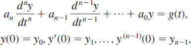
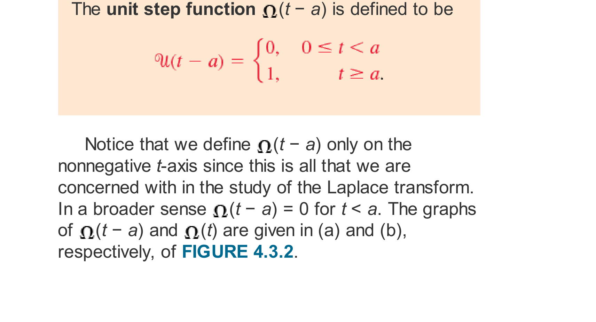
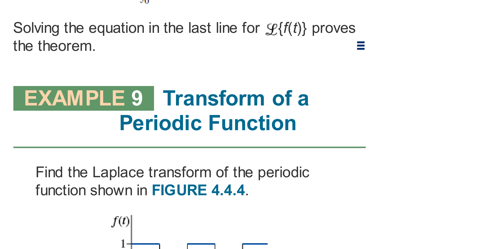

# Chapter 04: The Laplace Transform & Operational Calculus
### Concordia University · Department of Mechanical, Industrial & Aerospace Engineering
**Course**: Applied Ordinary Differential Equations (ENGR 213)  
**Textbook**: *Advanced Engineering Mathematics* (7th Edition) by Dennis G. Zill — Chapter 4 (§4.1, §4.2, §4.3, §4.4, §4.5, §4.6)

---

## 1. Executive Overview & First-Principles Philosophy

In classical differential equation theory, solving an initial-value problem (IVP) is a two-stage sequential process:
1. Determine the general solution $y(x) = y_c(x) + y_p(x)$ featuring arbitrary constants $c_1, c_2, \dots, c_n$.
2. Formulate a system of linear algebraic equations by enforcing initial conditions $y(x_0) = y_0, y'(x_0) = y_1, \dots$ to isolate the specific constants.

While effective for smooth, continuous driving forces (such as polynomials, exponentials, and sinusoids), this classical approach encounters profound mathematical barriers in modern electrical and mechanical engineering systems subjected to **discontinuous, impulsive, piecewise, or periodic inputs** (e.g., switches opening and closing, square-wave voltages, lightning strikes, or mechanical hammer impacts).

The **Laplace Transform** solves this fundamental challenge by operating as an **integral transform bridge**:
* It maps differential and integral operations in the real-time domain $t \in [0, \infty)$ into straightforward **algebraic operations** in the complex frequency domain $s \in \mathbb{C}$.
* It **automatically incorporates initial conditions** directly into the algebraic transformation step, completely eliminating the need to solve for separate homogeneous and particular solutions.
* It effortlessly handles discontinuous step functions (Heaviside functions), concentrated impulses (Dirac delta distributions), and periodic signals without requiring piecewise boundary-matching.

```
Time Domain (t)                              Complex Frequency Domain (s)
   t ≥ 0                                               s-Plane
┌───────────────────────┐   Laplace Transform    ┌───────────────────────┐
│ Differential Equation │ ─────────────────────> │  Algebraic Equation   │
│   a y'' + b y' + c y  │      L{y(t)} = Y(s)    │ a[s²Y - sy(0) - y'(0)]│
│       = g(t)          │                        │  + b[sY - y(0)] + cY  │
│  with y(0), y'(0)     │                        │       = G(s)          │
└───────────────────────┘                        └───────────────────────┘
           │                                                 │
           │                                                 │ Solve for Y(s)
           │                                                 ▼
┌───────────────────────┐   Inverse Transform    ┌───────────────────────┐
│  Exact Solution y(t)  │ <───────────────────── │ Isolated Solution Y(s)│
│  Satisfies DE & IVP   │       L⁻¹{Y(s)}        │   Y(s) = P(s) / Q(s)  │
└───────────────────────┘                        └───────────────────────┘
```

---

## 2. Mathematical Framework & Operational Engine

### 2.1 Definition of the Laplace Transform (Zill §4.1)

#### A. The Integral Transform Definition
Let $f(t)$ be a function defined for all real $t \ge 0$. The **Laplace transform** of $f$, denoted by $\mathcal{L}\{f(t)\}$ or $F(s)$, is defined by the improper integral:
$$\mathcal{L}\{f(t)\} = F(s) = \int_0^\infty e^{-st} f(t) \, dt = \lim_{b \to \infty} \int_0^b e^{-st} f(t) \, dt$$
provided that the improper integral converges for values of the parameter $s$. The parameter $s$ is treated as a real variable in introductory ODEs (and generalized to complex $s = \sigma + i\omega$ in advanced systems analysis).

#### B. Conditions for Existence (Theorem 4.1.1)
The integral $\int_0^\infty e^{-st} f(t) dt$ is guaranteed to converge for all $s > c$ if $f(t)$ satisfies two foundational conditions:
1. **Piecewise Continuity**: $f(t)$ is piecewise continuous on every finite interval $[0, A]$. That is, on any interval of finite length, $f(t)$ has at most a finite number of jump discontinuities and no infinite vertical asymptotes.
2. **Exponential Order $c$**: There exist positive real constants $M > 0$, $c$, and $T > 0$ such that:
   $$|f(t)| \le M e^{ct} \quad \text{for all } t > T$$
   A function of exponential order cannot grow faster than an exponential function as $t \to \infty$.
   * *Examples of functions of exponential order*: $t^n$ (bounded by $M e^{ct}$ for any $c > 0$), $e^{5t}$ ($c = 5$), $\sin(kt)$ and $\cos(kt)$ (bounded by $M = 1, c = 0$).
   * *Example of a function NOT of exponential order*: $f(t) = e^{t^2}$. Because $\lim_{t \to \infty} \frac{e^{t^2}}{M e^{ct}} = \infty$ for any real $c$, $e^{t^2}$ grows too rapidly for the integral kernel $e^{-st}$ to suppress it; its Laplace transform does not exist!

#### C. First-Principles Derivations of Elementary Transforms

* **Transform of Constant $f(t) = 1$**:
  $$\mathcal{L}\{1\} = \int_0^\infty e^{-st}(1) \, dt = \lim_{b \to \infty} \left[ -\frac{e^{-st}}{s} \right]_0^b = \lim_{b \to \infty} \left( -\frac{e^{-sb}}{s} + \frac{1}{s} \right) = \frac{1}{s}, \quad (s > 0)$$

* **Transform of Exponential $f(t) = e^{at}$**:
  $$\mathcal{L}\{e^{at}\} = \int_0^\infty e^{-st} e^{at} \, dt = \int_0^\infty e^{-(s-a)t} \, dt = \left[ -\frac{e^{-(s-a)t}}{s - a} \right]_0^\infty = \frac{1}{s - a}, \quad (s > a)$$

* **Transform of Power $f(t) = t^n$ ($n \in \mathbb{Z}^+$)**:
  Applying integration by parts: $\int u \, dv = uv - \int v \, du$ with $u = t^n, dv = e^{-st}dt$:
  $$\mathcal{L}\{t^n\} = \left[ -\frac{t^n e^{-st}}{s} \right]_0^\infty + \frac{n}{s} \int_0^\infty e^{-st} t^{n-1} \, dt = 0 + \frac{n}{s} \mathcal{L}\{t^{n-1}\}$$
  Iterating this recurrence relation down to $\mathcal{L}\{t^0\} = \mathcal{L}\{1\} = \frac{1}{s}$:
  $$\mathcal{L}\{t^n\} = \frac{n}{s} \cdot \frac{n-1}{s} \cdots \frac{1}{s} \cdot \frac{1}{s} = \frac{n!}{s^{n+1}}, \quad (s > 0)$$

* **Transforms of Sinusoids $f(t) = \sin(kt)$ and $f(t) = \cos(kt)$**:
  Using Euler's identity $e^{i kt} = \cos(kt) + i \sin(kt)$:
  $$\mathcal{L}\{e^{i kt}\} = \frac{1}{s - i k} = \frac{s + i k}{(s - ik)(s + ik)} = \frac{s + i k}{s^2 + k^2} = \frac{s}{s^2 + k^2} + i \frac{k}{s^2 + k^2}$$
  Equating real and imaginary parts yields immediately:
  $$\mathcal{L}\{\cos(kt)\} = \frac{s}{s^2 + k^2}, \qquad \mathcal{L}\{\sin(kt)\} = \frac{k}{s^2 + k^2}, \quad (s > 0)$$

* **Transforms of Hyperbolic Functions $\sinh(kt)$ and $\cosh(kt)$**:
  $$\mathcal{L}\{\sinh(kt)\} = \mathcal{L}\left\{\frac{e^{kt} - e^{-kt}}{2}\right\} = \frac{1}{2}\left(\frac{1}{s - k} - \frac{1}{s + k}\right) = \frac{k}{s^2 - k^2}, \quad (s > |k|)$$
  $$\mathcal{L}\{\cosh(kt)\} = \mathcal{L}\left\{\frac{e^{kt} + e^{-kt}}{2}\right\} = \frac{1}{2}\left(\frac{1}{s - k} + \frac{1}{s + k}\right) = \frac{s}{s^2 - k^2}, \quad (s > |k|)$$

---

### 2.2 Inverse Transforms & Transforms of Derivatives (Zill §4.2)

#### A. The Inverse Laplace Transform $\mathcal{L}^{-1}$
If $\mathcal{L}\{f(t)\} = F(s)$, then $f(t)$ is called the **inverse Laplace transform** of $F(s)$, written:
$$\mathcal{L}^{-1}\{F(s)\} = f(t)$$
Like the forward transform, $\mathcal{L}^{-1}$ is a **linear operator**:
$$\mathcal{L}^{-1}\{a F(s) + b G(s)\} = a \mathcal{L}^{-1}\{F(s)\} + b \mathcal{L}^{-1}\{G(s)\}$$

#### B. Transforms of Derivatives (The Engine of Differential Equations)
**Theorem 4.2.2**: If $f, f', \dots, f^{(n-1)}$ are continuous on $[0, \infty)$ and are of exponential order, and if $f^{(n)}(t)$ is piecewise continuous on $[0, \infty)$, then:
$$\mathcal{L}\{f'(t)\} = s F(s) - f(0)$$
$$\mathcal{L}\{f''(t)\} = s^2 F(s) - s f(0) - f'(0)$$
$$\mathcal{L}\{f'''(t)\} = s^3 F(s) - s^2 f(0) - s f'(0) - f''(0)$$
$$\mathcal{L}\{f^{(n)}(t)\} = s^n F(s) - s^{n-1} f(0) - s^{n-2} f'(0) - \dots - f^{(n-1)}(0)$$

*Proof of $\mathcal{L}\{f'(t)\}$ by Integration by Parts*:
$$\mathcal{L}\{f'(t)\} = \int_0^\infty e^{-st} f'(t) \, dt$$
Let $u = e^{-st} \implies du = -s e^{-st} dt$, and $dv = f'(t)dt \implies v = f(t)$:
$$\mathcal{L}\{f'(t)\} = \left[ e^{-st} f(t) \right]_0^\infty - \int_0^\infty (-s e^{-st}) f(t) \, dt = [0 - f(0)] + s \int_0^\infty e^{-st} f(t) \, dt = s F(s) - f(0)$$


*Figure 4.2.1: The operational triangle for solving linear IVPs. Transforming converts the DE into an algebraic equation in $Y(s)$, which is solved directly and inverted back to $y(t)$.*

#### C. Inversion Strategy: Partial Fraction Decomposition Rules
To invert a rational expression $Y(s) = \frac{P(s)}{Q(s)}$ where $\deg(P) < \deg(Q)$:
1. **Distinct Linear Factors**: If $Q(s) = (s - r_1)(s - r_2)\dots(s - r_n)$, then:
   $$\frac{P(s)}{Q(s)} = \frac{A_1}{s - r_1} + \frac{A_2}{s - r_2} + \dots + \frac{A_n}{s - r_n}, \quad \text{where } A_k = \lim_{s \to r_k} (s - r_k)\frac{P(s)}{Q(s)}$$
2. **Repeated Linear Factors**: If $Q(s)$ contains $(s - r)^m$, include:
   $$\frac{A_1}{s - r} + \frac{A_2}{(s - r)^2} + \dots + \frac{A_m}{(s - r)^m}$$
3. **Irreducible Quadratic Factors**: If $Q(s)$ contains $(s^2 + bs + c)$ where $b^2 - 4c < 0$:
   * Complete the square: $(s - \alpha)^2 + \beta^2$.
   * Express numerator as $A(s - \alpha) + B\beta$ to invert directly into $e^{\alpha t}\cos(\beta t)$ and $e^{\alpha t}\sin(\beta t)$.

---

### 2.3 Translation Theorems & Discontinuous Inputs (Zill §4.3)

#### A. First Translation Theorem (Shift on the $s$-Axis)
**Theorem 4.3.1**: If $\mathcal{L}\{f(t)\} = F(s)$ and $a$ is any real number, then:
$$\mathcal{L}\{e^{at} f(t)\} = F(s - a)$$
*Proof*:
$$\mathcal{L}\{e^{at} f(t)\} = \int_0^\infty e^{-st} [e^{at} f(t)] \, dt = \int_0^\infty e^{-(s-a)t} f(t) \, dt = F(s - a)$$
*Inverse form*:
$$\mathcal{L}^{-1}\{F(s - a)\} = e^{at} f(t) = e^{at} \mathcal{L}^{-1}\{F(s)\}$$
*Key Operational Inversions*:
$$\mathcal{L}^{-1}\left\{\frac{1}{(s - a)^{n+1}}\right\} = \frac{t^n}{n!} e^{at}, \qquad \mathcal{L}^{-1}\left\{\frac{s - a}{(s - a)^2 + k^2}\right\} = e^{at} \cos(kt), \qquad \mathcal{L}^{-1}\left\{\frac{k}{(s - a)^2 + k^2}\right\} = e^{at} \sin(kt)$$

#### B. The Unit Step Function (Heaviside Function)
The **unit step function** $\mathcal{U}(t - a)$ is defined as:
$$\mathcal{U}(t - a) = \begin{cases} 0, & 0 \le t < a \\ 1, & t \ge a \end{cases}$$


*Figure 4.3.2: Graphical representation of $\mathcal{U}(t)$ and delayed unit step $\mathcal{U}(t-a)$ acting as an ideal mathematical switch turning on at $t = a$.*

* **Expressing Piecewise Functions Using Step Functions**:
  A function defined on intervals:
  $$f(t) = \begin{cases} g(t), & 0 \le t < a \\ h(t), & t \ge a \end{cases}$$
  is expressed compactly as:
  $$f(t) = g(t) - g(t)\mathcal{U}(t - a) + h(t)\mathcal{U}(t - a) = g(t) + [h(t) - g(t)]\mathcal{U}(t - a)$$
  For a finite pulse active only on $a \le t < b$:
  $$\text{pulse}(t) = \mathcal{U}(t - a) - \mathcal{U}(t - b)$$

#### C. Second Translation Theorem (Shift on the $t$-Axis)
**Theorem 4.3.2**: If $F(s) = \mathcal{L}\{f(t)\}$ and $a > 0$, then:
$$\mathcal{L}\{f(t - a)\mathcal{U}(t - a)\} = e^{-as} F(s)$$
*Alternative Direct Form (Crucial for Computation)*:
When the function multiplying $\mathcal{U}(t - a)$ is written in terms of $t$ rather than $(t - a)$:
$$\mathcal{L}\{g(t)\mathcal{U}(t - a)\} = e^{-as} \mathcal{L}\{g(t + a)\}$$
*Proof*:
$$\mathcal{L}\{g(t)\mathcal{U}(t - a)\} = \int_0^\infty e^{-st} g(t)\mathcal{U}(t - a) \, dt = \int_a^\infty e^{-st} g(t) \, dt$$
Let substitution $v = t - a \implies t = v + a, dt = dv$:
$$= \int_0^\infty e^{-s(v+a)} g(v + a) \, dv = e^{-as} \int_0^\infty e^{-sv} g(v + a) \, dv = e^{-as} \mathcal{L}\{g(t + a)\}$$

*Inverse Form*:
$$\mathcal{L}^{-1}\{e^{-as} F(s)\} = f(t - a)\mathcal{U}(t - a), \quad \text{where } f(t) = \mathcal{L}^{-1}\{F(s)\}$$

---

### 2.4 Additional Operational Properties (Zill §4.4)

#### A. Derivatives of Transforms (Multiplication by $t^n$)
**Theorem 4.4.1**: If $F(s) = \mathcal{L}\{f(t)\}$ and $n = 1, 2, 3, \dots$, then:
$$\mathcal{L}\{t^n f(t)\} = (-1)^n \frac{d^n}{ds^n} F(s)$$
*Special Case $n = 1$*: $\mathcal{L}\{t f(t)\} = -\frac{d}{ds}F(s)$.
* *Example*: $\mathcal{L}\{t \sin(kt)\} = -\frac{d}{ds}\left(\frac{k}{s^2 + k^2}\right) = -\left(\frac{-2ks}{(s^2 + k^2)^2}\right) = \frac{2ks}{(s^2 + k^2)^2}$.
* *Example*: $\mathcal{L}\{t \cos(kt)\} = -\frac{d}{ds}\left(\frac{s}{s^2 + k^2}\right) = -\frac{1(s^2+k^2) - s(2s)}{(s^2+k^2)^2} = \frac{s^2 - k^2}{(s^2 + k^2)^2}$.

#### B. Transforms of Integrals
**Theorem 4.4.2**: If $f(t)$ is piecewise continuous and of exponential order:
$$\mathcal{L}\left\{ \int_0^t f(\tau) \, d\tau \right\} = \frac{1}{s} F(s)$$
*Inverse form*:
$$\mathcal{L}^{-1}\left\{ \frac{F(s)}{s} \right\} = \int_0^t f(\tau) \, d\tau$$

#### C. The Convolution Integral & Convolution Theorem
**Definition**: The **convolution** of two piecewise continuous functions $f$ and $g$ on $[0, \infty)$ is denoted by $f * g$ and defined as:
$$(f * g)(t) = \int_0^t f(\tau) g(t - \tau) \, d\tau$$
**Properties of Convolution**:
* Commutative: $f * g = g * f$
* Distributive: $f * (g + h) = f * g + f * h$
* Associative: $f * (g * h) = (f * g) * h$
* Zero element: $f * 0 = 0$

**Convolution Theorem (Theorem 4.4.3)**: If $\mathcal{L}\{f(t)\} = F(s)$ and $\mathcal{L}\{g(t)\} = G(s)$, then:
$$\mathcal{L}\{(f * g)(t)\} = \mathcal{L}\{f(t)\} \cdot \mathcal{L}\{g(t)\} = F(s) G(s)$$
*Inverse Form (Vital for Inverting Products)*:
$$\mathcal{L}^{-1}\{F(s) G(s)\} = (f * g)(t) = \int_0^t f(\tau) g(t - \tau) \, d\tau$$

#### D. Transform of a Periodic Function
**Theorem 4.4.4**: If a periodic function $f(t)$ has period $T$ (so $f(t + T) = f(t)$ for all $t \ge 0$), and is piecewise continuous on $[0, T]$, then:
$$\mathcal{L}\{f(t)\} = \frac{1}{1 - e^{-sT}} \int_0^T e^{-st} f(t) \, dt$$
*Proof*: Splitting the improper integral into subintervals of length $T$:
$$\mathcal{L}\{f(t)\} = \int_0^\infty e^{-st} f(t) dt = \sum_{n=0}^\infty \int_{nT}^{(n+1)T} e^{-st} f(t) dt$$
Letting $t = u + nT$, then $f(u + nT) = f(u)$ by periodicity:
$$= \sum_{n=0}^\infty e^{-nsT} \int_0^T e^{-su} f(u) du = \left( \sum_{n=0}^\infty (e^{-sT})^n \right) \int_0^T e^{-st} f(t) dt$$
Recognizing the infinite geometric series $\sum_{n=0}^\infty r^n = \frac{1}{1-r}$ with $r = e^{-sT} < 1$:
$$\mathcal{L}\{f(t)\} = \frac{1}{1 - e^{-sT}} \int_0^T e^{-st} f(t) \, dt$$


*Figure 4.4.4: A periodic square wave $f(t)$ of amplitude $1$ and period $T = 2$. Integrating over a single period $[0, 2]$ and dividing by $(1 - e^{-2s})$ yields the complete transform.*

---

### 2.5 The Dirac Delta Impulse Distribution (Zill §4.5)

#### A. Physical Motivation & Mathematical Formulation
In mechanical impacts (a hammer hitting a mass) or electrical surges (a lightning pulse on a circuit), a massive external force acts over an infinitesimal time duration $\epsilon \to 0$ such that the total impulse is unity:
$$I = \int_{-\infty}^\infty F(t) \, dt = 1$$
We model this mathematically using the pulse function $\delta_a(t - t_0)$:
$$\delta_a(t - t_0) = \begin{cases} \frac{1}{2a}, & t_0 - a < t < t_0 + a \\ 0, & \text{otherwise} \end{cases}$$
The area under $\delta_a$ is $\int_{-\infty}^\infty \delta_a(t - t_0) dt = 2a \cdot \frac{1}{2a} = 1$ for all $a > 0$.


*Figure 4.5.2: The narrow pulse $\delta_a(t - t_0)$ as width $2a \to 0$ and height $1/(2a) \to \infty$. In the limit, it converges to the Dirac delta distribution.*

#### B. The Sifting Property & Transform of the Delta Function
Taking the limit $a \to 0$ defines the **Dirac delta distribution** $\delta(t - t_0)$:
$$\delta(t - t_0) = 0 \quad \text{for all } t \neq t_0, \qquad \int_0^\infty \delta(t - t_0) \, dt = 1 \quad (t_0 > 0)$$
* **The Sifting (Filtering) Property**: For any continuous function $f(t)$:
  $$\int_0^\infty f(t) \delta(t - t_0) \, dt = f(t_0)$$
* **Laplace Transform of $\delta(t - t_0)$**: Applying the sifting property to the Laplace kernel $f(t) = e^{-st}$:
  $$\mathcal{L}\{\delta(t - t_0)\} = \int_0^\infty e^{-st} \delta(t - t_0) \, dt = e^{-s t_0}$$
* When the impulse occurs at the origin $t_0 = 0$:
  $$\mathcal{L}\{\delta(t)\} = e^{-0} = 1$$

---

## 3. Master Operational Formula Reference Table

| Function $f(t)$ | Laplace Transform $\mathcal{L}\{f(t)\} = F(s)$ | Method / Theorem Used |
| :--- | :--- | :--- |
| $1$ | $\frac{1}{s}$ | Basic definition ($s > 0$) |
| $t^n$ ($n = 1, 2, \dots$) | $\frac{n!}{s^{n+1}}$ | Repeated integration by parts |
| $e^{at}$ | $\frac{1}{s - a}$ | Exponential kernel integration ($s > a$) |
| $\sin(kt)$ | $\frac{k}{s^2 + k^2}$ | Euler's formula imaginary part |
| $\cos(kt)$ | $\frac{s}{s^2 + k^2}$ | Euler's formula real part |
| $\sinh(kt)$ | $\frac{k}{s^2 - k^2}$ | Definition via $\frac{1}{2}(e^{kt}-e^{-kt})$ |
| $\cosh(kt)$ | $\frac{s}{s^2 - k^2}$ | Definition via $\frac{1}{2}(e^{kt}+e^{-kt})$ |
| $e^{at} f(t)$ | $F(s - a)$ | **First Translation Theorem** ($s$-shift) |
| $f(t - a)\mathcal{U}(t - a)$ | $e^{-as} F(s)$ | **Second Translation Theorem** ($t$-shift) |
| $g(t)\mathcal{U}(t - a)$ | $e^{-as} \mathcal{L}\{g(t + a)\}$ | Second Translation alternative computational form |
| $\mathcal{U}(t - a)$ | $\frac{e^{-as}}{s}$ | Transform of unit step |
| $t^n f(t)$ | $(-1)^n \frac{d^n}{ds^n} F(s)$ | **Derivatives of Transforms** |
| $\int_0^t f(\tau) d\tau$ | $\frac{F(s)}{s}$ | **Transform of Integrals** |
| $(f * g)(t) = \int_0^t f(\tau)g(t-\tau)d\tau$ | $F(s) \cdot G(s)$ | **Convolution Theorem** |
| $\delta(t - t_0)$ | $e^{-st_0}$ | **Dirac Delta Sifting Property** |
| $f(t + T) = f(t)$ | $\frac{1}{1 - e^{-sT}} \int_0^T e^{-st} f(t) dt$ | **Periodic Function Theorem** |
| $f'(t)$ | $s F(s) - f(0)$ | Derivative property (1st order) |
| $f''(t)$ | $s^2 F(s) - s f(0) - f'(0)$ | Derivative property (2nd order) |

---

## 4. Comprehensive Step-by-Step Problem Walkthroughs

### 4.1 Problem 1: 2nd-Order IVP with Shifting & Partial Fractions (Zill §4.2 Archetype)

**Problem Statement**: Solve the initial-value problem:
$$y'' - 6y' + 13y = 0, \quad y(0) = 2, \quad y'(0) = -1$$

#### Step 1: Apply the Laplace Transform to Both Sides
$$\mathcal{L}\{y''\} - 6\mathcal{L}\{y'\} + 13\mathcal{L}\{y\} = 0$$
Substitute the derivative operational formulas:
$$[s^2 Y(s) - s y(0) - y'(0)] - 6[s Y(s) - y(0)] + 13Y(s) = 0$$

#### Step 2: Insert the Initial Conditions $y(0) = 2$ and $y'(0) = -1$
$$[s^2 Y(s) - 2s - (-1)] - 6[s Y(s) - 2] + 13Y(s) = 0$$
$$s^2 Y(s) - 2s + 1 - 6s Y(s) + 12 + 13Y(s) = 0$$
Group terms containing $Y(s)$ on the left and move constants to the right:
$$(s^2 - 6s + 13)Y(s) - 2s + 13 = 0 \implies (s^2 - 6s + 13)Y(s) = 2s - 13$$

#### Step 3: Isolate $Y(s)$
$$Y(s) = \frac{2s - 13}{s^2 - 6s + 13}$$

#### Step 4: Complete the Square in the Denominator
The discriminant of $s^2 - 6s + 13$ is $b^2 - 4ac = (-6)^2 - 4(1)(13) = 36 - 52 = -16 < 0$ (irreducible over $\mathbb{R}$).
$$s^2 - 6s + 13 = (s - 3)^2 - 9 + 13 = (s - 3)^2 + 4 = (s - 3)^2 + 2^2$$
This indicates a combination of shifted $\cos(2t)$ and $\sin(2t)$ with shift $a = 3$.

#### Step 5: Express the Numerator in Terms of $(s - 3)$
$$2s - 13 = 2(s - 3) + 6 - 13 = 2(s - 3) - 7$$
Now rewrite $Y(s)$:
$$Y(s) = \frac{2(s - 3) - 7}{(s - 3)^2 + 2^2} = 2 \frac{s - 3}{(s - 3)^2 + 2^2} - 7 \frac{1}{(s - 3)^2 + 2^2}$$
To match the standard sine transform $\frac{k}{(s-a)^2+k^2}$ with $k = 2$, multiply and divide the second term by 2:
$$Y(s) = 2 \frac{s - 3}{(s - 3)^2 + 2^2} - \frac{7}{2} \frac{2}{(s - 3)^2 + 2^2}$$

#### Step 6: Invert Using the First Translation Theorem
* $\mathcal{L}^{-1}\left\{\frac{s-3}{(s-3)^2+2^2}\right\} = e^{3t}\cos(2t)$
* $\mathcal{L}^{-1}\left\{\frac{2}{(s-3)^2+2^2}\right\} = e^{3t}\sin(2t)$

$$y(t) = 2 e^{3t} \cos(2t) - \frac{7}{2} e^{3t} \sin(2t) = e^{3t}\left(2\cos(2t) - \frac{7}{2}\sin(2t)\right)$$

---

### 4.2 Problem 2: Piecewise Discontinuous Forcing Function (Zill §4.3 Archetype)

**Problem Statement**: Solve the differential equation with a piecewise external load:
$$y' + 2y = g(t), \quad y(0) = 0$$
where:
$$g(t) = \begin{cases} t, & 0 \le t < 1 \\ 0, & t \ge 1 \end{cases}$$

#### Step 1: Rewrite $g(t)$ in Terms of Heaviside Unit Step Functions
The driving function is $t$ from $0$ to $1$, and then drops to $0$:
$$g(t) = t - t \, \mathcal{U}(t - 1)$$

#### Step 2: Transform $g(t)$ Using the Second Translation Theorem
* $\mathcal{L}\{t\} = \frac{1}{s^2}$
* To transform $t \, \mathcal{U}(t - 1)$, apply the alternative form $\mathcal{L}\{g(t)\mathcal{U}(t-a)\} = e^{-as}\mathcal{L}\{g(t+a)\}$ where $a = 1$ and $g(t) = t$:
  $$g(t + 1) = t + 1$$
  $$\mathcal{L}\{t \, \mathcal{U}(t - 1)\} = e^{-s} \mathcal{L}\{t + 1\} = e^{-s}\left(\frac{1}{s^2} + \frac{1}{s}\right)$$
Therefore:
$$G(s) = \frac{1}{s^2} - e^{-s}\left(\frac{1}{s^2} + \frac{1}{s}\right) = \frac{1}{s^2} - e^{-s}\left(\frac{s + 1}{s^2}\right)$$

#### Step 3: Transform the Differential Equation
$$\mathcal{L}\{y'\} + 2\mathcal{L}\{y\} = G(s) \implies [s Y(s) - y(0)] + 2Y(s) = G(s)$$
Since $y(0) = 0$:
$$(s + 2)Y(s) = \frac{1}{s^2} - e^{-s}\frac{s+1}{s^2}$$
$$Y(s) = \frac{1}{s^2(s + 2)} - e^{-s} \frac{s + 1}{s^2(s + 2)}$$

#### Step 4: Perform Partial Fraction Decompositions
* **Decomposition of $F_1(s) = \frac{1}{s^2(s + 2)}$**:
  $$\frac{1}{s^2(s + 2)} = \frac{A}{s} + \frac{B}{s^2} + \frac{C}{s + 2}$$
  $$1 = A s (s + 2) + B(s + 2) + C s^2$$
  * Set $s = 0$: $1 = B(2) \implies B = \frac{1}{2}$
  * Set $s = -2$: $1 = C(-2)^2 = 4C \implies C = \frac{1}{4}$
  * Equate $s^2$ coefficients: $0 = A + C \implies A = -C = -\frac{1}{4}$
  $$F_1(s) = -\frac{1/4}{s} + \frac{1/2}{s^2} + \frac{1/4}{s + 2}$$
  Inverting $F_1(s)$:
  $$f_1(t) = -\frac{1}{4} + \frac{1}{2}t + \frac{1}{4}e^{-2t}$$

* **Decomposition of $F_2(s) = \frac{s + 1}{s^2(s + 2)}$**:
  $$\frac{s + 1}{s^2(s + 2)} = \frac{D}{s} + \frac{E}{s^2} + \frac{F}{s + 2}$$
  $$s + 1 = D s (s + 2) + E(s + 2) + F s^2$$
  * Set $s = 0$: $1 = 2E \implies E = \frac{1}{2}$
  * Set $s = -2$: $-2 + 1 = -1 = 4F \implies F = -\frac{1}{4}$
  * Equate $s^2$ coefficients: $0 = D + F \implies D = -F = \frac{1}{4}$
  $$F_2(s) = \frac{1/4}{s} + \frac{1/2}{s^2} - \frac{1/4}{s + 2}$$
  Inverting $F_2(s)$:
  $$f_2(t) = \frac{1}{4} + \frac{1}{2}t - \frac{1}{4}e^{-2t}$$

#### Step 5: Apply Second Translation Theorem to the Delayed Term
$$Y(s) = F_1(s) - e^{-s} F_2(s)$$
$$y(t) = f_1(t) - f_2(t - 1)\mathcal{U}(t - 1)$$
Evaluate $f_2(t - 1)$:
$$f_2(t - 1) = \frac{1}{4} + \frac{1}{2}(t - 1) - \frac{1}{4}e^{-2(t - 1)} = \frac{1}{2}t - \frac{1}{4} - \frac{1}{4}e^{-2(t - 1)}$$

#### Step 6: Final Assembled Solution
$$y(t) = \left( -\frac{1}{4} + \frac{1}{2}t + \frac{1}{4}e^{-2t} \right) - \left( \frac{1}{2}t - \frac{1}{4} - \frac{1}{4}e^{-2(t-1)} \right)\mathcal{U}(t - 1)$$
In explicit piecewise form:
$$y(t) = \begin{cases} \frac{1}{2}t - \frac{1}{4} + \frac{1}{4}e^{-2t}, & 0 \le t < 1 \\ \frac{1}{4}e^{-2t} + \frac{1}{4}e^{-2(t-1)}, & t \ge 1 \end{cases}$$

---

### 4.3 Problem 3: Impulse Hammer Blow & Dirac Delta Distribution (Zill §4.5 Archetype)

**Problem Statement**: A damped harmonic oscillator initially at rest is struck at $t = 2\pi$ by an instantaneous impulse of magnitude 4:
$$y'' + 2y' + 5y = 4\delta(t - 2\pi), \quad y(0) = 0, \quad y'(0) = 0$$

#### Step 1: Transform the Differential Equation
$$\mathcal{L}\{y''\} + 2\mathcal{L}\{y'\} + 5\mathcal{L}\{y\} = 4\mathcal{L}\{\delta(t - 2\pi)\}$$
Using the zero initial conditions $y(0) = 0, y'(0) = 0$ and the transform $\mathcal{L}\{\delta(t - t_0)\} = e^{-st_0}$:
$$[s^2 Y(s) - 0 - 0] + 2[s Y(s) - 0] + 5Y(s) = 4 e^{-2\pi s}$$
$$(s^2 + 2s + 5)Y(s) = 4 e^{-2\pi s}$$
$$Y(s) = e^{-2\pi s} \cdot \frac{4}{s^2 + 2s + 5}$$

#### Step 2: Invert the Kernel Function $H(s) = \frac{4}{s^2 + 2s + 5}$
Complete the square in the denominator:
$$s^2 + 2s + 5 = (s + 1)^2 + 4 = (s + 1)^2 + 2^2$$
Rewrite the numerator to extract standard sine transform:
$$H(s) = 2 \cdot \frac{2}{(s + 1)^2 + 2^2}$$
Applying the First Translation Theorem:
$$h(t) = \mathcal{L}^{-1}\{H(s)\} = 2 e^{-t} \sin(2t)$$

#### Step 3: Apply Second Translation Theorem for $e^{-2\pi s} H(s)$
By Theorem 4.3.2:
$$\mathcal{L}^{-1}\{e^{-2\pi s} H(s)\} = h(t - 2\pi) \mathcal{U}(t - 2\pi)$$
Substitute $t \to (t - 2\pi)$ into $h(t)$:
$$h(t - 2\pi) = 2 e^{-(t - 2\pi)} \sin(2(t - 2\pi)) = 2 e^{-(t - 2\pi)} \sin(2t - 4\pi)$$
Since the sine function has period $2\pi$, $\sin(2t - 4\pi) = \sin(2t)$:
$$h(t - 2\pi) = 2 e^{-(t - 2\pi)} \sin(2t)$$

#### Step 4: Final Physical Solution
$$y(t) = 2 e^{-(t - 2\pi)} \sin(2t) \, \mathcal{U}(t - 2\pi)$$
*Physical Interpretation*:
* For $0 \le t < 2\pi$, $y(t) \equiv 0$ (the mass remains completely at rest).
* At $t = 2\pi$, the impulse imparts an instantaneous velocity jump $\Delta y' = 4$, initiating an underdamped exponentially decaying sinusoidal oscillation with frequency $\omega = 2\text{ rad/s}$.

---

## 5. Critical Concordia Exam Traps & Red Flags

* ⚠️ **Trap 1: Dropping Negative Signs in Derivative Formulas**:
  $$\mathcal{L}\{y''\} = s^2 Y(s) - s y(0) - y'(0)$$
  Notice that **both** initial condition terms carry negative signs. If $y(0) = -3$, then $-s(-3) = +3s$ on the left side, which subtracts to $-3s$ when moved to the right!
* ⚠️ **Trap 2: Forgetting to Shift Arguments in $t$-Axis Inversion**:
  When evaluating $\mathcal{L}^{-1}\{e^{-as} F(s)\} = f(t - a)\mathcal{U}(t - a)$, students frequently write $f(t)\mathcal{U}(t - a)$ by mistake. Every single occurrence of the variable $t$ in $f(t)$ must be replaced by $(t - a)$!
* ⚠️ **Trap 3: Inverting Without Completing the Numerator Shift**:
  For an expression like $\frac{s}{(s+2)^2 + 9}$, you cannot invert $s$ directly. You must express the numerator as $[(s + 2) - 2]$:
  $$\frac{s}{(s+2)^2 + 9} = \frac{s+2}{(s+2)^2+9} - \frac{2}{3}\frac{3}{(s+2)^2+9} \implies e^{-2t}\cos(3t) - \frac{2}{3}e^{-2t}\sin(3t)$$
* ⚠️ **Trap 4: Confusing $\delta(t)$ with $\mathcal{U}(t)$**:
  $\mathcal{L}\{\mathcal{U}(t - a)\} = \frac{e^{-as}}{s}$, whereas $\mathcal{L}\{\delta(t - a)\} = e^{-as}$. The delta function is the distributional derivative of the Heaviside step function: $\frac{d}{dt}\mathcal{U}(t - a) = \delta(t - a)$.
