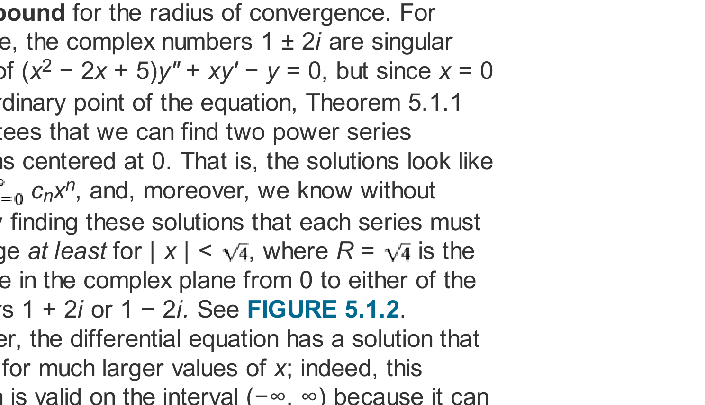
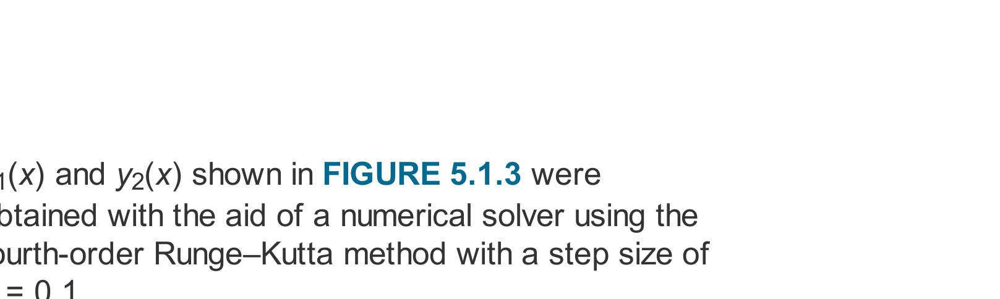

# Chapter 05: Power Series Solutions of Linear Differential Equations
### Concordia University · Department of Mechanical, Industrial & Aerospace Engineering
**Course**: Applied Ordinary Differential Equations (ENGR 213)  
**Textbook**: *Advanced Engineering Mathematics* (7th Edition) by Dennis G. Zill — Chapter 5 (§5.1.1, §5.1.2)

---

## 1. Executive Overview & First-Principles Philosophy

In Chapters 2 and 3, our analytical methods for solving linear differential equations:
$$a_n(x)\frac{d^ny}{dx^n} + \dots + a_1(x)\frac{dy}{dx} + a_0(x)y = g(x)$$
relied entirely on two exceptional cases:
1. **Constant Coefficients**: Where the characteristic equation $a r^2 + b r + c = 0$ yields closed-form exponential and sinusoidal eigenfunctions $e^{rx}, \cos(\beta x), \sin(\beta x)$.
2. **Cauchy-Euler Equations**: Where coefficients are proportional to powers of $x$ ($a x^2 y'' + b x y' + c y = 0$), yielding polynomial eigenfunctions $x^m$.

However, in applied engineering physics, nature routinely produces differential equations with **variable coefficients** that are not Cauchy-Euler:
* **Airy's Equation**: $y'' - x y = 0$ (governing diffraction of light and quantum wavefunctions at turning points).
* **Legendre's Equation**: $(1 - x^2)y'' - 2xy' + n(n+1)y = 0$ (governing gravitational potential and spherical harmonics).
* **Bessel's Equation**: $x^2 y'' + x y' + (x^2 - \nu^2)y = 0$ (governing heat dissipation in circular cylinders and vibrating drumheads).
* **Hermite's Equation**: $y'' - 2xy' + 2ny = 0$ (governing the quantum harmonic oscillator).

For such equations, **no finite combination of elementary functions (polynomials, exponentials, logarithms, or trigonometric functions) exists** to express the general solution. 

The universal analytical engine for variable-coefficient linear differential equations is the **Power Series Method**:
* We represent the unknown function $y(x)$ as an infinite power series centered at a point $x_0$:
  $$y(x) = \sum_{n=0}^\infty c_n (x - x_0)^n = c_0 + c_1(x - x_0) + c_2(x - x_0)^2 + \dots$$
* Substituting this series and its term-by-term derivatives into the ODE converts the differential relationship into a system of algebraic equations for the unknown coefficients $c_n$.
* The method systematically produces a **Recurrence Relation** that expresses all higher-order coefficients ($c_2, c_3, c_4, \dots$) entirely in terms of the two fundamental initial values:
  $$c_0 = y(x_0) \quad \text{and} \quad c_1 = y'(x_0)$$

---

## 2. Mathematical Framework & Operational Engine

### 2.1 Review of Power Series (Zill §5.1.1)

#### A. Formal Definition & Convergence
An infinite series of the form:
$$\sum_{n=0}^\infty c_n (x - x_0)^n = c_0 + c_1(x - x_0) + c_2(x - x_0)^2 + \dots$$
is called a **power series centered at $x_0$**. The constants $c_n$ are the coefficients, and $x_0$ is the center of expansion. In ENGR 213, unless explicitly specified otherwise, we expand about the origin $x_0 = 0$:
$$\sum_{n=0}^\infty c_n x^n = c_0 + c_1 x + c_2 x^2 + c_3 x^3 + \dots$$

#### B. Radius and Interval of Convergence
Every power series exhibits one of exactly three geometric convergence behaviors:
1. The series converges **only at its center** $x = x_0$ (Radius of convergence $R = 0$).
2. The series converges absolutely for **all real $x$** (Radius of convergence $R = \infty$).
3. There exists a finite positive number $R > 0$ such that the series converges absolutely for $|x - x_0| < R$ and diverges for $|x - x_0| > R$. The interval $(x_0 - R, x_0 + R)$ is the **interval of convergence**.

The radius of convergence $R$ is determined using the **Ratio Test**:
$$L = \lim_{n \to \infty} \left| \frac{c_{n+1} (x - x_0)^{n+1}}{c_n (x - x_0)^n} \right| = |x - x_0| \lim_{n \to \infty} \left| \frac{c_{n+1}}{c_n} \right|$$
* If $\lim_{n \to \infty} \left| \frac{c_{n+1}}{c_n} \right| = \rho$, then the series converges when $\rho |x - x_0| < 1$, which means:
  $$R = \frac{1}{\rho} = \lim_{n \to \infty} \left| \frac{c_n}{c_{n+1}} \right|$$

#### C. Analytic Functions
A function $f(x)$ is said to be **analytic at a point $x_0$** if it can be represented by a power series in $(x - x_0)$ with a strictly positive radius of convergence $R > 0$:
$$f(x) = \sum_{n=0}^\infty \frac{f^{(n)}(x_0)}{n!} (x - x_0)^n$$
* **Every polynomial** is analytic everywhere on $(-\infty, \infty)$ with $R = \infty$.
* **Elementary transcendental functions** $e^x, \sin x, \cos x, \sinh x, \cosh x$ are analytic everywhere on $(-\infty, \infty)$ with $R = \infty$.
* **A rational function** $f(x) = \frac{P(x)}{Q(x)}$ (where $P$ and $Q$ are polynomials with no common factors) is analytic at every point $x_0$ where the denominator is non-zero: $Q(x_0) \neq 0$.

#### D. Operational Calculus on Power Series
Within its open interval of convergence $|x - x_0| < R$, a power series defines a continuous function with derivatives of all orders. We perform calculus **term-by-term**:
1. **First Derivative**:
   $$y'(x) = \frac{d}{dx} \sum_{n=0}^\infty c_n x^n = \sum_{n=1}^\infty n c_n x^{n-1} = c_1 + 2c_2 x + 3c_3 x^2 + \dots$$
   *(Note: The lower limit shifts from $n=0$ to $n=1$ because the derivative of the constant $c_0$ is zero).*
2. **Second Derivative**:
   $$y''(x) = \frac{d^2}{dx^2} \sum_{n=0}^\infty c_n x^n = \sum_{n=2}^\infty n(n-1) c_n x^{n-2} = 2c_2 + 6c_3 x + 12c_4 x^2 + \dots$$
   *(Note: The lower limit shifts to $n=2$ because the first two derivative terms are zero).*
3. **The Identity Property (Vanishing Principle)**:
   If a power series is identically zero for all $x$ in an open interval:
   $$\sum_{n=0}^\infty d_n (x - x_0)^n = 0 \quad \forall x \in (x_0 - R, x_0 + R) \iff d_n = 0 \quad \text{for every } n = 0, 1, 2, \dots$$
   Every single coefficient must vanish independently!

---

### 2.2 The Mechanics of Index Shifting (The Summation Engine)

In differential equations, substituting series produces multiple sums carrying different powers of $x$:
$$\sum_{n=2}^\infty n(n-1)c_n x^{n-2} + \sum_{n=0}^\infty c_n x^{n+1}$$
To combine these into a single summation and equate the net coefficient to zero, **all sums must be re-indexed so they share the exact identical generic power $x^k$**.

#### The 3-Step Re-Indexing Law:
1. **Define the common exponent**: Set the dummy variable $k$ equal to the current exponent of $x$.
2. **Solve for original index $n$**: Express $n$ in terms of $k$, and substitute into all coefficients.
3. **Recalculate the lower limit**: Evaluate $k$ at the starting value of $n$.

| Original Sum | Exponent Substitution | New Sum in $x^k$ | Starting Value |
| :--- | :--- | :--- | :--- |
| $\sum_{n=2}^\infty n(n-1)c_n x^{n-2}$ | Let $k = n - 2 \implies n = k + 2$ | $\sum_{k=0}^\infty (k+2)(k+1)c_{k+2} x^k$ | $n = 2 \implies k = 0$ |
| $\sum_{n=1}^\infty n c_n x^{n-1}$ | Let $k = n - 1 \implies n = k + 1$ | $\sum_{k=0}^\infty (k+1)c_{k+1} x^k$ | $n = 1 \implies k = 0$ |
| $\sum_{n=1}^\infty n c_n x^n$ | Let $k = n \implies n = k$ | $\sum_{k=1}^\infty k c_k x^k$ | $n = 1 \implies k = 1$ |
| $\sum_{n=0}^\infty c_n x^{n+1}$ | Let $k = n + 1 \implies n = k - 1$ | $\sum_{k=1}^\infty c_{k-1} x^k$ | $n = 0 \implies k = 1$ |
| $\sum_{n=0}^\infty c_n x^{n+2}$ | Let $k = n + 2 \implies n = k - 2$ | $\sum_{k=2}^\infty c_{k-2} x^k$ | $n = 0 \implies k = 2$ |

#### Unrolling / Peeling Off Lower Terms
If one sum starts at $k = 0$ and another starts at $k = 1$, they cannot be combined directly under a single $\sum$ sign. We must **peel off** the $k = 0$ term from the first sum:
$$\sum_{k=0}^\infty A_k x^k + \sum_{k=1}^\infty B_k x^k = \left( A_0 x^0 \right) + \sum_{k=1}^\infty [A_k + B_k] x^k = 0$$
Then by the Identity Property:
$$A_0 = 0 \quad \text{and} \quad A_k + B_k = 0 \quad \text{for all } k \ge 1$$

---

### 2.3 Ordinary Points vs. Singular Points (Zill §5.1.2)

Consider the general second-order linear differential equation with variable coefficients:
$$a_2(x) y'' + a_1(x) y' + a_0(x) y = 0$$
Dividing by the leading coefficient $a_2(x)$ puts the equation into **standard normal form**:
$$y'' + P(x) y' + Q(x) y = 0, \quad \text{where } P(x) = \frac{a_1(x)}{a_2(x)}, \quad Q(x) = \frac{a_0(x)}{a_2(x)}$$

#### A. Definitions of Ordinary and Singular Points
* **Ordinary Point**: A point $x_0$ is called an **ordinary point** of the differential equation if both coefficient functions $P(x)$ and $Q(x)$ are **analytic at $x_0$**.
  * When $a_2(x), a_1(x), a_0(x)$ are polynomials with no common factors, $x_0$ is an ordinary point **if and only if $a_2(x_0) \neq 0$**.
* **Singular Point**: If either $P(x)$ or $Q(x)$ fails to be analytic at $x_0$, the point $x_0$ is called a **singular point**.
  * For polynomial coefficients, singular points are precisely the **roots of the leading coefficient**: $a_2(x) = 0$.

#### B. Existence Theorem for Power Series Solutions (Theorem 5.1.1)
**Theorem**: If $x_0$ is an ordinary point of the differential equation:
$$y'' + P(x) y' + Q(x) y = 0$$
then there **always exist two linearly independent solutions** in the form of a power series centered at $x_0$:
$$y(x) = \sum_{n=0}^\infty c_n (x - x_0)^n$$
The general solution is given by:
$$y(x) = c_0 y_1(x) + c_1 y_2(x)$$
where $c_0$ and $c_1$ are arbitrary constants representing $y(x_0)$ and $y'(x_0)$, respectively.

#### C. Minimum Guaranteed Radius of Convergence (Distance in Complex Plane)
The radius of convergence $R$ of each series solution $y_1(x)$ and $y_2(x)$ is **at least as large as the distance from $x_0$ to the nearest singular point (real or complex) of the differential equation**:
$$R \ge \min_{z_{\text{sing}}} |x_0 - z_{\text{sing}}|$$


*Figure 5.1.2: Geometric determination of the minimum radius of convergence $R$ in the complex plane. For $(x^2 - 2x + 5)y'' + xy = 0$, singular points occur at roots of $z^2 - 2z + 5 = 0 \implies z = 1 \pm 2i$. The distance from ordinary point $x_0 = 0$ to $1 \pm 2i$ is $R = \sqrt{1^2 + 2^2} = \sqrt{5}$.*

* *Example 1*: $(x^2 + 4)y'' + 2x y' + y = 0$ expanded about $x_0 = 0$.
  * Singular points: $x^2 + 4 = 0 \implies z = \pm 2i$.
  * Distance from $0$ to $\pm 2i$: $R \ge |0 - 2i| = \sqrt{0^2 + 2^2} = 2$.
  * Both series solutions are guaranteed to converge at least on $(-2, 2)$.
* *Example 2*: $(x^2 - 2x + 2)y'' + y = 0$ expanded about $x_0 = 0$.
  * Singular points: $z^2 - 2z + 2 = 0 \implies z = \frac{2 \pm \sqrt{4 - 8}}{2} = 1 \pm i$.
  * Distance from $0$ to $1 + i$: $R \ge |1 + i| = \sqrt{1^2 + 1^2} = \sqrt{2}$.

---

## 3. The 7-Step Universal Power Series Algorithm

To solve any linear 2nd-order ODE about an ordinary point $x_0 = 0$ on Concordia exams, execute these 7 baby steps:

```
┌─────────────────────────────────────────────────────────────┐
│          7-Step Universal Power Series Algorithm            │
└─────────────────────────────────────────────────────────────┘
  Step 1: Check Ordinary Point & Determine Guaranteed Radius R
          Verify a₂(x₀) ≠ 0. Find roots of a₂(z) = 0.
                            │
  Step 2: State Standard Series Definitions
          y = ∑ cₙ xⁿ,  y' = ∑ n cₙ xⁿ⁻¹,  y'' = ∑ n(n-1) cₙ xⁿ⁻²
                            │
  Step 3: Substitute Series into the ODE
          Multiply polynomial coefficients into the sums.
                            │
  Step 4: Shift Indices to Generic Power xᵏ
          Transform every sum so the exponent of x is k.
                            │
  Step 5: Align Lower Limits by Peeling Off Excess Terms
          Evaluate k = 0 (and k = 1 if needed) terms separately.
                            │
  Step 6: Formulate the Recurrence Relation
          Set individual peeled terms to 0, and net bracket = 0.
          Solve for highest index coefficient: c_{k+2} = f(cₖ, c_{k-1}).
                            │
  Step 7: Compute Coefficients Iteratively & Assemble y(x)
          Calculate c₂, c₃, c₄, ... in terms of c₀ and c₁.
          Group into y(x) = c₀ y₁(x) + c₁ y₂(x).
```

---

## 4. Comprehensive Step-by-Step Problem Walkthroughs

### 4.1 Problem 1: Airy's Differential Equation ($y'' - x y = 0$) (Zill §5.1 Archetype)

**Problem Statement**: Find the general power series solution centered at the ordinary point $x_0 = 0$ for Airy's equation:
$$y'' - x y = 0$$
Determine the first 4 non-zero terms of each fundamental linearly independent solution $y_1(x)$ and $y_2(x)$, and specify the guaranteed radius of convergence.

#### Step 1: Check Ordinary Point and Guaranteed Radius
The leading coefficient is $a_2(x) = 1 \neq 0$ for all $x \in \mathbb{R}$.
There are **no singular points** anywhere in the complex plane ($R = \infty$). The solution is guaranteed to converge for all $x \in (-\infty, \infty)$.

#### Step 2: Set Up Series Representations
$$y(x) = \sum_{n=0}^\infty c_n x^n, \qquad y'(x) = \sum_{n=1}^\infty n c_n x^{n-1}, \qquad y''(x) = \sum_{n=2}^\infty n(n-1) c_n x^{n-2}$$

#### Step 3: Substitute Series into Airy's Equation
$$\sum_{n=2}^\infty n(n-1) c_n x^{n-2} - x \sum_{n=0}^\infty c_n x^n = 0$$
Distribute $x$ into the second summation:
$$\sum_{n=2}^\infty n(n-1) c_n x^{n-2} - \sum_{n=0}^\infty c_n x^{n+1} = 0$$

#### Step 4: Shift Indices to Common Exponent $x^k$
* **First Sum**: Let $k = n - 2 \implies n = k + 2$.
  When $n = 2$, $k = 2 - 2 = 0$.
  $$\sum_{k=0}^\infty (k + 2)(k + 1) c_{k+2} x^k$$
* **Second Sum**: Let $k = n + 1 \implies n = k - 1$.
  When $n = 0$, $k = 0 + 1 = 1$.
  $$\sum_{k=1}^\infty c_{k-1} x^k$$

Equation becomes:
$$\sum_{k=0}^\infty (k + 2)(k + 1) c_{k+2} x^k - \sum_{k=1}^\infty c_{k-1} x^k = 0$$

#### Step 5: Align Starting Indices by Peeling Off $k = 0$
The first sum starts at $k = 0$, while the second sum starts at $k = 1$. We peel off the $k = 0$ term from the first sum:
* For $k = 0$: $(0 + 2)(0 + 1) c_{0+2} x^0 = 2 c_2$.
Now combine the remaining sums from $k = 1$ to $\infty$:
$$2 c_2 + \sum_{k=1}^\infty \left[ (k + 2)(k + 1) c_{k+2} - c_{k-1} \right] x^k = 0$$

#### Step 6: Formulate the Recurrence Relation
By the Identity Property, every coefficient must equal zero independently:
1. **Constant term ($x^0$)**:
   $$2 c_2 = 0 \implies c_2 = 0$$
2. **General terms ($x^k$ for $k \ge 1$)**:
   $$(k + 2)(k + 1) c_{k+2} - c_{k-1} = 0$$
   Isolating the higher index coefficient $c_{k+2}$:
   $$c_{k+2} = \frac{c_{k-1}}{(k + 2)(k + 1)} \quad \text{for } k = 1, 2, 3, 4, \dots$$
   *Crucial Observation*: Each coefficient $c_{k+2}$ is linked to $c_{k-1}$—which is **3 steps back** ($k+2 - (k-1) = 3$).
   This means the coefficients split naturally into **three independent families**:
   * Family 1 (depends on $c_0$): $c_0 \to c_3 \to c_6 \to c_9 \to \dots$ (indices multiples of 3).
   * Family 2 (depends on $c_1$): $c_1 \to c_4 \to c_7 \to c_{10} \to \dots$ (indices $\equiv 1 \pmod 3$).
   * Family 3 (depends on $c_2$): $c_2 \to c_5 \to c_8 \to c_{11} \to \dots$ (indices $\equiv 2 \pmod 3$). Since $c_2 = 0$, **all coefficients in Family 3 are identically zero!**

#### Step 7: Iterate the Recurrence Relation Step-by-Step

* **For $k = 1$**:
  $$c_3 = \frac{c_0}{(3)(2)} = \frac{c_0}{6}$$
* **For $k = 2$**:
  $$c_4 = \frac{c_1}{(4)(3)} = \frac{c_1}{12}$$
* **For $k = 3$**:
  $$c_5 = \frac{c_2}{(5)(4)} = \frac{0}{20} = 0$$
* **For $k = 4$**:
  $$c_6 = \frac{c_3}{(6)(5)} = \frac{c_0 / 6}{30} = \frac{c_0}{180}$$
* **For $k = 5$**:
  $$c_7 = \frac{c_4}{(7)(6)} = \frac{c_1 / 12}{42} = \frac{c_1}{504}$$
* **For $k = 6$**:
  $$c_8 = \frac{c_5}{(8)(7)} = \frac{0}{56} = 0$$
* **For $k = 7$**:
  $$c_9 = \frac{c_6}{(9)(8)} = \frac{c_0 / 180}{72} = \frac{c_0}{12960}$$
* **For $k = 8$**:
  $$c_{10} = \frac{c_7}{(10)(9)} = \frac{c_1 / 504}{90} = \frac{c_1}{45360}$$

#### Step 8: Assemble the General Solution
Substitute the calculated coefficients back into $y(x) = \sum_{n=0}^\infty c_n x^n$:
$$y(x) = c_0 + c_1 x + 0 x^2 + \frac{c_0}{6} x^3 + \frac{c_1}{12} x^4 + 0 x^5 + \frac{c_0}{180} x^6 + \frac{c_1}{504} x^7 + 0 x^8 + \frac{c_0}{12960} x^9 + \dots$$
Group terms factoring out $c_0$ and $c_1$:
$$y(x) = c_0 \left( 1 + \frac{x^3}{6} + \frac{x^6}{180} + \frac{x^9}{12960} + \dots \right) + c_1 \left( x + \frac{x^4}{12} + \frac{x^7}{504} + \frac{x^{10}}{45360} + \dots \right)$$
$$y(x) = c_0 y_1(x) + c_1 y_2(x)$$


*Figure 5.1.3: Graphical behavior of Airy solutions $y_1(x)$ and $y_2(x)$. For $x < 0$, the solutions exhibit oscillatory behavior (like $\sin$ and $\cos$); for $x > 0$, they exhibit exponential growth and decay.*

---

### 4.2 Problem 2: Variable Coefficients with Polynomial Termination ($y'' - 2x y' + 2y = 0$)

**Problem Statement**: Find the general power series solution about $x_0 = 0$ for Hermite's differential equation with parameter $n = 1$:
$$y'' - 2x y' + 2y = 0$$

#### Step 1: Check Ordinary Point and Guaranteed Radius
Leading coefficient is $a_2(x) = 1 \neq 0$. The point $x_0 = 0$ is an ordinary point, and $R = \infty$.

#### Step 2: Substitute Series
$$\sum_{n=2}^\infty n(n-1) c_n x^{n-2} - 2x \sum_{n=1}^\infty n c_n x^{n-1} + 2 \sum_{n=0}^\infty c_n x^n = 0$$
Distribute $2x$ and $2$ into the sums:
$$\sum_{n=2}^\infty n(n-1) c_n x^{n-2} - \sum_{n=1}^\infty 2n c_n x^n + \sum_{n=0}^\infty 2 c_n x^n = 0$$

#### Step 3: Shift Indices to Generic Power $x^k$
* **First sum**: Let $k = n - 2 \implies n = k + 2$. Starts at $k = 0$:
  $$\sum_{k=0}^\infty (k+2)(k+1) c_{k+2} x^k$$
* **Second sum**: Let $k = n \implies n = k$. Starts at $k = 1$:
  $$\sum_{k=1}^\infty 2k c_k x^k$$
* **Third sum**: Let $k = n \implies n = k$. Starts at $k = 0$:
  $$\sum_{k=0}^\infty 2 c_k x^k$$

#### Step 4: Align Lower Limits by Peeling Off $k = 0$
Peel off $k = 0$ from the first and third sums:
* First sum ($k = 0$): $(2)(1) c_2 = 2c_2$.
* Third sum ($k = 0$): $2 c_0$.
Remaining summation from $k = 1$ to $\infty$:
$$(2 c_2 + 2 c_0) + \sum_{k=1}^\infty \left[ (k+2)(k+1) c_{k+2} - 2k c_k + 2 c_k \right] x^k = 0$$
Factor the bracket:
$$(2 c_2 + 2 c_0) + \sum_{k=1}^\infty \left[ (k+2)(k+1) c_{k+2} - 2(k - 1) c_k \right] x^k = 0$$

#### Step 5: Derive the Recurrence Relation
1. **Constant term ($x^0$)**:
   $$2 c_2 + 2 c_0 = 0 \implies c_2 = -c_0$$
2. **General term ($x^k$ for $k \ge 1$)**:
   $$(k+2)(k+1) c_{k+2} - 2(k - 1) c_k = 0 \implies c_{k+2} = \frac{2(k - 1)}{(k+2)(k+1)} c_k, \quad k \ge 1$$
   *Crucial Observation*: Here $c_{k+2}$ depends on $c_k$ (step size 2). Even indices depend on $c_0$, odd indices depend on $c_1$.

#### Step 6: Iterate Coefficients
* **Odd Coefficients ($c_1$ family)**:
  * For $k = 1$:
    $$c_3 = \frac{2(1 - 1)}{(3)(2)} c_1 = \frac{0}{6} c_1 = 0!$$
  * For $k = 3$:
    $$c_5 = \frac{2(3 - 1)}{(5)(4)} c_3 = \frac{4}{20}(0) = 0$$
  * Because $c_3 = 0$, **all subsequent odd coefficients vanish identically**: $c_3 = c_5 = c_7 = \dots = 0$.
  * **The second solution terminates into a finite 1st-degree polynomial**:
    $$y_2(x) = c_1 x$$
* **Even Coefficients ($c_0$ family)**:
  * $c_2 = -c_0$
  * For $k = 2$:
    $$c_4 = \frac{2(2 - 1)}{(4)(3)} c_2 = \frac{2}{12}(-c_0) = -\frac{1}{6} c_0$$
  * For $k = 4$:
    $$c_6 = \frac{2(4 - 1)}{(6)(5)} c_4 = \frac{6}{30}\left(-\frac{1}{6} c_0\right) = -\frac{1}{30} c_0$$
  * For $k = 6$:
    $$c_8 = \frac{2(6 - 1)}{(8)(7)} c_6 = \frac{10}{56}\left(-\frac{1}{30} c_0\right) = -\frac{1}{168} c_0$$

#### Step 7: Assemble the General Solution
$$y(x) = c_0 \left( 1 - x^2 - \frac{1}{6} x^4 - \frac{1}{30} x^6 - \frac{1}{168} x^8 - \dots \right) + c_1 x$$
*Phenomenon of Polynomial Solutions*: When differential equations arise from physical eigenvalue problems (like the Hermite or Legendre equations), for integer parameters $n$, one of the series branches terminates into a **finite polynomial** (the Hermite polynomial $H_1(x) = 2x$), which represents a physically bounded, normalizable quantum wavefunction!

---

## 5. Critical Concordia Exam Traps & Red Flags

* ⚠️ **Trap 1: Forgetting Complex Roots When Finding Radius $R$**:
  In $(x^2 + 9)y'' + xy = 0$, students often look for real roots, find none, and incorrectly conclude $R = \infty$.
  *The Law*: You must solve $z^2 + 9 = 0$ in the **complex plane** $\implies z = \pm 3i$. The distance from $x_0 = 0$ to $3i$ is $|0 - 3i| = 3$. The radius of convergence is **$R = 3$**, not $\infty$!
* ⚠️ **Trap 2: Premature Summation Merging**:
  Never combine sums before their lower summation limits match!
  If $\sum_{k=0}^\infty A_k x^k + \sum_{k=1}^\infty B_k x^k = 0$, you cannot write $\sum_{k=0}^\infty (A_k + B_k)x^k = 0$ because $B_0$ does not exist! You must peel off $A_0$ first: $A_0 + \sum_{k=1}^\infty (A_k + B_k)x^k = 0$.
* ⚠️ **Trap 3: Miscounting the Recurrence Step**:
  In Airy's equation $c_{k+2} = \frac{c_{k-1}}{(k+2)(k+1)}$, the index step is $(k+2) - (k-1) = 3$. Do not compute $c_2$ from $c_0$; $c_2$ comes from the peeled constant term $2c_2 = 0 \implies c_2 = 0$. $c_3$ comes from $c_0$, $c_4$ comes from $c_1$, and $c_5$ comes from $c_2$.
* ⚠️ **Trap 4: Omitting the Independent Constants $c_0$ and $c_1$**:
  A second-order ODE requires **two arbitrary constants**. Never set $c_0 = 1$ and $c_1 = 1$ during the derivation. Keep $c_0$ and $c_1$ as algebraic parameters until the very end, and clearly factor them out as $y(x) = c_0 y_1(x) + c_1 y_2(x)$.
