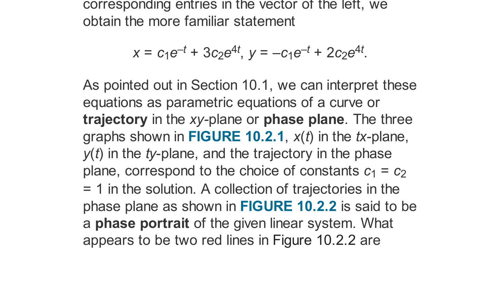

# Chapter 10: Systems of Linear Differential Equations & Eigenvalues
### Concordia University · Department of Mechanical, Industrial & Aerospace Engineering
**Course**: Applied Ordinary Differential Equations (ENGR 213)  
**Textbook**: *Advanced Engineering Mathematics* (7th Edition) by Dennis G. Zill — Chapter 10 (§10.1, §10.2)

---

## 1. Executive Overview & First-Principles Philosophy

In engineering systems, physical reality rarely isolates itself into a single degree of freedom or single state variable:
* **Coupled Mechanical Oscillators**: Multiple masses connected in series or parallel by springs and dampers (e.g., vehicle suspension models, multi-story buildings swaying in earthquakes) exhibit coupled displacements $x_1(t), x_2(t), \dots, x_n(t)$.
* **Multi-Loop Electrical Circuits**: Kirchhoff's voltage and current laws applied to multi-mesh networks containing inductors, capacitors, and resistors yield interconnected systems for loop currents $i_1(t), i_2(t), \dots, i_n(t)$.
* **Industrial Recirculation & Mixing Tanks**: Interconnected chemical reactors and brine tanks exchanging fluid via feed and recycle pipelines produce coupled solute mass rates $\frac{dx_1}{dt}, \frac{dx_2}{dt}$.

When these governing balance equations are formulated, they naturally assemble into a **System of First-Order Linear Differential Equations**.

Expressed in vector-matrix notation, an $n \times n$ system is written as:
$$\mathbf{X}'(t) = \mathbf{A}(t)\mathbf{X}(t) + \mathbf{F}(t)$$
where $\mathbf{X}(t)$ is the state vector, $\mathbf{A}(t)$ is the coefficient matrix, and $\mathbf{F}(t)$ is the external driving vector.

The profound mathematical beauty of linear systems theory is that **it converts calculus into linear algebra**:
* Finding the fundamental solutions of a constant-coefficient system $\mathbf{X}' = \mathbf{A}\mathbf{X}$ is completely equivalent to finding the **Eigenvalues $\lambda$ and Eigenvectors $\mathbf{K}$** of the matrix $\mathbf{A}$.
* The eigenvalues govern the **temporal growth, decay, or oscillation frequency** of the system.
* The eigenvectors govern the **geometric mode shapes and directional invariant axes** in the phase plane.

---

## 2. Mathematical Framework & Linear Systems Theory (Zill §10.1)

### 2.1 Matrix Formulation of Linear Systems

#### A. Standard Normal Form
A system of $n$ coupled first-order linear differential equations in $n$ unknown functions $x_1(t), x_2(t), \dots, x_n(t)$ has the general form:
$$\begin{aligned}
\frac{dx_1}{dt} &= a_{11}(t)x_1 + a_{12}(t)x_2 + \dots + a_{1n}(t)x_n + f_1(t) \\
\frac{dx_2}{dt} &= a_{21}(t)x_1 + a_{22}(t)x_2 + \dots + a_{2n}(t)x_n + f_2(t) \\
&\;\;\vdots \\
\frac{dx_n}{dt} &= a_{n1}(t)x_1 + a_{n2}(t)x_2 + \dots + a_{nn}(t)x_n + f_n(t)
\end{aligned}$$
In compact matrix notation:
$$\mathbf{X}' = \mathbf{A}(t)\mathbf{X} + \mathbf{F}(t)$$
where:
$$\mathbf{X}(t) = \begin{pmatrix} x_1(t) \\ x_2(t) \\ \vdots \\ x_n(t) \end{pmatrix}, \qquad 
\mathbf{A}(t) = \begin{pmatrix} a_{11}(t) & a_{12}(t) & \dots & a_{1n}(t) \\ a_{21}(t) & a_{22}(t) & \dots & a_{2n}(t) \\ \vdots & \vdots & \ddots & \vdots \\ a_{n1}(t) & a_{n2}(t) & \dots & a_{nn}(t) \end{pmatrix}, \qquad 
\mathbf{F}(t) = \begin{pmatrix} f_1(t) \\ f_2(t) \\ \vdots \\ f_n(t) \end{pmatrix}$$
* If $\mathbf{F}(t) \equiv \mathbf{0}$, the system is **homogeneous**: $\mathbf{X}' = \mathbf{A}(t)\mathbf{X}$.
* If $\mathbf{F}(t) \not\equiv \mathbf{0}$, the system is **nonhomogeneous**.

#### B. Conversion of Higher-Order Scalar ODEs to First-Order Systems
Any single $n$-th order linear ODE can always be rewritten as an equivalent $n \times n$ first-order system.
* *Example*: Consider $y'' + 3y' + 2y = 4\cos(t)$.
  Define state variables: $x_1 = y$, $x_2 = y'$.
  Then:
  $$x_1' = y' = x_2$$
  $$x_2' = y'' = -2y - 3y' + 4\cos(t) = -2x_1 - 3x_2 + 4\cos(t)$$
  In matrix form:
  $$\begin{pmatrix} x_1' \\ x_2' \end{pmatrix} = \begin{pmatrix} 0 & 1 \\ -2 & -3 \end{pmatrix}\begin{pmatrix} x_1 \\ x_2 \end{pmatrix} + \begin{pmatrix} 0 \\ 4\cos(t) \end{pmatrix}$$

#### C. Superposition Principle & Linear Independence
1. **Superposition Principle (Theorem 10.1.2)**: If $\mathbf{X}_1, \mathbf{X}_2, \dots, \mathbf{X}_k$ are solution vectors of the homogeneous system $\mathbf{X}' = \mathbf{A}\mathbf{X}$ on interval $I$, then any linear combination:
   $$\mathbf{X}(t) = c_1 \mathbf{X}_1(t) + c_2 \mathbf{X}_2(t) + \dots + c_k \mathbf{X}_k(t)$$
   is also a solution on $I$.
2. **Linear Independence & The Vector Wronskian**: A set of $n$ solution vectors $\mathbf{X}_1, \dots, \mathbf{X}_n$ is linearly independent on $I$ if and only if the **Wronskian determinant** is non-zero for every $t \in I$:
   $$W(\mathbf{X}_1, \mathbf{X}_2, \dots, \mathbf{X}_n)(t) = \det\left[ \mathbf{X}_1(t) \quad \mathbf{X}_2(t) \quad \dots \quad \mathbf{X}_n(t) \right] \neq 0$$
3. **Fundamental Matrix $\mathbf{\Phi}(t)$**: The square matrix whose columns are $n$ linearly independent solution vectors:
   $$\mathbf{\Phi}(t) = \left[ \mathbf{X}_1(t) \quad \mathbf{X}_2(t) \quad \dots \quad \mathbf{X}_n(t) \right]$$
   The general solution is then written compactly as:
   $$\mathbf{X}(t) = \mathbf{\Phi}(t)\mathbf{c}, \quad \text{where } \mathbf{c} = \begin{pmatrix} c_1 \\ \vdots \\ c_n \end{pmatrix}$$

---

### 2.2 Homogeneous Linear Systems with Constant Coefficients (Zill §10.2)

Consider the autonomous system where $\mathbf{A}$ is an $n \times n$ matrix of real constants:
$$\mathbf{X}' = \mathbf{A}\mathbf{X}$$

#### A. The Eigenvalue Trial Solution
By analogy with the scalar first-order equation $x' = ax \implies x(t) = c e^{at}$, we assume a trial vector solution:
$$\mathbf{X}(t) = \mathbf{K} e^{\lambda t}$$
where $\mathbf{K}$ is a non-zero constant vector $\begin{pmatrix} k_1 \\ k_2 \end{pmatrix}$ and $\lambda$ is a scalar parameter.
Differentiating with respect to $t$:
$$\mathbf{X}'(t) = \lambda \mathbf{K} e^{\lambda t}$$
Substituting into $\mathbf{X}' = \mathbf{A}\mathbf{X}$:
$$\lambda \mathbf{K} e^{\lambda t} = \mathbf{A}\mathbf{K} e^{\lambda t}$$
Dividing through by the non-zero scalar $e^{\lambda t}$:
$$\mathbf{A}\mathbf{K} = \lambda \mathbf{K} \iff (\mathbf{A} - \lambda \mathbf{I})\mathbf{K} = \mathbf{0}$$
This is the celebrated **Matrix Eigenvalue Problem**:
* $\lambda$ is an **Eigenvalue** of the coefficient matrix $\mathbf{A}$.
* $\mathbf{K} \neq \mathbf{0}$ is the corresponding **Eigenvector**.

#### B. The Characteristic Equation
The homogeneous algebraic system $(\mathbf{A} - \lambda \mathbf{I})\mathbf{K} = \mathbf{0}$ possesses non-trivial solutions ($\mathbf{K} \neq \mathbf{0}$) **if and only if the determinant of the coefficient matrix vanishes**:
$$\det(\mathbf{A} - \lambda \mathbf{I}) = 0$$
For a $2 \times 2$ matrix $\mathbf{A} = \begin{pmatrix} a & b \\ c & d \end{pmatrix}$:
$$\det\begin{pmatrix} a - \lambda & b \\ c & d - \lambda \end{pmatrix} = (a - \lambda)(d - \lambda) - bc = \lambda^2 - (a + d)\lambda + (ad - bc) = 0$$
$$\lambda^2 - \operatorname{Tr}(\mathbf{A})\lambda + \det(\mathbf{A}) = 0$$
where $\operatorname{Tr}(\mathbf{A}) = a + d$ is the trace, and $\det(\mathbf{A}) = ad - bc$ is the determinant.

The roots $\lambda_1, \lambda_2$ of this quadratic equation govern three distinct physical and geometric behaviors.

---

### 2.3 The Three Foundational Cases & Phase Plane Topology

#### Case 1: Distinct Real Eigenvalues ($\lambda_1 \neq \lambda_2 \in \mathbb{R}$)
When the characteristic roots are real and distinct, each eigenvalue $\lambda_i$ yields an independent real eigenvector $\mathbf{K}_i$ from $(\mathbf{A} - \lambda_i \mathbf{I})\mathbf{K}_i = \mathbf{0}$.
The general solution is:
$$\mathbf{X}(t) = c_1 \mathbf{K}_1 e^{\lambda_1 t} + c_2 \mathbf{K}_2 e^{\lambda_2 t}$$

**Geometric Classifications in the Phase Plane**:
1. **Asymptotically Stable Node (Sink)** ($\lambda_1 < 0$ and $\lambda_2 < 0$):
   * Both exponential terms decay to zero as $t \to \infty$. Every trajectory flows directly into the origin: $\lim_{t \to \infty} \mathbf{X}(t) = \mathbf{0}$.
   * Trajectories enter the origin tangent to the eigenvector corresponding to the **less negative** (slower decaying) eigenvalue.
2. **Unstable Node (Source)** ($\lambda_1 > 0$ and $\lambda_2 > 0$):
   * Both exponential terms grow without bound as $t \to \infty$. All trajectories flow away from the origin.
3. **Saddle Point (Always Unstable)** ($\lambda_1 > 0 > \lambda_2$ or opposite signs):
   * Trajectories starting along the stable eigenvector $\mathbf{K}_2$ (with $\lambda_2 < 0$) flow toward the origin as $t \to \infty$.
   * All other trajectories are deflected and asymptotically align with the unstable eigenvector $\mathbf{K}_1$ (with $\lambda_1 > 0$), fleeing to infinity.

*Figure 10.2.2: Phase portrait of a 2x2 linear system with real eigenvalues. Trajectories flow along directional asymptotes defined by eigenvectors $\mathbf{K}_1$ and $\mathbf{K}_2$.*

---

#### Case 2: Repeated Real Eigenvalues ($\lambda_1 = \lambda_2 = \lambda \in \mathbb{R}$)
When the characteristic equation has a repeated root of algebraic multiplicity 2:
1. **Subcase 2A: Complete / Non-Defective (Two Independent Eigenvectors)**:
   * Occurs when $(\mathbf{A} - \lambda \mathbf{I}) = \mathbf{0}$, meaning $\mathbf{A} = \begin{pmatrix} \lambda & 0 \\ 0 & \lambda \end{pmatrix}$.
   * Any two non-collinear vectors serve as eigenvectors.
   * General solution: $\mathbf{X}(t) = c_1 \begin{pmatrix} 1 \\ 0 \end{pmatrix} e^{\lambda t} + c_2 \begin{pmatrix} 0 \\ 1 \end{pmatrix} e^{\lambda t}$.
   * The phase portrait is a **Proper Node (Star Point)** where trajectories are straight radial rays.
2. **Subcase 2B: Defective (Only One Linearly Independent Eigenvector $\mathbf{K}$)**:
   * The first solution vector is:
     $$\mathbf{X}_1(t) = \mathbf{K} e^{\lambda t}$$
   * The second linearly independent solution **requires a generalized eigenvector $\mathbf{P}$**:
     $$\mathbf{X}_2(t) = \mathbf{K} t e^{\lambda t} + \mathbf{P} e^{\lambda t}$$
   * **Derivation of the Generalized Eigenvector Equation**:
     Differentiate $\mathbf{X}_2(t)$:
     $$\mathbf{X}_2'(t) = \mathbf{K} e^{\lambda t} + \lambda \mathbf{K} t e^{\lambda t} + \lambda \mathbf{P} e^{\lambda t}$$
     Substitute $\mathbf{X}_2$ into $\mathbf{X}' = \mathbf{A}\mathbf{X}$:
     $$\mathbf{K} e^{\lambda t} + \lambda \mathbf{K} t e^{\lambda t} + \lambda \mathbf{P} e^{\lambda t} = \mathbf{A}\mathbf{K} t e^{\lambda t} + \mathbf{A}\mathbf{P} e^{\lambda t}$$
     Equating coefficients of $t e^{\lambda t}$ and $e^{\lambda t}$:
     $$\mathbf{A}\mathbf{K} = \lambda \mathbf{K} \implies (\mathbf{A} - \lambda \mathbf{I})\mathbf{K} = \mathbf{0} \quad (\text{Eigenvector equation})$$
     $$\mathbf{A}\mathbf{P} - \lambda \mathbf{P} = \mathbf{K} \implies (\mathbf{A} - \lambda \mathbf{I})\mathbf{P} = \mathbf{K} \quad (\text{Generalized Eigenvector equation})$$
   * The general solution is:
     $$\mathbf{X}(t) = c_1 \mathbf{K} e^{\lambda t} + c_2 \left( \mathbf{K} t + \mathbf{P} \right) e^{\lambda t}$$
   * The phase portrait is an **Improper (Degenerate) Node**.

---

#### Case 3: Complex Conjugate Eigenvalues ($\lambda = \alpha \pm i\beta$, $\beta \neq 0$)
Because $\mathbf{A}$ is real, complex eigenvalues always occur in conjugate pairs:
$$\lambda_1 = \alpha + i\beta, \qquad \lambda_2 = \alpha - i\beta$$
The eigenvector $\mathbf{K}_1$ associated with $\lambda_1$ will have complex entries. Decompose $\mathbf{K}_1$ into real and imaginary vector components:
$$\mathbf{K}_1 = \mathbf{B}_1 + i \mathbf{B}_2, \quad \text{where } \mathbf{B}_1 = \operatorname{Re}(\mathbf{K}_1), \quad \mathbf{B}_2 = \operatorname{Im}(\mathbf{K}_1)$$

The formal complex solution is:
$$\mathbf{W}(t) = \mathbf{K}_1 e^{(\alpha + i\beta)t} = (\mathbf{B}_1 + i \mathbf{B}_2) e^{\alpha t} (\cos(\beta t) + i \sin(\beta t))$$
Expanding the product:
$$\mathbf{W}(t) = e^{\alpha t} \left[ (\mathbf{B}_1 \cos(\beta t) - \mathbf{B}_2 \sin(\beta t)) + i (\mathbf{B}_2 \cos(\beta t) + \mathbf{B}_1 \sin(\beta t)) \right]$$

By the Superposition Principle, the **real part** $\operatorname{Re}(\mathbf{W})$ and **imaginary part** $\operatorname{Im}(\mathbf{W})$ form two real linearly independent solutions:
$$\mathbf{X}_1(t) = e^{\alpha t} \left[ \mathbf{B}_1 \cos(\beta t) - \mathbf{B}_2 \sin(\beta t) \right]$$
$$\mathbf{X}_2(t) = e^{\alpha t} \left[ \mathbf{B}_2 \cos(\beta t) + \mathbf{B}_1 \sin(\beta t) \right]$$
The general real solution is:
$$\mathbf{X}(t) = c_1 \mathbf{X}_1(t) + c_2 \mathbf{X}_2(t)$$

**Geometric Classifications in the Phase Plane**:
1. **Center (Neutral Stability)** ($\alpha = 0$, pure imaginary $\lambda = \pm i\beta$):
   * Trajectories form closed concentric ellipses around the origin. The system oscillates indefinitely with natural frequency $\omega = \beta$ without decaying or growing.
2. **Stable Spiral Point (Spiral Sink)** ($\alpha < 0$):
   * The factor $e^{\alpha t} \to 0$ dampens the oscillations. Trajectories spiral inward toward the origin as $t \to \infty$.
3. **Unstable Spiral Point (Spiral Source)** ($\alpha > 0$):
   * The factor $e^{\alpha t} \to \infty$ amplifies the oscillations. Trajectories spiral outward away from the origin.

*Determining Direction of Rotation (Clockwise vs. Counterclockwise)*:
Test the velocity vector $\mathbf{X}' = \mathbf{A}\mathbf{X}$ at the test point $(1, 0)^T$ on the positive $x_1$-axis:
$$\mathbf{X}' = \begin{pmatrix} a_{11} & a_{12} \\ a_{21} & a_{22} \end{pmatrix}\begin{pmatrix} 1 \\ 0 \end{pmatrix} = \begin{pmatrix} a_{11} \\ a_{21} \end{pmatrix}$$
* If $a_{21} > 0$: $x_2' > 0 \implies$ velocity points upward $\implies$ **Counterclockwise** rotation.
* If $a_{21} < 0$: $x_2' < 0 \implies$ velocity points downward $\implies$ **Clockwise** rotation.

---

## 3. Master Classification Matrix for $2 \times 2$ Linear Systems

Let $\tau = \operatorname{Tr}(\mathbf{A}) = a + d$ and $\Delta = \det(\mathbf{A}) = ad - bc$. The characteristic equation is $\lambda^2 - \tau \lambda + \Delta = 0$.
The discriminant is:
$$D = \tau^2 - 4\Delta$$

| Condition on $\Delta, \tau, D$ | Eigenvalues $\lambda_1, \lambda_2$ | Stability Type | Phase Portrait Topology |
| :--- | :--- | :--- | :--- |
| $\Delta < 0$ | Real, opposite signs ($\lambda_1 > 0 > \lambda_2$) | **Unstable** | **Saddle Point** |
| $\Delta > 0, D > 0, \tau < 0$ | Real, distinct, both negative ($\lambda_2 < \lambda_1 < 0$) | **Asymptotically Stable** | **Stable Node (Sink)** |
| $\Delta > 0, D > 0, \tau > 0$ | Real, distinct, both positive ($\lambda_1 > \lambda_2 > 0$) | **Unstable** | **Unstable Node (Source)** |
| $\Delta > 0, D = 0, \tau < 0$ | Real, repeated, negative ($\lambda = \tau/2 < 0$) | **Asymptotically Stable** | **Degenerate / Star Node** |
| $\Delta > 0, D = 0, \tau > 0$ | Real, repeated, positive ($\lambda = \tau/2 > 0$) | **Unstable** | **Degenerate / Star Node** |
| $\Delta > 0, D < 0, \tau < 0$ | Complex conjugate with $\alpha < 0$ ($\lambda = \alpha \pm i\beta$) | **Asymptotically Stable** | **Stable Spiral (Sink)** |
| $\Delta > 0, D < 0, \tau > 0$ | Complex conjugate with $\alpha > 0$ ($\lambda = \alpha \pm i\beta$) | **Unstable** | **Unstable Spiral (Source)** |
| $\Delta > 0, \tau = 0$ ($D < 0$) | Pure imaginary ($\lambda = \pm i\sqrt{\Delta}$) | **Neutrally Stable** | **Center (Ellipses)** |

---

## 4. Comprehensive Step-by-Step Problem Walkthroughs

### 4.1 Problem 1: Real Distinct Eigenvalues IVP (Saddle Point)

**Problem Statement**: Solve the initial-value problem:
$$\mathbf{X}' = \begin{pmatrix} 1 & 3 \\ 5 & 3 \end{pmatrix}\mathbf{X}, \quad \mathbf{X}(0) = \begin{pmatrix} 2 \\ 6 \end{pmatrix}$$
Classify the critical point at the origin and describe its phase portrait.

#### Step 1: Find the Eigenvalues
Compute $\det(\mathbf{A} - \lambda \mathbf{I}) = 0$:
$$\det\begin{pmatrix} 1 - \lambda & 3 \\ 5 & 3 - \lambda \end{pmatrix} = (1 - \lambda)(3 - \lambda) - (3)(5) = 0$$
$$\lambda^2 - 4\lambda + 3 - 15 = \lambda^2 - 4\lambda - 12 = 0$$
Factor the quadratic equation:
$$(\lambda - 6)(\lambda + 2) = 0 \implies \lambda_1 = 6, \quad \lambda_2 = -2$$
Since $\lambda_1 > 0$ and $\lambda_2 < 0$, the origin $(0, 0)$ is an **Unstable Saddle Point**.

#### Step 2: Find the Eigenvector $\mathbf{K}_1$ for $\lambda_1 = 6$
Substitute $\lambda_1 = 6$ into $(\mathbf{A} - 6\mathbf{I})\mathbf{K}_1 = \mathbf{0}$:
$$\begin{pmatrix} 1 - 6 & 3 \\ 5 & 3 - 6 \end{pmatrix}\begin{pmatrix} k_1 \\ k_2 \end{pmatrix} = \begin{pmatrix} -5 & 3 \\ 5 & -3 \end{pmatrix}\begin{pmatrix} k_1 \\ k_2 \end{pmatrix} = \begin{pmatrix} 0 \\ 0 \end{pmatrix}$$
From the first row:
$$-5k_1 + 3k_2 = 0 \implies 3k_2 = 5k_1 \implies k_2 = \frac{5}{3}k_1$$
Choosing $k_1 = 3$ gives $k_2 = 5$:
$$\mathbf{K}_1 = \begin{pmatrix} 3 \\ 5 \end{pmatrix}$$
The first fundamental solution is:
$$\mathbf{X}_1(t) = \begin{pmatrix} 3 \\ 5 \end{pmatrix} e^{6t}$$

#### Step 3: Find the Eigenvector $\mathbf{K}_2$ for $\lambda_2 = -2$
Substitute $\lambda_2 = -2$ into $(\mathbf{A} - (-2)\mathbf{I})\mathbf{K}_2 = (\mathbf{A} + 2\mathbf{I})\mathbf{K}_2 = \mathbf{0}$:
$$\begin{pmatrix} 1 - (-2) & 3 \\ 5 & 3 - (-2) \end{pmatrix}\begin{pmatrix} k_1 \\ k_2 \end{pmatrix} = \begin{pmatrix} 3 & 3 \\ 5 & 5 \end{pmatrix}\begin{pmatrix} k_1 \\ k_2 \end{pmatrix} = \begin{pmatrix} 0 \\ 0 \end{pmatrix}$$
From the first row:
$$3k_1 + 3k_2 = 0 \implies k_1 + k_2 = 0 \implies k_2 = -k_1$$
Choosing $k_1 = 1$ gives $k_2 = -1$:
$$\mathbf{K}_2 = \begin{pmatrix} 1 \\ -1 \end{pmatrix}$$
The second fundamental solution is:
$$\mathbf{X}_2(t) = \begin{pmatrix} 1 \\ -1 \end{pmatrix} e^{-2t}$$

#### Step 4: Assemble the General Solution
$$\mathbf{X}(t) = c_1 \mathbf{X}_1(t) + c_2 \mathbf{X}_2(t) = c_1 \begin{pmatrix} 3 \\ 5 \end{pmatrix} e^{6t} + c_2 \begin{pmatrix} 1 \\ -1 \end{pmatrix} e^{-2t}$$

#### Step 5: Enforce the Initial Condition $\mathbf{X}(0) = \begin{pmatrix} 2 \\ 6 \end{pmatrix}$
At $t = 0$:
$$\mathbf{X}(0) = c_1 \begin{pmatrix} 3 \\ 5 \end{pmatrix} + c_2 \begin{pmatrix} 1 \\ -1 \end{pmatrix} = \begin{pmatrix} 2 \\ 6 \end{pmatrix}$$
This produces the $2 \times 2$ algebraic system:
$$\begin{aligned}
3c_1 + c_2 &= 2 \quad \text{--- (Eq. 1)} \\
5c_1 - c_2 &= 6 \quad \text{--- (Eq. 2)}
\end{aligned}$$
Add (Eq. 1) and (Eq. 2) directly:
$$(3c_1 + 5c_1) + (c_2 - c_2) = 2 + 6 \implies 8c_1 = 8 \implies c_1 = 1$$
Substitute $c_1 = 1$ into (Eq. 1):
$$3(1) + c_2 = 2 \implies c_2 = 2 - 3 = -1$$

#### Step 6: Final Solution
$$\mathbf{X}(t) = \begin{pmatrix} 3 \\ 5 \end{pmatrix} e^{6t} - \begin{pmatrix} 1 \\ -1 \end{pmatrix} e^{-2t}$$
In component form:
$$x_1(t) = 3e^{6t} - e^{-2t}, \qquad x_2(t) = 5e^{6t} + e^{-2t}$$

---

### 4.2 Problem 2: Defective Repeated Eigenvalues (Generalized Eigenvector)

**Problem Statement**: Find the general solution of the linear system:
$$\mathbf{X}' = \begin{pmatrix} 3 & -18 \\ 2 & -9 \end{pmatrix}\mathbf{X}$$

#### Step 1: Find the Eigenvalues
$$\det(\mathbf{A} - \lambda \mathbf{I}) = \det\begin{pmatrix} 3 - \lambda & -18 \\ 2 & -9 - \lambda \end{pmatrix} = (3 - \lambda)(-9 - \lambda) - (-18)(2) = 0$$
$$\lambda^2 + 6\lambda - 27 + 36 = \lambda^2 + 6\lambda + 9 = 0$$
$$(\lambda + 3)^2 = 0 \implies \lambda = -3 \quad (\text{Multiplicity } 2)$$

#### Step 2: Find the First Eigenvector $\mathbf{K}$
Substitute $\lambda = -3$ into $(\mathbf{A} + 3\mathbf{I})\mathbf{K} = \mathbf{0}$:
$$\begin{pmatrix} 3 - (-3) & -18 \\ 2 & -9 - (-3) \end{pmatrix}\begin{pmatrix} k_1 \\ k_2 \end{pmatrix} = \begin{pmatrix} 6 & -18 \\ 2 & -6 \end{pmatrix}\begin{pmatrix} k_1 \\ k_2 \end{pmatrix} = \begin{pmatrix} 0 \\ 0 \end{pmatrix}$$
Both rows reduce to:
$$2k_1 - 6k_2 = 0 \implies k_1 = 3k_2$$
Choosing $k_2 = 1$ yields $k_1 = 3$:
$$\mathbf{K} = \begin{pmatrix} 3 \\ 1 \end{pmatrix}$$
Since the eigenspace has dimension 1 (only one independent eigenvector), the matrix is **defective**.
The first solution is:
$$\mathbf{X}_1(t) = \begin{pmatrix} 3 \\ 1 \end{pmatrix} e^{-3t}$$

#### Step 3: Find the Generalized Eigenvector $\mathbf{P}$
Solve $(\mathbf{A} - \lambda \mathbf{I})\mathbf{P} = \mathbf{K}$, which is $(\mathbf{A} + 3\mathbf{I})\mathbf{P} = \mathbf{K}$:
$$\begin{pmatrix} 6 & -18 \\ 2 & -6 \end{pmatrix}\begin{pmatrix} p_1 \\ p_2 \end{pmatrix} = \begin{pmatrix} 3 \\ 1 \end{pmatrix}$$
Both equations state:
$$2p_1 - 6p_2 = 1 \implies 2p_1 = 1 + 6p_2 \implies p_1 = \frac{1}{2} + 3p_2$$
We are free to choose any convenient real value for $p_2$. Setting $p_2 = 0$ gives $p_1 = \frac{1}{2}$:
$$\mathbf{P} = \begin{pmatrix} 1/2 \\ 0 \end{pmatrix}$$

#### Step 4: Construct the Second Solution $\mathbf{X}_2(t)$
$$\mathbf{X}_2(t) = \mathbf{K} t e^{-3t} + \mathbf{P} e^{-3t} = \left[ \begin{pmatrix} 3 \\ 1 \end{pmatrix} t + \begin{pmatrix} 1/2 \\ 0 \end{pmatrix} \right] e^{-3t}$$

#### Step 5: Assemble the General Solution
$$\mathbf{X}(t) = c_1 \begin{pmatrix} 3 \\ 1 \end{pmatrix} e^{-3t} + c_2 \left[ \begin{pmatrix} 3 \\ 1 \end{pmatrix} t + \begin{pmatrix} 1/2 \\ 0 \end{pmatrix} \right] e^{-3t}$$
In component form:
$$x_1(t) = c_1 (3e^{-3t}) + c_2 \left( 3t + \frac{1}{2} \right)e^{-3t}$$
$$x_2(t) = c_1 e^{-3t} + c_2 t e^{-3t}$$
*Stability*: Since $\lambda = -3 < 0$, the origin is an **Asymptotically Stable Degenerate Node**.

---

### 4.3 Problem 3: Complex Conjugate Eigenvalues (Center / Spiral)

**Problem Statement**: Find the general solution of the system:
$$\mathbf{X}' = \begin{pmatrix} 2 & 8 \\ -1 & -2 \end{pmatrix}\mathbf{X}$$

#### Step 1: Find the Eigenvalues
$$\det(\mathbf{A} - \lambda \mathbf{I}) = \det\begin{pmatrix} 2 - \lambda & 8 \\ -1 & -2 - \lambda \end{pmatrix} = (2 - \lambda)(-2 - \lambda) - (8)(-1) = 0$$
$$\lambda^2 - 4 + 8 = \lambda^2 + 4 = 0 \implies \lambda = \pm 2i$$
Here $\alpha = 0$ and $\beta = 2$. Because $\alpha = 0$, the critical point is a **Neutrally Stable Center** (closed periodic trajectories).

#### Step 2: Find the Complex Eigenvector for $\lambda_1 = 2i$
Substitute $\lambda_1 = 2i$ into $(\mathbf{A} - 2i\mathbf{I})\mathbf{K} = \mathbf{0}$:
$$\begin{pmatrix} 2 - 2i & 8 \\ -1 & -2 - 2i \end{pmatrix}\begin{pmatrix} k_1 \\ k_2 \end{pmatrix} = \begin{pmatrix} 0 \\ 0 \end{pmatrix}$$
From the second row:
$$-k_1 - (2 + 2i)k_2 = 0 \implies k_1 = -(2 + 2i)k_2$$
Choosing $k_2 = -1$ gives $k_1 = 2 + 2i$:
$$\mathbf{K}_1 = \begin{pmatrix} 2 + 2i \\ -1 \end{pmatrix}$$
Split $\mathbf{K}_1$ into real and imaginary vector parts:
$$\mathbf{K}_1 = \begin{pmatrix} 2 \\ -1 \end{pmatrix} + i \begin{pmatrix} 2 \\ 0 \end{pmatrix} \implies \mathbf{B}_1 = \begin{pmatrix} 2 \\ -1 \end{pmatrix}, \quad \mathbf{B}_2 = \begin{pmatrix} 2 \\ 0 \end{pmatrix}$$

#### Step 3: Construct the Two Real Linearly Independent Solutions
Using $\alpha = 0, \beta = 2$:
$$\begin{aligned}
\mathbf{X}_1(t) &= \mathbf{B}_1 \cos(2t) - \mathbf{B}_2 \sin(2t) = \begin{pmatrix} 2 \\ -1 \end{pmatrix}\cos(2t) - \begin{pmatrix} 2 \\ 0 \end{pmatrix}\sin(2t) = \begin{pmatrix} 2\cos(2t) - 2\sin(2t) \\ -\cos(2t) \end{pmatrix} \\
\mathbf{X}_2(t) &= \mathbf{B}_2 \cos(2t) + \mathbf{B}_1 \sin(2t) = \begin{pmatrix} 2 \\ 0 \end{pmatrix}\cos(2t) + \begin{pmatrix} 2 \\ -1 \end{pmatrix}\sin(2t) = \begin{pmatrix} 2\cos(2t) + 2\sin(2t) \\ -\sin(2t) \end{pmatrix}
\end{aligned}$$

#### Step 4: Assemble the General Solution
$$\mathbf{X}(t) = c_1 \begin{pmatrix} 2\cos(2t) - 2\sin(2t) \\ -\cos(2t) \end{pmatrix} + c_2 \begin{pmatrix} 2\cos(2t) + 2\sin(2t) \\ -\sin(2t) \end{pmatrix}$$
*Direction of Rotation*: At test point $(1, 0)^T$, $\mathbf{X}' = \mathbf{A}\begin{pmatrix} 1 \\ 0 \end{pmatrix} = \begin{pmatrix} 2 \\ -1 \end{pmatrix}$. Since the vertical velocity is $x_2' = -1 < 0$, the flow on the positive $x_1$-axis points downward $\implies$ **Clockwise Elliptical Orbits**.

---

## 5. Critical Concordia Exam Traps & Red Flags

* ⚠️ **Trap 1: Dropping the Generalized Vector $\mathbf{P}$ in Repeated Roots**:
  When solving defective systems with repeated eigenvalues, writing $\mathbf{X}_2(t) = \mathbf{K} t e^{\lambda t}$ is **completely wrong**! Substituting that into $\mathbf{X}' = \mathbf{A}\mathbf{X}$ yields $\mathbf{K} e^{\lambda t} = \mathbf{0}$, which is a contradiction. You **must** solve $(\mathbf{A} - \lambda \mathbf{I})\mathbf{P} = \mathbf{K}$ and include $\mathbf{P}$: $\mathbf{X}_2 = (\mathbf{K}t + \mathbf{P})e^{\lambda t}$.
* ⚠️ **Trap 2: Complex Eigenvector Imaginary Sign Flips**:
  Remember that $\mathbf{X}_1 = \mathbf{B}_1 \cos(\beta t) - \mathbf{B}_2 \sin(\beta t)$. Notice the **minus sign** in front of $\mathbf{B}_2 \sin(\beta t)$! It arises because $i \cdot i = -1$ when expanding the product $(\mathbf{B}_1 + i\mathbf{B}_2)(\cos\beta t + i\sin\beta t)$.
* ⚠️ **Trap 3: Sign Errors in Matrix Characteristic Determinants**:
  For $\mathbf{A} = \begin{pmatrix} a & b \\ c & d \end{pmatrix}$, $\det(\mathbf{A} - \lambda \mathbf{I}) = \lambda^2 - (a+d)\lambda + (ad - bc)$.
  Students often write $\lambda^2 + (a+d)\lambda$ or mess up the signs of $ad - bc$ when $b$ or $c$ is negative. Always double-check by calculating $\det$ by hand!
* ⚠️ **Trap 4: Rotation Direction in Spiral Phase Portraits**:
  Never guess clockwise vs counterclockwise. Always evaluate $\mathbf{A}\begin{pmatrix} 1 \\ 0 \end{pmatrix} = \begin{pmatrix} a_{11} \\ a_{21} \end{pmatrix}$. The sign of $a_{21}$ directly gives the vertical velocity $x_2'$: negative means downward (clockwise), positive means upward (counterclockwise).
