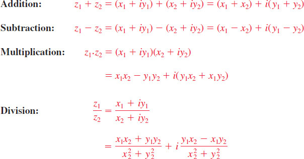

# Chapter 17: Complex Numbers, Powers & De Moivre's Formula
### Concordia University · Department of Mechanical, Industrial & Aerospace Engineering
**Course**: Applied Ordinary Differential Equations (ENGR 213)  
**Textbook**: *Advanced Engineering Mathematics* (7th Edition) by Dennis G. Zill — Chapter 17 (§17.1, §17.2)

---

## 1. Executive Overview & First-Principles Philosophy

In elementary algebra, the real number line $\mathbb{R}$ suffices for measurement, but it fails to be **algebraically closed**: simple polynomial equations like $x^2 + 1 = 0$ or $x^2 - 4x + 13 = 0$ have no real solutions.

In applied engineering mathematics, differential equations describing physical reality frequently lead to characteristic equations with negative discriminants:
* **Mechanical Vibrations**: The equation $m x'' + c x' + k x = 0$ for underdamped systems yields characteristic roots $r = -\frac{c}{2m} \pm i \sqrt{\frac{k}{m} - \frac{c^2}{4m^2}}$.
* **AC Electrical Circuits**: Alternating currents and voltages vary sinusoidally as $V(t) = V_0 \cos(\omega t + \phi)$. Expressing impedances and phasors in the complex plane converts complex differential calculus into straightforward complex algebra ($V = I Z$).
* **Fluid Dynamics & Aerodynamics**: Potential flow around airfoils is analyzed using complex velocity potentials $F(z) = \phi(x, y) + i \psi(x, y)$ through conformal mapping.

The **Complex Number System $\mathbb{C}$** expands the 1D real number line into a 2D geometric plane (the Argand plane):
* The imaginary unit $i$ satisfies $i^2 = -1$.
* Geometrically, multiplying any number by $i$ corresponds to a **counterclockwise rotation of $90^\circ$ ($\pi/2$ radians)** in the plane without altering its length.
* Euler's identity $e^{i\theta} = \cos\theta + i\sin\theta$ establishes the profound connection between exponential growth and circular trigonometry.
* De Moivre's Formula empowers engineers to raise complex quantities to any integer power and extract all $n$ distinct roots with elegant geometric symmetry.

---

## 2. Mathematical Framework & Complex Algebra (Zill §17.1)

### 2.1 The Rectangular Representation & Algebraic Operations

#### A. Definition of a Complex Number
A **complex number** $z$ is an ordered pair of real numbers $(x, y)$, conventionally written in Cartesian rectangular form as:
$$z = x + i y$$
where:
* $x = \operatorname{Re}(z)$ is the **real part** of $z$.
* $y = \operatorname{Im}(z)$ is the **imaginary part** of $z$ (note: $\operatorname{Im}(z)$ is a real number; it is the coefficient of $i$).
* $i$ is the **imaginary unit** defined by $i^2 = -1$.
* If $y = 0$, $z = x$ is a purely real number ($\mathbb{R} \subset \mathbb{C}$).
* If $x = 0$ and $y \neq 0$, $z = i y$ is called a **pure imaginary number**.

#### B. Cyclic Powers of $i$
Powers of $i$ repeat every four integer steps:
$$i^0 = 1, \qquad i^1 = i, \qquad i^2 = -1, \qquad i^3 = i^2 \cdot i = -i, \qquad i^4 = (i^2)^2 = 1$$
For any integer $n \in \mathbb{Z}$, divide $n$ by 4 with remainder $r \in \{0, 1, 2, 3\}$:
$$i^n = i^{4q + r} = (i^4)^q \cdot i^r = (1)^q \cdot i^r = i^r$$
* *Example*: $i^{75} = i^{4(18) + 3} = i^3 = -i$.
* *Example*: $i^{-1} = \frac{1}{i} = \frac{i}{i^2} = \frac{i}{-1} = -i$.

#### C. Algebraic Operations in Rectangular Form
Let $z_1 = x_1 + i y_1$ and $z_2 = x_2 + i y_2$:
1. **Equality**:
   $$z_1 = z_2 \iff x_1 = x_2 \quad \text{and} \quad y_1 = y_2$$
   *Crucial Engineering Rule*: A single complex equation $A + i B = C + i D$ is always equivalent to **two independent real equations**: $A = C$ and $B = D$.
2. **Addition and Subtraction**:
   $$z_1 \pm z_2 = (x_1 \pm x_2) + i(y_1 \pm y_2)$$
3. **Multiplication**:
   Applying the standard distributive law and using $i^2 = -1$:
   $$z_1 z_2 = (x_1 + i y_1)(x_2 + i y_2) = x_1 x_2 + i x_1 y_2 + i y_1 x_2 + i^2 y_1 y_2 = (x_1 x_2 - y_1 y_2) + i(x_1 y_2 + x_2 y_1)$$
4. **Complex Conjugate**:
   The **conjugate** of $z = x + i y$, denoted $\bar{z}$ or $z^*$, is obtained by reversing the sign of the imaginary part:
   $$\bar{z} = x - i y$$
   *Conjugate Properties*:
   $$\overline{z_1 \pm z_2} = \bar{z}_1 \pm \bar{z}_2, \qquad \overline{z_1 z_2} = \bar{z}_1 \bar{z}_2, \qquad \overline{\left(\frac{z_1}{z_2}\right)} = \frac{\bar{z}_1}{\bar{z}_2}$$
   $$z + \bar{z} = 2x = 2\operatorname{Re}(z) \implies \operatorname{Re}(z) = \frac{z + \bar{z}}{2}$$
   $$z - \bar{z} = 2iy = 2i\operatorname{Im}(z) \implies \operatorname{Im}(z) = \frac{z - \bar{z}}{2i}$$
   $$z \bar{z} = (x + iy)(x - iy) = x^2 - i^2 y^2 = x^2 + y^2 \ge 0 \quad (\text{Always a real, non-negative quantity!})$$
5. **Division**:
   To divide by a complex number $z_2 \neq 0$, multiply both numerator and denominator by the conjugate $\bar{z}_2$ to realify the denominator:
   $$\frac{z_1}{z_2} = \frac{x_1 + i y_1}{x_2 + i y_2} \cdot \frac{x_2 - i y_2}{x_2 - i y_2} = \frac{(x_1 x_2 + y_1 y_2) + i(y_1 x_2 - x_1 y_2)}{x_2^2 + y_2^2} = \frac{x_1 x_2 + y_1 y_2}{x_2^2 + y_2^2} + i \frac{y_1 x_2 - x_1 y_2}{x_2^2 + y_2^2}$$

#### D. Modulus & The Triangle Inequality
The **modulus** (or absolute value) of $z = x + i y$ is the Euclidean distance from the origin $(0, 0)$ to the point $(x, y)$ in the complex plane:
$$|z| = \sqrt{x^2 + y^2} = \sqrt{z \bar{z}}$$
*Modulus Properties*:
* $|z| \ge 0$, and $|z| = 0 \iff z = 0$
* $|z_1 z_2| = |z_1| |z_2|$
* $\left|\frac{z_1}{z_2}\right| = \frac{|z_1|}{|z_2|}$
* $|\bar{z}| = |z| = |-z|$

**The Triangle Inequalities (Theorem 17.1.1)**:
For any complex numbers $z_1, z_2$:
$$|z_1 + z_2| \le |z_1| + |z_2| \quad (\text{Standard Triangle Inequality})$$
$$|z_1 - z_2| \ge ||z_1| - |z_2|| \quad (\text{Reverse Triangle Inequality})$$

---

### 2.2 Polar & Exponential Forms (Zill §17.1)

#### A. Polar Coordinates in the Complex Plane
Let $(r, \theta)$ be polar coordinates of the point $(x, y)$ representing $z$:
$$x = r \cos\theta, \qquad y = r \sin\theta$$
where $r = |z| = \sqrt{x^2 + y^2} \ge 0$.
Substituting into $z = x + i y$:
$$z = r(\cos\theta + i\sin\theta)$$

*Figure 17.1.1: Geometric representation of $z = x + iy$ in the Argand plane showing Cartesian coordinates $(x, y)$, radial distance (modulus) $r$, and angle (argument) $\theta$.*

#### B. The Argument $\arg(z)$ and Principal Argument $\operatorname{Arg}(z)$
The angle $\theta$ measured counterclockwise from the positive real axis is called an **argument** of $z$, denoted $\theta = \arg(z)$.
Because $\cos\theta$ and $\sin\theta$ are $2\pi$-periodic:
$$\arg(z) = \theta + 2k\pi, \quad k \in \mathbb{Z}$$
To eliminate ambiguity, we define the **Principal Argument**, denoted $\operatorname{Arg}(z)$ with a capital $A$, to be the unique angle confined to the half-open interval:
$$-\pi < \operatorname{Arg}(z) \le \pi$$

**The 4-Quadrant Algorithm for $\operatorname{Arg}(z)$**:
$$\operatorname{Arg}(x + iy) = \begin{cases} 
\arctan(y/x), & x > 0 \quad (\text{Quadrants I and IV}) \\
\arctan(y/x) + \pi, & x < 0, \, y \ge 0 \quad (\text{Quadrant II}) \\
\arctan(y/x) - \pi, & x < 0, \, y < 0 \quad (\text{Quadrant III}) \\
+\frac{\pi}{2}, & x = 0, \, y > 0 \quad (\text{Positive imaginary axis}) \\
-\frac{\pi}{2}, & x = 0, \, y < 0 \quad (\text{Negative imaginary axis}) \\
\text{undefined}, & x = 0, \, y = 0 \quad (\text{The origin})
\end{cases}$$

#### C. Euler's Formula & The Exponential Form
**Euler's Formula**: For any real angle $\theta$:
$$e^{i\theta} = \cos\theta + i\sin\theta$$
This gives the compact **Exponential Form** of a complex number:
$$z = r e^{i\theta}$$

#### D. Geometric Multiplication and Division
Let $z_1 = r_1 e^{i\theta_1}$ and $z_2 = r_2 e^{i\theta_2}$:
1. **Multiplication (Moduli Multiply, Arguments Add)**:
   $$z_1 z_2 = (r_1 e^{i\theta_1})(r_2 e^{i\theta_2}) = (r_1 r_2) e^{i(\theta_1 + \theta_2)} = r_1 r_2 [\cos(\theta_1 + \theta_2) + i\sin(\theta_1 + \theta_2)]$$
   *Geometry*: Multiplying by $z_2$ dilates $z_1$ by a factor of $r_2$ and rotates it counterclockwise by angle $\theta_2$.
2. **Division (Moduli Divide, Arguments Subtract)**:
   $$\frac{z_1}{z_2} = \frac{r_1 e^{i\theta_1}}{r_2 e^{i\theta_2}} = \left(\frac{r_1}{r_2}\right) e^{i(\theta_1 - \theta_2)} = \frac{r_1}{r_2} [\cos(\theta_1 - \theta_2) + i\sin(\theta_1 - \theta_2)]$$

---

## 3. Powers and Roots: De Moivre's Formula (Zill §17.2)

### 3.1 Integer Powers & De Moivre's Theorem

#### A. Statement and Proof of De Moivre's Formula
If $z = r(\cos\theta + i\sin\theta) = r e^{i\theta}$, then for any positive integer $n$:
$$z^n = (r e^{i\theta})^n = r^n e^{in\theta} = r^n [\cos(n\theta) + i\sin(n\theta)]$$
Setting $r = 1$ yields **De Moivre's Formula**:
$$(\cos\theta + i\sin\theta)^n = \cos(n\theta) + i\sin(n\theta) \quad \text{for all } n \in \mathbb{Z}$$

*Extension to Negative Integers*:
If $n = -m$ where $m \in \mathbb{Z}^+$:
$$(\cos\theta + i\sin\theta)^{-m} = \frac{1}{(\cos\theta + i\sin\theta)^m} = \frac{1}{\cos(m\theta) + i\sin(m\theta)} = \cos(m\theta) - i\sin(m\theta) = \cos(-m\theta) + i\sin(-m\theta)$$
Thus De Moivre's formula holds for **all integers** $n \in \mathbb{Z}$.

#### B. Application: Derivation of Trigonometric Identities
We can derive multiple-angle trigonometric identities without messy algebra by expanding De Moivre's formula using the Binomial Theorem.
* *Derivation of $\cos(3\theta)$ and $\sin(3\theta)$*:
  $$\cos(3\theta) + i\sin(3\theta) = (\cos\theta + i\sin\theta)^3$$
  $$= \cos^3\theta + 3\cos^2\theta(i\sin\theta) + 3\cos\theta(i\sin\theta)^2 + (i\sin\theta)^3$$
  $$= \cos^3\theta + 3i\cos^2\theta\sin\theta - 3\cos\theta\sin^2\theta - i\sin^3\theta$$
  Group real and imaginary terms:
  $$\cos(3\theta) + i\sin(3\theta) = (\cos^3\theta - 3\cos\theta\sin^2\theta) + i(3\cos^2\theta\sin\theta - \sin^3\theta)$$
  Equating real parts:
  $$\cos(3\theta) = \cos^3\theta - 3\cos\theta(1 - \cos^2\theta) = 4\cos^3\theta - 3\cos\theta$$
  Equating imaginary parts:
  $$\sin(3\theta) = 3(1 - \sin^2\theta)\sin\theta - \sin^3\theta = 3\sin\theta - 4\sin^3\theta$$

---

### 3.2 Roots of Complex Numbers ($n$-th Roots)

#### A. Formulation of the Root Equation
Given a non-zero complex constant $z_0 = r_0 e^{i\theta_0}$, we wish to find all complex numbers $w = \rho e^{i\phi}$ satisfying:
$$w^n = z_0$$
Substituting exponential forms:
$$(\rho e^{i\phi})^n = \rho^n e^{in\phi} = r_0 e^{i\theta_0}$$
Because $e^{i\theta}$ is $2\pi$-periodic, the exponential factors match whenever the exponents differ by an integer multiple of $2\pi i$:
1. **Modulus Equality**:
   $$\rho^n = r_0 \implies \rho = r_0^{1/n} = \sqrt[n]{r_0} \quad (\text{Unique positive real } n\text{-th root})$$
2. **Argument Equality**:
   $$n\phi = \theta_0 + 2k\pi \implies \phi_k = \frac{\theta_0 + 2k\pi}{n}, \quad k \in \mathbb{Z}$$

As $k$ takes values $0, 1, 2, \dots, n-1$, we generate **exactly $n$ distinct angles** $\phi_k$. For $k = n$, the angle becomes $\frac{\theta_0 + 2n\pi}{n} = \frac{\theta_0}{n} + 2\pi$, which returns to the angle for $k = 0$.

#### B. The Master $n$-th Root Formula (Theorem 17.2.1)
The $n$ distinct $n$-th roots of $z_0 = r_0[\cos\theta_0 + i\sin\theta_0]$ are given by:
$$w_k = r_0^{1/n} \left[ \cos\left(\frac{\theta_0 + 2k\pi}{n}\right) + i\sin\left(\frac{\theta_0 + 2k\pi}{n}\right) \right], \quad k = 0, 1, 2, \dots, n-1$$
Or in exponential shorthand:
$$w_k = r_0^{1/n} \exp\left( i \frac{\theta_0 + 2k\pi}{n} \right), \quad k = 0, 1, 2, \dots, n-1$$

#### C. Geometric Distribution of Roots
The roots possess a magnificent geometric property:
* All $n$ roots lie on a **single circle centered at the origin** of radius:
  $$R = r_0^{1/n}$$
* The roots are **spaced at equal angular increments** of:
  $$\Delta\phi = \frac{2\pi}{n} \text{ radians} = \frac{360^\circ}{n}$$
* The roots form the **vertices of a regular $n$-sided polygon** inscribed within the circle!

*Figure 17.2.1: The $n$ distinct roots of a complex number evenly spaced around a circle of radius $r^{1/n}$ in the complex plane, forming a regular polygon.*

#### D. The $n$-th Roots of Unity
A fundamental special case is solving $w^n = 1$.
Here $r_0 = 1$ and $\theta_0 = 0$.
The $n$ roots of unity are:
$$\omega_k = \exp\left(i \frac{2k\pi}{n}\right) = \left[ \exp\left(i \frac{2\pi}{n}\right) \right]^k = \omega_n^k, \quad k = 0, 1, 2, \dots, n-1$$
where $\omega_n = e^{i 2\pi/n}$ is called the **primitive $n$-th root of unity**.
*Sum of Roots Property*: The sum of all $n$-th roots of unity is identically zero:
$$\sum_{k=0}^{n-1} \omega_n^k = 1 + \omega_n + \omega_n^2 + \dots + \omega_n^{n-1} = \frac{1 - \omega_n^n}{1 - \omega_n} = \frac{1 - 1}{1 - \omega_n} = 0$$

---

## 4. Comprehensive Step-by-Step Problem Walkthroughs

### 4.1 Problem 1: Rectangular Conversion, Polar Arithmetic & Powers

**Problem Statement**: Given $z_1 = -1 + i\sqrt{3}$ and $z_2 = \sqrt{2} - i\sqrt{2}$:
1. Express $z_1$ and $z_2$ in exponential polar form $r e^{i\theta}$ using principal arguments.
2. Calculate the exact rectangular forms of $z_1 z_2$ and $\frac{z_1}{z_2}$ using polar multiplication/division.
3. Compute $(z_1)^9$ using De Moivre's Formula.

#### Step 1: Convert $z_1$ to Polar Form
* Modulus:
  $$r_1 = |z_1| = \sqrt{(-1)^2 + (\sqrt{3})^2} = \sqrt{1 + 3} = \sqrt{4} = 2$$
* Argument:
  $x = -1 < 0$ and $y = \sqrt{3} > 0 \implies$ Quadrant II:
  $$\operatorname{Arg}(z_1) = \arctan\left(\frac{\sqrt{3}}{-1}\right) + \pi = -\frac{\pi}{3} + \pi = \frac{2\pi}{3}$$
* Exponential Form:
  $$z_1 = 2 e^{i 2\pi/3}$$

#### Step 2: Convert $z_2$ to Polar Form
* Modulus:
  $$r_2 = |z_2| = \sqrt{(\sqrt{2})^2 + (-\sqrt{2})^2} = \sqrt{2 + 2} = \sqrt{4} = 2$$
* Argument:
  $x = \sqrt{2} > 0$ and $y = -\sqrt{2} < 0 \implies$ Quadrant IV:
  $$\operatorname{Arg}(z_2) = \arctan\left(\frac{-\sqrt{2}}{\sqrt{2}}\right) = \arctan(-1) = -\frac{\pi}{4}$$
* Exponential Form:
  $$z_2 = 2 e^{-i \pi/4}$$

#### Step 3: Compute $z_1 z_2$
$$z_1 z_2 = (r_1 r_2) e^{i(\theta_1 + \theta_2)} = (2 \cdot 2) \exp\left(i\left[\frac{2\pi}{3} - \frac{\pi}{4}\right]\right) = 4 \exp\left(i \frac{8\pi - 3\pi}{12}\right) = 4 e^{i 5\pi/12}$$
In exact rectangular form:
$$z_1 z_2 = 4\left(\cos\frac{5\pi}{12} + i\sin\frac{5\pi}{12}\right)$$
Using angle sum identities: $\frac{5\pi}{12} = \frac{\pi}{6} + \frac{\pi}{4}$:
* $\cos\frac{5\pi}{12} = \cos\frac{\pi}{6}\cos\frac{\pi}{4} - \sin\frac{\pi}{6}\sin\frac{\pi}{4} = \left(\frac{\sqrt{3}}{2}\right)\left(\frac{\sqrt{2}}{2}\right) - \left(\frac{1}{2}\right)\left(\frac{\sqrt{2}}{2}\right) = \frac{\sqrt{6} - \sqrt{2}}{4}$
* $\sin\frac{5\pi}{12} = \sin\frac{\pi}{6}\cos\frac{\pi}{4} + \cos\frac{\pi}{6}\sin\frac{\pi}{4} = \left(\frac{1}{2}\right)\left(\frac{\sqrt{2}}{2}\right) + \left(\frac{\sqrt{3}}{2}\right)\left(\frac{\sqrt{2}}{2}\right) = \frac{\sqrt{2} + \sqrt{6}}{4}$
Multiplying by 4:
$$z_1 z_2 = (\sqrt{6} - \sqrt{2}) + i(\sqrt{6} + \sqrt{2})$$

#### Step 4: Compute $z_1 / z_2$
$$\frac{z_1}{z_2} = \left(\frac{r_1}{r_2}\right) e^{i(\theta_1 - \theta_2)} = \left(\frac{2}{2}\right) \exp\left(i\left[\frac{2\pi}{3} - \left(-\frac{\pi}{4}\right)\right]\right) = 1 \cdot e^{i 11\pi/12}$$
Using $\frac{11\pi}{12} = \pi - \frac{\pi}{12}$:
$$\cos\frac{11\pi}{12} = -\frac{\sqrt{6} + \sqrt{2}}{4}, \qquad \sin\frac{11\pi}{12} = \frac{\sqrt{6} - \sqrt{2}}{4}$$
$$\frac{z_1}{z_2} = -\frac{\sqrt{6} + \sqrt{2}}{4} + i \frac{\sqrt{6} - \sqrt{2}}{4}$$

#### Step 5: Compute $(z_1)^9$ via De Moivre's Theorem
$$(z_1)^9 = (2 e^{i 2\pi/3})^9 = 2^9 e^{i (9 \cdot 2\pi/3)} = 512 e^{i 6\pi}$$
Since $6\pi$ is an even multiple of $\pi$, $e^{i 6\pi} = \cos(6\pi) + i\sin(6\pi) = 1 + 0i = 1$:
$$(z_1)^9 = 512(1) = 512$$

---

### 4.2 Problem 2: Finding All Complex Roots ($w^4 = -8 - 8\sqrt{3}i$)

**Problem Statement**: Find all 4 roots of the complex equation $w^4 = -8 - 8\sqrt{3}i$. Express each root in exact rectangular form $a + ib$ and sketch their distribution in the complex plane.

#### Step 1: Express $z_0 = -8 - 8\sqrt{3}i$ in Polar Form
* Modulus $r_0$:
  $$r_0 = \sqrt{(-8)^2 + (-8\sqrt{3})^2} = \sqrt{64 + 64(3)} = \sqrt{64(1 + 3)} = \sqrt{256} = 16$$
* Argument $\theta_0$:
  Both $x = -8 < 0$ and $y = -8\sqrt{3} < 0 \implies$ **Quadrant III**:
  $$\operatorname{Arg}(z_0) = \arctan\left(\frac{-8\sqrt{3}}{-8}\right) - \pi = \arctan(\sqrt{3}) - \pi = \frac{\pi}{3} - \pi = -\frac{2\pi}{3}$$
  *(Alternatively, using positive angle: $\theta_0 = \frac{4\pi}{3}$)*.
  $$z_0 = 16 \exp\left(-i \frac{2\pi}{3}\right) = 16 \exp\left(i \frac{4\pi}{3}\right)$$

#### Step 2: Set Up the $n$-th Root Equation for $n = 4$
The root modulus is:
$$\rho = r_0^{1/4} = 16^{1/4} = 2$$
The root angles are:
$$\phi_k = \frac{\theta_0 + 2k\pi}{4} = \frac{\frac{4\pi}{3} + 2k\pi}{4} = \frac{\pi}{3} + \frac{k\pi}{2}, \quad k = 0, 1, 2, 3$$
The angular increment between adjacent roots is:
$$\Delta\phi = \frac{2\pi}{4} = \frac{\pi}{2} = 90^\circ$$

#### Step 3: Evaluate Each of the 4 Roots

* **Root $k = 0$**:
  $$\phi_0 = \frac{\pi}{3}$$
  $$w_0 = 2\left(\cos\frac{\pi}{3} + i\sin\frac{\pi}{3}\right) = 2\left(\frac{1}{2} + i\frac{\sqrt{3}}{2}\right) = 1 + i\sqrt{3}$$

* **Root $k = 1$**:
  $$\phi_1 = \frac{\pi}{3} + \frac{\pi}{2} = \frac{5\pi}{6}$$
  $$w_1 = 2\left(\cos\frac{5\pi}{6} + i\sin\frac{5\pi}{6}\right) = 2\left(-\frac{\sqrt{3}}{2} + i\frac{1}{2}\right) = -\sqrt{3} + i$$

* **Root $k = 2$**:
  $$\phi_2 = \frac{\pi}{3} + \pi = \frac{4\pi}{3}$$
  $$w_2 = 2\left(\cos\frac{4\pi}{3} + i\sin\frac{4\pi}{3}\right) = 2\left(-\frac{1}{2} - i\frac{\sqrt{3}}{2}\right) = -1 - i\sqrt{3}$$
  *(Notice that $w_2 = -w_0$, lying directly opposite $w_0$ across the origin!)*

* **Root $k = 3$**:
  $$\phi_3 = \frac{\pi}{3} + \frac{3\pi}{2} = \frac{11\pi}{6}$$
  $$w_3 = 2\left(\cos\frac{11\pi}{6} + i\sin\frac{11\pi}{6}\right) = 2\left(\frac{\sqrt{3}}{2} - i\frac{1}{2}\right) = \sqrt{3} - i$$
  *(Notice that $w_3 = -w_1$!)*

#### Step 4: Geometric Verification & Polygon Check
* Radius of root circle: $R = 2$.
* The four roots:
  $$w_0 = 1 + i\sqrt{3}, \quad w_1 = -\sqrt{3} + i, \quad w_2 = -1 - i\sqrt{3}, \quad w_3 = \sqrt{3} - i$$
* They form the **four vertices of a square centered at the origin**, each rotated by $90^\circ$ relative to the next!

---

### 4.3 Problem 3: Factoring Polynomials with Complex Conjugate Roots

**Problem Statement**: Solve $z^4 + 16 = 0$ in $\mathbb{C}$, and use the roots to factor $z^4 + 16$ into the product of two real irreducible quadratic factors.

#### Step 1: Solve for the Roots of $z^4 = -16$
* Modulus: $r_0 = |-16| = 16 \implies \rho = 16^{1/4} = 2$.
* Argument: $\theta_0 = \pi$.
* Angles for $k = 0, 1, 2, 3$:
  $$\phi_k = \frac{\pi + 2k\pi}{4} = \frac{\pi}{4} + \frac{k\pi}{2}$$
  * $k = 0$: $\phi_0 = \frac{\pi}{4} \implies z_0 = 2\left(\frac{\sqrt{2}}{2} + i\frac{\sqrt{2}}{2}\right) = \sqrt{2} + i\sqrt{2}$
  * $k = 1$: $\phi_1 = \frac{3\pi}{4} \implies z_1 = 2\left(-\frac{\sqrt{2}}{2} + i\frac{\sqrt{2}}{2}\right) = -\sqrt{2} + i\sqrt{2}$
  * $k = 2$: $\phi_2 = \frac{5\pi}{4} \implies z_2 = 2\left(-\frac{\sqrt{2}}{2} - i\frac{\sqrt{2}}{2}\right) = -\sqrt{2} - i\sqrt{2}$
  * $k = 3$: $\phi_3 = \frac{7\pi}{4} \implies z_3 = 2\left(\frac{\sqrt{2}}{2} - i\frac{\sqrt{2}}{2}\right) = \sqrt{2} - i\sqrt{2}$

#### Step 2: Pair Conjugate Roots
Notice the conjugate pairs:
* Pair 1: $z_0 = \sqrt{2} + i\sqrt{2}$ and $z_3 = \bar{z}_0 = \sqrt{2} - i\sqrt{2}$.
* Pair 2: $z_1 = -\sqrt{2} + i\sqrt{2}$ and $z_2 = \bar{z}_1 = -\sqrt{2} - i\sqrt{2}$.

#### Step 3: Multiply Conjugate Factors to Form Real Quadratics
* **First quadratic factor from Pair 1**:
  $$(z - z_0)(z - \bar{z}_0) = z^2 - (z_0 + \bar{z}_0)z + z_0 \bar{z}_0$$
  $$z_0 + \bar{z}_0 = 2\operatorname{Re}(z_0) = 2\sqrt{2}$$
  $$z_0 \bar{z}_0 = |z_0|^2 = (\sqrt{2})^2 + (\sqrt{2})^2 = 2 + 2 = 4$$
  $$(z - z_0)(z - \bar{z}_0) = z^2 - 2\sqrt{2}z + 4$$

* **Second quadratic factor from Pair 2**:
  $$(z - z_1)(z - \bar{z}_1) = z^2 - (z_1 + \bar{z}_1)z + z_1 \bar{z}_1$$
  $$z_1 + \bar{z}_1 = 2\operatorname{Re}(z_1) = 2(-\sqrt{2}) = -2\sqrt{2}$$
  $$z_1 \bar{z}_1 = |z_1|^2 = (-\sqrt{2})^2 + (\sqrt{2})^2 = 4$$
  $$(z - z_1)(z - \bar{z}_1) = z^2 + 2\sqrt{2}z + 4$$

#### Step 4: Final Real Factorization
$$z^4 + 16 = (z^2 - 2\sqrt{2}z + 4)(z^2 + 2\sqrt{2}z + 4)$$
*(This exact factorization is required when performing partial fractions on $\frac{1}{s^4 + 16}$ in Laplace transforms!)*

---

## 5. Critical Concordia Exam Traps & Red Flags

* ⚠️ **Trap 1: Quadrant Failure in $\arctan(y/x)$**:
  Calculators always return $\arctan(y/x) \in (-\pi/2, \pi/2)$.
  If $z = -1 - i$, $y/x = 1$, and calculator gives $\pi/4$. But $z$ is in Quadrant III! Writing $\theta = \pi/4$ will result in a zero on the problem. You must adjust: $\operatorname{Arg}(z) = \frac{\pi}{4} - \pi = -\frac{3\pi}{4}$.
* ⚠️ **Trap 2: Losing Roots by Forgetting $2k\pi$**:
  When solving $w^n = z_0$, students often write $\phi = \frac{\theta_0}{n}$ and stop after finding only one root. You **must** add $\frac{2k\pi}{n}$ for $k = 0, 1, \dots, n-1$ to extract all $n$ distinct roots!
* ⚠️ **Trap 3: Taking the $n$-th Root of Modulus Incorrectly**:
  In $w^4 = 16 e^{i\pi}$, the modulus of each root is $\sqrt[4]{16} = 2$. Students sometimes mistakenly divide the modulus by $n$ ($16/4 = 4$). You take the **$n$-th root** of the modulus, but you **divide** the argument by $n$!
* ⚠️ **Trap 4: Missing Minus Sign in Conjugate Division**:
  When dividing $\frac{z_1}{z_2}$, always write the denominator as $x_2^2 + y_2^2$ (a **sum** of squares). Because $i^2 = -1$, $(x_2 + iy_2)(x_2 - iy_2) = x_2^2 - i^2 y_2^2 = x_2^2 + y_2^2$. Never subtract squares in the denominator!
