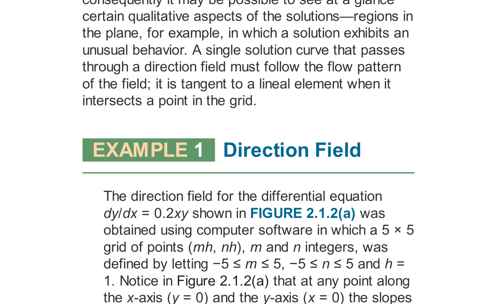

# Topic 02: Slope Fields, Solution Curves & Qualitative Behavior
### Professor Leonard Master Series · Lessons 5 & 6
**Course**: Applied Ordinary Differential Equations (ENGR 213 Companion)

---

## 1. Whiteboard Intuition: Visualizing the Wind
*"Imagine you are looking down at an ocean current from an airplane. At every single point $(x, y)$ in the water, an arrow points in the direction the current is flowing."*

That is precisely what a **Slope Field (Direction Field)** is! 
Given $\frac{dy}{dx} = f(x, y)$:
* You do **not** need to integrate.
* You do **not** need to find an algebraic formula.
* At every point $(x, y)$, calculate the number $f(x, y)$. That number is the tangent slope $m$.
* Draw a tiny line segment with slope $m$.

If you drop a boat (an initial condition $(x_0, y_0)$) into the ocean, the boat will follow the current. The path the boat traces out is the **solution curve**!

---

## 2. Curriculum Reference Diagram

*Figure 2.1: Direction field and solution curves — from Textbook 7th Ed. Chapter 2 (Fig. 2.1.2).*

### Key Observations:
1. Along the axes where $x = 0$ or $y = 0$, the slope is $0.2(0) = 0$, so all hash marks are **horizontal**.
2. In Quadrant I ($x > 0, y > 0$), slopes are positive and get steeper as $x$ and $y$ grow.
3. Solution curves entering Quadrant I bend upwards exponentially!

---

## 3. Isoclines: The Fast Way to Sketch by Hand
Calculating slopes point-by-point takes forever. Professor Leonard uses **Isoclines** (curves of constant slope):
Set $f(x, y) = c$, where $c$ is a constant slope.
* For $\frac{dy}{dx} = x - y$:
  * Set slope $c = 0 \implies x - y = 0 \implies y = x$. Everywhere along the line $y = x$, draw horizontal tick marks ($m = 0$)!
  * Set slope $c = 1 \implies x - y = 1 \implies y = x - 1$. Everywhere along $y = x - 1$, draw 45° tick marks ($m = 1$).
  * Set slope $c = -1 \implies y = x + 1$. Draw tick marks with slope $-1$.

Now connect the flow: any curve crossing $y = x$ has a horizontal tangent (a local minimum or maximum)!

---

## 4. Leonard's Red Flag Alerts
* 🚩 **Red Flag**: Drawing solution curves that cross each other. If $f(x,y)$ and $\partial f/\partial y$ are smooth, **two solution curves can NEVER intersect**. If they crossed, a boat placed at the intersection wouldn't know which way to flow!
