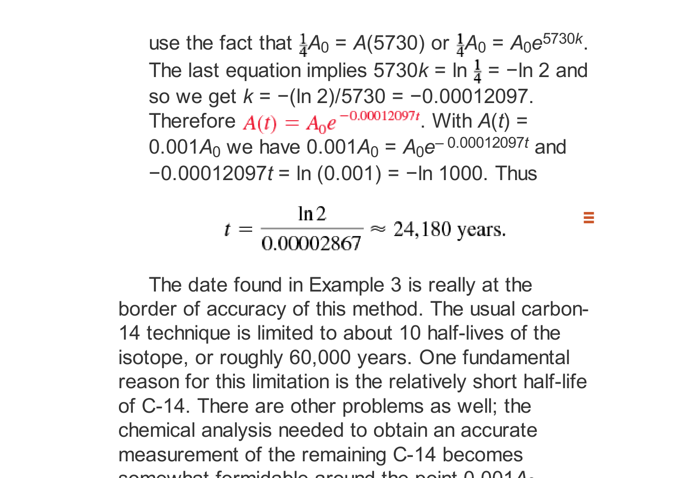

# Topic 06: Tank Mixing Problems & Draining Rates
### Professor Leonard Master Series · Lesson 19
**Course**: Applied Ordinary Differential Equations (ENGR 213 Companion)

---

## 1. Whiteboard Intuition: The Giant Kool-Aid Vat
*"Think about making a giant vat of Kool-Aid. You have a huge 500-gallon tank. Water with dissolved powder flows in at the top. The mixer stirs it instantly, and the blended mixture drains out of a valve at the bottom."*

We want to know: **How many pounds of salt/powder $A(t)$ are in the tank at any minute $t$?**

The fundamental law of mass conservation says:
$$\text{Rate of Change of Salt} = (\text{Rate of Salt Entering}) - (\text{Rate of Salt Leaving})$$
$$\frac{dA}{dt} = R_{\text{in}} - R_{\text{out}}$$

Where each rate is:
$$\text{Rate} = (\text{Concentration}) \times (\text{Fluid Flow Rate})$$
$$R_{\text{in}} = c_{\text{in}} \cdot r_{\text{in}}, \quad R_{\text{out}} = c_{\text{out}}(t) \cdot r_{\text{out}}$$

---

## 2. Curriculum Reference Diagram

*Figure 6.1: Mixing tank with input and drain streams — from Textbook 7th Ed. Chapter 2 (Fig. 2.7.4).*

---

## 3. Dynamic Volume: The Number One Exam Trap!
What is the concentration leaving the tank, $c_{\text{out}}(t)$?
$$c_{\text{out}}(t) = \frac{\text{Amount of salt in tank}}{\text{Volume of liquid in tank}} = \frac{A(t)}{V(t)}$$

* **Case 1: Constant Volume ($r_{\text{in}} = r_{\text{out}}$)**:
  Liquid enters as fast as it leaves. $V(t) = V_0$.
* **Case 2: Changing Volume ($r_{\text{in}} \neq r_{\text{out}}$)**:
  $$\text{Net Rate of Liquid Accumulation} = r_{\text{in}} - r_{\text{out}}$$
  $$V(t) = V_0 + (r_{\text{in}} - r_{\text{out}})t$$
  Therefore:
  $$\frac{dA}{dt} = c_{\text{in}}r_{\text{in}} - \frac{A(t)}{V_0 + (r_{\text{in}} - r_{\text{out}})t} r_{\text{out}}$$

Rearranging gives a classic First-Order Linear ODE:
$$\frac{dA}{dt} + \left(\frac{r_{\text{out}}}{V_0 + (r_{\text{in}} - r_{\text{out}})t}\right)A = c_{\text{in}} r_{\text{in}}$$
This is solved using the Integrating Factor method from Topic 05!
