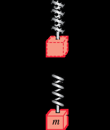
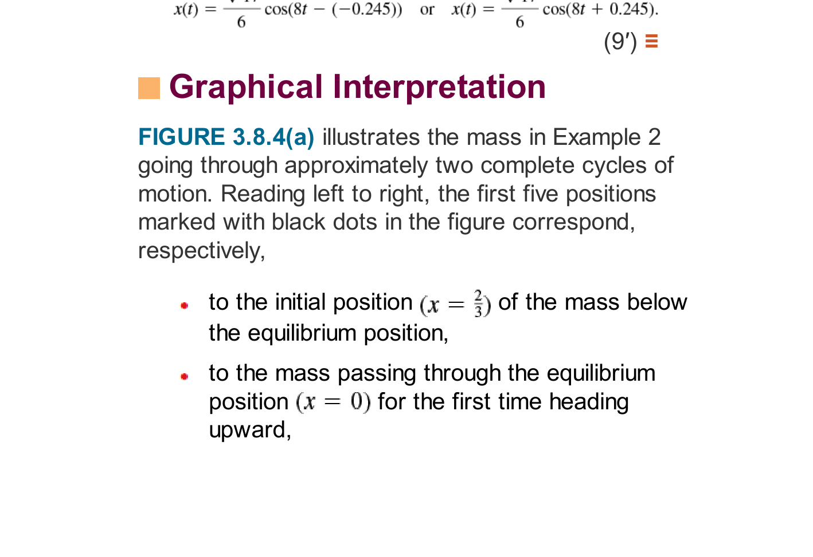

# Topic 14: Mechanical Oscillations, Damping & Pure Resonance
### Professor Leonard Master Series · Mechanical Vibrations
**Course**: Applied Ordinary Differential Equations (ENGR 213 Companion)

---

## 1. Whiteboard Intuition: The Bouncing Mass on a Spring
*"Picture a mass $m$ hanging from a spring with stiffness $k$, inside a shock absorber with damping $\beta$, pushed by an external force $F(t)$."*

Newton's Second Law ($F_{\text{net}} = m a$):
$$m x'' = -k x - \beta x' + F(t) \implies m x'' + \beta x' + k x = F(t)$$

---

## 2. Curriculum Reference Diagrams

*Figure 14.1: Mass-spring coordinate reference — from Textbook 7th Ed. Chapter 3 (Fig. 3.8.2).*

*Figure 14.2: Damping behavior: Underdamped envelope decay vs Overdamped slow return — from Textbook 7th Ed. Chapter 3 (Fig. 3.8.4).*

---

## 3. The Three Damping Regimes
Discriminant: $\Delta = \beta^2 - 4mk$.
1. **Overdamped ($\beta^2 > 4mk$)**: Heavy damping (like moving through honey). Returns to rest with no oscillations.
2. **Critically Damped ($\beta^2 = 4mk$)**: The sweet spot for car shock absorbers. Returns to equilibrium as fast as physically possible without overshooting.
3. **Underdamped ($\beta^2 < 4mk$)**: Bounces back and forth with decaying amplitude:
   $$x(t) = A e^{-\frac{\beta}{2m}t}\cos(\omega_d t - \phi)$$

---

## 4. Pure Resonance: When Buildings Collapse
If there is NO damping ($\beta = 0$) and the driving frequency equals the natural frequency ($\omega = \omega_0 = \sqrt{k/m}$):
$$x'' + \omega_0^2 x = F_0 \cos(\omega_0 t)$$
Because $\cos(\omega_0 t)$ is in $y_c$, undetermined coefficients requires multiplying by $t$:
$$x_p(t) = \frac{F_0}{2\omega_0} t \sin(\omega_0 t)$$
The amplitude grows linearly with time $t \to \infty$ without bound! This is what collapsed the Tacoma Narrows Bridge!
