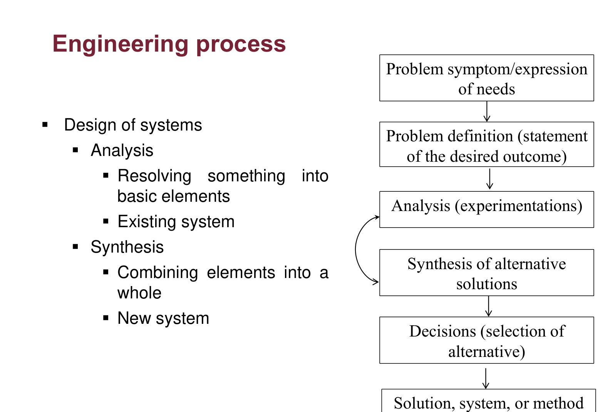
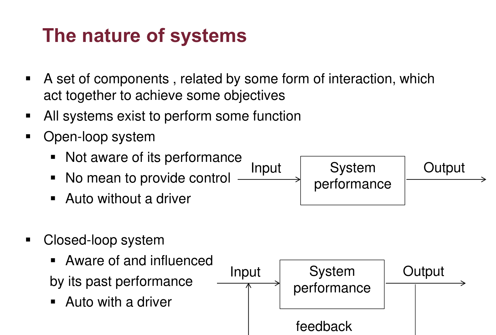
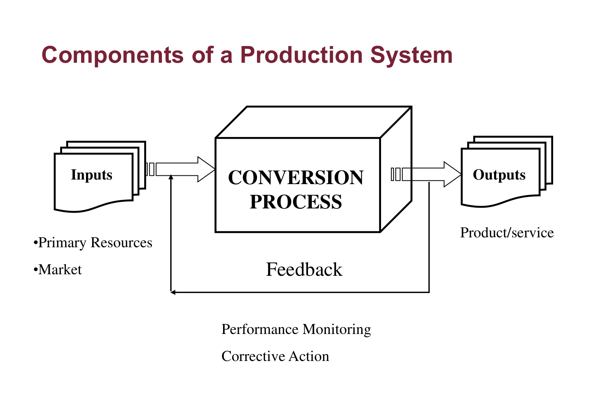

# INDU 211 · Comprehensive Topic Guide (Part 1)
# Chapters 1 & 2: Foundations of Industrial & Systems Engineering
**Concordia University · Department of Mechanical, Industrial & Aerospace Engineering (MIAE)**

---

## Table of Contents
1. [The Soul of Engineering: Origins & Meaning of "Ingenium"](#1-the-soul-of-engineering-origins--meaning-of-ingenium)
2. [Science vs. Engineering: The Knowledge-Action Duality](#2-science-vs-engineering-the-knowledge-action-duality)
3. [Historical Evolution: From Pyramids to Post-WWII High-Tech](#3-historical-evolution-from-pyramids-to-post-wwii-high-tech)
4. [The Regulated Profession & Engineering Ethics](#4-the-regulated-profession--engineering-ethics)
5. [The Engineering Design Cycle: Analysis vs. Synthesis](#5-the-engineering-design-cycle-analysis-vs-synthesis)
6. [Chronology & Pioneers of Industrial Engineering](#6-chronology--pioneers-of-industrial-engineering)
7. [The Formal Definition & Identity of Industrial Engineering](#7-the-formal-definition--identity-of-industrial-engineering)
8. [The Two Levels of System Design](#8-the-two-levels-of-system-design)
9. [Systems Theory: Open-Loop vs. Closed-Loop Production Systems](#9-systems-theory-open-loop-vs-closed-loop-production-systems)
10. [The Decision-Making Hierarchy: Strategic, Tactical, and Control](#10-the-decision-making-hierarchy-strategic-tactical-and-control)
11. [Careers, Human Engineering & IE in the Age of AI](#11-careers-human-engineering--ie-in-the-age-of-ai)

---

## 1. The Soul of Engineering: Origins & Meaning of "Ingenium"

When entering engineering for the first time, students often picture math equations, heavy machinery, or computer code. But the concept is far older and deeply human:

* Both words **engineer** and **ingenious** originate from the Latin noun **ingenium**.
* *Ingenium* signifies:
  * Inherent talent or natural ability.
  * Cleverness, sharp inventiveness, and creative resourcefulness.
  * The mental capacity to devise a practical solution where none existed before.

> **Key Takeaway for Beginners:**  
> An engineer is fundamentally an **inventive problem solver**. You do not study engineering simply to memorize formulas; you learn math and science so that your cleverness (*ingenium*) can be turned into functional reality.

---

## 2. Science vs. Engineering: The Knowledge-Action Duality

One of the most essential distinctions in your academic journey is understanding where science ends and engineering begins.

The two work hand in hand, as the Lecture 1.0 slides put it (p. 4):

1. **Science discovers** how nature behaves: it observes, forms conjectures with logic, and verifies them by controlled experiments (slide 5).
2. **Engineering applies** that verified knowledge to real problems: food, shelter, movement, communications, the environment (slide 6).
3. **Engineering feeds back** to science: when a design needs knowledge that does not exist yet, it creates a new scientific question (slide 4: "science receives feedback from engineering").

> **From the textbook (Hicks, Ch. 1):** the inclined plane, the bow, the wheel and the water wheel were *science*, while the Great Wall of China and Roman construction were *engineering*. Mathematics is the common foundation of every engineering development.

### Side-by-Side Comparison Matrix

| Dimension | **Science** | **Engineering** |
| :--- | :--- | :--- |
| **Primary Goal** | The quest for **basic knowledge** (understanding *how* and *why* nature behaves as it does). | The **application** of scientific knowledge to solve human problems for a **better life**. |
| **Core Method** | **Scientific Method**: Observe nature $\to$ form hypotheses with formal logic $\to$ test via controlled experiments. | **Engineering Design Cycle**: Identify needs $\to$ analyze constraints $\to$ synthesize alternatives $\to$ build and operate. |
| **Standard Output** | Validated conjectures, mathematical laws, published scientific theories. | Physical products, factories, hospitals, software systems, energy grids. |
| **Philosophical Focus** | Truth, discovery, and explanation. | Utility, safety, economic viability, and human comfort. |
| **Underlying Language** | **Mathematics** (provides quantitative formulation). | **Mathematics** (provides predictive design and optimization). |

### Real-World Historical Relationship
1. **Engineering Ahead of Science**: Humans built the **Great Wall of China**, the **Egyptian Pyramids**, and the **Roman Aqueducts** thousands of years before Newton derived classical mechanics or Navier-Stokes modeled fluid dynamics. Ancient builders worked through empirical observation, intuition, and trial.
2. **Science Enabling Engineering**: Discoveries such as thermodynamics, electromagnetic induction (Faraday/Maxwell), and quantum physics directly unlocked modern electrical grids, heat engines, and microchips.

---

## 3. Historical Evolution: From Pyramids to Post-WWII High-Tech

| Era | Defining Characteristics | Landmark Milestones |
| :--- | :--- | :--- |
| **Ancient Civilizations** | Empirical craft, trial-and-error, no formal physics | Pyramids, Roman Roads, Great Wall of China |
| **Industrial Revolution (~1750)** | Mechanized steam power, factory system, mass production | Interchangeable parts (Eli Whitney), division of labor |
| **Post-WWII & Modern Era** | Mathematical optimization, computers, digital systems | Operations Research (OR), spaceflight, AI & robotics |

* **Ancient Period**: Monumental civil and military feats accomplished with manual labor and geometric intuition.
* **Modern Era (Beginning ~1750)**:
  * The Industrial Revolution replaced artisanal home workshops with massive mechanized factories.
  * **Interchangeable Parts**: Allowed mass production because individual components were made to standardized tolerances.
  * **Specialization of Labor**: Breaking down a complex craftsmanship into small, repeatable tasks.
  * **The Missing Factor**: Early industrial leaders treated factory workers like mechanical parts. They omitted **behavioral science**—the study of human psychology, fatigue, motivation, and ergonomics. This omission sparked the birth of Industrial Engineering!
* **Post-World War II**:
  * The birth of **Operations Research (OR)**: Applying advanced mathematical optimization and statistical models to military logistics, which was then applied to civilian airlines, supply chains, and manufacturing.
  * Emergence of nuclear, electronic, computing, and astronautical engineering.
  * **21st Century**: Focus shifts to sustainability, environmental preservation, smart cities, and AI.

---

## 4. The Regulated Profession & Engineering Ethics

Because an engineer's design directly affects public safety, health, and economic well-being, engineering is legally recognized as a **strictly regulated, self-governing profession**—just like medicine or law.

### The Canadian Regulatory Hierarchy

| Body | Level | Role |
| :--- | :--- | :--- |
| **Engineers Canada** | National federation | Represents the provincial and territorial regulators |
| **CEAB** (Canadian Engineering Accreditation Board) | National (under Engineers Canada) | Accredits university engineering programs |
| **OIQ** (Ordre des ingénieurs du Québec) | Provincial regulator | Licenses engineers in Quebec and enforces the code of ethics |

1. **Engineers Canada**: The national federation representing all provincial and territorial associations.
2. **Canadian Engineering Accreditation Board (CEAB)**: Audits university engineering curriculums. When you graduate from Concordia’s CEAB-accredited B.Eng program, your degree satisfies the academic prerequisite for professional licensure.
3. **Ordre des ingénieurs du Québec (OIQ)**:
   * The provincial self-regulatory authority that legally governs approximately **55,000 professional engineers** in Quebec.
   * Protects the public by licensing members, auditing competence, and enforcing the Code of Ethics.

### Legal Definition: The "Practice of Engineering"
> *"Any act of planning, designing, composing, evaluating, advising, reporting, directing or supervising, or managing any of the foregoing, that requires the application of engineering principles and that concerns the safeguarding of life, health, property, economic interests, the public welfare or the environment."*

### The Core Ethical Dilemma
Engineers constantly face a tug-of-war:
* **Employer Pressure**: Demands lower production costs, tighter deadlines, and cheaper materials to maximize quarterly profits.
* **Professional & Legal Obligation**: Bound by oath and law to protect **public safety, environmental health, and user welfare**.
* If an employer demands that you approve a cheap, unverified boiler or an unsafe factory layout, the law mandates that your primary duty is to the **public**, never the corporation’s balance sheet.

---

## 5. The Engineering Design Cycle: Analysis vs. Synthesis

The engineering method is an iterative feedback cycle designed to translate vague symptoms into robust systems:

*Figure 1: The engineering process, Lecture 1.0, slide 14.*

**Reading the figure, box by box:**

1. **Problem symptom / expression of needs**: something is wrong or wanted ("orders are late", "we need a new clinic"). A symptom is not yet a problem statement.
2. **Problem definition**: state the desired outcome precisely. A badly defined problem produces a perfect solution to the wrong question.
3. **Analysis (experimentation)**: break the *existing* system into basic elements and study them (measure cycle times, find bottlenecks).
4. **Synthesis of alternative solutions**: combine elements into a *new* whole. Several alternatives are generated, not just one.
5. **Decision (selection of an alternative)**: compare the alternatives on cost, safety and performance.
6. **Solution, system, or method**: implement it. The loop arrow on the slide means you return to analysis whenever the chosen alternative fails a test.

* **Analysis**: Breaking down a complex phenomenon or existing system into smaller, understandable pieces (e.g., measuring cycle times, finding bottlenecks, dissecting failure modes).
* **Synthesis**: Assembling distinct materials, machines, software, and human tasks together to form a novel, functioning whole.
* The engineer continuously moves back and forth between analysis and synthesis until a feasible, cost-effective decision is made.

---

## 6. Chronology & Pioneers of Industrial Engineering

Industrial Engineering was born out of necessity during the Industrial Revolution. As manufacturing shifted from single artisans to factories employing thousands of workers, chaos reigned unless someone systematically organized the workflows.

| Era / Year | Pioneer | Major Innovation |
| :--- | :--- | :--- |
| **1800s** | **Charles Babbage** | Division of Labor & specialized task training |
| **1890s–1910s** | **Frederick W. Taylor** | Scientific Management & stopwatch time study |
| **1913** | **Henry Ford** | Moving assembly line, interchangeable parts |
| **1910s–1930s** | **Frank & Lillian Gilbreth** | Motion study (therbligs), fatigue & human factors |
| **1917** | **Henry L. Gantt** | Gantt chart for visual scheduling |
| **1920s–1930s** | **Walter A. Shewhart** | Statistical Quality Control (SQC / SPC) |
| **1940s (WWII)** | **Operations Research** | Mathematical optimization & linear programming |
| **21st Century** | **Modern Analytics & AI** | Predictive maintenance, digital twins & LLMs |

### From the Textbook (Hicks, Ch. 1, §1.9): What Each Pioneer Actually Did

* **Charles Babbage (1832)** recorded every step of making straight pins (seven distinct operations) and the pay of each worker. He showed that money is saved when lower-skilled steps are given to lower-paid workers and only the skilled steps to skilled workers: the economic case for **division of labour** (*On the Economy of Machinery and Manufactures*).
* **Eli Whitney** built muskets from **interchangeable parts** made by machines that workers with little training could operate, creating the first mass-production system.
* **Frederick W. Taylor** proposed a three-phase method: analyse and improve the work method, measure the time the job should take, and set standards and incentives, making work design a "science" rather than an "art".
* **Frank Gilbreth** classified basic motions ("reach", "grasp", "transport"…) and filmed workers to time each one, the basis of motion study (see Chapter 6).
* **Dr. Lillian Gilbreth**, a psychologist, brought concern for **human welfare and human relations** into the profession; she was the first woman elected to the U.S. National Academy of Engineering.
* **Henry L. Gantt** devised the **Gantt chart**, a graphical way to plan and schedule work and track progress, still used in project management (Chapter 17).

---

## 7. The Formal Definition & Identity of Industrial Engineering

The official definition established by the **Institute of Industrial and Systems Engineers (IISE)**:

> *"Industrial Engineering is concerned with the **design, improvement, and installation of integrated systems of people, materials, information, equipment, and energy**. It draws upon specialized knowledge and skill in the mathematical, physical, and social sciences together with the principles and methods of engineering analysis and design to **specify, predict, and evaluate** the results to be obtained from such systems."*

### How IE Differs from Other Engineering Disciplines

| Discipline | What It Primarily Focuses On | Core Scientific Base | Primary Working Medium |
| :--- | :--- | :--- | :--- |
| **Mechanical Engineering** | Moving objects (engines, vehicles, gears, thermal systems). | Physics (Dynamics, Thermodynamics, Fluid Mechanics). | Metals, composites, fluids. |
| **Civil Engineering** | Stationary objects (bridges, dams, foundations, structural frames). | Physics (Statics, Mechanics of Materials, Soil Mechanics). | Concrete, structural steel, timber, soils. |
| **Electrical Engineering** | Energy & information flow through electromagnetic fields and circuits. | Physics (Electromagnetism, Quantum Mechanics). | Conductors, semiconductors, electromagnetic waves. |
| **Industrial Engineering** | **Integrated systems with humans operating them** (factories, supply chains, airports, hospitals). | **Applied Mathematics & Operations Research + Behavioral Sciences**. | **People, information, processes, capital, and materials**. |

---

## 8. The Two Levels of System Design

In professional practice, an Industrial Engineer operates across two synchronized operational tiers:

| System Tier | Primary Focus | Practical Industrial Examples |
| :--- | :--- | :--- |
| **Level 1: Human Activity Systems** *(The Physical Workplace)* | Designing the physical shop-floor and ergonomic human-machine interactions. | Workstation ergonomics, machine floor layouts, tool selection, forklift & AGV routing, safety protocols, methods analysis. |
| **Level 2: Management Control Systems** *(Planning & Policy)* | Procedures for planning, measuring, analyzing, and controlling activities. | Demand forecasting, MRP inventory control, production line balancing, wage incentive plans, statistical quality control (SPC). |

> **Crucial Reality Check:** In real life, an IE rarely designs a multi-billion dollar factory from zero. 90% of an IE’s daily career is **optimizing and continuously improving existing sub-systems** (Kaizen/lean improvement).
>
> The textbook says it directly (Hicks, §2.2): *"almost all human activity systems are not really designed; they simply evolve. Few I.&S.E.s really engage in overall system design. Almost all are concerned with improving a very small piece of an existing system."* This is the "improving the performance of a small part of the system" bullet on Lecture 1.0, slide 19.

---

## 9. Systems Theory: Open-Loop vs. Closed-Loop Production Systems

A **system** is defined as a collection of interrelated components acting together toward a common, defined objective.

### The Two System Topologies

#### 1. Open-Loop System
* Does not observe or measure its own performance output.
* Has no corrective feedback mechanism.
* **Analogy**: A car with a brick on the gas pedal and no driver. It moves forward, but cannot steer around an obstacle or adjust speed on a hill.

#### 2. Closed-Loop System
* Measures its real-time output using sensors, compares the result to a target standard (the error signal), and executes corrective control.
* **Analogy**: A car steered by an alert driver. The driver sees the road lane (sensor/feedback), detects drift (error), and turns the steering wheel (actuator/corrective action).

*Figure 2: The nature of systems, Lecture 1.0, slide 20.*

**What the two block diagrams show:** both have the same *Input → System performance → Output* chain. The only difference is the **feedback** line at the bottom of the closed-loop diagram, which carries information about the output back to the input side. That one line is what allows the system to be "aware of and influenced by its past performance". The slide's analogy is the same as the one above: an open loop is a car without a driver, a closed loop is a car with one.

### The Universal Production System Model
Every manufacturing plant, warehouse, or hospital clinic functions as a closed-loop transformation model:

*Figure 3: Components of a production system, Lecture 1.0, slide 21.*

**Reading the figure:** inputs (primary resources and the market) enter the **conversion process**, which produces the outputs (products or services). Performance monitoring of the outputs drives **corrective action** back into the process: this is the feedback loop of Figure 2 applied to a factory.

1. **Inputs**:
   * *Primary Resources*: Capital, raw materials, machines, facilities, skilled human labor.
   * *Market Information*: Customer demand orders, product design drawings, quality specifications.
2. **Conversion Process**: The physical, chemical, or logistic transformation that adds monetary value (e.g., turning raw steel billet into an automotive crankshaft).
3. **Outputs**: High-quality physical products, completed medical treatments, or delivered goods.
4. **Feedback Loop**: Performance monitoring (defect rate, cycle time, scrap cost) triggering engineering adjustments.

---

## 10. The Decision-Making Hierarchy: Strategic, Tactical, and Control

Industrial Engineers assist management across three distinct decision time horizons:

* **Strategic Decisions (3 to 10 Years Horizon)**:
  * Key Questions: *"What, How, and Where?"*
  * Industrial Scope: Selecting core product lines, capital investments in automated factories, and strategic facility location.
* **Tactical Decisions (1 to 12 Months Horizon)**:
  * Key Questions: *"How much and When?"*
  * Industrial Scope: Aggregate production planning, seasonal workforce sizing, and warehouse inventory safety stock.
* **Control Decisions (Daily / Hourly / Real-Time)**:
  * Key Questions: *"Keep the shop floor running smoothly!"*
  * Industrial Scope: Assigning daily worker shifts, expediting delayed batches, fixing broken tooling, and tracking defects.

---

## 11. Careers, Human Engineering & IE in the Age of AI

### Where Do Industrial Engineers Work?
Unlike traditional engineers limited to manufacturing shops, IEs work anywhere a process exists:
* **Manufacturing**: Automotive (Tesla, GM), Aerospace (Pratt & Whitney, Bombardier).
* **Healthcare**: Optimizing emergency room triage, reducing patient wait times, hospital bed logistics.
* **Supply Chain & E-Commerce**: Amazon robotic fulfillment centers, FedEx routing algorithms.
* **Banking & Finance**: Risk management, algorithmic process optimization, fraud detection systems.
* **Entertainment**: Walt Disney World crowd queue optimization (FastPass logic).

### Typical Job Titles
* Industrial Engineer · Process Improvement Specialist · Quality Assurance Engineer
* Operations Research Analyst · Supply Chain Coordinator · Lean Continuous Improvement Lead

### The Human Dimension: Why Soft Skills Dictate 85% of Success
Renowned educator Dale Carnegie noted in his research:
> *"About **15 percent** of one's financial success is due to technical knowledge, and about **85 percent** is due to skill in human engineering—to personality and the ability to lead and communicate with people."*

As an IE, you cannot simply calculate an optimal process on your computer screen; you must convince plant operators, union leads, and executive managers to change their daily habits. Communication and empathy are core technical tools.

### Industrial Engineering in the Age of AI & Machine Learning
AI does not replace the Industrial Engineer; **it gives the IE a massive operational superpower**:
1. **Predictive Maintenance**: Using machine vibration telemetry and neural networks to predict tool failure *before* it breaks down.
2. **Generative Layout Optimization**: Algorithms evaluating millions of factory floor permutations in minutes.
3. **Automated Defect Vision Systems**: Computer vision scanning PCB boards at 1,000 units/minute.
4. **Supply Chain Digital Twins**: Real-time simulation of global shipping bottlenecks using Large Language Models to interpret logistics documentation.
