# INDU 211 · Comprehensive Topic Guide (Part 2)
# Chapter 3: Manufacturing & Process Engineering Master Guide
**Concordia University · Department of Mechanical, Industrial & Aerospace Engineering (MIAE)**

---

## Table of Contents
1. [What Even Is Manufacturing Engineering?](#1-what-even-is-manufacturing-engineering)
2. [Product vs. Production Design Conflict & Concurrent Engineering](#2-product-vs-production-design-conflict--concurrent-engineering)
3. [Process Engineering & The Bill of Materials (BOM)](#3-process-engineering--the-bill-of-materials-bom)
4. [Quantitative Economics: Cost-Volume & Break-Even Analysis](#4-quantitative-economics-cost-volume--break-even-analysis)
5. [Determining the Sequence of Operations](#5-determining-the-sequence-of-operations)
   - [Three Core Sequencing Principles](#three-core-sequencing-principles-lecture-slide-18)
   - [Sequence of Operations for a Steel Shaft](#sequence-of-operations-for-a-steel-shaft-lecture-slide-19)
   - [The Operation Process Chart](#the-operation-process-chart-lecture-slide-20)
6. [Classification of Industrial Processes](#6-classification-of-industrial-processes)
   - [A. Refining & Alloying](#a-refining--alloying-lecture-slide-22)
   - [B. Casting](#b-casting-lecture-slide-23)
   - [C. Metal Forming (Hot vs. Cold Working)](#c-metal-forming-hot-vs-cold-working-lecture-slides-2428)
   - [D. Metal Cutting & Machining](#d-metal-cutting--machining-lecture-slides-2931)
   - [E. Welding & Joining](#e-welding--joining-lecture-slide-32)
   - [F. 3D Printing / Additive Manufacturing](#f-3d-printing--additive-manufacturing-lecture-slide-33)
7. [Ancillary Functions: Tooling, Costs, Maintenance & Packaging](#7-ancillary-functions-tooling-costs-maintenance--packaging)
   - [Tool, Jig & Fixture Design](#tool-jig--fixture-design-lecture-slides-3436)
   - [Cost Estimating Breakdown](#cost-estimating-breakdown-lecture-slide-34)
   - [Maintenance Systems Design](#maintenance-systems-design-lecture-slide-34)
   - [Packaging Systems](#packaging-systems-lecture-slide-34)

---

## 1. What Even Is Manufacturing Engineering?

In modern industry, an industrial designer or mechanical engineer drafts a brilliant 3D computer model of a product. But a digital CAD drawing cannot assemble itself, generate revenue, or drive down a highway.

**Manufacturing Engineering** is the branch of engineering that designs, optimizes, and operates the physical and economic transformation that turns raw stock into the finished product.

| Product Design | Manufacturing Engineering |
| :--- | :--- |
| **Focus**: Function, ergonomics & aesthetic styling | **Focus**: Physical feasibility, tooling & unit economics |
| *"Will this part safely support a 5,000 N load?"* | *"How can we produce 50,000 units at under \$12/piece?"* |
| Favors: **Ultra-tight tolerances** ($\pm 0.0001"$) | Favors: **Largest acceptable tolerances** ($\pm 0.010"$) |

The manufacturing engineer answers the practical production questions:
1. **Manufacturability**: Can this geometry actually be fabricated with existing physical tooling?
2. **Process Selection & Parameters**: Do we cast, forge, stamp, or machine? What cutting speeds, feeds, and depths of cut achieve optimal cycle times without melting the tool?
3. **Tool & Workholding Design**: How do we physically clamp the part rigidly without distorting it under cutting pressure? (Jigs and Fixtures).
4. **Cost Estimation**: What is the combined cost of raw materials, machine amortization, labor, and plant overhead?
5. **Quality Assurance**: How do we guarantee every single unit off the line meets dimensional tolerances?

---

## 2. Product vs. Production Design Conflict & Concurrent Engineering

### The Historical Friction ("The Wall")
In traditional 20th-century companies, departments operated in isolated silos:
* Product design created a blueprint with microscopic tolerances ($\pm 0.0001\text{ inches}$).
* They literally "threw the drawings over the wall" to the manufacturing team.
* Manufacturing engineers discovered the design was impossible or astronomically expensive to machine, leading to bitter blame-shifting, delayed launches, and budget blowouts.

### The Tolerance vs. Cost Trade-Off
A foundational law of manufacturing: **tighter tolerances make production costs rise steeply** (Lecture 2.0, slide 4: "designer opts for tight tolerances → high processing cost").

| Tolerance required | Typical finishing needed | Relative cost |
| :--- | :--- | :--- |
| Loose (e.g. ±0.010 in) | One pass of turning or milling | Low |
| Medium (e.g. ±0.001 in) | Extra finishing cuts, slower feeds | Moderate |
| Tight (e.g. ±0.0001 in) | Grinding, lapping, honing, extra inspection | High and rising sharply |

* **Product Designers** naturally desire the tightest possible tolerances to ensure pristine kinematic fit and safety margins.
* **Manufacturing Engineers** continuously advocate for the largest permissible tolerance that still satisfies functional requirements, avoiding expensive secondary operations like finish grinding or honing.

### The Solution: Concurrent (Simultaneous) Engineering
**Concurrent Engineering** is a product development philosophy where all key stakeholders participate simultaneously from **Day 1**:

| Stakeholder Group | Core Responsibility in Concurrent Engineering |
| :--- | :--- |
| **Product Designers** | Ensure kinematic function, structural strength, and styling. |
| **Manufacturing Engineers** | Design for Manufacture (DFM), tooling selection, and cost control. |
| **Quality & Test Teams** | Establish inspection datums and tolerance verification methods. |
| **Field Service & Recycling**| Ensure ease of maintenance, disassembly, and environmental disposal. |
| **Procurement & Supply** | Align standard off-the-shelf component sizing with vendor catalogs. |

---

## 3. Process Engineering & The Bill of Materials (BOM)

**Process Engineering** maps out the step-by-step game plan for physical conversion.

### The Bill of Materials (BOM) & Product Structure Tree
A **Bill of Materials (BOM)** is an engineering parts list organized as an inverted hierarchical tree. Every level breaks down an assembly into sub-assemblies, individual parts, and raw stock.

#### The Product Structure Tree (Lecture 2.0, slide 7)

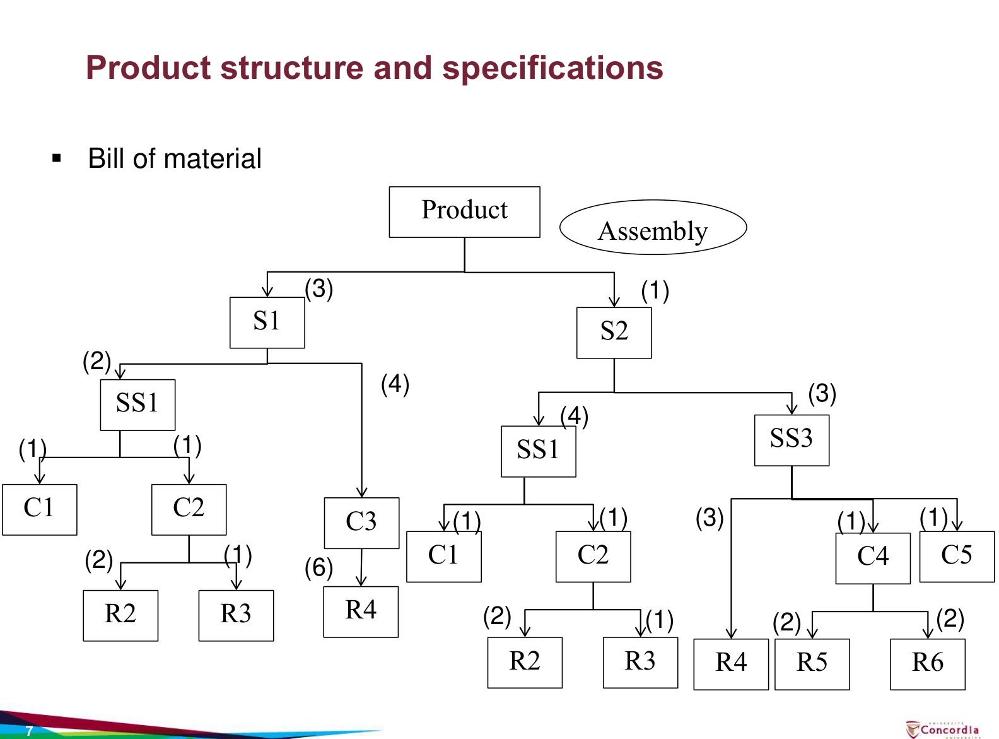

*Figure 1: Product structure and specifications, Lecture 2.0, slide 7.*

**How to read the tree:** each box is an item; the number in brackets on an arrow is **how many of the lower item one unit of the upper item needs**. S = sub-assembly, SS = sub-sub-assembly, C = component, R = raw material.

| Parent | Needs (quantity per parent) |
| :--- | :--- |
| Product | S1 (3), S2 (1) |
| S1 | SS1 (2), C3 (4) |
| S2 | SS1 (4), SS3 (3) |
| SS1 | C1 (1), C2 (1) |
| C2 | R2 (2), R3 (1) |
| C3 | R4 (6) |
| SS3 | R4 (3), C4 (1), C5 (1) |
| C4 | R5 (2), R6 (2) |

**Worked "explosion": how much R4 does one Product need?** Multiply the quantities along every path that ends in R4, then add the paths:

$$\underbrace{3 \times 4 \times 6}_{\text{Product}\to S1\to C3\to R4} + \underbrace{1 \times 3 \times 3}_{\text{Product}\to S2\to SS3\to R4} = 72 + 9 = 81 \text{ units of R4}$$

The same method gives SS1: $3 \times 2 + 1 \times 4 = 10$ per product, so C1 = 10, C2 = 10, R2 = 20 and R3 = 10. Notice that SS1, C1, C2, R2, R3 and R4 appear in **more than one branch**: common parts are exactly why MRP (Chapter 7) adds up requirements across the whole tree.

#### Concrete Industrial Example: Commercial Metal Bookcase
Suppose a company manufactures a standard office bookcase:

* **Level 0: Bookcase Assembly (Qty: 1)**
  * **Shelves (Qty: 3)** — *Manufactured in-house* (requires 3.0 sq ft sheet metal each)
  * **Legs (Qty: 4)** — *Manufactured in-house* (requires 2.5 ft raw steel angle each)
  * **Hardware Kit (Qty: 1)** — *Purchased from supplier*
    * Shelf Support Clips (Qty: 12)
    * Self-Tapping Screws (Qty: 16)

> **Why BOMs Matter to Industrial Engineers:**  
> The BOM directly powers the **Material Requirements Planning (MRP)** system. If sales forecasts 500 bookcases next month, the MRP algorithm multiplies the BOM nodes down to calculate exact sheet metal square footage and screw procurement orders.

---

## 4. Quantitative Economics: Cost-Volume & Break-Even Analysis

Every manufacturing engineer must balance **Fixed Costs** against **Variable Costs** to select the most profitable fabrication process.

### The Linear Cost Model
The total annual cost $TC$ to produce $X$ units is modeled by:
$$TC(X) = a \cdot X + b$$

Where:
* $b = \text{Fixed Cost } (FC)$: Expenses incurred before a single unit is made (machine purchase price, installation, factory floor space rent, custom tooling, dies, jigs).
* $a = \text{Variable Cost per unit } (VC)$: Expenses that scale directly with each physical unit manufactured (raw materials, operator labor wages, cutting tool wear, electricity).
* $X = \text{Production volume (units per year)}$.

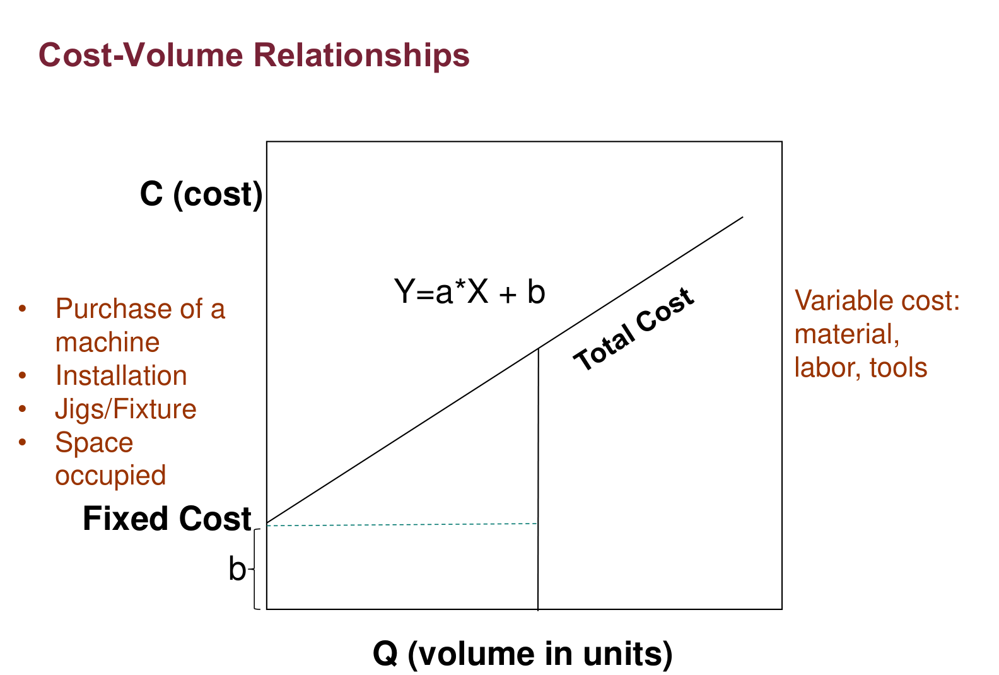

*Figure 2: Cost-volume relationships, Lecture 2.0, slide 10.*

**Reading the graph:** the horizontal line at height $b$ is the fixed cost, which is paid even at $Q = 0$ (machine purchase, installation, jigs and fixtures, space occupied, listed in orange on the slide). The total-cost line $Y = aX + b$ starts at $b$ and rises with slope $a$, the variable cost per unit (material, labour, tools). The vertical gap between the two lines at any volume is the total variable cost at that volume.

---

### Revenue-Based Break-Even Point (BEP)
When selling a manufactured item at selling price $P$ per unit, **Total Revenue** is:
$$TR(X) = P \cdot X$$

The **Break-Even Point** occurs where Total Revenue equals Total Cost:
$$P \cdot X = a \cdot X + b \implies X(P - a) = b$$

$$\mathbf{X_{BEP} = \frac{\text{Fixed Cost}}{P - a} = \frac{b}{P - a}}$$

The term $(P - a)$ is called the **Contribution Margin per unit** (the portion of selling price left over to pay off fixed debt after covering variable unit costs).

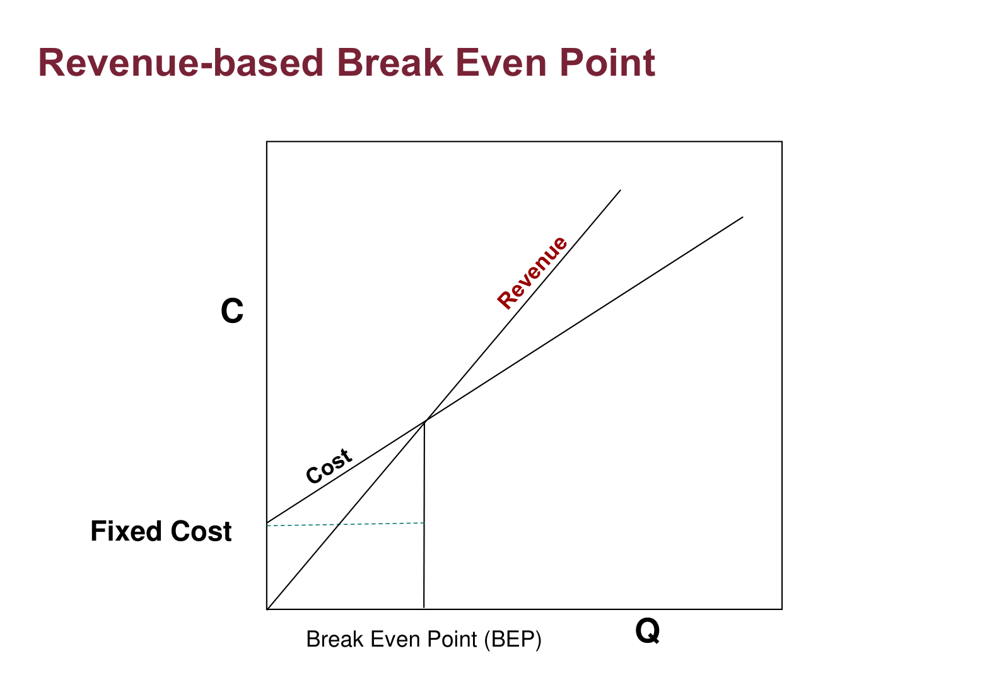

*Figure 3: Revenue-based break-even point, Lecture 2.0, slide 11.*

**Reading the graph:** the revenue line starts at the origin (no sales, no revenue) and is steeper than the cost line because $P > a$. To the left of the crossing, cost is above revenue (a loss, because fixed cost has not yet been recovered); to the right, revenue is above cost (profit). The crossing is the BEP: *the level of sales at which total revenue equals total cost*.

#### Example 1 (Direct from Lecture Slide 12):
* Fixed Cost ($b$) = $\$28,000$
* Variable Cost ($a$) = $\$100/\text{unit}$
* Selling Price ($P$) = $\$200/\text{unit}$

$$X_{BEP} = \frac{28,000}{200 - 100} = \frac{28,000}{100} = \mathbf{280 \text{ units}}$$

> **Managerial Rule**: If market demand is less than 280 units, the company should **not** invest in this production setup, because fixed capital will never be recovered.

---

### Multi-Process Comparison & Crossover Selection
In manufacturing, you rarely have only one process option. Typically, you choose between:
1. **Low Fixed Cost / High Variable Cost Process** (e.g., manual machining or 3D printing): Cheap to start, but slow and labor-heavy per unit.
2. **High Fixed Cost / Low Variable Cost Process** (e.g., progressive die stamping or automated casting): Requires massive tooling investment, but stamps out parts for pennies in seconds.

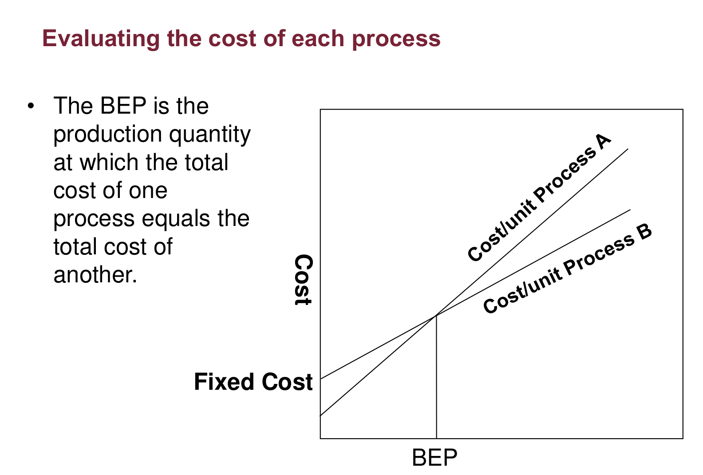

*Figure 4: Evaluating the cost of each process, Lecture 2.0, slide 13.*

**Reading the graph:** Process A has the lower fixed cost (its line starts lower) but the steeper slope (higher cost per unit); Process B starts higher but rises more slowly. The two lines cross at the BEP, *the production quantity at which the total cost of one process equals the total cost of another*. Left of the crossing A is cheaper; right of it B is cheaper. Choosing a process therefore reduces to **locating the expected demand relative to the crossing points**.

#### Example 2: The 3-Process Selection Problem (Lecture Slide 15)
A manufacturing plant evaluates three distinct processes to fabricate a metal bracket:

| Process | Annual Fixed Cost ($b$) | Variable Cost per Unit ($a$) |
| :---: | :---: | :---: |
| **Process A** | $\$110,000$ | $\$2.00$ |
| **Process B** | $\$80,000$ | $\$4.00$ |
| **Process C** | $\$75,000$ | $\$5.00$ |

#### Question A: If projected demand is $X = 10,000$ units/year, which process is optimal?
Calculate total cost for each:
* $TC_A(10,000) = 110,000 + 2(10,000) = \$130,000$
* $TC_B(10,000) = 80,000 + 4(10,000) = \mathbf{\$120,000}$  *(Lowest!)*
* $TC_C(10,000) = 75,000 + 5(10,000) = \$125,000$

$$\text{Decision at 10,000 units: Select } \mathbf{\text{Process B}}.$$

#### Question B: At what production volumes is each process preferred?
We equate cost functions pairwise to find the **Crossover Volumes**:

1. **Crossover between B and C**:
   $$TC_B = TC_C \implies 80,000 + 4X = 75,000 + 5X$$
   $$5X - 4X = 80,000 - 75,000 \implies \mathbf{X_{BC} = 5,000 \text{ units}}$$

2. **Crossover between A and B**:
   $$TC_A = TC_B \implies 110,000 + 2X = 80,000 + 4X$$
   $$4X - 2X = 110,000 - 80,000 \implies 2X = 30,000 \implies \mathbf{X_{AB} = 15,000 \text{ units}}$$

3. **Check Crossover between A and C** (to verify Process B is not dominated):
   $$110,000 + 2X = 75,000 + 5X \implies 3X = 35,000 \implies X \approx 11,667 \text{ units}$$
   Since $5,000 < 11,667 < 15,000$, all three processes have valid operational ranges!

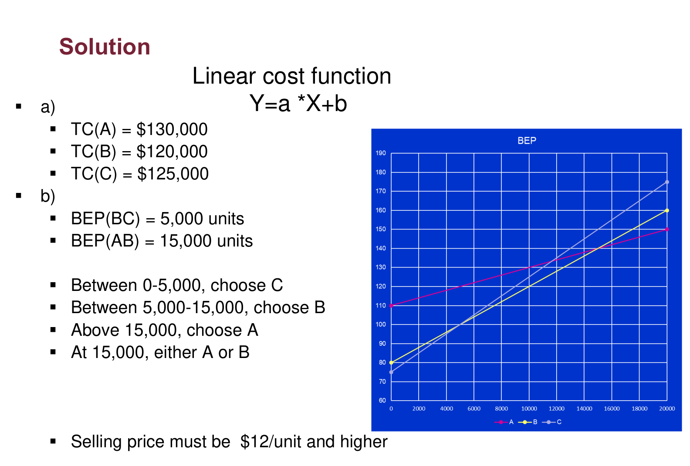

*Figure 5: Solution of the three-process example, Lecture 2.0, slide 17.*

**Reading the slide:** part (a) lists the three total costs at 10,000 units ($TC_A = \$130{,}000$, $TC_B = \$120{,}000$, $TC_C = \$125{,}000$, so B wins). Part (b) lists the two crossovers that matter, $BEP_{BC} = 5{,}000$ and $BEP_{AB} = 15{,}000$, and the decision ranges below. The plot on the right is the same linear cost function $Y = aX + b$ drawn for each process; the lowest line at each volume is the one to choose. The last bullet (the selling price must be at least $\$12$ per unit) is process B's total cost per unit at 10,000 units: $120{,}000 / 10{,}000 = \$12$.

#### Final Operational Selection Rules:
* For **$0 \le X < 5,000$ units**: Select **Process C** (minimal fixed commitment).
* For **$5,000 < X < 15,000$ units**: Select **Process B** (best balanced trade-off).
* For **$X > 15,000$ units**: Select **Process A** (low variable cost dominates).
* At **$X = 5,000$**: Either B or C (costs are identical at $\$100,000$).
* At **$X = 15,000$**: Either A or B (costs are identical at $\$140,000$).

---

## 5. Determining the Sequence of Operations

In manufacturing, operations cannot be scheduled at random. An industrial engineer determines the sequence of operations to optimize flow, maintain high precision, and minimize overall production costs.

### Three Core Sequencing Principles (Lecture Slide 18)

1. **Minimization of Material Handling**:
   * The part must be routed along the **shortest path without backtracking**.
   * Backtracking creates shop-floor congestion, increases transport time, and elevates the risk of in-transit part damage.
2. **No Succeeding Operation Adversely Affects Previous Operations**:
   * Subsequent operations must never degrade previously finished surfaces.
   * Avoid leaving **burrs, debris, chips, or scratches** on critical surfaces that have already been faced, turned, or ground.
   * Rough, bulk material removal always precedes fine precision finishing.
3. **Performing as Many Operations on Each Machine as Possible**:
   * Completing multiple cuts in a single setup or machine chucking achieves **close tolerances and assures quality**.
   * Every time a workpiece is unclamped and transferred to another machine, human handling and fixture misalignment introduce tolerance stacking errors.

---

### Sequence of Operations for a Steel Shaft (Lecture Slide 19)

Consider the standardized 8-step sequence required to manufacture a stepped steel shaft from raw bar stock (raw stock → steps 1 to 8 in order → finished shaft):

| Step | Operation | Machine / Tool | Primary Purpose |
| :---: | :--- | :--- | :--- |
| **1** | **Cutting Stock** | Horizontal Bandsaw | Cuts raw extruded bar stock to gross blank length plus machining allowance. |
| **2** | **Facing** | Engine Lathe | Cleans and squares the ends to establish a flat reference datum plane. |
| **3** | **Turning** | Engine Lathe | Rotates the workpiece while feeding a cutting tool linearly to reduce diameters to stepped sections. |
| **4** | **Drilling** | Lathe or Drill Press | Creates internal axial center holes, mounting holes, or transverse pin openings. |
| **5** | **Grooving** | Engine Lathe | Cuts narrow circumferential recesses for retaining snap-rings, O-rings, or thread reliefs. |
| **6** | **Heat Treatment** | Hardening Furnace / Quench | Modifies internal crystalline structure to achieve specified hardness and strength. |
| **7** | **Grinding** | Cylindrical Grinder | Removes micro-distortions caused by heat treatment; achieves ultra-tight tolerances and smooth bearing finish. |
| **8** | **Surface Finishing** | Coating / Plating / Painting | Applies a protective surface coating to prevent rust, corrosion, and environmental degradation. |

> **Why Heat Treatment Precedes Grinding**:
> Heat treatment causes thermal expansion, quenching stresses, and slight dimensional warpage. Therefore, precision cylindrical grinding is performed *after* heat treatment to correct any distortion and achieve final bearing tolerances on the hardened steel.

---

### The Operation Process Chart (Lecture Slide 20)

An **Operation Process Chart** is a standardized graphical overview displaying the chronological sequence of all manufacturing operations and inspections required to produce an assembly (such as a check valve).

* **Two Standard ASME Symbols**:
  * **Circle ($\bigcirc$)**: Represents an **Operation** — an intentional physical, chemical, or assembly transformation (e.g., cutting, turning, drilling, welding).
  * **Square ($\square$)**: Represents an **Inspection** — a verification of quality, dimensions, or technical specifications.
* **Assembly Hierarchy**: The chart displays main components along the right vertical backbone, with subassemblies feeding chronologically into the main trunk from left to right until final assembly.

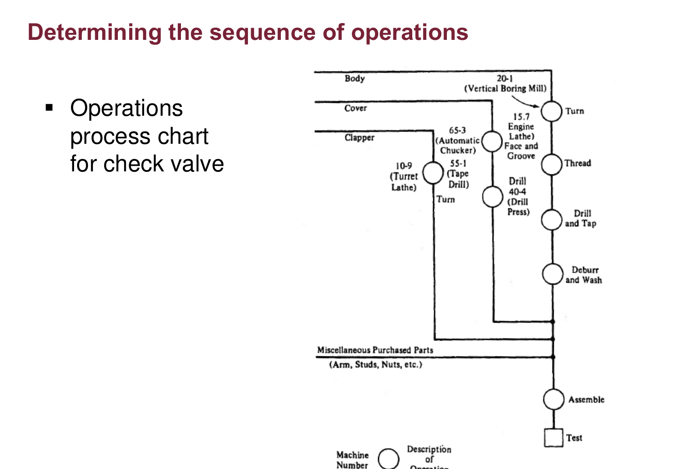

*Figure 6: Operations process chart for a check valve, Lecture 2.0, slide 20.*

**Reading the chart:** each vertical line is one component (body, cover, clapper…), read from top to bottom in the order its operations happen. Circles are operations and squares are inspections, each labelled with its machine. Where a line joins the main vertical line at the right, that component is **assembled** into the valve. The chart shows at a glance every operation, every inspection and the point where each part enters the assembly, which is what process engineers need to plan machines, tooling and material flow.

---

## 6. Classification of Industrial Processes

Every manufacturing process in the INDU 211 curriculum fits into the following master classification (Slide 21):

| # | Process family | # | Process family |
| :---: | :--- | :---: | :--- |
| 1 | Refining and alloying | 5 | Welding and joining |
| 2 | Casting | 6 | Assembly |
| 3 | Metal forming | 7 | Finishing |
| 4 | Metal cutting | 8 | 3D printing (additive manufacturing) |

---

### A. Refining & Alloying (Lecture Slide 22)

* **Refining**:
  * Transforms raw mineral metal ore into useful engineering metal by removing impurities.
  * **Iron Ore $\to$ Steel**: Raw iron ore is smelted in a **Blast Furnace** to produce molten pig iron, which is then converted into steel in a **Steel Mill** using processes such as:
    * *Open Hearth*
    * *Basic Oxygen Furnace (BOF)*
    * *Electric Arc Furnace*
  * Different types and grades of steel are produced by controlling furnace temperature and chemical composition.
* **Alloying**:
  * Metals from primary extraction often lack the specific physical properties required for engineering design.
  * Involves **combining metals (alloys)** or adding elements (e.g., carbon, manganese, chromium, nickel to iron) to induce metallurgical transformations that improve **hardness, tensile strength, corrosion resistance, and workability**.
  * Supported by **heat treating** to adjust the internal crystalline structure.

---

### B. Casting (Lecture Slide 23)

* **Core Concept**: Liquid molten metal is poured into a mold cavity matching the geometry of the part, allowed to solidify, and then extracted.
* **Primary Objective**: Used to obtain an **approximate shape** directly from molten metal in a single step, especially for complex geometries.
* **Mold Design is Critical**: The mold must ensure smooth molten flow and account for metal shrinkage during cooling.
* **Two Main Mold Types**:
  1. **Sand Casting**:
     * Molten metal is poured into an expendable mold made of compacted sand.
     * *Advantage*: Low tooling and setup cost; capable of casting very large, complex parts.
     * *Disadvantage*: Mold is destroyed after each pour; expensive and slow for high production volume.
  2. **Permanent Molds (Die Casting)**:
     * Molten metal is poured or injected into reusable high-strength metal molds (dies).
     * *Advantage*: Fast cycle times, excellent dimensional accuracy, and smooth surface finishes.
     * *Trade-off*: High initial tooling cost; justified strictly for high production volumes.

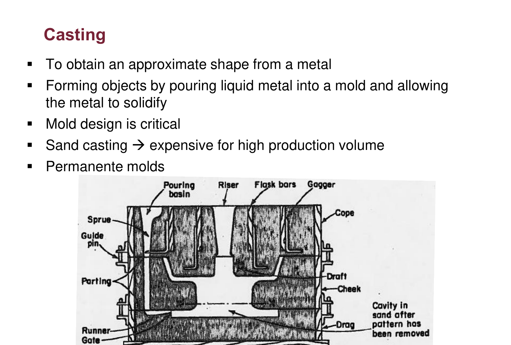

*Figure 7: Casting, Lecture 2.0, slide 23.*

**Reading the mold cross-section:** metal is poured into the **pouring basin**, runs down the **sprue** and along the **runner** to the **gate**, and fills the **mold cavity** (the shape left in the sand when the pattern was removed). The **riser** is a reservoir that feeds extra metal into the casting as it shrinks while solidifying. The mold is split into a top half (**cope**) and bottom half (**drag**) so the pattern can be removed. The sand mold is broken to release the part, which is why sand casting is slow and costly at high volume.

---

### C. Metal Forming (Hot vs. Cold Working) (Lecture Slides 24–28)

* **Definition**: Reshaping solid metal by applying mechanical pressure to deform it plastically into a desired shape and/or improve its physical properties.

| Process Type | Operating Temperature | Structural & Mechanical Effects | Practical Characteristics |
| :--- | :--- | :--- | :--- |
| **Hot Working** | **Above recrystallization temperature** | Metal is ductile; no strain hardening occurs | Requires lower forming forces; ideal for large deformations and unusual shapes. |
| **Cold Working** | **Below recrystallization temperature** (Room Temp) | Induces **strain hardening** (increases strength and hardness) | Holds **close dimensional tolerances**; produces a **smooth, scale-free surface finish**. |

#### Core Metal Forming Operations:
1. **Rolling (Slide 25)**:
   * Metal slab or billet is passed between rotating cylindrical rolls to compress thickness and elongate or widen the material.
   * *Hot Rolling*: Produces heavy plates, I-beams, and structural rails.
   * *Cold Rolling*: Produces thin, high-strength sheet metal with smooth finishes.
2. **Wire Drawing (Slide 26)**:
   * A wire or rod is reduced in cross-sectional diameter by being **pulled (drawn) through a tapered die**.
3. **Forging (Slide 27)**:
   * Metal is shaped through a single blow or a series of **intermittent applications of compressive pressure** (hammering or pressing), as in the traditional hammering of a horseshoe or modern forging of engine connecting rods.
4. **Extrusion (Slide 27)**:
   * Compressing a metal billet beyond its elastic limit and forcing it to **flow through the opening of a shaped die** (analogous to squeezing toothpaste from a tube), producing long profiles with uniform cross-sections.
5. **Bending (Slide 28)**:
   * Applying mechanical force to permanently distort sheet metal along an axis to a preconceived angular shape.
6. **Drawing and Stretching (Slide 28)**:
   * Producing **seamless hollow vessels** (e.g., beverage cans, sinks, pots) by applying pressure with a punch to force sheet metal into a die cavity.

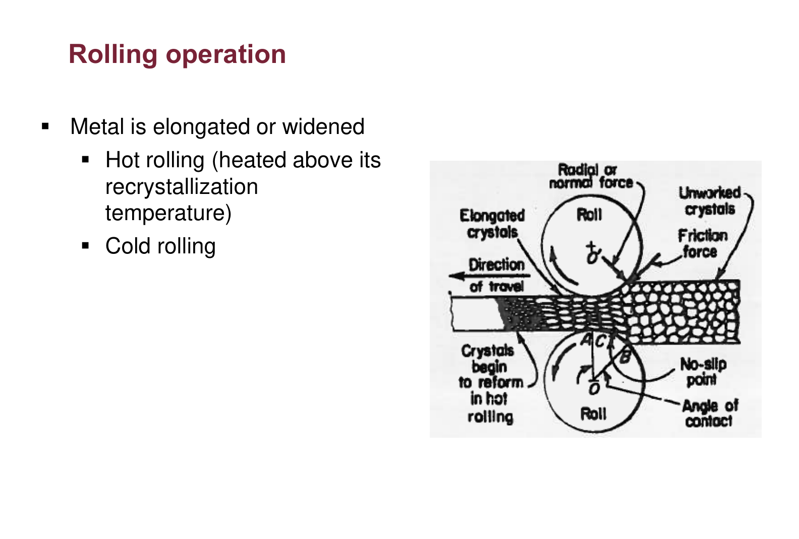

*Figure 8: Rolling operation, Lecture 2.0, slide 25.*

**Reading the rolling diagram:** the stock enters between two counter-rotating rolls and leaves thinner and longer. The inset shows why hot rolling changes properties: **elongated crystals** form as the metal is squeezed, and above the recrystallization temperature new equiaxed **crystals begin to reform** (hot rolling). Below it (cold rolling) the grains stay elongated, which strengthens the metal and gives a better finish and tolerance.

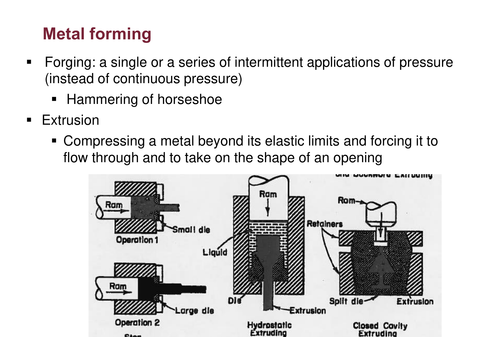

*Figure 9: Metal forming (forging and extrusion), Lecture 2.0, slide 27.*

**Reading the figure:** the left sketches show **forging**: a ram presses the heated blank into shaped dies in one or more intermittent blows (open-die hammering, closed-die forging). The right sketches show **extrusion**: a ram pushes the billet so it flows through a die opening, like toothpaste, making a long part with the die's cross-section (direct, hydrostatic and closed-cavity variants).

---

### D. Metal Cutting & Machining (Lecture Slides 29–31)

Material removal operations that shape parts by shearing away excess material into chips or cutting along edges.

#### 1. Shearing Operations (Slide 29)
Cutting sheet metal by applying pressure between two sharp cutting edges:
* **Blanking**: The piece punched out is the **desired part**; the surrounding strip is scrap.
* **Punching**: The piece punched out is **scrap (the hole)**; the surrounding sheet is the desired part.
* Other shearing variants: **Parting** (separating sheets), **nibbling** (overlapping punches to cut contours), and straight-line shearing.

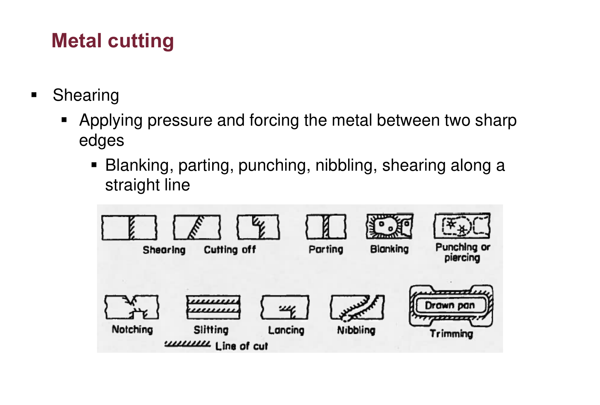

*Figure 10: Shearing operations, Lecture 2.0, slide 29.*

**Reading the figure:** each small sketch is one shearing operation on sheet stock; the shaded region is what the tool removes. Compare **blanking** (the removed piece is the product) with **punching/piercing** (the removed piece is scrap and the hole is the feature), then **notching** (a cut at the edge), **slitting** (a straight cut that does not remove material), **lancing** (a partial cut that leaves a tab), **nibbling** (a contour built from overlapping small punches), and **trimming** (removing excess from a drawn part).

#### 2. Machining Operations (Slides 30–31)

| Operation | Motion & Kinematics | Tool / Cutting Action | Typical Applications |
| :--- | :--- | :--- | :--- |
| **Turning** (Slide 30) | Workpiece **rotates**; cutting tool feeds linearly | Single-point cutting tool on a lathe | Cylindrical parts, stepped shafts, facing ends, taper turning. |
| **Drilling** (Slide 30) | Rotating drill bit feeds axially into workpiece | Multi-flute twist drill | Opening, enlarging, or finishing cylindrical internal holes. |
| **Shaping** (Slide 30) | **Workpiece is stationary**; cutting tool reciprocates | Single-point reciprocating tool | Cutting flat surfaces, slots, and keyways on small to medium parts. |
| **Planing** (Slide 30) | **Tool is stationary**; workpiece reciprocates | Single-point stationary tool | Cutting long, flat surfaces on massive parts (e.g., machine tool beds). |
| **Milling** (Slide 31) | Rotating multi-tooth cutter; workpiece feeds past it | Revolving cutter taking intermittent cuts | Flat surfaces, steps, keyways, pockets, complex profiles. |
| **Broaching** (Slide 31) | Multi-tooth straight bar is **pushed or pulled in 1 pass** | Stepped broach tool (does NOT revolve) | Internal keyways, splines, square or hexagonal holes. |
| **Sawing & Filing** (Slide 31) | Linear or circular blade action | Saw blade or abrasive file teeth | Cutting stock to raw length; removing rough burrs. |
| **Grinding** (Slide 31) | High-speed bonded abrasive wheel removes micro-chips | Abrasive grinding wheel | Finishing very hard or heat-treated metals to ultra-close tolerances. |

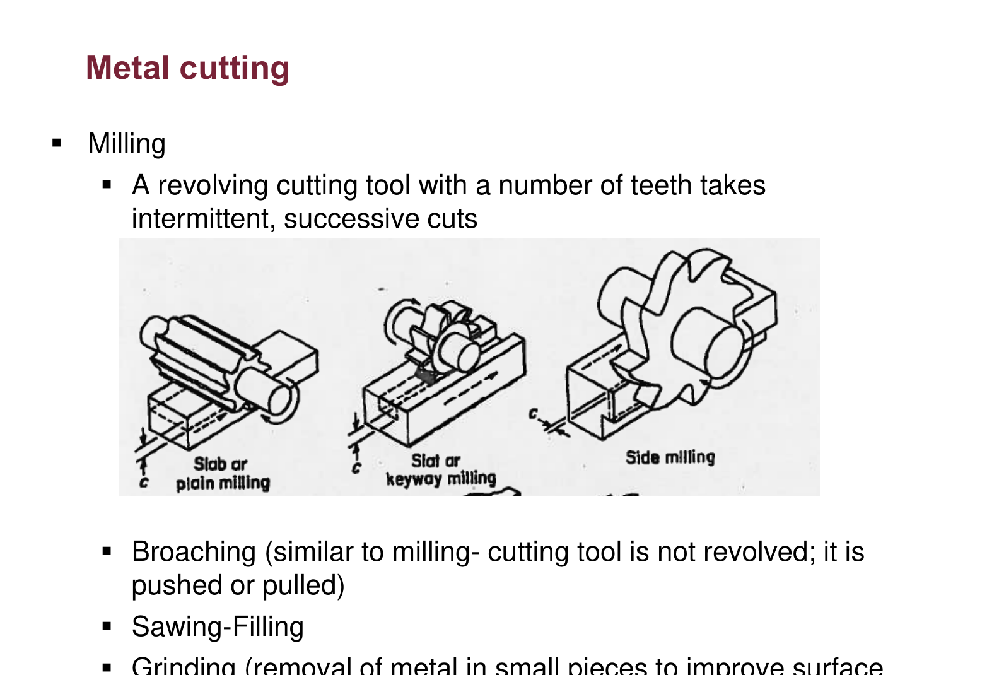

*Figure 11: Metal cutting (milling), Lecture 2.0, slide 31.*

**Reading the sketches:** in every milling set-up the **cutter revolves** and the workpiece feeds past it, so each tooth takes a short intermittent cut. Slab or plain milling produces flat surfaces, slot or keyway milling cuts a channel, and side milling machines a vertical face. This is the difference from broaching (listed on the same slide), where a toothed bar is pushed or pulled once and does not revolve.

> **High-Yield Exam Distinction: Shaping vs. Planing**:
> * **Shaping**: Workpiece is **clamped stationary** on the table; the cutting tool reciprocates back and forth (best for small to medium parts).
> * **Planing**: The cutting tool is **held stationary**; the heavy machine table carrying the workpiece reciprocates underneath it (best for massive parts).

---

### E. Welding & Joining (Lecture Slide 32)

* **Definition**: Two pieces of the same metal are bonded together through the application of **heat, pressure, or both**.
* **Major Welding Processes**:
  * **Electric Arc Welding**: Uses an electric arc between an electrode and base metal to generate intense heat.
  * **Resistance Welding**: Uses high electrical current and mechanical pressure (e.g., spot welding for automobile sheet metal).
  * **Beam Welding**: Uses a highly focused electron beam or laser beam for narrow, deep welds.
  * **Thermit Welding**: Uses an exothermic chemical reaction (iron oxide + aluminum) to produce molten steel for joining heavy components (e.g., railroad tracks).
  * **Pressure Welding**: Joins metals primarily through massive compressive force.
  * **Gas Welding**: Uses a flame from burning fuel gas (e.g., oxy-acetylene) to melt the joint.
* **Brazing and Soldering**:
  * Base metals are **not melted**. A filler metal with a lower melting temperature is heated and flows into the tight joint gap by capillary action.
  * *Brazing*: Uses higher-melting-point filler alloys ($> 450^\circ\text{C}$).
  * *Soldering*: Uses lower-melting-point filler alloys ($< 450^\circ\text{C}$, common in electronics).

---

### F. 3D Printing / Additive Manufacturing (Lecture Slide 33)

* Constructs 3D physical parts **layer-by-layer** directly from digital CAD computer models.
* **Contrasted with Subtractive Machining**:
  * Generates zero chip waste.
  * Eliminates the need for expensive dedicated tooling, dies, or molds.
  * Ideal for rapid prototyping, highly complex internal geometries, and customized low-volume production.

---

## 7. Ancillary Functions: Tooling, Costs, Maintenance & Packaging

Beyond primary shaping processes, manufacturing engineers oversee critical support functions (Slides 34–36):

### Tool, Jig & Fixture Design (Lecture Slides 34–36)

* **Tool Design (Slide 35)**:
  * Designing cutting tools, punches, and dies for the most effective, safe, and productive operation while minimizing tool wear and cycle time.
* **Jig vs. Fixture Design (Slide 36 - High-Yield Exam Question!)**:

| Device | Definition & Core Function | Guides Cutting Tool? | Typical Example |
| :--- | :--- | :---: | :--- |
| **Fixture** | A production device used to **hold and locate** a workpiece in a fixed position. | **NO** (Machine setup determines path) | Milling machine vise, 3-jaw lathe chuck, welding fixture. |
| **Jig** | A production device that **holds and locates** the workpiece **AND guides the cutting tool**. | **YES** (Equipped with tool guide bushings) | Drilling jig for locating and guiding drill bits into hole patterns. |

> **Memory Rule**:
> * A **Fixture** only *fixes* (holds and locates) the part.
> * A **Jig** *guides* the cutting tool into the workpiece.

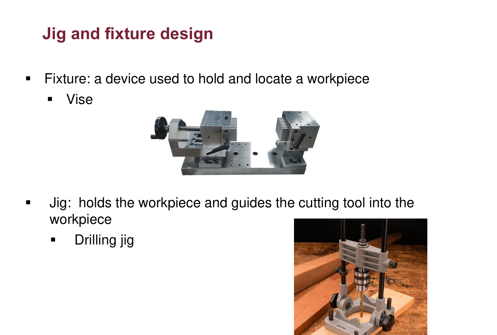

*Figure 12: Jig and fixture design, Lecture 2.0, slide 36.*

**Reading the photos:** the top photo is a machine **vise**, the classic fixture: it clamps and locates the part, but the machine's own motion guides the cutter. The bottom photo is a **drilling jig**: besides clamping the part, it carries hardened bushings that the drill passes through, so every hole lands in the same place without measuring or marking.

---

### Cost Estimating Breakdown (Lecture Slide 34)

A manufacturing engineer must accurately forecast product unit cost across three fundamental elements:
1. **Material Cost**: Direct cost of raw stock, bar stock, castings, sheet metal, and standard bought-out components.
2. **Labor Cost**: Direct wages and benefits paid to machine operators and assembly workers.
3. **Overhead (Indirect Costs)**: Expenses necessary to keep the manufacturing plant running, including:
   * Factory rent, building depreciation, and property taxes.
   * Electricity, water, heating, and compressed air utilities.
   * Supervisory salaries, quality control, maintenance staff, and tooling amortization.

$$\text{Total Product Cost} = \text{Direct Material} + \text{Direct Labor} + \text{Factory Overhead}$$

---

### Maintenance Systems Design (Lecture Slide 34)

Plant efficiency depends on keeping machinery operational through two distinct maintenance strategies:

1. **Preventive Maintenance (PM)**:
   * Proactive, scheduled inspections, lubrication, adjustments, and component replacements performed before breakdown occurs.
   * **Application**: Strictly assigned to **exceptionally important machines (bottlenecks)** whose unplanned failure would shut down the entire production line.
2. **Emergency / Breakdown Maintenance**:
   * Reactive "run-to-failure" strategy: machines are operated until a breakdown occurs, then repaired.
   * **Application**: Assigned to **machines that break down only occasionally** or non-critical equipment with redundant backups, where the cost of routine preventive servicing would exceed the impact of occasional repairs.

---

### Packaging Systems (Lecture Slide 34)

* **Core Purpose**: To protect the final finished product during warehouse storage and transit against physical impact, vibration, moisture, and corrosion.
* **Engineering Evaluation**: The engineer analyzes **various packaging design options along with their respective costs** to select a packaging system that prevents damage without adding unnecessary shipping weight or expense.
