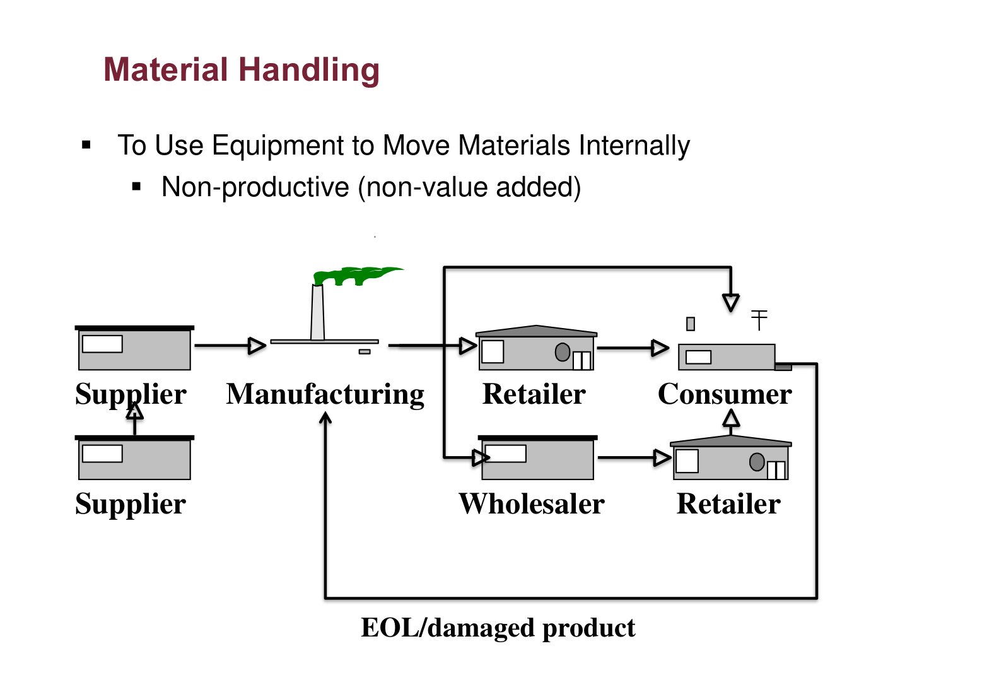
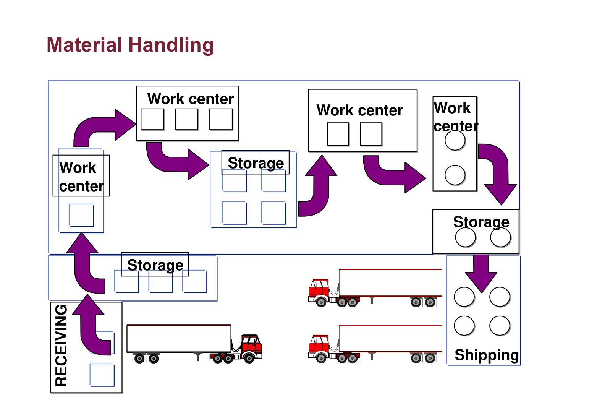
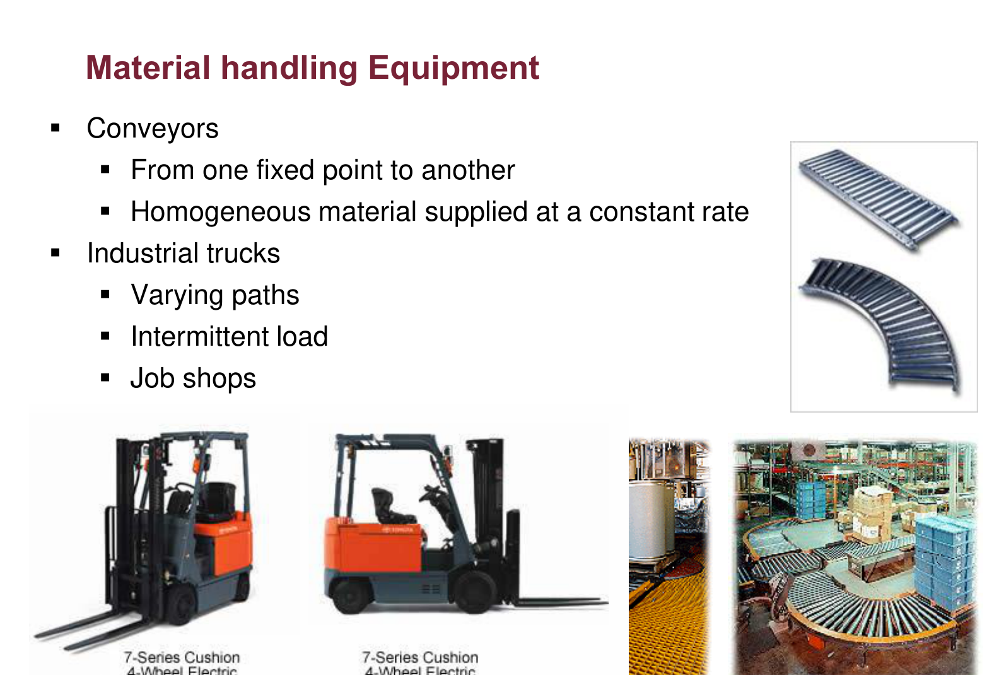
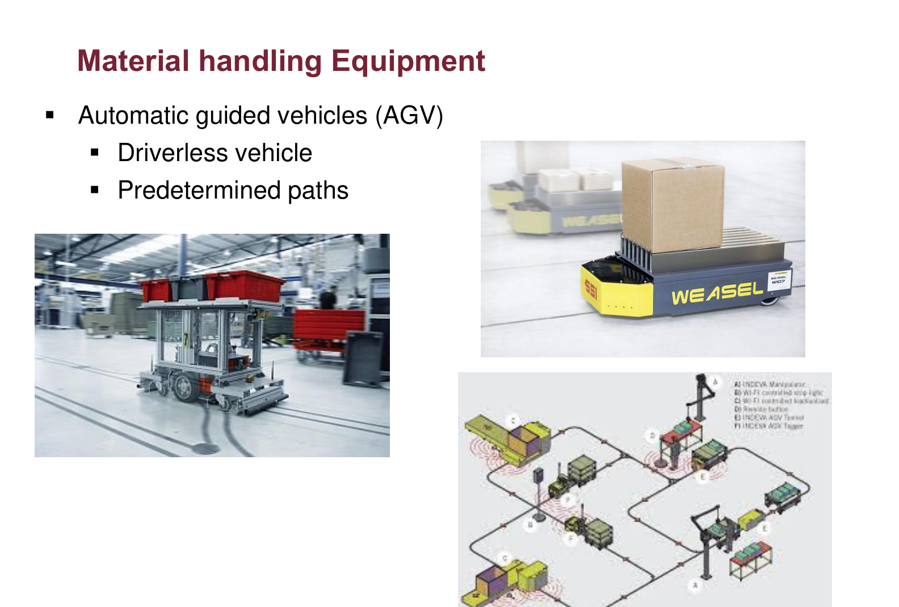
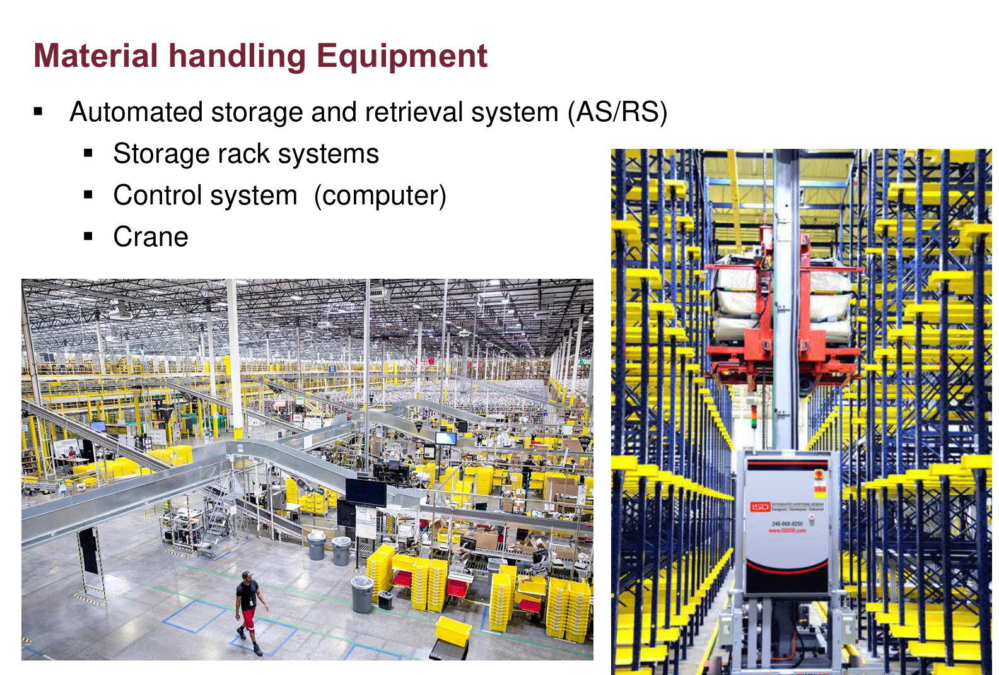
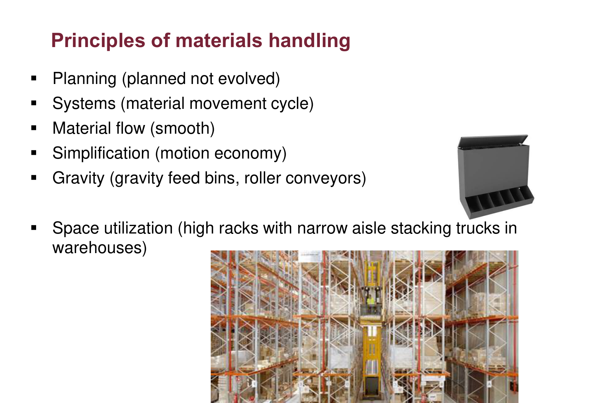
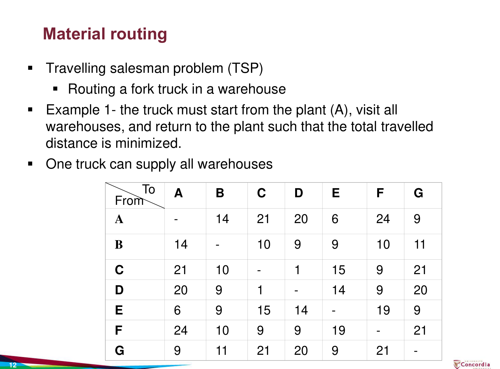
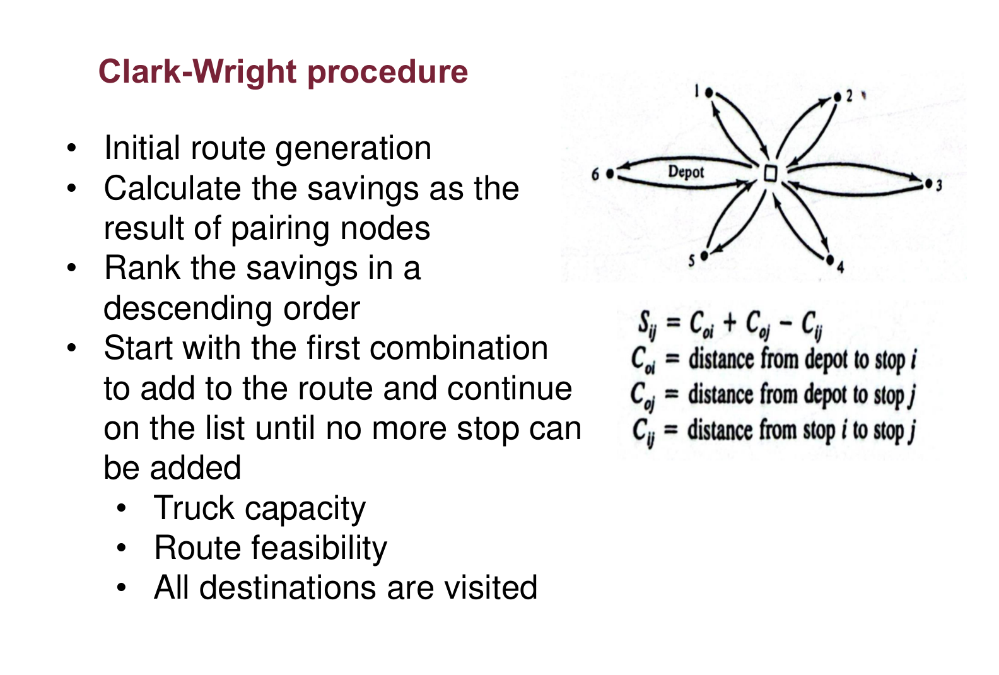
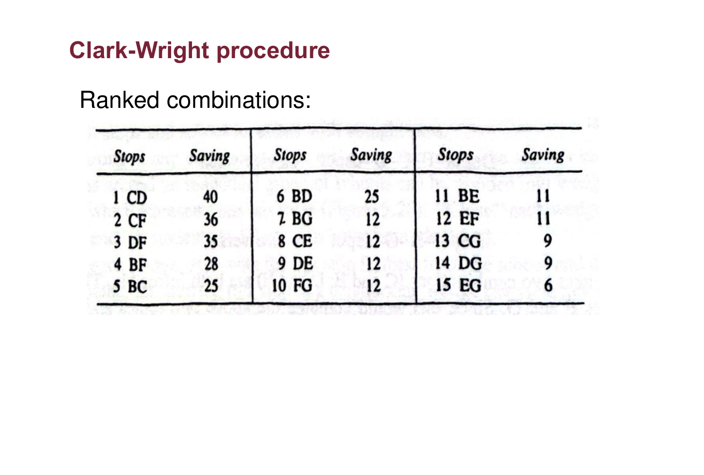

# INDU 211 · Comprehensive Topic Guide (Part 4)
# Chapter 5: Material Handling, Distribution & Routing
**Concordia University · Department of Mechanical, Industrial & Aerospace Engineering (MIAE)**

*Built on the teacher's Lecture 5.0 slides, with depth from the course textbook (Hicks, Chapter 5: Material Handling, Distribution, and Routing).*

---

## Table of Contents
1. [Why Material Handling Matters](#1-why-material-handling-matters)
2. [Material Handling Equipment](#2-material-handling-equipment)
3. [Principles of Material Handling](#3-principles-of-material-handling)
4. [Quantitative Material Handling Models (Turner §5.3)](#4-quantitative-material-handling-models-turner-53)
5. [Routing: The Travelling Salesman Problem (TSP)](#5-routing-the-travelling-salesman-problem-tsp)
6. [Vehicle Routing and the Clark-Wright Savings Method](#6-vehicle-routing-and-the-clark-wright-savings-method)
7. [Exam Checklist](#7-exam-checklist)

---

## 1. Why Material Handling Matters

Material handling means **using equipment to move materials** inside and between facilities. It is **non-productive (non-value-added)**: moving a part does not change it, yet it costs money, time and space. Chapter 4 already told us that material handling is **30% to 95% of production cost**, which is why layout and handling are designed together.

*Figure 1: Material handling, Lecture 5.0, slide 3.*

**Reading the figure:** material moves from **suppliers** to **manufacturing**, then to a **wholesaler**, a **retailer** and finally the **consumer**. The arrow returning from the consumer is the reverse flow of **end-of-life or damaged product**. Every arrow is a handling and transport step that adds cost but no value.

*Figure 2: Material handling within a facility, Lecture 5.0, slide 4.*

**Reading the figure:** inside the plant, material arrives at **receiving**, goes to **storage**, travels between **work centres** and intermediate storage, and leaves through **shipping** onto trucks. The purple arrows are the internal moves an industrial engineer tries to shorten, combine or eliminate.

> **From the textbook (Turner et al., §5.1):** material movement occurs *any time* a product or part moves from one place to another, and it usually accounts for a large share of the cost of producing the product. Reducing the number and length of moves is one of the cheapest ways to cut cost.

---

## 2. Material Handling Equipment

| Equipment | What it does | Typical use |
| :--- | :--- | :--- |
| **Conveyors** | Move homogeneous material from one **fixed point** to another at a constant rate | Assembly lines, parcel sorting |
| **Industrial trucks** (forklifts) | Move loads along **varying paths**, intermittently | Job shops, warehouses |
| **Cranes and hoists** | Overhead lifting of heavy loads | Steel mills, heavy assembly |
| **Containers and racks** | Store and handle bulk material; better use of space | Pallets, bins, carts |
| **Elevators and lifts** | Vertically raise or lower material; fixed location | Multi-floor plants |
| **Automatic guided vehicles (AGV)** | Driverless vehicles on predetermined paths | Automated plants, hospitals |
| **AS/RS** (automated storage and retrieval) | Storage racks + computer control + crane | High-density warehouses |

*Figure 3: Conveyors and industrial trucks, Lecture 5.0, slide 5.*

**Reading the slide:** the roller conveyors (top right) fix the path, which suits steady, identical loads. The forklifts (bottom) can go anywhere with intermittent loads, which suits job shops where every order takes a different route. **The choice of equipment follows the layout**: product layouts use conveyors, process layouts use trucks.

*Figure 4: Automatic guided vehicles, Lecture 5.0, slide 8.*

**Reading the slide:** AGVs are driverless carts that follow predetermined paths (wires, tape or laser navigation). The layout sketch (bottom right) shows the guide paths connecting stations: flexible like trucks, but automated like conveyors.

*Figure 5: Automated storage and retrieval system (AS/RS), Lecture 5.0, slide 9.*

**Reading the photos:** tall racks with narrow aisles and a computer-controlled crane that stores and retrieves loads. AS/RS trades a large investment for **space utilisation** (building up, not out) and fast, accurate picking.

---

## 3. Principles of Material Handling

*Figure 6: Principles of materials handling, Lecture 5.0, slide 10 (continued on slide 11).*

| Principle | Meaning | Example |
| :--- | :--- | :--- |
| **Planning** | Handling is planned, not left to evolve | Handling plan drawn with the layout |
| **Systems** | Treat material movement as a cycle from receiving to shipping | Integrated receiving–storage–production–shipping |
| **Material flow** | Keep flow smooth | Avoid back-tracking and cross-traffic |
| **Simplification** | Motion economy: eliminate, combine, simplify moves | Deliver straight to the point of use |
| **Gravity** | Use gravity when possible | Gravity-feed bins, roller conveyors on a slope |
| **Space utilisation** | Use the cube, not just the floor | High racks with narrow-aisle stacking trucks |
| **Unit size** | Move the largest practical accumulated load | Pallets, containers |
| **Automation** | Use powered and automated equipment where it pays | Powered conveyors, automatic pallet stackers |
| **Equipment selection** | Choose based on all aspects of the material and move | Weight, shape, frequency, distance |
| **Standardisation** | Standard equipment and load sizes | Standard pallets and containers |
| **Adaptability** | Equipment that can do a variety of tasks | Variable-speed conveyors |
| **Maintenance** | Plan preventive and emergency maintenance | Scheduled conveyor servicing |
| **Safety** | Protect the operator | Guarding, safe stacking heights |

> **Exam tip:** questions often give an example and ask which principle it illustrates. Gravity-feed bins and roller conveyors → **gravity**; pallets → **unit size**; high racks → **space utilisation**; "planned, not evolved" → **planning**.

---

## 4. Quantitative Material Handling Models (Turner §5.3)

While the lecture slides introduce material handling qualitatively, the course textbook (*Turner, Mize, Case & Nazemetz*, §5.3) establishes the rigorous quantitative mathematical models that industrial engineers use to size fleets of handling equipment (such as AGVs) and analyze conveyor capacity.

---

### A. Automated Guided Vehicle (AGV) Fleet Sizing Model

To determine how many automated guided vehicles ($N_v$) are required to support a production schedule without starving workstations, we balance the **total system workload** against the **available operating time per vehicle**.

#### 1. Delivery Cycle Time ($T_c$)
The time required for an AGV to complete one full pickup-and-delivery cycle consists of four distinct components:

$$T_c = T_{\text{load}} + \frac{L_d}{v_c} + T_{\text{unload}} + \frac{L_e}{v_c}$$

Where:
* $T_c$ = Total delivery cycle time (min/delivery)
* $T_{\text{load}}$ = Time required to load the vehicle at the pickup station (min)
* $L_d$ = Travel distance loaded from pickup to destination (m or ft)
* $v_c$ = Vehicle travel speed (m/min or ft/min)
* $T_{\text{unload}}$ = Time required to unload the vehicle at the dropoff station (min)
* $L_e$ = Travel distance empty from previous dropoff to next pickup (m or ft)

#### 2. Hourly Workload ($WL$)
If the facility generates delivery requests across multiple delivery loops $i = 1, 2, \dots, m$, with demand rate $D_i$ (deliveries per hour) on loop $i$:

$$WL = \sum_{i=1}^{m} D_i \times T_{ci} \quad (\text{minutes per hour})$$

#### 3. Available Vehicle Time & Traffic Factor ($T_{\text{avail}}$)
In an industrial environment, an AGV cannot operate for 100% of the 60 minutes in an hour due to battery recharging, blocking at intersections, queueing behind other vehicles, and unexpected breakdowns. The net available time per vehicle per hour is:

$$T_{\text{avail}} = 60 \times A \times TF \quad (\text{min/hr per vehicle})$$

Where:
* $A$ = **Vehicle Availability** (operational uptime proportion, e.g., $0.90$ to $0.98$)
* $TF$ = **Traffic Factor** ($0 < TF \le 1.0$), accounting for delays at guide-path intersections, passing conflicts, and waiting for personnel. Typical values range from $0.85$ to $0.95$.

#### 4. Fleet Sizing Formula
The theoretical number of AGVs is the workload divided by available time. Because a fractional vehicle cannot be deployed, we take the ceiling (round up to the next whole integer):

$$N_v = \left\lceil \frac{WL}{T_{\text{avail}}} \right\rceil = \left\lceil \frac{\sum D_i T_{ci}}{60 \times A \times TF} \right\rceil$$

> **Worked Numerical Example (Turner §5.3):**
> An automated assembly plant requires $D = 24$ pallet transfers per hour between receiving and the main assembly line.
> * Loaded travel distance: $L_d = 120\text{ m}$
> * Empty return travel distance: $L_e = 90\text{ m}$
> * AGV travel speed: $v_c = 40\text{ m/min}$
> * Pickup loading time: $T_{\text{load}} = 1.25\text{ min}$
> * Dropoff unloading time: $T_{\text{unload}} = 1.00\text{ min}$
> * System availability: $A = 0.95$, Traffic congestion factor: $TF = 0.90$
>
> **Step 1: Calculate cycle time per delivery:**
> $$T_c = 1.25 + \frac{120}{40} + 1.00 + \frac{90}{40} = 1.25 + 3.00 + 1.00 + 2.25 = 7.50\text{ min/delivery}$$
>
> **Step 2: Calculate total system workload per hour:**
> $$WL = 24\text{ deliveries/hr} \times 7.50\text{ min/delivery} = 180.0\text{ min/hr}$$
>
> **Step 3: Calculate available operating time per vehicle:**
> $$T_{\text{avail}} = 60 \times 0.95 \times 0.90 = 51.30\text{ min/hr per AGV}$$
>
> **Step 4: Determine fleet size:**
> $$N_v = \left\lceil \frac{180.0}{51.30} \right\rceil = \lceil 3.509 \rceil = \mathbf{4\text{ AGVs}}$$
> *Conclusion:* Exactly 4 automated guided vehicles must be purchased and scheduled. 3 vehicles would provide only $3 \times 51.3 = 153.9$ minutes of capacity, failing to meet the required 180 min/hr workload.

---

### B. Conveyor System Analysis & Delivery Rates

For fixed-path continuous conveyors (roller, belt, or overhead monorail carriers), the textbook defines two core operating metrics:

1. **Carrier Delivery Rate ($R_d$):**
   $$R_d = \frac{v_c}{s_c} \quad (\text{carriers per minute})$$
   where $v_c$ is conveyor line speed (m/min) and $s_c$ is the center-to-center spacing between carriers or hooks (m).

2. **Total Parts Delivery Rate ($R_f$):**
   If each carrier holds $n_p$ parts:
   $$R_f = n_p \times R_d = n_p \frac{v_c}{s_c} \quad (\text{parts per minute})$$

3. **Station Passage / Clearance Time ($T_p$):**
   The time a carrier of length $L_c$ spends passing a fixed station point:
   $$T_p = \frac{L_c}{v_c}$$
   This sets the strict upper bound on manual loading/unloading without stopping the conveyor line.

---

## 5. Routing: The Travelling Salesman Problem (TSP)

**Problem:** one vehicle leaves a depot (plant A), visits every location exactly once, and returns, so that the **total distance is minimised**. Example: routing a forklift through a warehouse, or one truck supplying all warehouses.

*Figure 7: Material routing (TSP example 1), Lecture 5.0, slide 12.*

**Reading the matrix:** row = from, column = to. The matrix is symmetric (A→B = B→A = 14), and the diagonal is blank (no trip from a place to itself).

### Why a heuristic?
The TSP is **very difficult to solve optimally** when there are many stops: with $n$ stops there are $(n-1)!/2$ different tours. For 7 locations that is $6!/2 = 360$ tours, which could be enumerated; for 20 it is about $6 \times 10^{16}$, which cannot. So we use **heuristics**: fast rules that give a good, feasible route that is not guaranteed optimal.

### Nearest Neighbour method (Lecture 5.0, slide 14)
**Rule:** from the current location, always go to the **closest unvisited** location; when all are visited, return to the start.

| Step | From | Closest unvisited | Distance | Running total |
| :---: | :---: | :--- | :---: | :---: |
| 1 | A | E | 6 | 6 |
| 2 | E | B (tie with G at 9; take B) | 9 | 15 |
| 3 | B | D | 9 | 24 |
| 4 | D | C | 1 | 25 |
| 5 | C | F | 9 | 34 |
| 6 | F | G (only one left) | 21 | 55 |
| 7 | G | back to A | 9 | **64** |

The optimal tour is **A–G–B–F–C–D–E–A = 60**. Nearest neighbour is $\frac{64 - 60}{60} = 6.7\%$ worse, and if the tie at E is broken toward G the route becomes 69. **Heuristics can be sensitive to tie-breaking**: the greedy early choices force expensive late legs (F→G = 21).

---

## 6. Vehicle Routing and the Clark-Wright Savings Method

When one truck cannot carry all the demand, we need **several routes**: the **vehicle routing problem (VRP)**, also called the multiple travelling salesman problem. Each route starts and ends at the depot, and the load on each route must not exceed the **truck capacity**.

**Lecture example 2:** supply 6 warehouses (B–G) from depot A; truck capacity 25,000 units; demands B 5,000, C 7,000, D 10,000, E 4,000, F 6,000, G 10,000 (total 42,000, so at least $\lceil 42{,}000 / 25{,}000 \rceil = 2$ trucks).

*Figure 8: Clark-Wright procedure, Lecture 5.0, slide 19.*

**Reading the diagram:** the "flower" on the right is the starting solution, with one out-and-back trip from the depot to every stop. Joining stops $i$ and $j$ into one trip removes the two returns to the depot and adds the direct leg $i \to j$. The distance saved is

$$S_{ij} = C_{0i} + C_{0j} - C_{ij}$$

where $C_{0i}$ is the depot-to-$i$ distance and $C_{ij}$ the distance between the two stops.

### The procedure (slide 19)
1. **Initial routes:** one route per stop.
2. **Calculate savings** $S_{ij}$ for every pair.
3. **Rank** the savings in descending order.
4. **Link** pairs in that order, as long as the truck capacity holds, the route stays feasible (a stop can only be joined at the end of a route), and all destinations are eventually visited.

**Worked savings:** $S_{CD} = 21 + 20 - 1 = 40$ (the largest), $S_{CF} = 21 + 24 - 9 = 36$, $S_{DF} = 20 + 24 - 9 = 35$.

*Figure 9: Ranked combinations, Lecture 5.0, slide 20.*

### Building the routes
| Rank | Pair | Saving | Decision | Route load |
| :---: | :---: | :---: | :--- | :---: |
| 1 | C–D | 40 | Start route Depot–C–D–Depot | 17,000 |
| 2 | C–F | 36 | Add F at the C end: Depot–F–C–D–Depot | 23,000 |
| 3 | D–F | 35 | Both already on the same route: skip | — |
| 4 | B–F | 28 | Adding B makes 28,000 > 25,000: **reject** | — |
| … | … | … | Continue; build the second route | … |
| | | | Second route Depot–E–B–G–Depot | 19,000 |

**Final routes:** Depot–F–C–D–Depot ($24 + 9 + 1 + 20 = 54$) and Depot–E–B–G–Depot ($6 + 9 + 11 + 9 = 35$), total **89** (×100 = 8,900 miles).

> **From the textbook (Turner et al., §5.3.2–5.3.3):** the same savings logic is used for public-sector routing (garbage collection, school buses, mail). Real VRPs add time windows and driver-hour limits; exact solutions are hard, so heuristics like Clark-Wright and computer software are standard practice (Lecture 5.0, slide 22).

---

## 7. Exam Checklist

- [ ] Material handling is **non-value-added** and 30–95% of production cost.
- [ ] Match equipment to layout: conveyors (fixed path) vs trucks (varying path) vs AGV vs AS/RS.
- [ ] Name the principle from an example (gravity, unit size, space utilisation, planning…).
- [ ] AGV Fleet Sizing: $T_c = T_L + L_d/v_c + T_U + L_e/v_c$; $N_v = \lceil WL / (60 \cdot A \cdot TF) \rceil$.
- [ ] Conveyor Delivery Rate: $R_d = v_c / s_c$; flow rate $R_f = n_p R_d$.
- [ ] Nearest neighbour: always the closest **unvisited** stop; add the return leg; state the tie-breaking rule.
- [ ] Savings: $S_{ij} = C_{0i} + C_{0j} - C_{ij}$; rank descending; check **capacity** before every link.
- [ ] Minimum number of trucks = total demand ÷ capacity, **rounded up**.
