# INDU 211 · Comprehensive Topic Guide (Part 5)
# Chapter 7: Operations Planning & Control
**Concordia University · Department of Mechanical, Industrial & Aerospace Engineering (MIAE)**

*Built on the teacher's Lectures 6.0, 7.0 and 8.0 (Chapter 7, parts 1–3), with depth from the course textbook (Hicks, Chapter 7: Operations Planning and Control).*

---

## Table of Contents
1. [The Planning and Control Chain](#1-the-planning-and-control-chain)
2. [Operations (Aggregate) Planning: Level vs Chase](#2-operations-aggregate-planning-level-vs-chase)
3. [Inventory Planning and Control](#3-inventory-planning-and-control)
4. [The Economic Order Quantity (EOQ)](#4-the-economic-order-quantity-eoq)
5. [Material Requirements Planning (MRP)](#5-material-requirements-planning-mrp)
6. [From MRP to MRP II and ERP](#6-from-mrp-to-mrp-ii-and-erp)
7. [Scheduling, Dispatching, Lean and JIT](#7-scheduling-dispatching-lean-and-jit)
8. [Demand Forecasting](#8-demand-forecasting)
9. [Exam Checklist](#9-exam-checklist)

---

## 1. The Planning and Control Chain

Think of a plant that makes TV sets and radios (Lecture 6.0, slide 3): it buys materials and parts, fabricates components and assembles many configurations, and several products share common components and raw materials. Coordinating all of this is **operations planning and control**.

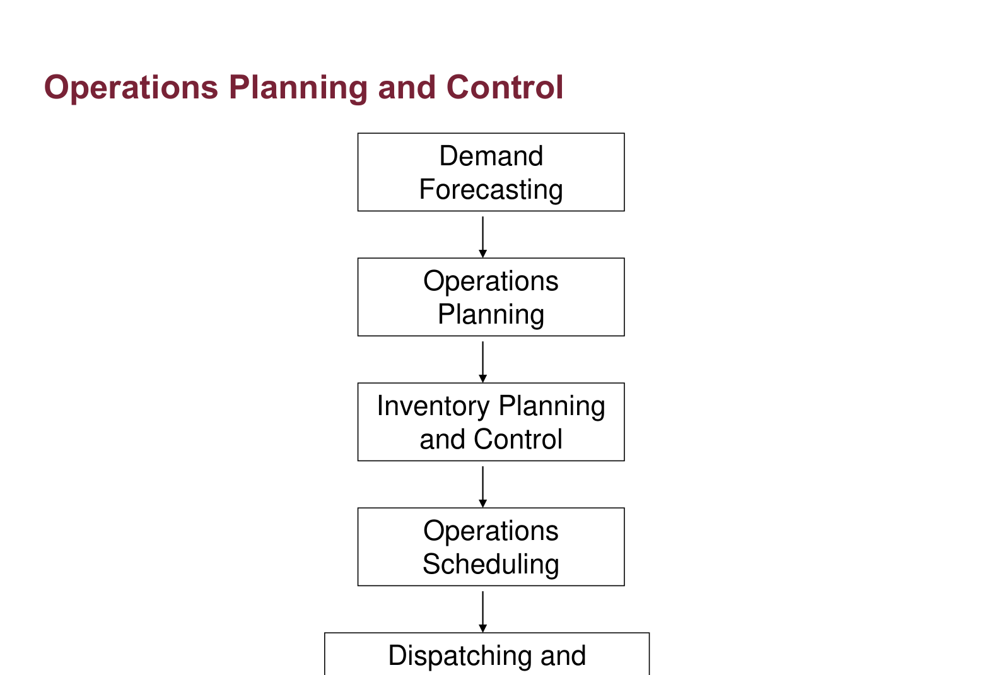

*Figure 1: Operations planning and control, Lecture 6.0, slide 4.*

**Reading the flow, top to bottom:** each box feeds the next.

1. **Demand forecasting**: how much will customers want, and when?
2. **Operations planning**: how much capacity (people, overtime, inventory) do we need each period?
3. **Inventory planning and control**: how much of each item to order or make, and when?
4. **Operations scheduling**: which job runs on which machine at what time?
5. **Dispatching and progress control**: release the work to the shop floor, record progress, and correct deviations.

> **From the textbook (Hicks, §7.2):** the chain is hierarchical. Long-range, aggregate decisions constrain the short-range, detailed ones. A good schedule cannot rescue an infeasible operations plan.

---

## 2. Operations (Aggregate) Planning: Level vs Chase

**Goal (slide 5):** have all resources at the right place, at the right time, in the needed quantities, at **minimum cost**, within budget limits and employment practices.

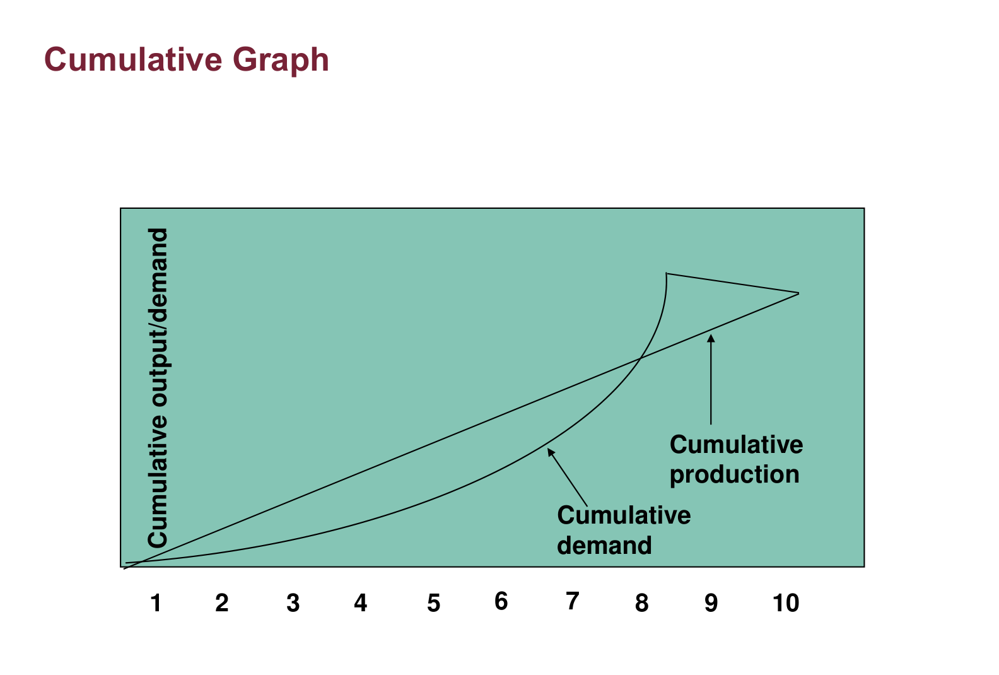

*Figure 2: Cumulative graph, Lecture 6.0, slide 6.*

**Reading the graph:** the x-axis is the period (1–10); the y-axis is the running total. The rule is that **cumulative production must never fall below cumulative demand**, otherwise orders are late. The vertical gap between the two curves at any period is the inventory on hand.

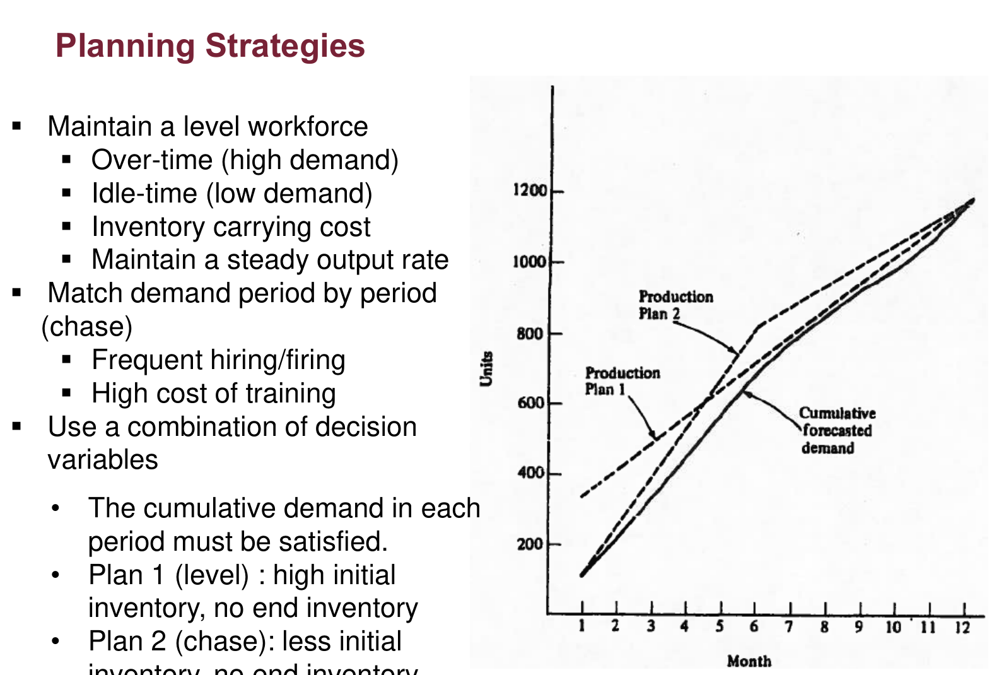

*Figure 3: Planning strategies, Lecture 6.0, slide 7.*

| Strategy | How output is set | Cost it incurs | Inventory |
| :--- | :--- | :--- | :--- |
| **Level** (Plan 1) | Steady workforce and output rate | Overtime in peaks, idle time in troughs, **inventory carrying cost** | High initial inventory, none at the end |
| **Chase** (Plan 2) | Output matches demand period by period | Frequent **hiring and firing**, high **training** cost | Less inventory |
| **Mixed** | Combination of decision variables | Balances both | In between |

On the slide's graph the straight line is the level plan (constant slope), while the chase plan hugs the cumulative demand curve.

---

## 3. Inventory Planning and Control

Two questions drive every inventory system (slide 8):
* **How much** to order? Too much at once → high carrying cost; too little → too many orders.
* **When** to order? Too often → high ordering cost; too rarely → stock-outs.

| Holding inventory… | |
| :--- | :--- |
| **Benefits** | Better customer service; lower ordering, stock-out, acquisition and quality-related costs; efficient operation |
| **Drawbacks** | Higher carrying cost, large-lot quality cost, obsolescence, production-related problems (inventory hides problems) |

**Cost of inventory (slide 12):**
* **Procurement (ordering) cost** $PC$: the clerical cost of making up and processing an order (fixed per order).
* **Carrying (holding) cost** $CC$: money tied up, storage space, obsolescence and spoilage, insurance and taxes (per unit per year).

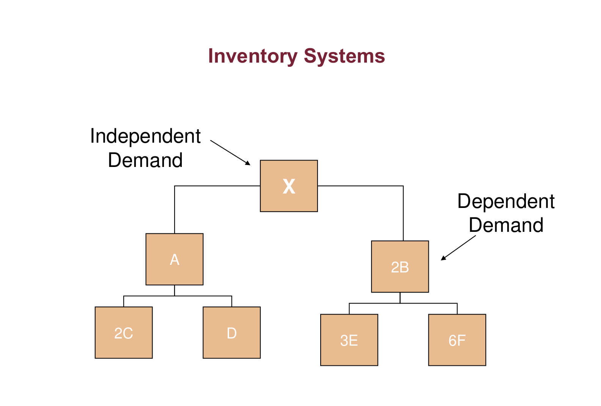

*Figure 4: Inventory systems, Lecture 6.0, slide 14.*

**Reading the tree:** X is an **end item**: its demand comes from customers, independent of any other item, so it is forecast and managed with EOQ-type models. A, B, C, D, E, F are components: their demand is **dependent**, calculated from the schedule of X through the tree (2 of C per A, 6 of F per B…). Dependent demand is handled by **MRP** (Section 5).

---

## 4. The Economic Order Quantity (EOQ)

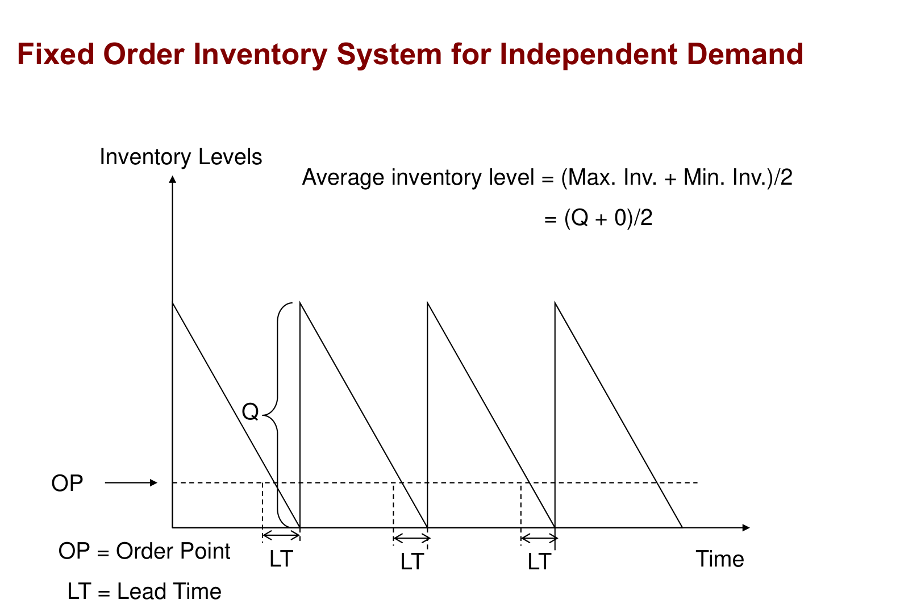

*Figure 5: Fixed-order inventory system for independent demand, Lecture 6.0, slide 17.*

**Reading the saw-tooth:** each order of size $Q$ arrives all at once (vertical jump), stock is used at a steady rate (straight descent), and the next order is placed at the **order point (OP)**, one lead time (LT) before stock reaches zero. The average inventory is

$$\text{Average inventory} = \frac{\text{max} + \text{min}}{2} = \frac{Q + 0}{2} = \frac{Q}{2}$$

### Assumptions (slides 16 and 18)
Known and constant demand $D$; known $CC$ and $PC$; orders received all at once; no safety stock; no inventory left when an order arrives; fixed acquisition cost (no quantity discounts).

### The cost model

$$TC(Q) = \underbrace{\frac{Q}{2}\,CC}_{\text{carrying}} + \underbrace{\frac{D}{Q}\,PC}_{\text{ordering}}$$

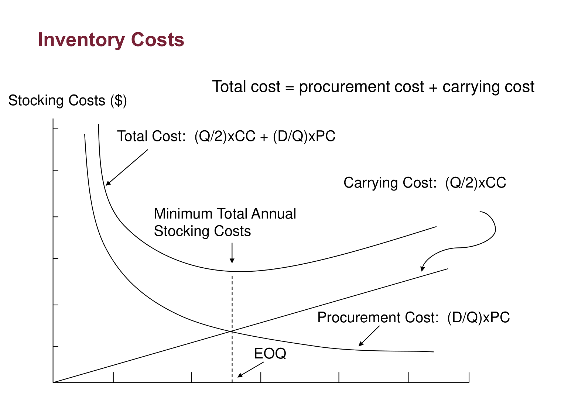

*Figure 6: Inventory costs, Lecture 6.0, slide 19.*

**Reading the curves:** the carrying cost is a straight line rising with $Q$; the procurement cost falls like $1/Q$ (fewer, larger orders); their sum is U-shaped. The bottom of the U is the EOQ, and it sits exactly where the two cost curves cross.

### Deriving the EOQ (slide 20)

$$\frac{dTC}{dQ} = \frac{CC}{2} - \frac{D\,PC}{Q^{2}} = 0 \quad\Longrightarrow\quad Q^{2} = \frac{2\,D\,PC}{CC} \quad\Longrightarrow\quad \boxed{EOQ = \sqrt{\frac{2\,D\,PC}{CC}}}$$

At the EOQ, $\frac{Q}{2}CC = \frac{D}{Q}PC$: annual carrying cost equals annual ordering cost.

### Lecture example: Company ABC (slides 21–22)

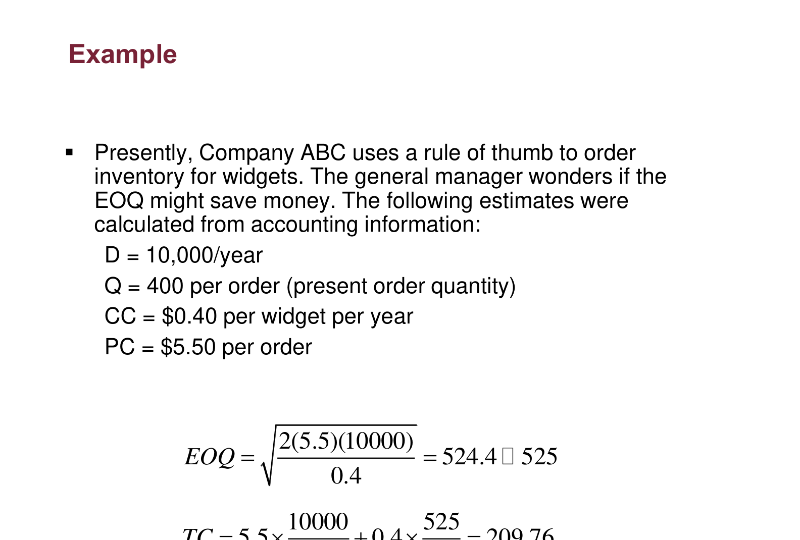

*Figure 7: EOQ example, Lecture 6.0, slide 21.*

$D = 10{,}000$/year, $PC = \$5.50$/order, $CC = \$0.40$/widget/year, current rule $Q = 400$.

$$EOQ = \sqrt{\frac{2(10{,}000)(5.50)}{0.40}} = \sqrt{275{,}000} = 524.4 \approx 525$$

| Policy | Orders/year | Carrying | Ordering | Total |
| :--- | :---: | :---: | :---: | :---: |
| Current $Q = 400$ | 25 | $\frac{400}{2}(0.40) = \$80$ | $25 \times 5.50 = \$137.50$ | **\$217.50** |
| EOQ $Q = 525$ | ≈19 | $\frac{525}{2}(0.40) = \$105$ | $\frac{10{,}000}{525}(5.50) = \$104.76$ | **\$209.76** |

Switching saves about \$7.74 per year here. Small, but the same logic applied to thousands of items is significant.

**EOQ model variations (slide 23):** stock-outs and responsiveness, quantity discounts, demand variation, gradual inventory build-up. Each needs a revised model.

---

## 5. Material Requirements Planning (MRP)

**MRP** (slide 3) is a computer-based technique that determines the components needed to meet a known **master schedule** for end items, minimising inventory while keeping enough material for production.

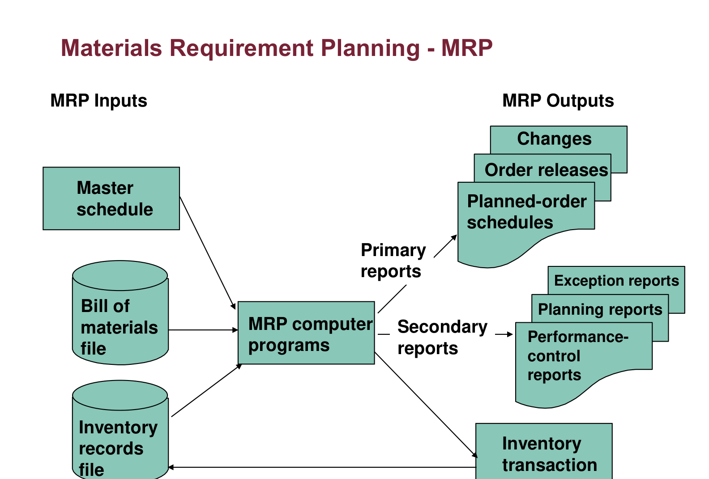

*Figure 8: MRP inputs and outputs, Lecture 7.0, slide 4.*

**Reading the diagram:** three input files, the **master schedule** (what end items, when), the **bill of materials** (what each is made of) and the **inventory records** (what is on hand and on order), feed the MRP programs. They produce **primary reports** (planned-order schedules, order releases, changes) and **secondary reports** (exception, planning and performance reports).

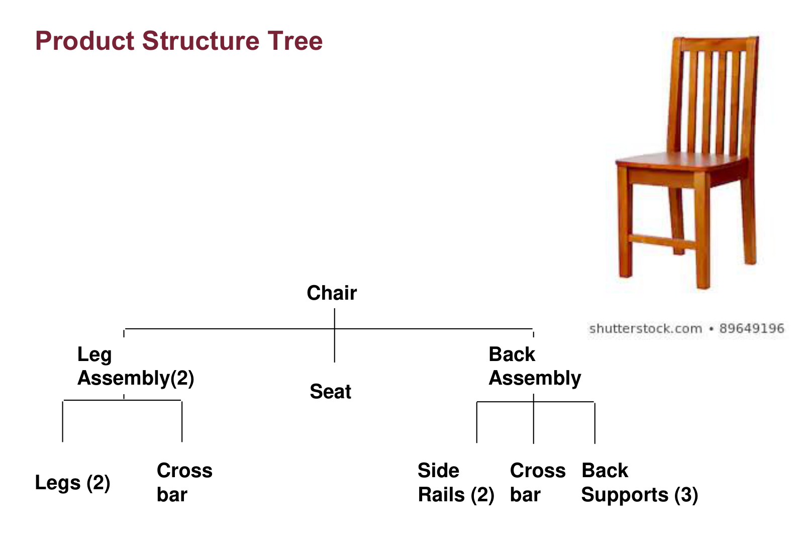

*Figure 9: Product structure tree, Lecture 7.0, slide 5.*

**Reading the tree:** one chair needs **2 leg assemblies**, 1 seat and 1 back assembly. Each leg assembly needs 2 legs and 1 cross bar; the back assembly needs 2 side rails, 1 cross bar and 3 back supports. So 100 chairs need $100 \times 2 \times 2 = 400$ legs and $100 \times (2 \times 1 + 1) = 300$ cross bars. MRP "explodes" the end-item quantity down the tree in exactly this way.

### The MRP record (one per item)
| Row | Meaning |
| :--- | :--- |
| Gross requirements | Total needed each week (from the parent's planned-order releases × quantity per parent) |
| Scheduled receipts | Orders already placed, arriving that week |
| Projected on hand | Stock carried forward |
| Net requirements | Gross − (on hand + scheduled receipts), if positive |
| Planned-order receipts | Net requirement rounded up to the lot size |
| Planned-order releases | Planned receipts shifted **earlier by the lead time** |

### Lecture Example 1: product P1 (slides 7–8)

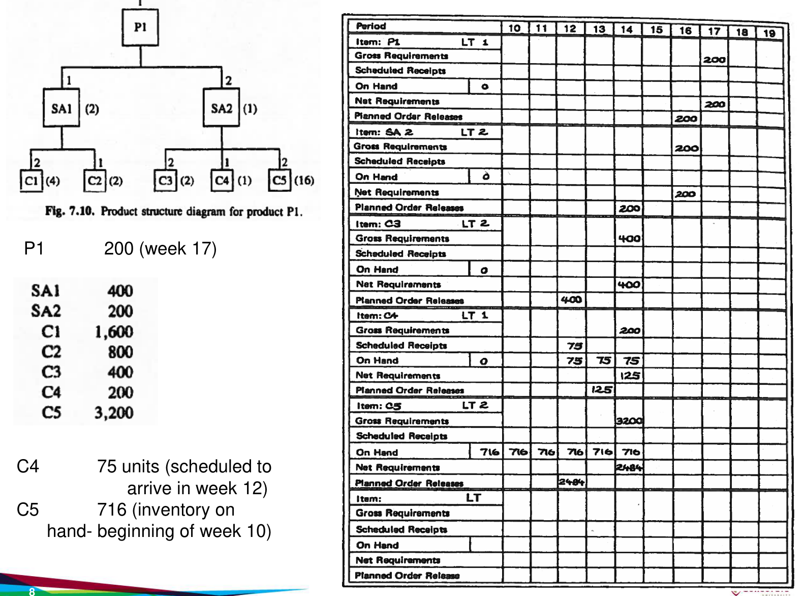

*Figure 10: MRP Example 1 records, Lecture 7.0, slide 8.*

**Reading the records for C5** (16 per SA2, lead time 2, 716 on hand):

$$\text{Gross (week 14)} = 200 \times 1 \times 16 = 3{,}200, \qquad \text{Net} = 3{,}200 - 716 = 2{,}484, \qquad \text{release in week } 14 - 2 = 12$$

And **C4** (1 per SA2, LT 1, 75 arriving in week 12): gross 200 in week 14, net $200 - 75 = 125$, released in week 13.

### Lecture Example 2: shutters with lot sizes (slides 9–10)

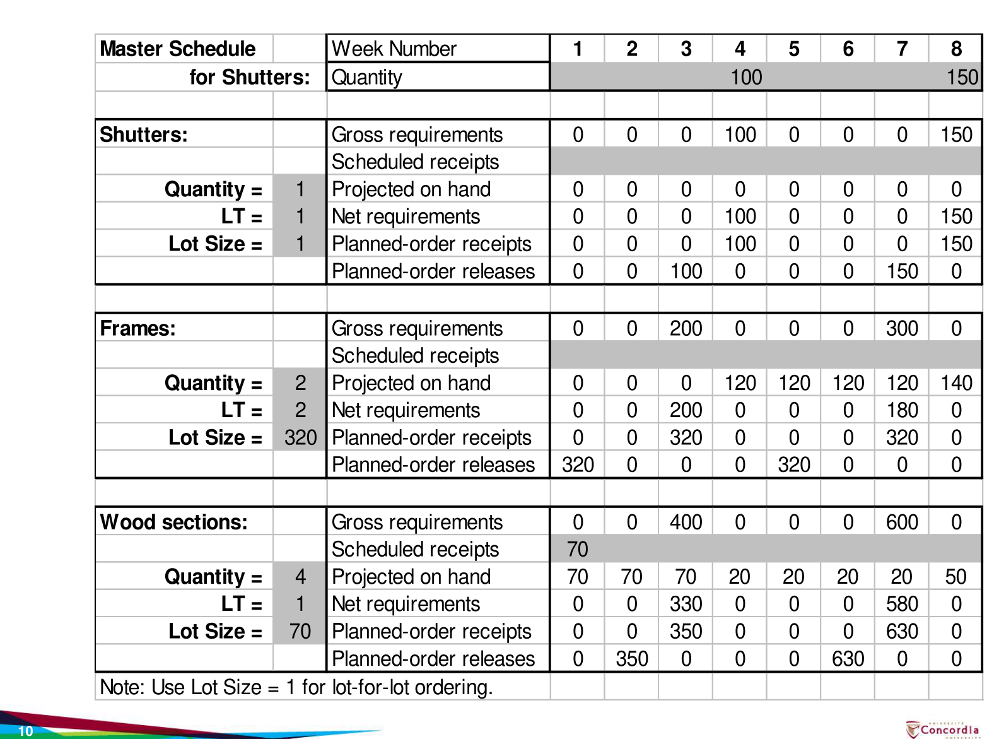

*Figure 11: MRP Example 2 (shutters, frames, wood sections), Lecture 7.0, slide 10.*

**Reading the frames record** (2 per shutter, LT 2, lots of 320): shutter releases of 100 (week 3) and 150 (week 7) create frame gross requirements of 200 and 300. Week 3: net 200 → receive one lot of 320, 120 left. Week 7: net $300 - 120 = 180$ → another lot of 320, 140 left. Releases: **320 in week 1 and 320 in week 5**. The wood sections (4 per shutter, lots of 70, 70 already scheduled) follow the same logic: releases of 350 in week 2 and 630 in week 6.

---

## 6. From MRP to MRP II and ERP

| Stage | What it adds |
| :--- | :--- |
| **MRP** | Component requirements from the master schedule |
| **Closed-loop MRP** | **Feedback**: completed production and stock on hand flow back so plans can be checked against capacity and adjusted |
| **MRP II** (manufacturing resource planning) | Integration with marketing, finance and purchasing, plus a **simulation** component for what-if questions |
| **ERP** (enterprise resource planning) | An MRP II system that ties customer orders to **enterprise-wide resources and suppliers** in one database and interface |

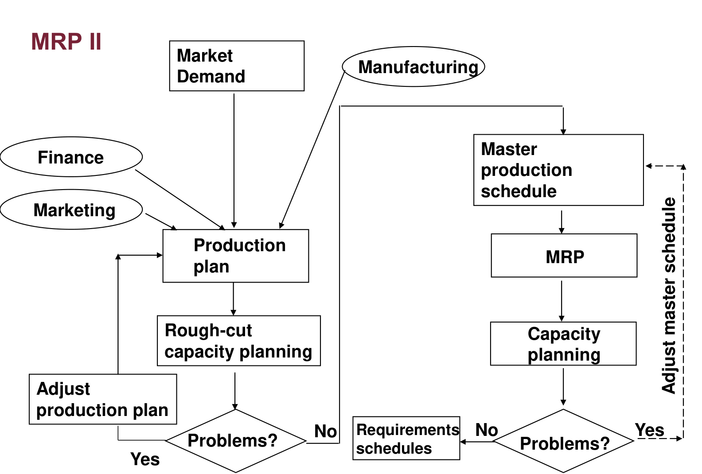

*Figure 12: MRP II, Lecture 7.0, slide 14.*

**Reading the flow:** market demand, finance, marketing and manufacturing together set the **production plan**; **rough-cut capacity planning** checks it. If there are problems, the plan is adjusted (left loop). Then the **master production schedule** drives **MRP**, and detailed **capacity planning** checks it again; problems adjust the master schedule (right loop). The two feedback loops are what "closed loop" means.

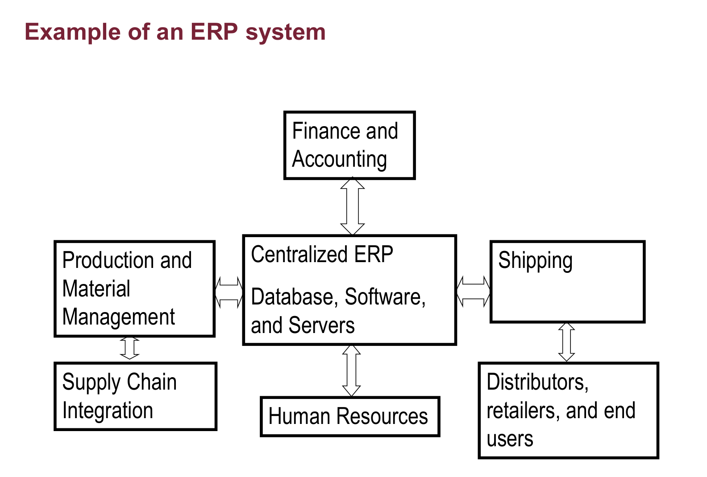

*Figure 13: Example of an ERP system, Lecture 7.0, slide 16.*

**ERP benefits:** integrated systems across locations, less inventory, faster response and delivery. **Drawbacks:** complex, expensive (average total cost of ownership \$15 million on slide 18), long implementations (1–3 years), technology-dependent.

---

## 7. Scheduling, Dispatching, Lean and JIT

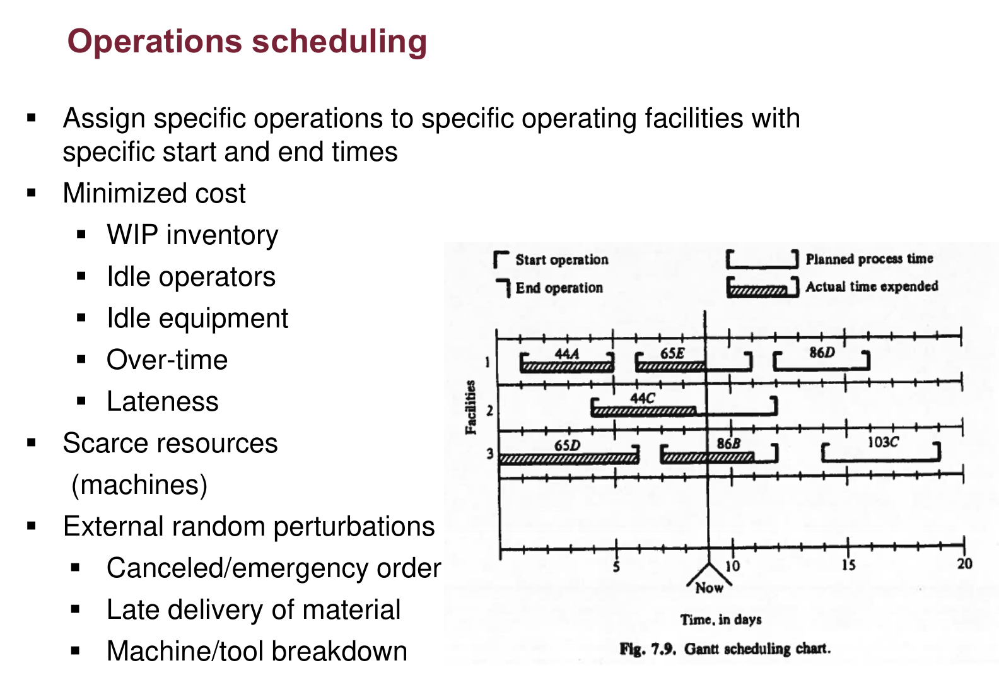

*Figure 14: Operations scheduling, Lecture 7.0, slide 19.*

**Operations scheduling** assigns operations to facilities with start and end times, minimising WIP, idle operators and equipment, overtime and lateness, despite machine breakdowns, emergency orders and late material. The Gantt chart shows each machine as a row and each job as a bar, with planned vs actual progress.

**Dispatching and progress control** turns plans into action: relay the schedule to supervisors, record progress, analyse deviations and take corrective action.

### Lean manufacturing and the seven wastes
Waste (*muda*) is anything beyond the minimum equipment, materials, parts, space and worker time that add value (Shoichiro Toyoda). The seven wastes: **overproduction, waiting, transportation, inefficient processing, inventory, unnecessary motion, product defects**.

### Just-in-Time (JIT)
* A philosophy of continuous, forced problem solving: material is **pulled** through the system to arrive exactly when needed.
* **Push** (MRP-style): material is released downstream regardless of whether the next station is ready. **Pull** (JIT): a station works only when the downstream station signals it needs material.
* JIT attacks waste, **exposes problems** caused by variability, and streamlines production by reducing inventory.

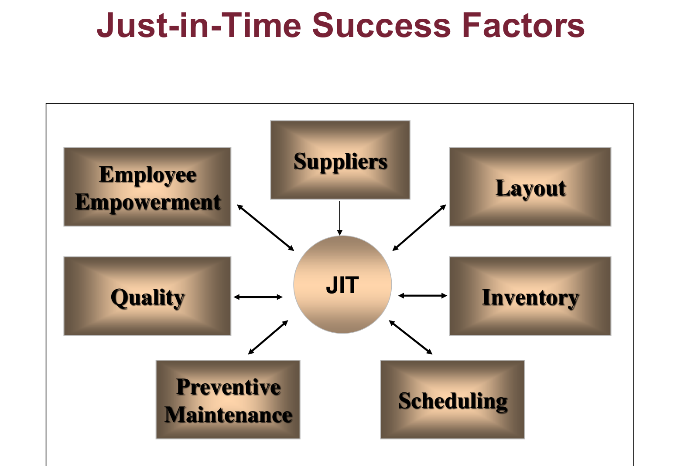

*Figure 15: Just-in-time success factors, Lecture 7.0, slide 27.*

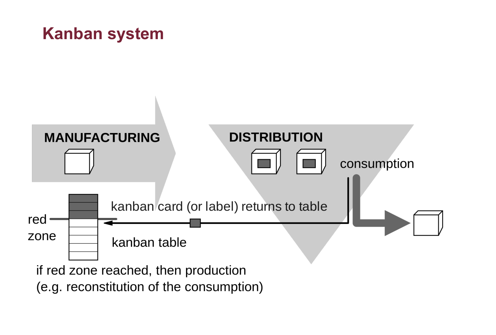

*Figure 16: Kanban system, Lecture 7.0, slide 29.*

**Reading the Kanban figure:** when distribution consumes a container, its **kanban card** returns to the **kanban table** at manufacturing. Cards accumulating in the **red zone** trigger production. So the **rate of consumption controls the rate of production**, and adding or removing containers (cards) changes the production rate.

| MRP | Kanban |
| :--- | :--- |
| Computed plan, "optimal" if followed | Not aiming at an optimum |
| Top-down (push) | Bottom-up (pull) |

---

## 8. Demand Forecasting

**Principles (Lecture 8.0, slide 3):** forecasting assumes the future is related to the past; forecasts contain error; group forecasts are more accurate than individual ones; accuracy decreases as the horizon lengthens. Forecasts are either **judgmental** (executive opinion, surveys) or **time series** (trend, seasonality, irregular and random variation).

### Simple moving average

$$\hat x_t = \frac{1}{n}\sum_{i=1}^{n} x_{t-i}$$

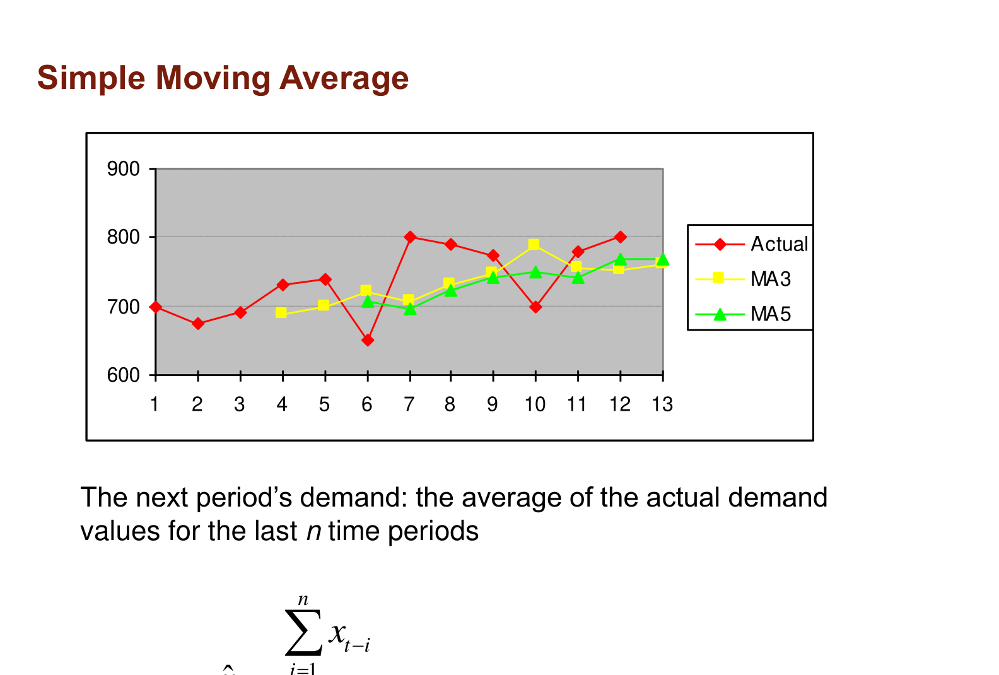

*Figure 17: Simple moving average, Lecture 8.0, slide 8.*

**Reading the chart:** MA3 (3 periods) follows the actual demand more closely but is noisier; MA5 is smoother but lags turning points. **Larger $n$ = more smoothing, slower response.**

**Lecture example (slide 9):** demands 42, 40, 43, 40, 41 give $\hat x_6 = \frac{43 + 40 + 41}{3} = 41.3$.

### Exponentially weighted moving average (EWMA)

$$\hat x_t = \hat x_{t-1} + \alpha\,(x_{t-1} - \hat x_{t-1}) = \alpha\,x_{t-1} + (1 - \alpha)\,\hat x_{t-1}$$

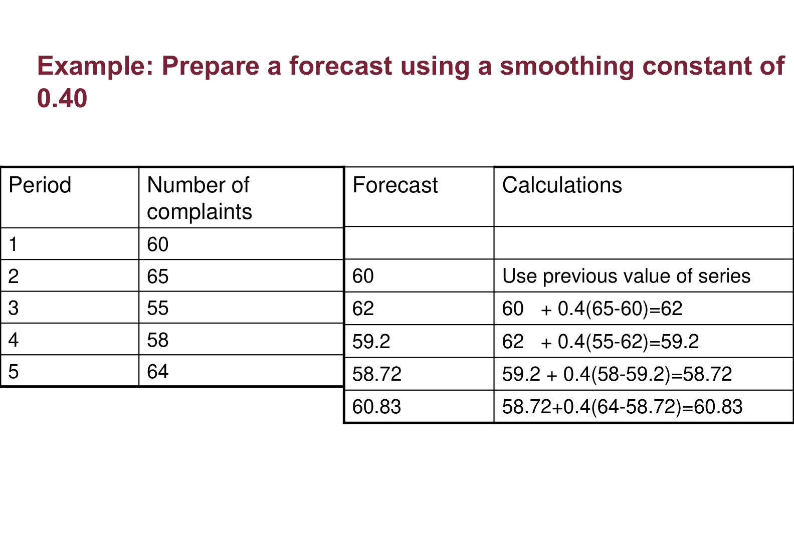

*Figure 18: EWMA example with α = 0.40, Lecture 8.0, slide 11.*

| Period | Actual | Forecast | Calculation |
| :---: | :---: | :---: | :--- |
| 1 | 60 | — | |
| 2 | 65 | 60 | first forecast = previous actual |
| 3 | 55 | 62 | $60 + 0.4(65 - 60)$ |
| 4 | 58 | 59.2 | $62 + 0.4(55 - 62)$ |
| 5 | 64 | 58.72 | $59.2 + 0.4(58 - 59.2)$ |
| 6 | | **60.83** | $58.72 + 0.4(64 - 58.72)$ |

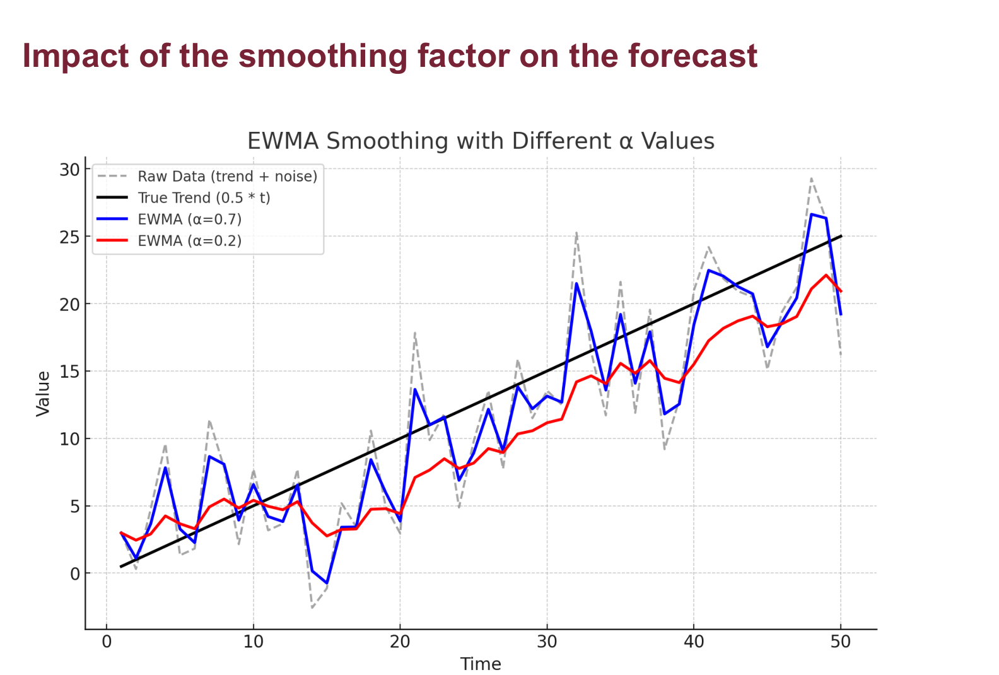

*Figure 19: Impact of the smoothing factor, Lecture 8.0, slide 12.*

**Reading the chart:** a large $\alpha$ tracks the data closely (responsive but noisy); a small $\alpha$ gives a smooth curve that lags. With $\alpha = 0.2$, the latest observation gets 20% of the weight and the remaining 80% decays exponentially across all older data.

### Linear regression (trend)

$$\hat x_t = a + bt, \qquad b = \frac{n\sum t x - \sum t \sum x}{n\sum t^{2} - \left(\sum t\right)^{2}}, \qquad a = \frac{\sum x - b\sum t}{n}$$

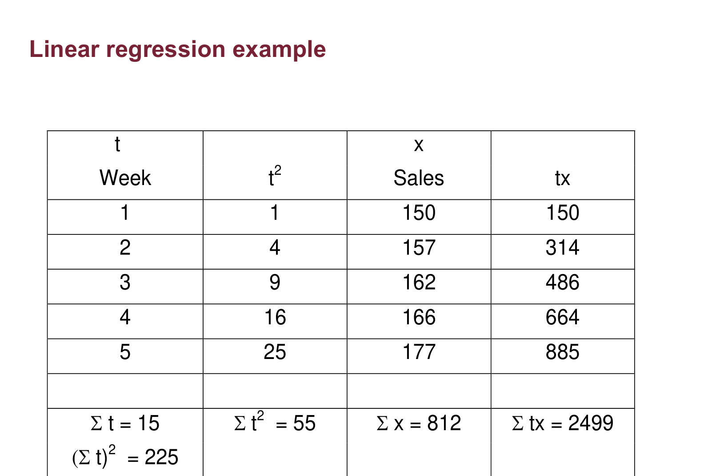

*Figure 20: Linear regression example, Lecture 8.0, slide 16.*

$$b = \frac{5(2499) - 15(812)}{5(55) - 225} = \frac{315}{50} = 6.3, \qquad a = \frac{812 - 6.3(15)}{5} = 143.5, \qquad \hat x = 143.5 + 6.3t$$

Forecast for week 6: $143.5 + 6.3(6) = 181.3$. **Watch the denominator:** $\sum t^{2} = 55$ is not $(\sum t)^{2} = 225$.

---

## 9. Exam Checklist

- [ ] Order of the chain: forecast → operations plan → inventory → schedule → dispatch.
- [ ] Level vs chase: which cost each strategy incurs.
- [ ] Independent (end items, EOQ) vs dependent (components, MRP) demand.
- [ ] EOQ formula, derivation, $Q/2$ average inventory, carrying = ordering at the optimum.
- [ ] MRP record: gross → net → lot size → **offset by lead time**.
- [ ] MRP → closed loop → MRP II → ERP: what each adds.
- [ ] Seven wastes; push vs pull; how Kanban controls production.
- [ ] Moving average (most recent $n$), EWMA ($\alpha$ multiplies the error), regression slope and intercept.
