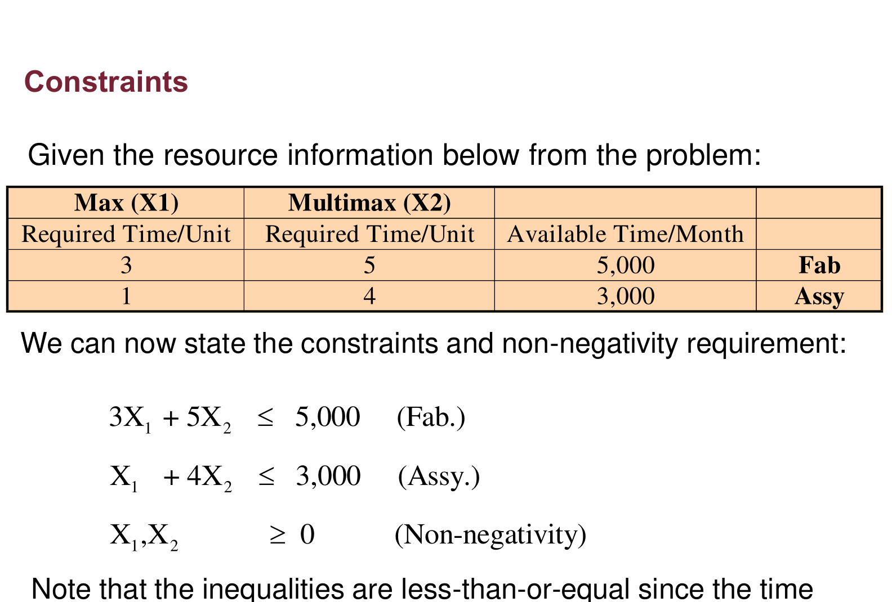
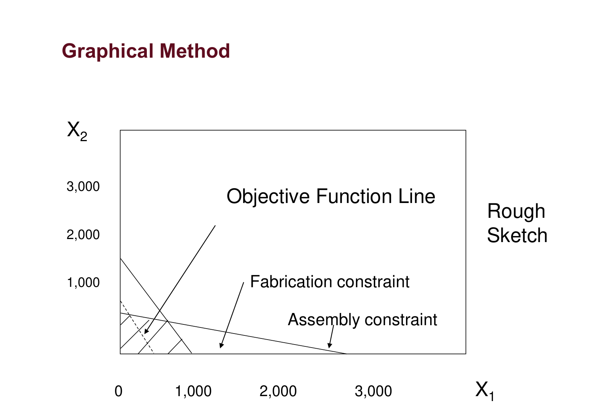
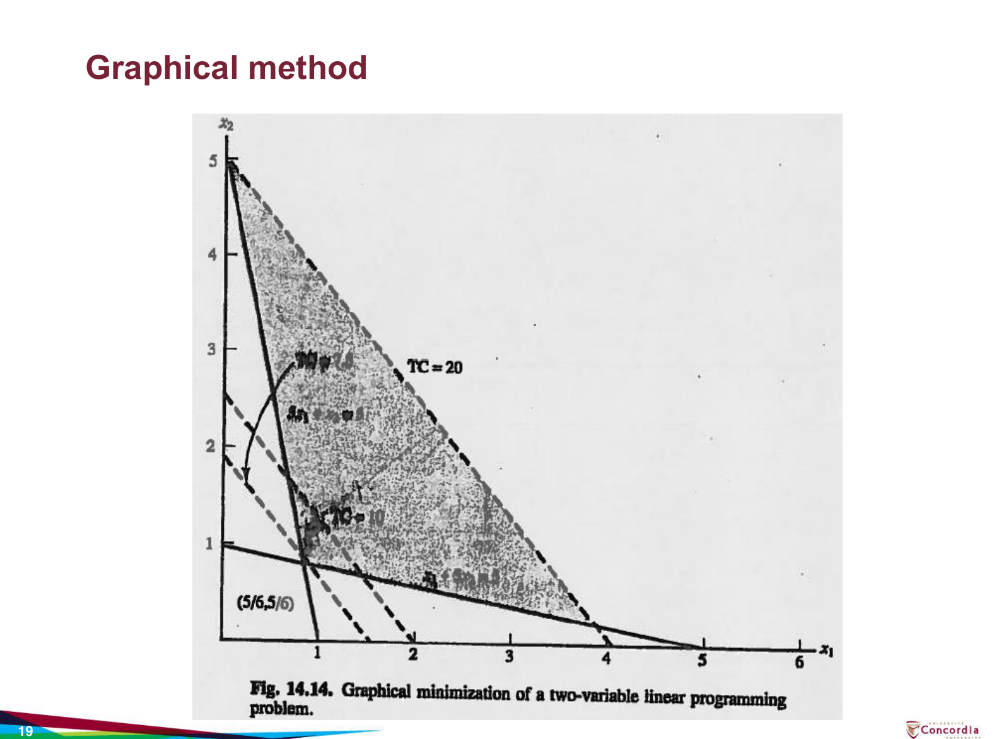
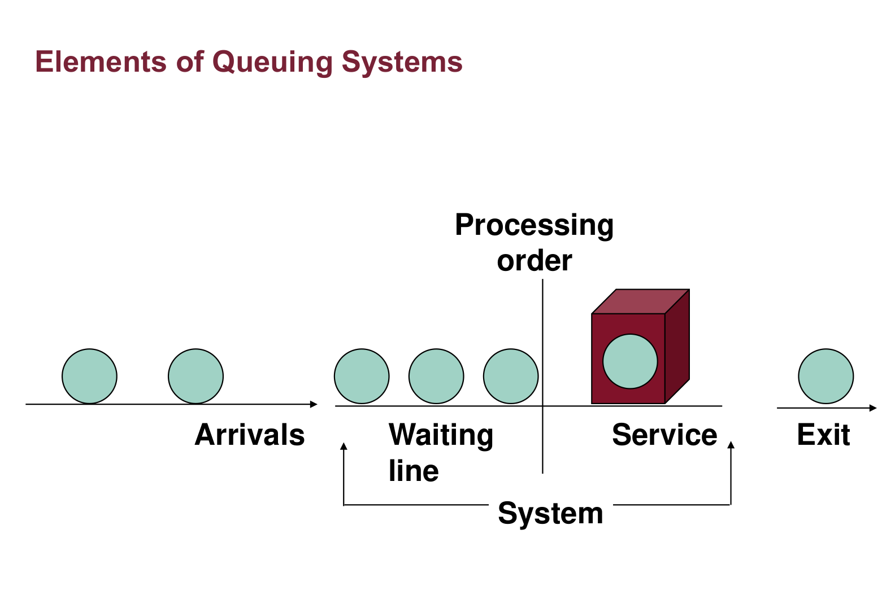
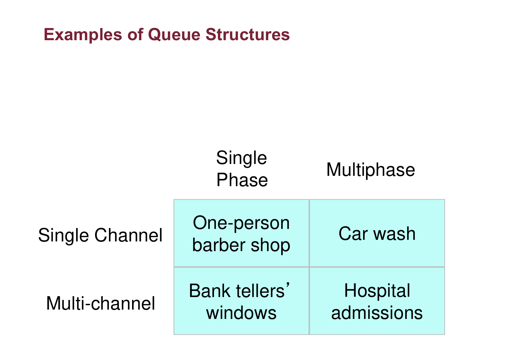
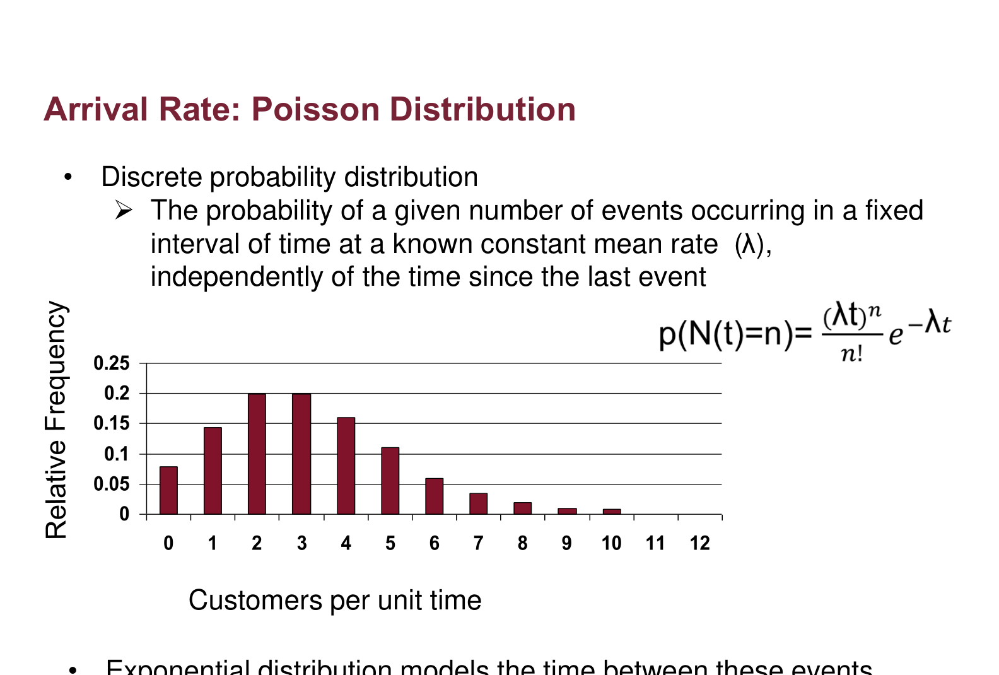
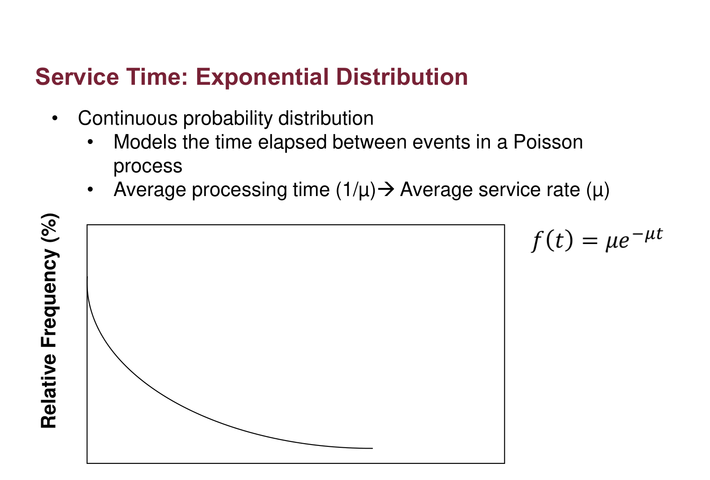
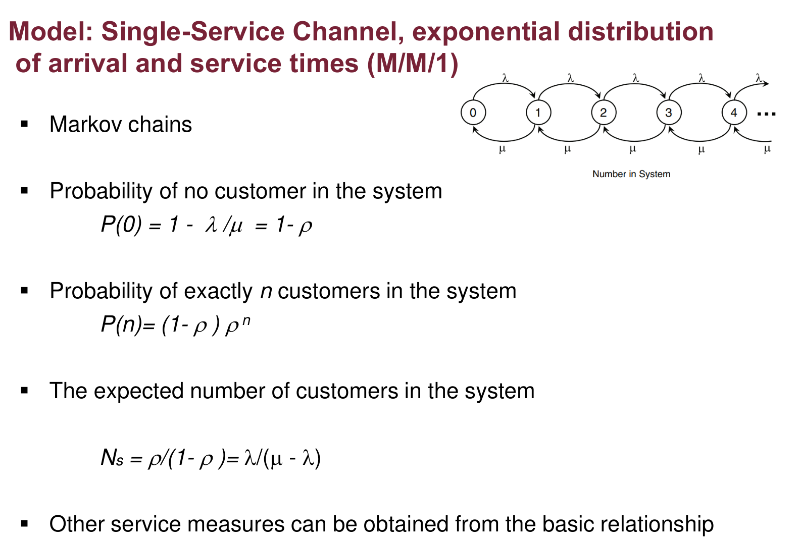
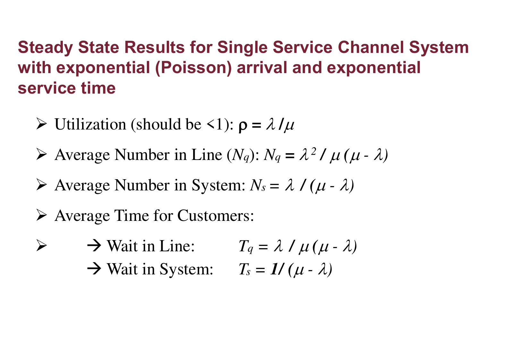

# INDU 211 · Comprehensive Topic Guide (Part 6)
# Chapters 14 & 15: Linear Programming & Queuing Models
**Concordia University · Department of Mechanical, Industrial & Aerospace Engineering (MIAE)**

*Built on the teacher's Lecture 9.0 (Chapter 14, Deterministic Operations Research) and Lecture 10 (Chapter 15, Probabilistic Models: Queuing Theory), with depth from the course textbook (Hicks, Chapters 14 and 15).*

---

## Table of Contents
1. [What Operations Research Is](#1-what-operations-research-is)
2. [Anatomy of a Linear Program](#2-anatomy-of-a-linear-program)
3. [Worked Example: Lawn Grow Product Mix](#3-worked-example-lawn-grow-product-mix)
4. [The Graphical Method, Step by Step](#4-the-graphical-method-step-by-step)
5. [Minimisation and Special Cases](#5-minimisation-and-special-cases)
6. [Queuing Systems: Structure and Randomness](#6-queuing-systems-structure-and-randomness)
7. [The M/M/1 Queue](#7-the-mm1-queue)
8. [Worked Example: Drive-Up Window](#8-worked-example-drive-up-window)
9. [Steady State, Multiple Servers and Simulation](#9-steady-state-multiple-servers-and-simulation)
10. [Exam Checklist](#10-exam-checklist)

---

## 1. What Operations Research Is

**Operations research (OR)** is the scientific study of operations, which started during World War II with the allocation of scarce military resources. It builds a **mathematical model** that captures the essence of a real problem and solves it for the best decision (Lecture 9.0, slide 3).

| Deterministic OR (Chapter 14) | Probabilistic OR (Chapter 15) |
| :--- | :--- |
| All data known with certainty | Some data are random (arrivals, service times, demand) |
| Linear, integer, nonlinear, dynamic programming; transportation, assignment, shortest path, TSP/VRP | Queuing theory, inventory under uncertainty, Markov chains, simulation |

> **From the textbook (Hicks, §14.1):** the UK Operational Research Society defines OR as "the attack of modern science on complex problems arising in the direction and management of large systems of men, machines, materials and money." Its tools overlap heavily with industrial engineering, which is why IEs use them daily.

**Applications (slide 4):** supply chain, production and inventory planning, facility location and layout, transportation and logistics, personnel scheduling, timetabling, job scheduling, energy management, robotics, product design.

---

## 2. Anatomy of a Linear Program

Every mathematical programming model has **decision variables, parameters, an objective function and constraints** (slide 5). It is a **linear** program when the objective and every constraint are linear in the decision variables.

$$\text{Maximise (or minimise)}\quad Z = C_1X_1 + C_2X_2 + \dots + C_nX_n$$

$$\text{subject to}\quad \begin{aligned} A_{11}X_1 + A_{12}X_2 + \dots + A_{1n}X_n &\le B_1 \\ &\ \ \vdots \\ A_{m1}X_1 + A_{m2}X_2 + \dots + A_{mn}X_n &= B_m \\ X_1, X_2, \dots, X_n &\ge 0 \end{aligned}$$

| Symbol | Meaning |
| :--- | :--- |
| $X_j$ | Decision variables (e.g. units of product $j$) |
| $C_j$ | Contribution of one unit of $X_j$ to profit or cost |
| $A_{ij}$ | Amount of resource $i$ used by one unit of $X_j$ |
| $B_i$ | Amount of resource $i$ available |
| $\ge 0$ | Non-negativity: you cannot produce negative units |

Constraints can be $\le$, $\ge$ or $=$, in any combination.

---

## 3. Worked Example: Lawn Grow Product Mix

**Problem (slide 9):** Lawn Grow makes two riding mowers, the **Max** (profit \$400) and the **Multimax** (profit \$800). Each month there are 5,000 hours of fabrication and 3,000 hours of assembly. How many of each should be made to maximise profit?

*Figure 1: Constraints, Lecture 9.0, slide 11.*

**Reading the table:** each **row** is a resource and becomes one constraint; each **column** is a product and becomes one variable. Fabrication: 3 h per Max and 5 h per Multimax, 5,000 h available. Assembly: 1 h and 4 h, 3,000 h available.

**Step 1: variables.** $X_1$ = Max per month, $X_2$ = Multimax per month.

**Step 2: objective.**
$$\max Z = 400X_1 + 800X_2$$

**Step 3: constraints.**
$$\begin{aligned} 3X_1 + 5X_2 &\le 5000 \quad (\text{fabrication}) \\ X_1 + 4X_2 &\le 3000 \quad (\text{assembly}) \\ X_1, X_2 &\ge 0 \end{aligned}$$

The inequalities are $\le$ because hours used cannot exceed the hours available.

---

## 4. The Graphical Method, Step by Step

For two variables the LP can be solved on a graph (slide 15):

1. Draw each constraint as a line by finding its intercepts: $3X_1 + 5X_2 = 5000$ meets the axes at $(1666.7, 0)$ and $(0, 1000)$; $X_1 + 4X_2 = 3000$ at $(3000, 0)$ and $(0, 750)$.
2. Shade the side that satisfies $\le$ for both lines: that common area is the **feasible region**.
3. Draw an objective line for any value, say $400X_1 + 800X_2 = 8000$, to see its direction.
4. Slide it parallel in the direction of increasing profit until it last touches the feasible region.
5. That **corner point** is the optimum.

*Figure 2: Graphical method, Lecture 9.0, slide 16.*

**Reading the sketch:** the fabrication line is steeper, the assembly line is flatter, and the feasible region is the area under both, next to the origin. The objective line is pushed up and to the right until it touches the corner where the two constraints cross.

**Solving the corner (slide 17):**

$$X_1 = 3000 - 4X_2 \;\Rightarrow\; 3(3000 - 4X_2) + 5X_2 = 5000 \;\Rightarrow\; 7X_2 = 4000 \;\Rightarrow\; X_2 = 571.4,\ X_1 = 714.3$$

$$Z = 400(714.3) + 800(571.4) \approx \$742{,}857$$

Checking the other corners confirms it: $(0, 750)$ gives \$600,000 and $(1666.7, 0)$ gives \$666,667. (The slide rounds to 715 and 571 for \$742,800; strictly, 715 uses 5,002 fabrication hours, so 714 is the feasible whole number.)

> **Why the optimum is always at a corner:** the objective is a straight line and the region is bounded by straight lines, so the last point the sliding line touches is a vertex (or a whole edge, if the objective is parallel to it, giving multiple optima).

---

## 5. Minimisation and Special Cases

**Lecture Example 2 (slides 18–19):**

$$\min Z = 5x_1 + 4x_2 \quad \text{s.t.}\quad 5x_1 + x_2 \ge 5,\quad x_1 + 5x_2 \ge 5,\quad x_1, x_2 \ge 0$$

*Figure 3: Graphical minimisation of a two-variable LP, Lecture 9.0, slide 19 (textbook Fig. 14.14).*

**Reading the graph:** with $\ge$ constraints the feasible region lies **above** both lines (shaded) and is unbounded. The cost lines $TC = 10$ and $TC = 20$ (dashed) are moved **toward the origin**, and the last feasible point they touch is the corner $(5/6, 5/6)$:

$$5x_1 + x_2 = 5,\ \ x_1 + 5x_2 = 5 \;\Rightarrow\; x_1 = x_2 = \tfrac56, \qquad Z = 5\left(\tfrac56\right) + 4\left(\tfrac56\right) = 7.5$$

**Equality constraints** (Fall 2020 final): a constraint like $x_1 + 3x_2 = 9$ restricts the feasible set to a **line segment**, so the optimum is at one of the segment's endpoints.

**Other deterministic models (slide 20, textbook §14.8–14.9):** transportation and assignment problems (special LPs), shortest path, minimum spanning tree, TSP/VRP, integer and mixed-integer programming (whole-number or yes/no decisions), nonlinear and dynamic programming. Real problems are solved with software such as CPLEX, Gurobi, MATLAB or Python (slide 21).

---

## 6. Queuing Systems: Structure and Randomness

**Queuing theory** is the mathematical analysis of waiting lines, in emergency rooms, banks, call centres, networks and production lines (Lecture 10, slide 3). Its goal is to minimise the **sum of customer waiting cost and service capacity cost**: more servers mean shorter waits but higher cost.

*Figure 4: Elements of queuing systems, Lecture 10, slide 5.*

**Reading the figure:** customers **arrive**, wait in the **waiting line** in some processing order, receive **service**, and **exit**. The "system" is the waiting line plus the service.

**System characteristics (slide 4):** population source (infinite or finite), number of servers (channels), arrival and service patterns, and queue discipline (e.g. first come, first served).

*Figure 5: Examples of queue structures, Lecture 10, slide 7.*

| | Single phase | Multiphase |
| :--- | :--- | :--- |
| **Single channel** | One-person barber shop | Car wash |
| **Multi-channel** | Bank tellers' windows | Hospital admissions |

### Modelling randomness
* **Arrivals:** the number of arrivals per unit time follows a **Poisson** distribution with mean rate $\lambda$:
  $$P(N(t) = n) = \frac{(\lambda t)^{n}}{n!}\,e^{-\lambda t}$$
* **Service times:** follow an **exponential** distribution with mean $1/\mu$ (service rate $\mu$):
  $$f(t) = \mu\,e^{-\mu t}$$

*Figure 6: Arrival rate, Poisson distribution, Lecture 10, slide 9.*

*Figure 7: Service time, exponential distribution, Lecture 10, slide 10.*

**Reading the two plots:** the Poisson bars show how many customers arrive per period (most often around the mean, sometimes more). The exponential curve shows that most services are short and a few are long. The two are linked: if arrivals per period are Poisson, the times *between* arrivals are exponential.

---

## 7. The M/M/1 Queue

"M/M/1" means Markovian (Poisson) arrivals, Markovian (exponential) service, 1 server.

*Figure 8: Single-service channel model (M/M/1), Lecture 10, slide 14.*

**Reading the chain:** each circle is a state (the number of customers in the system). Arrivals move the system one state right at rate $\lambda$; service completions move it one state left at rate $\mu$. At steady state, the flow into each state equals the flow out, which gives the geometric distribution below.

| Measure | Formula |
| :--- | :--- |
| Utilisation (must be < 1) | $\rho = \dfrac{\lambda}{\mu}$ |
| Probability the system is empty | $P(0) = 1 - \rho$ |
| Probability of exactly $n$ in the system | $P(n) = (1 - \rho)\,\rho^{n}$ |
| Average number in the system | $N_s = \dfrac{\lambda}{\mu - \lambda}$ |
| Average number in the queue | $N_q = \dfrac{\lambda^{2}}{\mu(\mu - \lambda)}$ |
| Average time in the system | $T_s = \dfrac{1}{\mu - \lambda}$ |
| Average time in the queue | $T_q = \dfrac{\lambda}{\mu(\mu - \lambda)}$ |

*Figure 9: Steady-state results for M/M/1, Lecture 10, slide 16.*

**Two relationships tie them together:**
* **Little's law:** $N_s = \lambda T_s$ and $N_q = \lambda T_q$.
* **Service time:** $T_s = T_q + \dfrac{1}{\mu}$ (time in the system = wait + one service).

> **From the textbook (Hicks, §15.2.2):** these two relationships hold for all the standard models, "thus, if we calculate the expected number of units, it is easy to get expected time, or vice versa". Compute one measure, then derive the rest.

---

## 8. Worked Example: Drive-Up Window

**Problem (slide 17):** customers arrive at 25 per hour; one employee serves a customer every 2 minutes; Poisson arrivals and exponential service.

**Step 1: rates in the same unit.**
$$\lambda = 25\ /\text{h}, \qquad \mu = \frac{60\ \text{min/h}}{2\ \text{min}} = 30\ /\text{h}$$

**Step 2: utilisation.**
$$\rho = \frac{25}{30} = 0.833$$

**Step 3: numbers in line and in system.**
$$N_q = \frac{25^{2}}{30(30 - 25)} = \frac{625}{150} = 4.17, \qquad N_s = \frac{25}{30 - 25} = 5$$

**Step 4: times.**
$$T_q = \frac{25}{30(5)} = 0.1667\ \text{h} = 10\ \text{min}, \qquad T_s = \frac{1}{5} = 0.2\ \text{h} = 12\ \text{min}$$

Check: $T_s - T_q = 2$ min $= 1/\mu$ ✔, and $N_s = \lambda T_s = 25 \times 0.2 = 5$ ✔.

**Step 5: probabilities.**
$$P(2) = \left(1 - \tfrac{25}{30}\right)\left(\tfrac{25}{30}\right)^{2} = 0.1157$$

$$P(n > 5) = 1 - \sum_{n=0}^{5}(1 - \rho)\rho^{n} = \rho^{6} = 0.335$$

(The slide adds six rounded terms and gets 0.339; the exact value is $\rho^{6} = 0.335$.)

---

## 9. Steady State, Multiple Servers and Simulation

**Steady state with $M$ servers (slide 23):**
* Infinite population with random arrivals or service: utilisation $\rho = \lambda / (M\mu)$ must be **strictly less than 1**.
* $\rho = 1$ is possible only if both arrivals and service are deterministic.
* Finite population: $\rho$ can be any positive value.

**Why not 100%?** With randomness, a server idle during a random gap can never recover that time, so if average demand equals capacity the backlog drifts upward without limit.

**Simulation (slides 24–26):** for complex queues, non-exponential distributions or whole networks, analytical formulas do not exist. Simulation runs numerical experiments to answer what-if questions; the simple M/M/1 results are used to **verify** the simulation model. It can be expensive and must be done carefully.

> **From the textbook (Hicks, Ch. 16):** simulation is used when a closed-form ("analytical") solution is not tractable; it imitates the system over time with random numbers drawn from the input distributions.

---

## 10. Exam Checklist

- [ ] LP elements: variables, parameters, objective, constraints, non-negativity; linearity.
- [ ] Formulate from a word problem: one constraint per resource, $\le$ for capacities.
- [ ] Graphical method: intercepts, feasible region, slide the objective line, corner point; compare corners.
- [ ] Minimisation with $\ge$ constraints: move the cost line toward the origin.
- [ ] Queue structure (channels × phases); Poisson arrivals, exponential service.
- [ ] Convert rates to the same unit ($\mu$ = 60 ÷ service minutes).
- [ ] M/M/1 formulas; Little's law; $T_s = T_q + 1/\mu$; $P(n > k) = \rho^{k+1}$.
- [ ] Steady state requires $\rho < 1$ with randomness.
