# INDU 211 · Comprehensive Topic Guide (Part 7)
# Chapter 8: Quality Control & Statistical Process Control
**Concordia University · Department of Mechanical, Industrial & Aerospace Engineering (MIAE)**

*Built on the teacher's Lecture 11 (Chapter 8, Quality Control), with depth from the course textbook (Hicks, Chapter 8).*

---

## Table of Contents
1. [What Quality Means](#1-what-quality-means)
2. [Quality Management, Standards and Assurance](#2-quality-management-standards-and-assurance)
3. [The Costs of Quality](#3-the-costs-of-quality)
4. [Statistical Process Control: Natural vs Assignable Variation](#4-statistical-process-control-natural-vs-assignable-variation)
5. [The Normal Distribution Refresher](#5-the-normal-distribution-refresher)
6. [Control Charts for Variables: X-bar and R](#6-control-charts-for-variables-x-bar-and-r)
7. [Control Charts for Attributes: the p Chart](#7-control-charts-for-attributes-the-p-chart)
8. [Process Capability and Six Sigma](#8-process-capability-and-six-sigma)
9. [Exam Checklist](#9-exam-checklist)

---

## 1. What Quality Means

The slides open with eight definitions (Lecture 11, slides 3–10). Learn who said what: exams test the match.

| Source | Definition of quality |
| :--- | :--- |
| **ISO** | The totality of features and characteristics that bear on the ability to satisfy stated or implied needs |
| **Gitlow et al.** | The extent to which customers believe the product surpasses their needs and expectations |
| **Feigenbaum** | The total composite of marketing, engineering, manufacture and maintenance characteristics through which the product meets customer expectations |
| **Imai** | Anything which can be improved |
| **Crosby** | **Conformance to requirements** |
| **Shewhart** | Conformance to specified standards |
| **Juran** | **Fitness for use** |
| **Deming** | A predictable degree of uniformity and dependability at low cost, suited to the market |

**Two viewpoints:** the **manufacturing-based** approach (supply side: engineering and manufacturing practice, conformance) and the **value-based** approach (quality in terms of cost and price: performance at an acceptable price).

**Dimensions of quality for goods (slide 14):** performance, reliability and durability, conformance, serviceability, appearance, features, safety. **Service attributes (slide 15):** reliability, communication, responsiveness, competence, courtesy, access.

**Determinants of quality (slide 22):** quality of design, capability of the production process, quality of conformance, quality of customer service.

> **From the textbook (Turner et al., §8.4): Deming's 14 points (first eight, paraphrased).** (1) Create constancy of purpose toward improvement. (2) Adopt the new philosophy. (3) **Cease dependence on inspection**: build quality in from the start. (4) Stop awarding business on price alone; minimise total cost, with long-term single suppliers. (5) Improve the system of production and service constantly and forever. (6) Institute training on the job. (7) Institute leadership. (8) Drive out fear. Point 3 is the idea behind moving from quality *control* (detection) to quality *assurance* (prevention).

---

## 2. Quality Management, Standards and Assurance

**ISO quality management system standards (slide 25):** they specify **what** is required, not how to do it; certification is done by a third party and renewed every **three years**.

| Standard | Covers |
| :--- | :--- |
| ISO 9001 | Quality management (products and services meet customer needs) |
| ISO 14001 | Environmental management |
| ISO 45001 | Health and safety at work |
| ISO 27001 | Information security |

| | Quality control (QC) | Quality assurance (QA) |
| :--- | :--- | :--- |
| **Focus** | **Detection** of defects | **Prevention** of defects |
| **Goal** | Identify and fix issues in the output | Make the process effective and consistent |
| **Activities** | Inspection, testing, sampling, rework | Standard procedures, process audits, training, documentation, certification |

---

## 3. The Costs of Quality

| Category | When the money is spent | Examples |
| :--- | :--- | :--- |
| **Prevention** | Before defects occur | Quality planning, training, designing quality systems, reporting |
| **Appraisal** | Evaluating products | Testing, inspection, quality audits |
| **Internal failure** | Defect found **before** delivery | Scrap, rework, retest, downtime, yield loss, disposition |
| **External failure** | Defect found **after** delivery | Complaints, returns, warranty, allowances, loss of goodwill |

**Total quality cost** = the difference between the actual cost and what it would be with no possibility of defects (slide 33).

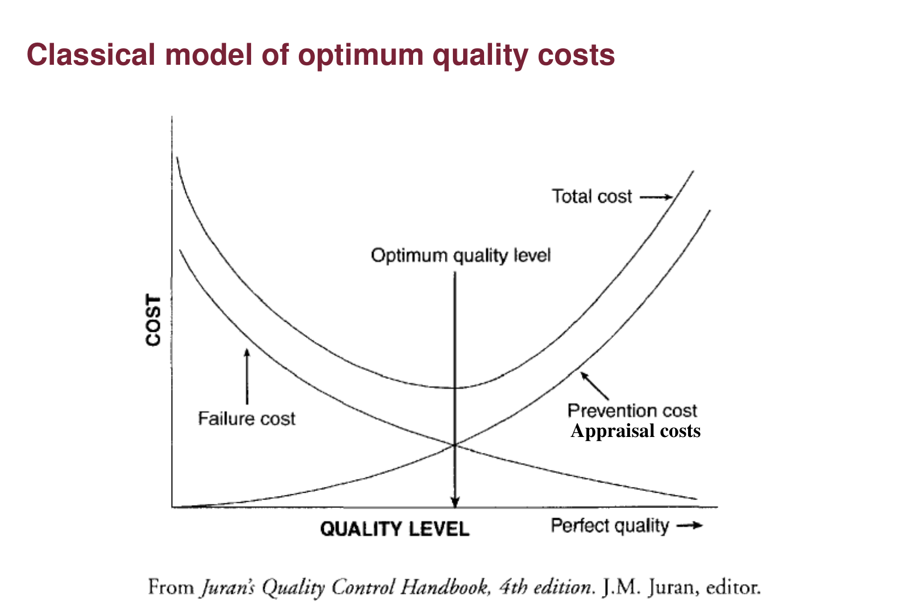

*Figure 1: Classical model of optimum quality costs, Lecture 11, slide 34 (Juran's Quality Control Handbook).*

**Reading the graph:** as quality level rises toward perfect, **failure costs fall** but **prevention and appraisal costs rise** steeply. Their sum (total cost) is U-shaped, with a minimum at an "optimum quality level" **below** perfection. The classical view says perfection is not worth paying for.

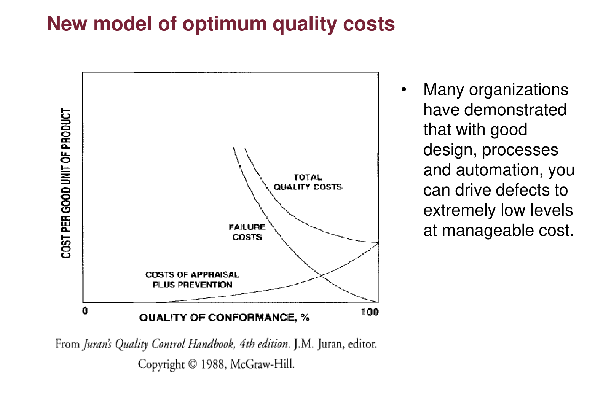

*Figure 2: New model of optimum quality costs, Lecture 11, slide 35.*

**Reading the graph:** in the new model, prevention and appraisal costs **do not explode** near 100% conformance, because good design, capable processes and automation drive defects down cheaply. Total cost keeps falling all the way to 100% conformance, so the optimum is **zero defects**. This is the economic argument behind six sigma.

---

## 4. Statistical Process Control: Natural vs Assignable Variation

**SPC** is a data-driven method for distinguishing **natural (random)** variation from **assignable** variation (slide 37).

| Random (natural, common-cause) | Assignable (special-cause) |
| :--- | :--- |
| Many tiny, inherent causes | An identifiable source with significant impact |
| Small fluctuations in raw material; gradual tool wear; temperature, humidity; operator reaction time | Equipment failure; lost calibration; changeover mistake; new supplier; operator error; power surge |
| Leave the process alone | Find the cause and remove it |

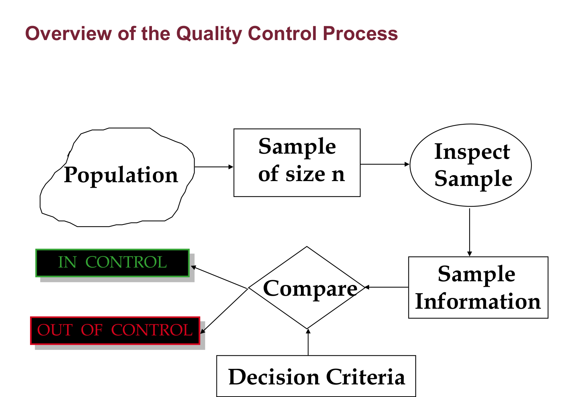

*Figure 3: Overview of the quality control process, Lecture 11, slide 38.*

**Reading the loop:** take a **sample of size $n$** from the population, **inspect** it, turn it into **sample information** (mean, range, fraction defective), **compare** it with the **decision criteria** (control limits), and conclude **in control** or **out of control**.

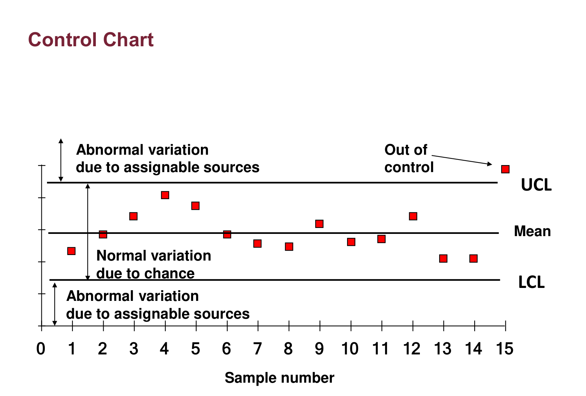

*Figure 4: Control chart, Lecture 11, slide 39.*

**Reading the chart:** points between the **UCL** and **LCL** scattered around the mean are normal variation due to chance. A point above the UCL or below the LCL signals **abnormal variation due to an assignable source**.

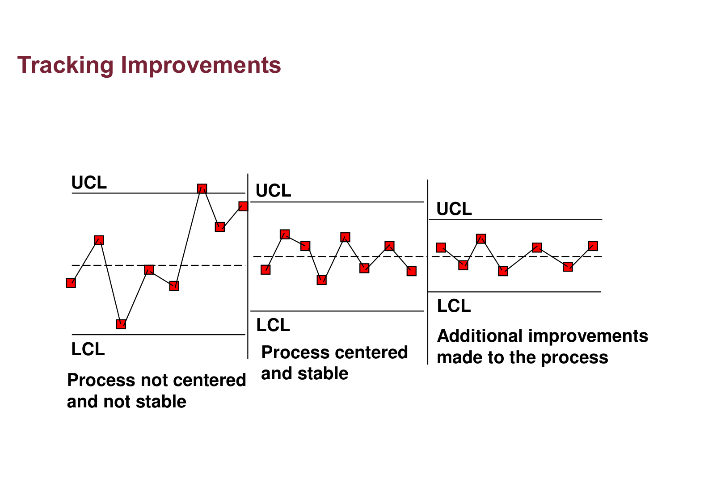

*Figure 5: Tracking improvements, Lecture 11, slide 40.*

**Reading the three panels:** (left) the process is not centred and not stable, with points outside the limits; (middle) after removing assignable causes it is centred and stable; (right) further improvements **narrow the limits**, meaning less natural variation. Control charts both detect problems and document improvement.

> **From the textbook (Hicks, §8.10): the seven basic SPC tools.** Flowchart, cause-and-effect (fishbone) diagram, data collection (check) sheet, Pareto analysis, histogram, scatter plot, and designed experiments. The control chart is the monitoring tool that ties them together.

---

## 5. The Normal Distribution Refresher

Control limits rest on the normal distribution: symmetric and bell-shaped, with mean = median = mode at the centre.

* Variance: $\sigma^{2} = \dfrac{\sum (X - \mu)^{2}}{n}$. For 1, 2, 3: mean 2, variance $\frac{1 + 0 + 1}{3} = 0.667$.
* Standardising: $Z = \dfrac{X - \mu}{\sigma}$ is the number of standard deviations from the mean. A score of 70 with mean 50 and $\sigma = 10$ is $Z = 2$.

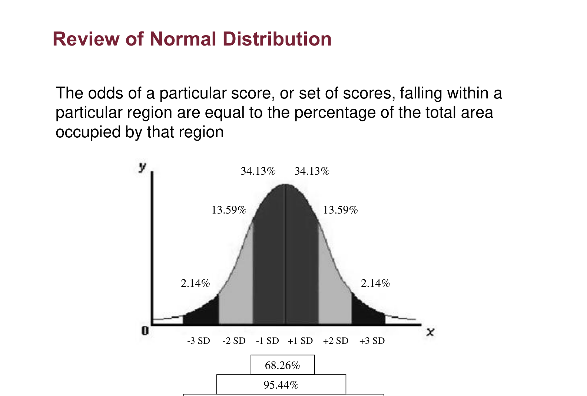

*Figure 6: Review of the normal distribution, Lecture 11, slide 45.*

| Range | Area inside |
| :--- | :--- |
| $\mu \pm 1\sigma$ | 68.26% |
| $\mu \pm 2\sigma$ | 95.44% |
| $\mu \pm 3\sigma$ | **99.72%** |

So **3σ control limits** contain 99.72% of points from a stable process: a point outside is very unlikely to be chance (about 3 in 1,000).

---

## 6. Control Charts for Variables: X-bar and R

For **measured** (continuous) data, two charts are kept together: the **$\bar X$ chart** monitors central tendency, and the **$R$ chart** monitors variability.

$$\bar X\ \text{chart:}\quad \bar{\bar X} \pm A_2\bar R, \qquad R\ \text{chart:}\quad LCL = D_3\bar R,\ \ UCL = D_4\bar R, \qquad \hat\sigma = \frac{\bar R}{d_2}$$

where $A_2$, $D_3$, $D_4$, $d_2$ depend on the sample size $n$.

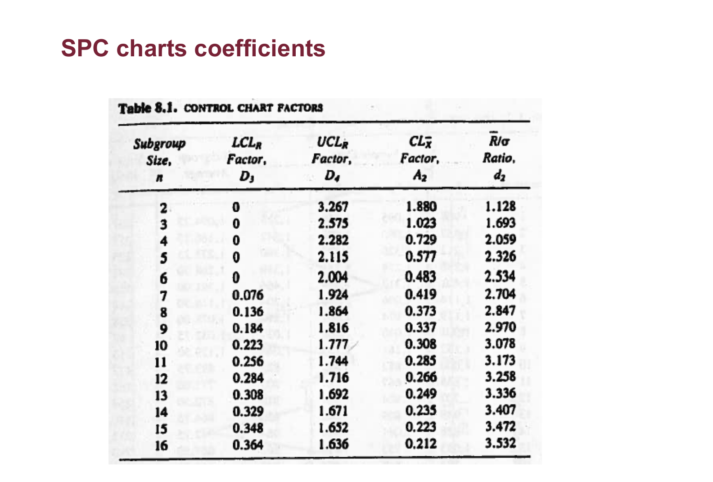

*Figure 7: SPC chart coefficients, Lecture 11, slide 50.*

**Reading the table:** find the row for your sample size $n$, then read $A_2$ (for the $\bar X$ limits), $D_3$ and $D_4$ (for the $R$ limits) and $d_2$ (to estimate σ). For $n = 4$: $A_2 = 0.729$, $D_3 = 0$, $D_4 = 2.282$, $d_2 = 2.059$.

### Lecture example: soft-drink fill weights (slides 56–57)
$n = 20$, $\bar{\bar X} = 16$ oz, $\bar R = 0.4$ oz, $A_2 = 0.18$, $D_3 = 0.41$, $D_4 = 1.59$.

$$UCL_{\bar X} = 16 + 0.18(0.4) = 16.07, \qquad LCL_{\bar X} = 16 - 0.18(0.4) = 15.93$$

$$UCL_R = 1.59(0.4) = 0.636, \qquad LCL_R = 0.41(0.4) = 0.164$$

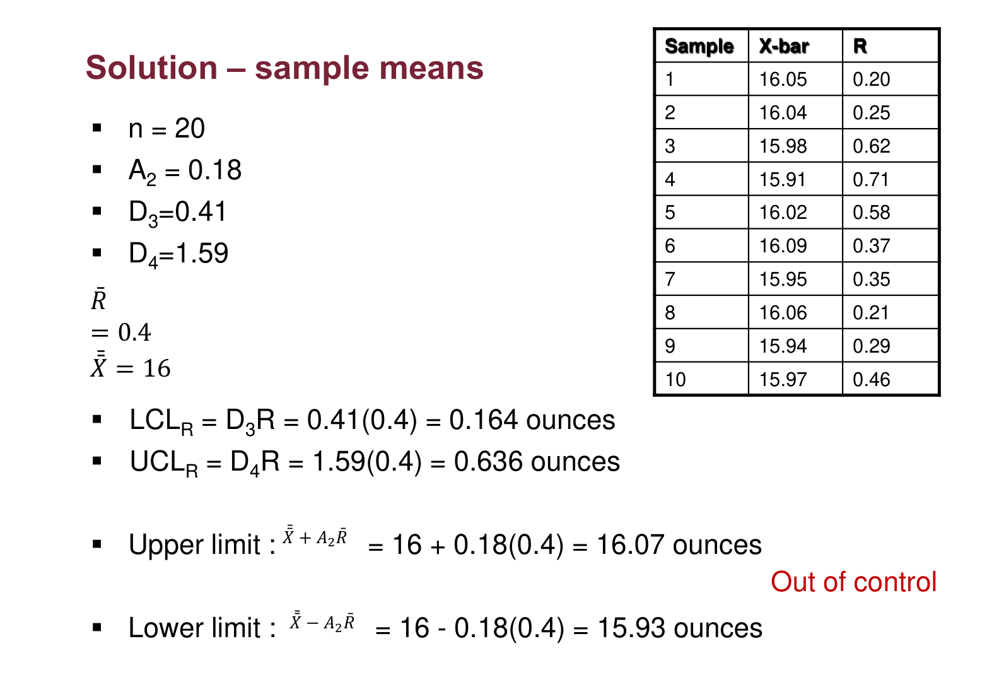

*Figure 8: Solution: sample means, Lecture 11, slide 57.*

**Reading the result:** sample 4 ($\bar X = 15.91$, below 15.93, and $R = 0.71$, above 0.636) and sample 6 ($\bar X = 16.09$, above 16.07) are **out of control**; the filling process needs investigation.

### Lecture example: loan processing times (slide 58)
Five samples of $n = 4$: $\bar{\bar X} = 12.11$ min, $\bar R \approx 0.05$ (exactly 0.046), $A_2 = 0.729$, $D_4 = 2.282$:

$$\bar X\ \text{limits} = 12.11 \pm 0.729(0.05) = 12.07 \text{ to } 12.14, \qquad UCL_R = 2.282(0.05) = 0.11,\ LCL_R = 0$$

---

## 7. Control Charts for Attributes: the p Chart

For **pass/fail** (discrete) data, the p chart tracks the fraction defective:

$$\bar p \pm 3\sqrt{\frac{\bar p(1 - \bar p)}{n}}$$

### Lecture example: bolts (slides 60–62)
Expected 4% defective, samples of $n = 100$:

$$\sigma_p = \sqrt{\frac{0.04(0.96)}{100}} = 0.0196, \qquad UCL = 4 + 3(1.96) = 9.88\%, \qquad LCL = 4 - 5.88 = -1.88\% \to 0$$

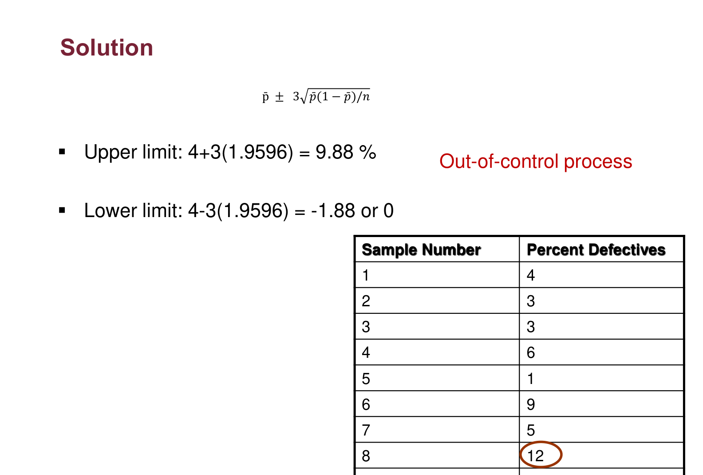

*Figure 9: p chart solution, Lecture 11, slide 62.*

**Reading the result:** day 8 (12% defective) is above 9.88%, so the process is **out of control** on that day. The negative lower limit is replaced by 0 because a fraction defective cannot be negative.

---

## 8. Process Capability and Six Sigma

Control charts ask "is the process **stable**?". Capability asks "is a stable process **good enough** for the specifications?".

$$C_p = \frac{USL - LSL}{6\hat\sigma}$$

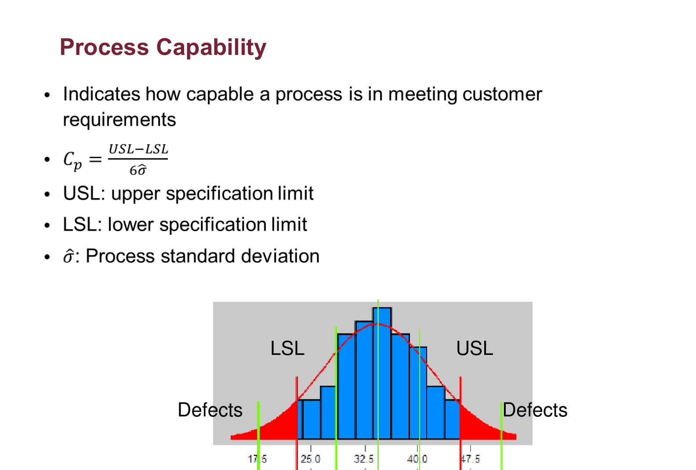

*Figure 10: Process capability, Lecture 11, slide 65.*

**Reading the histogram:** the bars are the process output; LSL and USL are the specification limits set by the designer. Output beyond them (red tails) is defective. $C_p$ compares the width allowed ($USL - LSL$) with the width the process actually uses ($6\sigma$): $C_p > 1$ means the natural spread fits inside the specification.

**Worked example (Fall 2020 final, Best-Wood beams):** specs $24 \pm 2.2$ cm; after removing two out-of-control samples, $\bar R = 1.392$ with $n = 4$ ($d_2 = 2.059$):

$$\hat\sigma = \frac{1.392}{2.059} = 0.676, \qquad C_p = \frac{4.4}{6(0.676)} = 1.08, \qquad k = \frac{2.2}{0.676} = 3.25\sigma$$

### Six sigma
* Aim: virtually error-free performance, **3.4 defects per million** opportunities (slide 66).
* Sigma level: $k\,\sigma = \dfrac{\text{Tolerance}}{2}$, the distance from target to a specification limit in standard deviations.
* Improve the **mean** (production adjustment: re-centre) or the **variance** (system change: reduce spread).

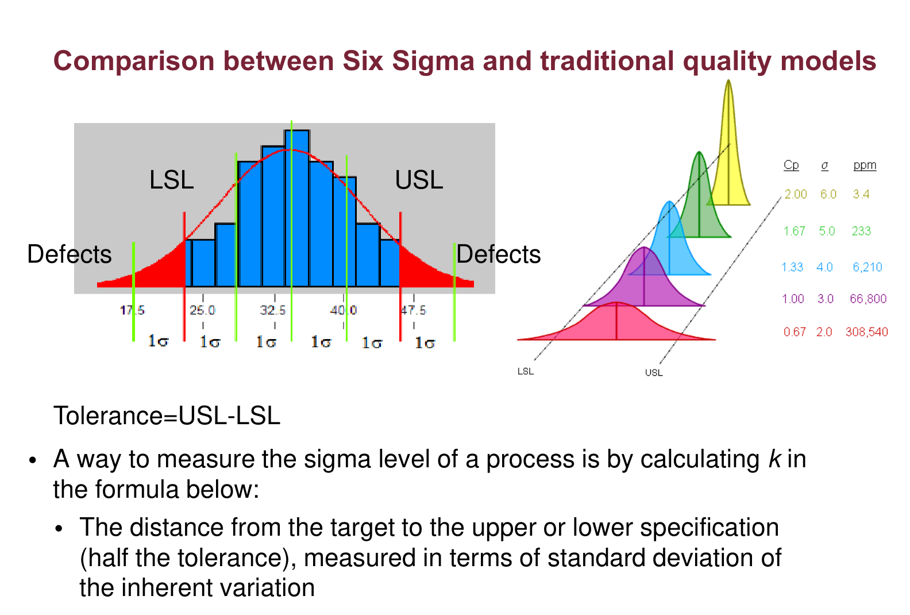

*Figure 11: Six sigma vs traditional quality models, Lecture 11, slide 68.*

**Reading the figure:** the same tolerance ($USL - LSL$) is shown with a wide traditional distribution (3σ fits, so the tails are defective) and a narrow six-sigma distribution (6σ fits inside each half-tolerance, so almost nothing falls outside). The curves on the right show what shifting the mean does: the defect rate rises sharply as the process drifts off-centre.

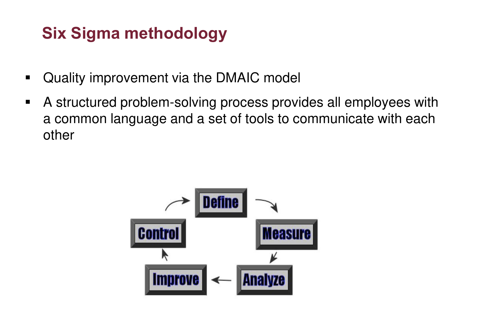

*Figure 12: Six sigma methodology, Lecture 11, slide 70.*

**DMAIC:** **D**efine → **M**easure → **A**nalyze → **I**mprove → **C**ontrol, a structured problem-solving cycle that gives everyone a common language.

---

## 9. Exam Checklist

- [ ] Match each guru to his definition (Juran: fitness for use; Crosby: conformance to requirements…).
- [ ] QC = detection vs QA = prevention.
- [ ] Classify costs: prevention, appraisal, internal failure (before delivery), external failure (after).
- [ ] Classical (optimum below 100%) vs new (optimum at zero defects) cost models.
- [ ] Random vs assignable causes; what a point outside the limits means.
- [ ] $\bar X$ limits $\bar{\bar X} \pm A_2\bar R$; $R$ limits $D_3\bar R$, $D_4\bar R$; $\hat\sigma = \bar R/d_2$.
- [ ] p-chart limits; truncate a negative LCL at 0.
- [ ] $C_p = (USL - LSL)/6\hat\sigma$; $C_{pk} = \min(C_{pu}, C_{pl})$; $C_{pk} = C_p(1-k)$.\n- [ ] $C_p$ vs $C_{pk}$: $C_p$ assumes centered, $C_{pk}$ measures actual capability with drift.\n- [ ] Six sigma = 3.4 defects per million; DMAIC methodology.
