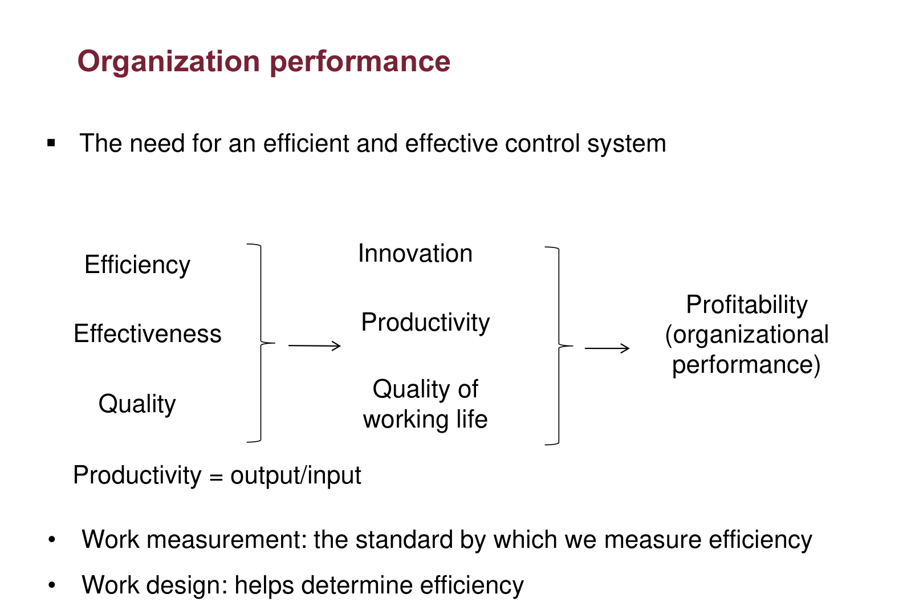
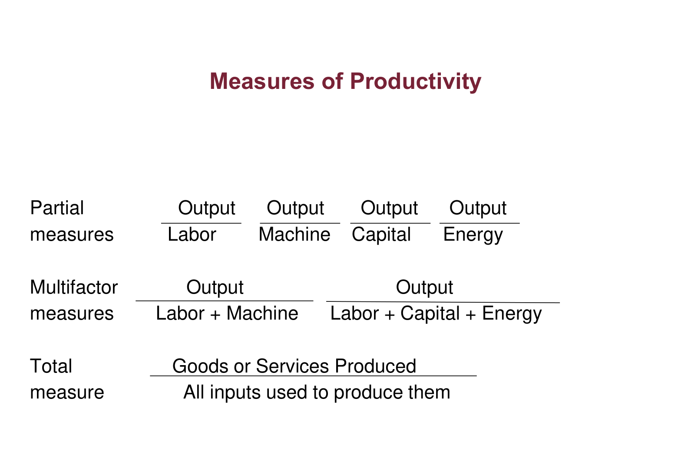
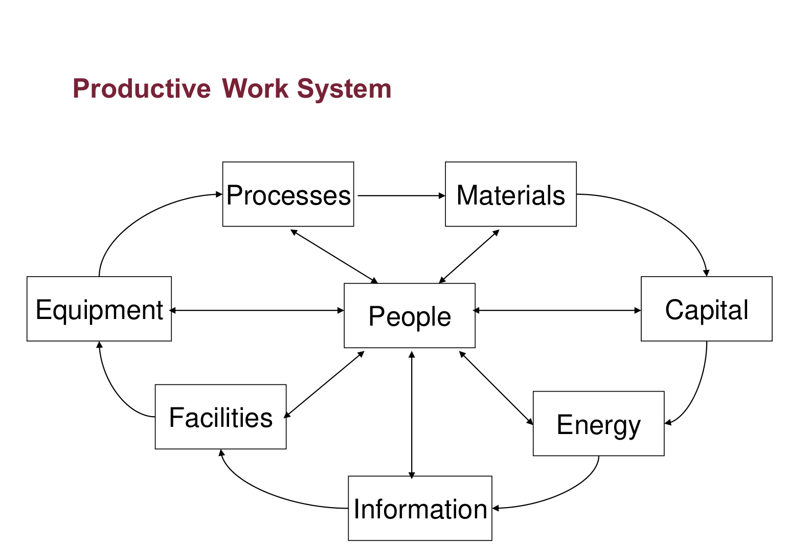
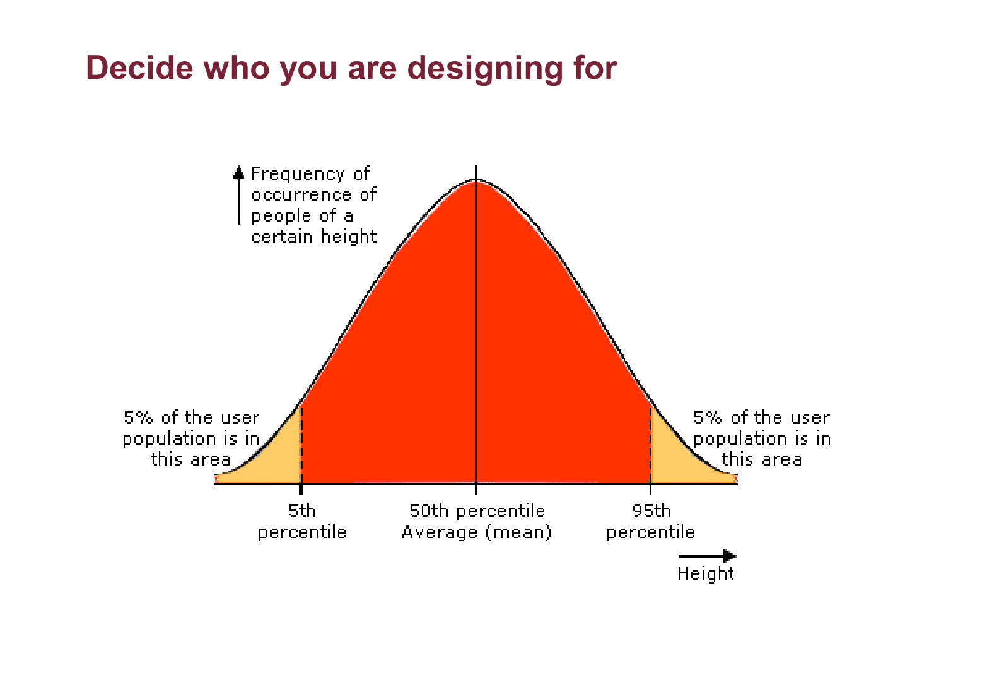
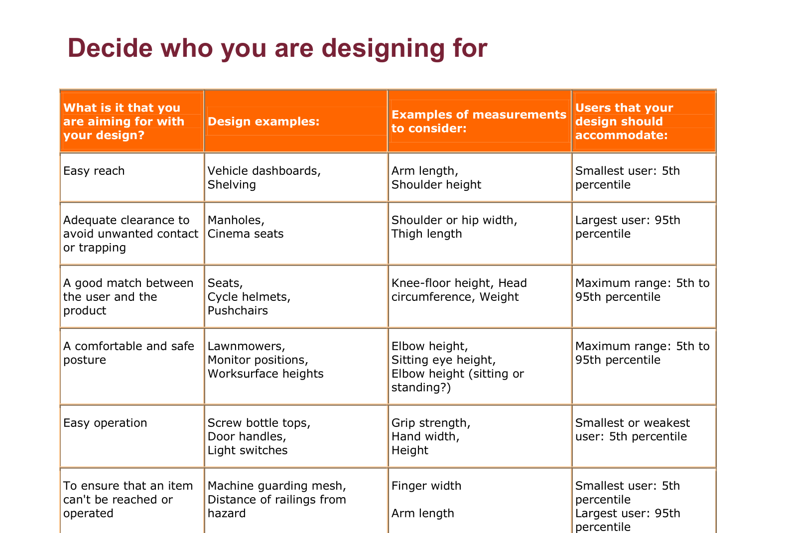
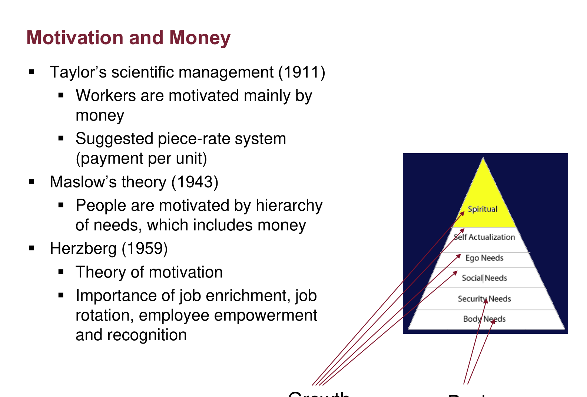
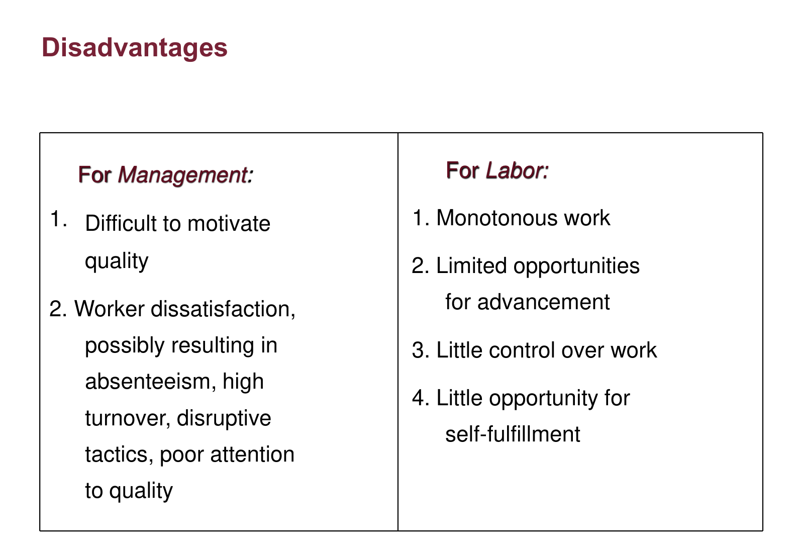
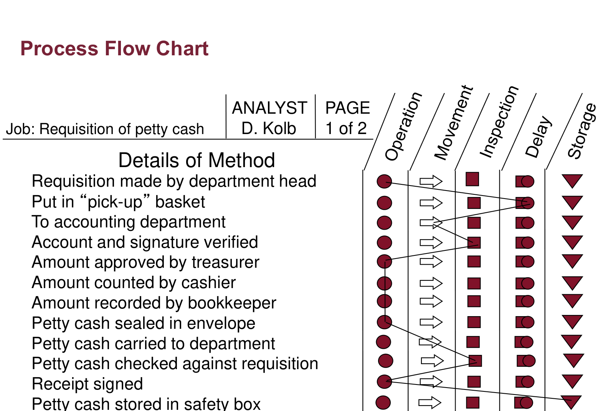
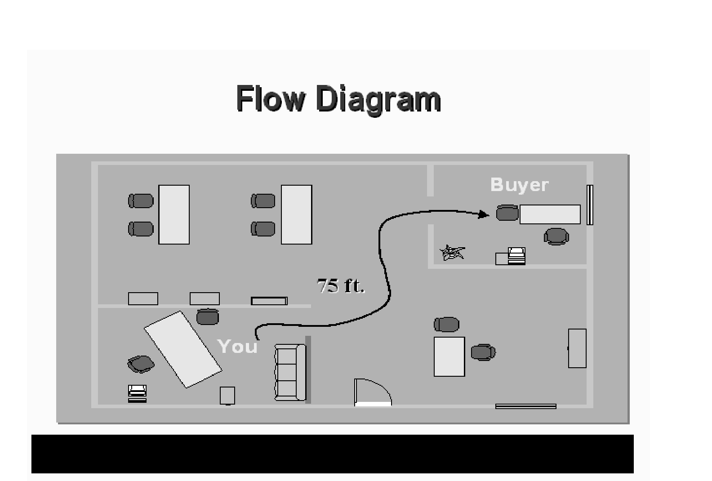
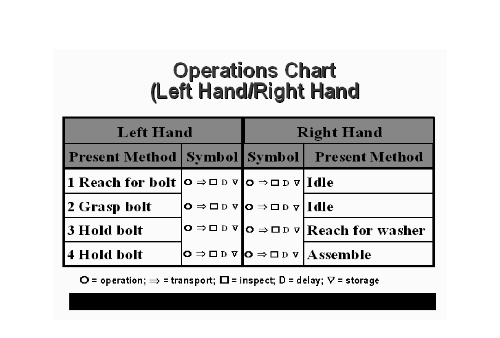

# INDU 211 · Comprehensive Topic Guide (Part 8)
# Chapters 6 & 11: Work Design, Work Measurement & Human Factors
**Concordia University · Department of Mechanical, Industrial & Aerospace Engineering (MIAE)**

*Built on the teacher's Lecture 12 (Chapters 6 and 11, Work Design and Human Factors), with depth from the course textbook (Hicks, Chapter 6: Work Design and Organizational Performance, and Chapter 11: Human Factors).*

---

## Table of Contents
1. [The Problem Work Design Solves](#1-the-problem-work-design-solves)
2. [Productivity and Organisational Performance](#2-productivity-and-organisational-performance)
3. [Human Factors (Ergonomics)](#3-human-factors-ergonomics)
4. [Anthropometry: Designing for Real Bodies](#4-anthropometry-designing-for-real-bodies)
5. [Human Interfaces with the World of Work](#5-human-interfaces-with-the-world-of-work)
6. [Motivation and Pay](#6-motivation-and-pay)
7. [Job Design: Specialisation vs Job Expansion](#7-job-design-specialisation-vs-job-expansion)
8. [Methods Analysis: Charts and Motion Study](#8-methods-analysis-charts-and-motion-study)
9. [Work Measurement: Setting a Standard Time](#9-work-measurement-setting-a-standard-time)
10. [Exam Checklist](#10-exam-checklist)

---

## 1. The Problem Work Design Solves

Suppose a plant must produce **10,000 units a year** (Lecture 12, slide 3). Before it can start, it must answer: how much equipment and how many workers? What is the most efficient work procedure? How do we train operators and pay them? How efficient are we, and what should we charge? Almost every one of these answers depends on knowing **how long the work takes**, which is why the slide ties them all to **time study**.

---

## 2. Productivity and Organisational Performance

*Figure 1: Organization performance, Lecture 12, slide 4.*

**Reading the figure:** efficiency, effectiveness, quality, innovation, productivity and quality of working life all feed **profitability** (organisational performance). **Work measurement** is the standard by which efficiency is measured; **work design** determines it.

$$\text{Productivity} = \frac{\text{output}}{\text{input}}$$

*Figure 2: Measures of productivity, Lecture 12, slide 5.*

| Measure | Formula | Example |
| :--- | :--- | :--- |
| **Partial** | Output ÷ one input | Units per labour-hour; units per machine-hour |
| **Multifactor** | Output ÷ several inputs | Output ÷ (labour + machine) |
| **Total** | All goods and services ÷ all inputs | Whole-plant productivity |

**Example:** 4,000 units with 800 labour-hours → labour productivity $= 4000 / 800 = 5$ units per labour-hour. Inputs must be in one unit: you cannot add labour-hours to dollars.

*Figure 3: Productive work system, Lecture 12, slide 6.*

**Reading the figure:** **people** sit at the centre, connected to processes, materials, capital, energy, information, facilities and equipment. Every component interacts with the human operator, which is why work design and human factors are studied together.

---

## 3. Human Factors (Ergonomics)

> **Definition (International Ergonomics Association, slide 8):** ergonomics (or human factors) is the scientific discipline concerned with the understanding of interactions among humans and other elements of a system, and the profession that applies theory, principles, data and methods to design in order to optimise human well-being and overall system performance.

Human factors matches **system characteristics** to **human characteristics**, and human characteristics come from two sciences (slide 9):

| Physiology (the body) | Psychology (the mind) |
| :--- | :--- |
| Skeleton, skeletal muscles, nervous system, metabolism | Motivation, boredom, stress |
| Lifting, reaching, carrying, hearing, seeing, speaking | "Humans like money, don't want to be bored, have brains, deserve information, fair treatment and respect, and make mistakes" (slide 10) |

**Machines vs humans (slides 13–14):** compare them on range of operations, workpiece size, speed, tolerance capability, energy use and maintenance. Machines win on speed, force and repeatability; humans win on judgement, adaptability and handling the unexpected. Good design gives each the tasks it does best.

> **From the textbook (Hicks, §11.1):** a productive work system combines equipment, facilities, energy, materials, information and people; the industrial engineer designs them to operate together to achieve the outputs desired, and the human component is the one that most often limits performance when it is ignored.

---

## 4. Anthropometry: Designing for Real Bodies

**Anthropometry** is the scientific study of the measurements and proportions of the human body (slide 15). People come in all shapes and sizes, so the first design question is: **who are you designing for?**

*Figure 4: Decide who you are designing for, Lecture 12, slide 17.*

**Reading the bell curve:** a body dimension (e.g. height) is roughly normal. The 50th percentile is the average; 5% of users are below the **5th percentile** and 5% above the **95th**. Designing for the 5th–95th range accommodates 90% of users.

*Figure 5: Design target by purpose, Lecture 12, slide 18.*

| Design goal | Examples | Design for |
| :--- | :--- | :--- |
| **Easy reach** | Dashboards, shelving | Smallest user: **5th percentile** |
| **Adequate clearance** | Manholes, cinema seats | Largest user: **95th percentile** |
| **Good match** | Seats, helmets | Adjustable: 5th–95th range |
| **Comfortable posture** | Work surfaces, monitors | Adjustable: 5th–95th range |
| **Easy operation** | Bottle tops, handles | Weakest user: 5th percentile |
| **Prevent reaching a hazard** | Guard mesh, railings | Finger width: smallest; arm length: largest |

**The logic:** design for the user who is *limited* by the dimension. If the shortest user can reach the shelf, everyone can; if the largest fits through the manhole, everyone does. Designing for "the average person" fails half the population on the critical side.

---

## 5. Human Interfaces with the World of Work

| Interface | Optimise for | Examples |
| :--- | :--- | :--- |
| **Work environment** | Comfort, visibility, access, safety | Desk and dial layout, illumination, temperature, humidity, air |
| **Machines** | Visibility, ingress/egress, reach and grasp, foot pedals, maintenance, strength | Cockpits, vehicle cabs |
| **Information systems** | Access, understanding, presentation | Displays, reports, buzzers; auditory vs visual signals |
| **Organisation** | Job satisfaction, morale, motivation | Job design, reporting, evaluation and reward, training |

**Working conditions (slides 30–31):** safety and security, causes of accidents, noise and vibration, work breaks, temperature and humidity, ventilation, illumination, colour.

---

## 6. Motivation and Pay

*Figure 6: Motivation and money, Lecture 12, slide 25.*

| Theorist | Year | Idea |
| :--- | :---: | :--- |
| **Taylor** (scientific management) | 1911 | Workers are motivated mainly by money → **piece-rate** pay |
| **Maslow** | 1943 | A **hierarchy of needs**; money is only one level |
| **Herzberg** | 1959 | Job enrichment, rotation, empowerment and recognition motivate |

**Reading the pyramid:** Maslow's lower levels (physiological, safety) are **basic needs**; the upper levels (esteem, self-actualisation) are **growth needs**. Pay satisfies the basic levels; the upper ones need meaningful work.

**Monetary incentives (slide 26):** bonuses (cash, stock options), profit sharing, and incentive systems: **measured daywork** (pay based on standard time) or **piece rate** (pay per piece).

---

## 7. Job Design: Specialisation vs Job Expansion

**Work design** specifies the tasks in a job: what, how, why and where (slide 28). Its components are working conditions, job specialisation, behavioural approaches to job design, methods analysis and work measurement.

**Job specialisation** (Adam Smith, 1776, the pin factory) breaks a job into small parts done by specialists.

*Figure 7: Specialization: disadvantages, Lecture 12, slide 34.*

| | For management | For labour |
| :--- | :--- | :--- |
| **Advantages** (slide 33) | Simpler training, high productivity, low wage cost | Low skill needed, few responsibilities, little mental effort |
| **Disadvantages** (slide 34) | Hard to motivate quality; dissatisfaction → absenteeism, turnover, poor quality | Monotony, limited advancement, little control, little self-fulfilment |

**Job expansion** (behavioural approach, slide 35) adds variety to reduce boredom:

| Method | What changes | Direction |
| :--- | :--- | :--- |
| **Job enlargement** | A larger portion of the total task | Horizontal (more tasks of the same kind) |
| **Job enrichment** | More responsibility for planning and coordination | Vertical (more control) |
| **Job rotation** | Workers periodically exchange jobs | Between jobs |
| **Employee empowerment** | Authority to make decisions | Vertical |

> **Exam tip (Fall 2020 final):** management should consider **both** specialisation and job expansion; neither always dominates.

---

## 8. Methods Analysis: Charts and Motion Study

**Work method simplification** is a systematic search for easier, better ways to do a task: "work smart, not hard". It is the essential step **before** time study (there is no point timing a bad method). The five steps (slide 38): select a job → get and record the facts → **question every detail** → develop and test a better method → install and maintain it.

### Flow process chart

*Figure 8: Process flow chart, requisition of petty cash, Lecture 12, slide 40.*

**Reading the chart:** each row is one step of the job; the columns are the five symbols: **operation** (circle), **movement/transport** (arrow), **inspection** (square), **delay** (D) and **storage** (triangle). The analyst marks one symbol per step, and the resulting line shows at a glance how many steps are delays, transports and inspections: the non-value-added ones to attack.

**For every step ask (slide 39):** Is it necessary, or can it be eliminated? Can it be combined with another? Is the sequence right? Can it be improved? Is the right person doing it?

*Figure 9: Flow diagram, Lecture 12, slide 42.*

**Reading the figure:** the flow diagram draws the same steps on the **floor plan**, so long or back-tracking movements are visible as long lines across the room.

### Left-hand–right-hand chart

*Figure 10: Operations chart (left hand/right hand), Lecture 12, slide 44.*

**Reading the chart:** it follows the two hands of **one operator** at **one workstation**, step by step. In the example, the right hand is idle while the left hand reaches for and grasps a bolt: a sign the work is unbalanced. It suits short, repetitive work.

### Motion study (slides 47–48)
Motion study analyses human motions using **therbligs** (basic elemental motions: reach, grasp, move…) and **micro-motion study** (slow-motion film). Guidelines:
* **Eliminate** unnecessary steps and motions, using a hand as a holding device, abnormal motions, idle time.
* **Combine** motions into one continuous curved motion; combine tools and controls.
* **Rearrange** to distribute work evenly between the two hands.
* **Simplify**: reduce eye travel, use momentum, shorten motions.

> **From the textbook (Hicks, §6.2.4):** these are the **principles of motion economy**: use both hands simultaneously and symmetrically, keep tools and materials in fixed, close positions, use gravity-feed bins and drop deliveries, and let fixtures hold the work instead of the hands.

---

## 9. Work Measurement: Setting a Standard Time

**Work measurement** determines the time needed to produce one unit, giving **labour standards** for costing, bids, staffing, production planning, incentive pay and efficiency (slides 49–50).

| Term | Meaning |
| :--- | :--- |
| **Observed (actual) time** | Average of the recorded times |
| **Performance rating (PR)** | How fast the observed operator works relative to normal pace (1.13 = 13% faster than normal) |
| **Normal time** | Time for an average trained operator at a normal pace |
| **Allowances** | Time added for personal needs, fatigue and unavoidable delays |
| **Standard time** | Normal time plus allowances |

$$OT = \frac{\sum x_i}{n}, \qquad NT = OT \times PR, \qquad ST = NT \times AF\ \ (AF = 1 + \text{allowance})$$

### Lecture Example 1 (slides 54–55)
Nine observations total 10.35 min; PR = 1.13; allowance 20%.

$$OT = \frac{10.35}{9} = 1.15\ \text{min}, \qquad NT = 1.15 \times 1.13 = 1.30\ \text{min}, \qquad ST = 1.30 \times 1.20 = 1.56\ \text{min}$$

**Why multiply by PR > 1?** A fast operator finishes quicker than normal, so a normal operator would need **longer**: the normal time is greater than the observed time.

### Lecture Example 2 (slide 56): check the arithmetic!
Elements 15 + 7 + 5 + 8 = 35 min; allowances 12%.
* PR = 115%: $NT = 35 \times 1.15 = 40.25$, $ST = 40.25 \times 1.12 = 45.08$ min.
* PR = 90%: $NT = 35 \times 0.90 = 31.5$ (the slide misprints this as 28.5), so $ST = 31.5 \times 1.12 = 35.28$ min (not 31.92).

> **From the textbook (Hicks, §6.3):** besides direct time study, standards can come from **standard data** (tables of element times reused across jobs) and **predetermined time systems** (such as MTM), which assign times to basic motions, so a job can be timed before it is ever performed.

---

## 10. Exam Checklist

- [ ] Productivity = output/input; partial vs multifactor vs total; consistent units.
- [ ] Human factors rests on physiology and psychology.
- [ ] Percentile rule: reach → 5th, clearance → 95th, adjustable → 5th–95th.
- [ ] Taylor (money, piece rate), Maslow (hierarchy), Herzberg (enrichment).
- [ ] Specialisation pros and cons; enlargement (horizontal) vs enrichment (vertical) vs rotation.
- [ ] Method improvement comes before time study; the five questions on a flow process chart.
- [ ] $OT \to NT = OT \times PR \to ST = NT \times (1 + \text{allowance})$.
