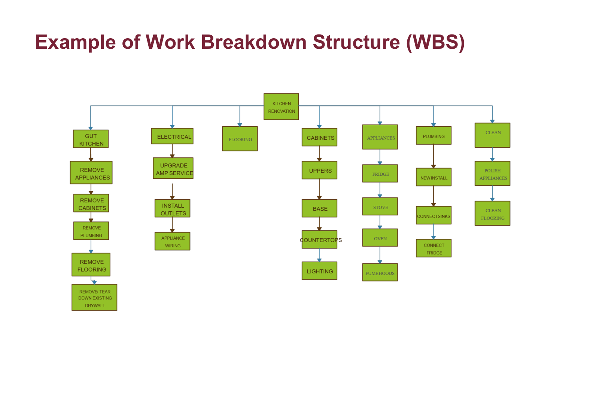
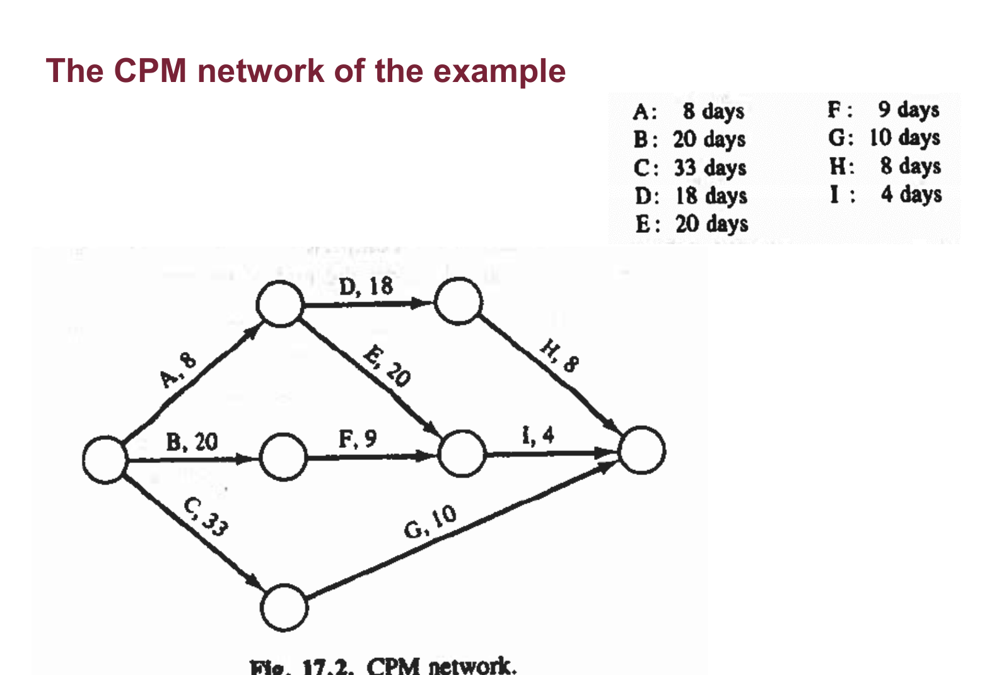
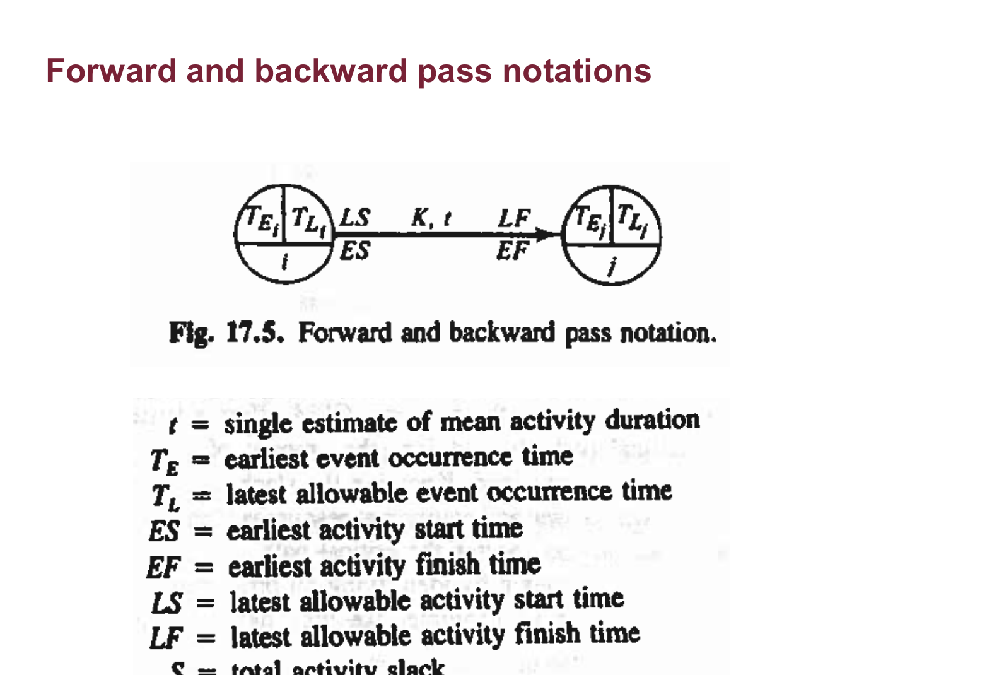
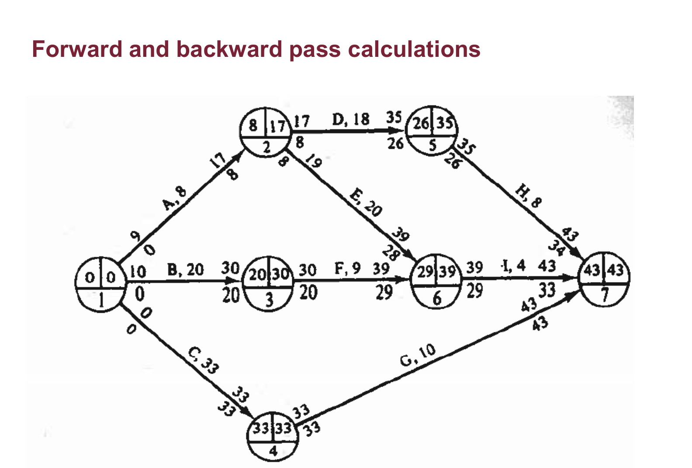
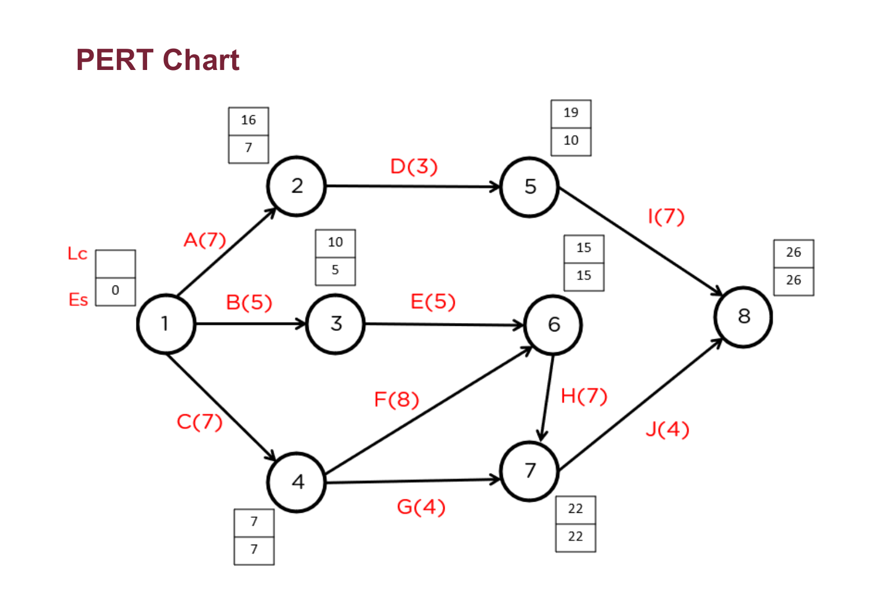

# INDU 211 · Comprehensive Topic Guide (Part 9)
# Chapter 17: Project Management, CPM & PERT
**Concordia University · Department of Mechanical, Industrial & Aerospace Engineering (MIAE)**

*Built on the teacher's Lecture 13 (Chapter 17, Project Management), with depth from the course textbook (Hicks, Chapter 17).*

---

## Table of Contents
1. [What a Project Is](#1-what-a-project-is)
2. [Breaking a Project Down: WBS and Schedules](#2-breaking-a-project-down-wbs-and-schedules)
3. [CPM: The Critical Path Method](#3-cpm-the-critical-path-method)
4. [Forward and Backward Passes, and Slack](#4-forward-and-backward-passes-and-slack)
5. [PERT: Planning Under Uncertainty](#5-pert-planning-under-uncertainty)
6. [Changing the Plan: Crashing and Resources](#6-changing-the-plan-crashing-and-resources)
7. [Exam Checklist](#7-exam-checklist)

---

## 1. What a Project Is

A **project** is a set of activities with **precedence relationships** that must be performed in the proper order; some activities can run concurrently (Lecture 13, slide 3). **Project management** is the planning and organisation of resources to move a project to completion at **minimum cost**. Typical applications are construction and engineering projects.

> **From the textbook (Turner et al., §17.1):** a project should be managed as a **one-time task**, a major undertaking unlikely to be repeated in exactly the same way. Mistakes are costly to fix after the fact, so careful up-front planning pays off.

---

## 2. Breaking a Project Down: WBS and Schedules

*Figure 1: Example of a work breakdown structure (WBS), Lecture 13, slide 5.*

**Reading the WBS:** the whole project sits at the top; each level below splits it into deliverables and then into **work packages** small enough to estimate, assign and schedule. The lowest boxes become the activities in the network.

The plan then becomes a **schedule** (a Gantt-style bar chart, slide 6) and a **network** of activities with durations and precedence (slide 8), with milestones marking key events. Software (slides 15–16) manages the schedule, resources and progress.

---

## 3. CPM: The Critical Path Method

| | CPM | PERT |
| :--- | :--- | :--- |
| **Durations** | Deterministic: one known time per activity | Probabilistic: three estimates per activity |
| **Result** | The critical path and minimum project duration | Expected duration and the **probability** of finishing by a date |

**The critical path** is the **longest** sequence of dependent tasks through the network. Its length is the **minimum project duration**: the project cannot finish sooner than its longest chain.

### Lecture example (slide 10)
* A (8), B (20) and C (33) start the project, concurrently.
* D (18) and E (20) begin when A is complete.
* F (9) follows B; G (10) follows C; H (8) follows D.
* I (4) starts after both E and F.
* The project ends when G, H and I are complete.

*Figure 2: The CPM network of the example, Lecture 13, slide 11 (textbook Fig. 17.3).*

**Reading the network:** circles are events (nodes 1–7), arrows are activities labelled with name and duration. Node 1 is the start and node 7 the finish. Two arrows entering node 6 (E and F) mean I cannot start until **both** are done.

**Every path from start to finish:**

$$\begin{aligned} A \to D \to H &: 8 + 18 + 8 = 34 \\ A \to E \to I &: 8 + 20 + 4 = 32 \\ B \to F \to I &: 20 + 9 + 4 = 33 \\ C \to G &: 33 + 10 = \mathbf{43} \end{aligned}$$

The critical path is **C → G, 43 days**. It is the path with the fewest activities but the longest total, a reminder that "critical" means longest duration, not most tasks.

---

## 4. Forward and Backward Passes, and Slack

*Figure 3: Forward and backward pass notation, Lecture 13, slide 14 (textbook Fig. 17.5).*

| Symbol | Meaning |
| :--- | :--- |
| $t$ | Estimated activity duration |
| $T_E$ | Earliest event occurrence time |
| $T_L$ | Latest allowable event occurrence time |
| $ES$, $EF$ | Earliest activity start and finish |
| $LS$, $LF$ | Latest allowable start and finish |
| $S$ | Total activity slack $= LS - ES = LF - EF$ |

**Forward pass** (left to right): $ES$ of an activity = the largest $EF$ of its predecessors; $EF = ES + t$. The last node's value is the project duration.

**Backward pass** (right to left): $LF$ of an activity = the smallest $LS$ of its successors; $LS = LF - t$, starting from the project duration at the final node.

*Figure 4: Forward and backward pass calculations, Lecture 13, slide 13 (textbook Fig. 17.6).*

**Reading the figure:** each node shows $T_E \,|\, T_L$. At node 7 both are 43. Numbers on each arrow are the activity's times; where $T_E = T_L$ along a path (nodes 1, 4, 7 on C and G) there is no slack: that is the critical path.

| Activity | $t$ | ES | EF | LS | LF | Slack |
| :---: | :---: | :---: | :---: | :---: | :---: | :---: |
| A | 8 | 0 | 8 | 9 | 17 | 9 |
| B | 20 | 0 | 20 | 10 | 30 | 10 |
| **C** | 33 | 0 | 33 | 0 | 33 | **0** |
| D | 18 | 8 | 26 | 17 | 35 | 9 |
| E | 20 | 8 | 28 | 19 | 39 | 11 |
| F | 9 | 20 | 29 | 30 | 39 | 10 |
| **G** | 10 | 33 | 43 | 33 | 43 | **0** |
| H | 8 | 26 | 34 | 35 | 43 | 9 |
| I | 4 | 29 | 33 | 39 | 43 | 10 |

**Interpreting slack:** activity F can slip up to 10 days without delaying the project. If it slips 12 days, path B–F–I becomes $33 + 12 = 45 > 43$ and **becomes the new critical path**.

> **Exam trap (Fall 2020 final):** a critical activity has zero slack, so *any* delay to it delays the project. A non-critical activity becomes critical only when it is delayed by more than its slack, or when the critical path is **shortened** enough that another path becomes the longest.

---

## 5. PERT: Planning Under Uncertainty

**PERT** (Program Evaluation and Review Technique, slide 17) is for projects with uncertain durations (research and development, new technology). Each activity gets three estimates: optimistic $t_o$, most likely $t_m$ and pessimistic $t_p$.

> **From the textbook (Turner et al., §17.4, Eq. 17.1):** the expected time is a weighted average giving the most likely estimate four times the weight of the others:
> $$t_e = \frac{t_o + 4t_m + t_p}{6}, \qquad \sigma^{2} = \left(\frac{t_p - t_o}{6}\right)^{2}$$

*Figure 5: PERT chart, Lecture 13, slide 18.*

**Reading the chart:** each arrow carries an activity and its expected time (e.g. A(7), B(5)); the small boxes at the nodes hold the earliest and latest times. The critical path is found exactly as in CPM, but using the expected times $t_e$.

**Worked example:** $t_o = 4$, $t_m = 6$, $t_p = 14$ days:

$$t_e = \frac{4 + 4(6) + 14}{6} = \frac{42}{6} = 7\ \text{days}, \qquad \sigma = \frac{14 - 4}{6} = 1.67\ \text{days}$$

(The simple average would be 8; PERT weights the most likely value more heavily.)

### Probability of meeting a deadline
The project duration is the sum of the critical-path activities, so (by the central limit theorem) it is approximately **normal** with mean $T_E = \sum t_e$ and variance $\sigma^{2}_{\text{path}} = \sum \sigma^{2}$ along the critical path.

$$Z = \frac{\text{deadline} - T_E}{\sigma_{\text{path}}}$$

> **From the textbook (Turner et al., §17.4), same network as the lecture:** the critical path has expected length 43 days and $\sigma_{\text{path}} = 4.333$ days. For a 47-day deadline:
> $$Z = \frac{47 - 43}{4.333} = 0.923 \quad\Rightarrow\quad P(T \le 47) = 0.822$$
> an **82.2%** chance of finishing in 47 days. The chance of finishing by 43 days (the mean) is 50%. The book warns that with only two critical activities, the normal approximation should not be trusted too much.

---

## 6. Changing the Plan: Crashing and Resources

**Other issues (slide 19):**
* **Adding resources** reduces an activity's time, but a **new critical path (bottleneck)** may emerge.
* **Linear programming** can find the cheapest way to shorten the project.
* **Simulation** handles probabilistic networks.
* **Resource-constrained scheduling** and **monitoring deadlines**.

> **From the textbook (Turner et al., §17.5, Time–Cost Trade-offs):** almost any activity can be shortened with more resources (overtime, extra crew, equipment), which raises **direct cost**. Meanwhile **indirect costs** (management, rentals, overhead, late-delivery penalties) grow with project length. The planner shortens ("crashes") critical activities, cheapest per day first, until the extra direct cost of the next day saved exceeds the indirect cost it avoids. Aerospace contracts often carry daily penalty or bonus clauses, which make this trade-off explicit.

**Why only critical activities?** Shortening a non-critical activity costs money but saves no project time. And after each crash, re-check: once another path becomes as long as the critical path, both must be shortened together.

---

## 7. Exam Checklist

- [ ] Critical path = **longest** path = minimum project duration.
- [ ] List all paths and add durations; identify the critical one.
- [ ] Forward pass (ES = max EF of predecessors) and backward pass (LF = min LS of successors).
- [ ] Slack = LS − ES; critical activities have zero slack.
- [ ] CPM deterministic vs PERT probabilistic; both find a critical path.
- [ ] $t_e = (t_o + 4t_m + t_p)/6$; $\sigma = (t_p - t_o)/6$; $Z = (D - T_E)/\sigma_{\text{path}}$.
- [ ] Crashing: Cost Slope $= (CC - NC)/(NT - CT)$; shorten critical activities with lowest slope only.\n- [ ] Crashing parallel critical paths requires crashing all critical paths simultaneously.\n- [ ] Optimal project duration minimizes Direct Costs + Indirect Overhead Costs.
