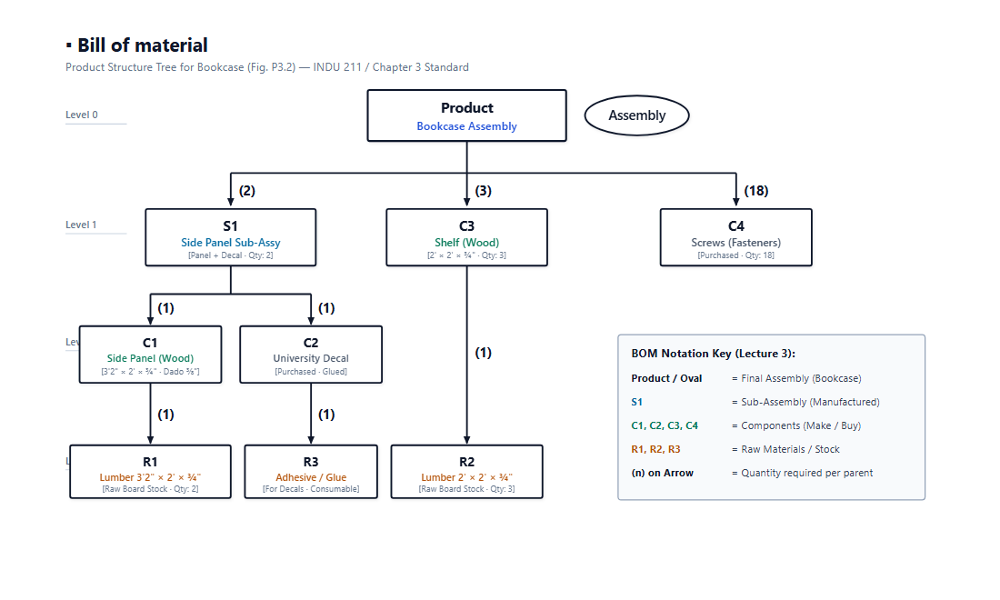
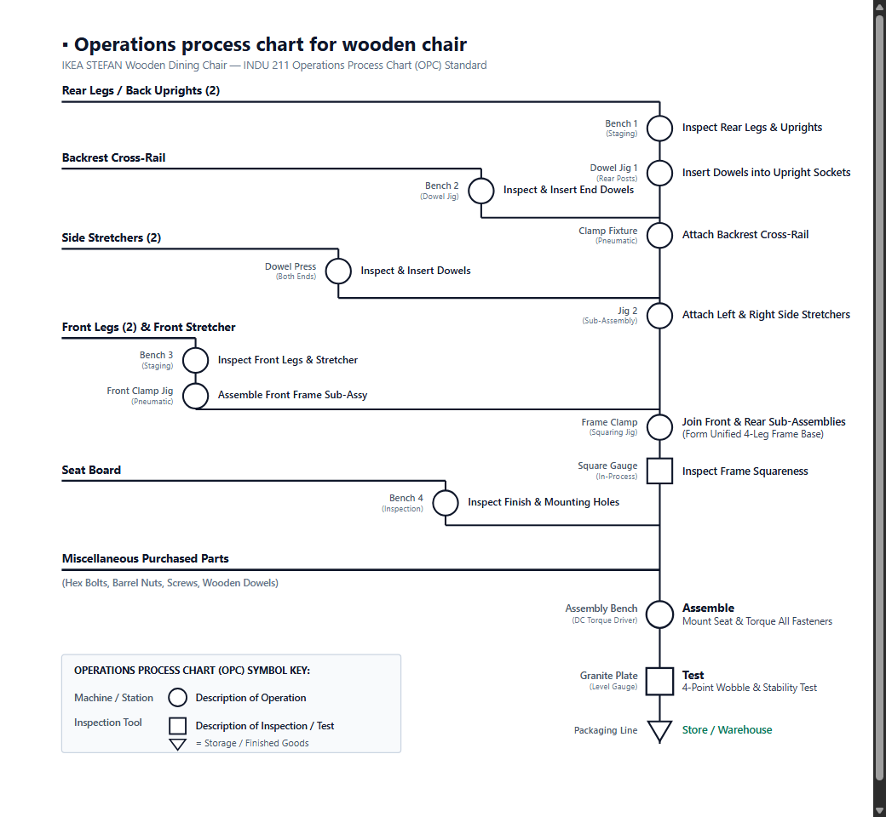

# INDU 211/2X — Assignment #1 Solutions

**Course:** INDU 211/2X — Introduction to Production & Manufacturing Systems  
**Instructor:** Prof. Masoumeh Kazemi  
**Student:** Mohamed Sharafath Shahul Hameed  
**Question #2 Selection:** Option (a) — Assembling an IKEA Wooden Chair  
**Submission Requirement:** Single PDF Document on Moodle  

---

## Question #1: Bill of Materials (BOM) — Bookcase (Fig. P3.2)

### 1.1 Product Description & Specifications
From **Figure P3.2 (Chapter 3, Problem 2)**, the product is a manufactured **wooden bookcase** with the following technical specifications:
- **Sides (2):** Wooden panels measuring $3'2'' \times 2' \times \frac{3}{4}''$ ($38'' \times 24'' \times 0.75''$).
- **Shelves (3):** Wooden panels measuring $2' \times 2' \times \frac{3}{4}''$ ($24'' \times 24'' \times 0.75''$).
- **Joints:** All shelf-to-side joints are dadoed to a depth of **$\frac{3}{8}''$** ($0.375''$) on the inner face of the sides.
- **Fasteners:** Screws (3 per side per shelf) = $3 \times 2 \times 3 = \mathbf{18}$ screws total (purchased standard hardware).
- **Decals:** (2) University Decals glued onto the exterior of the two side panels.

---

### 1.2 Graphical BOM Product Structure Tree (Lecture 3 Standard)

The Bill-of-Materials product structure tree is formatted according to the exact convention in **Lecture 3 on Manufacturing Engineering (Slide 7)**:
- **`Product` / Oval:** Final assembled product (`Assembly`)
- **`S1`:** Sub-assembly (Side Panel Sub-Assembly)
- **`C1`, `C2`, `C3`, `C4`:** Components (Make or Buy)
- **`R1`, `R2`, `R3`:** Raw materials / stock items
- **`(n)` on Arrows:** Quantity required per parent assembly



```
                            ┌─────────┐
                            │ Product │  ( Assembly )
                            └────┬────┘
                                 │
        ┌────────────────────────┼────────────────────────┐
     (2)↓                     (3)↓                    (18)↓
      ┌────┐                   ┌────┐                   ┌────┐
      │ S1 │                   │ C3 │                   │ C4 │
      └─┬──┘                   └─┬──┘                   └────┘
        │                        │                   [Screws: 18]
   ┌────┴────┐                (1)↓
(1)↓      (1)↓                 ┌────┐
 ┌────┐    ┌────┐              │ R2 │
 │ C1 │    │ C2 │              └────┘
 └─┬──┘    └─┬──┘          [Shelf Lumber: 3]
   │         │
(1)↓      (1)↓
 ┌────┐    ┌────┐
 │ R1 │    │ R3 │
 └────┘    └────┘
[Side Lbr] [Glue]
```

---

### 1.3 Master Bill of Materials (BOM) Table

| Level | Code | Item Description | Qty / Parent | Total Qty | Make / Buy | Material / Dimensions / Processing |
|:---:|:---:|:---|:---:|:---:|:---:|:---|
| **0** | **Product** | **Bookcase Assembly** | — | **1** | **Make** | Final assembly of side sub-assemblies, shelves, and screws |
| **1** | **S1** | Side Panel Sub-Assembly | 2 | **2** | **Make** | Left & Right side sub-assemblies (Panel + Decal glued) |
| **2** | **C1** | └ Side Panel (Wood) | 1 | 2 | Make | Lumber $3'2'' \times 2' \times \frac{3}{4}''$, 3 dado grooves cut $\frac{3}{8}''$ deep, 9 screw holes pre-drilled |
| **3** | **R1** | &nbsp;&nbsp;&nbsp;&nbsp;└ Lumber Board | 1 | 2 | Buy | Raw board stock $3'2'' \times 2' \times \frac{3}{4}''$ ($12.67\text{ sq ft}$ total) |
| **2** | **C2** | └ University Decal | 1 | 2 | Buy | Standard adhesive university graphic/emblem |
| **3** | **R3** | &nbsp;&nbsp;&nbsp;&nbsp;└ Adhesive / Glue | 1 | 2 | Buy | Wood / laminate bonding adhesive |
| **1** | **C3** | Shelf | 3 | **3** | **Make** | Lumber $2' \times 2' \times \frac{3}{4}''$, cut to length with square ends |
| **3** | **R2** | └ Lumber Board | 1 | 3 | Buy | Raw board stock $2' \times 2' \times \frac{3}{4}''$ ($12.0\text{ sq ft}$ total) |
| **1** | **C4** | Screws (Wood Fasteners) | 18 | **18** | **Buy** | Standard flat-head wood screws ($3/\text{side}/\text{shelf} = 3 \times 2 \times 3 = 18$) |

---

### 1.4 Raw Material Summary & Calculations

| Raw Material Item | Code | Unit Dimensions | Calculation | Total Quantity Required |
|:---|:---:|:---|:---|:---:|
| **Lumber for Sides** | R1 | $3.167' \times 2' \times 0.75''$ | $2 \text{ panels} \times (3.167' \times 2') = 12.67\text{ sq ft}$ | **$12.67\text{ sq ft}$** ($~13\text{ sq ft}$ gross) |
| **Lumber for Shelves** | R2 | $2' \times 2' \times 0.75''$ | $3 \text{ shelves} \times (2' \times 2') = 12.00\text{ sq ft}$ | **$12.00\text{ sq ft}$** |
| **Total $\frac{3}{4}''$ Lumber** | — | $\frac{3}{4}''$ board thickness | $12.67 + 12.00 = 24.67\text{ sq ft}$ | **$\approx 25\text{ sq ft}$** |
| **Wood Screws** | C4 | Standard wood screws | $3/\text{shelf}/\text{side} \times 3 \times 2$ | **18 screws** |
| **University Decals** | C2 | Glued emblem | $1/\text{side} \times 2\text{ sides}$ | **2 decals** |
| **Wood Glue / Adhesive** | R3 | Commercial adhesive | As required for decal application | **Consumable** |

---

## Question #2: Assembly of an IKEA Wooden Chair (Option a)

### 2.1 — Product Description & Key Assembly Activities

**Product Selected:** IKEA STEFAN Wooden Dining Chair (flat-pack furniture requiring customer/assembly-line production).

#### Main Components Catalog
| # | Component | Qty | Function & Technical Details |
|:---:|:---|:---:|:---|
| 1 | **Seat Board** | 1 | Pre-finished solid pine seat board with pre-drilled counterbored mounting holes |
| 2 | **Front Legs** | 2 | Turned front wooden legs with pre-drilled dowel sockets |
| 3 | **Rear Legs / Back Uprights** | 2 | Full-height uprights forming both the rear legs and backrest support frame |
| 4 | **Backrest Cross-Rail** | 1 | Curved ergonomic horizontal lumbar cross-rail connecting rear uprights |
| 5 | **Side Stretchers** | 2 | Horizontal braces connecting front legs to rear uprights for lateral rigidity |
| 6 | **Front Stretcher** | 1 | Horizontal brace connecting both front legs |
| 7 | **Wooden Dowels** | 12 | Fluted wooden pins for joint alignment and shear strength |
| 8 | **Hex Bolts & Barrel Nuts** | 4–6 | Steel fasteners securing the seat board to the perimeter frame |
| 9 | **Allen Key (Hex Wrench)** | 1 | Assembly tool provided in package for torque application |

---

### 2.2 — Operations Process Chart (OPC) — Lecture 3 Standard

The Operations Process Chart below follows the exact industrial engineering convention demonstrated in **INDU 211 Lecture 3 (Slide 20, "Operations process chart for check valve")**:
- **Main Assembly Trunk (Far Right):** The principal structural member (**Rear Legs / Back Uprights**) forms the vertical backbone on the far right.
- **Sub-Assembly Feeder Lines (Left):** Components enter horizontally from the left and drop down through their respective preparatory operations before merging into the main trunk.
- **Miscellaneous Purchased Parts:** Hardware items (bolts, barrel nuts, screws, dowels) enter horizontally across all lines directly prior to final assembly.
- **Symbol Standard:**
  - Circles ($igcirc$) represent **Operations** (Machine / Station on left, Description on right).
  - Squares ($\square$) represent **Inspections / Tests** (Inspection tool on left, Description on right).
  - Inverted Triangle ($	riangledown$) represents **Storage / Finished Goods**.



```
Rear Legs / Back Uprights (2) ──────────────────────────────┐
                                                            │ Bench 1     ○ Inspect Rear Legs & Uprights
Backrest Cross-Rail ──────────────────────────────┐         │ Dowel Jig 1 ○ Insert Dowels into Sockets
                                                  │ Bench 2 │
                                                  ○ Inspect ├ Attach Backrest Cross-Rail
Side Stretchers (2) ────────────────────────┐     │ & Dowel │
                                            │ D.Press       ├ Attach Side Stretchers
                                            ○ Dowels        │
Front Legs & Stretcher ───────────────┐     │               │
                               Bench 3 ○     │               │
                            Clamp Jig ○─────┴───────────────┼ Join Front & Rear (4-Leg Frame)
                                                            □ Inspect Frame Squareness
Seat Board ───────────────────────────────────────┐         │
                                           Bench 4 ○        │
                                                   └────────┤
Miscellaneous Purchased Parts ──────────────────────────────┤
(Hex Bolts, Barrel Nuts, Screws, Wooden Dowels)             │
                                             Assembly Bench ○ Assemble: Mount Seat & Torque Bolts
                                              Granite Plate □ Test: 4-Point Wobble & Stability Test
                                             Packaging Line ▽ Store / Warehouse
```

#### Operations Process Summary Table
| Step # | Station / Tool | Symbol | Operation / Inspection Description | Output Sub-Assembly |
|:---:|:---|:---:|:---|:---|
| **1** | Bench 1 (Staging) | $igcirc$ | Inspect Rear Legs & Upright Sockets | Verified rear posts |
| **2** | Dowel Jig 1 | $igcirc$ | Insert Dowels into Upright Mortises | Pre-doweled rear posts |
| **3** | Bench 2 (Dowel Jig) | $igcirc$ | Inspect & Insert End Dowels into Back Rail | Ready backrest rail |
| **4** | Clamp Fixture (Pneumatic) | $igcirc$ | Attach Backrest Cross-Rail to Rear Uprights | Upper backrest sub-assy |
| **5** | Dowel Press (Dual Head) | $igcirc$ | Inspect & Insert Dowels into Both Stretcher Ends | Ready side stretchers |
| **6** | Jig 2 (Sub-Assembly) | $igcirc$ | Attach Left & Right Side Stretchers to Rear Posts | 3-sided rear structure |
| **7** | Bench 3 (Staging) | $igcirc$ | Inspect Front Legs & Front Stretcher | Staged front parts |
| **8** | Front Clamp Jig | $igcirc$ | Assemble Front Legs with Front Stretcher | Front frame sub-assy |
| **9** | Frame Clamp (Squaring Jig) | $igcirc$ | Join Front Sub-Assy to Rear Structure | Unified 4-leg base frame |
| **10** | Square Gauge | $\square$ | In-Process Inspection of Frame Squareness & Joint Flushness | Quality-checked frame |
| **11** | Bench 4 (Visual QC) | $igcirc$ | Inspect Seat Board Finish & Align Bolt Holes | Staged seat board |
| **12** | Feeder Line | — | Feed Miscellaneous Purchased Hardware (Bolts, Nuts, Dowels) | Hardware kit staged |
| **13** | Assembly Bench (DC Driver) | $igcirc$ | **Assemble:** Lower seat onto frame, insert bolts into barrel nuts, torque to spec | Fully assembled chair |
| **14** | Granite Surface Plate | $\square$ | **Test:** 4-point flatness, stability, and load wobble test | Certified product |
| **15** | Packaging Conveyor | $	riangledown$ | Protective wrap, pack, and transport to warehouse | Finished goods inventory |

---

### 2.3 — Assembly Line Design & Economic Factors (Chapter 3 Standard)

#### 2.3a — Assembly Line Arrangement (Product Layout)

To mass-produce IKEA-style chairs, a **continuous progressive assembly line** (linear product layout) is arranged with 7 dedicated workstations in series:

```
  ┌────────┐   ┌────────┐   ┌────────┐   ┌────────┐   ┌────────┐   ┌────────┐   ┌────────┐
  │  WS 1  │──▶│  WS 2  │──▶│  WS 3  │──▶│  WS 4  │──▶│  WS 5  │──▶│  WS 6  │──▶│  WS 7  │──▶ Finished
  │ Parts  │   │ Left   │   │ Right  │   │ Frame  │   │ Seat   │   │Torque &│   │ QC &   │    Chair
  │ Kitting│   │ Side   │   │ Side   │   │ Join   │   │ Mount  │   │ Level  │   │Package │
  └────────┘   └────────┘   └────────┘   └────────┘   └────────┘   └────────┘   └────────┘
     ▲ Parts      ▲ Dowels     ▲ Dowels    ▲ Stretchers  ▲ Seat       ▲ Pneumatic  ▲ Boxes
       Kits        Stretcher    Stretcher   Back-rail     Hardware     Drivers      Shrinkwrap
```

| Station | Task Description | Tooling / Fixture | Standard Time |
|:---:|:---|:---|:---:|
| **WS 1** | **Parts Kitting:** Unpack, sort and stage components into mobile fixtures | Gravity bins | 30 sec |
| **WS 2** | **Left Side Assembly:** Insert dowels, join left stretcher to legs | Pneumatic press clamp | 45 sec |
| **WS 3** | **Right Side Assembly:** Mirror of WS 2 for right frame | Pneumatic press clamp | 45 sec |
| **WS 4** | **Frame Consolidation:** Join front & rear frames with stretchers | Squaring clamp jig | **50 sec (Bottleneck)** |
| **WS 5** | **Seat Mounting:** Lower seat board, align holes, insert barrel nuts | Alignment pins | 40 sec |
| **WS 6** | **Fastener Torquing:** Torque all bolts with automatic shut-off driver | Overhead DC driver | 35 sec |
| **WS 7** | **Inspection & Packaging:** 4-point wobble test, pack into box | Granite surface plate | 35 sec |

- **Line Balancing & Cycle Time:** The line bottleneck is WS 4 ($50\text{ s}$), setting the production cycle time to **$C = 50\text{ seconds/chair}$**.
- **Daily Throughput (Capacity):** On a standard 8-hour shift ($28,800\text{ s}$), daily production capacity is:
  $$\text{Daily Output} = \frac{28,800\text{ seconds}}{50\text{ seconds/unit}} = \mathbf{576\text{ chairs/day}}$$

---

#### 2.3b — Economic Factors to Consider (Cost-Volume & Break-Even Analysis)

Based on the **Cost-Volume Relationships** taught in **INDU 211 (Chapter 3, Slides 10–17)**, the total cost of setting up and operating an assembly line follows the linear cost function:

$$\mathbf{Y = a \cdot X + b} \quad \Longleftrightarrow \quad \mathbf{TC = VC \cdot Q + FC}$$

Where:
- $Y$ (or $TC$) = Total Production Cost ($)
- $X$ (or $Q$) = Production Volume (number of chairs)
- $a$ (or $VC$) = Variable Cost per chair ($/unit)
- $b$ (or $FC$) = Fixed Cost ($)

The **4 essential economic factors** to evaluate for this assembly line are:

##### 1. Fixed Costs ($FC$ or $b$) — Capital Investment
These are one-time capital expenditures that must be paid **regardless of how many chairs are produced**:
- **Conveyor system & workstations:** Purchasing and installing the roller conveyor line.
- **Dedicated jigs & pneumatic clamps:** Custom fixtures at WS 2, WS 3, WS 4 to hold chair legs square during joining.
- **Tooling:** Overhead pneumatic screwdrivers and torque drivers.
- **Facility space:** Factory floor space lease, utility setup, and lighting.
- *Estimated Fixed Cost for chair line:* $\mathbf{FC = \$150,000}$.

##### 2. Variable Costs ($VC$ or $a$) — Per-Unit Recurring Costs
These costs increase directly with every chair assembled:
- **Raw materials & components:** Flat-pack chair lumber parts, wooden dowels, hex bolts, barrel nuts (~$\$14/\text{chair}$).
- **Direct labor:** Operator assembly wages distributed per unit (~$\$5/\text{chair}$).
- **Utilities & tool wear:** Electricity for pneumatic compressors, bit replacement (~$\$1/\text{chair}$).
- *Total Variable Cost per unit:* $\mathbf{VC = \$20/\text{chair}}$.

##### 3. Break-Even Point ($BEP$) — Decision Threshold Rule
As established in Lecture 3 (Slide 12), the Break-Even Point determines the minimum sales volume required to recover fixed setup costs:

$$\mathbf{Q_{BEP} = \frac{FC}{P - VC} = \frac{b}{P - a}}$$

Assuming a wholesale selling price of **$P = \$50/\text{chair}$**:
$$Q_{BEP} = \frac{\$150,000}{\$50 - \$20} = \frac{\$150,000}{\$30} = \mathbf{5,000\text{ chairs}}$$

> **Core Decision Rule (INDU 211 Slide 12):**  
> - If **projected market demand is greater than 5,000 chairs ($Q > Q_{BEP}$)**: Setting up the dedicated assembly line is economically justified and profitable.  
> - If **projected demand is less than 5,000 chairs ($Q < Q_{BEP}$)**: The company should **not** invest in the assembly line, because the high fixed costs cannot be recovered.

##### 4. Process Selection & Economies of Scale (Manual Bench vs. Assembly Line)
As shown in INDU 211 Slide 13–15 (Process Comparison):
- **Manual Batch Assembly (Job Shop):** Has very low fixed costs ($FC_1 = \$10,000$), but high variable labor costs ($VC_1 = \$35/\text{chair}$) because one worker builds each chair manually.
- **Continuous Assembly Line:** Has high fixed costs ($FC_2 = \$150,000$), but low variable costs ($VC_2 = \$20/\text{chair}$) due to high specialization and speed.
- **Crossover Volume:**
  $$10,000 + 35 \cdot Q = 150,000 + 20 \cdot Q \implies 15 \cdot Q = 140,000 \implies \mathbf{Q = 9,333\text{ chairs}}$$
- **Conclusion:** For small batches ($Q < 9,333$), manual assembly is cheaper. For mass production ($Q > 9,333$), the dedicated assembly line produces chairs at the lowest total cost per unit due to **Economies of Scale**.

---

*End of Assignment #1 Solution — Prepared for INDU 211/2X Submission*
