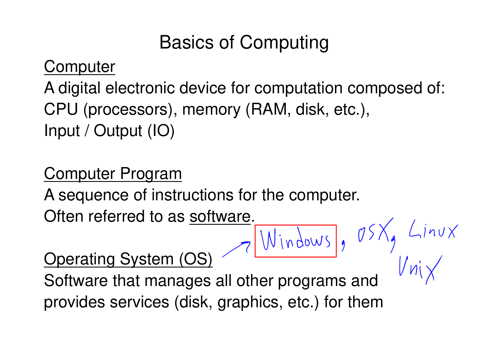
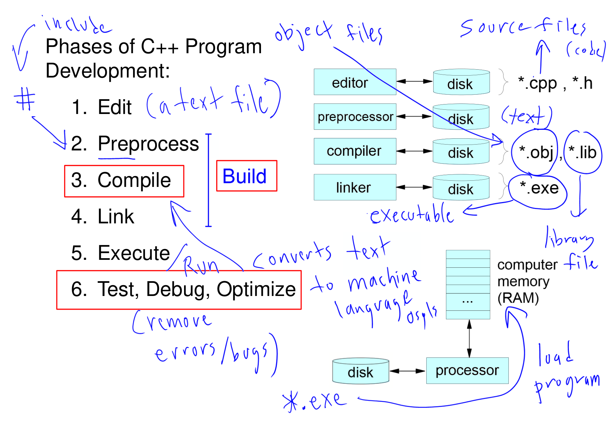
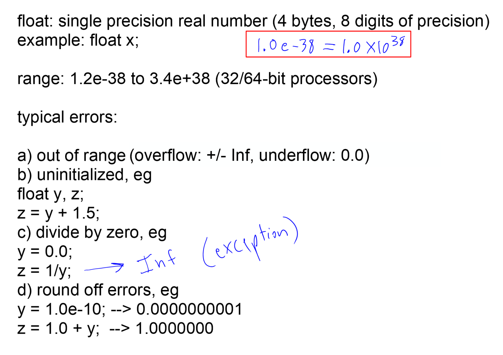
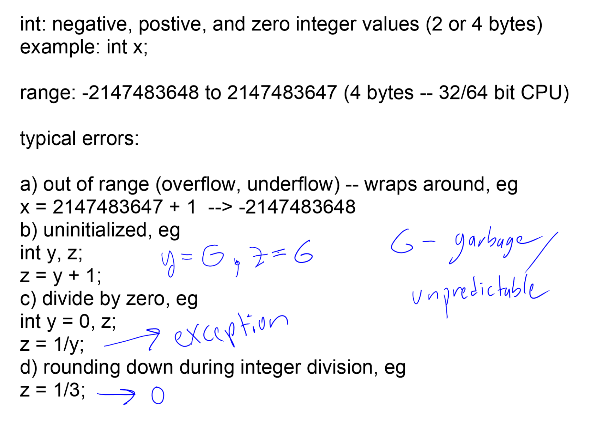

# MIAE 215 · Comprehensive Topic Guide (Part 1)
# C++ Foundations, Memory Architecture & Fundamental Data Types
**Concordia University · Department of Mechanical, Industrial & Aerospace Engineering (MIAE)**

---

## Table of Contents
1. [Digital Computer Architecture & Hardware Hierarchy](#1-digital-computer-architecture--hardware-hierarchy)
2. [The C++ Compilation, Assembly & Linking Toolchain](#2-the-c-compilation-assembly--linking-toolchain)
3. [Virtual Memory Architecture & Segment Layout](#3-virtual-memory-architecture--segment-layout)
4. [Anatomy of a Standard Engineering C++ Program](#4-anatomy-of-a-standard-engineering-c-program)
5. [The Five Fundamental Primitive Data Types & Memory Footprints](#5-the-five-fundamental-primitive-data-types--memory-footprints)
6. [Integer Representation: Two's Complement & Signed vs. Unsigned](#6-integer-representation-twos-complement--signed-vs-unsigned)
7. [Floating-Point Representation: IEEE 754 Standard & Precision Limits](#7-floating-point-representation-ieee-754-standard--precision-limits)
8. [Integer Overflow, Underflow & The Cyclic Wrap-Around Trap](#8-integer-overflow-underflow--the-cyclic-wrap-around-trap)
9. [Console Stream Output: `cout`, Escape Sequences & `endl`](#9-console-stream-output-cout-escape-sequences--endl)
10. [Teacher Lesson Code Walkthrough: `variable_types1.cpp` Deep Dive](#10-teacher-lesson-code-walkthrough-variable_types1cpp-deep-dive)

---

## 1. Digital Computer Architecture & Hardware Hierarchy

To write high-performance engineering simulations, control robotic hardware, or process high-frequency sensor streams, an engineer cannot treat the computer as an abstract "black box." You must understand how high-level code maps directly to physical silicon and memory.



*Figure 1: Basics of computing, Introduction slides, p. 5.*

**Reading the slide:** a **computer** is a digital electronic device made of a CPU (processor), memory (RAM, disk) and input/output. A **program** is a sequence of instructions for it (software), and the **operating system** manages all other programs and provides services such as disk, graphics and networking. The teacher's handwritten examples (Windows, OS X, Linux) are operating systems.

| Component | Role | Speed and size |
| :--- | :--- | :--- |
| **CPU** (ALU + control unit + registers) | Executes instructions and arithmetic | Fastest, tiny storage |
| **RAM** (main memory) | Holds the running program and its variables | Fast, gigabytes, lost at power-off |
| **Disk** | Stores files (.cpp, .obj, .exe) | Slow, terabytes, permanent |
| **System bus** | Carries data, addresses and control signals between them | |

### The von Neumann Architecture
Modern computing platforms operate on the **von Neumann architecture**, characterized by:
1. **CPU (Central Processing Unit)**: The computational brain containing the **Arithmetic Logic Unit (ALU)** for mathematical/logical operations and the **Control Unit (CU)** for fetching and decoding instructions.
2. **Registers**: Extremely fast, small memory cells located directly inside the CPU core (e.g., accumulator, stack pointer, program counter).
3. **RAM (Random Access Memory)**: Primary volatile memory where variables, dynamic structures, and program instructions reside during execution. Every single byte in RAM possesses a unique numerical memory address.
4. **System Bus**: The high-speed physical wire traces interconnecting the CPU, RAM, and external I/O devices (graphics cards, hard drives, sensors, microcontrollers).

> **Key Takeaway for Beginners:**  
> A variable in C++ is simply a **human-readable label** attached to a specific block of bytes at a physical address in RAM. The CPU moves data from RAM into internal registers, performs ALU operations, and writes the resulting state back into RAM.

---

## 2. The C++ Compilation, Assembly & Linking Toolchain

When you click "Build & Run" in an IDE (such as Code::Blocks, CodeLite, or Visual Studio) or invoke `g++` on the command line, four sequential transformations take place before your program executes.



*Figure 2: Phases of C++ program development, Introduction slides, p. 7 (with the teacher's annotations).*

**Reading the slide, phase by phase** (each phase reads from and writes to disk, right-hand column):

| Phase | Tool | Input → output | Teacher's note |
| :---: | :--- | :--- | :--- |
| 1. Edit | Editor | You type → `*.cpp`, `*.h` | "a text file", the source files |
| 2. Preprocess | Preprocessor | Handles `#include` / `#` lines → expanded text | The `#` arrow |
| 3. Compile | Compiler | Text → object file `*.obj` | "converts text to machine language" |
| 4. Link | Linker | `*.obj` + libraries `*.lib` → `*.exe` | "executable" |
| 5. Execute | OS loader + processor | `*.exe` loaded from disk into RAM and run | "load program", "Run" |
| 6. Test, debug, optimise | You | Find and remove errors | "remove errors/bugs" |

Phases 2–4 together are what an IDE calls **Build** (the red box). The object file is machine code that still has unresolved references, which the linker fills in from libraries such as the math library.

### Toolchain Breakdown

| Stage | Tool / Utility | Input File | Output File | Core Functionality |
| :--- | :--- | :--- | :--- | :--- |
| **Preprocessing** | Preprocessor (`cpp`) | `main.cpp`, `headers.h` | `main.i` | Scans for directives starting with `#`. Replaces `#include <iostream>` with the entire text of that header, expands macros, and strips all comments. |
| **Compilation** | C++ Compiler (`cc1plus`) | `main.i` | `main.s` / `main.o` | Checks grammar and type safety. Translates verified C++ source code into native CPU architecture assembly and machine code instructions. |
| **Assembly** | Assembler (`as`) | `main.s` | `main.o` (`.obj`) | Converts assembly mnemonics into raw binary object files containing binary opcodes and relocatable addresses. |
| **Linking** | Linker (`ld`) | `main.o`, `math.lib` | `program.exe` | Stitches together multiple object files and external precompiled libraries (such as `<iostream>`, `<cmath>`). Resolves memory offsets for functions. |
| **Loading** | OS Loader | `program.exe` | RAM Execution | Allocates virtual address space, loads code and static data into RAM, initializes the stack pointer, and begins execution at `main()`. |

> **Teacher Exam Warning / Pitfall:**  
> A **syntax error** (e.g., missing semicolon, undeclared variable) occurs at the **compiler** stage. A **linker error** (e.g., `undefined reference to function_name`, `unresolved external symbol`) occurs when the compiler successfully generated object files, but the linker cannot find the compiled binary implementation of a function you called!

---

## 3. Virtual Memory Architecture & Segment Layout

When your operating system launches a C++ program, it creates a dedicated **Process** with a private 4 GB (on 32-bit systems) or 128 TB (on 64-bit systems) virtual address space partitioned into distinct memory segments:

| Segment (high → low address) | What it holds | Notes |
| :--- | :--- | :--- |
| **Stack** | Local variables, function call frames, return addresses, loop counters | Grows downward; fast; managed automatically |
| *(free space)* | | Stack and heap grow toward each other |
| **Heap** | Dynamically allocated memory (`new`, `malloc`) | Grows upward; lives until freed |
| **BSS** | Global/static variables initialised to zero | |
| **Data** | Global/static variables with explicit initial values | |
| **Text (code)** | The compiled machine instructions | Read-only |

1. **Stack Segment**: Automatically allocated and deallocated as functions are called and return. Every local variable inside `int main()` or user functions lives here.
2. **Heap Segment**: Used when data sizes cannot be known at compile time (e.g., reading an image or laser scan of arbitrary size). Managed manually by the programmer.
3. **Data Segment (.data)**: Stores global variables and `static` variables that have non-zero initial values.
4. **BSS Segment (.bss)**: Stores uninitialized global and `static` variables. The operating system clears this memory block to zero upon startup.
5. **Text Segment**: Stores the compiled native binary machine instructions. This segment is marked **read-only** by the CPU memory management unit (MMU) to prevent code corruption.

---

## 4. Anatomy of a Standard Engineering C++ Program

Let us examine the mandatory structure of every engineering C++ program, line by line:

```cpp
// ==============================================================================
// MIAE 215: Standard Engineering Program Template
// ==============================================================================
#include <iostream>  // Header for standard input/output stream objects (cout, cin)
#include <cstdio>    // Header for standard C library I/O (getchar, printf)
#include <cmath>     // Header for math functions (sin, cos, sqrt, pow, abs)

using namespace std; // Exposes all standard library identifiers to global scope

int main()           // Mandatory program entry point; returns integer exit code
{
    // Local variable declarations (allocated on the runtime Stack)
    int sensor_id = 101;
    double voltage = 4.85;

    // Stream output to console
    cout << "Sensor #" << sensor_id << " Reading: " << voltage << " V\n";

    // Pause console window before termination (vital for Code::Blocks / Windows)
    cout << "\nPress enter to continue...";
    getchar();

    return 0;        // 0 indicates successful execution to the host Operating System
}
```

### Critical Component Analysis
* `#include <iostream>`: The `#` indicates a preprocessor directive. The `<>` directs the preprocessor to search standard system include directories for the stream library.
* `using namespace std;`: Without this statement, every standard library entity requires explicit namespace qualification: `std::cout`, `std::cin`, `std::endl`.
* `int main()`: The entry point function. The operating system passes control to this function upon process startup.
* `return 0;`: By convention in POSIX and Windows, returning `0` signals clean termination without error. Returning a non-zero value (e.g., `return 1;` or `exit(1);`) communicates an error code to the caller.

---

## 5. The Five Fundamental Primitive Data Types & Memory Footprints

A variable in C++ is a **named, typed memory storage cell** in RAM. C++ is a **statically typed** language: the compiler must know the exact data type and exact byte allocation for every variable at compile time.

### Master Primitive Types Matrix

| Data Type | Keyword | Size (Bytes) | Range of Values | Engineering Applications |
| :--- | :--- | :---: | :--- | :--- |
| **Character** | `char` | 1 byte (8 bits) | $-128 \text{ to } +127$ (signed)<br>$0 \text{ to } 255$ (unsigned) | ASCII characters, keyboard input, single-byte raw hardware telemetry. |
| **Integer** | `int` | 4 bytes (32 bits) | $-2,147,483,648 \text{ to } +2,147,483,647$<br>($-2^{31} \text{ to } 2^{31}-1$) | Discrete counting, loop indices, status codes, state machine states. |
| **Single-Precision Float** | `float` | 4 bytes (32 bits) | $\pm 1.18 \times 10^{-38} \text{ to } \pm 3.4 \times 10^{+38}$<br>(~6 to 7 significant digits) | Low-memory embedded buffers, real-time graphics rendering. |
| **Double-Precision Float** | `double` | 8 bytes (64 bits) | $\pm 2.23 \times 10^{-308} \text{ to } \pm 1.80 \times 10^{+308}$<br>(~15 to 17 significant digits) | **Default standard** for mechanical, aerospace, and control simulations. |
| **Boolean** | `bool` | 1 byte (8 bits) | `true` (1) or `false` (0) | Logical conditions, threshold flags, binary sensor triggers. |

```cpp
#include <iostream>
using namespace std;

int main() {
    cout << "sizeof(char)   = " << sizeof(char)   << " byte\n";
    cout << "sizeof(int)    = " << sizeof(int)    << " bytes\n";
    cout << "sizeof(float)  = " << sizeof(float)  << " bytes\n";
    cout << "sizeof(double) = " << sizeof(double) << " bytes\n";
    cout << "sizeof(bool)   = " << sizeof(bool)   << " byte\n";
    return 0;
}
```

> **Key Takeaway for Beginners:**  
> In engineering practice, always use `double` for numerical variables with decimal points unless memory on an embedded microcontroller is severely constrained. `float` accumulates round-off error rapidly during iterative loops and matrix operations.

---

## 6. Integer Representation: Two's Complement & Signed vs. Unsigned

To understand how integers behave under mathematical operations, we must inspect their binary layout in memory.

### The Two's Complement System
In modern CPUs, signed integers are stored using the **Two's Complement** binary representation. In an $N$-bit signed integer:
* The **Most Significant Bit (MSB)** acts as the **Sign Bit**:
  * `0` denotes a positive number or zero.
  * `1` denotes a negative number.
* Range formula for $N$ bits:
  $$-2^{N-1} \le x \le 2^{N-1} - 1$$

For a 1-byte (8-bit) signed integer (`char`):
* Maximum positive value: `01111111` in binary $= +127$
* Minimum negative value: `10000000` in binary $= -128$

```
Decimal Value   Binary Representation (Two's Complement)
---------------------------------------------------------
    +127        0 1 1 1 1 1 1 1   (Largest positive 8-bit integer)
    +2          0 0 0 0 0 0 1 0
    +1          0 0 0 0 0 0 0 1
     0          0 0 0 0 0 0 0 0
    -1          1 1 1 1 1 1 1 1   (All bits set to 1)
    -2          1 1 1 1 1 1 1 0
    -128        1 0 0 0 0 0 0 0   (Most negative 8-bit integer)
```

### Deriving a Negative Number in Two's Complement
To negate any binary number:
1. Invert all bits ($0 \to 1, 1 \to 0$, one's complement).
2. Add $1$ to the resulting binary pattern.

Example: Representing $-5$ in an 8-bit byte:
* $+5 = \texttt{00000101}_2$
* Invert bits: $\texttt{11111010}_2$
* Add 1: $\texttt{11111011}_2 = -5$

---

## 7. Floating-Point Representation: IEEE 754 Standard & Precision Limits

Real numbers with decimal points are fundamentally different from integers: they cannot be stored exactly in a finite number of bits. Modern microprocessors use the **IEEE 754 Standard** for floating-point arithmetic.

| Type | Total size | Sign bit | Exponent bits | Fraction (mantissa) bits | Significant digits | Range (magnitude) |
| :--- | :---: | :---: | :---: | :---: | :---: | :--- |
| `float` | 32 bits (4 bytes) | 1 (bit 31) | 8 (bits 30–23) | 23 (bits 22–0) | about 8 | $1.2\times10^{-38}$ to $3.4\times10^{38}$ |
| `double` | 64 bits (8 bytes) | 1 (bit 63) | 11 (bits 62–52) | 52 (bits 51–0) | about 16 | $2.3\times10^{-308}$ to $1.7\times10^{308}$ |



*Figure 3: float variables, Variable Types I, p. 3.*

**Reading the slide:** a float has 4 bytes and about 8 digits of precision, with range $1.2\times10^{-38}$ to $3.4\times10^{38}$ (the teacher writes $1.0\text{e-}38 = 1.0\times10^{-38}$). Its typical errors: (a) out of range → overflow gives ±Inf, underflow gives 0.0; (b) uninitialised; (c) divide by zero → Inf, not a crash; (d) **round-off**: `z = 1.0 + 1.0e-10` prints 1.0000000 because the $10^{-10}$ is beyond 8 digits.

### Mathematical Formula for IEEE 754 Floating-Point Value:
$$\text{Value} = (-1)^S \times (1 + M) \times 2^{E - \text{Bias}}$$
Where:
* $S$ is the sign bit ($0$ for positive, $1$ for negative).
* $M$ is the fractional mantissa normalized in base-2 ($1.M$).
* $E$ is the biased exponent ($\text{Bias} = 127$ for single precision, $\text{Bias} = 1023$ for double precision).

### Why Floating-Point Numbers Cannot Represent 0.1 Exactly
In base 10, the fraction $1/3$ cannot be represented with finite decimal digits: $0.333333...$  
Similarly, in base 2, fractions like $1/10$ ($0.1_{10}$) produce an **infinite repeating binary fraction**:
$$0.1_{10} = 0.00011001100110011..._2$$
When stored in a 32-bit `float` or 64-bit `double`, the trailing bits are truncated.

> **Teacher Exam Warning / Pitfall:**  
> Because of base-2 truncation, **never check for exact equality with floating-point variables using `==`**!
> ```cpp
> double x = 0.1 + 0.2;
> if (x == 0.3) { // DANGEROUS! Evaluates to FALSE on many compilers!
>     cout << "Equal";
> }
> ```
> Always test using an **epsilon tolerance** ($\epsilon$):
> ```cpp
> if (abs(x - 0.3) < 1.0e-9) { // SAFE ENGINEERING PRACTICE
>     cout << "Approximately Equal within Tolerance";
> }
> ```

---

## 8. Integer Overflow, Underflow & The Cyclic Wrap-Around Trap

Because memory registers have finite bit widths, arithmetic operations that exceed the maximum or minimum representable bounds cause **overflow** and **underflow**.



*Figure 4: int variables, Variable Types I, p. 2 (with the teacher's annotations).*

**Reading the slide:** an `int` holds whole numbers from $-2{,}147{,}483{,}648$ to $2{,}147{,}483{,}647$ (4 bytes on a 32/64-bit CPU). The first typical error is **out of range**: `x = 2147483647 + 1` **wraps around** to $-2{,}147{,}483{,}648$ (INT_MAX + 1 → INT_MIN). The teacher's notes mark the other traps: an uninitialised `y` makes `z = y + 1` **garbage (unpredictable)**; `1/y` with `y = 0` causes an **exception**; and `z = 1/3` rounds **down to 0** (integer division).

### The Circular Number Line
Imagine an 8-bit signed `char` holding the value $127$ (`01111111`). If you add $1$:
$$\texttt{01111111}_2 + \texttt{00000001}_2 = \texttt{10000000}_2$$
In two's complement, `10000000` is **$-128$**! The number wrapped around to the most negative value without producing any runtime error.

```cpp
#include <iostream>
using namespace std;

int main() {
    int max_int = 2147483647; // Largest 32-bit signed integer
    cout << "Initial max_int: " << max_int << "\n";

    max_int = max_int + 1;    // OVERFLOW OCCURS HERE
    cout << "After adding 1:  " << max_int << "\n"; // Prints: -2147483648

    int min_int = -2147483648;
    min_int = min_int - 1;    // UNDERFLOW OCCURS HERE
    cout << "After subtr. 1:  " << min_int << "\n"; // Prints: 2147483647

    return 0;
}
```

> **Memory & Architecture Insight:**  
> The CPU hardware does not throw an exception on integer overflow; it simply updates its internal **Overflow Flag (OF)** in the CPU status register. The program continues executing silently with corrupt, inverted data!

---

## 9. Console Stream Output: `cout`, Escape Sequences & `endl`

Standard C++ provides the output stream object `cout` (defined in `<iostream>`) connected to standard output (`stdout`).

### Stream Insertion Operator (`<<`)
The `<<` operator sends data sequentially into the stream buffer:
```cpp
int age = 20;
double gpa = 3.85;
cout << "Student Age: " << age << " | GPA: " << gpa << "\n";
```

### Essential Escape Sequences

| Sequence | Character | Engineering Usage |
| :---: | :--- | :--- |
| `\n` | Newline (Line Feed) | Moves the cursor to the beginning of the next line. |
| `\t` | Horizontal Tab | Aligns numerical columns in tables. |
| `\\` | Backslash | Prints a literal backslash (e.g., Windows file paths). |
| `\"` | Double Quotation Mark | Prints quotes inside a string literal. |
| `\'` | Single Quotation Mark | Prints a single quote. |

### `\n` vs. `endl` Performance Comparison
* `\n`: Simply writes the newline character into the output stream buffer.
* `endl`: Writes the newline character AND forces an immediate physical **buffer flush** (`fflush`).
In high-frequency loops (e.g., logging $1,000,000$ simulation points), using `endl` will slow down program execution by up to **$50\times$** because it forces the operating system to perform a hardware write operation on every single iteration!

---

## 10. Teacher Lesson Code Walkthrough: `variable_types1.cpp` Deep Dive

In the first lecture code pack, Prof. Gordon provides `variable_types1_examples/program.cpp`. Below is a step-by-step analysis of the lessons taught in that source file:

```cpp
#include <iostream>
#include <cstdio>
using namespace std;

int main()
{
    // 1. Primitive Variable Declarations
    char ch = 'a';
    int i = 7;
    float x = 3.14159f;
    double d = 2.718281828459;
    bool flag = true;

    // 2. Output and Memory Inspection
    cout << "ch = " << ch << " | size: " << sizeof(ch) << " byte\n";
    cout << "i  = " << i  << " | size: " << sizeof(i)  << " bytes\n";
    cout << "x  = " << x  << " | size: " << sizeof(x)  << " bytes\n";
    cout << "d  = " << d  << " | size: " << sizeof(d)  << " bytes\n";
    cout << "flag = " << flag << " | size: " << sizeof(flag) << " byte\n";

    // 3. Integer Division Pitfall
    int num1 = 7, num2 = 2;
    cout << "7 / 2 (integer division) = " << num1 / num2 << "\n"; // Prints 3, NOT 3.5!

    // 4. Pausing Console
    cout << "\nPress enter to finish.";
    getchar();
    return 0;
}
```

### Line-by-Line State Tracing

| Line # | Variable | Value | RAM Address Type | Pedagogical Significance |
| :---: | :--- | :--- | :--- | :--- |
| **8** | `ch` | `'a'` (ASCII 97) | Stack (1 byte) | Characters are internally 8-bit unsigned/signed integers. |
| **9** | `i` | `7` | Stack (4 bytes) | Stored as `00000000 00000000 00000000 00000111`. |
| **10** | `x` | `3.14159` | Stack (4 bytes) | Suffix `f` specifies a single-precision 32-bit IEEE 754 float literal. |
| **11** | `d` | `2.7182818...` | Stack (8 bytes) | Double literal without suffix; preserves 15 decimal digits. |
| **12** | `flag` | `true` (1) | Stack (1 byte) | Prints as `1` by default in stream output. |
| **20** | `num1 / num2` | `3` | Temporary register | Fractional part `.5` is completely truncated because both operands are integers! |
