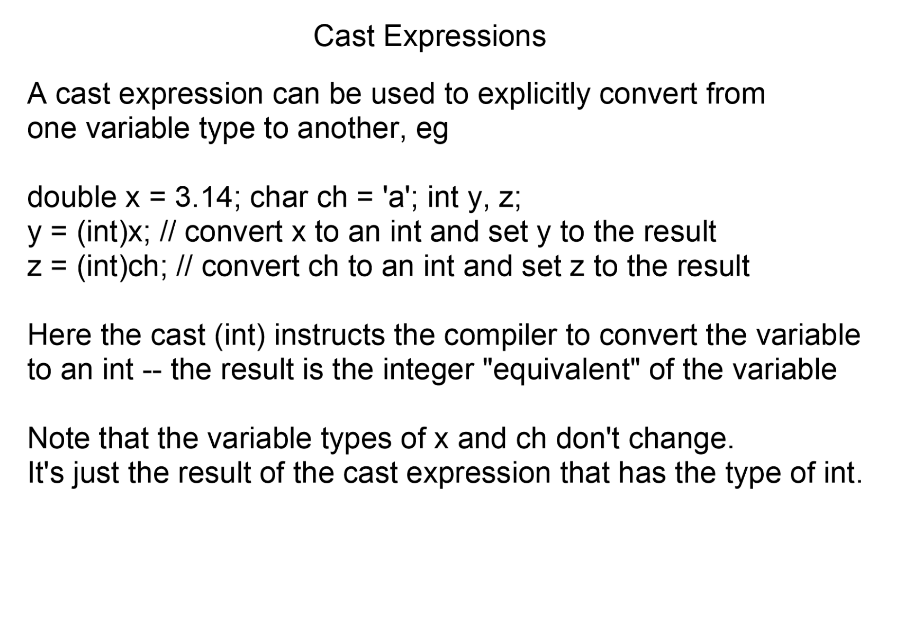
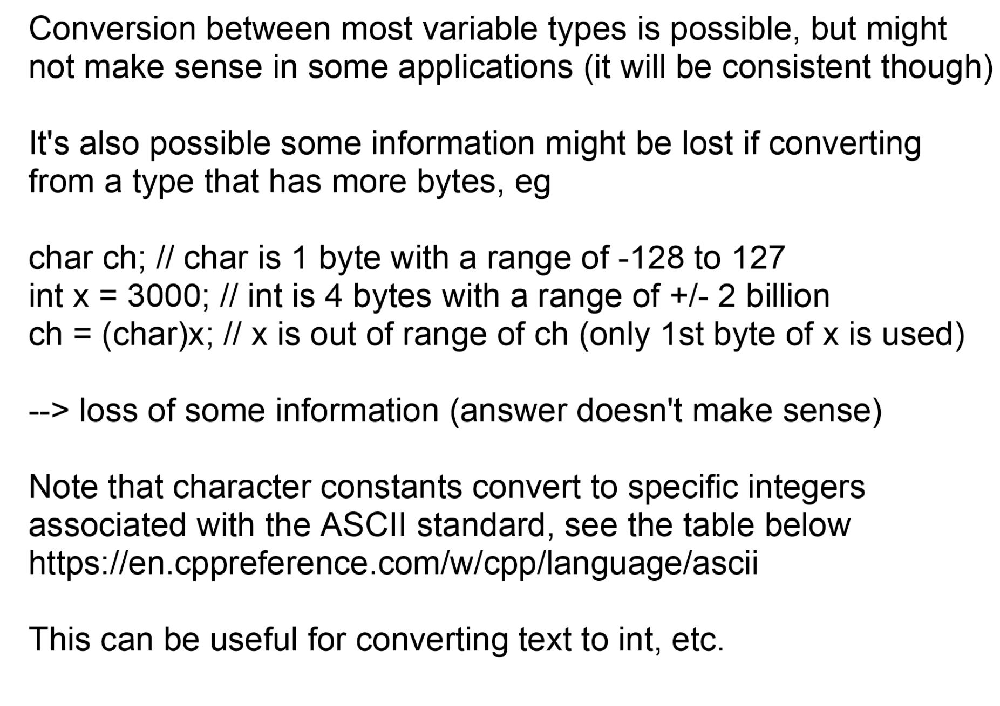
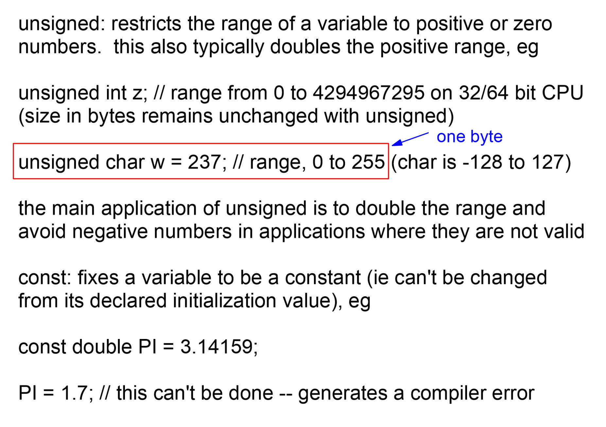

# MIAE 215 · Comprehensive Topic Guide (Part 2)
# Type Casting, Modifiers, Control Flow & Microcontroller Architecture
**Concordia University · Department of Mechanical, Industrial & Aerospace Engineering (MIAE)**

---

## Table of Contents
1. [Type Conversions & Casting Expressions](#1-type-conversions--casting-expressions)
2. [Narrowing Conversions & Byte Truncation](#2-narrowing-conversions--byte-truncation)
3. [The ASCII Standard & Character Arithmetic](#3-the-ascii-standard--character-arithmetic)
4. [Console Stream Input Mechanics: `cin`, Delimiters & Buffer Traps](#4-console-stream-input-mechanics-cin-delimiters--buffer-traps)
5. [Sentinel Loops & Clean Program Termination: `exit(0)`](#5-sentinel-loops--clean-program-termination-exit0)
6. [C++ Type Modifiers: `short`, `long`, `unsigned`, and `const`](#6-c-type-modifiers-short-long-unsigned-and-const)
7. [Physical Constant Definition: Exact Machine $\pi$ via $4\arctan(1.0)$](#7-physical-constant-definition-exact-machine-pi-via-4arctan10)
8. [Hardware Architecture Contrast: PC (x86/x64) vs. Arduino (AVR)](#8-hardware-architecture-contrast-pc-x86x64-vs-arduino-avr)
9. [High-Precision Scientific Output Formatting: `cout << scientific`](#9-high-precision-scientific-output-formatting-cout--scientific)
10. [Teacher Lesson Code Walkthrough: In-Person Lecture Examples 1, 2 & 2b](#10-teacher-lesson-code-walkthrough-in-person-lecture-examples-1-2--2b)

---

## 1. Type Conversions & Casting Expressions

In engineering applications, data from multiple disparate sources must interact: sensor ADC counts (integers), elapsed times (floating-point doubles), and serial communication packets (characters). C++ defines strict rules for converting between data types.

| Direction | Order | Effect |
| :--- | :--- | :--- |
| **Widening** (safe, automatic promotion) | `bool` → `char` → `short` → `int` → `unsigned int` → `float` → `double` | Value is preserved; extra digits or zeros are added |
| **Narrowing** (truncation) | The reverse direction | Digits or bytes are lost; the compiler may warn |



*Figure 1: Cast expressions, Variable Types II, p. 1.*

**Reading the slide:** `y = (int)x;` converts `x = 3.14` to the int 3 and stores it in `y`; `z = (int)ch;` converts `'a'` to its code 97. The teacher stresses that **the variable types of x and ch don't change**: a cast only produces a converted *value*.

### Implicit Promotion vs. Explicit Casting

1. **Implicit Promotion (Widening)**:  
   When operands of differing types appear in an expression, C++ automatically promotes the operand with smaller bit-width to the wider type without precision loss:
   ```cpp
   int count = 5;
   double dt = 0.25;
   double total = count * dt; // count is implicitly promoted to 5.0; result is 1.25
   ```

2. **Narrowing Conversion (Data Loss)**:  
   When copying a larger type into a smaller type, higher-order bits or fractional portions are permanently discarded:
   ```cpp
   double pi = 3.14159;
   int truncated_pi = pi; // Fractional .14159 is discarded; truncated_pi = 3
   ```

3. **Explicit Type Casting**:  
   An engineer can explicitly command the compiler to convert a variable type:
   * **C-Style Cast**: `(type)expression` $\implies$ e.g., `(int)x`
   * **C++ Named Cast**: `static_cast<type>(expression)` $\implies$ e.g., `static_cast<int>(x)`

```cpp
double x = 3.14;
int y = (int)x; // Explicitly forces conversion; y = 3
```

> **Key Takeaway for Beginners:**  
> A cast does NOT change the original variable in RAM. In the code above, `x` remains `3.14` in its original memory location. The cast simply creates a temporary, converted copy inside a CPU register to perform the assignment.

---

## 2. Narrowing Conversions & Byte Truncation

When casting a wide variable into a narrow variable, significant data corruption can occur if the value exceeds the target's capacity.

| | Byte 3 | Byte 2 | Byte 1 | Byte 0 |
| :--- | :---: | :---: | :---: | :---: |
| `int x = 3000` (0x00000BB8) | 0000 0000 | 0000 0000 | 0000 1011 | 1011 1000 |
| `ch = (char)x` keeps only byte 0 | | | | 1011 1000 → **−72** (two's complement) |



*Figure 2: Loss of information in casts, Variable Types II, p. 2.*

**Reading the slide:** `char` holds −128 to 127 in one byte, while `int` holds about ±2 billion in four. Casting 3000 to `char` keeps only the first byte, so the result "doesn't make sense". Conversions are possible between most types, but **information may be lost when converting to a type with fewer bytes**.

### The 3000 to `char` Truncation Trap (Teacher Demonstration)
In `variable_types2_examples/program.cpp`, Prof. Gordon illustrates this exact behavior:
```cpp
int y = 3000;
char ch = (char)y;
cout << "(int)ch = " << (int)ch; // PRINTS: -72
```

#### Why Does 3000 Become -72?
1. The 32-bit binary representation of decimal $3000$ is:
   $$\texttt{00000000 00000000 00001011 10111000}_2$$
2. A signed `char` occupies only **1 byte (8 bits)**. The CPU forcibly truncates the top 24 bits, leaving only the lowest 8 bits:
   $$\texttt{10111000}_2$$
3. Because the MSB is `1`, the number is negative in two's complement.
4. To find its magnitude, invert bits and add 1:
   $$\texttt{01000111}_2 + 1 = \texttt{01001000}_2 = 64 + 8 = 72_{10}$$
5. Therefore, the resulting value stored in `ch` is **$-72$**!

---

## 3. The ASCII Standard & Character Arithmetic

Computers cannot store letters or symbols; they store binary integers. The **American Standard Code for Information Interchange (ASCII)** maps numerical byte values ($0 \text{ to } 127$) to typography.

| ASCII codes | Characters |
| :---: | :--- |
| 48–57 | Digits `'0'` to `'9'` |
| 65–90 | Uppercase `'A'` to `'Z'` |
| 97–122 | Lowercase `'a'` to `'z'` |
| 32 | Space `' '` |
| 10 | Newline `'\n'` |

### The Universal ASCII Offset: $\Delta = 32$
Notice the mathematical relationship between lowercase and uppercase letters:
$$\text{'a'} = 97, \quad \text{'A'} = 65 \implies 97 - 65 = 32$$
$$\text{'b'} = 98, \quad \text{'B'} = 66 \implies 98 - 66 = 32$$
$$\text{'z'} = 122, \quad \text{'Z'} = 90 \implies 122 - 90 = 32$$

Every lowercase letter is located **exactly 32 positions higher** than its uppercase counterpart in memory!

```cpp
// Converting lowercase to uppercase:
char lower = 'd';
char upper = lower - 32; // 'd' (100) - 32 = 'D' (68)

// Converting uppercase to lowercase:
char upper_char = 'M';
char lower_char = upper_char + 32; // 'M' (77) + 32 = 'm' (109)
```

### Converting a Digit Character to an Actual Integer
When reading characters from serial ports or keyboard streams, digits arrive as ASCII codes:
$$\text{'0'} = 48, \quad \text{'1'} = 49, \quad \dots \quad \text{'9'} = 57$$
To extract the true mathematical value of a single digit character `ch`:
```cpp
char ch = '7';
int val = ch - '0'; // '7' (55) - '0' (48) = 7
```

---

## 4. Console Stream Input Mechanics: `cin`, Delimiters & Buffer Traps

In C++, keyboard input is read through the standard input stream object `cin` (defined in `<iostream>`), utilizing the stream extraction operator (`>>`).

| Buffer contents (typed: `42 3.14159 q` + Enter) | Statement | Result |
| :--- | :--- | :--- |
| `42` | `cin >> i;` | `i = 42` (stops at the space) |
| `3.14159` | `cin >> x;` | `x = 3.14159` |
| `q` | `cin >> ch;` | `ch = 'q'` |
| `\n` | *(not read)* | The newline is **left in the buffer** for the next input |

### Stream Delimiters
The `>>` operator skips leading whitespace and stops reading at the next **whitespace delimiter** (space, tab, or newline `\n`).

```cpp
int i;
double x;
char ch;

cout << "Enter an int, a double, and a char: ";
cin >> i >> x >> ch; // Reads tokens separated by spaces or newlines
```

### The `getchar()` Buffer Trap
A common frustration for beginners occurs when combining `cin >>` with `getchar()`:
1. When a user types `42` and presses **Enter**, two items are sent to the input buffer: the characters `'4'`, `'2'`, and the newline character `'\n'`.
2. `cin >> i` consumes `42`, but leaves `'\n'` lingering in the buffer.
3. If you subsequently call `getchar()`, it immediately reads the leftover `'\n'` and does NOT pause the console!
4. **Teacher Solution**: Use two calls to `getchar()` or clear the buffer:
   ```cpp
   getchar(); // Consumes the leftover '\n' from cin
   getchar(); // Pauses the window until the user presses Enter
   ```

---

## 5. Sentinel Loops & Clean Program Termination: `exit(0)`

A **sentinel value** is a special input value that signals an algorithm to terminate immediately.

In C++, immediate process termination from anywhere in the program is achieved via the `exit()` function declared in `<cstdlib>`:
* `exit(0)`: Informs the host operating system that the program concluded successfully.
* `exit(1)`: Informs the operating system of an error or abnormal termination.

```cpp
#include <iostream>
#include <cstdlib> // Required for exit()

using namespace std;

int main() {
    char ch;
    for (int i = 0; i < 10; i++) {
        cout << "Enter command character (or '!' to abort): ";
        cin >> ch;

        if (ch == '!') {
            cout << "Termination sentinel detected. Halting program.\n";
            exit(0); // Immediately exits process
        }

        cout << "Processed command: " << ch << "\n";
    }
    return 0;
}
```

---

## 6. C++ Type Modifiers: `short`, `long`, `unsigned`, and `const`

Type modifiers alter the memory width, sign range, or mutability of fundamental data types.

| Modifier | Effect | Example |
| :--- | :--- | :--- |
| `signed` | Default for integers and chars: negative and positive values | `int x;` |
| `unsigned` | Zero and positive only; **doubles** the positive range | `unsigned char w = 237;` (0 to 255) |
| `short` | Smaller type (fewer bytes) to save memory | `short int x;` (2 bytes) |
| `long` | Larger type for a larger range | `long int y;` |
| `const` | Value fixed at declaration; cannot be changed | `const double PI = 3.14159;` |



*Figure 3: unsigned and const, Variable Types II, p. 6.*

**Reading the slide:** `unsigned int z` ranges from 0 to 4,294,967,295 on a 32/64-bit CPU (the same 4 bytes as `int`, but no negative half). The boxed example `unsigned char w = 237;` is legal because an unsigned char ranges from 0 to 255, while a plain `char` only reaches 127 (the teacher's "one byte" note). `const` fixes a value: `PI = 1.7;` after `const double PI = 3.14159;` is a **compiler error**.

### Comprehensive Type Modifiers Table (32/64-bit PC Architecture)

| Modified Type | Size (Bytes) | Range of Representable Values | Primary Engineering Usage |
| :--- | :---: | :--- | :--- |
| `short int` | 2 bytes | $-32,768 \text{ to } +32,767$ | Compact sensor arrays, memory-limited buffers. |
| `unsigned short int` | 2 bytes | $0 \text{ to } 65,535$ | 16-bit ADC measurements, DAC output commands. |
| `int` | 4 bytes | $-2,147,483,648 \text{ to } +2,147,483,647$ | Default general-purpose integer math. |
| `unsigned int` | 4 bytes | $0 \text{ to } 4,294,967,295$ | Memory byte counts, microsecond timers (`micros()`). |
| `long long int` | 8 bytes | $\approx -9.22 \times 10^{18} \text{ to } +9.22 \times 10^{18}$ | High-precision timestamps, astronomical counts. |
| `unsigned char` | 1 byte | $0 \text{ to } 255$ | Raw hardware communication packets, RGB colors. |
| `const double` | 8 bytes | Fixed constant | Physical invariants ($\pi$, gravity $g$, speed of light $c$). |

### The `const` Qualifier
Declaring a variable `const` instructs the compiler to lock its memory against write operations:
```cpp
const double GRAVITY = 9.80665;
// GRAVITY = 10.0; // COMPILE ERROR: assignment of read-only variable
```

---

## 7. Physical Constant Definition: Exact Machine $\pi$ via $4\arctan(1.0)$

Many engineering textbooks define $\pi$ as `3.14159`. However, hardcoding manual digits can introduce subtle floating-point truncation errors in complex orbital or aerodynamic simulations.

### The Mathematical Identity
From trigonometry:
$$\tan\left(\frac{\pi}{4}\right) = 1.0 \implies \frac{\pi}{4} = \arctan(1.0) \implies \pi = 4 \times \arctan(1.0)$$

In C++ `<cmath>`, the function `atan(1.0)` computes the arctangent of $1.0$ to the maximum floating-point precision of the target CPU:
```cpp
#include <iostream>
#include <cmath>
using namespace std;

int main() {
    const double PI = 4.0 * atan(1.0); // Exact machine-precision PI
    cout.precision(16);
    cout << "Calculated Machine PI = " << PI << "\n";
    // Output: 3.141592653589793
    return 0;
}
```

---

## 8. Hardware Architecture Contrast: PC (x86/x64) vs. Arduino (AVR)

A profound concept taught by Prof. Gordon in `variable_types2` is that **data type sizes are hardware-dependent**.

| Quantity | 32/64-bit desktop PC (x86/x64) | 8-bit Arduino Uno (AVR ATmega328P) |
| :--- | :--- | :--- |
| `sizeof(int)` | 4 bytes (±2.14 billion) | **2 bytes** (−32,768 to +32,767) |
| `sizeof(long int)` | 4 or 8 bytes | 4 bytes |
| `sizeof(double)` | 8 bytes | **4 bytes** (same as float) |

### The Embedded Microcontroller Trap
* On an 8-bit Arduino microcontroller, an `int` is only **2 bytes (16 bits)**, with an upper limit of $+32,767$.
* If an engineer writes a loop `for (int i = 0; i < 50000; i++)` on an Arduino, the loop will **never terminate**! The variable `i` overflows at $32,767$, wraps around to $-32,768$, and loops infinitely!
* On an Arduino, you must explicitly use `long int` (4 bytes) for numbers exceeding $32,767$.
* Furthermore, on standard 8-bit AVR Arduinos, `double` is identical to `float` (both are 4 bytes). Full 64-bit double-precision calculations do not exist without specialized 32-bit ARM microcontrollers (such as STM32 or Teensy).

---

## 9. High-Precision Scientific Output Formatting: `cout << scientific`

By default, `cout` displays only 6 significant digits and switches between decimal and scientific notation unpredictably. In engineering, consistent high-precision display is essential.

```cpp
#include <iostream>
using namespace std;

int main() {
    double val = 3.400000000001;

    cout << scientific;      // Force scientific notation (e.g., 3.400000e+00)
    cout.precision(15);      // Display 15 decimal digits of precision

    cout << "val = " << val << "\n";
    // Output: 3.400000000001000e+00

    return 0;
}
```

---

## 10. Teacher Lesson Code Walkthrough: In-Person Lecture Examples 1, 2 & 2b

Let us examine the exact programs written and demonstrated by Prof. Gordon in the Week 2 lecture sessions:

### Lecture Example 1: Multi-Type Stream Input
```cpp
#include <iostream>
#include <cstdio>
using namespace std;

int main() {
    int i;
    double x;
    char ch;

    cout << "\ninput i ? ";
    cin >> i;

    cout << "\ninput x ? ";
    cin >> x;

    cout << "\ninput ch ? ";
    cin >> ch;

    // Single-line formatted print with comma delimiters
    cout << "\n" << i << " , " << x << " , " << ch << "\n";

    cout << "\nPress enter to continue.";
    getchar();
    return 0;
}
```

### Lecture Example 2b: Interactive Filter & Case Conversion Engine
```cpp
#include <iostream>
#include <cstdio>
#include <cstdlib> // for exit(0)

using namespace std;

int main() {
    char ch;
    int i_ch, delta, i;

    // Dynamically calculate ASCII difference between upper and lower case
    delta = (int)'a' - (int)'A'; // Exactly 32
    cout << "\ndelta = " << delta << "\n";

    for (i = 0; i < 10; i++) {
        cout << "\nInput a char ch (or '!' to exit): ";
        cin >> ch;

        // Check for termination sentinel
        if (ch == '!') {
            cout << "Exiting program via exit(0)...\n";
            exit(0);
        }

        // Convert char to integer for ASCII bounds evaluation
        i_ch = (int)ch;

        // Test if character is inside lowercase ASCII domain [97, 122]
        if ((97 <= i_ch) && (i_ch <= 122)) {
            i_ch = i_ch - delta;   // Subtract 32 to convert to uppercase
            ch = (char)i_ch;       // Cast back to char
            cout << "Converted upper case ch = " << ch << "\n";
        } else {
            cout << "Character is already uppercase or non-alphabetic: " << ch << "\n";
        }
    }

    return 0;
}
```

### Detailed Trace of Lecture Example 2b

| Iteration | Keyboard Input | Variable `ch` | `i_ch` (ASCII) | Lowercase Condition (`97 <= i_ch <= 122`) | Transformation | Final Output |
| :---: | :---: | :---: | :---: | :---: | :---: | :---: |
| **0** | `'g'` | `'g'` | `103` | **TRUE** | $103 - 32 = 71 \implies \text{'G'}$ | `Converted upper case ch = G` |
| **1** | `'R'` | `'R'` | `82` | **FALSE** | None (Already uppercase) | `Character is already uppercase: R` |
| **2** | `'5'` | `'5'` | `53` | **FALSE** | None (Numeric digit) | `Character is already uppercase: 5` |
| **3** | `'!'` | `'!'` | `33` | Sentinel triggered | Calls `exit(0)` | Program halts immediately |
