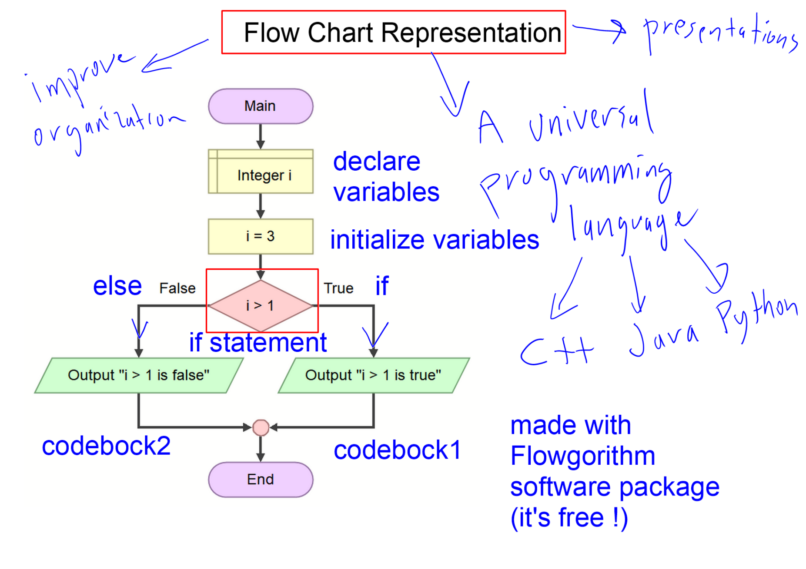
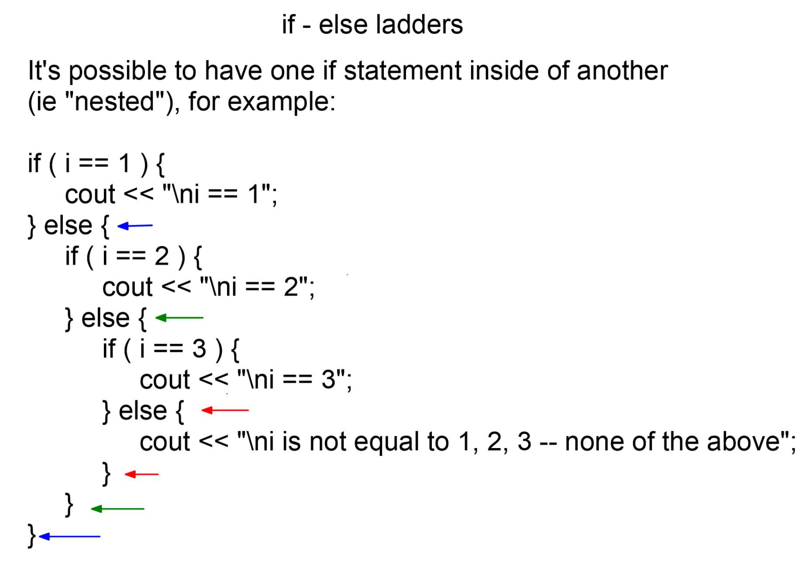
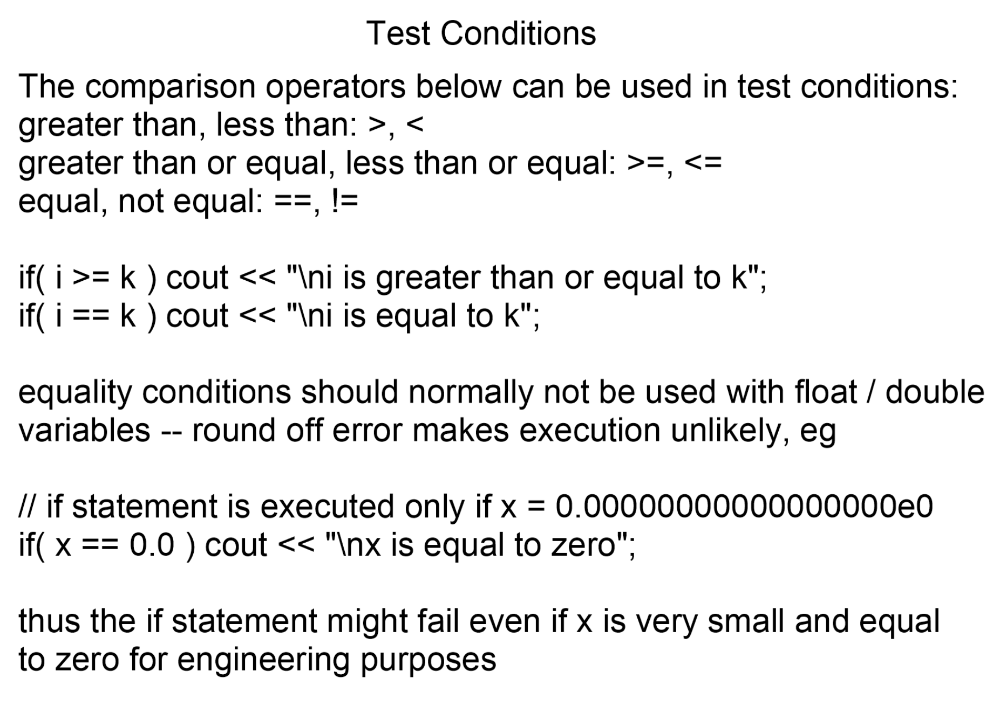
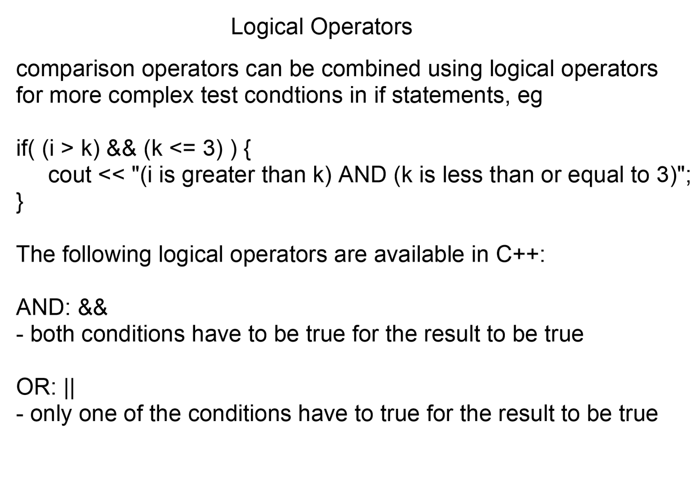
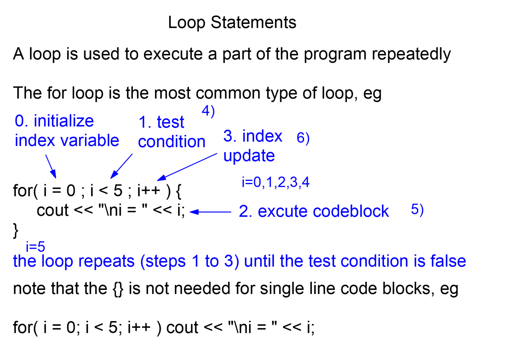
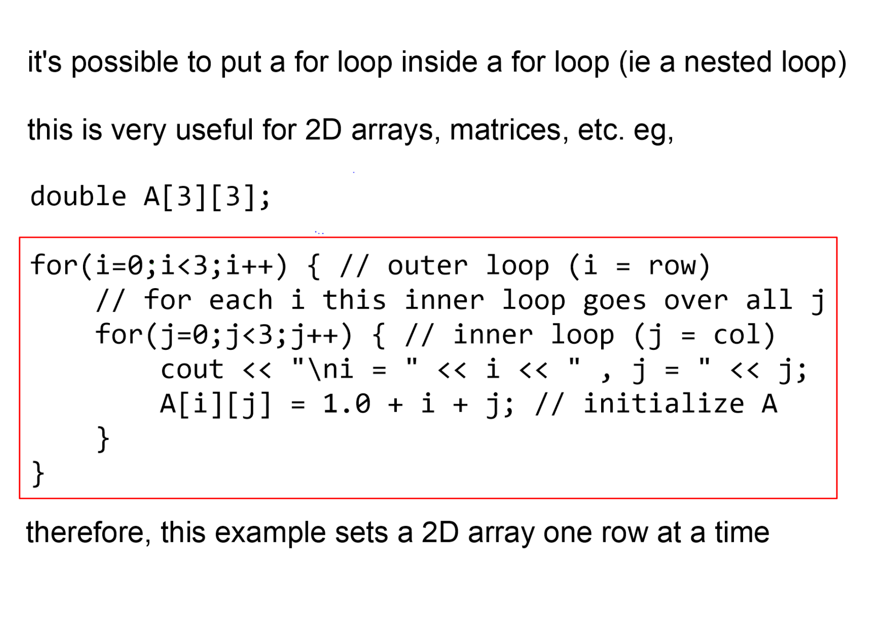

# MIAE 215 · Comprehensive Topic Guide (Part 4)
# Control Statements, Logic Flow, Flowcharts & Robotics Decision Systems
**Concordia University · Department of Mechanical, Industrial & Aerospace Engineering (MIAE)**

---

## Table of Contents
1. [Algorithmic Flowcharts & Visual Logic Modeling](#1-algorithmic-flowcharts--visual-logic-modeling)
2. [Selection Control Structures: Single `if`, Dual `if-else`, and Multi-Way Cascades](#2-selection-control-structures-single-if-dual-if-else-and-multi-way-cascades)
3. [Relational Comparison Operators & Dynamic State Evaluation](#3-relational-comparison-operators--dynamic-state-evaluation)
4. [The Assignment vs. Equality Cardinal Trap](#4-the-assignment-vs-equality-cardinal-trap)
5. [Floating-Point Decision Branching: The Epsilon ($\epsilon$) Tolerance Architecture](#5-floating-point-decision-branching-the-epsilon--tolerance-architecture)
6. [Boolean Logic Gates: AND (`&&`), OR (`||`), and Inversion (`!`)](#6-boolean-logic-gates-and--or--and-inversion-)
7. [Short-Circuit Evaluation & Zero-Division Safety Guards](#7-short-circuit-evaluation--zero-division-safety-guards)
8. [Nested Branches, The Dangling `else` Ambiguity & Scope Braces](#8-nested-branches-the-dangling-else-ambiguity--scope-braces)
9. [Robotics Sensor & Actuator Decision Systems](#9-robotics-sensor--actuator-decision-systems)
10. [Teacher Lesson Code Walkthrough: `control_statements1.cpp` & Assignment 1 Problems](#10-teacher-lesson-code-walkthrough-control_statements1cpp--assignment-1-problems)
11. [Week 3 In-Person Lecture Deep-Dive: Input Stream Processing, Negative Exit Guards & Double Accumulation](#11-week-3-in-person-lecture-deep-dive-input-stream-processing-negative-exit-guards--double-accumulation)
12. [Loop Statements: the for Loop, Exit Values & Nested Loops](#12-loop-statements-the-for-loop-exit-values--nested-loops)

---

## 1. Algorithmic Flowcharts & Visual Logic Modeling

Before writing a single line of C++ code, engineers design and verify algorithmic logic using **flowcharts**. A flowchart provides a formal graphic blueprint mapping decision forks, hardware states, and execution pathways.

| Symbol | Shape | Meaning | Example |
| :--- | :--- | :--- | :--- |
| Terminal | Oval / capsule | Start or stop | Main, End |
| Input/output | Parallelogram | Stream input or output | `cin >> x`, Output |
| Process | Rectangle | Assignment or calculation | `x = 2*x + 1` |
| Decision | Diamond | A test with True/False exits | `x > 0?` |



*Figure 1: Flow chart representation, Control Statements I, p. 8 (with the teacher's annotations).*

**Reading the flowchart:** it starts at **Main**, **declares variables** (`Integer i`), **initialises** them (`i = 3`), then reaches the diamond **if statement** (`i > 5`). The **False** branch runs *codeblock2* (Output "i > 5 is false") and the **True** branch runs *codeblock1*; both rejoin before **End**. The teacher's notes explain why flowcharts matter: they "improve organization", are "a universal programming language" independent of C++, Java or Python, and are drawn with the free **Flowgorithm** package.

### Flowgorithm in MIAE 215
Prof. Gordon provides **Flowgorithm** in `05 - Software & Flowcharts/`:
* `flow_chart1_simple_program.fprg`: Linear sequence execution, variable initialization, and output display.
* `flow_chart2_if_else.fprg`: Conditional decision forks representing robotic obstacle detection and threshold branching.

---

## 2. Selection Control Structures: Single `if`, Dual `if-else`, and Multi-Way Cascades

Selection statements allow a computer program to select between alternate code paths based on Boolean truth evaluations.

### 1. Single Selection: `if`
Executes an enclosed block of statements if and only if the test condition evaluates to `true` (any non-zero value):
```cpp
if (temperature > 100.0) {
    cout << "Warning: Reactor coolant exceeds boiling threshold!\n";
}
```

### 2. Dual Selection: `if-else` (The "Fork in the Road")
Provides an alternative default execution path when the condition evaluates to `false` (zero):
```cpp
if (distance_to_wall > 0.5) {
    motor_forward();
} else {
    motor_stop(); // Default safe action
}
```

### 3. Multi-Way Selection: Cascading `else if`
Evaluates a sequence of mutually exclusive conditions from top to bottom. Execution halts at the first matching branch:
```cpp
if (score >= 90.0) {
    grade = 'A';
} else if (score >= 80.0) {
    grade = 'B';
} else if (score >= 70.0) {
    grade = 'C';
} else {
    grade = 'F';
}
```



*Figure 3: if-else ladders, Control Statements I (part 2), p. 2 (with the teacher's annotations).*

**Reading the slide:** the nested form (an `if` inside each `else`) is drawn with arrows marking each `{ }` pair. It is exactly the same logic as the flat `else if` ladder. The tests run **top to bottom**, the first true one executes its block, and control jumps past the rest; the final `else` is the "none of the above" default.

---

## 3. Relational Comparison Operators & Dynamic State Evaluation



*Figure 4: Test conditions, Control Statements I, p. 2.*

**Reading the slide:** the comparison operators are `>`, `<`, `>=`, `<=`, `==` (equal) and `!=` (not equal). The warning at the bottom is the key one: **equality tests should normally not be used with float/double**, because round-off makes `x == 0.0` fail when `x` is really `1e-20`. That is why Section 5 uses an epsilon tolerance.

Relational operators compare two operands and produce a Boolean result: `true` (1) or `false` (0).

| Operator | Mathematical Meaning | True Example | False Example |
| :---: | :--- | :--- | :--- |
| `>` | Greater Than | `5 > 3` $\implies 1$ | `3 > 5` $\implies 0$ |
| `<` | Less Than | `2 < 8` $\implies 1$ | `8 < 2` $\implies 0$ |
| `>=` | Greater Than or Equal To | `4 >= 4` $\implies 1$ | `3 >= 4` $\implies 0$ |
| `<=` | Less Than or Equal To | `5 <= 7` $\implies 1$ | `9 <= 7` $\implies 0$ |
| `==` | Exactly Equal To | `10 == 10` $\implies 1$ | `10 == 11` $\implies 0$ |
| `!=` | Not Equal To | `7 != 9` $\implies 1$ | `7 != 7` $\implies 0$ |

### Dynamic Variable Re-Evaluation (Teacher Demonstration)
In `control_statements1.cpp`, Prof. Gordon emphasizes that condition evaluations depend on the **exact line of execution** in RAM:
```cpp
int i = 1, k = 2;

if (k > i) {
    cout << "\nk is greater than i"; // EXECUTES (2 > 1 is true)
}

i = 3; // Variable state in RAM changes!

if (k > i) {
    cout << "\nk is greater than i"; // DOES NOT EXECUTE (2 > 3 is false)
}
```

---

## 4. The Assignment vs. Equality Cardinal Trap

By far the most catastrophic, silent bug in C++ programming is confusing the **assignment operator** (`=`) with the **relational equality operator** (`==`).

| | `if (x == 5)` (intended comparison) | `if (x = 5)` (accidental assignment) |
| :--- | :--- | :--- |
| What happens to `x` | Read only | **Overwritten** with 5 |
| Value of the condition | True or false depending on `x` | 5, which is non-zero, so **always true** |
| Result | Correct test | Silent bug: the if-block always runs |

```cpp
int pressure = 0; // Safe pressure

if (pressure = 100) { // BUG: Assigns 100 to pressure! 100 is non-zero (TRUE)!
    emergency_shutdown(); // ALWAYS EXECUTES, even when pressure was 0!
}
```

> **Teacher Exam Warning / Pitfall:**  
> The statement `if (x = 5)` is **syntactically legal C++**! The compiler will NOT produce an error. It overwrites `x` with `5`, and because `5` is non-zero, the `if` block executes every single time. Always double-check for `==` in decision conditions!

---

## 5. Floating-Point Decision Branching: The Epsilon ($\epsilon$) Tolerance Architecture

As demonstrated in Part 1 and Part 3, binary floating-point representation cannot represent decimal fractions exactly.

### The Round-Off Trap in `if` Statements
In `control_statements1.cpp`, Prof. Gordon presents:
```cpp
double x = 1.0e-30;

// NAIVE CONDITION:
if (x == 0.0) {
    cout << "x is zero"; // WILL NEVER EXECUTE!
}
```
Although $10^{-30}$ is physically zero for all engineering measurements, `x == 0.0` requires every single one of the 64 bits to be zero.

### The Epsilon Tolerance Approach
Define a small tolerance constant $\epsilon$ (e.g., $10^{-9}$):
```cpp
double eps = 1.0e-9;

// Checking if x is approximately zero:
if (abs(x) < eps) {
    cout << "x is zero within engineering tolerance\n";
}

// Checking if x is approximately equal to a target (e.g., 5.5):
if (abs(x - 5.5) < eps) {
    cout << "x is approximately equal to 5.5\n";
}

// Checking if x is approximately less than or equal to 5.5:
if ((x < 5.5) || (abs(x - 5.5) < eps)) {
    cout << "x is approximately <= 5.5\n";
}
```

---

## 6. Boolean Logic Gates: AND (`&&`), OR (`||`), and Inversion (`!`)

To evaluate complex engineering states (e.g., "altitude $> 1000$ AND velocity $< 250$"), simple relational comparisons are joined using Boolean logical operators.

| Operator | Name | True when |
| :---: | :--- | :--- |
| `&&` | Logical AND | **Both** conditions are true |
| `\|\|` | Logical OR | **At least one** condition is true |
| `!` | Logical NOT | The condition is false (inverts it) |



*Figure 2: Logical operators, Control Statements I, p. 4.*

**Reading the slide:** comparisons are combined with `&&` and `||` for more complex tests, e.g. `if( (i > k) && (k <= 3) )` prints "i is greater than k AND k is less than or equal to 3". Multiple ANDs and ORs are allowed.

### Comprehensive Truth Table

| Condition $A$ | Condition $B$ | $A \text{ \&\& } B$ | $A \text{ \textbar\textbar } B$ | $!A$ |
| :---: | :---: | :---: | :---: | :---: |
| `false` (0) | `false` (0) | `false` (0) | `false` (0) | `true` (1) |
| `false` (0) | `true` (1) | `false` (0) | `true` (1) | `true` (1) |
| `true` (1) | `false` (0) | `false` (0) | `true` (1) | `false` (0) |
| `true` (1) | `true` (1) | `true` (1) | `true` (1) | `false` (0) |

```cpp
int i = 1, k = 2;

// Multiple logical conditions chained together:
if ((i < k) && (k <= 3) && (i < 10)) {
    cout << "All three physical conditions are simultaneously satisfied.\n";
}
```

---

## 7. Short-Circuit Evaluation & Zero-Division Safety Guards

C++ evaluates logical expressions **strictly from left to right** and employs **short-circuit evaluation**:
* In `A && B`: If $A$ evaluates to `false`, the entire expression cannot possibly be true. **$B$ is never evaluated!**
* In `A || B`: If $A$ evaluates to `true`, the entire expression is already guaranteed true. **$B$ is never evaluated!**

### Guarding Against Division-by-Zero
This hardware guarantee allows engineers to write foolproof safety guards in a single line:
```cpp
double denominator = 0.0;
double numerator = 100.0;

// SHORT-CIRCUIT SAFETY GUARD:
if (denominator != 0.0 && (numerator / denominator > 10.0)) {
    cout << "Threshold exceeded!\n";
}
```
Because `denominator != 0.0` evaluates to `false`, the CPU **halts evaluation immediately**. The division `numerator / denominator` is never executed, preventing a fatal hardware division-by-zero crash!

---

## 8. Nested Branches, The Dangling `else` Ambiguity & Scope Braces

When nesting `if` and `if-else` blocks without explicit braces `{ }`, the C++ compiler associates an `else` clause with the **most immediate preceding unclosed `if`**.

```cpp
// DANGEROUS MISLEADING INDENTATION:
if (speed > 0)
    if (speed > 100)
        cout << "Over speeding!";
else
    cout << "Vehicle is stationary?"; // LOGIC ERROR: Binds to (speed > 100), NOT (speed > 0)!
```

### The Professional Engineering Rule: Always Use Braces
```cpp
// ROBUST, AMBIGUITY-FREE CODE:
if (speed > 0) {
    if (speed > 100) {
        cout << "Over speeding!";
    }
} else {
    cout << "Vehicle is stationary."; // Clearly binds to (speed > 0)
}
```

---

## 9. Robotics Sensor & Actuator Decision Systems

In `control_statements1.cpp`, Prof. Gordon connects control logic to mechanical automation:

```cpp
#include <iostream>
#include <cstdio>
using namespace std;

int main() {
    double robot_distance;

    // Simulate reading from ultrasonic or LIDAR sensor
    cout << "Enter robot distance from obstacle (meters): ";
    cin >> robot_distance;

    if (robot_distance > 0.5) {
        // Send PWM forward voltage to DC motors
        cout << "Path clear. Actuating motors FORWARD.\n";
    } else {
        // Obstacle detected within 0.5m: engage emergency brake
        cout << "Obstacle imminent! Halting motors and engaging BRAKE.\n";
    }

    // Two getchar() calls to handle leftover stream newline
    getchar();
    getchar();

    return 0;
}
```

---

## 10. Teacher Lesson Code Walkthrough: `control_statements1.cpp` & Assignment 1 Problems

### Assignment 1, Question 5: Threshold Detection with Sentinel Break
**Problem**: Calculate $f(t) = \sin(t)$ for $t = 0.0, 0.1, 0.2 \dots 10^7$. Terminate the loop immediately when $0.9 < f(t) < 0.93$ using a single `if` statement.

```cpp
#include <iostream>
#include <cstdio>
#include <cmath>

using namespace std;

int main() {
    double f, t;

    for (t = 0.0; t < 1.0e7 + 0.1; t += 0.1) {
        f = sin(t);

        // Single if statement utilizing logical AND (&&)
        if ((f > 0.9) && (f < 0.93)) {
            break; // Immediately exit loop
        }
    }

    cout.precision(6);
    cout << "Loop terminated at t = " << t << " s\n";
    cout << "Function value   f = " << f << "\n";

    return 0;
}
```

### Assignment 1, Question 6: Numerical Halving & Oscillatory Convergence
**Problem**: Input $x$. Repeatedly divide $x$ by 2 until both $x < 1.0 \times 10^{-7}$ AND $\sin(1/x) > 0.9$. Print final values in scientific notation with 10 digits precision.

```cpp
#include <iostream>
#include <cstdio>
#include <cmath>

using namespace std;

int main() {
    int i;
    double x;

    cout << "Input initial x value: ";
    cin >> x;

    for (i = 0; i < 1000000; i++) {
        // Compound logical break condition
        if ((x < 1.0e-7) && (sin(1.0 / x) > 0.9)) {
            break;
        }
        x = x / 2.0; // Halve search interval
    }

    cout << scientific;
    cout.precision(10);

    cout << "Final x         = " << x << "\n";
    cout << "sin(1.0 / x)    = " << sin(1.0 / x) << "\n";
    cout << "Total Halvings  = " << i << "\n";

    return 0;
}
```

### Execution State Trace for Question 6

| Iteration ($i$) | Current $x$ | $x < 1.0 \times 10^{-7}$ | $\sin(1/x)$ | $\sin(1/x) > 0.9$ | Combined Break (`&&`) | Next $x$ |
| :---: | :---: | :---: | :---: | :---: | :---: | :---: |
| **0** | $1.000$ | `false` | $0.841470$ | `false` | `false` | $0.500$ |
| **1** | $0.500$ | `false` | $0.909297$ | `true` | `false` (x too large) | $0.250$ |
| ... | ... | ... | ... | ... | ... | ... |
| **24** | $5.960 \times 10^{-8}$ | `true` | $-0.342110$ | `false` | `false` | $2.980 \times 10^{-8}$ |
| **Convergence** | $x < 10^{-7}$ | `true` | $> 0.900000$ | `true` | **`true` (Loop Breaks)** | Final $x$ output |

---

## 11. Week 3 In-Person Lecture Deep-Dive: Input Stream Processing, Negative Exit Guards & Double Accumulation

In the **Week 3 In-Person Lecture**, Prof. Gordon introduced interactive stream input processing with loop counters, defensive validation guards, and immediate program abortion strategies.

### Lecture Problem Statement
Write a robust C++ engineering program that satisfies two strict operational constraints:
1. **Part (a) Threshold Accumulation**: Prompt the user to input 5 floating-point numbers (`double`) from the keyboard one at a time. Count how many of these doubles have values strictly less than $7.7$ (`value < 7.7`). Display the final count upon normal loop completion.
2. **Part (b) Immediate Safety Exit Guard**: If at any point the user inputs a negative number (`value < 0.0`), immediately terminate program execution using either `return 1;` (from `main`) or `exit(1);` (from `<cstdlib>`). No further inputs must be accepted and the summary report must not be printed.

### Defensive Exit Strategies: `exit(status)` vs. `return code`

| | `return code;` | `exit(status_code);` |
| :--- | :--- | :--- |
| Defined in | The language core | `<cstdlib>` |
| Effect | Returns from the **current function**; inside `main()` it ends the program and returns the code to the OS | Terminates the **whole process** from any depth |
| Cleanup | Destroys local objects on the way out | Flushes buffers, runs `atexit` handlers |

In engineering control software, entering abnormal states (e.g., negative pressures, negative Kelvin temperatures, or invalid sensor inputs) often demands an immediate failsafe shutdown.

### Complete Production Implementation (`w3_l1_in_person_example1_count_doubles.cpp`)

```cpp
#include <iostream>
#include <cstdio>
#include <cmath>
#include <cstdlib> // Required for exit()

using namespace std;

int main() {
    const int TOTAL_INPUTS = 5;
    const double THRESHOLD = 7.7;
    int count_less_than_threshold = 0;
    double current_value = 0.0;

    cout << "=== MIAE 215: Week 3 In-Person Lecture 1 Example ===\n";
    cout << "Enter " << TOTAL_INPUTS << " floating-point numbers one at a time.\n";
    cout << "(Note: Entering any negative value terminates the program immediately)\n\n";

    for (int i = 1; i <= TOTAL_INPUTS; i++) {
        cout << "Enter double #" << i << ": ";
        cin >> current_value;

        // Part (b): Immediate negative input guard
        if (current_value < 0.0) {
            cout << "\n[ALERT] Negative value detected (" << current_value << ")!\n";
            cout << "Stopping program immediately via exit(1)...\n";
            exit(1); // Immediate process termination
        }

        // Part (a): Count values strictly less than 7.7
        if (current_value < THRESHOLD) {
            count_less_than_threshold++;
        }
    }

    cout << "\n===================================================\n";
    cout << "Total numbers evaluated: " << TOTAL_INPUTS << "\n";
    cout << "Numbers with value < " << THRESHOLD << ": " << count_less_than_threshold << "\n";
    cout << "===================================================\n";
    cout << "\nDone.\n";

    return 0;
}
```

### Execution Trace Analysis

#### Scenario A: Nominal Execution (All Non-Negative Numbers)
User Inputs: `3.2`, `8.4`, `7.7`, `1.5`, `9.0`
- `3.2 < 7.7` $\implies$ Count = 1
- `8.4 < 7.7` $\implies$ False (Count = 1)
- `7.7 < 7.7` $\implies$ False (Strict inequality! Count = 1)
- `1.5 < 7.7` $\implies$ Count = 2
- `9.0 < 7.7` $\implies$ False (Count = 2)
- **Output**: Total numbers evaluated = 5, Numbers < 7.7 = 2. Exit Code = 0.

#### Scenario B: Premature Termination (Negative Value Entered on Step 3)
User Inputs: `4.5`, `6.1`, `-0.05`
- Step 1 (`4.5`): `< 7.7` (Count = 1)
- Step 2 (`6.1`): `< 7.7` (Count = 2)
- Step 3 (`-0.05`): `current_value < 0.0` is `true`.
- **Action**: Alert printed, `exit(1)` executed immediately. Remaining 2 inputs are bypassed. Final summary block is NEVER executed. Exit Code = 1.

### Floating-Point Comparison Caveats Revisited
During this lecture, Prof. Gordon reinforced why `current_value == 0.0` or direct equality checks on `double` types are hazardous:
* Due to binary representation limitations (IEEE 754), a calculation producing a theoretical zero may evaluate to `1.0e-17` or `1.0e-30`.
* Direct equality `x == 0.0` evaluates to `false`.
* Always use relational inequalities (`<`, `>`, `<=`, `>=`) or epsilon tolerance bands: `fabs(a - b) < 1.0e-7`.

---

## 12. Loop Statements: the for Loop, Exit Values & Nested Loops

A **loop** executes part of the program repeatedly (Control Statements I part 2, p. 5). The `for` loop is the most common kind.



*Figure 5: Loop statements, Control Statements I (part 2), p. 5 (with the teacher's annotations).*

**Reading the slide: the order in which the parts run.**

| Step | Part of `for( i = 0 ; i < 5 ; i++ )` | When it runs |
| :---: | :--- | :--- |
| 0 | `i = 0`: **initialise** the index | Once, before anything else |
| 1 | `i < 5`: **test** the condition | Before every pass; if false, the loop ends |
| 2 | The **code block** `cout << "\ni = " << i;` | Only when the test was true |
| 3 | `i++`: **update** the index | After every pass, then back to step 1 |

The teacher's notes list the printed values `i = 0, 1, 2, 3, 4`, and underneath the closing brace, **`i = 5`**: the update runs one last time, the test `5 < 5` fails, and the loop exits with `i` equal to 5. For a single-statement body the braces are optional.

### Other update expressions (p. 6)
The update does not have to be `i++`. Trace each one by listing the values that pass the test:

| Loop | Values printed | Exit value |
| :--- | :--- | :--- |
| `for( i = 0; i <= 10; i += 2 )` | 0, 2, 4, 6, 8, 10 | `i = 12` |
| `for( x = 1.0; x < 1.0e5; x *= 10.0 )` | 1, 10, 100, 1000, 10000 | `x = 1.0e5` |
| `for( k = 0; k < 1000; k = k*k + 1 )` | 0, 1, 2, 5, 26, 677 | `k = 458330` |

**The exit value** is always the first value that *fails* the test, never the last one printed, because the update runs before the failing test. This is the most common trap in "what is printed after the loop?" questions.

**Changing the index inside the body** changes the trace: in `for( i = -1; i <= 5; i = i + 2 ) { cout << i; if( i == 3 ) i = 7; }` the values −1, 1, 3 print; at 3 the body sets `i = 7`, the update makes it 9, and the test `9 <= 5` ends the loop.

### Nested loops (p. 7)



*Figure 6: Nested loops, Control Statements I (part 2), p. 7.*

**Reading the slide:** the outer loop (`i`, the row) runs 3 times; for **each** value of `i`, the inner loop (`j`, the column) runs 3 times. So the inner body runs $3 \times 3 = 9$ times, and it fills the 2D array one row at a time with `A[i][j] = 1.0 + i + j` (for example $A[2][1] = 1 + 2 + 1 = 4$). In general, the inner body runs (outer count) × (inner count) times.

