# MIAE 221: Materials Science for Engineers
## Callister Textbook Companion & Ultimate Lecture Study Guide
### Concordia University · Gina Cody School of Engineering and Computer Science
**Textbook**: *Materials Science and Engineering: An Introduction* (10th Edition, Callister & Rethwisch)  
**Instructor Alignment**: Dr. Mamoun Medraj, P.Eng | **Scope**: Complete Course Syllabus (Chapters 1–7, 9, 12–15, 18, 19, 21)

---

## 🧭 Executive Overview & How to Use This Guide

This Master Study Guide bridges the **official Callister & Rethwisch textbook** with **Dr. Mamoun Medraj's lecture slides, tutorial problem sets, and Concordia examination expectations**. 

Instead of wading through nearly 1,000 pages of dense textbook text, this guide condenses every syllabus topic into a structured **5-Part Mastery Architecture**:
1. **🎯 30-Second Core Intuition & Plain-English Concept**: The fundamental physical reality explained without jargon.
2. **⚙️ High-Yield Mathematical Engine & Essential Laws**: Formulas, exact variable definitions, and SI units.
3. **🖼️ Textbook Reference Diagram & Visual Pedagogical Analysis**: High-resolution diagrams extracted directly from Callister & Rethwisch (or Dr. Medraj's slides) with step-by-step visual breakdowns.
4. **⚖️ Teacher Notes Cross-Reference & Concordia Exam Traps**: Detailed comparison between Callister's textbook theory and Dr. Medraj's specific lecture slides, tutorial quizzes, and midterm/final exam traps.
5. **💡 Master Exam Problem & Step-by-Step Solution Framework**: A representative quantitative or conceptual problem solved with the exact step-by-step methodology required on Concordia exams.

---

## 📊 Master Alignment Matrix: Callister Chapters vs. Dr. Medraj Lectures

| Callister Chapter | Topic Title | Dr. Medraj Lecture | Course Week | Key Formula / Core Concept | Concordia Exam Focus |
| :--- | :--- | :--- | :---: | :--- | :--- |
| **Ch 1** | Introduction & Materials Classification | Lecture 1 | Week 1 | Materials Tetrahedron ($P \to S \to P \to P$) | Material classes, Liberty ships case study |
| **Ch 2** | Atomic Structure & Bonding | Lectures 2 & 3 | Weeks 1–2 | $E_N = -\frac{A}{r} + \frac{B}{r^n}$, $\%\text{IC} = 1 - e^{-0.25(\Delta X)^2}$ | Force balance, energy wells, ionic character |
| **Ch 3** | Structure of Crystalline Solids | Lectures 4, 5 & 6 | Weeks 2–3 | $\rho = \frac{nA}{V_c N_A}$, $n\lambda = 2d_{hkl}\sin\theta$ | APF, $[uvw]$, $(hkl)$, Linear/Planar density, XRD |
| **Ch 4** | Imperfections in Solids | Lecture 7 | Week 4 | $N_v = N e^{-Q_v/k_BT}$, Hume-Rothery rules | Vacancy Arrhenius plots, Burgers vector $\vec{b}$ |
| **Ch 5** | Diffusion in Solids | Syllabus Ch 5 | Week 5 | $J = -D\frac{dC}{dx}$, $\frac{C_x-C_0}{C_s-C_0} = 1 - \text{erf}\left(\frac{x}{2\sqrt{Dt}}\right)$ | Carburization depth, $x^2/(Dt) = \text{const}$, Arrhenius $D$ |
| **Ch 6** | Mechanical Properties of Metals | Syllabus Ch 6 | Week 6 | $\sigma = E\epsilon$, $0.2\%$ Yield $\sigma_y$, $\sigma_T = \sigma(1+\epsilon)$ | Engineering vs True $\sigma-\epsilon$, Resilience, Toughness |
| **Ch 7** | Dislocations & Strengthening | Syllabus Ch 7.1–7.4 | Week 7 | $\tau_R = \sigma\cos\phi\cos\lambda$, $\sigma_y = \sigma_0 + k_y d^{-1/2}$ | Schmid's law, Hall-Petch, $\%CW$, Annealing stages |
| **Ch 9** | Phase Diagrams & $Fe-Fe_3C$ | Syllabus Ch 9 | Week 8 | Lever Rule: $W_L = \frac{C_\alpha - C_0}{C_\alpha - C_L}$, $P+F = C+1$ | $Fe-Fe_3C$ eutectoid, Pearlite, Proeutectic phases |
| **Ch 12 & 13** | Ceramics: Structures & Properties | Syllabus Ch 12.3–12.11 | Week 9 | $r_C/r_A$ coordination, $\sigma_{fs} = \frac{3F_fL}{2bd^2}$ | Rock Salt, Perovskite, Silicate glass, 3-point bend |
| **Ch 14 & 15** | Polymers: Structures & Properties | Syllabus Ch 14 & 15.1–14 | Week 10 | $DP = M_n/m$, $PDI = M_w/M_n$, $T_g$ vs $T_m$ | Thermoplastics vs Thermosets, Viscoelasticity |
| **Ch 18** | Electrical Properties | Syllabus Ch 18 | Week 11 | $\sigma = n|e|\mu_e + p|e|\mu_h$, Bandgap $E_g$ | Intrinsic/extrinsic semiconductors, Band diagrams |
| **Ch 19** | Thermal Properties | Syllabus Ch 19 | Week 11 | $\frac{\Delta l}{l_0} = \alpha_l \Delta T$, $TSR \cong \frac{\sigma_f k}{E\alpha_l}$ | Potential well asymmetry, Thermal shock resistance |
| **Ch 21** | Optical Properties | Syllabus Ch 21 | Week 12 | $h\nu = hc/\lambda \ge E_g$, $R + A + T = 1$ | Photon absorption vs transparency in insulators |

---

## 📖 Chapter 1: Introduction to Materials Science and Engineering
*(Aligned with Dr. Medraj Lecture 1 · Week 1)*

### 1. 🎯 30-Second Core Intuition & Plain-English Concept
Materials Science investigates **why** materials behave the way they do by examining atomic and crystal structures. Materials Engineering focuses on **how** to manipulate those structures to design useful products. 

The entire discipline rests upon the **Materials Tetrahedron**:
$$\text{Processing} \longrightarrow \text{Structure} \longrightarrow \text{Properties} \longrightarrow \text{Performance}$$

*Real-World Analogy*: Making pizza. The ingredients and baking temperature (**Processing**) dictate whether the crust is doughy or crispy (**Structure**). That internal texture determines how stiff the slice is under gravity (**Properties**), which decides whether your toppings slide into your lap or hold firm (**Performance**).

### 2. ⚙️ High-Yield Key Information & Classification Matrix
Engineering materials are divided into five fundamental classes based on atomic bonding and macroscopic behavior:

| Material Class | Dominant Bonding | Key Distinctive Properties | Typical Engineering Applications |
| :--- | :--- | :--- | :--- |
| **Metals** | Metallic (electron sea) | High electrical/thermal conductivity, ductile, high stiffness, reflective | Structural airframes, engine crankshafts, electrical wiring |
| **Ceramics** | Ionic & Covalent | Extreme hardness, high melting temperature, electrically insulating, brittle | Thermal barrier coatings on turbine blades, spark plugs, abrasive cutting tools |
| **Polymers** | Covalent backbone + Secondary van der Waals | Low density, flexible, low melting point, corrosion resistant | Automotive bumpers, beverage bottles, biomedical catheters |
| **Composites** | Multi-phase mixture | Tailored property combinations (high strength-to-weight ratio) | Carbon fiber reinforced epoxy wings (Boeing 787), fiberglass boats |
| **Advanced Materials** | Mixed (Semiconductors, Biomaterials, Smart) | Highly tailored electrical, biocompatible, or sensory response | Microprocessors (Si), shape memory alloys (Nitinol stents), piezoelectric sensors |

### 3. 🖼️ Textbook Reference Diagram & Visual Pedagogical Analysis

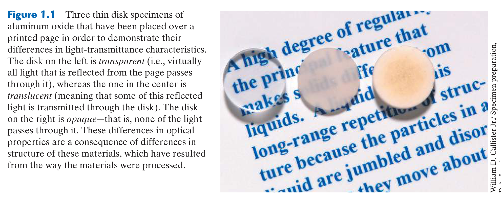
*Figure 1.1: Three thin disk specimens of aluminum oxide ($	ext{Al}_2	ext{O}_3$) demonstrating the profound effect of internal structure on optical properties.*

*Figure 1.2: The four interconnected pillars of materials science and engineering.*

#### In-Depth Visual Breakdown:
* **The Alumina Disks (Figure 1.1)**: All three disks have the exact identical chemical formula ($	ext{Al}_2	ext{O}_3$), yet their optical properties are vastly different:
  1. *Left disk (Transparent)*: Single crystal sapphire. No internal grain boundaries or voids; photons pass directly through without scattering.
  2. *Center disk (Translucent)*: Dense polycrystalline alumina. Light scatters at the boundaries between randomly oriented microcrystals.
  3. *Right disk (Opaque)*: Sintered polycrystalline alumina containing residual microscopic pores. Pores have a drastically different refractive index than alumina, scattering light completely and making the disk appear milky white.
* **Core Takeaway**: Changing the **processing** method altered the internal **structure** (single crystal vs. polycrystalline vs. porous), which directly altered the optical **property** (transparency), dictating **performance** (optical window vs. opaque insulator).

### 4. ⚖️ Teacher Notes Cross-Reference & Concordia Exam Traps
* **What Callister Emphasizes**: General historical evolution (Stone Age $\to$ Bronze Age $\to$ Iron Age) and broad societal sustainability.
* **What Dr. Medraj Emphasizes in Lecture 1**:
  * **The Liberty Ship Failures Case Study**: During WWII, all-welded Liberty ships fractured catastrophically in cold North Atlantic waters. Dr. Medraj specifically highlights three structural causes:
    1. *Temperature*: Steel went below its **Ductile-to-Brittle Transition Temperature (DBTT)**.
    2. *Stress Concentrations*: Square hatch corners acted as severe stress risers where cracks initiated.
    3. *Processing (Welding vs. Riveting)*: Riveted plates stop running cracks at the plate joint; continuous welded hulls allowed a brittle crack to propagate uninterrupted through the entire circumference of the ship.
  * **Beverage Container Material Selection**: Why is a soda can aluminum (ductile, recyclable, impervious to gas, cold-drawn), while a wine bottle is glass (chemically inert, rigid, non-permeable), and a water bottle is PET (lightweight, shatterproof)?
* **Concordia Exam Trap**: Confusing **stiffness** (elastic modulus $E$) with **strength** (yield stress $\sigma_y$). A ceramic has a higher stiffness than most metals, but lower tensile strength because of flaw-induced brittle fracture!

### 5. 💡 Master Concept Problem & Solution Framework
**Exam Question**: *Explain, using the materials science tetrahedron, why cold-rolled aluminum sheet exhibits higher yield strength than furnace-annealed aluminum sheet of identical chemical composition.*
* **Step 1 (Identify Processing Difference)**: Cold rolling plastically deforms the aluminum at room temperature, while annealing involves heating the metal above its recrystallization temperature.
* **Step 2 (Map to Internal Structure)**: Cold rolling multiplies dislocation density by several orders of magnitude ($10^5 \to 10^{10}\text{ cm}^{-2}$) and creates tangled dislocation networks. Annealing provides thermal energy for recovery and recrystallization, producing defect-free equiaxed grains with low dislocation density.
* **Step 3 (Map to Property)**: Moving dislocations become tangled and pin one another in the cold-rolled metal (strain hardening), requiring much higher shear stress to initiate further plastic flow. Yield strength $\sigma_y$ increases significantly.
* **Step 4 (Conclusion)**: Different processing $\to$ different dislocation structure $\to$ higher yield strength.

---

## 📖 Chapter 2: Atomic Structure and Interatomic Bonding
*(Aligned with Dr. Medraj Lectures 2 & 3 · Weeks 1–2)*

### 1. 🎯 30-Second Core Intuition & Plain-English Concept
Why do solid materials not collapse into nothingness or fly apart into space? Because atoms operate under a constant energetic balance between **electrostatic attraction** (pulling oppositely charged electrons and nuclei together) and **Pauli repulsion** (electron clouds resisting overlap). 

Solid materials settle at the exact separation distance ($r_0$) where the net interatomic force is **zero** and the net potential energy is at a **minimum**.

*Real-World Analogy*: Two billiard balls connected by a stiff spring. If you pull them apart, tension pulls them back (attractive force). If you shove them into each other, the spring fiercely pushes back (repulsive force). At rest, they sit at the equilibrium spring length ($r_0$).

### 2. ⚙️ High-Yield Mathematical Engine & Essential Laws

#### 1. Quantum Numbers & Shell Capacities
* $n$ (Principal): Shell energy level ($n = 1, 2, 3, 4, \dots$).
* $l$ (Azimuthal / Subshell): Orbit shape ($l = 0$ ($s$), $1$ ($p$), $2$ ($d$), $3$ ($f$); $0 \le l \le n-1$).
* $m_l$ (Magnetic): Spatial orientation ($-l \le m_l \le +l$; $2l+1$ orbitals per subshell).
* $m_s$ (Spin): Electron spin ($+1/2, -1/2$).
* *Total electrons per shell*: $2n^2$.

#### 2. Net Potential Energy and Interatomic Force
$$E_N(r) = E_A(r) + E_R(r) = -\frac{A}{r^m} + \frac{B}{r^n} \quad (m=1 \text{ for simple ions}, n \approx 8-12)$$
$$F_N(r) = -\frac{dE_N}{dr} = -\frac{mA}{r^{m+1}} + \frac{nB}{r^{n+1}}$$

#### 3. Equilibrium Conditions at $r = r_0$
$$F_N(r_0) = 0 \iff F_A(r_0) = -F_R(r_0)$$
$$\left.\frac{dE_N}{dr}\right|_{r=r_0} = 0 \implies r_0 = \left( \frac{nB}{mA} \right)^{\frac{1}{n-m}}$$
$$E_0 = E_N(r_0) = -\frac{A}{r_0}\left(1 - \frac{1}{n}\right) \quad (\text{for } m=1)$$

#### 4. Pauling's Percent Ionic Character
$$\% \text{ Ionic Character} = \left[ 1 - \exp\left( -0.25 (X_A - X_B)^2 \right) \right] \times 100\%$$
Where $X_A, X_B$ are the Pauling electronegativities of the two elements.

### 3. 🖼️ Textbook Reference Diagram & Visual Pedagogical Analysis

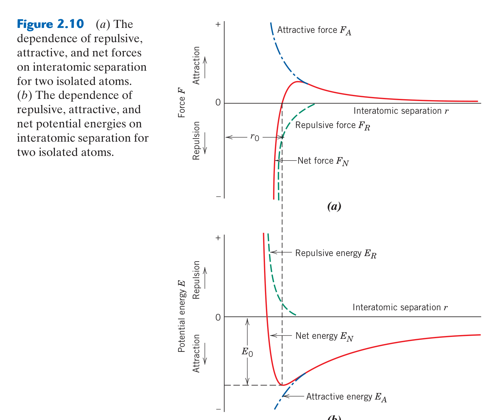
*Figure 2.10: (a) Net interatomic force $F_N$ vs. separation distance $r$. (b) Net potential energy $E_N$ vs. separation distance $r$, displaying the equilibrium bonding well.*

#### In-Depth Visual Breakdown:
1. **Force Curve (Top Plot)**:
   * As $r \to \infty$, forces approach zero.
   * At large $r$, attractive force $F_A$ dominates (negative slope region).
   * At $r = r_0$, the net force curve crosses the horizontal axis: $F_N(r_0) = 0$.
   * For $r < r_0$, the curve shoots rapidly into positive territory (repulsive force dominates sharply due to overlapping closed electron shells).
2. **Potential Energy Well (Bottom Plot)**:
   * The trough of the curve defines the **Bonding Energy ($E_0$)** and **Equilibrium Spacing ($r_0$)**.
   * **Physical Property Links**:
     * **Melting Point ($T_m$)**: Proportional to the depth of the well ($|E_0|$). Deeper well = higher thermal energy required to break bonds = high $T_m$ (e.g., Diamond, Tungsten).
     * **Elastic Modulus ($E$)**: Proportional to the curvature at the bottom of the well (second derivative $\left.\frac{d^2E}{dr^2}\right|_{r_0}$). Steeper curvature = stiffer spring = high Young's modulus.
     * **Thermal Expansion Coefficient ($\alpha_l$)**: Governed by the **asymmetry (anharmonicity)** of the well. As temperature rises, atoms oscillate; because the repulsive side is steeper than the attractive side, the mean interatomic distance shifts outward ($r_T > r_0$). Highly symmetric wells exhibit near-zero thermal expansion.

### 4. ⚖️ Teacher Notes Cross-Reference & Concordia Exam Traps
* **Dr. Medraj Focus (Lectures 2 & 3)**:
  * Emphasizes the mathematical derivation connecting Coulomb's law ($F_A = \frac{|z_1 z_2| e^2}{4\pi \varepsilon_0 r^2}$) with repulsive power laws.
  * Practice Problem Set #1 contains exact calculation questions for $K^+ - Cl^-$ ion pairs and gold wire atomic counts.
* **Concordia Exam Traps**:
  * **Transition Metal Ionization Trap**: When writing electron configurations for cations (e.g., $Fe^{2+}$), electrons are always removed from the outermost valence shell **first**:
    $$Fe: [Ar] 4s^2 3d^6 \implies Fe^{2+}: [Ar] 3d^6 \quad (\text{NOT } [Ar] 4s^2 3d^4!)$$
  * **Force vs. Energy Derivative Sign**: Remember that $F = -\frac{dE}{dr}$. In many physics texts, $F = +\frac{dE}{dr}$ depending on sign conventions. In Callister and Dr. Medraj's slides, attractive force is negative, repulsive is positive, and equilibrium occurs at the zero-crossing.

### 5. 💡 Master Exam Problem & Step-by-Step Solution Framework
**Problem (Practice Problem Set #1 Archetype)**:
*Two isolated ions $K^+$ and $Cl^-$ experience an attractive potential energy $E_A = -\frac{1.436}{r}\text{ eV}$ and a repulsive potential energy $E_R = \frac{7.32 \times 10^{-6}}{r^8}\text{ eV}$ (where $r$ is in nm). Calculate: (a) Equilibrium interatomic separation $r_0$, and (b) Bonding energy $E_0$.*

* **Step 1: Formulate Net Potential Energy**
  $$E_N(r) = -1.436 r^{-1} + 7.32 \times 10^{-6} r^{-8}$$
* **Step 2: Differentiate with Respect to $r$ and Set to Zero**
  $$\frac{dE_N}{dr} = \frac{1.436}{r^2} - 8 \times \frac{7.32 \times 10^{-6}}{r^9} = 0$$
* **Step 3: Solve for Equilibrium Separation $r_0$**
  $$\frac{1.436}{r_0^2} = \frac{5.856 \times 10^{-5}}{r_0^9} \implies r_0^7 = \frac{5.856 \times 10^{-5}}{1.436} = 4.078 \times 10^{-5}\text{ nm}^7$$
  $$r_0 = (4.078 \times 10^{-5})^{1/7} = 0.236\text{ nm}$$
* **Step 4: Compute Bonding Energy $E_0 = E_N(r_0)$**
  $$E_0 = -\frac{1.436}{0.236} + \frac{7.32 \times 10^{-6}}{(0.236)^8} = -6.085\text{ eV} + 0.761\text{ eV} = -5.324\text{ eV}$$
  $$\text{Bonding energy magnitude } |E_0| = 5.32\text{ eV}$$

---

## 📖 Chapter 3: The Structure of Crystalline Solids
*(Aligned with Dr. Medraj Lectures 4, 5 & 6 · Weeks 2–3)*

### 1. 🎯 30-Second Core Intuition & Plain-English Concept
Atoms in solids don't arrange randomly (unless they are glass or polymers). Metals arrange in tightly ordered 3D repeating grids called **crystal lattices**. How tightly and efficiently atoms pack determines how dense the metal is, how easily it deforms under a hammer, and how it diffracts X-rays.

*Real-World Analogy*: Stacking oranges in a grocery store display. If you stack them directly on top of each other in a grid, you get Simple Cubic (very loose, wobbles easily). If you drop each orange into the valley between oranges in the layer below, you get close-packing (FCC or HCP, rock solid, maximum packing density).

### 2. ⚙️ High-Yield Mathematical Engine & Metallic Unit Cells

| Crystal Structure | Coordination Number (CN) | Atoms per Cell ($n$) | Lattice Parameter $a(R)$ | Atomic Packing Factor (APF) | Close-Packed Direction |
| :--- | :---: | :---: | :---: | :---: | :---: |
| **Simple Cubic (SC)** | 6 | 1 | $a = 2R$ | $\frac{\pi}{6} \approx 0.524$ | $\langle 100 \rangle$ |
| **Body-Centered Cubic (BCC)** | 8 | 2 | $a = \frac{4R}{\sqrt{3}}$ | $\frac{\pi\sqrt{3}}{8} \approx 0.680$ | $\langle 111 \rangle$ |
| **Face-Centered Cubic (FCC)** | 12 | 4 | $a = 2\sqrt{2}R$ | $\frac{\pi\sqrt{2}}{6} \approx 0.740$ | $\langle 110 \rangle$ |
| **Hexagonal Close-Packed (HCP)** | 12 | 6 | $a = 2R, c = 1.633a$ | $\frac{\pi\sqrt{3}}{8} \approx 0.740$ | $\langle 11\bar{2}0 \rangle$ |

#### Essential Crystallographic Equations:
1. **Theoretical Density**:
   $$\rho = \frac{n \cdot A}{V_c \cdot N_A}$$
   *(Units: $A$ in $\text{g/mol}$, $V_c$ in $\text{cm}^3$, $N_A = 6.022 \times 10^{23}\text{ atoms/mol}$, yielding $\rho$ in $\text{g/cm}^3$)*.
2. **Linear Density (LD)**:
   $$\text{LD} = \frac{\text{number of atom diameters centered on direction vector}}{\text{length of direction vector}}$$
3. **Planar Density (PD)**:
   $$\text{PD} = \frac{\text{number of atom cross-sectional areas centered on plane}}{\text{area of plane}}$$
4. **Bragg's Law for X-Ray Diffraction (XRD)**:
   $$n\lambda = 2 d_{hkl} \sin\theta$$
   *Interplanar spacing for cubic systems*:
   $$d_{hkl} = \frac{a}{\sqrt{h^2 + k^2 + l^2}}$$
5. **Diffraction Reflection Selection Rules**:
   * **BCC**: Reflections occur **only** when $h + k + l = \text{even}$ (e.g., $(110), (200), (211), (220)$).
   * **FCC**: Reflections occur **only** when $h, k, l$ are **unmixed** (all odd or all even) (e.g., $(111), (200), (220), (311)$).

### 3. 🖼️ Textbook Reference Diagram & Visual Pedagogical Analysis

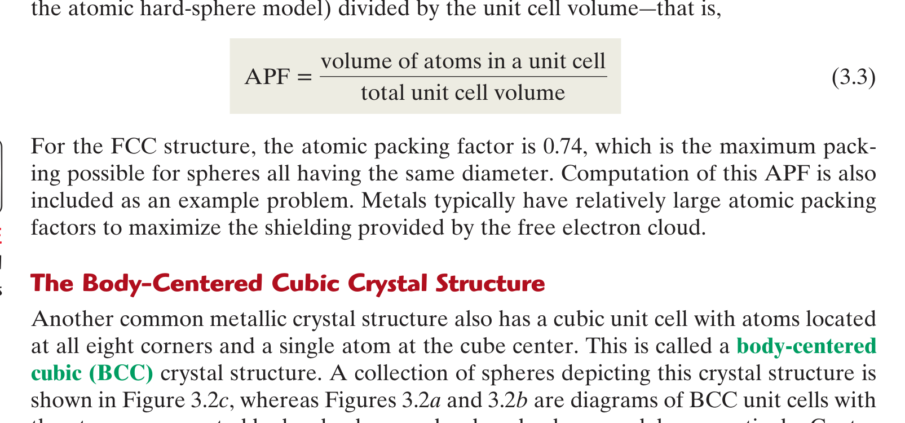
*Figure 3.2: Body-Centered Cubic (BCC) unit cell: (a) Hard-sphere model, (b) Reduced-sphere unit cell, and (c) Aggregate of atoms highlighting center-corner contact along the body diagonal.*

*Figure 3.22: Operating geometry of an X-ray diffractometer showing source $T$, specimen $S$, and detector $C$ rotating through angle $2	heta$.*

#### In-Depth Visual Breakdown:
* **BCC Unit Cell (Figure 3.2)**: Notice the hard-sphere contact. Atoms touch strictly along the cube **body diagonal** ($[111]$ direction). Therefore:
  $$\text{Body Diagonal} = \sqrt{a^2 + a^2 + a^2} = a\sqrt{3} = 4R \implies a = \frac{4R}{\sqrt{3}}$$
* **X-Ray Diffractometer (Figure 3.22)**: Monochromatic X-rays of known wavelength $\lambda$ strike the powder specimen at angle $\theta$. When the path difference between adjacent crystallographic planes equals an integer number of wavelengths ($n\lambda$), constructive interference produces an intense diffraction peak recorded at detector angle $2\theta$.

### 4. ⚖️ Teacher Notes Cross-Reference & Concordia Exam Traps
* **Dr. Medraj Lectures 4–6 Emphasis**:
  * Step-by-step procedure for planes passing through the origin: **You must translate the origin** to an adjacent corner before identifying intercepts!
  * Close-packed stacking sequences: HCP is $ABABAB\dots$, while FCC is $ABCABCABC\dots$.
  * Single crystals are **anisotropic** (properties like Young's modulus vary with crystallographic direction), whereas polycrystalline metals with random grain orientation are **isotropic** (quasi-isotropic) on a macro scale.
* **Concordia Exam Traps**:
  * **The $\theta$ vs. $2\theta$ Trap in XRD**: Diffractometer outputs plot intensity against $2\theta$ (the detector angle). You **must divide by 2** before plugging $\theta$ into Bragg's Law!
  * **Volume Unit Conversion**: Forgetting that $1\text{ nm} = 10^{-7}\text{ cm} \implies 1\text{ nm}^3 = 10^{-21}\text{ cm}^3$.

### 5. 💡 Master Exam Problem & Step-by-Step Solution Framework
**Problem**: *Iron has a BCC crystal structure with atomic radius $R = 0.1241\text{ nm}$ and atomic weight $A = 55.85\text{ g/mol}$. (a) Calculate its theoretical density. (b) For monochromatic X-radiation with $\lambda = 0.1542\text{ nm}$, compute the diffraction angle $2\theta$ for the first-order reflection ($n=1$) from the $(220)$ plane.*

* **Step 1: Compute BCC Lattice Parameter $a$**
  $$a = \frac{4R}{\sqrt{3}} = \frac{4(0.1241\text{ nm})}{\sqrt{3}} = 0.2866\text{ nm} = 2.866 \times 10^{-8}\text{ cm}$$
* **Step 2: Compute Unit Cell Volume $V_c$**
  $$V_c = a^3 = (2.866 \times 10^{-8}\text{ cm})^3 = 2.354 \times 10^{-23}\text{ cm}^3$$
* **Step 3: Compute Theoretical Density $\rho$**
  $$\rho = \frac{n \cdot A}{V_c \cdot N_A} = \frac{2 \times 55.85\text{ g/mol}}{(2.354 \times 10^{-23}\text{ cm}^3)(6.022 \times 10^{23}\text{ mol}^{-1})} = 7.88\text{ g/cm}^3$$
* **Step 4: Compute Interplanar Spacing $d_{220}$**
  $$d_{220} = \frac{a}{\sqrt{h^2 + k^2 + l^2}} = \frac{0.2866\text{ nm}}{\sqrt{2^2 + 2^2 + 0^2}} = \frac{0.2866}{\sqrt{8}} = 0.1013\text{ nm}$$
* **Step 5: Apply Bragg's Law for $\sin\theta$ and $2\theta$**
  $$\sin\theta = \frac{n\lambda}{2 d_{220}} = \frac{1(0.1542\text{ nm})}{2(0.1013\text{ nm})} = 0.7611$$
  $$\theta = \arcsin(0.7611) = 49.56^\circ \implies 2\theta = 99.12^\circ$$

---

## 📖 Chapter 4: Imperfections in Solids
*(Aligned with Dr. Medraj Lecture 7 · Week 4)*

### 1. 🎯 30-Second Core Intuition & Plain-English Concept
Real engineering materials are never perfect crystals. Without defects, pure metals would have theoretical shear strengths $1,000\times$ higher than observed, but they would be brittle like glass. **Defects govern all mechanical properties and atomic diffusion.**

Defects are categorized by dimensionality:
* **0D (Point Defects)**: Vacancies (missing atoms), interstitials (crowded atoms), impurities.
* **1D (Linear Defects)**: Dislocations (edge, screw, mixed)—the engines of plastic deformation.
* **2D (Planar Defects)**: Grain boundaries, twin boundaries, external surfaces.
* **3D (Bulk Defects)**: Pores, cracks, foreign inclusions.

### 2. ⚙️ High-Yield Mathematical Engine & Governing Laws

#### 1. Equilibrium Vacancy Concentration (Arrhenius)
$$N_v = N \exp\left( -\frac{Q_v}{k_B T} \right)$$
* $N_v$: Number of vacancies per unit volume ($	ext{m}^{-3}$).
* $N$: Total atomic lattice sites per unit volume: $N = \frac{\rho N_A}{A}$.
* $Q_v$: Energy required to form a single vacancy ($	ext{J/atom}$ or $	ext{eV/atom}$).
* $k_B$: Boltzmann's constant ($8.62 \times 10^{-5}\text{ eV/K} = 1.38 \times 10^{-23}\text{ J/K}$).
* $T$: Absolute temperature in **Kelvin** ($T_K = T_C + 273.15$).

#### 2. The Four Hume-Rothery Rules for Complete Solid Solubility
To achieve complete substitutional solubility (like Cu in Ni):
1. **Atomic Size Factor**: Difference in atomic radii must be $\Delta r = \left|\frac{r_{\text{solute}} - r_{\text{solvent}}}{r_{\text{solvent}}}\right| \le 15\%$.
2. **Crystal Structure**: Must have the identical crystal structure (e.g., both FCC).
3. **Electronegativity**: Electronegativities must be very similar (large $\Delta X$ forms intermetallic compounds).
4. **Valency**: A metal dissolves more of a metal of higher valency than of lower valency.

#### 3. Weight Percent to Atom Percent Conversion
$$C'_1 = \frac{C_1 / A_1}{\frac{C_1}{A_1} + \frac{C_2}{A_2}} \times 100\%$$

### 3. 🖼️ Textbook Reference Diagram & Visual Pedagogical Analysis

*Figure 4.1: Schematic representation of a vacancy and a self-interstitial in a 2D crystalline lattice.*

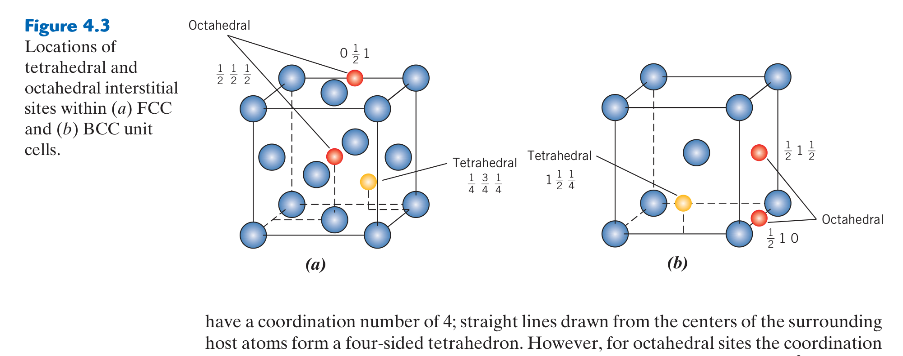
*Figure 4.3: Location of octahedral and tetrahedral interstitial voids within (a) FCC and (b) BCC crystal lattices.*

#### In-Depth Visual Breakdown:
* **Point Defects (Figure 4.1)**:
  * A **vacancy** causes surrounding lattice planes to relax inward, creating a localized tensile strain field.
  * A **self-interstitial** forces host atoms severely apart, creating a large localized compressive strain field. Because self-interstitials require massive strain energy, their equilibrium concentration is orders of magnitude lower than vacancy concentration.
* **Interstitial Sites (Figure 4.3)**: Shows why carbon has vastly higher solubility in FCC austenite than in BCC ferrite. In FCC, the octahedral interstitial site at the cube edge ($[1/2, 0, 0]$) has a radius ratio of $0.414R$. In BCC, the octahedral sites on faces are distorted and much smaller ($0.154R$), severely restricting carbon solubility ($0.022\text{ wt}\%$ max in BCC vs $2.14\text{ wt}\%$ in FCC).

### 4. ⚖️ Teacher Notes Cross-Reference & Concordia Exam Traps
* **Dr. Medraj Lecture 7 Focus**:
  * **Arrhenius Linearization**: Taking the natural log of the vacancy equation:
    $$\ln\left(\frac{N_v}{N}\right) = \ln A - \frac{Q_v}{k_B}\left(\frac{1}{T}\right)$$
    Plotting $\ln(N_v/N)$ vs. $1/T$ yields a straight line with slope $= -\frac{Q_v}{k_B}$.
  * **Burgers Vector Relationships**:
    * **Edge dislocation**: $\vec{b} \perp \vec{t}$ (Burgers vector is perpendicular to dislocation line).
    * **Screw dislocation**: $\vec{b} \parallel \vec{t}$ (Burgers vector is parallel to dislocation line).
* **Concordia Exam Traps**:
  * **Temperature Units**: Forgetting to convert Celsius to Kelvin in Arrhenius calculations ($T = 800^\circ\text{C} \implies 1073.15\text{ K}$).
  * **Hume-Rothery Partial Solubility Trap**: If an alloy satisfies 3 out of 4 Hume-Rothery rules (e.g., Cu-Zn: $\Delta r < 15\%$, similar electronegativity, but Zn is HCP while Cu is FCC), it exhibits **partial** (limited) solubility, NOT zero solubility!

### 5. 💡 Master Exam Problem & Step-by-Step Solution Framework
**Problem**: *Calculate the equilibrium number of vacancies per cubic meter in copper at $1000^\circ\text{C}$. Given: $Q_v = 0.90\text{ eV/atom}$, $\rho_{\text{Cu}} = 8.40\text{ g/cm}^3$ (at $1000^\circ\text{C}$), and $A_{\text{Cu}} = 63.55\text{ g/mol}$.*

* **Step 1: Convert Temperature to Kelvin**
  $$T = 1000 + 273.15 = 1273.15\text{ K}$$
* **Step 2: Calculate Number of Atomic Sites $N$ per $\text{m}^3$**
  $$N = \frac{\rho \cdot N_A}{A} = \frac{(8.40 \times 10^6\text{ g/m}^3)(6.022 \times 10^{23}\text{ atoms/mol})}{63.55\text{ g/mol}} = 7.96 \times 10^{28}\text{ atoms/m}^3$$
* **Step 3: Calculate the Arrhenius Factor**
  $$\frac{Q_v}{k_B T} = \frac{0.90\text{ eV}}{(8.62 \times 10^{-5}\text{ eV/K})(1273.15\text{ K})} = \frac{0.90}{0.1097} = 8.204$$
  $$\exp(-8.204) = 2.735 \times 10^{-4}$$
* **Step 4: Calculate Vacancy Concentration $N_v$**
  $$N_v = N \exp\left(-\frac{Q_v}{k_B T}\right) = (7.96 \times 10^{28})(2.735 \times 10^{-4}) = 2.18 \times 10^{25}\text{ vacancies/m}^3$$

---

## 📖 Chapter 5: Diffusion
*(Syllabus Week 5 · Core Midterm Topic)*

### 1. 🎯 30-Second Core Intuition & Plain-English Concept
Diffusion is the mass transport of atoms through a solid by random atomic jumping driven by thermal vibrations. Atoms jump into neighboring vacancies (**vacancy diffusion**) or squeeze through interstices (**interstitial diffusion**). 

Because small solute atoms (like C, H, N) don't need to wait for a vacancy to open up, **interstitial diffusion is thousands of times faster** than substitutional diffusion.

*Real-World Analogy*: Squeezing through a packed concert crowd. If you are a child (small interstitial carbon atom), you can weave between people's legs quickly. If you are a large adult (substitutional atom), you can only take a step forward when someone in front of you leaves their spot (vacancy diffusion).

### 2. ⚙️ High-Yield Mathematical Engine & Essential Laws

#### 1. Fick's First Law (Steady-State Diffusion)
$$J = -D \frac{dC}{dx}$$
* $J$: Diffusion flux ($	ext{kg}/(	ext{m}^2\cdot\text{s})$ or $	ext{atoms}/(	ext{m}^2\cdot\text{s})$).
* $D$: Diffusion coefficient ($	ext{m}^2/\text{s}$).
* $\frac{dC}{dx}$: Concentration gradient ($	ext{kg}/\text{m}^4$). The negative sign indicates diffusion flows down the concentration gradient (from high to low concentration).

#### 2. Fick's Second Law (Non-Steady-State Diffusion)
$$\frac{\partial C}{\partial t} = D \frac{\partial^2 C}{\partial x^2}$$

*Standard Solution for Semi-Infinite Solid with Constant Surface Concentration $C_s$*:
$$\frac{C_x - C_0}{C_s - C_0} = 1 - \text{erf}\left( \frac{x}{2\sqrt{Dt}} \right)$$
* $C_0$: Uniform initial bulk concentration.
* $C_s$: Constant surface concentration.
* $C_x$: Concentration at depth $x$ after elapsed time $t$.
* $\text{erf}(z)$: Gaussian error function.
* **Golden Shortcut Rule**: When concentration ratio $\frac{C_x - C_0}{C_s - C_0}$ is held constant:
  $$\frac{x^2}{Dt} = \text{constant} \implies \frac{x_1^2}{D_1 t_1} = \frac{x_2^2}{D_2 t_2}$$

#### 3. Temperature Dependence of Diffusion (Arrhenius)
$$D = D_0 \exp\left( -\frac{Q_d}{R T} \right) \iff \ln D = \ln D_0 - \frac{Q_d}{R}\left(\frac{1}{T}\right)$$
* $Q_d$: Activation energy for diffusion ($	ext{J/mol}$).
* $R$: Universal gas constant ($8.314\text{ J/mol}\cdot\text{K}$).

### 3. 🖼️ Textbook Reference Diagram & Visual Pedagogical Analysis

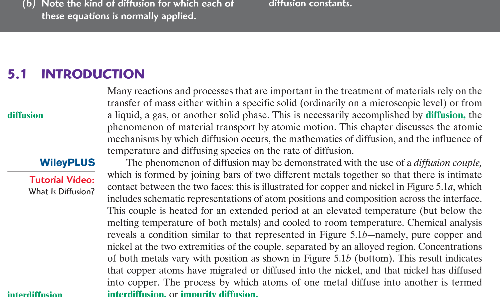
*Figure 5.1: Copper-Nickel diffusion couple: (a) Schematic atom positions before heating, and (b) Concentration profile across the interface after elevated-temperature diffusion.*

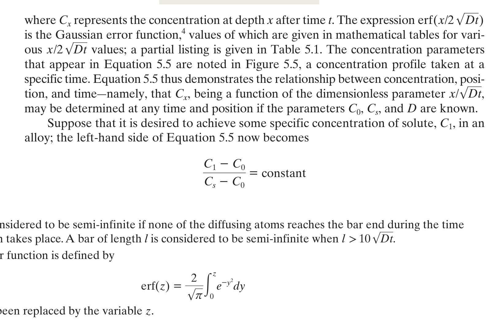
*Figure 5.5: Concentration profile $C_x$ vs. depth $x$ into a solid during gas carburizing at a specific time $t$.*

#### In-Depth Visual Breakdown:
* **The Diffusion Couple (Figure 5.1)**: Illustrates how an initially sharp chemical step-function ($100\%\text{ Cu}$ on left, $100\%\text{ Ni}$ on right) gradually smooths out into an S-shaped continuous concentration curve as Cu atoms diffuse right and Ni atoms diffuse left.
* **Carburizing Profile (Figure 5.5)**: Shows steel surface hardening. Carbon gas at surface maintains constant $C_s$. As diffusion proceeds, the carbon profile pushes deeper into the interior. The depth $x$ at which a target hardness/carbon level is reached scales directly with $\sqrt{Dt}$.

### 4. ⚖️ Teacher Notes Cross-Reference & Concordia Exam Traps
* **Concordia Exam Focus**:
  * Gas carburizing calculations for steel gear teeth: Determining time required to achieve a specified carbon concentration at a given depth.
  * **Linear Interpolation of Error Function Table**: Concordia exams provide an abbreviated table of $\text{erf}(z)$ values; students must interpolate precisely:
    $$z = z_1 + \frac{\text{erf}(z) - \text{erf}(z_1)}{\text{erf}(z_2) - \text{erf}(z_1)}(z_2 - z_1)$$
* **Concordia Exam Traps**:
  * **Gas Constant Units**: Using $k_B$ instead of $R$. If $Q_d$ is given in $\text{kJ/mol}$, use $R = 8.314\text{ J/mol}\cdot\text{K}$ (multiply $\text{kJ}$ by $1000$!). If $Q_d$ is in $\text{eV/atom}$, use $k_B = 8.62 \times 10^{-5}\text{ eV/K}$.

### 5. 💡 Master Exam Problem & Step-by-Step Solution Framework
**Problem**: *A gear made of $0.20\text{ wt}\%$ carbon steel is case-hardened in a gas atmosphere maintaining $1.20\text{ wt}\%$ carbon at the surface at $950^\circ\text{C}$ ($D = 1.6 \times 10^{-11}\text{ m}^2/\text{s}$). How long (in hours) will it take to achieve a carbon concentration of $0.60\text{ wt}\%$ at a depth of $0.5\text{ mm}$ below the surface?*  
*(Given: $\text{erf}(0.60) = 0.6039$, $\text{erf}(0.65) = 0.6420$)*

* **Step 1: Set Up Fick's Second Law Concentration Ratio**
  $$\frac{C_x - C_0}{C_s - C_0} = \frac{0.60 - 0.20}{1.20 - 0.20} = \frac{0.40}{1.00} = 0.40$$
* **Step 2: Solve for Error Function Value**
  $$1 - \text{erf}(z) = 0.40 \implies \text{erf}(z) = 0.60$$
* **Step 3: Interpolate to Find Argument $z$**
  $$z = 0.60 + \frac{0.6000 - 0.6039}{0.6420 - 0.6039}(0.65 - 0.60) \approx 0.595$$
* **Step 4: Relate $z$ to Physical Diffusion Parameters**
  $$z = \frac{x}{2\sqrt{Dt}} \implies 0.595 = \frac{0.5 \times 10^{-3}\text{ m}}{2\sqrt{(1.6 \times 10^{-11}\text{ m}^2/\text{s}) t}}$$
  $$\sqrt{t} = \frac{0.5 \times 10^{-3}}{2(0.595)\sqrt{1.6 \times 10^{-11}}} = \frac{5 \times 10^{-4}}{4.757 \times 10^{-6}} = 105.1\text{ s}^{1/2}$$
  $$t = (105.1)^2 = 11,048\text{ seconds} = \frac{11,048}{3600} = 3.07\text{ hours}$$

---

## 📖 Chapter 6: Mechanical Properties of Metals
*(Syllabus Week 6 · Core Midterm & Laboratory Topic)*

### 1. 🎯 30-Second Core Intuition & Plain-English Concept
When you pull a metal rod in tension, it initially stretches like a stiff rubber band: release the load, and it snaps back to its original length (**Elastic Deformation**). 

Pull it past its **Yield Strength ($\sigma_y$)**, and atomic planes permanently slide past one another via dislocation slip (**Plastic Deformation**). At the peak load (**Ultimate Tensile Strength, UTS**), the cross-section necks down until fracture occurs.

*Key Vocabulary Distinction*:
* **Stiffness** ($E$): Resistance to elastic stretching (slope of elastic region).
* **Strength** ($\sigma_y$, UTS): Resistance to permanent plastic deformation and tearing.
* **Ductility** ($\%EL$): Total plastic deformation sustained before snap.
* **Toughness**: Total energy absorbed up to fracture (area under entire curve).

### 2. ⚙️ High-Yield Mathematical Engine & Tensile Metrics

| Property | Formula | Description & Units |
| :--- | :--- | :--- |
| **Engineering Stress** | $\sigma = \frac{F}{A_0}$ | Force divided by *original* cross-sectional area ($	ext{MPa}$ or $	ext{N/mm}^2$) |
| **Engineering Strain** | $\epsilon = \frac{\Delta l}{l_0} = \frac{l_i - l_0}{l_0}$ | Elongation divided by *original* gage length (dimensionless or $	ext{mm/mm}$) |
| **Hooke's Law** | $\sigma = E \epsilon$ | Linear elastic response ($E$: Young's modulus, $	ext{GPa}$) |
| **Poisson's Ratio** | $\nu = -\frac{\epsilon_x}{\epsilon_z} = -\frac{\epsilon_y}{\epsilon_z}$ | Lateral contraction divided by longitudinal expansion (typically $\approx 0.33$) |
| **Yield Strength ($\sigma_y$)** | Stress at $0.002$ ($0.2\%$) offset | Parallel line with slope $E$ drawn starting at $\epsilon = 0.002$ |
| **Ductility (\%EL)** | $\%EL = \left(\frac{l_f - l_0}{l_0}\right) \times 100\%$ | Total permanent elongation at fracture |
| **Modulus of Resilience** | $U_r = \int_0^{\epsilon_y} \sigma d\epsilon \approx \frac{\sigma_y^2}{2E}$ | Elastic energy absorbed per unit volume without permanent deformation |
| **True Stress ($\sigma_T$)** | $\sigma_T = \frac{F}{A_i} = \sigma(1 + \epsilon)$ | Instantaneous force / instantaneous area (valid up to necking) |
| **True Strain ($\epsilon_T$)** | $\epsilon_T = \ln\left(\frac{l_i}{l_0}\right) = \ln(1 + \epsilon)$ | Logarithmic true strain (valid up to necking) |

### 3. 🖼️ Textbook Reference Diagram & Visual Pedagogical Analysis

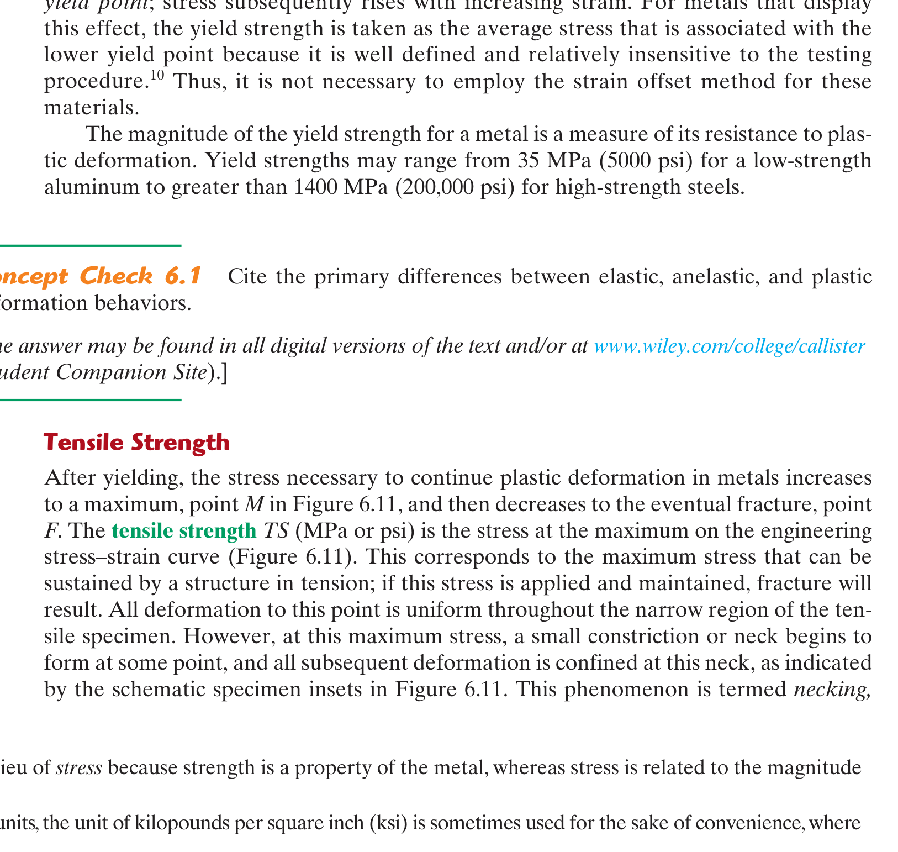
*Figure 6.11: Engineering stress-strain behavior to fracture: $P$ (proportional limit), $M$ (maximum load / tensile strength), and $F$ (fracture point).*

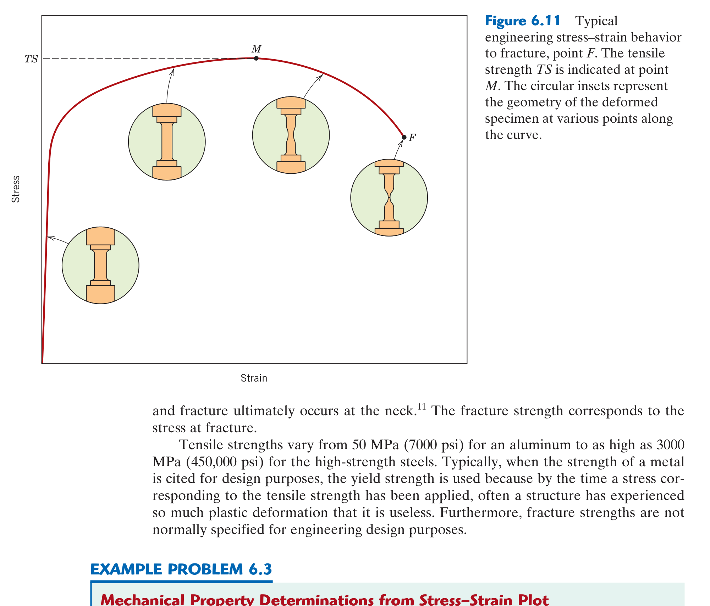
*Figure 6.12: Determination of the $0.002$ ($0.2\%$) strain offset yield strength for brass.*

#### In-Depth Visual Breakdown:
* **The Engineering Curve (Figure 6.11)**:
  * The curve appears to drop after peak $M$ (Tensile Strength) because engineering stress uses *original area* $A_0$. In reality, the material continues to strain harden, but localized **necking** causes the cross-section to shrink faster than the load increases.
* **The $0.002$ Offset Method (Figure 6.12)**:
  * For metals without a sharp yield drop (like brass, aluminum, copper), yield strength is standardized by starting at $\epsilon = 0.002$ ($0.2\%$) on the horizontal axis and drawing a dashed line strictly **parallel** to the initial linear elastic slope $E$. The intersection with the experimental curve defines $\sigma_y$.

### 4. ⚖️ Teacher Notes Cross-Reference & Concordia Exam Traps
* **Concordia Exam & Lab Focus**:
  * Calculating Young's modulus, yield strength ($0.2\%$), UTS, and ductility directly from raw load-elongation tensile data.
  * Modulus of resilience calculation: $U_r = rac{\sigma_y^2}{2E}$.
  * Hardness correlations: For steel, $	ext{UTS (MPa)} pprox 3.45 	imes 	ext{HB}$ (Brinell Hardness).
* **Concordia Exam Traps**:
  * **True vs. Engineering Equations**: The equations $\sigma_T = \sigma(1+\epsilon)$ and $\epsilon_T = \ln(1+\epsilon)$ are **ONLY valid up to the onset of necking (UTS)**! After necking initiates, cross-sectional deformation is no longer uniform, and instantaneous cross-sectional area must be measured directly.

### 5. 💡 Master Exam Problem & Step-by-Step Solution Framework
**Problem**: *A cylindrical specimen of aluminum alloy with diameter $d_0 = 12.8	ext{ mm}$ and gage length $l_0 = 50.8	ext{ mm}$ is loaded in tension. An elastic load of $15,000	ext{ N}$ produces an elongation of $0.089	ext{ mm}$. The specimen yields at $30,000	ext{ N}$, reaches a maximum load of $45,000	ext{ N}$, and fractures at $l_f = 56.4	ext{ mm}$. Calculate: (a) Young's Modulus $E$, (b) Yield Strength $\sigma_y$, (c) Tensile Strength UTS, (d) Ductility $\%EL$, and (e) Modulus of Resilience $U_r$.*

* **Step 1: Compute Initial Area $A_0$**
  $$A_0 = \frac{\pi d_0^2}{4} = \frac{\pi (12.8\text{ mm})^2}{4} = 128.7\text{ mm}^2 = 1.287 \times 10^{-4}\text{ m}^2$$
* **Step 2: Compute Modulus of Elasticity $E$**
  $$\sigma_1 = \frac{15,000\text{ N}}{128.7\text{ mm}^2} = 116.55\text{ MPa}, \quad \epsilon_1 = \frac{0.089\text{ mm}}{50.8\text{ mm}} = 0.001752$$
  $$E = \frac{\sigma_1}{\epsilon_1} = \frac{116.55\text{ MPa}}{0.001752} = 66,524\text{ MPa} = 66.5\text{ GPa}$$
* **Step 3: Compute Yield Strength $\sigma_y$ and Tensile Strength UTS**
  $$\sigma_y = \frac{F_{\text{yield}}}{A_0} = \frac{30,000\text{ N}}{128.7\text{ mm}^2} = 233.1\text{ MPa}$$
  $$\text{UTS} = \frac{F_{\max}}{A_0} = \frac{45,000\text{ N}}{128.7\text{ mm}^2} = 349.6\text{ MPa}$$
* **Step 4: Compute Ductility $\%EL$**
  $$\%EL = \frac{l_f - l_0}{l_0} \times 100\% = \frac{56.4 - 50.8}{50.8} \times 100\% = 11.02\%$$
* **Step 5: Compute Modulus of Resilience $U_r$**
  $$U_r \approx \frac{\sigma_y^2}{2E} = \frac{(233.1 \times 10^6\text{ Pa})^2}{2(66.5 \times 10^9\text{ Pa})} = 4.08 \times 10^5\text{ J/m}^3 = 0.408\text{ MJ/m}^3$$

---

## 📖 Chapter 7: Dislocations and Strengthening Mechanisms
*(Syllabus Week 7 · Sections 7.1–7.4 · Midterm & Final Scope)*

### 1. 🎯 30-Second Core Intuition & Plain-English Concept
Plastic deformation in metals occurs when line defects (dislocations) slide across close-packed atomic planes. 

**The Universal Law of Metallurgy**: To make a metal stronger, you must **impede dislocation motion**. If dislocations cannot move, the metal cannot permanently deform—its yield strength skyrockets!

There are **Four Universal Strengthening Mechanisms**:
1. **Grain Size Reduction**: Grain boundaries block dislocations.
2. **Solid Solution Strengthening**: Solute atoms create lattice strain fields that pin dislocations.
3. **Strain Hardening (Cold Work)**: Tangling dislocations into each other.
4. **Precipitation Hardening**: Hard microscopic particles act as barricades.

### 2. ⚙️ High-Yield Mathematical Engine & Governing Laws

#### 1. Schmid's Law for Resolved Shear Stress
$$\tau_R = \sigma \cos\phi \cos\lambda$$
* $\sigma$: Applied macroscopic tensile stress.
* $\phi$: Angle between tensile axis and the **normal to the slip plane**.
* $\lambda$: Angle between tensile axis and the **slip direction**.
* $(\cos\phi \cos\lambda)$: **Schmid Factor** ($m$). Maximum theoretical value is $0.5$ (when $\phi = \lambda = 45^\circ$).
* Yielding initiates in a single crystal when $\tau_R = \tau_{\text{crss}}$ (Critical Resolved Shear Stress):
  $$\sigma_y = \frac{\tau_{\text{crss}}}{(\cos\phi \cos\lambda)_{\max}}$$

#### 2. Hall-Petch Relationship (Grain Size Reduction)
$$\sigma_y = \sigma_0 + k_y d^{-1/2}$$
* $\sigma_0$: Friction stress resisting dislocation motion in a single crystal.
* $k_y$: Strengthening coefficient (material constant).
* $d$: Average grain diameter. Smaller grain size $d \implies$ higher yield strength $\sigma_y$.
* *Unique Advantage*: Grain size reduction is the **only strengthening mechanism that increases both strength AND toughness simultaneously**!

#### 3. Strain Hardening (Cold Work)
$$\%CW = \left( \frac{A_0 - A_d}{A_0} \right) \times 100\%$$
* Flow stress in plastic region: $\sigma_T = K \epsilon_T^n$ ($n$: strain-hardening exponent).

### 3. 🖼️ Textbook Reference Diagram & Visual Pedagogical Analysis

*Figure 7.7: Geometric relationships between tensile axis, slip plane normal ($\phi$), and slip direction ($\lambda$) in a single crystal.*

*Figure 7.14: Dislocation pile-up at a grain boundary. The atomic mismatch between adjacent grains blocks dislocation slip.*

#### In-Depth Visual Breakdown:
* **Schmid's Law Geometry (Figure 7.7)**: Demonstrates that tension does not directly cause slip; rather, slip is driven by the **shear component** resolved onto the slip plane along the slip direction. If the tensile axis is perpendicular to the slip plane ($\phi = 0^\circ \implies \lambda = 90^\circ$), the resolved shear stress is zero ($\cos 90^\circ = 0$), and no slip can occur!
* **Hall-Petch Barrier (Figure 7.14)**: When dislocations move along slip plane A in Grain 1, they slam into the grain boundary. Because Grain 2 has a different crystallographic orientation, slip plane B is misaligned. Dislocations pile up at the boundary, generating a back-stress that resists further deformation until applied stress is raised substantially.

### 4. ⚖️ Teacher Notes Cross-Reference & Concordia Exam Traps
* **Concordia Exam Focus**:
  * Fitting two data points to the Hall-Petch equation to find $\sigma_0$ and $k_y$, then predicting $\sigma_y$ for a third grain size.
  * Calculating $\%CW$ and reading resulting yield strength, tensile strength, and ductility from standard empirical curves.
  * The three annealing stages: **Recovery** (internal stresses relieve, conductivity restored), **Recrystallization** (new strain-free grains nucleate, ductility restored, strength drops), and **Grain Growth** (grains coarsen to reduce boundary energy).
* **Concordia Exam Traps**:
  * **Schmid's Law Angle Trap**: In 3D space, $\phi + \lambda 
eq 90^\circ$! They are independent angles measured between the tensile axis and two separate vectors. Do not assume $\cos\lambda = \sin\phi$.

### 5. 💡 Master Exam Problem & Step-by-Step Solution Framework
**Problem**: *A metal with average grain diameter $d_1 = 0.050	ext{ mm}$ has a yield strength of $135	ext{ MPa}$. When grain size is reduced to $d_2 = 0.008	ext{ mm}$, yield strength increases to $260	ext{ MPa}$. Calculate: (a) The Hall-Petch constants $\sigma_0$ and $k_y$, and (b) The expected yield strength when average grain diameter is $0.002	ext{ mm}$.*

* **Step 1: Compute $d^{-1/2}$ for Known Grain Sizes**
  $$d_1^{-1/2} = (0.050\text{ mm})^{-1/2} = 4.472\text{ mm}^{-1/2}$$
  $$d_2^{-1/2} = (0.008\text{ mm})^{-1/2} = 11.180\text{ mm}^{-1/2}$$
* **Step 2: Set Up Simultaneous Linear Equations**
  $$135 = \sigma_0 + k_y(4.472) \quad \text{--- (1)}$$
  $$260 = \sigma_0 + k_y(11.180) \quad \text{--- (2)}$$
* **Step 3: Solve for $k_y$ and $\sigma_0$**
  $$\text{Subtract (1) from (2)}: 125 = k_y(11.180 - 4.472) = 6.708 k_y$$
  $$k_y = \frac{125}{6.708} = 18.63\text{ MPa}\cdot\text{mm}^{1/2}$$
  $$\sigma_0 = 135 - (18.63)(4.472) = 135 - 83.31 = 51.69\text{ MPa}$$
* **Step 4: Predict Yield Strength for $d = 0.002\text{ mm}$**
  $$d_3^{-1/2} = (0.002\text{ mm})^{-1/2} = 22.361\text{ mm}^{-1/2}$$
  $$\sigma_y = 51.69 + (18.63)(22.361) = 51.69 + 416.58 = 468.3\text{ MPa}$$

---

## 📖 Chapter 9: Phase Diagrams & Microstructural Evolution
*(Syllabus Week 8 · Post-Midterm Pillar & Heavily Tested on Final Exam)*

### 1. 🎯 30-Second Core Intuition & Plain-English Concept
A phase diagram is a metallurgical roadmap showing what microscopic phases exist at any combination of temperature and chemical composition. 

From a phase diagram, you can answer three vital questions for any alloy:
1. **What phases are present?** (Look at which field the point lands in).
2. **What is the chemical composition of each phase?** (Draw a horizontal **tie-line** and read the intersections).
3. **How much of each phase is present?** (Apply the **Inverse Lever Rule**).

*Real-World Analogy*: Making chocolate milk. Below the solubility limit, cocoa dissolves completely into milk (single liquid phase). Add too much cocoa powder, and solid sludge settles at the bottom: now you have two phases (saturated liquid milk + solid cocoa powder) in equilibrium.

### 2. ⚙️ High-Yield Mathematical Engine & The Lever Rule

#### 1. Gibbs Phase Rule (Condensed System at $1	ext{ atm}$)
$$P + F = C + 1$$
* $P$: Number of phases present.
* $F$: Degrees of freedom (number of externally controllable variables: $T$, composition).
* $C$: Number of chemical components (e.g., $C = 2$ for binary systems like Cu-Ni or Fe-C).

#### 2. The Inverse Lever Rule (Phase Fraction Calculation)
In a two-phase region ($lpha + L$) with overall alloy composition $C_0$:
$$W_L = \frac{C_\alpha - C_0}{C_\alpha - C_L} \quad (\text{Fraction of Liquid})$$
$$W_\alpha = \frac{C_0 - C_L}{C_\alpha - C_L} \quad (\text{Fraction of Solid } \alpha)$$
*(Notice the inverse nature: the amount of $lpha$ is proportional to the lever arm on the liquid side!)*

#### 3. Core Invariant Reactions
* **Eutectic**: $L \xrightarrow{\text{cooling}} \alpha + \beta$ (Liquid freezes into two intimate solid phases).
* **Eutectoid**: $\gamma \xrightarrow{\text{cooling}} \alpha + \beta$ (Solid transforms into two new solid phases).
* **Peritectic**: $L + \alpha \xrightarrow{\text{cooling}} \beta$.

#### 4. The Iron-Carbon ($Fe-Fe_3C$) System (The Heart of Metallurgy)
* **Ferrite ($lpha$)**: BCC iron. Stable at room temperature. Extremely low carbon solubility (max $0.022\text{ wt}\%$ at $727^\circ\text{C}$). Soft and ductile.
* **Austenite ($\gamma$)**: FCC iron. Stable between $912^\circ\text{C}$ and $1394^\circ\text{C}$. High carbon solubility (max $2.14\text{ wt}\%$ at $1147^\circ\text{C}$).
* **Cementite ($Fe_3C$)**: Stoichiometric iron carbide containing **$6.70	ext{ wt}\%$ Carbon**. Extremely hard and brittle.
* **Eutectoid Reaction at $727^\circ	ext{C}$ and $0.76	ext{ wt}\%	ext{ C}$**:
  $$\gamma (0.76\%\text{ C}) \xrightarrow{\text{cooling}} \alpha (0.022\%\text{ C}) + Fe_3C (6.70\%\text{ C}) \quad [\text{Pearlite}]$$
  *Microstructure*: Alternating microscopic lamellae (plates) of soft ferrite and hard cementite.

### 3. 🖼️ Textbook Reference Diagram & Visual Pedagogical Analysis

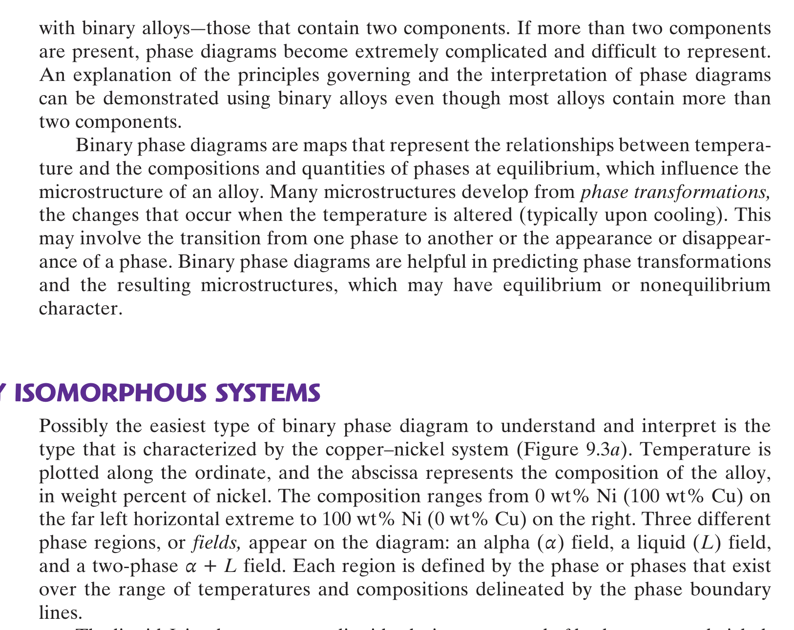
*Figure 9.3: Tie-line and lever rule construction in a binary isomorphous system.*

*Figure 9.24: The Iron-Iron Carbide ($Fe-Fe_3C$) phase diagram showing ferrite ($lpha$), austenite ($\gamma$), and cementite ($Fe_3C$).*

#### In-Depth Visual Breakdown:
* **The Lever Rule (Figure 9.3)**: At point $B$ (temperature $T_0$, composition $C_0$):
  * Draw horizontal tie-line from solidus line $C_lpha$ to liquidus line $C_L$.
  * The total tie-line length is $(C_lpha - C_L)$.
  * The weight fraction of liquid $W_L$ is the length of the segment opposite to the liquidus line, divided by total length: $W_L = rac{C_lpha - C_0}{C_lpha - C_L}$.
* **The $Fe-Fe_3C$ Phase Diagram (Figure 9.24)**: The cornerstone of mechanical engineering materials:
  * **Steels** contain $< 2.14\text{ wt}\%\text{ C}$ (typically $0.05 - 1.2\text{ wt}\%$).
  * **Cast Irons** contain $> 2.14\text{ wt}\%\text{ C}$ (typically $3.0 - 4.5\text{ wt}\%$).
  * **Hypoeutectoid Steels** ($C_0 < 0.76\%\text{ C}$): Cool to form proeutectoid ferrite + pearlite.
  * **Hypereutectoid Steels** ($C_0 > 0.76\%\text{ C}$): Cool to form proeutectoid cementite + pearlite.

### 4. ⚖️ Teacher Notes Cross-Reference & Concordia Exam Traps
* **Concordia Exam Focus**:
  * Calculating the fraction of **proeutectoid ferrite** vs. **eutectoid ferrite** vs. **total ferrite** in hypoeutectoid steels.
* **The Classic Concordia Exam Trap**:
  * **Total Ferrite vs. Proeutectoid Ferrite**:
    * **Total Ferrite ($lpha_{	ext{total}}$)** is calculated across the entire baseline tie-line at $726^\circ	ext{C}$ ($0.022\%$ to $6.70\%$):
      $$W_{\alpha,\text{total}} = \frac{6.70 - C_0}{6.70 - 0.022}$$
    * **Proeutectoid Ferrite ($lpha_{	ext{pro}}$)** is calculated *just above the eutectoid temperature* ($728^\circ	ext{C}$) between $0.022\%$ and $0.76\%$:
      $$W_{\alpha,\text{pro}} = \frac{0.76 - C_0}{0.76 - 0.022}$$
    * **Eutectoid Ferrite** is the ferrite residing *inside* the pearlite colonies:
      $$W_{\alpha,\text{eutectoid}} = W_{\alpha,\text{total}} - W_{\alpha,\text{pro}}$$

### 5. 💡 Master Exam Problem & Step-by-Step Solution Framework
**Problem (Classic Concordia Final Exam Question)**:
*For a $0.35	ext{ wt}\%	ext{ C}$ plain carbon steel cooled slowly to just below $727^\circ	ext{C}$, calculate: (a) The mass fraction of total ferrite ($lpha$) and total cementite ($Fe_3C$), and (b) The mass fraction of proeutectoid ferrite and pearlite.*

* **Step 1: Compute Total Phases Just Below $727^\circ	ext{C}$ (Tie-line: $0.022\%$ to $6.70\%$)**
  $$W_{\alpha,\text{total}} = \frac{6.70 - 0.35}{6.70 - 0.022} = \frac{6.35}{6.678} = 0.951 \quad (95.1\%)$$
  $$W_{Fe_3C,\text{total}} = \frac{0.35 - 0.022}{6.70 - 0.022} = \frac{0.328}{6.678} = 0.049 \quad (4.9\%)$$
* **Step 2: Compute Microconstituents Just Above $727^\circ	ext{C}$ (Tie-line: $0.022\%$ to $0.76\%$)**
  *At $728^\circ	ext{C}$, the steel consists of proeutectoid $lpha$ and austenite $\gamma$*:
  $$W_{\alpha,\text{pro}} = \frac{0.76 - 0.35}{0.76 - 0.022} = \frac{0.41}{0.738} = 0.556 \quad (55.6\%)$$
  $$W_\gamma = \frac{0.35 - 0.022}{0.76 - 0.022} = \frac{0.328}{0.738} = 0.444 \quad (44.4\%)$$
* **Step 3: Relate Austenite to Pearlite**
  *Upon cooling through $727^\circ	ext{C}$, all remaining austenite of composition $0.76\%$ transforms 1-to-1 into pearlite*:
  $$W_{\text{pearlite}} = W_\gamma = 0.444 \quad (44.4\%)$$
* **Step 4: Verify Consistency**
  $$W_{\alpha,\text{pro}} + W_{\text{pearlite}} = 0.556 + 0.444 = 1.000 \quad (100\%)$$
  *Amount of eutectoid ferrite inside pearlite*:
  $$W_{\alpha,\text{eutectoid}} = 0.951 - 0.556 = 0.395 \quad (39.5\%)$$

---

## 📖 Chapters 12 & 13: Structures, Properties and Processing of Ceramics
*(Syllabus Week 9 · Sections 12.3–12.11 & 13.11)*

### 1. 🎯 30-Second Core Intuition & Plain-English Concept
Ceramics are compounds of metallic and nonmetallic elements held by strong **ionic and covalent bonds**. 

Because ions have fixed positive and negative charges, like-charges fiercely repel if atomic planes attempt to slide. Therefore, **dislocation motion is virtually impossible** at room temperature. Ceramics cannot plastically deform; under tension, microscopic surface microcracks concentrate stress and propagate instantaneously at the speed of sound (**brittle catastrophic fracture**).

*Real-World Analogy*: Trying to slide a row of alternating north-south magnets past another row. As soon as you shift them half a notch, all north poles align with north poles, and the entire structure blasts violently apart.

### 2. ⚙️ High-Yield Mathematical Engine & Ceramic Geometry

#### 1. Cation-to-Anion Radius Ratio ($r_C / r_A$) Coordination Table
Cations are smaller than anions ($r_C < r_A$). Stable crystal structures require cations to maximize contact with surrounding anions without allowing anions to overlap:

| Radius Ratio ($r_C / r_A$) | Coordination Number (CN) | Coordination Geometry | Archetypal Ceramic Crystal Structure |
| :---: | :---: | :---: | :--- |
| $< 0.155$ | 2 | Linear | Inert gas configurations |
| $0.155 - 0.225$ | 3 | Triangular planar | $	ext{B}_2	ext{O}_3$ |
| $0.225 - 0.414$ | 4 | Tetrahedral | Zinc Blende ($	ext{ZnS}$), $	ext{SiO}_4^{4-}$ |
| $0.414 - 0.732$ | 6 | Octahedral | Rock Salt ($	ext{NaCl}$, $	ext{MgO}$, $	ext{FeO}$) |
| $0.732 - 1.000$ | 8 | Cubic | Cesium Chloride ($	ext{CsCl}$) |
| $> 1.000$ | 12 | Close-packed | Rare intermetallic ceramics |

#### 2. Defect Chemistry in Ceramics
To preserve **electroneutrality** (charge neutrality):
* **Frenkel Defect**: A cation vacates its normal lattice site and squeezes into a nearby interstitial position (cation vacancy + cation interstitial; no net charge change).
* **Schottky Defect**: A stoichiometric pair consisting of **one cation vacancy AND one anion vacancy** (e.g., in $	ext{NaCl}$, one $	ext{Na}^+$ missing and one $	ext{Cl}^-$ missing; net charge remains zero).

#### 3. Flexural Strength via Three-Point Bending ($\sigma_{fs}$)
Because ceramics break prematurely in tension grips, tensile strength is measured via transverse bending:
$$\sigma_{fs} = \frac{3 F_f L}{2 b d^2} \quad (\text{Rectangular cross-section: width } b, \text{ depth } d, \text{ support span } L)$$
$$\sigma_{fs} = \frac{F_f L}{\pi R^3} \quad (\text{Circular cross-section of radius } R)$$

### 3. 🖼️ Textbook Reference Diagram & Visual Pedagogical Analysis

*Figure 12.2: Rock Salt ($	ext{NaCl}$) unit cell. FCC anion packing with cations occupying all octahedral interstices.*

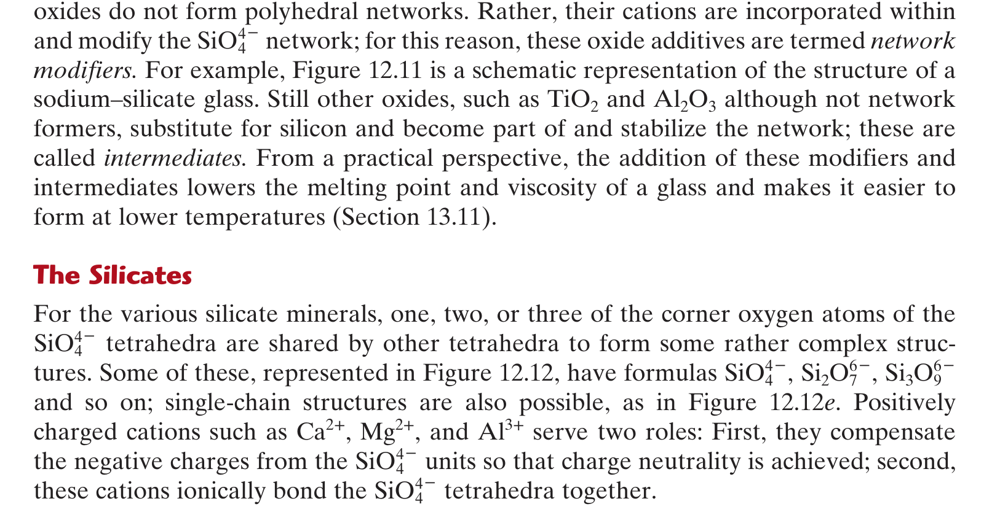
*Figure 12.10: 2D representation of noncrystalline silica glass with network modifier cations ($	ext{Na}^+$, $	ext{Ca}^{2+}$) disrupting the bridging oxygen network.*

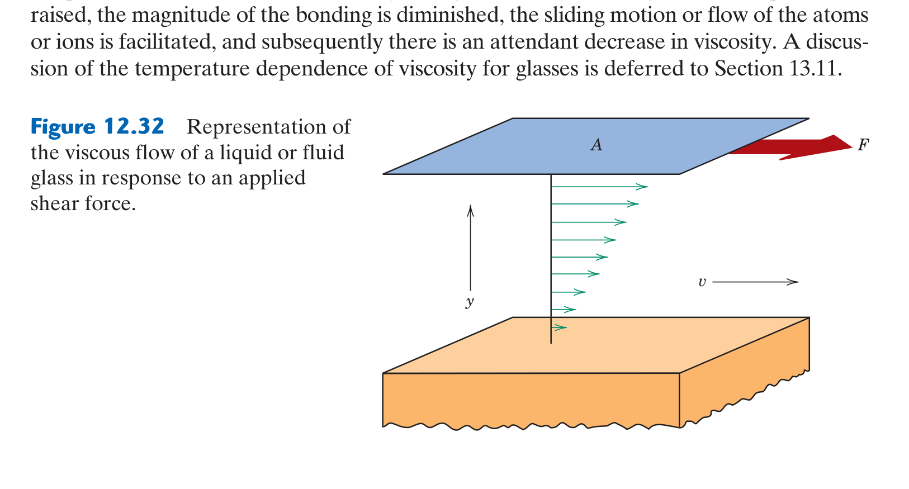
*Figure 12.32: Three-point bending fixture for measuring flexural strength of brittle ceramics.*

#### In-Depth Visual Breakdown:
* **Rock Salt Structure (Figure 12.2)**: Anions ($	ext{Cl}^-$) form an FCC unit cell lattice. Octahedral interstitial sites are located at the center of the unit cell and at the midpoints of all 12 cube edges. Cations ($	ext{Na}^+$) fill all octahedral sites ($n = 4$ formula units per cell).
* **Silicate Glass (Figure 12.10)**: Pure crystalline silica ($	ext{SiO}_2$) forms a rigid, ordered network of corner-sharing $	ext{SiO}_4^{4-}$ tetrahedra. Adding network modifiers like soda ($	ext{Na}_2	ext{O}$) and lime ($	ext{CaO}$) introduces non-bridging oxygen atoms, breaking up network connectivity, drastically lowering the melting point from $1710^\circ	ext{C}$ to $pprox 1000^\circ	ext{C}$ to produce workable window glass.

### 4. ⚖️ Teacher Notes Cross-Reference & Concordia Exam Traps
* **Concordia Exam Focus**:
  * Predicting ceramic coordination number and crystal structure from ion radii ($r_{	ext{cation}}$ and $r_{	ext{anion}}$).
  * Calculating flexural strength $\sigma_{fs}$ from 3-point bend test failure loads.
  * Explaining why ceramics have high compressive strength ($10	imes$ higher) but low tensile strength (Griffith flaw theory: microcracks open in tension but close harmlessly in compression).
* **Concordia Exam Traps**:
  * Forgetting that in the 3-point bending formula for rectangular bars ($\sigma_{fs} = rac{3FL}{2bd^2}$), the depth $d$ is **squared**, whereas width $b$ is linear. Inverting $b$ and $d$ will produce massive numerical errors!

### 5. 💡 Master Exam Problem & Step-by-Step Solution Framework
**Problem**: *Magnesium oxide ($	ext{MgO}$) has $r_{	ext{Mg}^{2+}} = 0.072	ext{ nm}$ and $r_{	ext{O}^{2-}} = 0.140	ext{ nm}$. (a) Predict the coordination number and crystal structure. (b) A rectangular bar of $	ext{MgO}$ ($b = 10	ext{ mm}, d = 5	ext{ mm}$) tested in a 3-point bend fixture with span $L = 50	ext{ mm}$ fractures at load $F_f = 2,500	ext{ N}$. Compute its flexural strength.*

* **Step 1: Compute Cation-Anion Radius Ratio**
  $$\frac{r_{\text{Mg}^{2+}}}{r_{\text{O}^{2-}}} = \frac{0.072\text{ nm}}{0.140\text{ nm}} = 0.514$$
* **Step 2: Predict Coordination and Structure**
  *Since $0.414 < 0.514 < 0.732$, the coordination number is **6 (Octahedral)**. Because stoichiometry is $1:1$ ($	ext{AX}$ type), $	ext{MgO}$ crystallizes in the **Rock Salt ($	ext{NaCl}$) crystal structure**.*
* **Step 3: Calculate Flexural Strength $\sigma_{fs}$**
  $$\sigma_{fs} = \frac{3 F_f L}{2 b d^2} = \frac{3(2,500\text{ N})(0.050\text{ m})}{2(0.010\text{ m})(0.005\text{ m})^2} = \frac{375}{2(0.010)(2.5 \times 10^{-5})} = \frac{375}{5.0 \times 10^{-7}} = 750 \times 10^6\text{ Pa} = 750\text{ MPa}$$

---

## 📖 Chapters 14 & 15: Polymer Structures and Properties
*(Syllabus Week 10 · Sections 14.1–14.15 & 15.1–15.14)*

### 1. 🎯 30-Second Core Intuition & Plain-English Concept
Polymers are gigantic macromolecular chains made of repeating chemical units (monomers) linked by strong covalent bonds. 

The mechanical behavior depends entirely on whether chains are free to slide past one another (**Thermoplastics**) or permanently locked together into an un-meltable 3D net (**Thermosets**).

*Key Real-World Distinction*:
* **Thermoplastic** (e.g., Polyethylene, Nylon): Like a bowl of cooked spaghetti. When heated, chains slide freely and the plastic melts. Can be reheated and recycled indefinitely.
* **Thermoset** (e.g., Epoxy, Vulcanized Rubber): Like a baked cake. Chemical cross-links form permanent covalent bridges across all chains. Reheating will not melt it; it will simply char and burn. Cannot be recycled by melting.

### 2. ⚙️ High-Yield Mathematical Engine & Molecular Metrics

#### 1. Molecular Weight and Degree of Polymerization
Polymer chains have varying lengths, described by statistical distributions:
* **Number-Average Molecular Weight**: $ar{M}_n = \sum x_i M_i$ ($x_i$: number fraction).
* **Weight-Average Molecular Weight**: $ar{M}_w = \sum w_i M_i$ ($w_i$: weight fraction).
* **Polydispersity Index (PDI)**: $	ext{PDI} = \frac{\bar{M}_w}{\bar{M}_n} \ge 1.0$ (Measures breadth of chain length distribution).
* **Degree of Polymerization (DP)**:
  $$DP = \frac{\bar{M}_n}{m}$$
  where $m$ is the molecular weight of the single repeating monomer unit.

#### 2. Molecular Architectures & Tacticity
* **Architectures**: Linear $\to$ Branched $\to$ Cross-linked $\to$ Network.
* **Tacticity (Stereoisomerism)**:
  * **Isotactic**: All side $R$-groups positioned on the *same side* of the chain (crystallizes easily).
  * **Syndiotactic**: $R$-groups alternate regularly from *side to side*.
  * **Atactic**: $R$-groups positioned *randomly* (prevents chain packing; completely amorphous).

#### 3. Thermal Transitions
* **Glass Transition Temperature ($T_g$)**: Temperature below which amorphous polymer chains freeze into a brittle, glassy state; above $T_g$, chains become mobile, leathery, and rubbery.
* **Melting Temperature ($T_m$)**: Temperature where crystalline ordered lamellae melt into a disordered liquid.

### 3. 🖼️ Textbook Reference Diagram & Visual Pedagogical Analysis

*Figure 14.7: Schematic representation of polymer chain structures: (a) Linear, (b) Branched, (c) Crosslinked, and (d) Network.*

*Figure 15.1: Stress-strain behavior for polymers: Curve A (Brittle polymer below $T_g$), Curve B (Plastic polymer with necking/drawing), and Curve C (Highly elastic elastomer).*

#### In-Depth Visual Breakdown:
* **Chain Architectures (Figure 14.7)**:
  * *(a) Linear*: High packing density (HDPE); high crystallinity and strength.
  * *(b) Branched*: Side branches prevent tight packing (LDPE); lower density and greater flexibility.
  * *(c) Crosslinked*: Adjacent chains joined by covalent bonds (vulcanized rubber with sulfur crosslinks); imparts elasticity.
  * *(d) Network*: Fully 3D covalent crosslinking (epoxies, phenolics); rigid and completely non-meltable.
* **Polymer Stress-Strain Curves (Figure 15.1)**:
  * Unlike metals where necking leads directly to failure, semicrystalline polymers (Curve B) experience **drawing**: the polymer necks, and then the neck propagates down the entire gage length as disordered polymer chains align parallel to the tensile axis, dramatically strengthening the necked region!

### 4. ⚖️ Teacher Notes Cross-Reference & Concordia Exam Traps
* **Concordia Exam Focus**:
  * Calculating repeat unit molecular weight $m$ and finding $DP$ from given $ar{M}_n$.
  * Comparing properties above and below $T_g$ (e.g., rubber car tires shattering like glass in liquid nitrogen).
  * Distinguishing condensation (step-growth, releases water by-product) vs. addition (chain-growth) polymerization.
* **Concordia Exam Traps**:
  * **Repeat Unit Mass ($m$) Calculation**: Forgetting to account for double bonds opening up. Polyethylene monomer is ethylene ($	ext{C}_2	ext{H}_4$), so $m = 2(12.011) + 4(1.008) = 28.05\text{ g/mol}$. In vinyl chloride ($	ext{C}_2	ext{H}_3	ext{Cl}$), you replace one $	ext{H}$ with $	ext{Cl}$ ($35.45\text{ g/mol}$).

### 5. 💡 Master Exam Problem & Step-by-Step Solution Framework
**Problem**: *A polyvinyl chloride (PVC) pipe material has a number-average molecular weight $ar{M}_n = 125,000	ext{ g/mol}$. (a) Calculate the repeat unit molecular weight $m$. (b) Determine its degree of polymerization $DP$.*

* **Step 1: Determine Chemical Formula of PVC Repeat Unit**
  *PVC repeat unit is $[-\text{CH}_2-\text{CHCl}-]_n$ (derived from $\text{C}_2\text{H}_3\text{Cl}$)*:
  $$\text{Carbon: } 2 \times 12.011 = 24.022\text{ g/mol}$$
  $$\text{Hydrogen: } 3 \times 1.008 = 3.024\text{ g/mol}$$
  $$\text{Chlorine: } 1 \times 35.45 = 35.450\text{ g/mol}$$
  $$m = 24.022 + 3.024 + 35.450 = 62.496\text{ g/mol}$$
* **Step 2: Calculate Degree of Polymerization $DP$**
  $$DP = \frac{\bar{M}_n}{m} = \frac{125,000\text{ g/mol}}{62.496\text{ g/mol}} = 2,000.1 \approx 2,000\text{ repeat units}$$

---

## 📖 Chapter 18: Electrical Properties
*(Syllabus Week 11 · Final Exam Scope)*

### 1. 🎯 30-Second Core Intuition & Plain-English Concept
Electrical conduction depends on whether electrons can easily jump into empty, available energy states to move freely through the solid. 

**Energy Band Theory**:
* **Metals**: Conduction and valence bands overlap (or band is half-filled). Billions of electrons are free to move instantly $\implies$ high conductivity.
* **Insulators**: A massive forbidden energy band gap ($E_g > 5	ext{ eV}$) separates filled and empty states. Electrons cannot jump $\implies$ zero conductivity.
* **Semiconductors**: A narrow band gap ($E_g < 2	ext{ eV}$). Thermal energy can kick electrons across the gap $\implies$ conductivity increases exponentially with temperature!

### 2. ⚙️ High-Yield Mathematical Engine & Semiconductor Physics

#### 1. Ohm's Law and Electrical Conductivity
$$V = IR, \quad \rho_{\text{el}} = \frac{RA}{l}, \quad \sigma_{\text{el}} = \frac{1}{\rho_{\text{el}}} = n|e|\mu_e + p|e|\mu_h$$
* $n, p$: Free electron and hole concentrations ($	ext{m}^{-3}$).
* $\mu_e, \mu_h$: Electron and hole mobilities ($	ext{m}^2/\text{V}\cdot\text{s}$).
* $e$: Elementary charge ($1.602 \times 10^{-19}\text{ C}$).

#### 2. Intrinsic vs. Extrinsic Semiconductors
* **Intrinsic (Pure Si, Ge)**: $n = p = n_i$. Conductivity rises exponentially with temperature:
  $$\sigma \propto \exp\left(-\frac{E_g}{2 k_B T}\right)$$
* **Extrinsic (Doped)**:
  * **$n$-Type**: Doped with Group V elements (P, As, Sb). Donates free electrons ($n \gg p$).
  * **$p$-Type**: Doped with Group III elements (B, Al, Ga). Creates positive holes ($p \gg n$).

### 3. 🖼️ Textbook Reference Diagram & Visual Pedagogical Analysis

*Figure 18.4: Electron band structures: (a, b) Metals (overlapping / partially filled), (c) Insulators (wide gap), and (d) Semiconductors (narrow gap).*

#### In-Depth Visual Breakdown:
* **Figure 18.4**: Demonstrates why metals conduct and insulators do not:
  * In metals (a, b), the Fermi level $E_F$ lies inside a band or between overlapping bands. Adjacent unoccupied states exist immediately above $E_F$; negligible electrical field excites electrons into motion.
  * In insulators (c), the valence band is completely full and separated from the empty conduction band by a wide forbidden gap ($E_g > 5	ext{ eV}$). Room temperature thermal energy ($k_B T pprox 0.026	ext{ eV}$) is completely incapable of exciting electrons across this gap.
  * In semiconductors (d), $E_g pprox 1.1	ext{ eV}$ (Silicon). Thermal vibrations easily kick a steady stream of electrons into the conduction band, leaving equal numbers of conducting holes behind.

### 4. ⚖️ Teacher Notes Cross-Reference & Concordia Exam Traps
* **Concordia Exam Focus**:
  * Explaining the opposing temperature effects:
    * In **metals**, electrical conductivity **decreases** as temperature rises (thermal lattice vibrations scatter electrons: resistivity $
ho = 
ho_0 + aT$).
    * In **intrinsic semiconductors**, electrical conductivity **increases exponentially** with temperature (thermal energy excites vastly more charge carriers across $E_g$).

---

## 📖 Chapter 19: Thermal Properties
*(Syllabus Week 11 · Final Exam Scope)*

### 1. 🎯 30-Second Core Intuition & Plain-English Concept
Heat is simply atomic vibrations. In solids, heat is stored in quantized vibrational waves called **phonons** and transported through the material by both phonons and free electrons.

**Why Materials Expand When Heated**: Thermal expansion is a direct consequence of the **asymmetry (anharmonicity)** of the interatomic potential energy well! Because it takes less energy to push atoms apart than to squeeze them together, heating an atom makes it vibrate outward, increasing the average interatomic spacing.

### 2. ⚙️ High-Yield Mathematical Engine & Thermal Properties

#### 1. Heat Capacity ($C_v$)
$$C_v = \left( \frac{\partial E}{\partial T} \right)_v$$
* At high temperatures ($T > 	heta_D$, Debye Temperature), heat capacity reaches the universal **Dulong-Petit Limit**:
  $$C_v \approx 3R \approx 25\text{ J/mol}\cdot\text{K}$$

#### 2. Linear Thermal Expansion
$$\frac{\Delta l}{l_0} = \alpha_l \Delta T$$
* $lpha_l$: Linear coefficient of thermal expansion ($	ext{K}^{-1}$ or $^\circ	ext{C}^{-1}$).
* Ceramics have lower $lpha_l$ than metals; polymers have the highest $lpha_l$ (weak van der Waals bonds).

#### 3. Thermal Conductivity ($k$) and Thermal Shock Resistance (TSR)
$$q = -k \frac{dT}{dx} \quad (\text{Fourier's Law})$$
* **Thermal Shock Resistance (TSR)**: The ability of a ceramic to withstand rapid cooling without fracture:
  $$TSR \cong \frac{\sigma_f \cdot k}{E \cdot \alpha_l}$$
  *(To resist cracking during quenching, a ceramic must have high strength $\sigma_f$, high thermal conductivity $k$, low stiffness $E$, and low thermal expansion $lpha_l$)*.

### 3. 🖼️ Textbook Reference Diagram & Visual Pedagogical Analysis

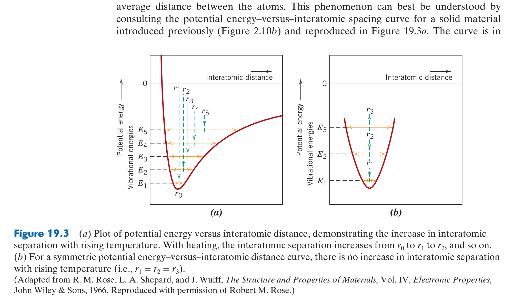
*Figure 19.3: Potential energy vs. interatomic distance: (a) Asymmetric well demonstrating increase in average interatomic spacing $r_T$ with rising temperature, vs. (b) A hypothetical symmetric well with zero thermal expansion.*

#### In-Depth Visual Breakdown:
* **The Asymmetric Well (Figure 19.3a)**: At $0	ext{ K}$, atoms sit at minimum $r_0$. As temperature rises to $T_1, T_2, T_3$, the atom vibrates between the left and right walls of the well. Because the repulsive wall (left) is much steeper than the attractive wall (right), the midpoint of vibration shifts progressively outward ($r_3 > r_2 > r_1 > r_0$). This macroscopic shift is thermal expansion.
* **The Hypothetical Symmetric Well (Figure 19.3b)**: If interatomic forces were perfectly symmetric (parabolic well), heating would expand vibrations equally in both directions, the average separation would remain constant ($r_T = r_0$), and the material would have **zero thermal expansion** ($lpha_l = 0$).

---

## 📖 Chapter 21: Optical Properties
*(Syllabus Week 12 · Final Exam Scope)*

### 1. 🎯 30-Second Core Intuition & Plain-English Concept
Light is electromagnetic radiation. When a light wave strikes a solid, three things can happen: it can bounce off (**Reflection**), get absorbed by electrons (**Absorption**), or pass through unscathed (**Transmission**):
$$R + A + T = 1$$

**Why Glass is Transparent and Metals are Opaque**:
* **Metals**: Have empty electronic energy states everywhere. Photons of *all* visible wavelengths are instantly absorbed by electrons and re-emitted $\implies$ metals are totally opaque and highly reflective.
* **Insulators / Glasses**: Have an energy band gap ($E_g > 3.1	ext{ eV}$) that is larger than visible light photon energies ($1.8 - 3.1	ext{ eV}$). Photons do not possess enough energy to excite electrons across the band gap $\implies$ light cannot be absorbed and passes straight through (transparent!).

### 2. ⚙️ High-Yield Mathematical Engine & Optical Physics

#### 1. Photon Energy and Wavelength Relation
$$E = h\nu = \frac{hc}{\lambda}$$
* $h$: Planck's constant ($4.136 \times 10^{-15}\text{ eV}\cdot\text{s} = 6.626 \times 10^{-34}\text{ J}\cdot\text{s}$).
* $c$: Speed of light ($3.0 \times 10^8\text{ m/s}$).
* **Concordia Shortcut**:
  $$E (\text{eV}) = \frac{1.24}{\lambda (\mu\text{m})}$$

#### 2. Fundamental Absorption Condition
A photon can be absorbed by an electron transition across a band gap if and only if:
$$h\nu \ge E_g \iff \lambda \le \frac{hc}{E_g}$$
* If $E_g > 3.1\text{ eV}$ ($\lambda < 0.4\text{ }\mu\text{m}$, ultraviolet), visible light ($0.4 - 0.7\text{ }\mu\text{m}$) cannot be absorbed, making the material **optically transparent** (e.g., Diamond $E_g = 5.5\text{ eV}$).

### 3. 🖼️ Textbook Reference Diagram & Visual Pedagogical Analysis

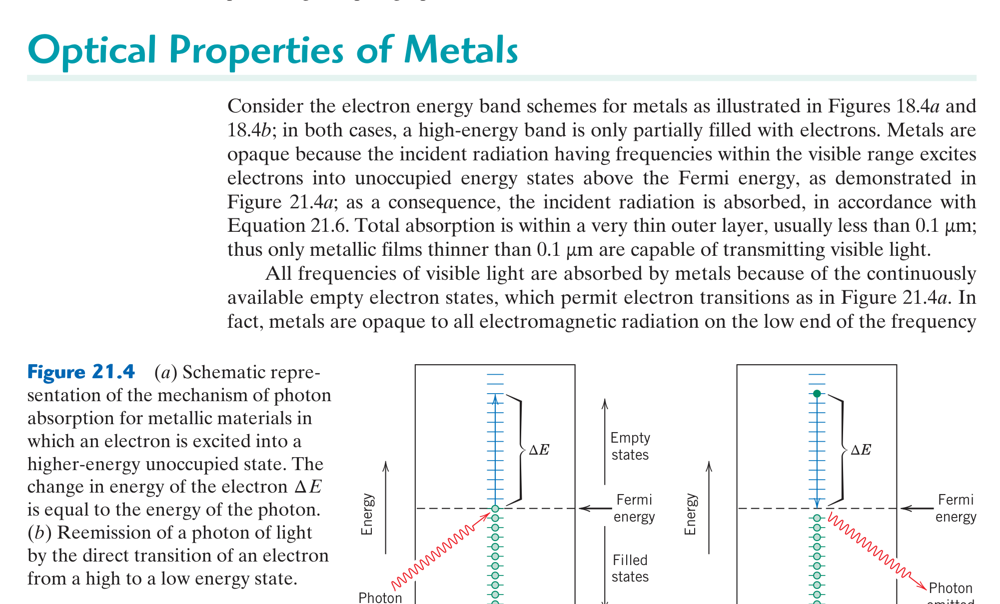
*Figure 21.4: (a) Electron excitation across a band gap via photon absorption ($h
u > E_g$), and (b) Subsequent decay and light re-emission.*

#### In-Depth Visual Breakdown:
* **Photon Absorption (Figure 21.4a)**: An incoming photon with energy $h
u \ge E_g$ is annihilated, promoting an electron from the valence band into the conduction band and creating a hole in the valence band.
* **Electron Relaxation (Figure 21.4b)**: When the excited electron falls back to the valence band, it releases energy by emitting a photon (luminescence/fluorescence) or generating heat (phonons).

---

## ⚡ Master Formula & Exam Shortcut Cheatsheet

| Topic | Equation | Key Units & Constants | Quick Exam Context |
| :--- | :--- | :--- | :--- |
| **Bonding Energy** | $E_N(r) = -\frac{A}{r} + \frac{B}{r^n}$ | $r$ in $\text{nm}$, $E$ in $\text{eV}$ | Minimum at $r_0$ where $dE_N/dr = 0$ |
| **Ionic Character** | $\%\text{IC} = [1 - e^{-0.25(X_A - X_B)^2}] \times 100\%$ | $X$: Pauling electronegativity | Ionic if $\%\text{IC} > 50\%$ |
| **BCC Lattice** | $a = \frac{4R}{\sqrt{3}}, \quad \text{APF} = 0.680$ | $n = 2$ atoms/cell, $\text{CN} = 8$ | Atoms touch along body diagonal |
| **FCC Lattice** | $a = 2\sqrt{2}R, \quad \text{APF} = 0.740$ | $n = 4$ atoms/cell, $\text{CN} = 12$ | Atoms touch along face diagonal |
| **Theoretical Density** | $\rho = \frac{n \cdot A}{V_c \cdot N_A}$ | $A$ in $\text{g/mol}$, $V_c$ in $\text{cm}^3$ | $N_A = 6.022 \times 10^{23}\text{ mol}^{-1}$ |
| **Miller Indices (Planes)** | $(hkl) = (1/x, 1/y, 1/z) \times \text{LCD}$ | Round parentheses, no commas | If plane hits origin, translate origin! |
| **Bragg's Law (XRD)** | $n\lambda = 2 d_{hkl} \sin\theta$ | $d_{hkl} = a/\sqrt{h^2+k^2+l^2}$ | Remember: detector reports $2\theta$! |
| **Vacancies (Arrhenius)** | $N_v = N \exp(-Q_v / k_B T)$ | $k_B = 8.62 \times 10^{-5}\text{ eV/K}$ | Convert $T$ to Kelvin! |
| **Fick's First Law** | $J = -D \frac{dC}{dx}$ | $D$ in $\text{m}^2/\text{s}$, $J$ in $\text{kg}/(\text{m}^2\cdot\text{s})$ | Steady-state diffusion flux |
| **Carburization (Fick II)**| $\frac{C_x - C_0}{C_s - C_0} = 1 - \text{erf}\left(\frac{x}{2\sqrt{Dt}}\right)$ | $\text{erf}(z)$ via interpolation table | If ratio is fixed: $x^2/(Dt) = \text{const}$ |
| **Hooke's Law** | $\sigma = E \epsilon$ | $E$ in $\text{GPa}$, $\sigma$ in $\text{MPa}$ | Elastic linear region slope |
| **Yield Offset** | $0.2\% = 0.002$ strain offset | Parallel to elastic slope $E$ | Standard $\sigma_y$ determination |
| **Schmid's Law** | $\tau_R = \sigma \cos\phi \cos\lambda$ | $\phi$: normal to plane; $\lambda$: slip dir | Yield occurs when $\tau_R = \tau_{\text{crss}}$ |
| **Hall-Petch** | $\sigma_y = \sigma_0 + k_y d^{-1/2}$ | $d$: grain diameter in $\text{mm}$ | Finer grains = higher $\sigma_y$ and toughness |
| **Cold Work** | $\%CW = \left(\frac{A_0 - A_d}{A_0}\right) \times 100\%$ | Cross-sectional area reduction | Increases $\sigma_y$, decreases ductility |
| **Lever Rule** | $W_L = \frac{C_\alpha - C_0}{C_\alpha - C_L}$ | Opposite lever arm / Total length | Phase fraction in two-phase region |
| **$Fe-Fe_3C$ Eutectoid** | $\gamma (0.76\%) \to \alpha (0.022\%) + Fe_3C (6.70\%)$ | Occurs at $727^\circ\text{C}$ | Produces lamellar pearlite |
| **Ceramic 3-Point Bend**| $\sigma_{fs} = \frac{3 F_f L}{2 b d^2}$ | $b$: width, $d$: depth, $L$: span | Brittle flexural failure stress |
| **Polymer DP** | $DP = \bar{M}_n / m$ | $m$: repeat unit molecular weight | Chain length metric |
| **Thermal Shock** | $TSR \cong \frac{\sigma_f k}{E \alpha_l}$ | High $\sigma_f, k$; Low $E, \alpha_l$ | Resistance to thermal quench cracks |
| **Photon Absorption** | $E = hc/\lambda = 1.24/\lambda(\mu\text{m}) \ge E_g$ | $\lambda$ in $\mu\text{m}$, $E$ in $\text{eV}$ | Condition for electron excitation |

---

## 🏁 Final Advice for MIAE 221 Exam Success

1. **Calculations are King**: Over $70\%$ of the marks on Dr. Medraj's midterm and final exams come from numerical derivations (atomic packing, density, Bragg's Law, diffusion time, Schmid's Law, lever rule, and flexural strength). Practice writing out every single step with explicit SI units.
2. **Beware the Classic Traps**:
   * Always convert temperature to **Kelvin** ($K = ^\circ\text{C} + 273.15$).
   * In XRD, always check whether the problem gives the Bragg angle $\theta$ or the diffractometer angle $2\theta$.
   * In $Fe-Fe_3C$ lever rule problems, always read carefully whether the question asks for **proeutectoid ferrite** or **total ferrite**.
3. **Use the Materials Science Paradigm**: When answering descriptive questions, always tie your answer back to the **Tetrahedron**: $\text{Processing} \to \text{Structure} \to \text{Properties} \to \text{Performance}$. Explain the physical *why* at the atomic or dislocation level!
