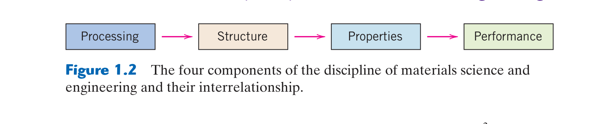

# Chapter 01: Introduction to Materials Science & Engineering
### Concordia University · Department of Mechanical, Industrial & Aerospace Engineering
**Course**: Materials Science (MIAE 221)  
**Textbook**: *Materials Science and Engineering: An Introduction* (10th Edition) by William D. Callister, Jr. & David G. Rethwisch — Chapter 1

---

## 1. Executive Overview & The Central Paradigm

In mechanical, industrial, and aerospace engineering, every physical device, vehicle, and structure is fundamentally constrained by the materials from which it is manufactured:
* A jet turbine blade in a Rolls-Royce Trent 1000 engine operates in gas temperatures exceeding $1500^\circ\text{C}$—above the melting point of ordinary steels—under centrifugal stresses exceeding $300\text{ MPa}$.
* An aerospace fuselage on the Boeing 787 Dreamliner must endure repeated cabin pressurization cycles while minimizing structural mass to reduce fuel consumption.
* Biomedical artificial hip implants must withstand millions of walking fatigue cycles inside corrosive saline body fluids without eliciting toxic immune responses or mechanical loosening.

The discipline is bifurcated into two complementary pursuits:
1. **Materials Science**: Investigates the fundamental physical and chemical relationships that exist between the **internal structure** of materials (from subatomic electrons to macroscopic grains) and their observable **properties**.
2. **Materials Engineering**: Applies this fundamental structure-property knowledge to **design or engineer the structure** of a material to produce a predetermined set of engineering properties tailored for specific real-world applications.

### The Central Paradigm: The Materials Science Tetrahedron
The entire field of materials science rests upon four interconnected, co-dependent pillars:
$$\text{Processing} \longrightarrow \text{Structure} \longrightarrow \text{Properties} \longrightarrow \text{Performance}$$

```
                           PERFORMANCE
                           (Application)
                                ▲
                               /|\
                              / | \
                             /  |  \
                            /   |   \
                           /    |    \
                          /CHARACTER- \
                         /   IZATION   \
                        /       |       \
                       /        ▼        \
                 STRUCTURE ◄─────────► PROPERTIES
                 (Internal)             (Metrics)
                     ▲                     ▲
                      \                   /
                       \                 /
                        \               /
                         \             /
                          \           /
                           \         /
                            \       /
                           PROCESSING
                           (Synthesis)
```

1. **Processing**: The sequence of thermal, mechanical, chemical, and physical treatments used to synthesize and shape a material (e.g., casting, forging, cold rolling, vapor deposition, sintering, annealing).
2. **Structure**: The arrangement of internal components at various dimensional scales:
   * *Subatomic*: Electronic configurations and atomic orbital interactions.
   * *Atomic / Crystal*: Spatial arrangement of atoms, unit cells, Bravais lattices, and amorphous networks.
   * *Nanostructure / Microstructure*: Microscopic features observable under microscopes, such as grains, grain boundaries, dislocations, precipitates, and multi-phase mixtures ($0.1\text{ nm} - 100\ \mu\text{m}$).
   * *Macrostructure*: Macroscopic features visible to the unaided eye ($>100\ \mu\text{m}$), including voids, weld seams, and crack surfaces.
3. **Properties**: A material's intrinsic behavioral response to an imposed external stimulus. Properties are independent of specimen shape and size (e.g., elastic modulus, yield strength, thermal conductivity, electrical resistivity, dielectric constant, index of refraction, chemical corrosion rate).
4. **Performance**: How effectively the finished component fulfills its required engineering function within an operational environment (e.g., fatigue life of an aircraft landing gear, battery cycle life in an electric vehicle, creep life of a turbine disk).

---

## 2. Classification of Engineering Materials (Callister §1.4)

Engineering materials are historically and functionally categorized into three primary structural classes based on **chemical composition and atomic bonding**: **Metals**, **Ceramics**, and **Polymers**. In addition, modern engineering relies heavily on two advanced categories: **Composites** and **Advanced Functional Materials**.

```
                             Engineering Materials
                                       │
     ┌───────────────────┬─────────────┴───────┬───────────────────┐
     ▼                   ▼                     ▼                   ▼
   METALS             CERAMICS              POLYMERS           COMPOSITES
(Metallic Bond)    (Ionic/Covalent)      (Covalent & vdW)     (Multi-Phase)
• Fe, Al, Cu, Ti   • Al₂O₃, SiC, SiO₂   • PE, PP, PVC, PTFE  • CFRP, GFRP
• High conductivity• Hard, brittle       • Lightweight        • Concrete
• Ductile          • High Tₘ, Insulator  • Flexible           • Cermets
```

### 2.1 Metals
* **Atomic Bonding**: **Metallic bonding**, characterized by an array of positively charged ion cores immersed in a delocalized, non-directional "sea of valence electrons" (free-electron gas).
* **Distinctive Mechanical Properties**:
  * High stiffness (Young's modulus $E \approx 40 - 400\text{ GPa}$) and high strength.
  * Exceptional **ductility** and **formability**: The non-directional nature of metallic bonds permits planes of atoms to slide easily over one another (dislocation slip) without cleaving the material, enabling sheet rolling, wire drawing, and stamping.
  * High fracture toughness ($K_{Ic} \approx 20 - 150\text{ MPa}\sqrt{\text{m}}$).
* **Physical & Chemical Properties**:
  * High electrical conductivity ($\sigma \approx 10^7\ (\Omega\cdot\text{m})^{-1}$) and high thermal conductivity ($k \approx 50 - 400\text{ W/(m}\cdot\text{K)}$) due to rapid free-electron transport.
  * Opaque to visible light and highly reflective (luster) because free electrons absorb and re-emit incoming electromagnetic radiation.
  * Susceptible to environmental corrosion and oxidation in humid or acidic media.
* **Engineering Examples**: Carbon and alloy steels, aluminum alloys (structural aircraft skins), titanium alloys (jet engine compressors, biomedical pins), copper alloys (electrical cabling, heat exchangers), nickel-based superalloys (combustion chambers).

### 2.2 Ceramics
* **Atomic Bonding**: Compounds formed between metallic and non-metallic elements (typically oxides, nitrides, and carbides). Governed by **strong ionic bonding** (electrostatic attraction between cations and anions) and/or **directional covalent bonding** (electron pair sharing).
* **Distinctive Mechanical Properties**:
  * Extreme hardness and high compressive strength.
  * **Brittle behavior** with near-zero tensile ductility at room temperature: Strong ionic repulsion between like-sign ions prevents atomic planes from shearing past one another.
  * Low fracture toughness ($K_{Ic} \approx 1 - 5\text{ MPa}\sqrt{\text{m}}$) due to sensitivity to microscopic surface flaws and internal pores (Griffith crack propagation).
* **Physical & Chemical Properties**:
  * High melting temperatures ($T_m > 2000^\circ\text{C}$ for refractory ceramics like alumina, zirconia, silicon carbide).
  * High electrical and thermal insulation: Absence of free electrons forces heat to transport solely via slow lattice vibrations (phonons).
  * Exceptional chemical inertness, oxidation resistance, and wear resistance in hostile, corrosive environments.
* **Engineering Examples**: Aluminum oxide ($\text{Al}_2\text{O}_3$ for abrasive cutting tools and spark plug insulators), silicon carbide ($\text{SiC}$ for high-temperature brake rotors), silicon nitride ($\text{Si}_3\text{N}_4$ for ceramic ball bearings), hydroxyapatite (biocompatible bone coatings), silica glasses ($\text{SiO}_2$ for optical fiber communications).

### 2.3 Polymers
* **Atomic Bonding**: Organic macromolecules based on long carbon-chain backbones. Atoms within the molecular chain are held by strong, directional **covalent bonds**, while adjacent molecular chains are held together by weak secondary **van der Waals forces** or hydrogen bonds.
* **Distinctive Mechanical Properties**:
  * Very low density ($\rho \approx 0.9 - 1.5\text{ g/cm}^3$), roughly one-fifth to one-eighth the density of steel.
  * Extremely flexible with low elastic modulus ($E \approx 0.01 - 4\text{ GPa}$).
  * High tensile ductility (many polymers can stretch plastically by several hundred percent without fracture).
  * Highly temperature-sensitive: Exhibit distinct transitions at the **Glass Transition Temperature ($T_g$)** and melting point ($T_m$).
* **Physical & Chemical Properties**:
  * Chemically inert and resistant to acidic and alkaline corrosive attacks.
  * Low thermal and electrical conductivity (used universally as electrical cable insulation).
  * Prone to mechanical softening and thermal degradation at relatively low temperatures ($T > 150 - 250^\circ\text{C}$).
* **Engineering Examples**: Polyethylene (PE for packaging, grocery bags), polypropylene (PP for automotive battery cases), polyvinyl chloride (PVC for plumbing pipes), polytetrafluoroethylene (PTFE/Teflon for non-stick surfaces), polycarbonate (shatter-resistant lenses and safety shields), epoxy resins (structural adhesives).

### 2.4 Composites
A **composite material** consists of two or more distinct, physically separate phases (usually a continuous **matrix phase** and a dispersed **reinforcement phase**) combined to achieve a synergy of properties that neither constituent exhibits alone:
* **The Principle of Combined Action**: The stiff, strong reinforcement phase carries tensile loads, while the compliant matrix phase binds the fibers together, distributes stresses, and shields the reinforcements from chemical damage.
* **Key Subclasses**:
  1. **Carbon Fiber-Reinforced Polymer (CFRP)**: High-strength, high-stiffness carbon filaments embedded in an epoxy matrix. Delivers specific modulus ($E/\rho$) and specific strength ($\sigma/\rho$) far superior to aerospace aluminum alloys or titanium. Used in the Boeing 787 fuselage, Airbus A350 wings, and Formula 1 monocoques.
  2. **Glass Fiber-Reinforced Polymer (GFRP / Fiberglass)**: E-glass fibers in polyester resin. Low cost, high corrosion resistance. Used in boat hulls, wind turbine blades, and automotive body panels.
  3. **Concrete**: Ceramic particulate composite composed of cement matrix and crushed stone aggregate.
  4. **Cermets**: Ceramic-metal composites (e.g., tungsten carbide particles embedded in a tough cobalt metallic matrix, $\text{WC-Co}$) used for ultra-high-wear industrial drill bits.

### 2.5 Advanced Materials
Materials utilized in high-technology devices, categorized by their operational functions rather than chemical composition:
1. **Semiconductors**: Electrical conductivity intermediate between conductors and insulators ($\sigma \approx 10^{-6} - 10^4\ (\Omega\cdot\text{m})^{-1}$). Characterized by a narrow electronic bandgap ($E_g \approx 1 - 2\text{ eV}$). Extremely sensitive to deliberate atomic-scale impurity additions (**doping** with parts-per-billion Group III or V elements). Forms the foundation of modern integrated circuits, microprocessors, diodes, and photovoltaic solar cells (Silicon, Germanium, Gallium Arsenide).
2. **Biomaterials**: Synthetic or natural materials implanted into the human body to replace or repair damaged tissues without inducing toxic, allergic, or immunological rejection. Requires bio-inertness or controlled bio-resorption. Examples include surgical titanium grade Ti-6Al-4V, ultra-high-molecular-weight polyethylene (UHMWPE) for artificial joint acetabular cups, and polyglycolic acid (PGA) for bioabsorbable sutures.
3. **Smart Materials**: Advanced materials capable of sensing changes in their environment (temperature, stress, electric field, magnetic field, light) and responding dynamically in a predetermined, reversible manner:
   * *Shape Memory Alloys (SMA)*: Materials like Nitinol (Ni-Ti) that recover their original un-deformed geometry upon moderate heating through a reversible martensitic-austenitic phase transformation (used in self-expanding biomedical vascular stents).
   * *Piezoelectric Materials*: Ceramics like lead zirconate titanate (PZT) that produce an electric voltage when subjected to mechanical strain, and conversely change dimension when an electric field is applied (used in ultrasound transducers, sonar, micro-actuators).
   * *Magnetostrictive Materials*: Expand or contract in response to external magnetic fields (Terfenol-D).
4. **Nanomaterials**: Materials characterized by structural feature sizes below $100\text{ nm}$ in at least one dimension. At the nanoscale, materials exhibit dramatic changes in physical, optical, and catalytic properties driven by **quantum mechanical confinement** and an extraordinary **surface-area-to-volume ratio**. Examples include carbon nanotubes, graphene sheets, quantum dots, and nanoporous aerogels.

---

## 3. Curriculum-Grounded Visual Reference & Pedagogical Breakdown

### 3.1 Visual Analysis: The Alumina Disks ($	ext{Al}_2	ext{O}_3$)


*Figure 1.1: Three thin disk specimens of aluminum oxide ($	ext{Al}_2	ext{O}_3$) demonstrating the profound effect of internal structure on optical properties — from Callister & Rethwisch 10th Ed. (Fig. 1.1).*

#### Detailed Pedagogical Breakdown:
All three disks shown in Figure 1.1 have the **exact same chemical formula** ($	ext{Al}_2	ext{O}_3$), identical thickness, and were photographed resting on the same printed text:
1. **Left Disk (Completely Transparent)**:
   * *Structure*: A single crystal of sapphire ($\alpha\text{-Al}_2\text{O}_3$).
   * *Physical Mechanism*: Because the entire disk consists of one continuous, unbroken crystalline lattice with no internal boundaries, light photons travel straight through without encountering refractive index mismatches. The text beneath is clearly legible.
2. **Center Disk (Translucent)**:
   * *Structure*: Dense polycrystalline alumina.
   * *Physical Mechanism*: Composed of millions of microscopic grains, each oriented in a different crystallographic direction. Although there are no pores, light rays encounter **grain boundaries** where slight refractive index discontinuities cause photons to reflect, refract, and scatter diffusely. The text is blurred and unreadable, but light passes through.
3. **Right Disk (Completely Opaque)**:
   * *Structure*: Sintered polycrystalline alumina containing residual microscopic pores (voids).
   * *Physical Mechanism*: Pores contain air (refractive index $n \approx 1.0$), while alumina has a refractive index $n \approx 1.76$. This massive mismatch at every internal pore interface causes **intense Mie and Rayleigh scattering**. Incoming light is scattered backward and sideward, giving the disk a solid, milky-white chalk appearance. No light penetrates through.
* **The Core Engineering Lesson**: Changing the **processing method** (single-crystal growth vs. high-pressure sintering vs. standard pressureless sintering) altered the internal **structure** (boundaries and porosity), which directly altered the optical **property** (transparency), dictating operational **performance** (optical laser window vs. opaque electrical spark plug insulator).

---

### 3.2 Visual Analysis: The Central Materials Science Paradigm


*Figure 1.2: The four interconnected pillars of materials science and engineering: Processing, Structure, Properties, and Performance, with Characterization at the operational core — from Callister & Rethwisch 10th Ed. (Fig. 1.2).*

#### Detailed Pedagogical Breakdown:
* **The Triangular Base ($P \to S \to P$)**: Represents the scientific foundation. We select a processing path, which creates a specific internal microstructure, which dictates the intrinsic physical and mechanical properties.
* **The Apex (Performance)**: Represents the engineering deliverable. The properties must satisfy the demands of the customer, environmental conditions, cost constraints, and safety factors.
* **Characterization**: Positioned at the center of the tetrahedron. Without analytical tools (optical microscopy, X-ray diffraction, scanning electron microscopy, mechanical testing machines), an engineer cannot inspect internal structure or measure properties, breaking the feedback loop.

---

## 4. Engineering Case Studies & Concordia Curriculum Focus

### 4.1 Case Study 1: The WWII Liberty Ship Fractures
During World War II, the United States built over 2,700 all-welded steel cargo vessels (Liberty ships). More than 1,000 ships experienced severe structural cracks, and **over 20 broke completely in half in cold seas**.

Dr. Medraj specifically highlights the three interlocking physical causes of this catastrophe on Concordia examinations:

```
                          LIBERTY SHIP FAILURE
                                   │
     ┌─────────────────────────────┼─────────────────────────────┐
     ▼                             ▼                             ▼
1. LOW TEMPERATURE         2. STRESS CONCENTRATION       3. WELDED vs RIVETED
Below DBTT (0°C to 4°C)     Square Cargo Hatch Corners    Continuous Crack Path
BCC Ferrite Steel           K_t > 3 Stress Concentration  Crack propagates 360°
Transitions Ductile→Brittle Micro-cracks initiate         Riveted joints STOP cracks
```

1. **Environmental Temperature & Ductile-to-Brittle Transition (DBTT)**:
   * The structural steel used had a high sulfur and carbon content, raising its **Ductile-to-Brittle Transition Temperature (DBTT)** into the range of $0^\circ\text{C}$ to $15^\circ\text{C}$.
   * When sailing in the freezing waters of the North Atlantic ($4^\circ\text{C}$), the steel operated below its DBTT, drastically reducing its impact fracture toughness and transforming it from a ductile energy-absorbing material into a brittle, glass-like solid.
2. **Stress Concentrations (Geometrical Design Flaws)**:
   * The cargo hatch openings were cut with **sharp, 90-degree square corners**.
   * Under heavy wave action, wave-induced bending moments generated severe stress concentration factors ($K_t > 3$) precisely at these sharp corners, raising local tensile stresses above the fracture strength of the embrittled steel. Microscopic cracks nucleated instantaneously.
3. **Processing: All-Welded Continuous Construction vs. Riveted Construction**:
   * Prior to WWII, ships were built by **riveting** overlapping steel plates. In a riveted hull, if a crack initiates in one plate, it propagates to the plate edge and **stops dead** because it cannot jump the physical air gap between riveted plates.
   * To speed up production, Liberty ships were **all-welded**. Continuous welded seams turned the entire hull into a single, monolithic, interconnected piece of steel. Once a brittle crack nucleated at a hatch corner, it propagated at the speed of sound through the deck, down both hull walls, and split the ship in half within seconds!

### 4.2 Case Study 2: Beverage Container Material Selection
Why is a soda can made of aluminum, a wine bottle made of glass, and a water bottle made of polyethylene terephthalate (PET)?

| Design Constraint | Aluminum Alloy (3004 / 5182) | Borosilicate / Soda-Lime Glass | Polyethylene Terephthalate (PET) |
| :--- | :--- | :--- | :--- |
| **Mechanical Loading** | Withstands internal carbonation pressure ($>600\text{ kPa}$) in thin walls ($0.1\text{ mm}$). | High compressive strength; brittle under tensile impact. | Flexible, tough; withstands drops without shattering. |
| **Gas Barrier Permeability**| Zero permeability to $\text{CO}_2$ loss and oxygen ingress. Infinite shelf life. | Zero gas permeability. Preserves taste of delicate wines/beers. | Low permeability, but slow $\text{CO}_2$ diffusion occurs over 6-9 months. |
| **Manufacturing Process** | Deep drawing and wall ironing (DWI) cold stamping at 2,000 cans/min. | High-temperature blow molding of molten liquid ($>1200^\circ\text{C}$). | Injection stretch blow molding at high speed ($>100^\circ\text{C}$). |
| **Mass & Economics** | Extremely light ($\sim 14\text{ g}$); $100\%$ recyclable with $95\%$ energy savings. | Heavy ($\sim 400\text{ g}$); expensive shipping fuel costs; reusable. | Lightest ($\sim 20\text{ g}$); low production cost; recyclable. |
| **Optical Requirements** | Completely opaque; protects light-sensitive beverages. | Can be tinted (amber/green) to filter out UV degradation of hops. | Transparent; allows consumer to inspect water clarity. |

---

## 5. Quantitative Worked Problems & Step-by-Step Solutions

### 5.1 Problem 1: Quantitative Materials Selection using Performance Indices

**Problem Statement**: An aerospace structural strut of length $L$ must support a specified tensile force $F$ without plastically yielding. The objective is to **minimize the total mass $m$** of the strut.
1. Derive the **Material Performance Index ($M$)** that should be maximized to select the lightest material.
2. Given the material candidates in the table below, determine the optimal engineering material.

| Material Candidate | Density $\rho\ (\text{g/cm}^3)$ | Yield Strength $\sigma_y\ (\text{MPa})$ | Young's Modulus $E\ (\text{GPa})$ |
| :--- | :---: | :---: | :---: |
| Structural Carbon Steel (AISI 1020) | $7.85$ | $250$ | $207$ |
| High-Strength Titanium Alloy (Ti-6Al-4V) | $4.43$ | $880$ | $114$ |
| Aerospace Aluminum Alloy (Al 7075-T6) | $2.80$ | $500$ | $72$ |
| Carbon Fiber Composite (CFRP, Unidirectional) | $1.55$ | $600$ | $140$ |

#### Step 1: Formulate the Objective Function (Mass)
The mass $m$ of a cylindrical tie rod of cross-sectional area $A$ and length $L$ is:
$$m = \rho \cdot V = \rho \cdot A \cdot L$$

#### Step 2: Formulate the Functional Constraint (Yield Resistance)
The tensile stress $\sigma$ must not exceed the material's yield strength $\sigma_y$:
$$\sigma = \frac{F}{A} \le \sigma_y \implies A \ge \frac{F}{\sigma_y}$$
To minimize mass, select the minimum cross-sectional area:
$$A_{\min} = \frac{F}{\sigma_y}$$

#### Step 3: Eliminate the Free Geometric Variable ($A$)
Substitute $A_{\min}$ into the mass equation:
$$m = \rho \left(\frac{F}{\sigma_y}\right) L = (F L) \left( \frac{\rho}{\sigma_y} \right)$$
* Functional requirements: $F$
* Geometric requirements: $L$
* Material parameters: $\frac{\rho}{\sigma_y}$

To minimize mass $m$, we must minimize $\frac{\rho}{\sigma_y}$, which is equivalent to **maximizing the Performance Index $M$**:
$$M = \frac{\sigma_y}{\rho} \quad (\text{Specific Strength})$$

#### Step 4: Calculate the Performance Index for Each Candidate
Convert units: $\sigma_y$ in $\text{MPa} = 10^6\text{ N/m}^2$, $\rho$ in $\text{g/cm}^3 = 10^3\text{ kg/m}^3$:
$$\frac{\sigma_y}{\rho} \text{ in units of } \frac{\text{MPa}}{\text{g/cm}^3} = \frac{\text{kN}\cdot\text{m}}{\text{kg}}$$

1. **Carbon Steel**:
   $$M_{\text{steel}} = \frac{250\text{ MPa}}{7.85\text{ g/cm}^3} = 31.8\text{ kN}\cdot\text{m/kg}$$
2. **Titanium Ti-6Al-4V**:
   $$M_{\text{titanium}} = \frac{880\text{ MPa}}{4.43\text{ g/cm}^3} = 198.6\text{ kN}\cdot\text{m/kg}$$
3. **Aluminum 7075-T6**:
   $$M_{\text{aluminum}} = \frac{500\text{ MPa}}{2.80\text{ g/cm}^3} = 178.6\text{ kN}\cdot\text{m/kg}$$
4. **CFRP Composite**:
   $$M_{\text{CFRP}} = \frac{600\text{ MPa}}{1.55\text{ g/cm}^3} = 387.1\text{ kN}\cdot\text{m/kg}$$

#### Step 5: Engineering Conclusion
* **Optimal Selection**: The **CFRP Composite** delivers the highest performance index ($M = 387.1$), yielding the lowest possible strut mass.
* If a pure metallic alloy is mandatory (e.g., due to electrical grounding or high operating temperature requirements), **Ti-6Al-4V** is the optimal choice ($M = 198.6$), outperforming both aluminum ($178.6$) and steel ($31.8$) by a wide margin.

---

## 6. Concordia Exam Traps & Common Pitfalls

* ⚠️ **Trap 1: Confusing Stiffness ($E$), Strength ($\sigma_y$), and Toughness ($K_{Ic}$)**:
  * **Stiffness (Elastic Modulus $E$)**: Resistance to elastic, non-permanent deflection. Governed purely by atomic bonding energy curvature. A ceramic has a higher stiffness than most metals!
  * **Strength (Yield Stress $\sigma_y$ or UTS)**: Resistance to plastic deformation or permanent collapse. Governed by dislocation motion in metals.
  * **Toughness (Fracture Toughness $K_{Ic}$)**: Ability to absorb energy and resist catastrophic brittle crack propagation. While ceramics have extreme stiffness and high compressive strength, they have abysmal fracture toughness!
* ⚠️ **Trap 2: Believing Chemical Composition Dictates Properties Exclusively**:
  As proven by Callister Figure 1.1 (the Alumina Disks), **materials with identical chemical formulas ($\text{Al}_2\text{O}_3$) can have opposite properties** depending entirely on how they were processed and their resulting microstructure (single crystal = transparent; porous polycrystalline = opaque).
* ⚠️ **Trap 3: Overlooking Processing in the Materials Tetrahedron**:
  Students often define the paradigm as simply "Structure $\to$ Properties". Without **Processing**, you cannot control or change the structure! Cold-rolling copper increases its dislocation density from $10^5\text{ cm}^{-2}$ to $10^{10}\text{ cm}^{-2}$, doubling its yield strength without changing a single atom of its chemical composition.
