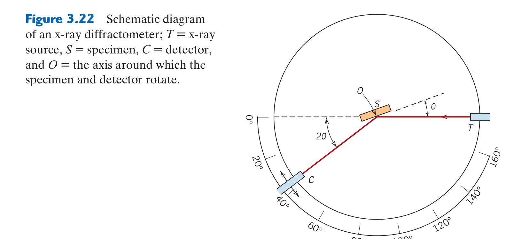

# Chapter 03: Structure of Crystalline Solids & X-Ray Diffraction
### Concordia University · Department of Mechanical, Industrial & Aerospace Engineering
**Course**: Materials Science (MIAE 221)  
**Textbook**: *Materials Science and Engineering: An Introduction* (10th Edition) by William D. Callister, Jr. & David G. Rethwisch — Chapter 3

---

## 1. Executive Overview & First-Principles Philosophy

In Chapter 2, we examined how individual pairs of atoms interact energetically at an equilibrium separation distance $r_0$. In Chapter 3, we scale up from isolated pairs to the three-dimensional collective architecture of trillions of atoms assembling into solid matter.

Solid materials are fundamentally classified by their degree of internal structural order:
1. **Crystalline Solids**: Atoms, ions, or molecules are situated in a repeating or periodic array over large atomic distances. They possess **Long-Range Order (LRO)**. All metals, many ceramics, and some polymers form crystalline structures upon solidifying.
2. **Noncrystalline (Amorphous) Solids**: Lack long-range periodic order; atoms exhibit only localized **Short-Range Order (SRO)** like a "frozen liquid" (e.g., silicate window glass, amorphous polymers).

The specific crystalline geometry—how atoms pack into unit cells, the orientation of crystallographic planes, and the spacing between lattice layers—dictates:
* **Plastic deformation and ductility**: Metals deform through dislocation slip along specific high-density crystal planes ($\{111\}$ in FCC vs. $\{110\}$ in BCC).
* **Anisotropy**: Direction-dependent mechanical and physical properties (elastic modulus $E$, thermal conductivity, magnetic susceptibility).
* **Theoretical mass density**: Calculated directly from atomic weight and unit cell volume.

To experimentally determine what crystal structure an unknown engineering alloy possesses, materials engineers rely on **X-Ray Diffraction (XRD)**, utilizing the wave nature of X-rays to probe atomic spacing through **Bragg's Law**.

---

## 2. Mathematical Framework & Metallic Crystal Structures (Callister §3.2 – §3.5)

### 2.1 The Concept of Unit Cells & Lattice Parameters

A **crystal lattice** is a 3D geometric array of mathematical points in space coinciding with atom centers. 
A **Unit Cell** is the smallest structural repeating building block that, when translated along its principal axes in 3D space, generates the entire macroscopic crystal lattice.

A unit cell is geometrically defined by **six lattice parameters**:
* Three edge lengths: $a, b, c$.
* Three interaxial angles: $\alpha$ (between $b$ and $c$), $\beta$ (between $a$ and $c$), and $\gamma$ (between $a$ and $b$).

---

### 2.2 The Three Principal Metallic Crystal Structures

Approximately $90\%$ of all elemental metals crystallize into one of three densely packed geometries: **Face-Centered Cubic (FCC)**, **Body-Centered Cubic (BCC)**, or **Hexagonal Close-Packed (HCP)**.

```
                           Metallic Crystal Structures
                                       │
     ┌─────────────────────────────────┼─────────────────────────────────┐
     ▼                                 ▼                                 ▼
FACE-CENTERED CUBIC (FCC)    BODY-CENTERED CUBIC (BCC)      HEXAGONAL CLOSE-PACKED (HCP)
• n = 4 atoms/cell           • n = 2 atoms/cell             • n = 6 atoms/cell
• Touch along face diagonal  • Touch along body diagonal    • Touch along basal edge
  4R = a√2                     4R = a√3                       a = 2R, c/a = 1.633
• CN = 12                    • CN = 8                       • CN = 12
• APF = 0.74 (Close-packed)  • APF = 0.68                   • APF = 0.74 (Close-packed)
• Stacking: ABCABC...        • Cu, Al, Au, Ni               • Fe, W, Cr, Mo
```

#### A. Face-Centered Cubic (FCC) Structure
* **Geometry**: Atoms are positioned at all 8 unit cell corners and at the centers of all 6 cube faces.
* **Effective Number of Atoms per Unit Cell ($n$)**:
  $$n = \left( 8 \text{ corners} \times \frac{1}{8} \right) + \left( 6 \text{ faces} \times \frac{1}{2} \right) = 1 + 3 = 4 \text{ atoms/cell}$$
* **Lattice Parameter Relation ($a$ vs. $R$)**:
  Atoms touch continuously along the **cube face diagonals**.
  Using the Pythagorean theorem across a face:
  $$a^2 + a^2 = (4R)^2 \implies 2a^2 = 16R^2 \implies a\sqrt{2} = 4R$$
  $$a = \frac{4R}{\sqrt{2}} = 2R\sqrt{2}$$
* **Coordination Number (CN)**: Each atom touches **12 nearest neighbors** ($\text{CN} = 12$).
* **Atomic Packing Factor (APF) Derivation**:
  $$\text{APF} = \frac{\text{Volume of atoms in unit cell } (V_s)}{\text{Total volume of unit cell } (V_c)}$$
  Volume of 4 spherical atoms of radius $R$:
  $$V_s = n \left( \frac{4}{3}\pi R^3 \right) = 4 \left( \frac{4}{3}\pi R^3 \right) = \frac{16}{3}\pi R^3$$
  Volume of cubic unit cell:
  $$V_c = a^3 = (2R\sqrt{2})^3 = 8 \cdot 2\sqrt{2} R^3 = 16\sqrt{2} R^3$$
  Substituting into APF:
  $$\text{APF}_{\text{FCC}} = \frac{\frac{16}{3}\pi R^3}{16\sqrt{2} R^3} = \frac{\pi}{3\sqrt{2}} \approx 0.7405 \implies 74\%$$
  This represents the maximum possible theoretical packing fraction for equal spheres!
* **Elemental Examples**: Copper ($\text{Cu}$), Aluminum ($\text{Al}$), Gold ($\text{Au}$), Silver ($\text{Ag}$), Nickel ($\text{Ni}$), Lead ($\text{Pb}$), Platinum ($\text{Pt}$), $\gamma\text{-Iron}$.

---

#### B. Body-Centered Cubic (BCC) Structure
* **Geometry**: Atoms are located at all 8 corners plus a single atom located at the exact geometric center of the cube body.


*Figure 3.2: (a) Hard-sphere unit cell model, (b) Reduced-sphere unit cell, and (c) Aggregate of BCC atoms — from Callister & Rethwisch 10th Ed. (Fig. 3.2).*

* **Effective Number of Atoms per Unit Cell ($n$)**:
  $$n = \left( 8 \text{ corners} \times \frac{1}{8} \right) + (1 \text{ center} \times 1) = 1 + 1 = 2 \text{ atoms/cell}$$
* **Lattice Parameter Relation ($a$ vs. $R$)**:
  Corner atoms do not touch one another; they touch the center atom along the **cube body diagonal**.
  Body diagonal length: $\sqrt{a^2 + a^2 + a^2} = a\sqrt{3}$.
  $$a\sqrt{3} = 4R \implies a = \frac{4R}{\sqrt{3}}$$
* **Coordination Number (CN)**: The center atom touches all 8 corner atoms: $\text{CN} = 8$.
* **Atomic Packing Factor (APF) Derivation**:
  Volume of 2 atoms:
  $$V_s = 2 \left( \frac{4}{3}\pi R^3 \right) = \frac{8}{3}\pi R^3$$
  Volume of unit cell:
  $$V_c = a^3 = \left( \frac{4R}{\sqrt{3}} \right)^3 = \frac{64 R^3}{3\sqrt{3}}$$
  Substituting into APF:
  $$\text{APF}_{\text{BCC}} = \frac{\frac{8}{3}\pi R^3}{\frac{64}{3\sqrt{3}} R^3} = \frac{8\pi}{3} \cdot \frac{3\sqrt{3}}{64} = \frac{\pi\sqrt{3}}{8} \approx 0.6802 \implies 68\%$$
  The BCC structure is more open (less dense) than FCC.
* **Elemental Examples**: $\alpha\text{-Iron}$ (room temperature steel ferrite), Chromium ($\text{Cr}$), Tungsten ($\text{W}$), Molybdenum ($\text{Mo}$), Tantalum ($\text{Ta}$), Vanadium ($\text{V}$).

---

#### C. Hexagonal Close-Packed (HCP) Structure
* **Geometry**: A hexagonal prism consisting of a top and bottom basal plane of 6 corner atoms surrounding a central atom, plus an intermediate mid-plane containing 3 interior atoms nestled in the valleys of the basal layers.
* **Effective Number of Atoms per Unit Cell ($n$)**:
  $$n = \left( 12 \text{ basal corners} \times \frac{1}{6} \right) + \left( 2 \text{ basal centers} \times \frac{1}{2} \right) + (3 \text{ interior atoms} \times 1) = 2 + 1 + 3 = 6 \text{ atoms/cell}$$
* **Lattice Parameters**:
  * Basal edge length $a = 2R$.
  * Height $c$. For ideal close-packing of hard spheres:
    $$\frac{c}{a} = \sqrt{\frac{8}{3}} \approx 1.633$$
* **Coordination Number (CN)**: $\text{CN} = 12$ (each atom touches 6 in its own plane, 3 above, and 3 below).
* **Atomic Packing Factor**: $\text{APF}_{\text{HCP}} = 0.74$ (identical close-packing efficiency to FCC).
* **Close-Packed Stacking Sequence Difference**:
  * **HCP**: Stacks close-packed hexagonal layers in a 2-layer alternating sequence: $ABABABAB\dots$
  * **FCC**: Stacks close-packed $\{111\}$ layers in a 3-layer sequence: $ABCABCABC\dots$
* **Elemental Examples**: Titanium ($\text{Ti}$), Magnesium ($\text{Mg}$), Zinc ($\text{Zn}$), Cadmium ($\text{Cd}$), Zirconium ($\text{Zr}$).

---

### 2.3 Theoretical Density Computations (Callister §3.5)

The theoretical density $\rho$ of a crystalline material is computed purely from its crystal structure parameters:
$$\rho = \frac{\text{Mass of unit cell}}{\text{Volume of unit cell}} = \frac{n A}{V_c N_A}$$
where:
* $n$ = number of atoms associated with each unit cell ($4$ for FCC, $2$ for BCC, $6$ for HCP).
* $A$ = atomic weight of the element ($\text{g/mol}$).
* $V_c$ = volume of the unit cell ($\text{cm}^3$). For cubic: $V_c = a^3$.
* $N_A$ = Avogadro's number $= 6.022 \times 10^{23}\text{ atoms/mol}$.

---

### 2.4 Polymorphism & Allotropy (Callister §3.6)

Many elements and compounds can exist in more than one crystalline form depending on temperature and pressure—a phenomenon termed **polymorphism** (or **allotropy** when referring to pure elements).
* **The Iron Allotropy Transformation**:
  $$\text{Pure Iron (Fe): } \alpha\text{-Fe (BCC)} \xrightarrow{912^\circ\text{C}} \gamma\text{-Fe (FCC)} \xrightarrow{1394^\circ\text{C}} \delta\text{-Fe (BCC)} \xrightarrow{1538^\circ\text{C}} \text{Liquid}$$
* **Volume Change During Heating**:
  When heating iron across $912^\circ\text{C}$, it transforms from the less-dense BCC structure ($\text{APF} = 0.68$) to the close-packed FCC structure ($\text{APF} = 0.74$). The atoms pack closer together, resulting in a **macroscopic volume contraction ($\Delta V \approx -1\%$) upon heating!**

---

## 3. Crystallographic Directions & Planes: Miller Indices (Callister §3.8 – §3.11)

### 3.1 Crystallographic Directions: The $[uvw]$ Algorithm

A crystallographic direction is defined as a vector linking two lattice points:

```
┌─────────────────────────────────────────────────────────────┐
│          4-Step Algorithm for Directions [uvw]              │
└─────────────────────────────────────────────────────────────┘
  Step 1: Position vector tail at coordinate origin (0, 0, 0).
          (If vector does not start at origin, translate axes).
                            │
  Step 2: Determine coordinates of vector head: (x₁, y₁, z₁).
                            │
  Step 3: Normalize by unit cell edge lengths: x₁/a, y₁/b, z₁/c.
                            │
  Step 4: Clear fractions to obtain smallest integers u, v, w.
          Enclose in square brackets: [u v w].
          (Indicate negative indices with an overbar: [ū v w]).
```

* **Families of Equivalent Directions**: Represented by angle brackets: $\langle uvw\rangle$.
  In cubic systems, all permutations of indices and signs are physically equivalent:
  $$\langle 100\rangle = [100], [\bar{1}00], [010], [0\bar{1}0], [001], [00\bar{1}]$$

---

### 3.2 Crystallographic Planes: The $(hkl)$ Miller Index Algorithm

Crystallographic planes are designated by three integers $h, k, l$ called **Miller Indices**:

```
┌─────────────────────────────────────────────────────────────┐
│          4-Step Algorithm for Planes (h k l)                │
└─────────────────────────────────────────────────────────────┘
  Step 1: Check Origin. If plane passes through (0, 0, 0),
          shift coordinate origin to an adjacent unit cell corner.
                            │
  Step 2: Determine Intercepts with x, y, z axes in terms of a, b, c.
          (If plane is parallel to an axis, intercept is ∞).
                            │
  Step 3: Take Reciprocals of the intercepts: 1/A, 1/B, 1/C.
          (Note: 1/∞ = 0).
                            │
  Step 4: Clear fractions to smallest integers h, k, l.
          Enclose in round parentheses: (h k l).
          (Indicate negative intercepts with overbars: (h̄ k l)).
```

* **Families of Equivalent Planes**: Designated by curly braces: $\{hkl\}$.
  In cubic symmetry: $\{100\} = (100), (\bar{1}00), (010), (0\bar{1}0), (001), (00\bar{1})$.
* **Orthogonality Property in Cubic Systems**:
  In cubic crystals only, the direction $[hkl]$ is **perpendicular (normal)** to the plane $(hkl)$ sharing the identical indices!

---

### 3.3 Linear & Planar Atomic Densities

* **Linear Density ($\text{LD}$)**: Number of atomic diameters intercepted per unit length along a specific crystallographic direction:
  $$\text{LD} = \frac{\text{Number of full atom diameters along line vector}}{\text{Length of line vector}}$$
* **Planar Density ($\text{PD}$)**: Number of full atomic areas centered on a plane per unit planar area:
  $$\text{PD} = \frac{\text{Number of atoms centered on plane}}{\text{Area of plane}}$$
* **Slip System Rule**: Plastic deformation (slip) occurs preferentially along the **densest planes** in the **densest directions** because they require the lowest critical resolved shear stress.

---

## 4. X-Ray Diffraction (XRD) & Crystal Structure Analysis (Callister §3.16)

### 4.1 Diffraction & Bragg's Law
X-rays are electromagnetic radiation with wavelengths on the order of interatomic spacings ($\lambda \approx 0.1\text{ nm} = 1\text{ Å}$).
When an incident parallel monochromatic X-ray beam strikes parallel planes of atoms with interplanar spacing $d_{hkl}$ at incident angle $\theta$, scattering occurs from adjacent planes.


*Figure 3.22: Schematic diagram of an X-ray powder diffractometer showing the X-ray tube source, powdered specimen, and scintillation detector rotating through angle $2\theta$ — from Callister & Rethwisch 10th Ed. (Fig. 3.22).*

Constructive interference (a sharp diffraction peak) occurs **if and only if the extra path length traveled by the lower beam ($2d\sin\theta$) equals an integer multiple of the wavelength $\lambda$**:
$$n \lambda = 2 d_{hkl} \sin\theta \quad (\text{Bragg's Law})$$
where $n = 1, 2, 3, \dots$ is the diffraction order (conventionally set to $n = 1$).

#### Interplanar Spacing for Cubic Crystals:
For cubic unit cells with lattice parameter $a$, the perpendicular distance between adjacent parallel planes $(hkl)$ is given by geometry:
$$d_{hkl} = \frac{a}{\sqrt{h^2 + k^2 + l^2}}$$
Substituting into Bragg's Law ($n = 1$):
$$\lambda = 2 \left( \frac{a}{\sqrt{h^2 + k^2 + l^2}} \right) \sin\theta \implies \sin^2\theta = \frac{\lambda^2}{4a^2} (h^2 + k^2 + l^2)$$

---

### 4.2 Systematic Reflection Selection Rules (Extinction Rules)

Due to destructive wave interference between atoms inside the unit cell, certain crystallographic planes produce zero net scattered intensity. Diffraction peaks appear only for planes satisfying specific index selection rules:

| Crystal Structure | Diffraction Selection Rule | Allowed Reflection Planes $(hkl)$ | Sequence of $(h^2 + k^2 + l^2)$ |
| :--- | :--- | :--- | :---: |
| **BCC** | $h + k + l = \text{Even Integer}$ | $(110), (200), (211), (220), (310), (222), \dots$ | $2, 4, 6, 8, 10, 12, \dots$ |
| **FCC** | $h, k, l$ must be **unmixed** (all odd or all even) | $(111), (200), (220), (311), (222), (400), \dots$ | $3, 4, 8, 11, 12, 16, \dots$ |

#### The Indexing Algorithm for Powder XRD Peaks:
Given experimental diffraction peak angles $2\theta_1, 2\theta_2, 2\theta_3, \dots$:
1. Divide by 2 to obtain $\theta_i$, and compute $\sin^2\theta_i$.
2. Compute the ratio of each $\sin^2\theta_i$ to the first peak: $\frac{\sin^2\theta_i}{\sin^2\theta_1}$.
3. Test against the theoretical ratios:
   * **BCC Ratios**: $\frac{2}{2}, \frac{4}{2}, \frac{6}{2}, \frac{8}{2} \implies 1.0, 2.0, 3.0, 4.0, 5.0, 6.0$.
   * **FCC Ratios**: $\frac{3}{3}, \frac{4}{3}, \frac{8}{3}, \frac{11}{3} \implies 1.0, 1.333, 2.667, 3.667, 4.0$.
4. Determine lattice parameter $a$ from the first indexed peak:
   $$a = \frac{\lambda \sqrt{h_1^2 + k_1^2 + l_1^2}}{2\sin\theta_1}$$

---

## 5. Comprehensive Step-by-Step Problem Walkthroughs

### 5.1 Problem 1: Theoretical Density Calculation of Copper (FCC)

**Problem Statement**: Copper ($\text{Cu}$) has an atomic radius $R = 0.1278\text{ nm}$ ($1.278 \times 10^{-8}\text{ cm}$), an FCC crystal structure, and an atomic weight $A_{\text{Cu}} = 63.55\text{ g/mol}$.
1. Compute the theoretical density of copper.
2. Compare the result with the experimental measured value of $\rho_{\text{exp}} = 8.94\text{ g/cm}^3$ and explain any discrepancy.

#### Step 1: Identify Structure Parameters for FCC
* Effective number of atoms per unit cell: $n = 4$.
* Atomic weight: $A = 63.55\text{ g/mol}$.
* Avogadro's number: $N_A = 6.022 \times 10^{23}\text{ atoms/mol}$.

#### Step 2: Calculate the Unit Cell Edge Length $a$
For FCC, atoms touch along the face diagonal:
$$a = 2R\sqrt{2} = 2(1.278 \times 10^{-8}\text{ cm})\sqrt{2} = 3.615 \times 10^{-8}\text{ cm}$$

#### Step 3: Calculate the Unit Cell Volume $V_c$
$$V_c = a^3 = (3.615 \times 10^{-8}\text{ cm})^3 = 4.724 \times 10^{-23}\text{ cm}^3$$

#### Step 4: Apply the Theoretical Density Formula
$$\rho = \frac{n A}{V_c N_A} = \frac{4 \times 63.55\text{ g/mol}}{(4.724 \times 10^{-23}\text{ cm}^3) \times (6.022 \times 10^{23}\text{ atoms/mol})}$$
$$\rho = \frac{254.2}{28.448} = 8.935\text{ g/cm}^3 \approx 8.94\text{ g/cm}^3$$

#### Step 5: Engineering Discussion
* The theoretical density matches the experimental density ($8.94\text{ g/cm}^3$) to three significant figures.
* In real engineering components, measured density is slightly lower ($<0.1\%$) due to the presence of **point defects (vacancies)**, dislocations, and microscopic voids.

---

### 5.2 Problem 2: XRD Peak Indexing & Identification of an Unknown Metal

**Problem Statement**: Monochromatic X-radiation having a wavelength $\lambda = 0.1542\text{ nm}$ ($\text{Cu-}K\alpha$) is used in a powder diffraction experiment on an unknown pure cubic metal. The first four diffraction peaks are detected at $2\theta$ angles of $40.3^\circ, 58.3^\circ, 73.2^\circ$, and $86.8^\circ$.
1. Determine whether the crystal structure is BCC or FCC.
2. Index each of the four peaks (assign Miller indices $(hkl)$).
3. Calculate the lattice parameter $a$ of the metal.
4. Identify the metal from the candidate list: $\text{Mo } (a = 0.3147\text{ nm})$, $\text{W } (a = 0.3165\text{ nm})$, $\text{Ta } (a = 0.3301\text{ nm})$, $\text{Al } (a = 0.4049\text{ nm})$.

#### Step 1: Convert $2\theta$ Angles to $\theta$ and Compute $\sin^2\theta$

| Peak No. | $2\theta$ (degrees) | $\theta$ (degrees) | $\sin\theta$ | $\sin^2\theta$ |
| :---: | :---: | :---: | :---: | :---: |
| 1 | $40.3^\circ$ | $20.15^\circ$ | $0.3445$ | $0.1187$ |
| 2 | $58.3^\circ$ | $29.15^\circ$ | $0.4871$ | $0.2372$ |
| 3 | $73.2^\circ$ | $36.60^\circ$ | $0.5962$ | $0.3555$ |
| 4 | $86.8^\circ$ | $43.40^\circ$ | $0.6871$ | $0.4721$ |

#### Step 2: Compute Ratios of $\sin^2\theta_i / \sin^2\theta_1$
* Peak 1: $\frac{0.1187}{0.1187} = 1.000$
* Peak 2: $\frac{0.2372}{0.1187} = 1.998 \approx 2.0$
* Peak 3: $\frac{0.3555}{0.1187} = 2.995 \approx 3.0$
* Peak 4: $\frac{0.4721}{0.1187} = 3.977 \approx 4.0$

#### Step 3: Determine Crystal Structure
* The ratio sequence is: $1.0 : 2.0 : 3.0 : 4.0$.
* Recall the theoretical ratio sequences:
  * For BCC: $(h^2+k^2+l^2) = 2, 4, 6, 8 \implies \frac{2}{2}, \frac{4}{2}, \frac{6}{2}, \frac{8}{2} = 1, 2, 3, 4$.
  * For FCC: $(h^2+k^2+l^2) = 3, 4, 8, 11 \implies \frac{3}{3}, \frac{4}{3}, \frac{8}{3}, \frac{11}{3} = 1, 1.33, 2.67, 3.67$.
* Because the experimental ratios match $1, 2, 3, 4$ perfectly, the crystal structure is **Body-Centered Cubic (BCC)**!

#### Step 4: Index the Peaks $(hkl)$
* Peak 1: $h^2 + k^2 + l^2 = 2 \implies \mathbf{(110)}$
* Peak 2: $h^2 + k^2 + l^2 = 4 \implies \mathbf{(200)}$
* Peak 3: $h^2 + k^2 + l^2 = 6 \implies \mathbf{(211)}$
* Peak 4: $h^2 + k^2 + l^2 = 8 \implies \mathbf{(220)}$

#### Step 5: Calculate the Lattice Parameter $a$
Using Peak 1: $(110)$, $\theta = 20.15^\circ$, $\lambda = 0.1542\text{ nm}$:
$$a = \frac{\lambda \sqrt{h^2 + k^2 + l^2}}{2\sin\theta} = \frac{(0.1542\text{ nm})\sqrt{1^2 + 1^2 + 0^2}}{2\sin(20.15^\circ)} = \frac{0.1542 \times \sqrt{2}}{2(0.3445)} = \frac{0.21807}{0.6890} = 0.3165\text{ nm}$$

#### Step 6: Identify the Metal
Matching with candidate lattice parameters:
* $a = 0.3165\text{ nm}$ exactly matches **Tungsten (W)**!

---

## 6. Critical Concordia Exam Traps & Red Flags

* ⚠️ **Trap 1: The $2\theta$ vs. $\theta$ Angle Trap in Bragg's Law**:
  Diffractometers output the detector angle as **$2\theta$**, NOT $\theta$!
  If an exam question states "A diffraction peak occurs at $45^\circ$", verify whether it specifies $2\theta = 45^\circ$ or $\theta = 45^\circ$. If you forget to divide $2\theta$ by 2, your calculated lattice parameter $a$ will be wrong by a factor of 2!
* ⚠️ **Trap 2: Mixing Up Touch Directions ($a$ vs. $R$)**:
  * In FCC: Touch is along the **face diagonal** $\implies 4R = a\sqrt{2}$.
  * In BCC: Touch is along the **body diagonal** $\implies 4R = a\sqrt{3}$.
  Never use $a = 2R$ for cubic metals! $a = 2R$ applies ONLY to Simple Cubic (SC) structures, which only occur in radioactive Polonium ($\text{Po}$).
* ⚠️ **Trap 3: Direction vs. Plane Notation**:
  * $[uvw]$ = Specific direction (square brackets).
  * $\langle uvw\rangle$ = Family of crystallographically equivalent directions (angle brackets).
  * $(hkl)$ = Specific plane (round parentheses).
  * $\{hkl\}$ = Family of equivalent planes (curly braces).
  Writing $[111]$ when the question asks for the $\{111\}$ plane family will incur a direct notation deduction on Concordia exams.
* ⚠️ **Trap 4: Unit Conversion in Density Formulas**:
  $V_c$ must be in $\text{cm}^3$ if density is expressed in $\text{g/cm}^3$.
  When converting $a$ from $\text{nm}$ to $\text{cm}$: $1\text{ nm} = 10^{-7}\text{ cm}$. Cubing gives: $a^3\ (\text{nm}^3) \times 10^{-21} = V_c\ (\text{cm}^3)$. Ensure you use $10^{-8}\text{ cm}$ when converting from Angstroms ($1\text{ Å} = 10^{-8}\text{ cm}$).
