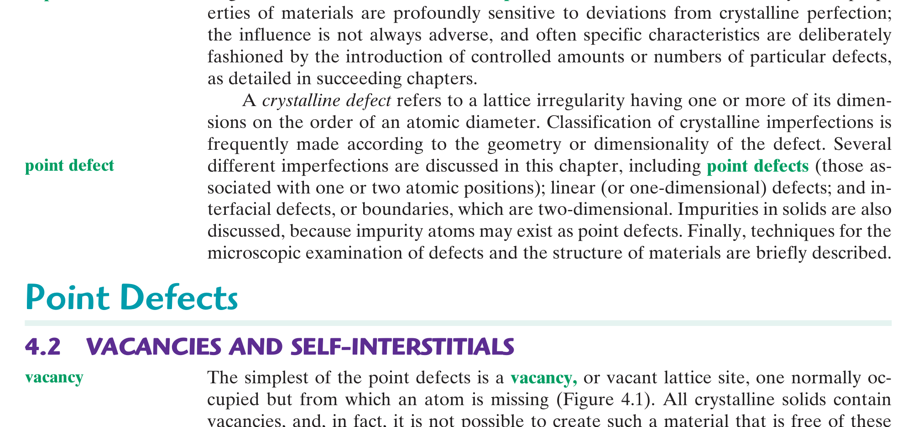

# Chapter 04: Imperfections in Solids & Defects
### Concordia University · Department of Mechanical, Industrial & Aerospace Engineering
**Course**: Materials Science (MIAE 221)  
**Textbook**: *Materials Science and Engineering: An Introduction* (10th Edition) by William D. Callister, Jr. & David G. Rethwisch — Chapter 4

---

## 1. Executive Overview & First-Principles Philosophy

In Chapter 3, we constructed ideal mathematical models of crystalline solids where every atom occupied its designated lattice site in infinite perfection. In physical reality, however, an absolutely perfect crystal does not exist in nature.

As the eminent materials physicist Sir Colin Humphreys famously observed:
> *"Crystals are like people, it is the defects in them which tend to make them interesting!"*

Far from being undesirable flaws, **crystalline imperfections dictate virtually all engineering properties**:
* **Mechanical Strength & Plasticity**: Pure, defect-free iron crystals have a theoretical shear strength of $\approx 10,000\text{ MPa}$. Real iron yields at merely $100\text{ MPa}$—a hundred times lower—because **dislocations (1D line defects)** allow planes of atoms to slip sequentially like a caterpillar crawling, rather than breaking all bonds simultaneously.
* **Solid-State Diffusion**: Atoms cannot migrate through a rigid lattice without **vacancies (0D point defects)** providing vacant neighboring sites to hop into.
* **Electrical Conductivity in Semiconductors**: The entire modern electronics industry relies on intentionally introducing parts-per-billion impurity defects (**dopants**) to control electronic charge carriers.
* **Corrosion & Precipitation Hardening**: **Grain boundaries (2D interfacial defects)** serve as high-energy channels for rapid atomic transport and phase transformation nucleation.

---

## 2. Dimensional Classification of Imperfections

Crystalline defects are fundamentally categorized by their spatial dimensionality:

```
                            Crystalline Defects
                                     │
     ┌──────────────────────┬────────┴─────────────┬──────────────────────┐
     ▼                      ▼                      ▼                      ▼
0D: POINT DEFECTS       1D: LINE DEFECTS       2D: INTERFACIAL        3D: VOLUME
(Atomic dimensions)     (Dislocations)         (Planar boundaries)    (Macroscopic)
• Vacancies             • Edge dislocation     • External surfaces    • Pores / Voids
• Self-interstitials    • Screw dislocation    • Grain boundaries     • Cracks
• Substitutional solute • Mixed dislocation    • Twin boundaries      • Inclusions
• Interstitial solute                          • Stacking faults
```

---

## 3. Point Defects (0-Dimensional) (Callister §4.2 – §4.4)

### 3.1 Vacancies & Self-Interstitials

#### A. Vacancies
A **vacancy** is the simplest point defect: an empty or missing lattice site where an atom should normally reside.


*Figure 4.1: Schematic representation of point defects: (a) Vacancy (missing atom), (b) Self-interstitial (crowded host atom), (c) Interstitial impurity atom, and (d) Substitutional impurity atom — from Callister & Rethwisch 10th Ed. (Fig. 4.1).*

* **Thermodynamic Inevitability**: Unlike other defects, **vacancies are thermodynamically stable equilibrium defects**. Introducing vacancies disrupts perfect lattice periodicity, which requires an enthalpy of formation ($Q_v > 0$). However, missing atoms dramatically increase the **configurational entropy** ($\Delta S_{\text{config}} > 0$) of the crystal by introducing millions of possible permutations for missing site locations.
  At any temperature $T > 0\text{ K}$, the Gibbs free energy $G = H - TS$ reaches a minimum at a specific, non-zero equilibrium vacancy concentration.
* **The Arrhenius Equilibrium Vacancy Equation**:
  The equilibrium number of vacancies $N_v$ in a crystal volume containing $N$ total atomic lattice sites is given by:
  $$N_v = N \exp\left( -\frac{Q_v}{k_B T} \right) \quad \text{or} \quad N_v = N \exp\left( -\frac{Q_v}{R T} \right)$$
  where:
  * $N_v$ = number of equilibrium vacancies per unit volume ($\text{m}^{-3}$ or $\text{cm}^{-3}$).
  * $N$ = total number of atomic lattice sites per unit volume:
    $$N = \frac{\rho N_A}{A}$$
    ($\rho$ = density in $\text{g/cm}^3$, $A$ = atomic weight in $\text{g/mol}$, $N_A = 6.022 \times 10^{23}\text{ atoms/mol}$).
  * $Q_v$ = activation energy required to form one vacancy (typically $0.8 - 1.5\text{ eV/atom}$ or $80 - 150\text{ kJ/mol}$).
  * $k_B$ = Boltzmann's constant $= 8.617 \times 10^{-5}\text{ eV/K} = 1.381 \times 10^{-23}\text{ J/K}$.
  * $R$ = universal gas constant $= 8.314\text{ J/(mol}\cdot\text{K)}$.
  * $T$ = absolute temperature in **Kelvin (K)**.
* **Exponential Temperature Sensitivity**:
  At room temperature ($300\text{ K}$), the vacancy fraction is negligible ($N_v/N \approx 10^{-15}$, or one vacancy per quadrillion atoms). Near the melting point ($T \approx T_m$), the vacancy fraction surges dramatically to $N_v/N \approx 10^{-4}$ (one vacancy per 10,000 atoms!).

#### B. Self-Interstitials
A **self-interstitial** is an extra host atom crowded into an interstitial void—a narrow atomic gap that is normally empty.
* Because the host atom is significantly larger than the available interstitial void, it severely compresses surrounding lattice planes, creating a **massive localized compressive strain field**.
* The formation energy $Q_i$ for a self-interstitial is roughly three to four times larger than $Q_v$. Consequently, equilibrium self-interstitial concentrations in metals are extraordinarily low ($N_i/N < 10^{-30}$) and are practically negligible under thermodynamic equilibrium.

---

### 3.2 Impurities in Solids: Solid Solutions (Callister §4.3)

A completely pure metal consisting of $100.000\%$ identical atoms is an engineering impossibility. Commercial pure metals contain impurity atoms ($0.01 - 0.1\%$). When alloying elements are deliberately added, they dissolve into the host matrix forming a **Solid Solution**:
* **Solvent**: The primary host element present in greatest abundance (e.g., Copper in a brass alloy).
* **Solute**: The minor alloy addition that dissolves into the host (e.g., Zinc in brass).

Solid solutions preserve the single-phase crystal structure of the solvent and do not form new intermetallic phases. They exist in two geometric configurations:

```
                            Solid Solutions
                                   │
     ┌─────────────────────────────┴─────────────────────────────┐
     ▼                                                           ▼
SUBSTITUTIONAL SOLID SOLUTION                              INTERSTITIAL SOLID SOLUTION
Solute replaces solvent on lattice site                    Solute occupies narrow interstitial void
(e.g., Cu-Ni Monel, Cu-Zn Brass)                           (e.g., Carbon in Iron steel)
Governed by Hume-Rothery Rules                             Solute radius must be much smaller: r_solute << r_solvent
```

#### A. The Hume-Rothery Rules for Unlimited Substitutional Solubility
For two metallic elements to exhibit complete, unlimited solid solubility across all composition ranges from $0\%$ to $100\%$ (such as the Copper-Nickel system), they must satisfy all four **Hume-Rothery Rules**:

1. **Atomic Size Factor Rule**: The difference in atomic radii between solute and solvent must be **less than $15\%$**:
   $$\Delta R = \frac{|R_{\text{solute}} - R_{\text{solvent}}|}{R_{\text{solvent}}} \times 100\% < 15\%$$
   If $\Delta R > 15\%$, severe lattice strain energy restricts solubility to low concentrations.
2. **Crystal Structure Rule**: Both elements must share the **identical crystal structure** (e.g., both must be FCC, or both BCC).
3. **Electronegativity Rule**: The two elements must have **similar electronegativities** ($\Delta X \le 0.4$). A large electronegativity difference causes the elements to react chemically to form an ordered, brittle intermetallic compound rather than a random solid solution.
4. **Valency Rule**: A metal dissolves another metal of higher valency more readily than one of lower valency. Maximum solubility occurs when solute and solvent share the same valency.

---

#### B. Interstitial Solid Solutions & Void Geometries


*Figure 4.3: Interstitial void sites in unit cells: (a) Octahedral site in FCC (CN = 6), (b) Tetrahedral site in FCC (CN = 4), (c) Octahedral site in BCC, and (d) Tetrahedral site in BCC — from Callister & Rethwisch 10th Ed. (Fig. 4.3).*

* In interstitial solid solutions, solute atoms must be drastically smaller than the solvent atoms ($r_{\text{solute}} \ll r_{\text{solvent}}$).
* Only small non-metallic elements—**Carbon (C), Nitrogen (N), Hydrogen (H), Oxygen (O), and Boron (B)**—have radii sufficiently small to dissolve interstitially.
* **The Carbon-in-Iron Case Study (Crucial for Steels)**:
  * In FCC $\gamma$-austenite, the octahedral interstitial sites are relatively large ($r_{\text{void}} \approx 0.414 R_{\text{Fe}}$). Carbon ($r_{\text{C}} = 0.071\text{ nm}$) dissolves up to **$2.14\text{ wt}\%$ at $1147^\circ\text{C}$**.
  * In BCC $\alpha$-ferrite, although the overall unit cell is less densely packed ($\text{APF} = 0.68$), the interstitial voids are geometrically distorted. The octahedral void has two very close iron neighbors ($r_{\text{void}} \approx 0.155 R_{\text{Fe}}$). Carbon causes extreme tetragonal distortion, limiting solubility to a minuscule **$0.022\text{ wt}\%$ at $727^\circ\text{C}$**!

---

### 3.3 Specification of Alloy Composition (Callister §4.4)

Alloy compositions are expressed in two engineering conventions:
1. **Weight Percent ($\text{wt}\%$)**: Mass fraction of component 1 relative to total alloy mass:
   $$C_1 = \frac{m_1}{m_1 + m_2} \times 100\%$$
2. **Atom Percent ($\text{at}\%$)**: Mole fraction of component 1 relative to total number of moles:
   $$C_1' = \frac{n_{m1}}{n_{m1} + n_{m2}} \times 100\% = \frac{m_1/A_1}{m_1/A_1 + m_2/A_2} \times 100\%$$

#### Universal Conversion Formulas:
* **Convert Weight Percent to Atom Percent**:
  $$C_1' = \frac{C_1 A_2}{C_1 A_2 + C_2 A_1} \times 100\%$$
* **Convert Atom Percent to Weight Percent**:
  $$C_1 = \frac{C_1' A_1}{C_1' A_1 + C_2' A_2} \times 100\%$$
  where $A_1$ and $A_2$ are the respective atomic weights ($\text{g/mol}$).

---

## 4. Linear Defects: Dislocations (1-Dimensional) (Callister §4.5)

A **dislocation** is a one-dimensional linear defect around which atomic planes are misaligned. Dislocations are the microscopic vehicles of **plastic deformation** in crystalline metals.

### 4.1 The Burgers Vector & The Burgers Circuit
The magnitude and direction of the lattice distortion associated with a dislocation is defined by its **Burgers Vector ($\vec{b}$)**:
* **The Burgers Circuit Algorithm**: Trace a closed clockwise path traversing an equal number of atomic steps (e.g., 5 steps right, 5 steps down, 5 steps left, 5 steps up) around the dislocation in the real, defective crystal.
* When the exact same step-by-step path is drawn in a perfect reference crystal, **the circuit fails to close!**
* The vector required to close the gap from the end point back to the start point is the **Burgers Vector $\vec{b}$**.

```
                           Types of Dislocations
                                     │
     ┌───────────────────────────────┴───────────────────────────────┐
     ▼                                                               ▼
EDGE DISLOCATION (Symbol: ⊥)                                    SCREW DISLOCATION (Symbol: ⟳)
• Extra half-plane of atoms                                     • Helical ramp / spiral staircase
• Burgers vector PERPENDICULAR to line: b ⊥ t                   • Burgers vector PARALLEL to line: b ∥ t
• Motion PARALLEL to shear stress                               • Motion PERPENDICULAR to shear stress
```

### 4.2 Edge Dislocation ($\perp$)
* **Structure**: Created by inserting an extra half-plane of atoms halfway through the crystal lattice.
* The line running along the bottom edge of the extra half-plane is the **dislocation line ($\vec{t}$)**.
* **The Fundamental Geometric Rule**:
  $$\vec{b} \perp \vec{t} \quad (\text{Burgers vector is strictly PERPENDICULAR to dislocation line})$$
* **Localized Stress Fields**:
  * Region **above** slip plane (containing extra half-plane): Atoms are squeezed together $\implies$ **Hydrostatic Compressive Stress Field**.
  * Region **below** slip plane: Atoms are pulled apart $\implies$ **Tensile Stress Field**.

### 4.3 Screw Dislocation
* **Structure**: Formed by applying a shear stress that cuts partway into the crystal and shifts one side by one atomic spacing relative to the other, creating a helical atomic ramp (like a spiral staircase).
* **The Fundamental Geometric Rule**:
  $$\vec{b} \parallel \vec{t} \quad (\text{Burgers vector is strictly PARALLEL to dislocation line})$$
* **Localized Stress Field**: Generates a **pure shear stress field**; exhibits zero hydrostatic compression or tension.

### 4.4 Mixed Dislocation
* In real engineering materials, dislocations are rarely purely edge or purely screw; they curve through the crystal as **mixed dislocations**.
* The Burgers vector $\vec{b}$ remains constant in magnitude and direction along the entire dislocation loop, but the line direction vector $\vec{t}$ curves continuously.
* The local character varies continuously: where $\vec{b} \perp \vec{t}$, it is pure edge; where $\vec{b} \parallel \vec{t}$, it is pure screw; at all intermediate angles, it has mixed character.

---

## 5. Interfacial Defects: Planar Boundaries (2-Dimensional) (Callister §4.6)

Interfacial defects are two-dimensional planar boundaries separating regions of different crystallographic orientation or chemical phase:

1. **External Surfaces**:
   * Atoms at the surface are bonded to interior neighbors, but have no outer neighbors (dangling, unsatisfied bonds).
   * Possesses a positive **surface energy ($\gamma$)**. Materials naturally minimize surface area to minimize free energy (e.g., liquid droplets form spheres).
2. **Grain Boundaries**:
   * Boundary separating two adjoining grains (single crystals) with different crystallographic orientations in a polycrystalline material.
   * Atoms in the boundary layer ($2 - 5$ atomic diameters wide) have irregular coordination and distorted bond angles.
   * **Engineering Significance**: Grain boundaries have higher energy than the bulk lattice. They serve as preferential paths for solid-state diffusion, sites for corrosion attack, and nucleation sites for phase transformations. Crucially, **grain boundaries act as formidable barriers to dislocation motion**, strengthening the metal (Hall-Petch effect).
   * *Small-Angle Boundaries*: Misorientation angle $< 15^\circ$; can be described as a regular vertical array of edge dislocations (**tilt boundary**) or a grid of screw dislocations (**twist boundary**).
   * *High-Angle Boundaries*: Misorientation $> 15^\circ$; random atomic disorder.
3. **Twin Boundaries**:
   * A special mirror-symmetry grain boundary: atoms on one side of the boundary are mirror images of atoms on the other side across a specific **twinning plane**.
   * Produced by mechanical shear deformation (deformation twins in BCC/HCP) or during recrystallization heat treatment (annealing twins in FCC copper and brass).
4. **Stacking Faults**:
   * A planar interruption in the normal close-packed layer stacking sequence.
   * In FCC (normal: $ABCABCABC$), a missing layer produces $ABCAB\underline{A}BC\dots$ creating a localized 2-layer slice of HCP packing!

---

## 6. Grain Size Determination: The ASTM Method (Callister §4.10)

The average grain size of a polycrystalline metal profoundly impacts its yield strength. The standard quantitative metallurgical method is the **ASTM Grain Size Number ($n$)**:
$$N = 2^{n - 1}$$
where:
* $N$ = number of grains observed per square inch at a standard optical magnification of **$100\times$**.
* $n$ = ASTM grain size number (an integer typically ranging from 1 to 10).

Taking the logarithm (base 10) of both sides allows solving for $n$:
$$\log_{10} N = (n - 1) \log_{10}(2) \implies n - 1 = \frac{\log_{10} N}{\log_{10}(2)} = \frac{\log_{10} N}{0.30103}$$
$$n = 1 + \frac{\log_{10} N}{0.30103} = 1 + 3.322 \log_{10} N$$

* **Magnification Correction**: If micrograph is photographed at magnification $M \neq 100\times$:
  $$N_{100} = N_M \left( \frac{M}{100} \right)^2$$
* **Grain Size Relationship**:
  * **Low ASTM Number ($n = 1 - 3$)**: Very coarse, large grains ($d \approx 100 - 250\ \mu\text{m}$).
  * **High ASTM Number ($n = 8 - 10$)**: Very fine, tiny grains ($d \approx 10 - 20\ \mu\text{m}$). Fine-grained metals exhibit superior yield strength and toughness!

---

## 7. Comprehensive Step-by-Step Problem Walkthroughs

### 7.1 Problem 1: Equilibrium Vacancy Concentration Calculation

**Problem Statement**: Calculate the equilibrium number of vacancies per cubic meter in pure copper at:
1. Room temperature ($T_1 = 20^\circ\text{C} = 293\text{ K}$).
2. Elevated temperature just below its melting point ($T_2 = 1000^\circ\text{C} = 1273\text{ K}$).
Given for Copper:
* Activation energy for vacancy formation: $Q_v = 0.90\text{ eV/atom}$ ($1.442 \times 10^{-19}\text{ J/atom}$).
* Density at $20^\circ\text{C}$: $\rho = 8.94\text{ g/cm}^3 = 8.94 \times 10^6\text{ g/m}^3$.
* Atomic weight: $A_{\text{Cu}} = 63.55\text{ g/mol}$.
* Boltzmann constant: $k_B = 8.617 \times 10^{-5}\text{ eV/K}$.

#### Step 1: Calculate the Total Number of Atomic Sites $N$ per $\text{m}^3$
$$N = \frac{\rho N_A}{A_{\text{Cu}}} = \frac{(8.94 \times 10^6\text{ g/m}^3) \times (6.022 \times 10^{23}\text{ atoms/mol})}{63.55\text{ g/mol}} = 8.472 \times 10^{28}\text{ sites/m}^3$$

#### Step 2: Compute Equilibrium Vacancy Fraction at $20^\circ\text{C}$ ($293\text{ K}$)
Compute the thermal exponent:
$$\frac{Q_v}{k_B T_1} = \frac{0.90\text{ eV}}{(8.617 \times 10^{-5}\text{ eV/K}) \times (293\text{ K})} = \frac{0.90}{0.02525} = 35.64$$
Compute the vacancy concentration:
$$N_{v1} = N \exp(-35.64) = (8.472 \times 10^{28}) \times (3.325 \times 10^{-16}) = 2.82 \times 10^{13}\text{ vacancies/m}^3$$
*Ratio of vacancies to host atoms*: $\frac{N_v}{N} \approx 3.3 \times 10^{-16}$ (roughly 1 vacancy per 3 quadrillion atoms).

#### Step 3: Compute Equilibrium Vacancy Fraction at $1000^\circ\text{C}$ ($1273\text{ K}$)
Compute the thermal exponent:
$$\frac{Q_v}{k_B T_2} = \frac{0.90\text{ eV}}{(8.617 \times 10^{-5}\text{ eV/K}) \times (1273\text{ K})} = \frac{0.90}{0.10969} = 8.205$$
Compute the vacancy concentration:
$$N_{v2} = N \exp(-8.205) = (8.472 \times 10^{28}) \times (2.733 \times 10^{-4}) = 2.32 \times 10^{25}\text{ vacancies/m}^3$$
*Ratio of vacancies to host atoms*: $\frac{N_v}{N} \approx 2.7 \times 10^{-4}$ (roughly 1 vacancy per 3,700 atoms!).

#### Step 4: Engineering Discussion
* Increasing temperature from $20^\circ\text{C}$ to $1000^\circ\text{C}$ increased the equilibrium vacancy concentration by **12 orders of magnitude** ($10^{12}\times$)!
* This massive surge in vacancies at high temperature is precisely why **atomic diffusion, creep deformation, and sintering occur rapidly at elevated temperatures** but are completely dormant at room temperature.

---

### 7.2 Problem 2: ASTM Grain Size Analysis

**Problem Statement**: A metallographic examination of an unknown steel specimen at a magnification of $200\times$ reveals an average of $64\text{ grains}$ per square inch on the optical viewing screen.
1. Determine the number of grains per square inch if the micrograph were viewed at the standard ASTM magnification of $100\times$.
2. Calculate the ASTM grain size number $n$.

#### Step 1: Correct for Magnification
The measured count is $N_{200} = 64\text{ grains/in}^2$ at $M = 200\times$.
Because linear dimensions scale by $M$, area scales as $M^2$. At lower magnification ($100\times$), a single square inch contains $(200/100)^2 = 4$ times more visible field of view:
$$N_{100} = N_M \left( \frac{M}{100} \right)^2 = 64 \left( \frac{200}{100} \right)^2 = 64 \times (2)^2 = 64 \times 4 = 256\text{ grains/in}^2$$

#### Step 2: Calculate the ASTM Grain Size Number $n$
$$N_{100} = 2^{n - 1} = 256$$
Recognize powers of 2: $256 = 2^8$.
$$n - 1 = 8 \implies n = 9$$
*Conclusion*: The steel has an **ASTM grain size number of 9**, designating a high-strength, fine-grained microstructure.

---

## 8. Critical Concordia Exam Traps & Red Flags

* ⚠️ **Trap 1: Temperature in Celsius vs. Kelvin in Arrhenius Calculations**:
  The Arrhenius exponent is $-\frac{Q}{k_B T}$. The temperature $T$ **MUST be expressed in Kelvin (K)**:
  $$T(\text{K}) = T(^\circ\text{C}) + 273.15$$
  Entering $T = 1000$ instead of $1273\text{ K}$ will produce an answer off by many orders of magnitude!
* ⚠️ **Trap 2: Matching Energy Units ($k_B$ vs. $R$)**:
  * If activation energy $Q_v$ is given in **$\text{eV/atom}$**, you must use Boltzmann's constant $k_B = 8.617 \times 10^{-5}\text{ eV/K}$.
  * If $Q_v$ is given in **$\text{kJ/mol}$ or $\text{J/mol}$**, you must use the universal gas constant $R = 8.314\text{ J/(mol}\cdot\text{K)}$.
  * Mixing $\text{eV}$ with $R$ or $\text{kJ/mol}$ with $k_B$ is an automatic zero on exam problems.
* ⚠️ **Trap 3: Direction of Burgers Vector for Edge vs. Screw Dislocations**:
  * **Edge Dislocation**: $\vec{b} \perp \vec{t}$ (Burgers vector is perpendicular to dislocation line).
  * **Screw Dislocation**: $\vec{b} \parallel \vec{t}$ (Burgers vector is parallel to dislocation line).
  Students frequently swap these two definitions under exam pressure.
* ⚠️ **Trap 4: Forgetting the Magnification Squared in ASTM Formulas**:
  When adjusting grain counts from magnification $M$ to $100\times$, the ratio is squared: $\left(\frac{M}{100}\right)^2$. Do not multiply by $\frac{M}{100}$!
