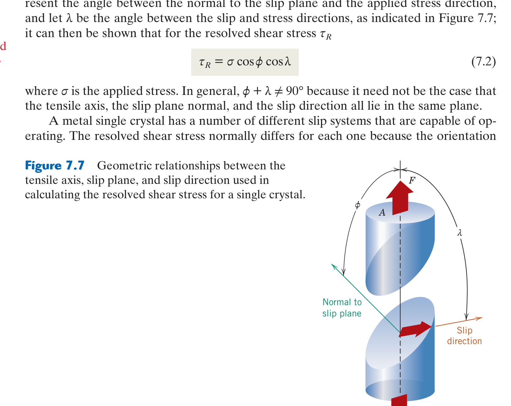
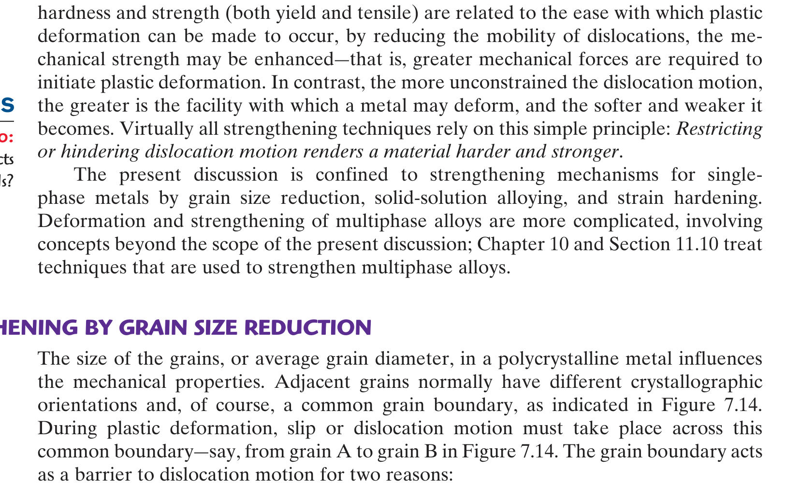

# Chapter 07: Dislocations & Strengthening Mechanisms in Metals
### Concordia University · Department of Mechanical, Industrial & Aerospace Engineering
**Course**: Materials Science (MIAE 221)  
**Textbook**: *Materials Science and Engineering: An Introduction* (10th Edition) by William D. Callister, Jr. & David G. Rethwisch — Chapter 7

---

## 1. Executive Overview & First-Principles Philosophy

In engineering mechanics, pure theoretical physics predicts that metals should possess astronomical strengths: pulling a block of pure iron apart should require a shear stress of approximately $\tau_{\text{theor}} \approx \frac{G}{2\pi} \approx 10,000\text{ MPa}$ ($10\text{ GPa}$) to simultaneously break all interatomic bonds across a crystalline plane.

Yet in reality, single crystals of pure iron begin to yield plastically at a microscopic shear stress of merely **$\approx 1\text{ MPa}$**—four orders of magnitude ($10,000\times$) lower than theoretical predictions!

This massive discrepancy was solved in 1934 by Taylor, Orowan, and Polanyi: **plastic deformation in metals does not occur by simultaneously shearing entire planes of atoms. It occurs by the sequential motion of line defects called Dislocations (dislocation slip)**.

* **The Carpet Analogy**: Imagine moving a heavy 20-foot Persian rug across a floor. If you try to drag the entire rug at once, the friction force from all contacts simultaneously makes it impossible to move. But if you push a small wrinkle (a "dislocation") into one end and kick that wrinkle across the rug, you only overcome friction along one line of carpet at a time. The wrinkle exits the opposite end, and the entire rug has moved forward by one step with almost zero effort!
* **The Grand Axiom of Metallurgical Strengthening**:
  $$\text{Strength} \iff \text{Resistance to Dislocation Motion}$$
  Because dislocations are the vehicles of plastic deformation, **every metallurgical technique used to strengthen a metal works by placing microstructural obstacles in the path of moving dislocations**.

---

## 2. Slip Systems in Crystalline Metals (Callister §7.4)

Dislocations do not move randomly through a crystal lattice. They glide along specific crystallographic planes and in specific directions:
* **Slip Plane**: The plane of **highest planar atomic density** (most closely packed plane). The spacing between adjacent close-packed planes ($d_{hkl}$) is maximized, meaning atomic roughness and the Peierls-Nabarro friction stress required to slide planes over each other are minimized.
* **Slip Direction**: The direction within the slip plane having the **highest linear atomic density** (most closely packed direction). The Burgers vector $\vec{b}$ lies along this direction, minimizing its length $|\vec{b}|$. Because dislocation strain energy scales as $E_{\text{strain}} \propto |\vec{b}|^2$, dislocations always move in directions of shortest lattice translation.
* **Slip System**: The combination of a specific slip plane and an associated slip direction:
  $$\text{Slip System} = (\text{Slip Plane}) + [\text{Slip Direction}]$$

```
                             Slip Systems Comparison
                                        │
     ┌──────────────────────────────────┼──────────────────────────────────┐
     ▼                                  ▼                                  ▼
FACE-CENTERED CUBIC (FCC)     BODY-CENTERED CUBIC (BCC)      HEXAGONAL CLOSE-PACKED (HCP)
• Slip Planes: {111} (4 planes)• Slip Planes: {110} (6 planes) • Slip Planes: {0001} (1 basal)
• Slip Dirs: ⟨110⟩ (3 per plane)• Slip Dirs: ⟨111⟩ (2 per plane)• Slip Dirs: ⟨112̄0⟩ (3 per plane)
• TOTAL: 4 × 3 = 12 Systems   • TOTAL: 6 × 2 = 12 Systems    • TOTAL: 1 × 3 = 3 Basal Systems
• High ductility, NO DBTT     • Temperature-sensitive DBTT   • Low ductility at room temp,
  (Cu, Al, Ni, Au)              (Fe, W, Cr, Mo)                twins easily (Zn, Mg, Ti)
```

1. **FCC Metals (12 Slip Systems)**:
   * 4 octahedral $\{111\}$ close-packed planes, each containing 3 close-packed $\langle 110\rangle$ directions: $4 \times 3 = 12$ slip systems.
   * Because 12 independent slip systems intersect in 3D space, FCC metals (Copper, Aluminum, Gold, Nickel) are **exceptionally ductile and formable** even at cryogenic temperatures. They exhibit **no ductile-to-brittle transition (DBTT)**.
2. **BCC Metals (12 Primary Systems + 36 Secondary at High $T$)**:
   * Slips primarily on $\{110\}$ planes along $\langle 111\rangle$ directions ($6 \times 2 = 12$ systems), but also on $\{112\}$ and $\{123\}$ planes at elevated temperatures.
   * BCC metals lack true close-packed planes ($\text{APF} = 0.68$). The Peierls friction stress is high and strongly temperature-dependent, causing BCC steels to undergo a **Ductile-to-Brittle Transition (DBTT)** at low temperatures!
3. **HCP Metals (3 Primary Basal Systems)**:
   * Slips primarily on the single basal plane $\{0001\}$ in the 3 close-packed $\langle 11\bar{2}0\rangle$ directions: $1 \times 3 = 3$ slip systems.
   * Having fewer than 5 independent slip systems (von Mises criterion for generalized polycrystalline plasticity), room-temperature HCP metals (Zinc, Magnesium) are **brittle under tensile forming** and deform via mechanical **twinning**.

---

## 3. Slip in Single Crystals & Schmid's Law (Callister §7.5)

When a single crystal is pulled in uniaxial tension by an axial force $F$ producing tensile stress $\sigma = F / A_0$, the stress resolving along a specific internal slip system is a **shear stress**.


*Figure 7.7: Geometrical relationship between tensile loading axis, slip plane normal vector $\vec{n}$ (angle $\phi$), and slip direction vector $\vec{s}$ (angle $\lambda$) — from Callister & Rethwisch 10th Ed. (Fig. 7.7).*

### 3.1 Schmid's Law Formulation
Let:
* $\phi$ = angle between the tensile loading axis and the **normal to the slip plane** ($0^\circ \le \phi \le 90^\circ$).
* $\lambda$ = angle between the tensile loading axis and the **slip direction** ($0^\circ \le \lambda \le 90^\circ$).

Resolving the axial force along the slip direction ($F_s = F \cos\lambda$) and resolving the cross-sectional area along the inclined slip plane ($A_s = A_0 / \cos\phi$):
$$\tau_R = \frac{F_s}{A_s} = \frac{F \cos\lambda}{A_0 / \cos\phi} = \left(\frac{F}{A_0}\right) \cos\phi \cos\lambda$$
$$\tau_R = \sigma \cos\phi \cos\lambda \quad (\text{Schmid's Law})$$
where:
* $\tau_R$ = **Resolved Shear Stress** acting on the slip system.
* $m = \cos\phi \cos\lambda$ = **Schmid Factor** ($0 \le m \le 0.50$).
* The maximum possible value of the Schmid factor is $m_{\max} = 0.50$, occurring when $\phi = \lambda = 45^\circ$.

### 3.2 Critical Resolved Shear Stress ($\tau_{\text{CRSS}}$) & Yielding
Plastic deformation initiates when the resolved shear stress on the most favorably oriented slip system reaches a material-specific threshold: the **Critical Resolved Shear Stress ($\tau_{\text{CRSS}}$)**:
$$\tau_R \ge \tau_{\text{CRSS}}$$
The macroscopic yield strength $\sigma_y$ of the single crystal is therefore:
$$\sigma_y = \frac{\tau_{\text{CRSS}}}{(\cos\phi \cos\lambda)_{\max}}$$
* **Orientation Extremes**:
  * If the tensile axis is perpendicular to the slip plane ($\phi = 0^\circ \implies \lambda = 90^\circ \implies \tau_R = 0$).
  * If the tensile axis is parallel to the slip plane ($\phi = 90^\circ \implies \tau_R = 0$).
  * In both extreme orientations, $\tau_R = 0$: **no dislocation slip can occur**, and the single crystal will fracture elastically at very high stresses rather than yielding!

---

## 4. The Four Foundational Strengthening Mechanisms (Callister §7.8 – §7.10)

To make a metal stronger, an engineer must impede dislocation motion. Four primary mechanisms are employed in industrial metallurgy:

```
                            Strengthening Mechanisms
                                       │
     ┌───────────────────┬─────────────┴───────┬───────────────────┐
     ▼                   ▼                     ▼                   ▼
1. GRAIN REFINEMENT  2. SOLID SOLUTION     3. STRAIN HARDENING   4. PRECIPITATION
Hall-Petch effect    Solute lattice strain Dislocation density   Nanoscale precipitates
σ_y = σ₀ + k_y d^(-1/2) pins dislocations  skyrockets (10¹¹ cm⁻²)pin dislocation lines
Increases BOTH       (Cu-Zn Brass,         Cold working          (Al 7075-T6,
strength & toughness Ni in Steel)          %CW = (A₀ - A_d)/A₀   Ni superalloys)
```

---

### 4.1 Strengthening Mechanism 1: Grain Size Reduction (The Hall-Petch Law)

A polycrystalline metal consists of millions of crystallites (grains) separated by grain boundary interfaces.


*Figure 7.14: Dislocation slip planes terminate at a grain boundary. Leading dislocations pile up against the boundary barrier, producing stress concentrations required to activate slip in the adjoining misoriented grain — from Callister & Rethwisch 10th Ed. (Fig. 7.14).*

#### Physical Barrier Mechanism:
Grain boundaries act as formidable barriers to dislocation slip for two physical reasons:
1. **Crystallographic Misorientation**: When a dislocation traveling across Grain A reaches the boundary, the slip planes in adjacent Grain B are oriented in a different spatial direction. The dislocation cannot cross without abruptly changing direction, requiring high energy.
2. **Atomic Disorder**: The atomic disorder and disrupted bonding in the boundary zone prevent continuous slip plane continuity.

Dislocations pile up against the boundary like a traffic jam. The pile-up generates a concentrated stress field that must reach a critical magnitude to activate new dislocation sources in the neighboring grain. Smaller grains have shorter slip distances, producing smaller pile-ups that require higher applied macroscopic stresses to propagate deformation.

#### The Hall-Petch Equation:
The yield strength $\sigma_y$ scales inversely with the square root of the average grain diameter $d$:
$$\sigma_y = \sigma_0 + k_y d^{-1/2} = \sigma_0 + \frac{k_y}{\sqrt{d}}$$
where:
* $d$ = average grain diameter (in $\text{m}$ or $\text{mm}$).
* $\sigma_0$ = friction stress (lattice resistance to dislocation motion in a single crystal).
* $k_y$ = Hall-Petch strengthening coefficient (material constant measuring boundary barrier strength).
* 🌟 **The Supreme Advantage of Grain Refinement**: Grain size reduction is the **ONLY strengthening mechanism in metallurgy that increases both strength AND fracture toughness/ductility simultaneously**! All other mechanisms (cold working, alloying, precipitation) increase strength at the expense of ductility.

---

### 4.2 Strengthening Mechanism 2: Solid-Solution Strengthening

Introducing substitutional or interstitial solute atoms into a pure solvent metal lattice increases yield strength (e.g., adding Zinc to Copper to create high-strength Brass):
* **Lattice Strain Interaction Mechanism**:
  * An impurity atom of different atomic radius introduces localized elastic strain fields into the host lattice:
    * A **smaller substitutional solute** ($R_{\text{solute}} < R_{\text{solvent}}$) generates a **tensile strain field** around itself.
    * A **larger substitutional solute** ($R_{\text{solute}} > R_{\text{solvent}}$) generates a **compressive strain field** around itself.
  * Recall from Chapter 4 that an edge dislocation possesses a **compressive strain zone above its slip plane** (extra half-plane) and a **tensile strain zone below its slip plane**.
  * Solute atoms diffuse preferentially to positions where their strain fields cancel the dislocation's strain field:
    * Smaller solutes migrate to the compressive zone above the slip plane.
    * Larger solutes migrate to the tensile zone below the slip plane.
  * This mutual strain relief lowers overall system energy, locking the dislocation in place (**Cottrell pinning atmosphere**). An extra applied shear stress is required to pull the dislocation away from its solute cloud!

---

### 4.3 Strengthening Mechanism 3: Strain Hardening (Work Hardening / Cold Work)

**Strain hardening** is the phenomenon whereby a ductile metal becomes stronger and harder as it is plastically deformed at temperatures below its recrystallization temperature (typically at room temperature).

#### The Dislocation Multiplication Mechanism:
* During plastic deformation, dislocations do not simply move and escape to surfaces; they **multiply exponentially** through Frank-Read dislocation mills.
* Dislocation density increases from $\rho \approx 10^5\text{ cm}^{-2}$ in annealed metals to **$\rho \approx 10^{9} - 10^{11}\text{ cm}^{-2}$ in heavily cold-worked metals**!
* As dislocation density skyrockets, the average distance between dislocations shrinks. Dislocations intersect, forming jogs and dense, tangled "forest" networks.
* Because dislocations exert repulsive stress fields on one another, moving dislocations become hopelessly pinned and tangled. A progressively higher applied stress is required to force dislocations through the forest, raising the yield strength $\sigma_y$ and ultimate tensile strength $\sigma_u$ while reducing ductility toward zero.

#### Percent Cold Work ($\%CW$) Formulation:
The degree of plastic deformation is quantified by the **Percent Cold Work ($\%CW$)**:
$$\%CW = \frac{A_0 - A_d}{A_0} \times 100\%$$
where $A_0$ is the original cross-sectional area and $A_d$ is the deformed cross-sectional area after cold rolling, forging, or wire drawing.

---

### 4.4 Strengthening Mechanism 4: Precipitation Hardening (Age Hardening)

Extensively utilized in high-performance aerospace alloys (e.g., Al 7075-T6, Al 2024, Inconel superalloys):
* Extremely fine, uniform, nanoscale second-phase precipitate particles (e.g., $\text{Al}_2\text{CuMg}$ or $\text{Ni}_3(\text{Al, Ti})$) are precipitated within the matrix grains through a three-step heat treatment: Solution Treatment $\to$ Rapid Quenching $\to$ Controlled Aging.
* Moving dislocations cannot shear through hard precipitates easily; they either shear the precipitate (requiring huge energy) or are forced to bow between precipitates leaving residual dislocation loops (**Orowan Dislocation Bypassing Mechanism**):
  $$\tau \propto \frac{G b}{L}$$
  where $L$ is the inter-precipitate spacing. Dense, closely spaced precipitates yield maximum strength!

---

## 5. Annealing: Recovery, Recrystallization & Grain Growth (Callister §7.11 – §7.13)

When a heavily cold-worked metal is heated, roughly $5\%$ of the deformation energy stored as elastic strain energy in dislocation networks provides the thermodynamic driving force to reverse the cold-worked state across three sequential stages:

```
                                  ANNEALING STAGES
                                         │
     ┌───────────────────────────────────┼───────────────────────────────────┐
     ▼                                   ▼                                   ▼
1. RECOVERY (0.1 - 0.3 T_m)       2. RECRYSTALLIZATION (0.3 - 0.5 T_m)3. GRAIN GROWTH (> 0.5 T_m)
• Dislocation climb & cross-slip  • Nucleation of new strain-free     • Coarsening of grains
• Subgrain polygonization           equiaxed grains (ρ drops 10¹⁰→10⁵)• Driven by boundary energy
• Electrical conductivity recovers• Strength drops, DUCTILITY RESTORED• d² - d₀² = K t
• Strength remains high           • Recrystallization Temp T_R        • Reduces strength
```

### 5.1 Stage 1: Recovery ($T \approx 0.1 - 0.3 T_m$)
* Dislocation density remains essentially unchanged, but thermal activation permits atoms to diffuse, allowing dislocations to climb vertically and cross-slip.
* Dislocations of opposite sign annihilate each other; remaining dislocations rearrange into low-energy, ordered arrays forming **subgrain polygonized boundaries**.
* Electrical and thermal conductivities recover to pre-cold-worked values; mechanical strength and hardness remain high.

### 5.2 Stage 2: Recrystallization ($T \approx 0.3 - 0.5 T_m$)
* A brand new set of **strain-free, equiaxed grains** nucleates at regions of high strain energy (grain boundaries and deformation bands) and consumes the cold-worked matrix.
* Dislocation density drops by five orders of magnitude ($10^{11} \to 10^5\text{ cm}^{-2}$).
* **Mechanical Transformation**: Hardness and tensile strength drop sharply back to annealed baseline values; **tensile ductility ($\%EL$) is completely restored**!
* **The Recrystallization Temperature ($T_R$)**: The temperature at which recrystallization reaches completion within exactly **1 hour**:
  * Typically $T_R \approx 0.3 - 0.4 T_m$ for pure metals; $T_R \approx 0.5 - 0.7 T_m$ for commercial alloys.
  * Factors lowering $T_R$: higher prior $\%CW$ (more stored strain energy), higher metal purity (solutes pin migrating boundaries), longer heating time.

### 5.3 Stage 3: Grain Growth ($T > 0.5 T_m$)
* After recrystallization completes, if heating continues, the newly formed grains coarsen.
* **Driving Force**: Reduction in total grain boundary surface area and energy. Smaller grains with concave boundary curvature shrink and disappear while larger grains grow.
* The average grain diameter $d$ scales with annealing time $t$ according to:
  $$d^n - d_0^n = K t$$
  where $d_0$ is initial grain diameter, $K$ is a temperature-dependent Arrhenius rate constant, and $n \approx 2$ for pure metals.
* Because larger grains lower yield strength (via Hall-Petch), **excessive grain growth is avoided in manufacturing**!

---

## 6. Comprehensive Step-by-Step Problem Walkthroughs

### 6.1 Problem 1: Schmid's Law & Single Crystal Yielding

**Problem Statement**: A single crystal of an FCC metal is oriented such that a uniaxial tensile stress $\sigma = 4.50\text{ MPa}$ is applied along the $[001]$ crystallographic direction.
1. Determine the resolved shear stress $\tau_R$ acting on the $(111)$ slip plane in the $[10\bar{1}]$ slip direction.
2. If the critical resolved shear stress for this metal is $\tau_{\text{CRSS}} = 2.00\text{ MPa}$, determine whether the single crystal will yield under this load.
3. Calculate the macroscopic yield strength $\sigma_y$ of the crystal in this orientation.

#### Step 1: Compute Angles $\phi$ and $\lambda$ Using Vector Dot Products
Recall the angle formula between two vectors $\vec{u} = [u_1, u_2, u_3]$ and $\vec{v} = [v_1, v_2, v_3]$:
$$\cos\theta = \frac{\vec{u} \cdot \vec{v}}{|\vec{u}| |\vec{v}|} = \frac{u_1 v_1 + u_2 v_2 + u_3 v_3}{\sqrt{u_1^2 + u_2^2 + u_3^2} \sqrt{v_1^2 + v_2^2 + v_3^2}}$$

* **Angle $\phi$ (Between Tensile Axis $[001]$ and Slip Plane Normal $[111]$)**:
  $$\cos\phi = \frac{(0)(1) + (0)(1) + (1)(1)}{\sqrt{0^2 + 0^2 + 1^2} \sqrt{1^2 + 1^2 + 1^2}} = \frac{1}{(1)\sqrt{3}} = \frac{1}{\sqrt{3}} \approx 0.5774$$
  $$\phi = \arccos(0.5774) = 54.74^\circ$$

* **Angle $\lambda$ (Between Tensile Axis $[001]$ and Slip Direction $[10\bar{1}]$)**:
  $$\cos\lambda = \frac{(0)(1) + (0)(0) + (1)(-1)}{\sqrt{0^2 + 0^2 + 1^2} \sqrt{1^2 + 0^2 + (-1)^2}} = \frac{-1}{(1)\sqrt{2}} = -\frac{1}{\sqrt{2}} \approx -0.7071$$
  Taking the magnitude for resolved shear stress ($|\cos\lambda| = \frac{1}{\sqrt{2}} \approx 0.7071$):
  $$\lambda = 45.00^\circ$$

#### Step 2: Compute the Resolved Shear Stress $\tau_R$
$$\tau_R = \sigma \cos\phi |\cos\lambda| = (4.50\text{ MPa}) \left( \frac{1}{\sqrt{3}} \right) \left( \frac{1}{\sqrt{2}} \right) = \frac{4.50}{\sqrt{6}} = \frac{4.50}{2.4495} = 1.837\text{ MPa}$$

#### Step 3: Yield Condition Check
Compare $\tau_R$ to $\tau_{\text{CRSS}}$:
$$\tau_R = 1.84\text{ MPa} < \tau_{\text{CRSS}} = 2.00\text{ MPa}$$
*Conclusion*: The single crystal **will NOT yield** under $\sigma = 4.50\text{ MPa}$; it deforms purely elastically.

#### Step 4: Calculate Macroscopic Yield Strength $\sigma_y$
$$\sigma_y = \frac{\tau_{\text{CRSS}}}{\cos\phi \cos\lambda} = \frac{2.00\text{ MPa}}{\frac{1}{\sqrt{6}}} = 2.00 \times \sqrt{6} = 2.00 \times 2.4495 = 4.90\text{ MPa}$$
Yielding will initiate when the applied tensile stress reaches $\sigma = 4.90\text{ MPa}$.

---

### 6.2 Problem 2: Hall-Petch Grain Size Strengthening in Steel

**Problem Statement**: The yield strength of a structural low-carbon steel was measured for two different average grain diameters:
* For average grain diameter $d_1 = 0.050\text{ mm}$ ($50\ \mu\text{m}$), yield strength $\sigma_{y1} = 160\text{ MPa}$.
* For average grain diameter $d_2 = 0.010\text{ mm}$ ($10\ \mu\text{m}$), yield strength $\sigma_{y2} = 260\text{ MPa}$.
1. Determine the constants $\sigma_0$ and $k_y$ in the Hall-Petch equation.
2. Predict the yield strength of the steel if the grain size is refined to $d_3 = 0.004\text{ mm}$ ($4\ \mu\text{m}$).

#### Step 1: Formulate the Hall-Petch Linear System
$$\sigma_y = \sigma_0 + k_y d^{-1/2}$$
Calculate $d^{-1/2}$ for both states:
* $d_1^{-1/2} = (0.050\text{ mm})^{-1/2} = \frac{1}{\sqrt{0.050}} = 4.472\text{ mm}^{-1/2}$
* $d_2^{-1/2} = (0.010\text{ mm})^{-1/2} = \frac{1}{\sqrt{0.010}} = 10.000\text{ mm}^{-1/2}$

Set up the two simultaneous algebraic equations:
$$\begin{aligned}
\sigma_0 + 4.472 k_y &= 160 \quad \text{--- (Eq. 1)} \\
\sigma_0 + 10.000 k_y &= 260 \quad \text{--- (Eq. 2)}
\end{aligned}$$

#### Step 2: Solve for $k_y$ and $\sigma_0$
Subtract (Eq. 1) from (Eq. 2):
$$(10.000 - 4.472) k_y = 260 - 160$$
$$5.528 k_y = 100 \implies k_y = \frac{100}{5.528} = 18.09\text{ MPa}\cdot\text{mm}^{1/2}$$
Substitute $k_y$ into (Eq. 1):
$$\sigma_0 + 4.472(18.09) = 160 \implies \sigma_0 + 80.90 = 160 \implies \sigma_0 = 160 - 80.90 = 79.1\text{ MPa}$$

#### Step 3: Predict Yield Strength for $d_3 = 0.004\text{ mm}$ ($4\ \mu\text{m}$)
$$d_3^{-1/2} = \frac{1}{\sqrt{0.004}} = 15.811\text{ mm}^{-1/2}$$
$$\sigma_{y3} = \sigma_0 + k_y d_3^{-1/2} = 79.1\text{ MPa} + (18.09\text{ MPa}\cdot\text{mm}^{1/2}) \times (15.811\text{ mm}^{-1/2})$$
$$\sigma_{y3} = 79.1 + 286.0 = 365.1\text{ MPa} \approx 365\text{ MPa}$$
*Engineering Impact*: Refining grains from $50\ \mu\text{m}$ down to $4\ \mu\text{m}$ more than **doubles the yield strength** from $160\text{ MPa}$ to $365\text{ MPa}$ with zero loss of ductility!

---

## 7. Critical Concordia Exam Traps & Red Flags

* ⚠️ **Trap 1: Confusion Between $\phi$ and $\lambda$ in Schmid's Law**:
  * $\phi$ is the angle between the load axis and the **normal to the slip plane**.
  * $\lambda$ is the angle between the load axis and the **slip direction vector**.
  * In 3D space, $\phi + \lambda \neq 90^\circ$! (They only sum to $90^\circ$ in 2D). Do not assume $\cos\lambda = \sin\phi$. You must compute both dot products independently!
* ⚠️ **Trap 2: Units of Grain Diameter in Hall-Petch**:
  The coefficient $k_y$ has units of $\text{MPa}\cdot\text{mm}^{1/2}$ or $\text{MPa}\cdot\text{m}^{1/2}$.
  If you compute $k_y$ using grain diameter in millimeters ($\text{mm}$), you **must input subsequent grain diameters in millimeters**! Converting $d$ to meters midway will produce answers off by a factor of $\sqrt{1000} \approx 31.6$.
* ⚠️ **Trap 3: Ductility vs. Strength Trade-Off**:
  Remember: Solid solution strengthening, cold work, and precipitation hardening all increase yield strength while **reducing ductility**. Grain size reduction is the **only** strengthening mechanism that increases both strength and ductility.
* ⚠️ **Trap 4: Cold Work Area vs. Diameter Formula**:
  $\%CW = \frac{A_0 - A_d}{A_0} \times 100\% = \frac{d_0^2 - d_d^2}{d_0^2} \times 100\%$.
  Students frequently write $\frac{d_0 - d_d}{d_0} \times 100\%$ (forgetting to square diameters). $\%CW$ is based on **cross-sectional area**, NOT diameter!
