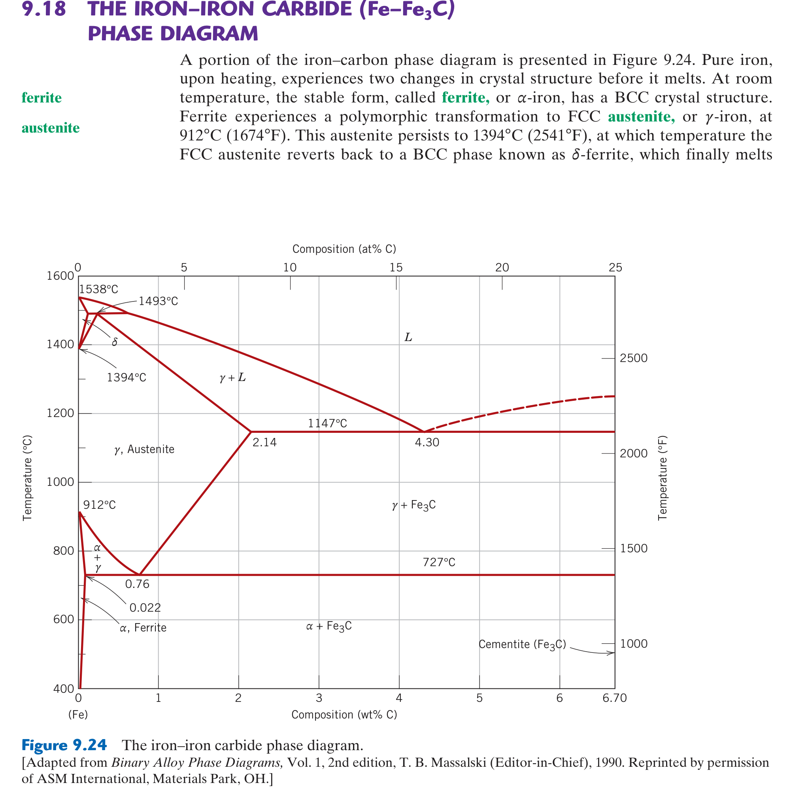

# MIAE 221: Materials Science for Engineers
## Chapter 9: Phase Diagrams & Microstructural Evolution (Expanded & Condensed Guide)
### Concordia University · Gina Cody School of Engineering
**Textbook**: *Materials Science and Engineering: An Introduction* (10th Ed., Callister & Rethwisch)  
**Instructor**: Dr. Mamoun Medraj, P.Eng | **Curriculum Alignment**: Concordia University

---

*(Syllabus Week 8 · Post-Midterm Pillar & Heavily Tested on Final Exam)*

### 1. 🎯 30-Second Core Intuition & Plain-English Concept
A phase diagram is a metallurgical roadmap showing what microscopic phases exist at any combination of temperature and chemical composition. 

From a phase diagram, you can answer three vital questions for any alloy:
1. **What phases are present?** (Look at which field the point lands in).
2. **What is the chemical composition of each phase?** (Draw a horizontal **tie-line** and read the intersections).
3. **How much of each phase is present?** (Apply the **Inverse Lever Rule**).

*Real-World Analogy*: Making chocolate milk. Below the solubility limit, cocoa dissolves completely into milk (single liquid phase). Add too much cocoa powder, and solid sludge settles at the bottom: now you have two phases (saturated liquid milk + solid cocoa powder) in equilibrium.

### 2. ⚙️ High-Yield Mathematical Engine & The Lever Rule

#### 1. Gibbs Phase Rule (Condensed System at $1	ext{ atm}$)
$$P + F = C + 1$$
* $P$: Number of phases present.
* $F$: Degrees of freedom (number of externally controllable variables: $T$, composition).
* $C$: Number of chemical components (e.g., $C = 2$ for binary systems like Cu-Ni or Fe-C).

#### 2. The Inverse Lever Rule (Phase Fraction Calculation)
In a two-phase region ($lpha + L$) with overall alloy composition $C_0$:
$$W_L = \frac{C_\alpha - C_0}{C_\alpha - C_L} \quad (\text{Fraction of Liquid})$$
$$W_\alpha = \frac{C_0 - C_L}{C_\alpha - C_L} \quad (\text{Fraction of Solid } \alpha)$$
*(Notice the inverse nature: the amount of $lpha$ is proportional to the lever arm on the liquid side!)*

#### 3. Core Invariant Reactions
* **Eutectic**: $L \xrightarrow{\text{cooling}} \alpha + \beta$ (Liquid freezes into two intimate solid phases).
* **Eutectoid**: $\gamma \xrightarrow{\text{cooling}} \alpha + \beta$ (Solid transforms into two new solid phases).
* **Peritectic**: $L + \alpha \xrightarrow{\text{cooling}} \beta$.

#### 4. The Iron-Carbon ($Fe-Fe_3C$) System (The Heart of Metallurgy)
* **Ferrite ($lpha$)**: BCC iron. Stable at room temperature. Extremely low carbon solubility (max $0.022\text{ wt}\%$ at $727^\circ\text{C}$). Soft and ductile.
* **Austenite ($\gamma$)**: FCC iron. Stable between $912^\circ\text{C}$ and $1394^\circ\text{C}$. High carbon solubility (max $2.14\text{ wt}\%$ at $1147^\circ\text{C}$).
* **Cementite ($Fe_3C$)**: Stoichiometric iron carbide containing **$6.70	ext{ wt}\%$ Carbon**. Extremely hard and brittle.
* **Eutectoid Reaction at $727^\circ	ext{C}$ and $0.76	ext{ wt}\%	ext{ C}$**:
  $$\gamma (0.76\%\text{ C}) \xrightarrow{\text{cooling}} \alpha (0.022\%\text{ C}) + Fe_3C (6.70\%\text{ C}) \quad [\text{Pearlite}]$$
  *Microstructure*: Alternating microscopic lamellae (plates) of soft ferrite and hard cementite.

### 3. 🖼️ Textbook Reference Diagram & Visual Pedagogical Analysis

*Figure 9.3: Tie-line and lever rule construction in a binary isomorphous system.*

*Figure 9.24: The Iron-Iron Carbide ($Fe-Fe_3C$) phase diagram showing ferrite ($lpha$), austenite ($\gamma$), and cementite ($Fe_3C$).*

#### In-Depth Visual Breakdown:
* **The Lever Rule (Figure 9.3)**: At point $B$ (temperature $T_0$, composition $C_0$):
  * Draw horizontal tie-line from solidus line $C_lpha$ to liquidus line $C_L$.
  * The total tie-line length is $(C_lpha - C_L)$.
  * The weight fraction of liquid $W_L$ is the length of the segment opposite to the liquidus line, divided by total length: $W_L = rac{C_lpha - C_0}{C_lpha - C_L}$.
* **The $Fe-Fe_3C$ Phase Diagram (Figure 9.24)**: The cornerstone of mechanical engineering materials:
  * **Steels** contain $< 2.14\text{ wt}\%\text{ C}$ (typically $0.05 - 1.2\text{ wt}\%$).
  * **Cast Irons** contain $> 2.14\text{ wt}\%\text{ C}$ (typically $3.0 - 4.5\text{ wt}\%$).
  * **Hypoeutectoid Steels** ($C_0 < 0.76\%\text{ C}$): Cool to form proeutectoid ferrite + pearlite.
  * **Hypereutectoid Steels** ($C_0 > 0.76\%\text{ C}$): Cool to form proeutectoid cementite + pearlite.

### 4. ⚖️ Teacher Notes Cross-Reference & Concordia Exam Traps
* **Concordia Exam Focus**:
  * Calculating the fraction of **proeutectoid ferrite** vs. **eutectoid ferrite** vs. **total ferrite** in hypoeutectoid steels.
* **The Classic Concordia Exam Trap**:
  * **Total Ferrite vs. Proeutectoid Ferrite**:
    * **Total Ferrite ($lpha_{	ext{total}}$)** is calculated across the entire baseline tie-line at $726^\circ	ext{C}$ ($0.022\%$ to $6.70\%$):
      $$W_{\alpha,\text{total}} = \frac{6.70 - C_0}{6.70 - 0.022}$$
    * **Proeutectoid Ferrite ($lpha_{	ext{pro}}$)** is calculated *just above the eutectoid temperature* ($728^\circ	ext{C}$) between $0.022\%$ and $0.76\%$:
      $$W_{\alpha,\text{pro}} = \frac{0.76 - C_0}{0.76 - 0.022}$$
    * **Eutectoid Ferrite** is the ferrite residing *inside* the pearlite colonies:
      $$W_{\alpha,\text{eutectoid}} = W_{\alpha,\text{total}} - W_{\alpha,\text{pro}}$$

### 5. 💡 Master Exam Problem & Step-by-Step Solution Framework
**Problem (Classic Concordia Final Exam Question)**:
*For a $0.35	ext{ wt}\%	ext{ C}$ plain carbon steel cooled slowly to just below $727^\circ	ext{C}$, calculate: (a) The mass fraction of total ferrite ($lpha$) and total cementite ($Fe_3C$), and (b) The mass fraction of proeutectoid ferrite and pearlite.*

* **Step 1: Compute Total Phases Just Below $727^\circ	ext{C}$ (Tie-line: $0.022\%$ to $6.70\%$)**
  $$W_{\alpha,\text{total}} = \frac{6.70 - 0.35}{6.70 - 0.022} = \frac{6.35}{6.678} = 0.951 \quad (95.1\%)$$
  $$W_{Fe_3C,\text{total}} = \frac{0.35 - 0.022}{6.70 - 0.022} = \frac{0.328}{6.678} = 0.049 \quad (4.9\%)$$
* **Step 2: Compute Microconstituents Just Above $727^\circ	ext{C}$ (Tie-line: $0.022\%$ to $0.76\%$)**
  *At $728^\circ	ext{C}$, the steel consists of proeutectoid $lpha$ and austenite $\gamma$*:
  $$W_{\alpha,\text{pro}} = \frac{0.76 - 0.35}{0.76 - 0.022} = \frac{0.41}{0.738} = 0.556 \quad (55.6\%)$$
  $$W_\gamma = \frac{0.35 - 0.022}{0.76 - 0.022} = \frac{0.328}{0.738} = 0.444 \quad (44.4\%)$$
* **Step 3: Relate Austenite to Pearlite**
  *Upon cooling through $727^\circ	ext{C}$, all remaining austenite of composition $0.76\%$ transforms 1-to-1 into pearlite*:
  $$W_{\text{pearlite}} = W_\gamma = 0.444 \quad (44.4\%)$$
* **Step 4: Verify Consistency**
  $$W_{\alpha,\text{pro}} + W_{\text{pearlite}} = 0.556 + 0.444 = 1.000 \quad (100\%)$$
  *Amount of eutectoid ferrite inside pearlite*:
  $$W_{\alpha,\text{eutectoid}} = 0.951 - 0.556 = 0.395 \quad (39.5\%)$$

---
