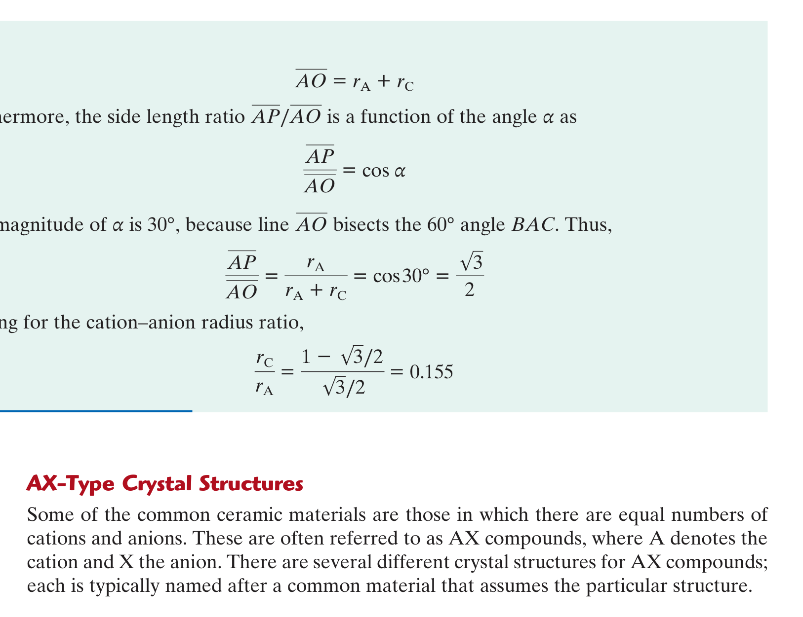

# Chapter 12 & 13: Structures & Mechanical Properties of Ceramics
### Concordia University · Department of Mechanical, Industrial & Aerospace Engineering
**Course**: Materials Science (MIAE 221)  
**Textbook**: *Materials Science and Engineering: An Introduction* (10th Edition) by William D. Callister, Jr. & David G. Rethwisch — Chapters 12 & 13

---

## 1. Executive Overview & First-Principles Philosophy

Ceramics are inorganic, non-metallic compounds formed primarily between metallic and non-metallic elements (oxides, nitrides, carbides, borides, and silicates). 

From a chemical bonding perspective, ceramics are governed by **strong ionic bonds** (Coulombic attraction between cations and anions) and/or **highly directional covalent bonds**. This atomic architecture endows ceramics with engineering properties that metals and polymers cannot match:
* Extreme hardness and wear resistance (e.g., Diamond, Silicon Carbide, Alumina).
* Exceptional thermal stability and ultra-high melting temperatures ($T_m > 2000^\circ\text{C}$).
* Chemical inertness and oxidation resistance in aggressive, corrosive environments.
* Electrical and thermal insulation.

However, these same atomic bonds create the primary engineering limitation of ceramics: **extreme brittleness and catastrophic sensitivity to microscopic flaws**. Because like-charge ions strongly repel one another, planes of ions cannot slide past each other without shattering the crystal lattice. Consequently, ceramics cannot be tested or designed using metallic tensile testing methods; they require specialized flexural testing and probabilistic fracture mechanics.

---

## 2. Ceramic Crystal Structures: The Geometric Packing Rules (Callister §12.2)

Unlike elemental metals where identical atoms pack into simple FCC or BCC unit cells, ceramic crystal structures consist of **at least two different chemical species**: positively charged metallic **cations** and negatively charged nonmetallic **anions**.

Two fundamental physical criteria govern whether a ceramic crystal structure is thermodynamically stable:

```
                          Ceramic Structure Criteria
                                      │
     ┌────────────────────────────────┴────────────────────────────────┐
     ▼                                                                 ▼
1. ELECTRICAL CHARGE NEUTRALITY                                2. RADIUS RATIO (r_C / r_A)
Total (+) cation charge must EXACTLY balance                   Cations must touch surrounding anions
total (-) anion charge in unit cell stoichiometry              without anions overlapping (Stable packing)
(e.g., Ca²⁺ + 2 F⁻ ⟹ CaF₂)                                    Dictates Coordination Number (CN: 3, 4, 6, 8)
```

### 2.1 The Cation-to-Anion Radius Ratio ($r_C / r_A$)
Because metallic atoms shed valence electrons to become cations, **cations are significantly smaller than anions**:
$$r_C < r_A \implies \frac{r_C}{r_A} < 1.0$$
* **Stable Packing Condition**: For a crystal structure to be stable, the central cation must be in direct contact with all of its surrounding coordinating anions. If the cation is too small, the surrounding anions touch each other while the cation rattles loosely in the central void (**unstable packing**).
* The ratio of ionic radii $\frac{r_C}{r_A}$ dictates the geometric **Coordination Number (CN)** (the number of nearest-neighbor anions surrounding each cation):

| Radius Ratio Range ($\frac{r_C}{r_A}$) | Coordination Number (CN) | Coordination Geometry | Archetype Crystal Structure |
| :---: | :---: | :--- | :--- |
| **$< 0.155$** | **2** | Linear | Rare |
| **$0.155 - 0.225$** | **3** | Planar Triangular | Boron Oxide ($\text{B}_2\text{O}_3$) |
| **$0.225 - 0.414$** | **4** | Tetrahedral | Zinc Blende ($\text{ZnS}$), Silicon Carbide ($\text{SiC}$) |
| **$0.414 - 0.732$** | **6** | Octahedral | Rock Salt ($\text{NaCl}$), Magnesia ($\text{MgO}$), $\text{FeO}$ |
| **$0.732 - 1.000$** | **8** | Cubic | Cesium Chloride ($\text{CsCl}$) |
| **$= 1.000$** | **12** | Close-Packed (FCC/HCP) | Metals |

---

### 2.2 Major Ceramic Crystal Structure Archetypes

#### A. Rock Salt ($\text{NaCl}$) Structure ($AX$-Type, $\text{CN} = 6$)


*Figure 12.2: The Rock Salt ($\text{NaCl}$) unit cell. Anions ($\text{Cl}^-$, green) form an FCC lattice, while cations ($\text{Na}^+$, purple) occupy all octahedral interstitial sites — from Callister & Rethwisch 10th Ed. (Fig. 12.2).*

* **Geometry**: The larger anions form an **FCC unit cell array**. The smaller cations occupy the center of the unit cell and the centers of all 12 unit cell edges (the **octahedral interstitial sites**).
* **Stoichiometry per Unit Cell**:
  * Anions: $8 \times \frac{1}{8} + 6 \times \frac{1}{2} = 4\text{ anions/cell}$.
  * Cations: $1 \text{ center} + 12 \times \frac{1}{4} = 4\text{ cations/cell}$.
  * Exactly 4 formula units ($4 \text{ NaCl}$) per unit cell!
* **Coordination Number**: $\text{CN} = 6$ for both cations and anions.
* **Engineering Examples**: Sodium Chloride ($\text{NaCl}$), Magnesium Oxide ($\text{MgO}$ refractory furnace bricks), Iron Oxide ($\text{FeO}$), Calcium Oxide ($\text{CaO}$), Titanium Carbide ($\text{TiC}$).

---

#### B. Cesium Chloride ($\text{CsCl}$) Structure ($AX$-Type, $\text{CN} = 8$)
* **Geometry**: Large anions form a **Simple Cubic (SC)** array with a single large cation occupying the exact center of the cubic void.
* **Stoichiometry**: 1 $\text{Cs}^+$ and 1 $\text{Cl}^-$ per unit cell.
* **Coordination Number**: $\text{CN} = 8$ for both ions.

---

#### C. Zinc Blende ($\text{ZnS}$) Structure ($AX$-Type, $\text{CN} = 4$)
* **Geometry**: Anions form an **FCC array**. Cations occupy **half of the tetrahedral interstitial sites** (4 of the 8 tetrahedral sites).
* **Coordination Number**: $\text{CN} = 4$ (tetrahedral coordination, $109.5^\circ$ bond angles).
* **Engineering Examples**: $\text{ZnS}$, Silicon Carbide ($\text{SiC}$), Gallium Arsenide ($\text{GaAs}$), Indium Phosphide ($\text{InP}$).

---

#### D. Fluorite ($\text{CaF}_2$) Structure ($AX_2$-Type, $\text{CN} = 8:4$)
* **Geometry**: Calcium cations ($\text{Ca}^{2+}$) form an FCC array, while Fluoride anions ($\text{F}^-$) occupy **all 8 tetrahedral interstitial sites**.
* **Coordination Numbers**: Cation $\text{CN} = 8$ (surrounded by 8 $\text{F}^-$); Anion $\text{CN} = 4$ (surrounded by 4 $\text{Ca}^{2+}$).
* **Engineering Examples**: $\text{CaF}_2$, Uranium Dioxide ($\text{UO}_2$ nuclear fuel pellets), Zirconia ($\text{ZrO}_2$ thermal barrier coatings).

---

#### E. Perovskite ($\text{BaTiO}_3$) Structure ($ABX_3$-Type Ternary Oxide)
* **Geometry**: Barium ($\text{Ba}^{2+}$) cations occupy the 8 cube corners, Oxygen ($\text{O}^{2-}$) anions occupy the 6 face centers, and a small Titanium ($\text{Ti}^{4+}$) cation sits at the body center.
* **Engineering Significance**: Exhibits **piezoelectric and ferroelectric behavior**. Below $120^\circ\text{C}$ (Curie temperature), the central $\text{Ti}^{4+}$ ion shifts off-center, creating a permanent electric dipole used in sonar, ultrasonic transducers, and dielectric capacitors!

---

## 3. Silicates & Carbon Allotropes (Callister §12.3 – §12.4)

### 3.1 Silicate Ceramics & Glass Networks
Silicates are the most abundant minerals in the Earth's crust (soils, clays, rocks, sands).
* **The Basic Building Unit: The Silicon-Oxygen Tetrahedron ($\text{SiO}_4^{4-}$)**:
  * Because $r_{\text{Si}} / r_{\text{O}} \approx 0.29$ (lying in the range $0.225 - 0.414$), each Silicon ion is tetrahedrally bonded to **4 Oxygen ions**.
  * Each oxygen ion carries a $-1$ unsatisfied charge, allowing tetrahedra to link by sharing corners.


*Figure 12.10: Two-dimensional schematic representation of (a) Crystalline silica ($\text{SiO}_2$) showing long-range periodicity, and (b) Noncrystalline (amorphous) silica glass showing random network disorder — from Callister & Rethwisch 10th Ed. (Fig. 12.10).*

* **Silica ($\text{SiO}_2$) Allotropes**:
  * In pure silica, **every single oxygen corner is shared between two tetrahedra**, yielding charge neutrality ($\text{SiO}_2$).
  * *Crystalline Silica*: Quartz, Cristobalite, Tridymite (ordered 3D frameworks).
  * *Amorphous Silica Glass*: When molten silica cools rapidly, the viscosity surges so quickly that tetrahedra cannot arrange into periodic lattices; they freeze into an amorphous, random network.
* **Network Formers vs. Network Modifiers in Industrial Glasses**:
  * Pure silica glass ($\text{fused silica}$) has an extraordinarily high softening point ($>1600^\circ\text{C}$) and extreme melt viscosity, making it expensive to shape.
  * To produce commercial window glass (Soda-Lime Glass), **Network Modifiers** ($\text{Na}_2\text{O}$ and $\text{CaO}$) are added:
    * The $\text{Na}^+$ and $\text{Ca}^{2+}$ cations do not join the covalent tetrahedral network; they lodge in the interstitial gaps.
    * The extra $\text{O}^{2-}$ ions break continuous $\text{Si}-\text{O}-\text{Si}$ bridging bonds, forming non-bridging terminal oxygens.
    * Breaking the network connectivity **slashes the processing temperature to $\sim 1000^\circ\text{C}$ and lowers melt viscosity**, enabling rapid, high-speed automated bottle and float glass manufacturing!

---

### 3.2 Carbon Allotropes: Diamond vs. Graphite vs. Graphene
Carbon exhibits allotropic polymorphism with the most extreme property divergences in the physical universe:
1. **Diamond**:
   * All carbon atoms are covalently bonded in an $sp^3$ tetrahedral network ($109.5^\circ$ bond angles).
   * Highest hardness of any known natural bulk material; extreme thermal conductivity ($k \approx 2000\text{ W/(m}\cdot\text{K)}$); wide electronic bandgap ($E_g = 5.5\text{ eV}$, electrical insulator).
2. **Graphite**:
   * Carbon atoms form flat, 2D hexagonal planar sheets bonded by strong $sp^2$ covalent bonds ($120^\circ$ angles).
   * Adjacent parallel graphene sheets are held together only by **weak secondary van der Waals forces**.
   * *Consequence*: The sheets slide over each other with almost zero shear resistance, making graphite an exceptional solid dry lubricant. Delocalized $\pi$-electrons within sheets provide high electrical conductivity in-plane.
3. **Graphene & Carbon Nanotubes**:
   * *Graphene*: A single, isolated 2-dimensional monolayer of $sp^2$-bonded carbon atoms. Exhibits theoretical tensile strength of $\approx 130\text{ GPa}$ ($100\times$ stronger than steel!) and ballistic electron mobility.
   * *Carbon Nanotubes (CNTs)*: Graphene sheets rolled seamlessly into nanoscale cylinders.

---

## 4. Mechanical Properties of Ceramics: Flexural Testing & Flaw Theory (Callister §12.8)

### 4.1 Why Ceramics Cannot Be Tested in Direct Tension
Conducting standard uniaxial tensile tests on ceramic specimens is virtually impossible in engineering laboratories for three reasons:
1. Gripping a brittle ceramic in mechanical test jaws induces localized contact stresses that crush the ends of the specimen before the test begins.
2. Even a microscopic misalignment ($<0.1^\circ$) introduces bending moments that cause premature tensile fracture on the outer surface.
3. Ceramics cannot be easily machined into round dogbone specimens without introducing surface microcracks.

---

### 4.2 The Three-Point Bending Test (Flexural Strength)
To overcome these limitations, the mechanical strength of ceramics is measured using a **Three-Point Bending Test** (also called **Modulus of Rupture** or **Transverse Rupture Strength**):


*Figure 12.32: Schematic diagram of a Three-Point Bending Test on a ceramic beam supported at span distance $L$ and loaded at the midpoint with fracture force $F_f$ — from Callister & Rethwisch 10th Ed. (Fig. 12.32).*

A rectangular or circular beam resting on two support pins spaced at span length $L$ is loaded at its midpoint by an applied vertical force $F$:
* The top surface of the beam is under **compression**.
* The bottom surface is under **tension**, where crack initiation and brittle fracture occur.

#### Flexural Strength ($\sigma_{fs}$) Formulas:
1. **For a Beam with Rectangular Cross-Section (Width $b$, Depth $d$)**:
   $$\sigma_{fs} = \frac{3 F_f L}{2 b d^2}$$
2. **For a Beam with Circular Cross-Section of Radius $R$**:
   $$\sigma_{fs} = \frac{F_f L}{\pi R^3}$$
   where:
   * $\sigma_{fs}$ = Flexural Strength / Modulus of Rupture ($\text{MPa}$).
   * $F_f$ = load at catastrophic fracture ($\text{N}$).
   * $L$ = support span length ($\text{mm}$).
   * $b, d, R$ = specimen cross-sectional dimensions ($\text{mm}$).

---

### 4.3 Influence of Porosity on Mechanical Properties

During ceramic manufacturing, powders are pressed and sintered. Unless hot isostatic pressing is used, sintered ceramics inevitably contain residual microscopic **pores (voids)**.

Porosity has a catastrophic degradation effect on both stiffness and strength:

```
                            Porosity Effects
                                   │
     ┌─────────────────────────────┴─────────────────────────────┐
     ▼                                                           ▼
1. ELASTIC MODULUS REDUCTION                                2. FLEXURAL STRENGTH REDUCTION
Pores carry zero elastic load                               Pores act as severe stress concentrators
E = E₀ (1 - 1.9 P + 0.9 P²)                                 σ_fs = σ₀ exp(-n P)  (n ≈ 4 - 7)
10% porosity cuts E by ~20%                                 10% porosity cuts strength by ~50%!
```

1. **Reduction in Elastic Modulus ($E$)**:
   $$E = E_0 \left( 1 - 1.9 P + 0.9 P^2 \right)$$
   where $E_0$ is the modulus of the $100\%$ dense, pore-free ceramic, and $P$ is the volume fraction of porosity ($0 \le P \le 1$).
2. **Exponential Collapse in Flexural Strength ($\sigma_{fs}$)**:
   Pores not only reduce the load-bearing cross-sectional area; they act as **sharp internal stress concentrators (Griffith crack flaws)** from which brittle fracture nucleates:
   $$\sigma_{fs} = \sigma_0 \exp(-n P)$$
   where $\sigma_0$ is the strength of the fully dense ceramic, and $n$ is an empirical constant typically between $4$ and $7$.
   * *Dramatic Consequence*: Because of the exponential factor $\exp(-nP)$, **introducing merely $10\%$ porosity ($P = 0.10$) slashes the flexural strength of alumina by more than $50\%$!**

---

## 5. Comprehensive Step-by-Step Problem Walkthroughs

### 5.1 Problem 1: Predicting Ceramic Crystal Structure from Ionic Radii

**Problem Statement**: Magnesium Oxide ($\text{MgO}$) and Iron Oxide ($\text{FeO}$) are important industrial ceramic refractories.
Given the ionic radii:
* $r_{\text{Mg}^{2+}} = 0.072\text{ nm}$
* $r_{\text{Fe}^{2+}} = 0.077\text{ nm}$
* $r_{\text{O}^{2-}} = 0.140\text{ nm}$
1. Calculate the cation-to-anion radius ratio for both oxides.
2. Predict the coordination number ($\text{CN}$) for each oxide.
3. Identify the expected crystal structure.
4. Calculate the theoretical density of $\text{MgO}$, given atomic weights $A_{\text{Mg}} = 24.31\text{ g/mol}$ and $A_{\text{O}} = 16.00\text{ g/mol}$.

#### Step 1: Calculate the Radius Ratios
* For $\text{MgO}$:
  $$\frac{r_{\text{Mg}^{2+}}}{r_{\text{O}^{2-}}} = \frac{0.072\text{ nm}}{0.140\text{ nm}} = 0.514$$
* For $\text{FeO}$:
  $$\frac{r_{\text{Fe}^{2+}}}{r_{\text{O}^{2-}}} = \frac{0.077\text{ nm}}{0.140\text{ nm}} = 0.550$$

#### Step 2: Determine Coordination Number (CN)
Both ratios ($0.514$ and $0.550$) fall within the octahedral range:
$$0.414 \le \frac{r_C}{r_A} < 0.732$$
Therefore, both oxides have a **Coordination Number of 6 ($\text{CN} = 6$)** for both cations and anions.

#### Step 3: Identify the Crystal Structure
Because the stoichiometry is $1:1$ ($AX$-type) and $\text{CN} = 6$, both $\text{MgO}$ and $\text{FeO}$ crystallize into the **Rock Salt ($\text{NaCl}$) crystal structure**!

#### Step 4: Calculate the Theoretical Density of $\text{MgO}$
In the Rock Salt unit cell, cations and anions touch along the cube edge:
$$a = 2(r_C + r_A) = 2(0.072\text{ nm} + 0.140\text{ nm}) = 2(0.212\text{ nm}) = 0.424\text{ nm} = 4.24 \times 10^{-8}\text{ cm}$$
Unit cell volume:
$$V_c = a^3 = (4.24 \times 10^{-8}\text{ cm})^3 = 7.623 \times 10^{-23}\text{ cm}^3$$
There are $n = 4$ formula units of $\text{MgO}$ per unit cell:
$$M_{\text{cell}} = 4 \times (A_{\text{Mg}} + A_{\text{O}}) = 4 \times (24.31 + 16.00) = 4 \times 40.31 = 161.24\text{ g/mol}$$
$$\rho = \frac{n(A_{\text{Mg}} + A_{\text{O}})}{V_c N_A} = \frac{161.24\text{ g/mol}}{(7.623 \times 10^{-23}\text{ cm}^3) \times (6.022 \times 10^{23}\text{ atoms/mol})} = \frac{161.24}{45.906} = 3.512\text{ g/cm}^3 \approx 3.51\text{ g/cm}^3$$

---

### 5.2 Problem 2: Three-Point Bending Test & Porosity Degradation

**Problem Statement**: A three-point bending test is performed on an alumina ($\text{Al}_2\text{O}_3$) ceramic specimen having a rectangular cross-section of width $b = 10.0\text{ mm}$ and depth $d = 5.0\text{ mm}$, supported across a span $L = 50.0\text{ mm}$.
1. If the specimen fractures at an applied center load $F_f = 400\text{ N}$, compute the flexural strength ($\sigma_{fs}$) of this ceramic.
2. If this tested specimen has a porosity volume fraction $P = 0.08$ ($8\%$ porosity) and empirical exponent $n = 5.0$, determine the theoretical flexural strength ($\sigma_0$) of a completely dense ($0\%$ porosity) alumina specimen.
3. Predict the flexural strength if the porosity rises to $P = 0.15$ ($15\%$).

#### Step 1: Compute Flexural Strength ($\sigma_{fs}$)
Using the rectangular three-point bending formula:
$$\sigma_{fs} = \frac{3 F_f L}{2 b d^2}$$
Substitute $F_f = 400\text{ N}$, $L = 50.0\text{ mm}$, $b = 10.0\text{ mm}$, $d = 5.0\text{ mm}$:
$$d^2 = (5.0\text{ mm})^2 = 25.0\text{ mm}^2$$
$$\sigma_{fs} = \frac{3 \times (400\text{ N}) \times (50.0\text{ mm})}{2 \times (10.0\text{ mm}) \times (25.0\text{ mm}^2)} = \frac{60,000}{500} = 120.0\text{ N/mm}^2 = 120\text{ MPa}$$

#### Step 2: Determine Fully Dense Strength ($\sigma_0$)
Using the porosity exponential equation:
$$\sigma_{fs} = \sigma_0 \exp(-n P) \implies \sigma_0 = \frac{\sigma_{fs}}{\exp(-n P)} = \sigma_{fs} \exp(n P)$$
Substitute $\sigma_{fs} = 120\text{ MPa}$, $n = 5.0$, $P = 0.08$:
$$n P = 5.0 \times 0.08 = 0.40$$
$$\sigma_0 = 120 \times \exp(0.40) = 120 \times 1.4918 = 179.0\text{ MPa}$$
*Result*: A fully dense, pore-free alumina specimen exhibits a flexural strength of **$179\text{ MPa}$**.

#### Step 3: Predict Flexural Strength at $P = 0.15$
$$n P_2 = 5.0 \times 0.15 = 0.75$$
$$\sigma_{fs}(0.15) = \sigma_0 \exp(-0.75) = 179.0 \times 0.4724 = 84.55\text{ MPa} \approx 84.6\text{ MPa}$$
*Result*: Increasing porosity from $8\%$ to $15\%$ slashes the flexural strength from $120\text{ MPa}$ down to **$84.6\text{ MPa}$**!

---

## 6. Critical Concordia Exam Traps & Red Flags

* ⚠️ **Trap 1: Three-Point Bending: Depth Squared vs. Width Squared**:
  In $\sigma_{fs} = \frac{3FL}{2bd^2}$, the **vertical beam depth $d$ is squared**, NOT the horizontal width $b$! Swapping $b$ and $d$ will produce a catastrophic mathematical error!
* ⚠️ **Trap 2: Ionic Touch Geometry in Density Calculations**:
  In Rock Salt ($\text{NaCl}$ and $\text{MgO}$), cations and anions touch along the cube edge:
  $$a = 2(r_C + r_A)$$
  Do NOT use metallic formulas like $a = 2R\sqrt{2}$ or $a = 4R/\sqrt{3}$! Those apply only to single-element metals.
* ⚠️ **Trap 3: Porosity Fraction vs. Percentage**:
  In $\sigma_{fs} = \sigma_0 \exp(-nP)$, $P$ is the **volume fraction**, NOT the percentage! If an exam states $8\%$ porosity, substitute $P = 0.08$. Substituting $P = 8$ will compute $\exp(-40) \approx 0$, yielding zero strength!
* ⚠️ **Trap 4: Circular vs. Rectangular Bending Formulas**:
  Check specimen geometry carefully!
  * Rectangular: $\sigma_{fs} = \frac{3FL}{2bd^2}$.
  * Cylindrical rod: $\sigma_{fs} = \frac{FL}{\pi R^3}$ (where $R$ is radius, NOT diameter).
