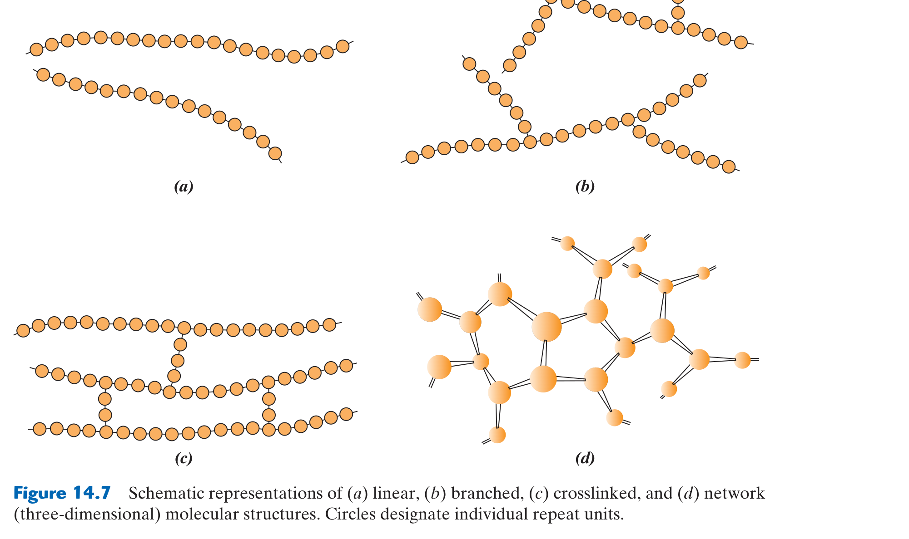
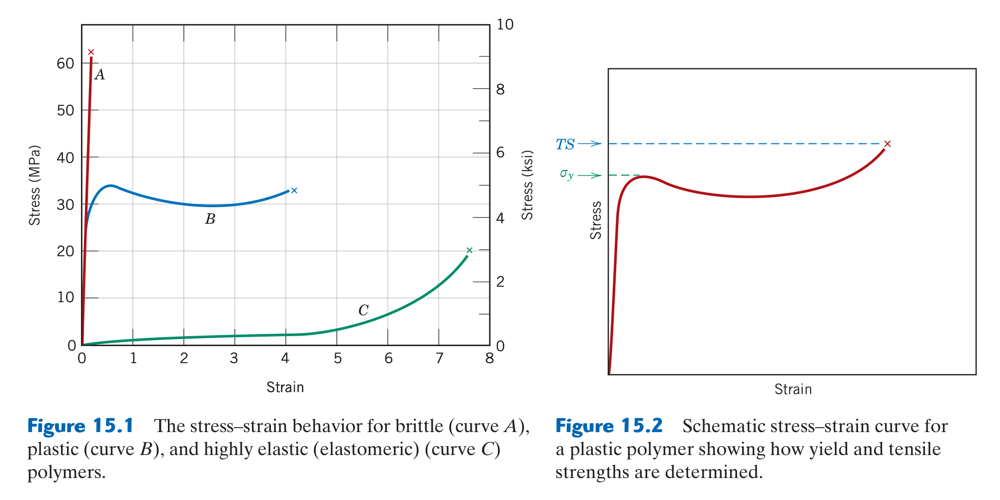

# Chapter 14 & 15: Polymer Structures & Mechanical Characteristics
### Concordia University · Department of Mechanical, Industrial & Aerospace Engineering
**Course**: Materials Science (MIAE 221)  
**Textbook**: *Materials Science and Engineering: An Introduction* (10th Edition) by William D. Callister, Jr. & David G. Rethwisch — Chapters 14 & 15

---

## 1. Executive Overview & First-Principles Philosophy

The word **Polymer** originates from the Greek *poly* (many) and *meros* (parts). Polymers are organic macromolecules synthesized by linking thousands of small chemical repeating units called **monomers** into long, flexible chain-like structures held together by strong covalent backbones.

In engineering design, polymers have transformed modern civilization because of an unparalleled combination of attributes:
* **Very Low Density**: Typical polymers have densities ranging from $\rho \approx 0.90\text{ g/cm}^3$ to $1.4\text{ g/cm}^3$ (roughly one-sixth the mass of steel and one-half the mass of aluminum).
* **High Chemical Inertness**: Immune to atmospheric oxidation and resistant to acids, bases, and electrochemical corrosion that destroy metals.
* **Low-Cost Net-Shape Processing**: Polymers soften at low temperatures ($100 - 250^\circ\text{C}$), allowing high-speed automated manufacturing of complex components via injection molding and extrusion at pennies per unit.
* **Extreme Mechanical Versatility**: A polymer can be engineered to be as rigid and transparent as glass (Polymethyl methacrylate / Plexiglas), as flexible and ductile as a plastic bag (Polyethylene), or as compliant and stretchy as an elastic rubber band (Polyisoprene).

---

## 2. Polymer Chemistry & Molecular Architecture (Callister §14.2 – §14.8)

### 2.1 The Molecular Chain & Polymerization Mechanisms
The basic building block is a small organic molecule with unsaturated double bonds or reactive end-groups:
* **The Monomer**: Example: Ethylene gas ($\text{C}_2\text{H}_4$ or $\text{CH}_2=\text{CH}_2$).
* **The Repeat Unit (Mer)**: The repeating structural chemical unit along the chain backbone:
  $$-[\text{CH}_2 - \text{CH}_2]_n- \quad (\text{Polyethylene / PE})$$

#### The Two Foundational Polymerization Mechanisms:
1. **Addition (Chain-Growth) Polymerization**:
   * Monomer units open their reactive double bonds and add sequentially to the growing end of an active polymer chain with **zero byproduct molecules produced**:
     $$n(\text{CH}_2=\text{CH}_2) \xrightarrow{\text{catalyst}} -[\text{CH}_2-\text{CH}_2]_n-$$
   * Three sequential reaction steps:
     1. *Initiation*: A chemical free-radical initiator (e.g., benzoyl peroxide, $R^\bullet$) reacts with a monomer double bond, transferring an unpaired electron to create an active chain center.
     2. *Propagation*: Rapid sequential addition of monomer units, growing the chain by thousands of units within milliseconds.
     3. *Termination*: Two active radical chains collide and join (coupling), or disproportionate, deactivating the chain.
   * *Examples*: Polyethylene (PE), Polypropylene (PP), Polyvinyl chloride (PVC), Polystyrene (PS), Polytetrafluoroethylene (PTFE/Teflon).
2. **Condensation (Step-Growth) Polymerization**:
   * Stepwise chemical reaction between bifunctional or polyfunctional monomers, accompanied by the **elimination of a small molecular byproduct (typically water $\text{H}_2\text{O}$ or $\text{HCl}$)**:
     $$\text{Dicarboxylic Acid} + \text{Diamine} \longrightarrow \text{Polyamide (Nylon 6,6)} + \text{H}_2\text{O} \uparrow$$
   * Slower reaction kinetics; chain growth proceeds by step-by-step coupling between monomers, dimers, and oligomers.
   * *Examples*: Polyamides (Nylons), Polyethylene terephthalate (PET polyester), Polycarbonates (Lexan), Epoxy resins.

---

### 2.2 Molecular Weight & Degree of Polymerization (Callister §14.5)

Unlike simple low-molecular-weight chemical compounds where every molecule has identical mass (e.g., all water molecules weigh exactly $18\text{ g/mol}$), **synthetic polymer chains are not all identical in length**. Polymerization produces a statistical distribution of chain lengths.

We characterize this distribution using two statistical averages:

#### A. Number-Average Molecular Weight ($\bar{M}_n$)
Calculated by dividing the polymer into molecular weight intervals $M_i$ and multiplying by the **number fraction** $x_i$ of chains in that interval:
$$\bar{M}_n = \sum x_i M_i$$

#### B. Weight-Average Molecular Weight ($\bar{M}_w$)
Calculated by multiplying by the **weight fraction** $w_i$ of polymer in that interval:
$$\bar{M}_w = \sum w_i M_i$$
Because heavier chains contribute disproportionately more mass, the weight-average is **always greater than or equal to the number-average**:
$$\bar{M}_w \ge \bar{M}_n$$

#### C. Polydispersity Index (PDI)
The ratio of the two averages measures the breadth of the molecular weight distribution:
$$\text{PDI} = \frac{\bar{M}_w}{\bar{M}_n} \ge 1.0$$
* If $\text{PDI} = 1.0$: All polymer chains have the exact same length (**monodisperse**, typical of natural proteins and DNA).
* Commercial synthetic polymers typically exhibit $\text{PDI} \approx 1.5 - 5.0$.

#### D. Degree of Polymerization ($DP$)
The average number of chemical repeat units linked along the polymer chain:
$$DP = \frac{\bar{M}_n}{m}$$
where $m$ is the molecular weight of a single repeat unit ($\text{g/mol}$).

---

### 2.3 Molecular Architecture (Callister §14.7 – §14.8)

The spatial arrangement of polymer chains governs their physical and mechanical responses:


*Figure 14.7: Schematic representations of the four primary polymer architectures: (a) Linear, (b) Branched, (c) Crosslinked, and (d) Network — from Callister & Rethwisch 10th Ed. (Fig. 14.7).*

1. **Linear Polymers**:
   * Long, continuous single-chain backbones with no side branches (like cooked spaghetti strands).
   * Chains are held together by **weak secondary van der Waals forces**.
   * Chains can pack closely together, promoting crystallinity and high density.
   * *Examples*: High-Density Polyethylene (HDPE), PVC, Nylon, Teflon.
2. **Branched Polymers**:
   * Main polymer chains have side branches protruding at irregular intervals along the backbone.
   * Branches prevent tight chain packing, lowering crystallinity and density.
   * *Examples*: Low-Density Polyethylene (LDPE used in flexible squeeze bottles).
3. **Crosslinked Polymers**:
   * Adjacent linear chains are joined covalently at various positions along their lengths by short chemical bridge molecules.
   * *Example*: **Vulcanization of Natural Rubber** with sulfur bridges ($\text{-S-S-}$), transforming soft, sticky latex into resilient, elastic tire rubber.
4. **Network Polymers**:
   * Multifunctional monomers react in 3 dimensions to form an interconnected 3D web of continuous covalent bonds. The entire macroscopic component is essentially **one giant molecule**!
   * *Examples*: Epoxy structural adhesives, Phenol-formaldehyde (Bakelite), Polyurethane foams.

---

### 2.4 Molecular Configurations: Stereoisomerism & Geometric Isomerism (Callister §14.9)

#### A. Stereoisomerism (Pendant Group Spatial Arrangement)
For polymers with asymmetric repeat units containing a pendant chemical group $R$ (e.g., Polypropylene where $R = -\text{CH}_3$, or Polystyrene where $R = -\text{C}_6\text{H}_5$):
1. **Isotactic**: All $R$ groups are positioned on the **same side** of the carbon backbone. High structural regularity enables chains to pack tightly into crystalline lamellae $\implies$ High melting point, stiff, strong.
2. **Syndiotactic**: $R$ groups alternate regularly from one side to the other. Symmetrical $\implies$ Semi-crystalline.
3. **Atactic**: $R$ groups are positioned **completely at random** along the chain. Irregular geometry prevents chains from packing into crystal lattices $\implies$ **$100\%$ Amorphous, soft rubbery behavior**!

#### B. Geometric Isomerism (Cis vs. Trans)
In polymers containing double bonds in the backbone (like polyisoprene):
* **Cis-Isomer**: Bulky groups reside on the **same side** of the double bond. Chains have irregular, kinked shapes that cannot pack into crystals $\implies$ **Natural Rubber** (soft, flexible elastomer with $T_g = -70^\circ\text{C}$).
* **Trans-Isomer**: Bulky groups reside on **opposite sides** of the double bond. Chains are straight and pack into crystalline lattices $\implies$ **Gutta-Percha** (hard, rigid, inelastic plastic used in golf ball covers and dentistry).

---

## 3. Thermoplastics vs. Thermosets: The Cardinal Division (Callister §14.10)

In materials engineering, polymers are fundamentally divided into two mutually exclusive classes based on their thermal response and chemical bonding:

```
                            Polymer Thermal Taxonomy
                                       │
     ┌─────────────────────────────────┴─────────────────────────────────┐
     ▼                                                                   ▼
THERMOPLASTICS (TP)                                             THERMOSETS (TS)
• Linear and branched chain architectures                       • Heavily crosslinked and 3D network architectures
• Chains held by weak secondary van der Waals bonds             • Chains held by permanent primary covalent bonds
• REVERSIBLE thermal response:                                  • IRREVERSIBLE thermal response:
  Heat ⟹ Softens and melts into liquid                           Heat ⟹ Does NOT melt!
  Cool ⟹ Solidifies back into solid                             Severe heat ⟹ Chars, burns, decomposes
• CAN BE REMELTED AND RECYCLED!                                 • CANNOT BE REMELTED OR RECYCLED!
• Ductile, flexible                                             • Hard, rigid, dimensional stability at high T
• PE, PP, PS, PVC, Nylon, PET, Teflon                           • Epoxies, Phenolics, Vulcanized rubber, Polyurethanes
```

---

## 4. Polymer Crystallinity (Callister §14.12)

Because polymer chains are extremely long and tangled, **a polymer can never become $100\%$ crystalline**. Commercial polymers are **semi-crystalline**: they consist of crystalline regions (crystalline lamellae where chains fold back and forth neatly) embedded within an amorphous, disordered matrix.

### Calculating Percent Crystallinity:
The degree of crystallinity is determined by comparing measured specimen density $\rho_s$ with theoretical densities of purely crystalline ($\rho_c$) and purely amorphous ($\rho_a$) states:
$$\% \text{ Crystallinity} = \frac{\rho_c (\rho_s - \rho_a)}{\rho_s (\rho_c - \rho_a)} \times 100\%$$
* Factors that **increase** crystallinity: Slow cooling rates, simple linear chain architectures (HDPE), regular stereochemistry (isotactic), presence of small side groups.
* Increasing crystallinity dramatically increases **yield strength, stiffness, density, and chemical resistance**, but decreases optical transparency (spherulites scatter light, making crystalline polymers translucent or opaque).

---

## 5. Mechanical Behavior & Viscoelasticity (Callister §15.2 – §15.7)

### 5.1 Three Distinct Stress-Strain Behaviors


*Figure 15.1: Tensile stress-strain curves for polymers displaying three distinct regimes: (A) Brittle polymer, (B) Plastic / semi-crystalline polymer exhibiting necking and drawing, and (C) Highly elastic elastomer — from Callister & Rethwisch 10th Ed. (Fig. 15.1).*

1. **Curve A: Brittle Polymer**:
   * High elastic modulus ($E \approx 3 - 5\text{ GPa}$), high tensile strength, but fractures elastically with zero plastic deformation ($\%EL < 2\%$).
   * *Examples*: Polymethyl methacrylate (PMMA/Plexiglas), Polystyrene at room temperature.
2. **Curve B: Plastic (Ductile / Semi-Crystalline) Polymer**:
   * Initial linear elastic region followed by yielding.
   * Undergoes localized necking, followed by **drawing**: polymer chains in the neck uncoil and align parallel to the tensile axis, strengthening the neck and propagating the drawn region along the entire gauge length before final fracture at high strains ($\%EL \approx 50 - 500\%$).
   * *Examples*: Polyethylene (PE), Polypropylene (PP), Nylon.
3. **Curve C: Highly Elastic Elastomer (Rubber)**:
   * Massive, non-linear reversible elastic deformations up to strains of $\epsilon \approx 800\%$.
   * Characterized by low initial modulus as kinked chains uncoil, followed by rapid stiffening as chains reach full alignment.

---

### 5.2 Glass Transition ($T_g$) vs. Melting Temperature ($T_m$)
* **Glass Transition Temperature ($T_g$)**: The temperature at which the amorphous regions of a polymer transition from a rigid, glassy state (frozen molecular chains) to a flexible, compliant rubbery state (onset of segmental chain motion):
  * Below $T_g$: Polymer is **hard, rigid, and brittle**.
  * Above $T_g$: Polymer is **pliable, ductile, and tough**.
* **Melting Temperature ($T_m$)**: The temperature at which the ordered crystalline lamellar domains melt into a disordered, viscous liquid state.
* **Engineering Operating Regimes**:
  * Beverage containers (PET): Must have $T_g > \text{Room Temperature}$ ($T_g \approx 70^\circ\text{C}$) to remain rigid!
  * Automotive rubber tires: Must have $T_g < \text{Winter Temperature}$ ($T_g \approx -70^\circ\text{C}$) so the tires remain flexible and grip ice rather than shattering like glass!

---

### 5.3 Viscoelasticity: Time-Dependent Mechanical Response
Polymers behave as **viscoelastic materials**: their mechanical response combines characteristics of an **elastic solid** (Hooke's Law: instant strain recovery, $\sigma = E\epsilon$) and a **viscous liquid** (Newton's Law: rate-dependent viscous flow, $\sigma = \eta \frac{d\epsilon}{dt}$).

#### Phenomenon 1: Stress Relaxation
When a polymer is held under a constant applied strain $\epsilon_0$, the internal stress does not remain constant; it decays exponentially over time as molecular chains slide and rearrange:
$$\sigma(t) = \sigma_0 \exp\left( -\frac{t}{\tau} \right)$$
where $\tau$ is the characteristic relaxation time of the polymer.
* **Relaxation Modulus**:
  $$E_r(t) = \frac{\sigma(t)}{\epsilon_0}$$

#### Phenomenon 2: Viscoelastic Creep
When subjected to a constant applied tensile stress $\sigma_0$, a polymer exhibits ongoing, time-dependent plastic elongation (**creep deformation**) even at room temperature.

---

## 6. Comprehensive Step-by-Step Problem Walkthroughs

### 6.1 Problem 1: Molecular Weight Averages & Degree of Polymerization

**Problem Statement**: A laboratory sample of polyvinyl chloride (PVC) has the molecular weight distribution given in the table below:

| Molecular Weight Range ($\text{g/mol}$) | Mean $M_i\ (\text{g/mol})$ | Number Fraction ($x_i$) | Weight Fraction ($w_i$) |
| :---: | :---: | :---: | :---: |
| $10,000 - 20,000$ | $15,000$ | $0.10$ | $0.03$ |
| $20,000 - 30,000$ | $25,000$ | $0.35$ | $0.18$ |
| $30,000 - 40,000$ | $35,000$ | $0.40$ | $0.42$ |
| $40,000 - 50,000$ | $45,000$ | $0.15$ | $0.37$ |

Given: PVC monomer repeat unit is $-[\text{CH}_2-\text{CHCl}]_n-$. Atomic weights: $\text{C} = 12.011, \text{H} = 1.008, \text{Cl} = 35.45\text{ g/mol}$.
1. Compute the number-average molecular weight ($\bar{M}_n$).
2. Compute the weight-average molecular weight ($\bar{M}_w$).
3. Determine the Polydispersity Index ($\text{PDI}$).
4. Calculate the number-average Degree of Polymerization ($DP$).

#### Step 1: Compute Number-Average Molecular Weight $\bar{M}_n$
$$\bar{M}_n = \sum x_i M_i = (0.10)(15,000) + (0.35)(25,000) + (0.40)(35,000) + (0.15)(45,000)$$
$$\bar{M}_n = 1,500 + 8,750 + 14,000 + 6,750 = 31,000\text{ g/mol}$$

#### Step 2: Compute Weight-Average Molecular Weight $\bar{M}_w$
$$\bar{M}_w = \sum w_i M_i = (0.03)(15,000) + (0.18)(25,000) + (0.42)(35,000) + (0.37)(45,000)$$
$$\bar{M}_w = 450 + 4,500 + 14,700 + 16,650 = 36,300\text{ g/mol}$$

#### Step 3: Compute Polydispersity Index (PDI)
$$\text{PDI} = \frac{\bar{M}_w}{\bar{M}_n} = \frac{36,300}{31,000} = 1.171$$
*Observation*: Since $\text{PDI} = 1.17$, the polymer sample possesses a relatively narrow, uniform distribution of chain lengths.

#### Step 4: Compute Degree of Polymerization ($DP$)
First, calculate the molecular weight $m$ of the PVC repeat unit $(\text{C}_2\text{H}_3\text{Cl})$:
$$m = 2(A_{\text{C}}) + 3(A_{\text{H}}) + 1(A_{\text{Cl}}) = 2(12.011) + 3(1.008) + 35.45 = 24.022 + 3.024 + 35.45 = 62.496\text{ g/mol}$$
Now compute $DP$:
$$DP = \frac{\bar{M}_n}{m} = \frac{31,000\text{ g/mol}}{62.496\text{ g/mol}} = 496.0 \approx 496 \text{ repeat units}$$
*Conclusion*: The average PVC chain in this specimen consists of approximately **496 repeating vinyl chloride monomer units**.

---

### 6.2 Problem 2: Determining Percent Crystallinity from Density

**Problem Statement**: The density of a specimen of linear polyethylene (PE) is measured to be $\rho_s = 0.965\text{ g/cm}^3$.
Given:
* Theoretical density of purely amorphous polyethylene: $\rho_a = 0.870\text{ g/cm}^3$.
* Theoretical density of $100\%$ crystalline polyethylene: $\rho_c = 1.000\text{ g/cm}^3$.
Calculate the percent crystallinity of this polyethylene specimen.

#### Step-by-Step Solution:
Apply the percent crystallinity equation:
$$\% \text{ Crystallinity} = \frac{\rho_c (\rho_s - \rho_a)}{\rho_s (\rho_c - \rho_a)} \times 100\%$$
Substitute the values:
* $\rho_s - \rho_a = 0.965 - 0.870 = 0.095\text{ g/cm}^3$
* $\rho_c - \rho_a = 1.000 - 0.870 = 0.130\text{ g/cm}^3$
$$\% \text{ Crystallinity} = \frac{(1.000) \times (0.095)}{(0.965) \times (0.130)} \times 100\% = \frac{0.095}{0.12545} \times 100\% = 0.7573 \times 100\% = 75.7\%$$
*Conclusion*: The specimen has a **crystallinity of $75.7\%$** (a high-density polyethylene / HDPE grade).

---

## 7. Critical Concordia Exam Traps & Red Flags

* ⚠️ **Trap 1: Thermoplastic vs. Thermoset Recycling**:
  A standard exam question asks: "Why can an injection-molded polyethylene bottle be remelted and recycled, while an epoxy printed circuit board cannot?"
  * Correct Answer: Polyethylene is a **thermoplastic**; chains are held only by weak secondary van der Waals bonds that break reversibly upon heating. Epoxy is a **thermoset**; chains form a 3D network locked by primary covalent bonds. Heating does not break van der Waals bonds—it causes irreversible chemical charring and degradation!
* ⚠️ **Trap 2: Swapping $\bar{M}_n$ and $\bar{M}_w$ in PDI**:
  Remember: $\text{PDI} = \bar{M}_w / \bar{M}_n \ge 1.0$. The larger number ($\bar{M}_w$) is **always in the numerator**. If your calculated $\text{PDI} < 1.0$, your fraction is upside down!
* ⚠️ **Trap 3: Density Equation Fraction Order**:
  In $\% \text{ Crystallinity} = \frac{\rho_c(\rho_s - \rho_a)}{\rho_s(\rho_c - \rho_a)}$, notice that $\rho_c$ is in the numerator and $\rho_s$ is in the denominator. A common error is writing $\rho_s$ in both places.
* ⚠️ **Trap 4: Atactic Polymers CANNOT Crystallize**:
  If asked why atactic polystyrene is completely transparent while isotactic polypropylene is translucent, the answer is **crystallinity**: atactic side groups are random, preventing chain folding and crystal formation $\implies 100\%$ amorphous (transparent). Isotactic chains pack into crystalline spherulites that scatter light $\implies$ translucent.
