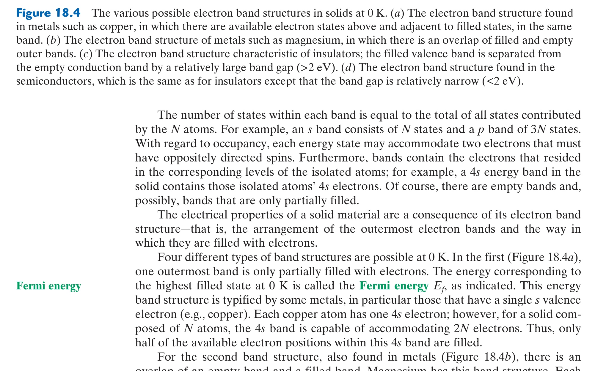

# MIAE 221: Materials Science for Engineers
## Chapters 18, 19 & 21: Electrical, Thermal and Optical Properties (Expanded & Condensed Guide)
### Concordia University · Gina Cody School of Engineering
**Textbook**: *Materials Science and Engineering: An Introduction* (10th Ed., Callister & Rethwisch)  
**Instructor**: Dr. Mamoun Medraj, P.Eng | **Curriculum Alignment**: Concordia University

---

*(Syllabus Week 11 · Final Exam Scope)*

### 1. 🎯 30-Second Core Intuition & Plain-English Concept
Electrical conduction depends on whether electrons can easily jump into empty, available energy states to move freely through the solid. 

**Energy Band Theory**:
* **Metals**: Conduction and valence bands overlap (or band is half-filled). Billions of electrons are free to move instantly $\implies$ high conductivity.
* **Insulators**: A massive forbidden energy band gap ($E_g > 5	ext{ eV}$) separates filled and empty states. Electrons cannot jump $\implies$ zero conductivity.
* **Semiconductors**: A narrow band gap ($E_g < 2	ext{ eV}$). Thermal energy can kick electrons across the gap $\implies$ conductivity increases exponentially with temperature!

### 2. ⚙️ High-Yield Mathematical Engine & Semiconductor Physics

#### 1. Ohm's Law and Electrical Conductivity
$$V = IR, \quad \rho_{\text{el}} = \frac{RA}{l}, \quad \sigma_{\text{el}} = \frac{1}{\rho_{\text{el}}} = n|e|\mu_e + p|e|\mu_h$$
* $n, p$: Free electron and hole concentrations ($	ext{m}^{-3}$).
* $\mu_e, \mu_h$: Electron and hole mobilities ($	ext{m}^2/\text{V}\cdot\text{s}$).
* $e$: Elementary charge ($1.602 \times 10^{-19}\text{ C}$).

#### 2. Intrinsic vs. Extrinsic Semiconductors
* **Intrinsic (Pure Si, Ge)**: $n = p = n_i$. Conductivity rises exponentially with temperature:
  $$\sigma \propto \exp\left(-\frac{E_g}{2 k_B T}\right)$$
* **Extrinsic (Doped)**:
  * **$n$-Type**: Doped with Group V elements (P, As, Sb). Donates free electrons ($n \gg p$).
  * **$p$-Type**: Doped with Group III elements (B, Al, Ga). Creates positive holes ($p \gg n$).

### 3. 🖼️ Textbook Reference Diagram & Visual Pedagogical Analysis

*Figure 18.4: Electron band structures: (a, b) Metals (overlapping / partially filled), (c) Insulators (wide gap), and (d) Semiconductors (narrow gap).*

#### In-Depth Visual Breakdown:
* **Figure 18.4**: Demonstrates why metals conduct and insulators do not:
  * In metals (a, b), the Fermi level $E_F$ lies inside a band or between overlapping bands. Adjacent unoccupied states exist immediately above $E_F$; negligible electrical field excites electrons into motion.
  * In insulators (c), the valence band is completely full and separated from the empty conduction band by a wide forbidden gap ($E_g > 5	ext{ eV}$). Room temperature thermal energy ($k_B T pprox 0.026	ext{ eV}$) is completely incapable of exciting electrons across this gap.
  * In semiconductors (d), $E_g pprox 1.1	ext{ eV}$ (Silicon). Thermal vibrations easily kick a steady stream of electrons into the conduction band, leaving equal numbers of conducting holes behind.

### 4. ⚖️ Teacher Notes Cross-Reference & Concordia Exam Traps
* **Concordia Exam Focus**:
  * Explaining the opposing temperature effects:
    * In **metals**, electrical conductivity **decreases** as temperature rises (thermal lattice vibrations scatter electrons: resistivity $
ho = 
ho_0 + aT$).
    * In **intrinsic semiconductors**, electrical conductivity **increases exponentially** with temperature (thermal energy excites vastly more charge carriers across $E_g$).

---

## 📖 Chapter 19: Thermal Properties
*(Syllabus Week 11 · Final Exam Scope)*

### 1. 🎯 30-Second Core Intuition & Plain-English Concept
Heat is simply atomic vibrations. In solids, heat is stored in quantized vibrational waves called **phonons** and transported through the material by both phonons and free electrons.

**Why Materials Expand When Heated**: Thermal expansion is a direct consequence of the **asymmetry (anharmonicity)** of the interatomic potential energy well! Because it takes less energy to push atoms apart than to squeeze them together, heating an atom makes it vibrate outward, increasing the average interatomic spacing.

### 2. ⚙️ High-Yield Mathematical Engine & Thermal Properties

#### 1. Heat Capacity ($C_v$)
$$C_v = \left( \frac{\partial E}{\partial T} \right)_v$$
* At high temperatures ($T > 	heta_D$, Debye Temperature), heat capacity reaches the universal **Dulong-Petit Limit**:
  $$C_v \approx 3R \approx 25\text{ J/mol}\cdot\text{K}$$

#### 2. Linear Thermal Expansion
$$\frac{\Delta l}{l_0} = \alpha_l \Delta T$$
* $lpha_l$: Linear coefficient of thermal expansion ($	ext{K}^{-1}$ or $^\circ	ext{C}^{-1}$).
* Ceramics have lower $lpha_l$ than metals; polymers have the highest $lpha_l$ (weak van der Waals bonds).

#### 3. Thermal Conductivity ($k$) and Thermal Shock Resistance (TSR)
$$q = -k \frac{dT}{dx} \quad (\text{Fourier's Law})$$
* **Thermal Shock Resistance (TSR)**: The ability of a ceramic to withstand rapid cooling without fracture:
  $$TSR \cong \frac{\sigma_f \cdot k}{E \cdot \alpha_l}$$
  *(To resist cracking during quenching, a ceramic must have high strength $\sigma_f$, high thermal conductivity $k$, low stiffness $E$, and low thermal expansion $lpha_l$)*.

### 3. 🖼️ Textbook Reference Diagram & Visual Pedagogical Analysis

*Figure 19.3: Potential energy vs. interatomic distance: (a) Asymmetric well demonstrating increase in average interatomic spacing $r_T$ with rising temperature, vs. (b) A hypothetical symmetric well with zero thermal expansion.*

#### In-Depth Visual Breakdown:
* **The Asymmetric Well (Figure 19.3a)**: At $0	ext{ K}$, atoms sit at minimum $r_0$. As temperature rises to $T_1, T_2, T_3$, the atom vibrates between the left and right walls of the well. Because the repulsive wall (left) is much steeper than the attractive wall (right), the midpoint of vibration shifts progressively outward ($r_3 > r_2 > r_1 > r_0$). This macroscopic shift is thermal expansion.
* **The Hypothetical Symmetric Well (Figure 19.3b)**: If interatomic forces were perfectly symmetric (parabolic well), heating would expand vibrations equally in both directions, the average separation would remain constant ($r_T = r_0$), and the material would have **zero thermal expansion** ($lpha_l = 0$).

---

## 📖 Chapter 21: Optical Properties
*(Syllabus Week 12 · Final Exam Scope)*

### 1. 🎯 30-Second Core Intuition & Plain-English Concept
Light is electromagnetic radiation. When a light wave strikes a solid, three things can happen: it can bounce off (**Reflection**), get absorbed by electrons (**Absorption**), or pass through unscathed (**Transmission**):
$$R + A + T = 1$$

**Why Glass is Transparent and Metals are Opaque**:
* **Metals**: Have empty electronic energy states everywhere. Photons of *all* visible wavelengths are instantly absorbed by electrons and re-emitted $\implies$ metals are totally opaque and highly reflective.
* **Insulators / Glasses**: Have an energy band gap ($E_g > 3.1	ext{ eV}$) that is larger than visible light photon energies ($1.8 - 3.1	ext{ eV}$). Photons do not possess enough energy to excite electrons across the band gap $\implies$ light cannot be absorbed and passes straight through (transparent!).

### 2. ⚙️ High-Yield Mathematical Engine & Optical Physics

#### 1. Photon Energy and Wavelength Relation
$$E = h\nu = \frac{hc}{\lambda}$$
* $h$: Planck's constant ($4.136 \times 10^{-15}\text{ eV}\cdot\text{s} = 6.626 \times 10^{-34}\text{ J}\cdot\text{s}$).
* $c$: Speed of light ($3.0 \times 10^8\text{ m/s}$).
* **Concordia Shortcut**:
  $$E (\text{eV}) = \frac{1.24}{\lambda (\mu\text{m})}$$

#### 2. Fundamental Absorption Condition
A photon can be absorbed by an electron transition across a band gap if and only if:
$$h\nu \ge E_g \iff \lambda \le \frac{hc}{E_g}$$
* If $E_g > 3.1\text{ eV}$ ($\lambda < 0.4\text{ }\mu\text{m}$, ultraviolet), visible light ($0.4 - 0.7\text{ }\mu\text{m}$) cannot be absorbed, making the material **optically transparent** (e.g., Diamond $E_g = 5.5\text{ eV}$).

### 3. 🖼️ Textbook Reference Diagram & Visual Pedagogical Analysis

*Figure 21.4: (a) Electron excitation across a band gap via photon absorption ($h
u > E_g$), and (b) Subsequent decay and light re-emission.*

#### In-Depth Visual Breakdown:
* **Photon Absorption (Figure 21.4a)**: An incoming photon with energy $h
u \ge E_g$ is annihilated, promoting an electron from the valence band into the conduction band and creating a hole in the valence band.
* **Electron Relaxation (Figure 21.4b)**: When the excited electron falls back to the valence band, it releases energy by emitting a photon (luminescence/fluorescence) or generating heat (phonons).

---
