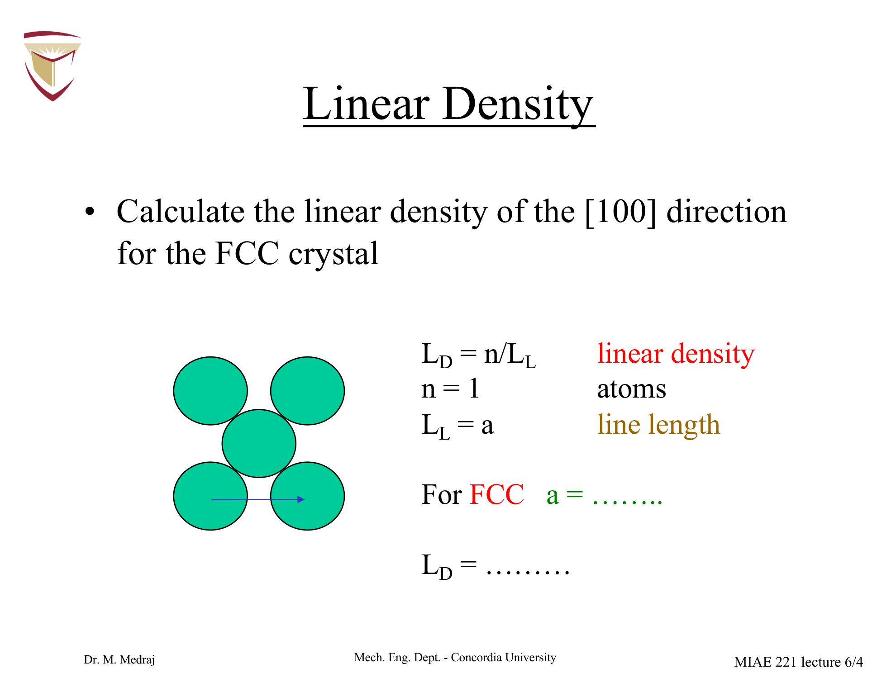
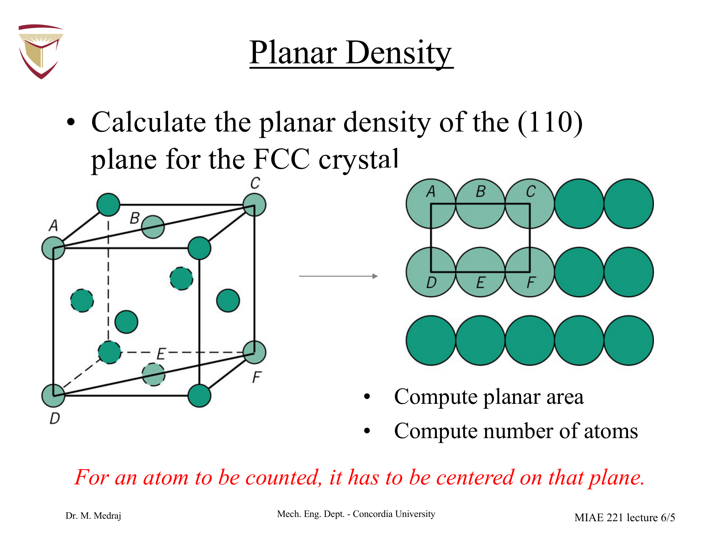
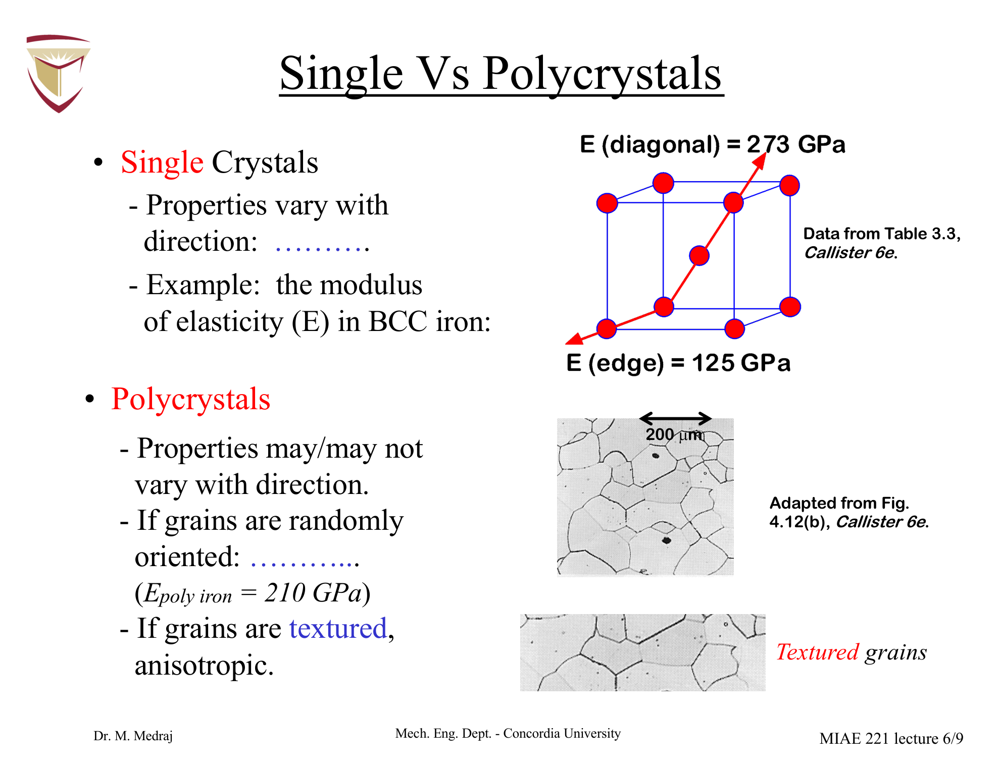
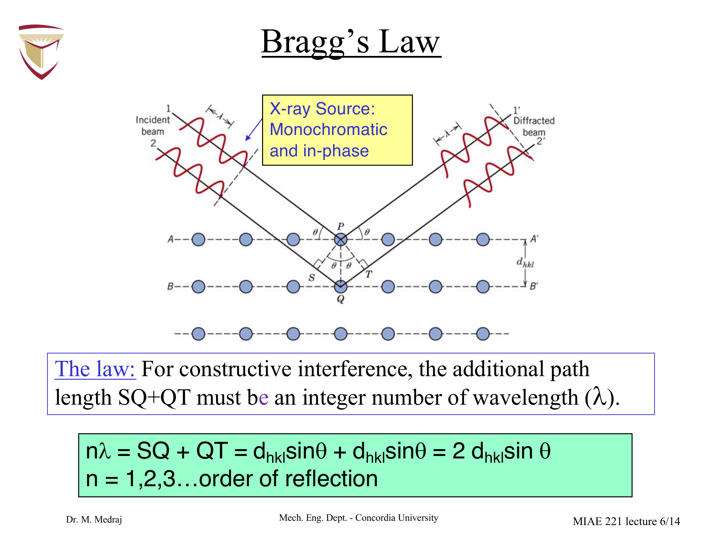
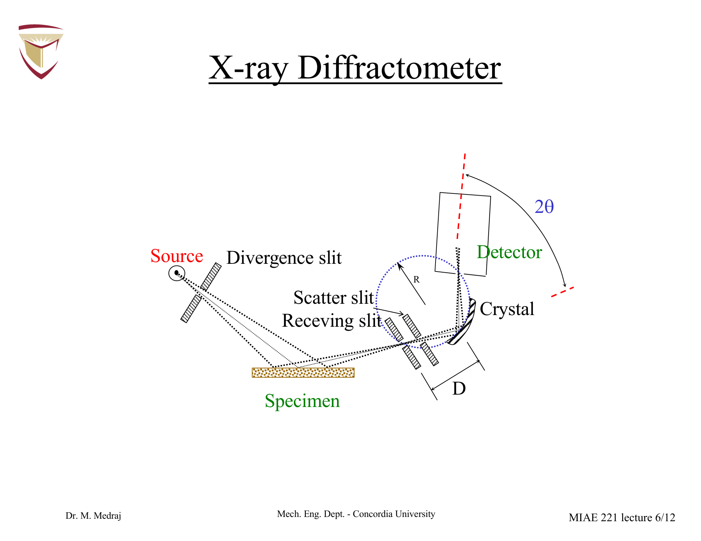
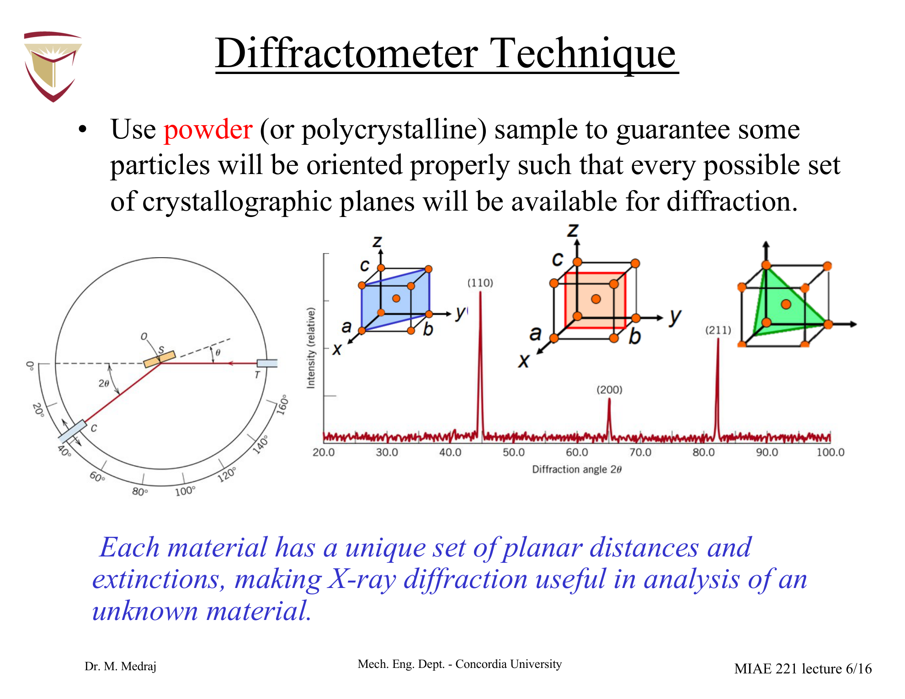
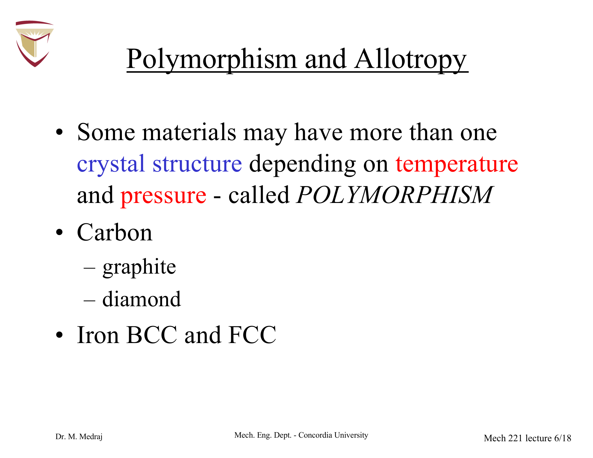

# MIAE 221: Materials Science for Engineers
# Lecture 6: Crystal Structures 3 — Atomic Densities, XRD & Anisotropy (Explained)
**Concordia University · Department of Mechanical, Industrial & Aerospace Engineering**  
**Teacher Material: Lecture 6 (Prof. Mamoun Medraj) · Correlated with Callister Chapter 3**

---

## Executive Overview & Core Concepts

In solid-state materials engineering, macroscopic mechanical, physical, and optical behavior stems directly from how atoms populate specific spatial lines and crystallographic planes. This explained lecture guide covers the rigorous foundations of:
1. **Linear and Planar Atomic Densities**: Quantitative derivations of atom packing along direction vectors and planes.
2. **Directional Anisotropy vs. Polycrystalline Isotropy**: Why elasticity varies with direction in single crystals (e.g., turbine blades) while bulk polycrystalline metals behave isotropically.
3. **Interplanar Spacing & X-Ray Diffraction (XRD)**: The wave-optics principles of constructive interference and the mathematical derivation of Bragg's Law.
4. **Powder Diffractometry & Crystal Identification**: How diffraction spectra and selection rules reveal unknown lattice parameters and crystal structures.
5. **Polymorphism & Allotropy**: Temperature/pressure-induced structural phase shifts in carbon and iron.

---

## 1. Linear Atomic Density ($LD$)

### Definition & Physical Principle
**Linear Density ($LD$)** is the number of atom diameters intercepted per unit length along a specific crystallographic direction vector:

$$LD = \frac{\text{Number of atomic diameters centered on the direction vector}}{\text{Length of the direction vector}} = \frac{n}{L}$$

* **Counting Rule**: For an atom to be counted toward linear density, its **center must lie directly on the direction vector**.
* End atoms whose centers terminate a line segment inside a unit cell contribute $\frac{1}{2}$ atom each.
* Atoms whose centers lie strictly along the interior of the line segment contribute $1$ full atom each.

---

### Quantitative Derivation: FCC [100] Direction

*Figure 6.1: Linear density calculation along the $[100]$ direction in a Face-Centered Cubic (FCC) unit cell (Dr. Medraj MIAE 221 Lecture 6, Slide 4 & Callister Fig. 3.11). Atoms are centered only at the two cube corners along the edge length $a$.*

1. **Direction Vector Length**:
   The direction $[100]$ lies along the edge of the cubic unit cell.
   $$L = a$$
   In FCC, the lattice parameter relates to atomic radius $R$ by $a\sqrt{2} = 4R \implies a = 2\sqrt{2}R$.
   $$L = 2\sqrt{2}R$$

2. **Atoms Centered on the Vector**:
   The vector passes through two corner atoms. The face-center atoms do not lie on the edge.
   $$n = 2 \times \frac{1}{2} = 1 \text{ atom}$$

3. **Linear Density Formula**:
   $$LD_{[100]} = \frac{1}{a} = \frac{1}{2\sqrt{2}R}$$

4. **Numerical Example (FCC Aluminum)**:
   Given atomic radius $R = 0.143\text{ nm} = 0.143 \times 10^{-7}\text{ cm}$:
   $$a = 2\sqrt{2}(0.143\text{ nm}) = 0.4045\text{ nm}$$
   $$LD_{[100]} = \frac{1}{0.4045\text{ nm}} = \mathbf{2.47 \text{ nm}^{-1}} = 2.47 \times 10^7 \text{ cm}^{-1}$$

---

### Close-Packed Direction: FCC [110]

Along the $[110]$ face diagonal:
* Atoms touch continuously: $L = 4R$.
* Atom count: $2 \text{ corners} \times \frac{1}{2} + 1 \text{ face center} = 2 \text{ atoms}$.
* Linear Density:
  $$LD_{[110]} = \frac{2}{4R} = \frac{1}{2R}$$
* For Aluminum: $LD_{[110]} = \frac{1}{2(0.143\text{ nm})} = \mathbf{3.50 \text{ nm}^{-1}}$.
* **Physical Insight**: $LD_{[110]} > LD_{[100]}$ ($3.50\text{ nm}^{-1} > 2.47\text{ nm}^{-1}$). The $[110]$ direction is the **close-packed direction** in FCC; this is why plastic deformation (dislocation glide) occurs preferentially along $\langle 110 \rangle$.

---

## 2. Planar Atomic Density ($PD$)

### Definition & Physical Principle
**Planar Density ($PD$)** is the number of atoms centered on a crystallographic plane per unit area of that plane:

$$PD = \frac{\text{Number of atoms centered on the plane}}{\text{Area of the plane}} = \frac{n}{A}$$

* **Centering Law**: Only atoms whose centers lie strictly within the geometric boundary of the plane are counted.
* Corner atoms of a planar polygon contribute fractional areas based on their interior plane angles.

---

### Quantitative Derivation: FCC (110) Plane

*Figure 6.2: Planar density geometry for the $(110)$ plane in an FCC crystal (Dr. Medraj Lecture 6, Slides 5–6 & Callister Fig. 3.12). The plane intersects the unit cell as a rectangle of dimensions $a$ by $a\sqrt{2}$.*

1. **Planar Geometry & Area**:
   The $(110)$ plane cuts diagonally across the FCC unit cell, forming a rectangle:
   * Vertical height = $a$
   * Horizontal width = Face diagonal $= a\sqrt{2}$
   $$\text{Area } A = a \times a\sqrt{2} = a^2\sqrt{2}$$
   Substituting $a = 2\sqrt{2}R$:
   $$A = (2\sqrt{2}R)^2 \sqrt{2} = 8R^2 \sqrt{2} = 8\sqrt{2}R^2$$

2. **Number of Centered Atoms ($n$)**:
   * $4$ corner atoms: each interior corner angle of the rectangle is $90^\circ$ ($\frac{90^\circ}{360^\circ} = \frac{1}{4}$ of a circle).
     $$4 \times \frac{1}{4} = 1 \text{ atom}$$
   * $2$ face-centered atoms: located on the top and bottom faces, each halved by the boundary edge of the rectangle.
     $$2 \times \frac{1}{2} = 1 \text{ atom}$$
   * Total centered atoms:
     $$n = 1 + 1 = 2 \text{ atoms}$$

3. **Planar Density Formula**:
   $$PD_{(110)} = \frac{n}{A} = \frac{2}{8\sqrt{2}R^2} = \frac{1}{4\sqrt{2}R^2}$$

4. **Numerical Example (FCC Aluminum)**:
   With $R = 0.143\text{ nm}$:
   $$PD_{(110)} = \frac{1}{4\sqrt{2}(0.143\text{ nm})^2} = \frac{1}{4(1.4142)(0.02045\text{ nm}^2)} = \mathbf{8.64 \text{ atoms/nm}^2}$$

---

### Engineering Significance of $LD$ and $PD$

1. **Slip Systems & Plastic Deformation**:
   * Dislocation motion requires overcoming lattice friction (Peierls-Nabarro stress $\tau_{PN} \propto \exp(-2\pi d / b)$).
   * Planes with the **highest planar density** have the widest interplanar spacing ($d$), minimizing lattice resistance.
   * Consequently, plastic slip occurs along **directions of highest linear density** within **planes of highest planar density**:
     * **FCC Slip System**: $\{111\} \langle 110 \rangle$ (12 slip systems $\implies$ high ductility).
     * **BCC Slip System**: $\{110\} \langle 111 \rangle$ (48 active slip systems at elevated temperatures).
2. **Speed of Sound**: Sound waves propagate via phonon atomic collisions; acoustic velocities are highest along densely packed directions.
3. **Surface Energy & Catalysis**: Low planar density planes expose more unsatisfied ("dangling") chemical bonds, resulting in higher surface energy and heightened catalytic reactivity.

---

## 3. Directional Anisotropy vs. Polycrystalline Isotropy

*Figure 6.3: Directional dependence (anisotropy) of the Elastic Modulus $E$ in single-crystal BCC Iron (Dr. Medraj Lecture 6, Slides 8–9 & Callister Fig. 3.21). Left: 3D spatial stiffness surface showing dramatic variation between $[111]$ and $[100]$. Right: Polycrystalline aggregate exhibiting microscopic grain boundaries and macroscopic isotropy.*

### Single Crystals & Anisotropy
In a **single crystal**, the periodic arrangement of atoms is continuous across the entire volume without interruption:
* Physical properties (stiffness, electrical conductivity, magnetic susceptibility, refractive index) depend on the crystallographic direction along which they are measured. This directionality is called **anisotropy**.
* **BCC Iron ($Fe$) Case Study**:
  * $[111]$ direction (body diagonal, close-packed): $E_{[111]} = \mathbf{272.7 \text{ GPa}}$ (stiffest direction).
  * $[110]$ direction (face diagonal): $E_{[110]} = \mathbf{210.5 \text{ GPa}}$.
  * $[100]$ direction (cube edge, most open): $E_{[100]} = \mathbf{125.0 \text{ GPa}}$ (most compliant direction).
  * Ratio: $\frac{E_{[111]}}{E_{[100]}} = 2.18$! A single crystal of iron is more than twice as stiff along its body diagonal as along its cube edge.

### High-Performance Single Crystal Applications
* **Turbine Blades**: Modern aerospace jet engines operate at temperatures exceeding $1100^\circ\text{C}$. High-temperature creep occurs primarily via atomic diffusion along grain boundaries. By casting turbine blades as **single crystals** (e.g., PWA 1480, CMSX-4 nickel-base superalloys) oriented along the stiff $[001]$ growth direction, grain boundaries are eliminated, preventing creep failure.
* **Diamond Abrasives**: Industrial cutting tools exploit diamond's maximum hardness along specific crystallographic planes.

### Polycrystalline Aggregates & Isotropy
* Most engineering metals are **polycrystals** consisting of millions of microscopic grains separated by grain boundaries.
* If the grains are randomly oriented (equiaxed structure), directional variations average out over macroscopic dimensions, yielding **macroscopic isotropy**.
* When metals undergo heavy plastic deformation (e.g., cold rolling of sheet steel), grains develop a preferred crystallographic orientation (**texture**), reintroducing macroscopic anisotropy.

---

## 4. Interplanar Spacing ($d_{hkl}$)

In any crystal lattice, parallel atomic planes designated by Miller indices $(hkl)$ are separated by a constant perpendicular distance called the **interplanar spacing ($d_{hkl}$)**.

For **cubic crystal systems** ($a = b = c$):

$$d_{hkl} = \frac{a}{\sqrt{h^2 + k^2 + l^2}}$$

### Key Geometric Relationships
* Higher Miller index planes have **smaller** interplanar spacings.
* For a cubic unit cell with lattice parameter $a$:
  * $d_{100} = \frac{a}{\sqrt{1^2 + 0^2 + 0^2}} = a$
  * $d_{110} = \frac{a}{\sqrt{1^2 + 1^2 + 0^2}} = \frac{a}{\sqrt{2}} \approx 0.707a$
  * $d_{111} = \frac{a}{\sqrt{1^2 + 1^2 + 1^2}} = \frac{a}{\sqrt{3}} \approx 0.577a$
  * $d_{200} = \frac{a}{\sqrt{2^2 + 0^2 + 0^2}} = \frac{a}{2} = 0.500a$

---

## 5. X-Ray Diffraction (XRD) & Bragg's Law

X-ray diffraction is the definitive experimental technique used by materials scientists and engineers to identify unknown crystal structures, quantify lattice parameters, and measure residual stresses.

*Figure 6.4: Derivation of Bragg's Law for X-ray diffraction from parallel crystallographic planes (Dr. Medraj Lecture 6, Slides 11–13 & Callister Fig. 3.25). Constructive interference requires path difference $SQ + QT = 2d_{hkl}\sin\theta = n\lambda$.*

### Physical Mechanism of Diffraction
1. **Electromagnetic Wave Character**:
   X-rays are high-energy electromagnetic radiation with wavelengths ($\lambda \approx 0.05 - 0.2\text{ nm}$ or $0.5 - 2\text{ Å}$) on the same spatial scale as interatomic crystal spacings ($d \approx 0.1 - 0.3\text{ nm}$).
2. **Elastic Scattering**:
   When an incident X-ray beam strikes an atom, its electrons scatter the wave elastically without changing its wavelength.
3. **Constructive vs. Destructive Interference**:
   * Scattered rays from adjacent atomic planes travel different path lengths.
   * If the scattered waves emerge **out of phase**, destructive interference cancels their amplitude, yielding zero detected intensity.
   * If the scattered waves emerge **in phase**, constructive interference produces a sharp, intense diffracted beam.

---

### Step-by-Step Derivation of Bragg's Law

Refer to Figure 6.4:
1. Consider two parallel monochromatic X-ray beams incident at angle $\theta$ (the **Bragg angle**) on adjacent crystal planes $1$ and $2$, separated by interplanar spacing $d_{hkl}$.
2. Ray $2$ travels further than Ray $1$ by the extra path length:
   $$\Delta = \overline{SQ} + \overline{QT}$$
3. From right-triangle geometry:
   $$\sin\theta = \frac{\overline{SQ}}{d_{hkl}} \implies \overline{SQ} = d_{hkl}\sin\theta$$
   $$\sin\theta = \frac{\overline{QT}}{d_{hkl}} \implies \overline{QT} = d_{hkl}\sin\theta$$
4. Total extra path length:
   $$\Delta = 2d_{hkl}\sin\theta$$
5. For constructive interference, this path difference must equal an integer number ($n$) of complete wavelengths ($\lambda$):

$$\mathbf{n\lambda = 2d_{hkl}\sin\theta}$$

Where:
* $n$ = Order of reflection ($n = 1, 2, 3\dots$; typically $n = 1$ in fundamental XRD analysis).
* $\lambda$ = X-ray wavelength (commonly Copper $K_\alpha$ radiation: $\lambda = 0.1542\text{ nm} = 1.542\text{ Å}$).
* $d_{hkl}$ = Interplanar spacing of diffracting planes $(hkl)$.
* $\theta$ = Bragg angle (angle between incident beam and crystallographic plane).

---

## 6. The Powder Diffractometer & Reflection Rules

*Figure 6.5: Schematic of a Bragg-Brentano $\theta - 2\theta$ powder diffractometer (Dr. Medraj Lecture 6, Slides 14–15 & Callister Fig. 3.26). The X-ray detector rotates at angular velocity $2\omega$ while the specimen stage rotates at $\omega$, recording intensity versus $2\theta$.*

### Diffractometer Operation
1. The specimen is ground into a fine powder containing thousands of microscopic crystallites in completely random orientations.
2. At any angle $\theta$, some fraction of crystallites are oriented such that their $(hkl)$ planes satisfy Bragg's Law.
3. The detector rotates at twice the speed of the sample stage ($2\theta$) to maintain the specular reflection condition.
4. **Diffraction Spectrum Output**: The recorder plots scattered X-ray intensity as a function of the **diffraction angle $2\theta$** (NOT $\theta$).

---

### Selection Rules for Crystal Structure Identification

Not all planes produce diffraction peaks; destructive interference between atoms within the unit cell completely extinguishes certain reflections:

| Crystal Structure | Diffraction Selection Rule (Condition for Peak to Occur) | Allowed Reflections $(hkl)$ | Forbidden Reflections |
| :--- | :--- | :--- | :--- |
| **BCC** | Sum of indices must be **even**: $h + k + l = 2n$ | $(110), (200), (211), (220), (310), (222)$ | $(100), (111), (210), (300)$ |
| **FCC** | Indices must be **unmixed** (all odd OR all even) | $(111), (200), (220), (311), (222), (400)$ | $(100), (110), (210), (211)$ |
| **Simple Cubic** | All reflections allowed | All $(hkl)$ | None |

*Figure 6.6: Experimental X-ray diffraction spectrum for polycrystalline Face-Centered Cubic (FCC) Aluminum (Dr. Medraj Lecture 6, Slide 17 & Callister Fig. 3.27). Diffraction peaks correspond only to unmixed Miller index planes $(111), (200), (220), (311), (222)$.*

---

### Comprehensive Solved Problem: Lattice Parameter from XRD (Dr. Medraj Lecture 6 Example)

**Problem Statement**:
High-purity BCC iron ($\text{Fe}$) is analyzed in a powder diffractometer using monochromatic X-radiation with $\lambda = 0.1790\text{ nm}$. The first-order reflection ($n = 1$) from the $(220)$ plane family produces a diffraction peak. Given that the lattice parameter of BCC iron is $a = 0.2866\text{ nm}$:
1. Compute the interplanar spacing $d_{220}$.
2. Determine the Bragg angle $\theta$ and the experimental diffraction angle $2\theta$.

**Solution**:

1. **Compute Interplanar Spacing $d_{220}$**:
   $$d_{hkl} = \frac{a}{\sqrt{h^2 + k^2 + l^2}}$$
   $$d_{220} = \frac{0.2866\text{ nm}}{\sqrt{2^2 + 2^2 + 0^2}} = \frac{0.2866\text{ nm}}{\sqrt{4 + 4 + 0}} = \frac{0.2866}{\sqrt{8}} = \frac{0.2866}{2.8284} = \mathbf{0.1013\text{ nm}}$$

2. **Compute Bragg Angle $\theta$**:
   From Bragg's Law ($n = 1$):
   $$\lambda = 2d_{220}\sin\theta \implies \sin\theta = \frac{\lambda}{2d_{220}}$$
   $$\sin\theta = \frac{0.1790\text{ nm}}{2(0.1013\text{ nm})} = \frac{0.1790}{0.2026} = 0.8835$$
   $$\theta = \arcsin(0.8835) = \mathbf{62.07^\circ}$$

3. **Compute Experimental Diffraction Angle $2\theta$**:
   $$2\theta = 2 \times 62.07^\circ = \mathbf{124.14^\circ}$$

*Exam Trap Alert*: Diffractometer readouts always present the $x$-axis as $2\theta$. If an exam question asks for $\theta$, divide the peak position by $2$; if it asks for the diffractometer peak position, multiply $\theta$ by $2$.

---

## 7. Polymorphism and Allotropy

**Polymorphism** is the phenomenon where a material can exist in two or more distinct crystal structures depending on temperature and pressure. When observed in elemental solids, it is termed **allotropy**.

*Figure 6.7: Allotropic phase transformations in engineering solids (Dr. Medraj Lecture 6, Slides 18–19 & Callister Fig. 3.22). Top: Carbon allotropes (diamond tetrahedral $sp^3$ network vs graphite layered hexagonal $sp^2$ sheets). Bottom: Temperature-dependent phase transformations in pure iron ($\alpha$-BCC $\to \gamma$-FCC $\to \delta$-BCC).*

### Iron Allotropic Phase Transformations (Atmospheric Pressure)
* **$\alpha$-Ferrite** (Room Temp up to $912^\circ\text{C}$): Body-Centered Cubic (BCC), magnetic, low carbon solubility ($\le 0.022\text{ wt}\%$).
* **$\gamma$-Austenite** ($912^\circ\text{C}$ to $1394^\circ\text{C}$): Face-Centered Cubic (FCC), non-magnetic, dense packing, high carbon solubility (up to $2.14\text{ wt}\%$).
* **$\delta$-Ferrite** ($1394^\circ\text{C}$ to melting point $1538^\circ\text{C}$): Body-Centered Cubic (BCC), stable at high temperature.
* **Volume Change during Heat Treatment**: The transformation from BCC $\alpha$-ferrite to FCC $\gamma$-austenite involves a **$-0.5\%$ volumetric contraction** because FCC has a higher atomic packing factor ($\text{APF} = 0.74$) than BCC ($\text{APF} = 0.68$). This volumetric contraction and expansion during rapid quenching is the root cause of thermal stresses and quench cracking in steel metallurgy.

### Carbon Allotropes
1. **Diamond**:
   * Each carbon atom is covalently bonded to 4 neighbors in a 3D tetrahedral network ($sp^3$ hybridization).
   * Extreme hardness ($10$ on Mohs scale), high thermal conductivity ($2000\text{ W/m}\cdot\text{K}$), electrical insulator ($E_g = 5.5\text{ eV}$).
2. **Graphite**:
   * Carbon atoms form hexagonal planar rings with strong in-plane covalent bonds ($sp^2$ hybridization).
   * Adjacent sheets are bonded only by weak van der Waals forces, allowing easy inter-sheet shearing (solid lubricant, pencil lead). Delocalized $\pi$-electrons make graphite an electrical conductor along basal planes.

---

## 8. Master Formula & High-Yield Summary Matrix

| Property / Concept | Governing Equation | Key Units | Critical Exam Traps |
| :--- | :--- | :--- | :--- |
| **Linear Density ($LD$)** | $LD = \dfrac{n}{L}$ | $\text{nm}^{-1}$ or $\text{m}^{-1}$ | Only count atoms with **centers** on the line segment; edge endpoints contribute $\frac{1}{2}$. |
| **Planar Density ($PD$)** | $PD = \dfrac{n}{A}$ | $\text{atoms/nm}^2$ or $\text{m}^{-2}$ | Only count atoms with centers inside plane bounds; corners contribute fractional angles. |
| **Interplanar Spacing (Cubic)** | $d_{hkl} = \dfrac{a}{\sqrt{h^2 + k^2 + l^2}}$ | $\text{nm}$ or $\text{Å}$ | Forgetting the square root; higher indices yield smaller $d$. |
| **Bragg's Law** | $n\lambda = 2d_{hkl}\sin\theta$ | $\lambda, d$ in same units | Confusing $\theta$ with $2\theta$; ensuring angle mode in calculator is degrees. |
| **BCC Selection Rule** | $h + k + l = \text{even}$ | Dimensionless | Reflections like $(111)$ are forbidden in BCC ($1+1+1 = 3$, odd). |
| **FCC Selection Rule** | $h, k, l$ all odd or all even | Dimensionless | Reflections like $(110)$ are forbidden in FCC (mixed parity). |
| **Volume Contraction $\alpha \to \gamma$** | $\Delta V < 0$ ($\text{BCC} \to \text{FCC}$) | $\%$ | FCC ($\text{APF}=0.74$) is denser than BCC ($\text{APF}=0.68$). |
