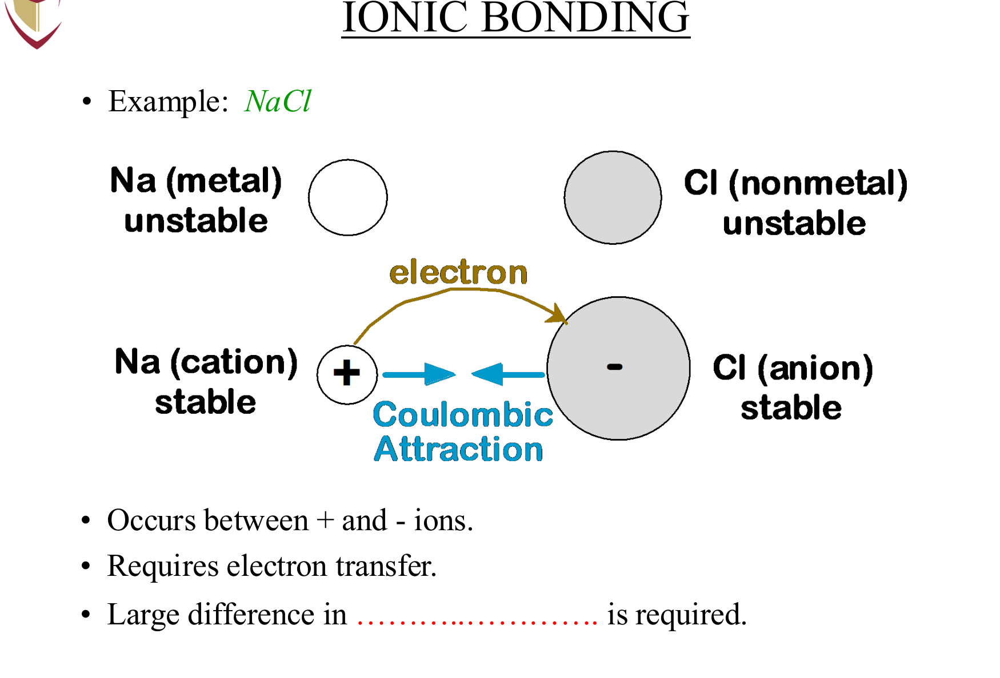
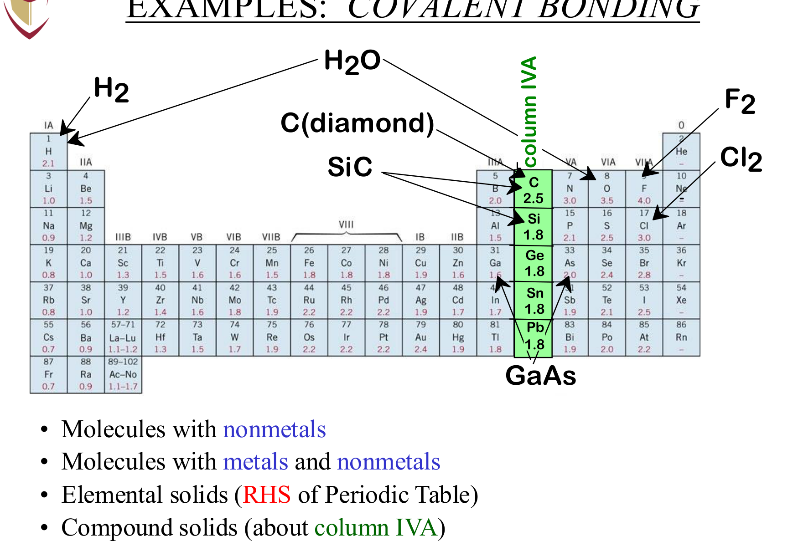
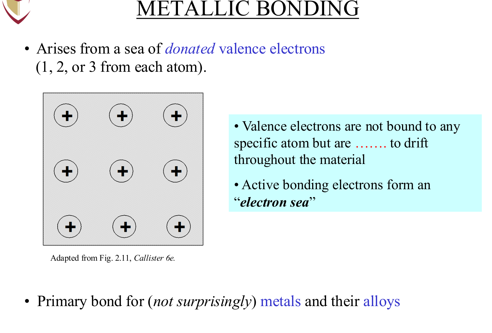
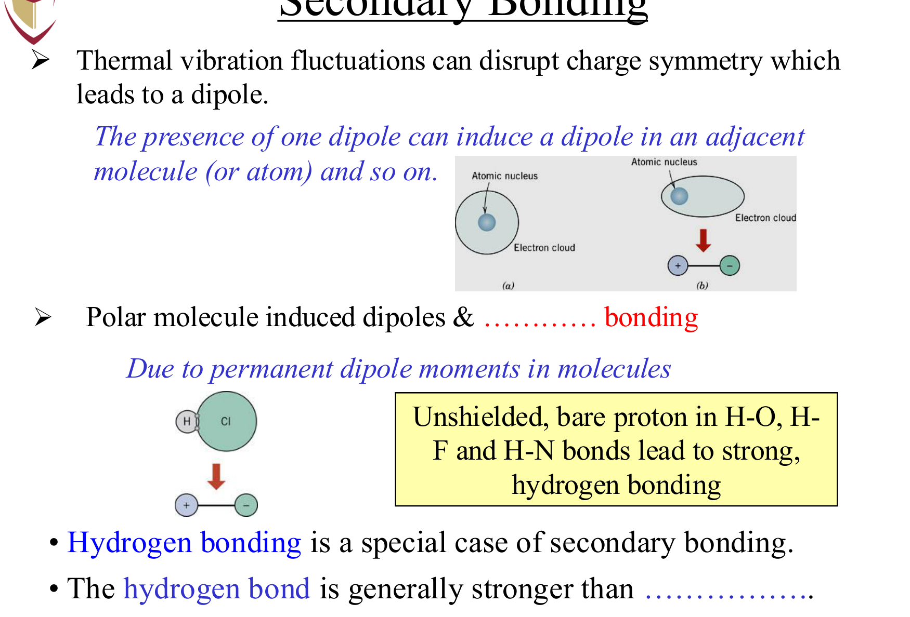

# MIAE 221: Materials Science for Engineers
# Part 2: Chemical Bonding, Potential Energy Wells & Physical Properties

---

## 1. The Three Primary (Strong) Chemical Bonds

Primary bonds are strong interatomic attachments involving valence electron transfers or sharing, with bond energies typically ranging from $100\text{ to }1000\text{ kJ/mol}$ ($1\text{ to }10\text{ eV/atom}$).

*Figure 2.1: Ionic bonding mechanism: Complete electron transfer from electropositive metal cation ($Na^+$) to electronegative nonmetal anion ($Cl^-$), forming non-directional Coulombic attraction.*

*Figure 2.2: Covalent bonding mechanism: Localized orbital overlap and sharing of valence electrons along fixed geometric bond angles.*

*Figure 2.3: Metallic bonding mechanism: Positively charged ion cores bathed in a delocalized, freely mobile electron gas ("sea of valence electrons").*

---

### A. Ionic Bonding (Electrostatic Attraction)

* **Physical Mechanism**: 
  Occurs between atoms with large differences in electronegativity ($\Delta X > 1.7$–$2.0$), typically a metallic element (electropositive, low ionization energy) and a nonmetallic element (electronegative, high electron affinity).
  $$\text{Metal (gives } e^-) + \text{Non-Metal (takes } e^-) \longrightarrow \text{Cation}^+ + \text{Anion}^-$$
  *Example*: Sodium ($Na: [Ne]3s^1$) transfers its outer electron to Chlorine ($Cl: [Ne]3s^2 3p^5$), producing mutually stable octets: $Na^+ ([Ne])$ and $Cl^- ([Ar])$.
* **Directionality**: **Non-directional**. 
  Because an electric field radiates symmetrically in all spherical directions, a positive ion attracts negative ions equally from every orientation in 3D space. The crystal structure is governed purely by ion size ratios (radius ratio $r_c/r_a$) and charge neutrality.
* **Coulombic Attractive Force**:
  $$F_A = \frac{|z_1| |z_2| e^2}{4\pi \varepsilon_0 r^2}$$
  Where $z_1, z_2$ are ionic valences, $e = 1.602 \times 10^{-19}\text{ C}$, $\varepsilon_0 = 8.854 \times 10^{-12}\text{ F/m}$ (permittivity of vacuum), and $r$ is interionic separation.

---

### B. Covalent Bonding (Electron Sharing)

* **Physical Mechanism**:
  Occurs between atoms with small differences in electronegativity located near each other on the right side of the periodic table (e.g., $C, Si, Ge, O_2, N_2, CH_4$, and polymer chains).
  Rather than giving up electrons, adjacent atoms share pairs of valence electrons such that each participating atom achieves a stable, closed-shell inert gas configuration.
* **Directionality**: **Highly Directional**.
  Covalent bonds form strictly along specific angles defined by quantum orbital overlap (e.g., $sp^3$ hybrid orbitals form a strict $109.5^\circ$ tetrahedral geometry in diamond and silicon).
* **Macroscopic Impact**:
  Because atoms cannot shift without breaking rigid directional orbital bonds, covalent crystals like diamond, silicon carbide ($SiC$), and silicon nitride ($Si_3N_4$) possess **enormous hardness**, **high melting temperatures**, but **no plastic slip**.

---

### C. Metallic Bonding (The Electron Cloud)

* **Physical Mechanism**:
  Occurs in pure metals and metallic alloys ($Fe, Cu, Al, Ti$, brass, bronze).
  Metallic elements have few valence electrons loosely bound to the nucleus. In a solid, these valence electrons detach from individual atoms and become completely delocalized, forming a mobile "sea of electrons" (or Fermi gas) that freely permeates the entire crystal. The positively charged ion cores (nucleus + inner core electrons) are held together by mutual electrostatic attraction to this permeating electron cloud.
* **Directionality**: **Non-directional**.
  The sea of electrons shields adjacent ion cores equally in all directions.
* **Engineering Properties Derived from Metallic Bonding**:
  1. **High Electrical & Thermal Conductivity**: The free valence electrons move instantly in response to electric fields or thermal gradients.
  2. **High Ductility & Formability**: When a shear stress is applied, crystal planes slide over one another (dislocation slip). Because the bonding is non-directional, the electron glue simply flows with the moving atoms—the crystal deforms plastically without cleaving.
  3. **Opaque & Lustrous**: Free electrons absorb and re-emit all visible photon wavelengths.

---

## 2. Mixed Bonding & Pauling's Percent Ionic Character

In reality, pure ionic and pure covalent bonds represent idealized extremes. Most chemical compounds exhibit **mixed bonding** characterized by partial ionic and partial covalent character.

Linus Pauling established an empirical equation relating the **Percent Ionic Character (%IC)** of an interatomic bond to the difference in Pauling electronegativities ($X_A$ and $X_B$):

$$\% \text{ Ionic Character} = \left[ 1 - \exp\left( -0.25 (X_A - X_B)^2 \right) \right] \times 100\%$$

| Material Pair | Element A ($X_A$) | Element B ($X_B$) | $\Delta X = |X_A - X_B|$ | Calculated % Ionic Character | Dominant Bond Nature |
| :--- | :---: | :---: | :---: | :---: | :--- |
| **$\text{NaCl}$** | $\text{Na } (0.9)$ | $\text{Cl } (3.0)$ | $2.1$ | **$67.4\%$** | Predominantly Ionic |
| **$\text{MgO}$** | $\text{Mg } (1.2)$ | $\text{O } (3.5)$ | $2.3$ | **$73.4\%$** | Heavily Ionic Ceramic |
| **$\text{GaAs}$** | $\text{Ga } (1.6)$ | $\text{As } (2.0)$ | $0.4$ | **$3.9\%$** | Covalent Semiconductor |
| **$\text{SiC}$** | $\text{Si } (1.8)$ | $\text{C } (2.5)$ | $0.7$ | **$11.5\%$** | Strong Covalent Network |
| **$\text{CsF}$** | $\text{Cs } (0.7)$ | $\text{F } (4.0)$ | $3.3$ | **$93.4\%$** | Almost Purely Ionic |

### Reference Pauling Electronegativities

| Element | H | C | N | O | F | Na | Mg | Al | Si | Cl | K | Ti | Fe | Zn | Br | Te |
| :---: | :---: | :---: | :---: | :---: | :---: | :---: | :---: | :---: | :---: | :---: | :---: | :---: | :---: | :---: | :---: | :---: |
| **$X$** | 2.1 | 2.5 | 3.0 | 3.5 | 4.0 | 0.9 | 1.2 | 1.5 | 1.8 | 3.0 | 0.8 | 1.5 | 1.8 | 1.6 | 2.8 | 2.1 |

### Step-by-Step Calculation Examples

1. **Titanium Dioxide ($TiO_2$)**:
   * Electronegativities: $X_O = 3.5$, $X_{Ti} = 1.5 \implies \Delta X = 3.5 - 1.5 = 2.0$
   * $(\Delta X)^2 = 2.0^2 = 4.0$
   * $\% \text{IC} = [1 - \exp(-0.25 \times 4.0)] \times 100\% = [1 - \exp(-1.0)] \times 100\%$
   * $\% \text{IC} = [1 - 0.3679] \times 100\% = \mathbf{63.2\% \text{ Ionic}}$ (and $36.8\%$ Covalent).

2. **Zinc Telluride ($ZnTe$)**:
   * Electronegativities: $X_{Te} = 2.1$, $X_{Zn} = 1.6 \implies \Delta X = 2.1 - 1.6 = 0.5$
   * $(\Delta X)^2 = 0.25$
   * $\% \text{IC} = [1 - \exp(-0.25 \times 0.25)] \times 100\% = [1 - \exp(-0.0625)] \times 100\%$
   * $\% \text{IC} = [1 - 0.9394] \times 100\% = \mathbf{6.1\% \text{ Ionic}}$ (and $93.9\%$ Covalent).

---

## 3. Secondary (Weak) Intermolecular Bonds

Secondary bonds (often termed **van der Waals forces**) arise from electrostatic attraction between electric dipoles. They carry bond energies between $4\text{ and }40\text{ kJ/mol}$ ($0.04\text{ to }0.4\text{ eV/atom}$)—roughly an order of magnitude weaker than primary bonds.

*Figure 2.4: Secondary physical bonding mechanisms (Dr. Medraj MIAE 221 Lecture 3). Left: Fluctuating induced dipoles (van der Waals dispersion forces) in inert gases and nonpolar polymers. Right: Permanent dipole-dipole attractions and Hydrogen bonding in polar compounds ($H_2O, HF, NH_3$).*
