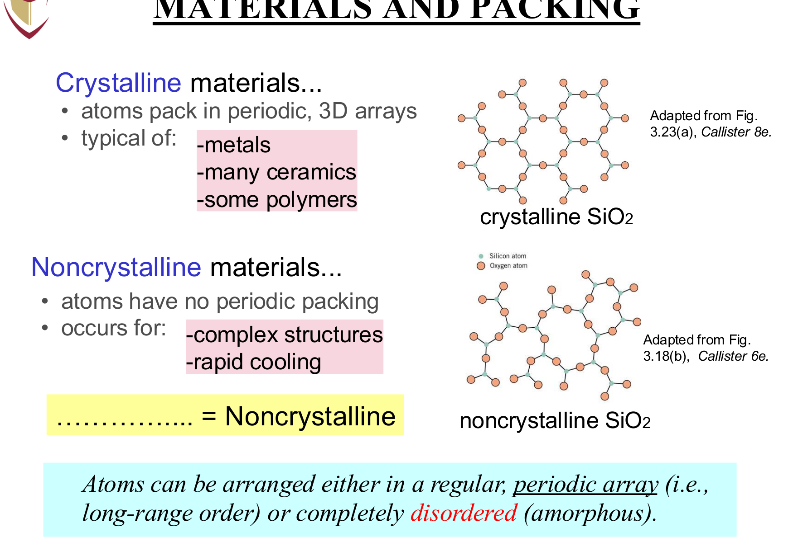
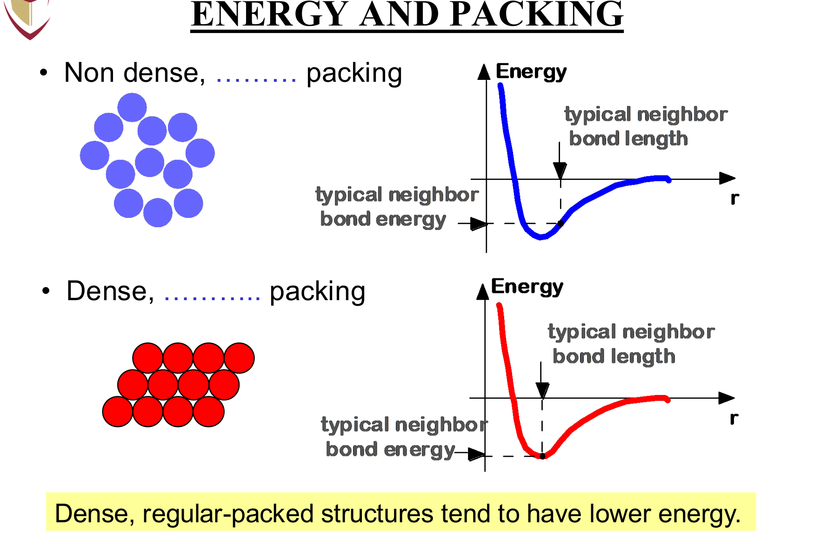
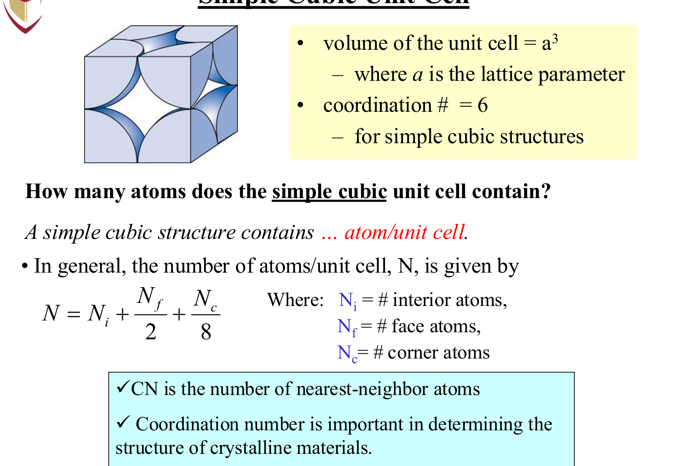
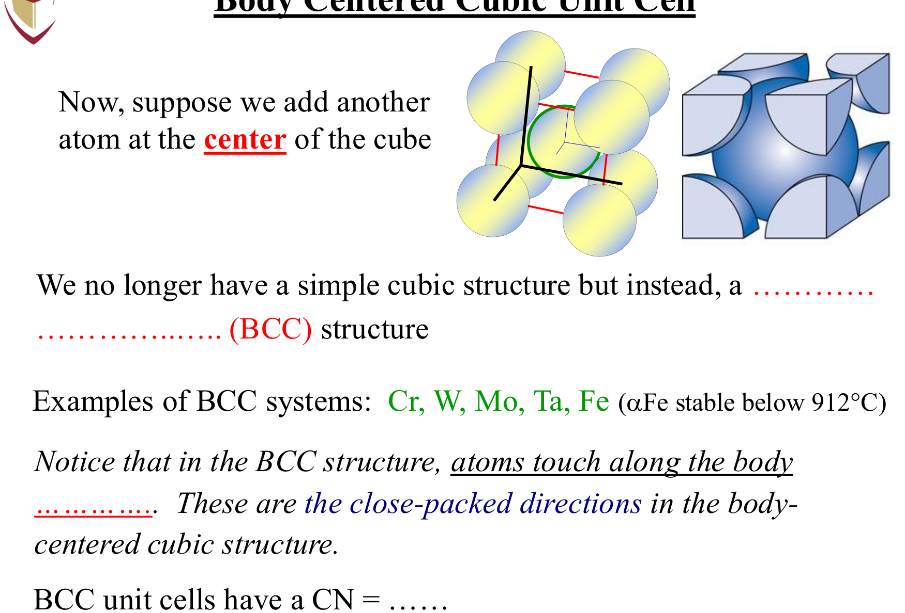
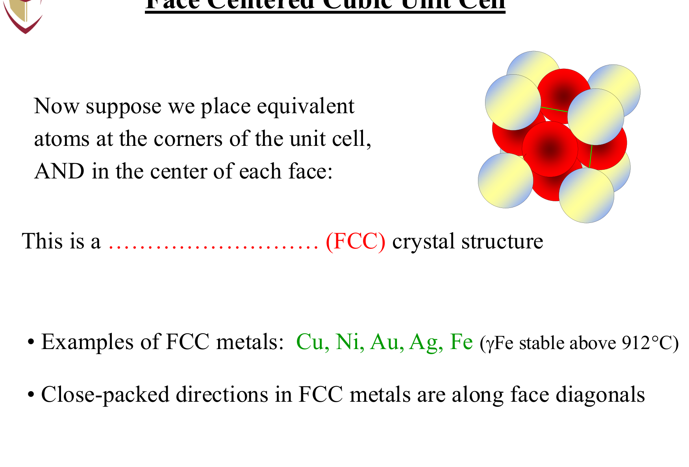
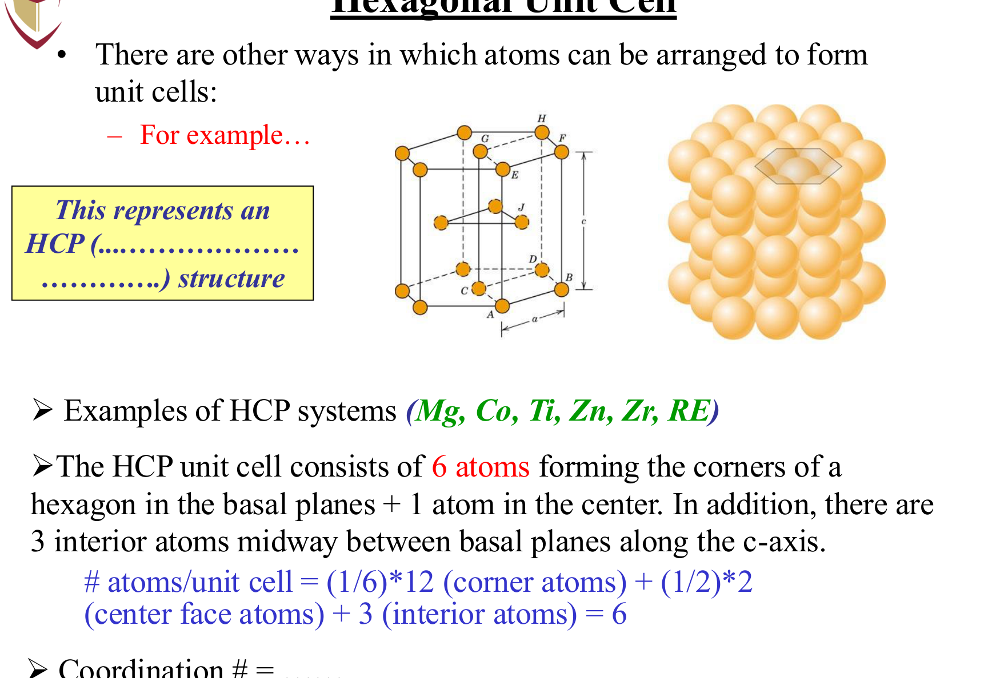
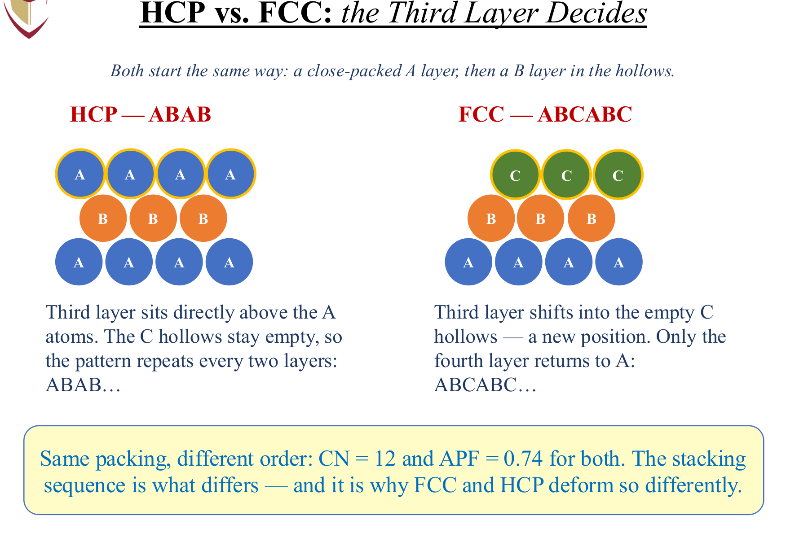
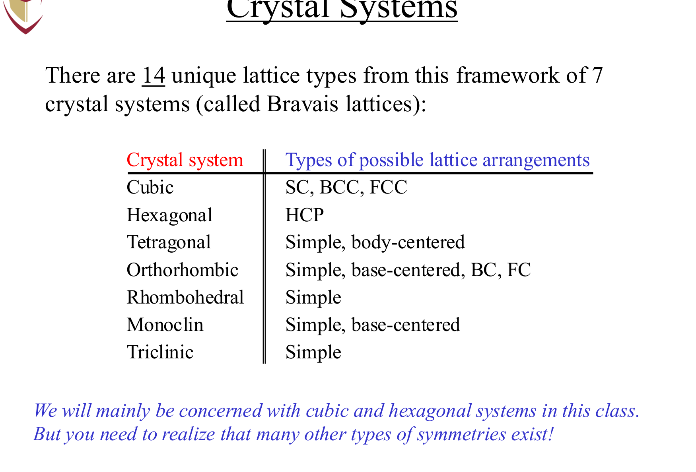
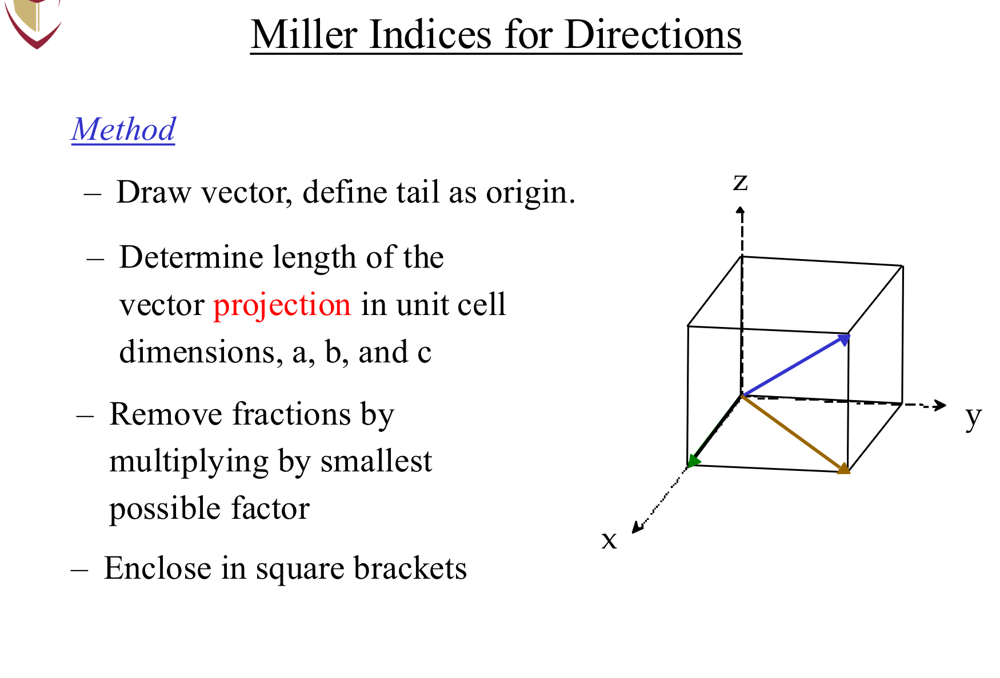
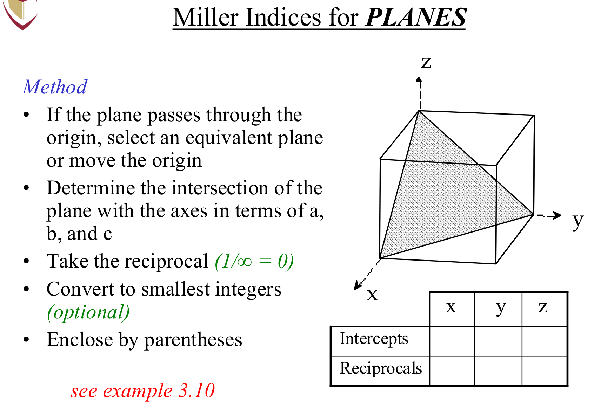

# MIAE 221: Materials Science for Engineers
# Part 3: Crystal Structures, Unit Cells & Crystallography Master Guide
**Concordia University · Department of Mechanical, Industrial & Aerospace Engineering (MIAE)**  
**Lectures 4 & 5 · Prof. Mamoun Medraj**

---

## Table of Contents
1. [Fundamental Concepts of Crystalline Architecture](#1-fundamental-concepts-of-crystalline-architecture)
   - [Crystalline vs. Amorphous Solids](#crystalline-vs-amorphous-solids)
   - [Lattices, Unit Cells & Motifs](#lattices-unit-cells--motifs)
   - [The Atomic Contribution Counting Law](#the-atomic-contribution-counting-law)
2. [The Major Metallic Crystal Structures](#2-the-major-metallic-crystal-structures)
   - [Simple Cubic (SC)](#a-simple-cubic-sc)
   - [Body-Centered Cubic (BCC)](#b-body-centered-cubic-bcc)
   - [Face-Centered Cubic (FCC)](#c-face-centered-cubic-fcc)
   - [Hexagonal Close-Packed (HCP)](#d-hexagonal-close-packed-hcp)
3. [Close-Packed Planes & Stacking Sequences](#3-close-packed-planes--stacking-sequences)
   - [The Close-Packed Layer of Spheres](#the-close-packed-layer-of-spheres)
   - [HCP vs. FCC: The Third Layer Decides](#hcp-vs-fcc-the-third-layer-decides)
4. [The 7 Crystal Systems & 14 Bravais Lattices](#4-the-7-crystal-systems--14-bravais-lattices)
   - [Lattice Parameters: Edge Lengths & Interaxial Angles](#lattice-parameters-edge-lengths--interaxial-angles)
   - [The Master 7 Crystal Systems Matrix](#the-master-7-crystal-systems-matrix)
5. [Theoretical Density Computations ($\rho$)](#5-theoretical-density-computations-rho)
   - [The Governing Formula & Dimensional Analysis](#the-governing-formula--dimensional-analysis)
   - [Step-by-Step Numerical Example (FCC Copper)](#step-by-step-numerical-example-fcc-copper)
6. [Crystallographic Points, Directions & Planes (Miller Indices)](#6-crystallographic-points-directions--planes-miller-indices)
   - [Point Coordinates](#point-coordinates)
   - [Crystallographic Directions: $[uvw]$ & Families $\langle uvw \rangle$](#crystallographic-directions-uvw--families-langle-uvw-rangle)
   - [Isotropy vs. Anisotropy in Single Crystals](#isotropy-vs-anisotropy-in-single-crystals)
   - [Crystallographic Planes: $(hkl)$ & Families $\{hkl\}$](#crystallographic-planes-hkl--families-hkl)
7. [Comprehensive Comparative Synthesis Matrix & Exam Traps](#7-comprehensive-comparative-synthesis-matrix--exam-traps)

---

## 1. Fundamental Concepts of Crystalline Architecture

In solid-state physics and materials engineering, how atoms pack together in three-dimensional space dictates mechanical ductility, electrical conductivity, magnetic permeability, and deformation slip planes.

### Crystalline vs. Amorphous Solids

Solids are divided into two fundamental structural classes based on the regularity of their atomic arrangements:

*Figure 3.1: Fundamental comparison of atomic arrangements (adapted from Dr. Medraj MIAE 221 Lecture 4 & Callister Fig. 3.23). (a) Crystalline solid exhibiting strict periodic long-range order across macroscopic dimensions (metals, alloys, semiconductors). (b) Amorphous vitreous structure exhibiting short-range chemical bonding without translational lattice periodicity (inorganic silicate glasses, amorphous polymers).*

1. **Crystalline Materials**:
   * Atoms position themselves in a **repeating, periodic 3D array** spanning large atomic distances (long-range order).
   * Upon solidification, thermodynamic energy is minimized when atoms nestle into predictable geometric equilibrium sites.
   * *Examples*: All engineering metals (Fe, Al, Cu, Ti), most technical ceramics ($\text{Al}_2\text{O}_3$, $\text{SiC}$), and semiconductors (Si, GaAs).
2. **Amorphous (Non-Crystalline / Vitreous) Materials**:
   * Atoms lack systemic long-range spatial periodicity; only localized chemical bond distances (short-range order) exist.
   * Occurs when rapid liquid cooling ("quenching") freezes atoms in place before they have time to arrange into equilibrium crystal lattices.
   * *Examples*: Silica window glass, amorphous polymers (polystyrene, PMMA), and amorphous metallic glass alloys.

*Figure 3.2: Energy versus interatomic separation for dense, ordered crystalline packing versus non-dense, random amorphous structures (adapted from Dr. Medraj MIAE 221 Lecture 4 & Callister). Dense ordered arrangements achieve lower minimum bonding energy states than irregular, non-dense random structures.*

---

### Lattices, Unit Cells & Motifs

To mathematically describe crystals, crystallographers separate geometry from atomic identity:

* **Lattice**: An infinite 3-dimensional array of mathematical points in space, wherein every point has identical surroundings.
* **Basis / Motif**: An atom, ion, or cluster of atoms attached identically to every single lattice point.
$$\text{Crystal Structure} = \text{Lattice} + \text{Basis}$$
* **Unit Cell**: The **smallest structural repeating unit** that completely defines the symmetry and crystal architecture. Stacking identical unit cells edge-to-edge in 3 dimensions recreates the entire macroscopic crystal lattice.

---

### The Atomic Contribution Counting Law

Because unit cells in a crystal share corners, edges, and faces with neighboring unit cells, an atom sitting on a boundary does **not** belong entirely to one single cell. 

To determine the net effective number of atoms ($N$) inside one unit cell:

$$N = N_{\text{interior}} + \frac{N_{\text{face}}}{2} + \frac{N_{\text{edge}}}{4} + \frac{N_{\text{corner}}}{8}$$

| Atom Position | Shared Between How Many Cells? | Fractional Contribution to One Cell |
| :--- | :---: | :---: |
| **Interior / Center** ($N_i$) | $1$ (Completely inside) | **$1$** |
| **Face Center** ($N_f$) | $2$ adjacent unit cells | **$\frac{1}{2}$** |
| **Edge Center** ($N_e$) | $4$ adjacent unit cells | **$\frac{1}{4}$** |
| **Corner** ($N_c$) | $8$ adjacent unit cells | **$\frac{1}{8}$** |

---

## 2. The Major Metallic Crystal Structures

Over $90\%$ of all elemental metals crystallize into one of three densely packed geometries: **BCC**, **FCC**, or **HCP**. A fourth theoretical structure, **Simple Cubic (SC)**, provides the geometric baseline.

### A. Simple Cubic (SC)

*Figure 3.2: Simple Cubic (SC) unit cell geometry (Dr. Medraj Lecture 4). Corner atoms touch along cube edges ($a = 2R$). With coordination number $CN = 6$ and packing factor $APF = 0.52$, the loose packing makes it unstable for almost all elemental metals except Polonium (Po).*

1. **Lattice Geometry & Atom Contact**:
   * Atoms reside **only** at the 8 cube corners.
   * Atoms touch each other directly along the **cube edges**:
     $$a = 2R$$
2. **Coordination Number ($CN$)**:
   * Each atom is in direct contact with **6** nearest neighbors ($\pm x, \pm y, \pm z$).
3. **Number of Atoms Per Unit Cell ($N$)**:
   $$N = 8 \text{ corners} \times \frac{1}{8} = 1 \text{ atom/cell}$$
4. **Atomic Packing Factor (APF)**:
   * **Definition**: The fraction of solid sphere volume occupied inside the unit cell:
     $$\text{APF} = \frac{V_{\text{atoms}}}{V_{\text{unit cell}}} = \frac{N \times \left(\frac{4}{3}\pi R^3\right)}{a^3}$$
   * Substituting $a = 2R$:
     $$\text{APF}_{\text{SC}} = \frac{1 \times \frac{4}{3}\pi R^3}{(2R)^3} = \frac{\frac{4}{3}\pi R^3}{8R^3} = \frac{\pi}{6} \approx \mathbf{0.52}$$
   * *Assessment*: Only $52\%$ of the space is filled. Because of its extremely loose, unstable packing, only one elemental metal adopts Simple Cubic: **Polonium ($\text{Po}$)**.

---

### B. Body-Centered Cubic (BCC)

*Figure 3.3: Body-Centered Cubic (BCC) unit cell geometry (Dr. Medraj Lecture 4). Corner atoms touch the central body atom along the cube body diagonal ($a\sqrt{3} = 4R$). $N = 2$ atoms/cell, coordination number $CN = 8$, and $APF = 0.68$. Typical metals: $\alpha$-Fe, Cr, W, Mo, Ta, V.*

1. **Lattice Geometry & Atom Contact**:
   * Atoms are located at the 8 corners plus **1 full atom in the center of the cube**.
   * Corner atoms do **not** touch along the cube edge ($a > 2R$).
   * Atoms touch continuously across the **cube body diagonal**:
     $$\text{Body Diagonal} = \sqrt{a^2 + a^2 + a^2} = a\sqrt{3} = 4R \implies a = \frac{4R}{\sqrt{3}}$$
2. **Coordination Number ($CN$)**:
   * The center atom directly touches all 8 corner atoms $\implies \mathbf{CN = 8}$.
3. **Number of Atoms Per Unit Cell ($N$)**:
   $$N = 1 \text{ (center)} + 8 \text{ corners} \times \frac{1}{8} = \mathbf{2 \text{ atoms/cell}}$$
4. **Unit Cell Volume ($V_c$)**:
   $$V_c = a^3 = \left(\frac{4R}{\sqrt{3}}\right)^3 = \frac{64R^3}{3\sqrt{3}}$$
5. **Atomic Packing Factor (APF)**:
   $$\text{APF}_{\text{BCC}} = \frac{2 \times \left(\frac{4}{3}\pi R^3\right)}{\frac{64R^3}{3\sqrt{3}}} = \frac{\frac{8}{3}\pi R^3}{\frac{64}{3\sqrt{3}}R^3} = \frac{\pi\sqrt{3}}{8} \approx \mathbf{0.68}$$
6. **Engineering Examples**:
   * $\alpha$-Iron (ferrite at room temp), Chromium ($\text{Cr}$), Tungsten ($\text{W}$), Molybdenum ($\text{Mo}$), Tantalum ($\text{Ta}$), Vanadium ($\text{V}$).

---

### C. Face-Centered Cubic (FCC)

*Figure 3.4: Face-Centered Cubic (FCC) unit cell geometry (Dr. Medraj Lecture 4). Atoms touch continuously along the face diagonals ($a\sqrt{2} = 4R$). $N = 4$ atoms/cell, coordination number $CN = 12$, and maximum theoretical packing efficiency $APF = 0.74$. Typical metals: Al, Cu, Au, Ag, Ni, Pt, Pb, $\gamma$-Fe.*

1. **Lattice Geometry & Atom Contact**:
   * Atoms reside at the 8 corners plus **in the center of all 6 cube faces**.
   * Atoms touch continuously along the **face diagonal**:
     $$\text{Face Diagonal} = \sqrt{a^2 + a^2} = a\sqrt{2} = 4R \implies a = 2\sqrt{2}R = \frac{4R}{\sqrt{2}}$$
2. **Coordination Number ($CN$)**:
   * Each atom touches 4 neighbors in its own plane, 4 in the plane above, and 4 in the plane below $\implies \mathbf{CN = 12}$.
3. **Number of Atoms Per Unit Cell ($N$)**:
   $$N = 8 \text{ corners} \times \frac{1}{8} + 6 \text{ faces} \times \frac{1}{2} = 1 + 3 = \mathbf{4 \text{ atoms/cell}}$$
4. **Unit Cell Volume ($V_c$)**:
   $$V_c = a^3 = (2\sqrt{2}R)^3 = 16\sqrt{2}R^3$$
5. **Atomic Packing Factor (APF)**:
   $$\text{APF}_{\text{FCC}} = \frac{4 \times \left(\frac{4}{3}\pi R^3\right)}{16\sqrt{2}R^3} = \frac{\frac{16}{3}\pi R^3}{16\sqrt{2}R^3} = \frac{\pi}{3\sqrt{2}} \approx \mathbf{0.74}$$
   * *Significance*: $0.74$ represents the **mathematical upper limit** for packing equal, hard spheres in 3D Euclidean space (Kepler conjecture). FCC is a **close-packed** structure.
6. **Engineering Examples**:
   * Aluminum ($\text{Al}$), Copper ($\text{Cu}$), Gold ($\text{Au}$), Silver ($\text{Ag}$), Nickel ($\text{Ni}$), Platinum ($\text{Pt}$), Lead ($\text{Pb}$), $\gamma$-Iron (austenite at $T > 912^\circ\text{C}$).

---

### D. Hexagonal Close-Packed (HCP)

*Figure 3.5: Hexagonal Close-Packed (HCP) unit cell structure (Dr. Medraj Lecture 4). Basal planes sandwich an interior triangular cluster of 3 atoms. Ideal axial ratio $c/a = 1.633$, $N = 6$ atoms/cell, $CN = 12$, and $APF = 0.74$. Typical metals: $\alpha$-Ti, Mg, Zn, Co, Zr, Be.*

1. **Lattice Geometry**:
   * Two parallel hexagonal basal planes separated by height $c$.
   * Basal hexagon edge length is $a = 2R$.
   * In an ideal HCP structure, the axial ratio is:
     $$\frac{c}{a} = \sqrt{\frac{8}{3}} \approx 1.633$$
2. **Coordination Number ($CN$)**:
   * $\mathbf{CN = 12}$ (Identical to FCC; 6 neighbors in-plane, 3 above, 3 below).
3. **Number of Atoms Per Unit Cell ($N$)**:
   * The complete hexagonal prism contains:
     * 12 corners $\times \frac{1}{6}$ (each shared by 6 hexagonal prisms) $= 2$
     * 2 basal face centers $\times \frac{1}{2} = 1$
     * 3 interior atoms entirely within the cell $= 3$
     $$N_{\text{total}} = 2 + 1 + 3 = \mathbf{6 \text{ atoms/cell}}$$
4. **Unit Cell Volume & APF**:
   * The volume of the hexagonal prism is $V_c = \text{Base Area} \times c = \left(6 \times \frac{\sqrt{3}}{4}a^2\right)c = \frac{3\sqrt{3}}{2}a^2c$.
   * Substituting $a = 2R$ and $c = 1.633a$:
     $$\text{APF}_{\text{HCP}} = \mathbf{0.74} \quad (\text{Identical to FCC!})$$
5. **Engineering Examples**:
   * Titanium ($\alpha\text{-Ti}$), Magnesium ($\text{Mg}$), Zinc ($\text{Zn}$), Cobalt ($\text{Co}$), Zirconium ($\text{Zr}$), Beryllium ($\text{Be}$).

---

## 3. Close-Packed Planes & Stacking Sequences

Both FCC and HCP achieve the maximum theoretical packing density of $\text{APF} = 0.74$ and $\text{CN} = 12$. Why, then, are they distinct crystal structures with radically different mechanical ductilities? 

The answer lies in **layer stacking order**.

### The Close-Packed Layer of Spheres

*Figure 3.6: Atomic packing sequences of close-packed planes (Dr. Medraj Lecture 4). Placing close-packed 2D triangular layers yields two packing choices for the 3rd layer: (a) ABAB... stacking creates the Hexagonal Close-Packed (HCP) structure. (b) ABCABC... stacking creates the Face-Centered Cubic (FCC) structure with $\{111\}$ close-packed slip planes.*

* When you place a 2D sheet of spheres together as tightly as possible, each sphere touches 6 neighbors, forming a triangular array of "valleys" or hollows.
* Let the first layer be **Layer A**.
* The second layer (**Layer B**) rests naturally in the triangular indentations of Layer A.

---

### HCP vs. FCC: The Third Layer Decides

When placing the **third layer of spheres**, there are two distinct choices:

| Crystal System | Stacking Sequence | Third Layer Placement | Ductility & Slip Systems |
| :--- | :---: | :--- | :--- |
| **HCP** | **$\text{ABABAB...}$** | Placed directly over the spheres of **Layer A**. | **Limited Ductility**: Slip restricted primarily to basal plane $\{0001\}$. Brittle/hard at room temp. |
| **FCC** | **$\text{ABCABC...}$** | Placed over the *alternate unoccupied hollows* (**Layer C**). Does not align with A until the 4th layer. | **Exceptional Ductility**: 12 identical $\{111\}\langle 110\rangle$ close-packed slip systems allow effortless dislocation glide. |

> **Key Takeaway**:
> * **HCP** is stacked along the $[0001]$ $c$-axis direction in an $\text{ABAB...}$ sequence.
> * **FCC** close-packed planes are the $\{111\}$ family, stacked along the cube body diagonal $[111]$ in an $\text{ABCABC...}$ sequence.

---

## 4. The 7 Crystal Systems & 14 Bravais Lattices

Every possible repeating crystalline network can be categorized by the geometry of its unit cell.

### Lattice Parameters: Edge Lengths & Interaxial Angles

A unit cell is geometrically defined by 6 independent lattice parameters:
1. Three axial edge lengths: $\mathbf{a, b, c}$
2. Three interaxial angles:
   * $\alpha$: Angle between $b$ and $c$
   * $\beta$: Angle between $a$ and $c$
   * $\gamma$: Angle between $a$ and $b$

---

### The Master 7 Crystal Systems Matrix

*Figure 3.7: The 7 Unique Crystal Systems and their unit cell lattice parameters (Dr. Medraj Lecture 5): Cubic ($a=b=c, \alpha=\beta=\gamma=90^\circ$), Tetragonal ($a=b\neq c, \alpha=\beta=\gamma=90^\circ$), Orthorhombic ($a\neq b\neq c, \alpha=\beta=\gamma=90^\circ$), Hexagonal ($a=b\neq c, \alpha=\beta=90^\circ, \gamma=120^\circ$), Rhombohedral ($a=b=c, \alpha=\beta=\gamma\neq 90^\circ$), Monoclinic ($a\neq b\neq c, \alpha=\gamma=90^\circ\neq\beta$), and Triclinic ($a\neq b\neq c, \alpha\neq\beta\neq\gamma\neq 90^\circ$). Combined with lattice centerings, these produce the 14 Bravais Lattices.*

| Crystal System | Axial Edge Relationships | Interaxial Angle Constraints | Bravais Lattice Types |
| :--- | :--- | :--- | :--- |
| **Cubic** | $a = b = c$ | $\alpha = \beta = \gamma = 90^\circ$ | Simple ($P$), Body-Centered ($I$), Face-Centered ($F$) |
| **Tetragonal** | $a = b \neq c$ | $\alpha = \beta = \gamma = 90^\circ$ | Simple ($P$), Body-Centered ($I$) |
| **Orthorhombic** | $a \neq b \neq c$ | $\alpha = \beta = \gamma = 90^\circ$ | Simple ($P$), Body-Centered ($I$), Face-Centered ($F$), Base-Centered ($C$) |
| **Hexagonal** | $a = b \neq c$ | $\alpha = \beta = 90^\circ, \gamma = 120^\circ$ | Simple ($P$) |
| **Rhombohedral** | $a = b = c$ | $\alpha = \beta = \gamma \neq 90^\circ$ | Simple ($P$) |
| **Monoclinic** | $a \neq b \neq c$ | $\alpha = \gamma = 90^\circ \neq \beta$ | Simple ($P$), Base-Centered ($C$) |
| **Triclinic** | $a \neq b \neq c$ | $\alpha \neq \beta \neq \gamma \neq 90^\circ$ | Simple ($P$) |

* **14 Bravais Lattices**:
  When lattice points are placed at corners (Primitive, $P$), centers (Body-centered, $I$), faces (Face-centered, $F$), or end bases (Base-centered, $C$), only **14 unique non-redundant spatial lattices** are mathematically possible across these 7 systems.

---

## 5. Theoretical Density Computations ($\rho$)

A crystal's macroscopic mass density can be calculated directly from its microscopic unit cell geometry.

### The Governing Formula & Dimensional Analysis

$$\rho = \frac{n \cdot A}{V_c \cdot N_A}$$

| Variable | Description | Standard Engineering Units |
| :---: | :--- | :--- |
| **$\rho$** | Theoretical density of the solid metal | $\text{g/cm}^3$ |
| **$n$** | Number of atoms associated with each unit cell | $\text{atoms/cell}$ ($1$ for SC, $2$ for BCC, $4$ for FCC, $6$ for HCP) |
| **$A$** | Atomic weight of the element | $\text{g/mol}$ (or $\text{amu}$) |
| **$V_c$** | Unit cell volume ($a^3$ for cubic systems) | $\text{cm}^3/\text{cell}$ (Convert $\text{nm} \to \text{cm}$: $1\text{ nm} = 10^{-7}\text{ cm}$) |
| **$N_A$** | Avogadro's Number | $6.022 \times 10^{23} \text{ atoms/mol}$ |

---

### Step-by-Step Numerical Example (FCC Copper)

> **Problem**: Copper ($\text{Cu}$) has an atomic radius $R = 0.128\text{ nm}$ ($1.28 \times 10^{-8}\text{ cm}$) and an atomic weight $A = 63.55\text{ g/mol}$. It crystallizes into an FCC lattice. Compute its theoretical density.

**Step 1: Identify Parameters for FCC**:
* $n = 4 \text{ atoms/cell}$
* $a = 2\sqrt{2}R = 2\sqrt{2}(0.128 \times 10^{-7}\text{ cm}) = 3.62 \times 10^{-8}\text{ cm}$

**Step 2: Calculate Unit Cell Volume ($V_c$)**:
$$V_c = a^3 = (3.62 \times 10^{-8}\text{ cm})^3 = 4.74 \times 10^{-23}\text{ cm}^3$$

**Step 3: Solve for Density ($\rho$)**:
$$\rho = \frac{n \cdot A}{V_c \cdot N_A} = \frac{(4)(63.55\text{ g/mol})}{(4.74 \times 10^{-23}\text{ cm}^3)(6.022 \times 10^{23}\text{ atoms/mol})} = \frac{254.2}{28.54} = \mathbf{8.91 \text{ g/cm}^3}$$

*(Experimental measured density of pure copper is $8.94\text{ g/cm}^3$, matching theoretical calculation within $<0.4\%$ error!)*

---

## 6. Crystallographic Points, Directions & Planes (Miller Indices)

Plastic deformation (dislocation slip), magnetic alignment, and mechanical cleavage occur along specific crystal directions and atomic planes.

### Point Coordinates

Point positions within a unit cell are denoted by dimensionless fractional multiples of the cell edge dimensions:
$$\mathbf{q \quad r \quad s}$$
Where $x = q \cdot a$, $y = r \cdot b$, and $z = s \cdot c$.
* The origin is $(0, 0, 0)$.
* The center of a BCC unit cell is $(\frac{1}{2}, \frac{1}{2}, \frac{1}{2})$.
* The center of the bottom face in FCC is $(\frac{1}{2}, \frac{1}{2}, 0)$.

---

### Crystallographic Directions: $[uvw]$ & Families $\langle uvw \rangle$

A direction is a vector joining two points in the lattice, specified inside **square brackets $[uvw]$**.

*Figure 3.8: Specification of Crystallographic Direction Indices $[uvw]$ (Dr. Medraj Lecture 5). Vector tail is positioned at origin $(0,0,0)$ and tip at $(x_2, y_2, z_2)$. Multiples of $a, b, c$ are reduced to the smallest integers enclosed in square brackets $[uvw]$. Negative indices are designated with an overbar $[\bar{u}vw]$.*

#### The 4-Step Vector Algorithm:
1. **Define Coordinates**: Position vector tail at the origin $(0, 0, 0)$ and locate the tip head $(x_2, y_2, z_2)$.
2. **Vector Subtraction**: $\Delta x = x_2 - x_1$, $\Delta y = y_2 - y_1$, $\Delta z = z_2 - z_1$ as multiples of $a, b, c$.
3. **Clear Fractions**: Multiply or divide by a common factor to reduce numbers to the **smallest integers**.
4. **Enclose**: Write in square brackets $[u\,v\,w]$. If an index is negative, represent it with an overbar (e.g., $[\bar{1}\,1\,0]$).

* **Families of Directions $\langle uvw \rangle$**:
  In a cubic system, because of symmetry, $[100], [010], [001], [\bar{1}00], [0\bar{1}0], [00\bar{1}]$ are physically identical. They are grouped into the family:
  $$\langle 100 \rangle$$

---

### Isotropy vs. Anisotropy in Single Crystals

* **Anisotropic**: Material properties (elastic modulus $E$, thermal expansion, refractive index) vary depending on the crystallographic direction measured:
  * For single-crystal BCC Iron: $E_{[111]} = 272.7\text{ GPa}$, but $E_{[100]} = 125.0\text{ GPa}$!
* **Isotropic**: Properties are independent of measurement direction.
  * While individual crystal grains are anisotropic, **polycrystalline metals** composed of millions of randomly oriented microscopic grains average out to exhibit **macroscopic isotropy**.

---

### Crystallographic Planes: $(hkl)$ & Families $\{hkl\}$

Atomic planes are designated by Miller indices enclosed in **parentheses $(hkl)$**.

*Figure 3.9: Determination of Miller Indices $(hkl)$ for Crystallographic Planes (Dr. Medraj Lecture 5). (1) Verify origin does not lie in plane; (2) Measure axis intercepts in units of $a, b, c$ (planes parallel to an axis have intercept $\infty$); (3) Take reciprocals $1/\text{intercept}$; (4) Clear fractions to obtain smallest integer triplet $(hkl)$.*

#### The 4-Step Plane Algorithm:
1. **Origin Verification**: If the plane passes through the chosen origin $(0,0,0)$, **you MUST shift the origin** to an adjacent corner of the unit cell!
2. **Determine Intercepts**: Identify where the plane intersects the $x, y, z$ axes in terms of lattice parameters $a, b, c$.
   * If a plane is parallel to an axis, its intercept is **$\infty$**.
3. **Take Reciprocals**: Invert the intercepts ($\frac{1}{x_{\text{int}}}, \frac{1}{y_{\text{int}}}, \frac{1}{z_{\text{int}}}$).
   * Note: $\frac{1}{\infty} = 0$.
4. **Clear Fractions & Enclose**: Multiply by a common factor to obtain the smallest integers, and write inside parentheses:
   $$(h\,k\,l)$$
   * Negative intercepts receive an overbar (e.g., $(1\,\bar{1}\,0)$).

* **Families of Planes $\{hkl\}$**:
  Planes with identical atomic packing density and spacing are grouped into curly braces:
  $$\{100\} = (100), (010), (001), (\bar{1}00), (0\bar{1}0), (00\bar{1})$$

---

## 7. Comprehensive Comparative Synthesis Matrix & Exam Traps

### Master Crystallographic Reference Table

| Property | Simple Cubic (SC) | Body-Centered Cubic (BCC) | Face-Centered Cubic (FCC) | Hexagonal Close-Packed (HCP) |
| :--- | :---: | :---: | :---: | :---: |
| **Unit Cell Geometry** | Cubic | Cubic | Cubic | Hexagonal Prism ($c/a = 1.633$) |
| **Lattice Parameter ($a$)** | $a = 2R$ | $a = \frac{4R}{\sqrt{3}}$ | $a = 2\sqrt{2}R$ | $a = 2R$ ($c = 1.633a$) |
| **Coordination Number ($CN$)**| $6$ | $8$ | **$12$** | **$12$** |
| **Atoms Per Unit Cell ($N$)** | $1$ | $2$ | $4$ | $6$ |
| **Atomic Packing Factor (APF)**| $0.52$ | $0.68$ | **$0.74$ (Max)** | **$0.74$ (Max)** |
| **Close-Packed Direction** | $\langle 100 \rangle$ | $\langle 111 \rangle$ (Body diag.) | $\langle 110 \rangle$ (Face diag.) | $\langle 11\bar{2}0 \rangle$ (Basal a-axes) |
| **Close-Packed Plane** | None | None | $\{111\}$ | $\{0001\}$ (Basal plane) |
| **Stacking Sequence** | Single layer repeat | Interpenetrating grids | **$\text{ABCABC...}$** | **$\text{ABABAB...}$** |

---

### Top 5 High-Yield Exam Traps

> [!CAUTION]
> **Trap 1: Forgetting to Shift Origin for Planes**:
> If a plane passes directly through the origin $(0,0,0)$, you **cannot** write $\frac{1}{0} = \infty$. You must immediately shift the origin by $+1$ or $-1$ along an axis to a neighboring unit cell corner before taking intercepts!

> [!WARNING]
> **Trap 2: Mixing Brackets vs. Parentheses**:
> * Point coordinate: $q, r, s$ (no brackets or commas)
> * Specific direction: **$[uvw]$** (square brackets)
> * Family of directions: **$\langle uvw \rangle$** (angle brackets)
> * Specific plane: **$(hkl)$** (parentheses)
> * Family of planes: **$\{hkl\}$** (curly braces)
> Confusing brackets on a midterm results in automatic loss of marks!

> [!TIP]
> **Trap 3: Unit Cell Density Conversion Units**:
> When using $\rho = \frac{nA}{V_c N_A}$, always convert atomic radius $R$ from nanometers ($\text{nm}$) to centimeters ($\text{cm}$) by multiplying by **$10^{-7}\text{ cm/nm}$** before cubing $a^3$. If you forget, your density will be off by a factor of $10^{21}$!

> [!NOTE]
> **Trap 4: HCP Atom Count vs. FCC Atom Count**:
> Students frequently assume HCP and FCC have the same number of atoms per unit cell because they have the same $\text{APF} = 0.74$. **False!** FCC contains **4 atoms/cell**, whereas a complete HCP unit cell contains **6 atoms/cell**.

> [!IMPORTANT]
> **Trap 5: Close-Packed Planes in BCC**:
> BCC does **NOT** possess close-packed planes! Its most densely packed planes are $\{110\}$, but they have an atomic packing density of only $0.83$ (compared to $0.91$ for $\{111\}$ in FCC). This is why BCC metals generally have higher yield strengths and lower ductility than FCC metals.
