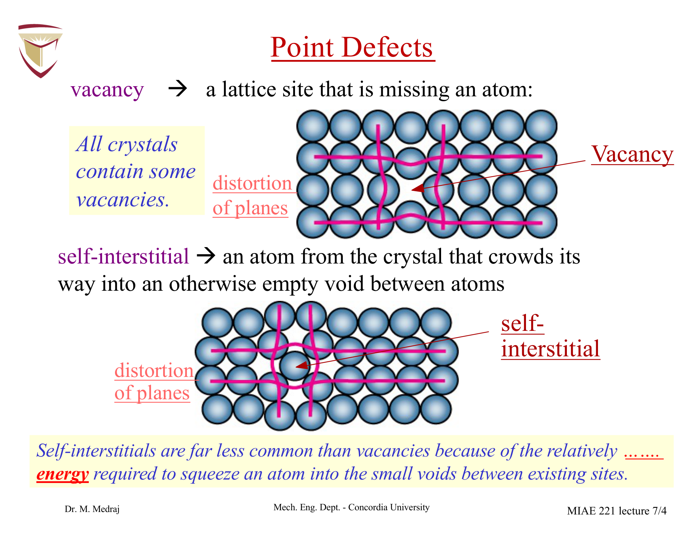
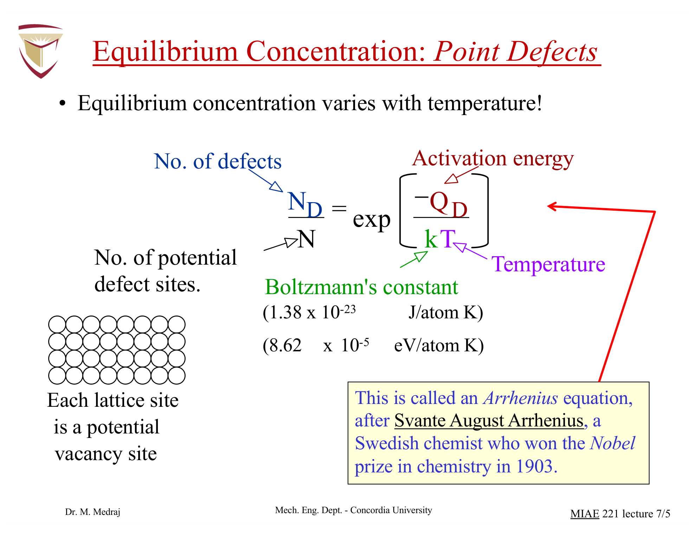
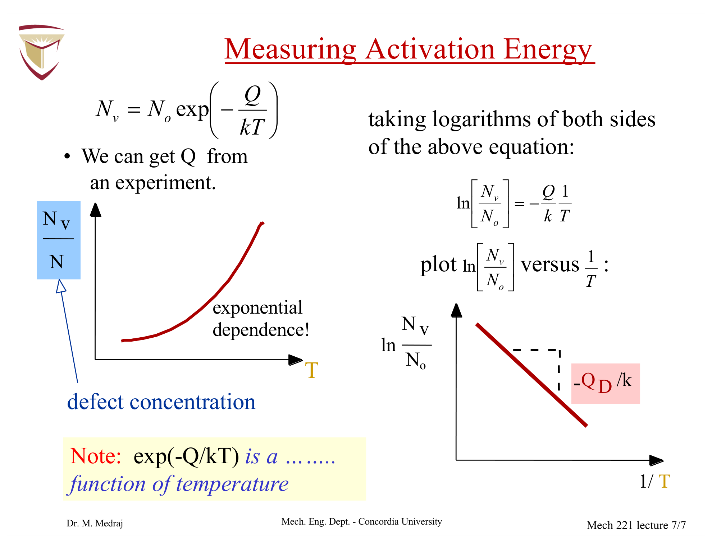
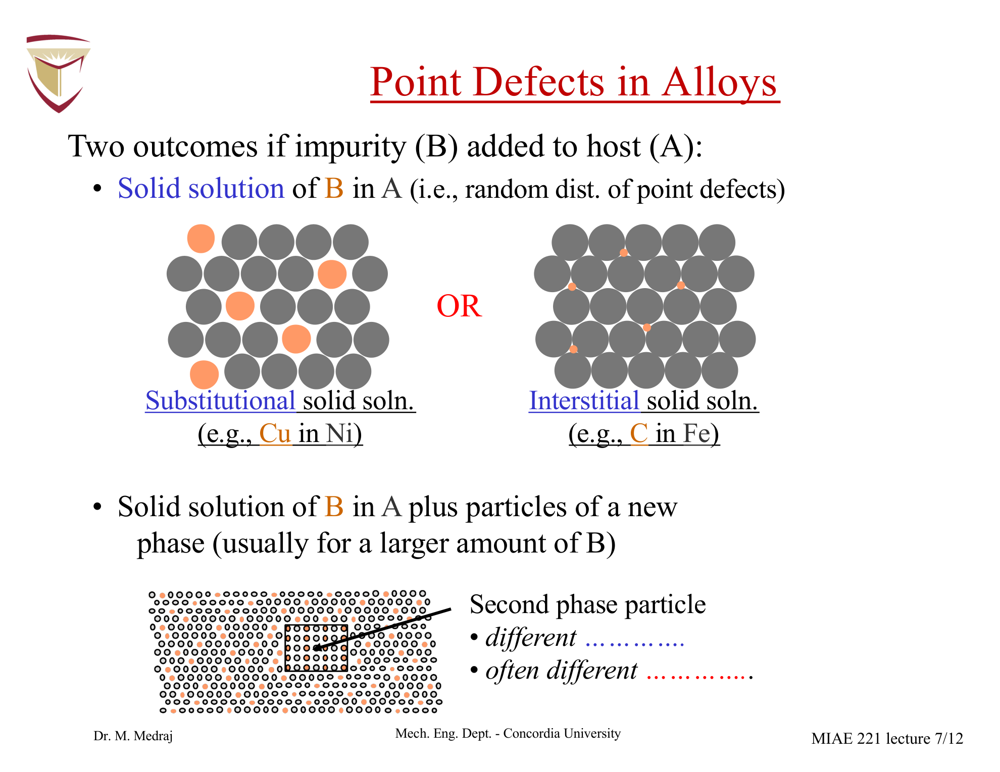
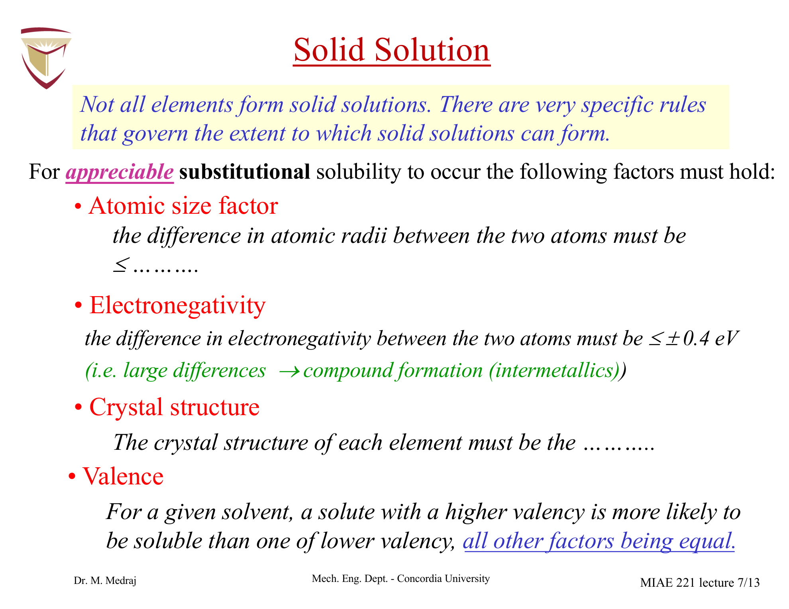
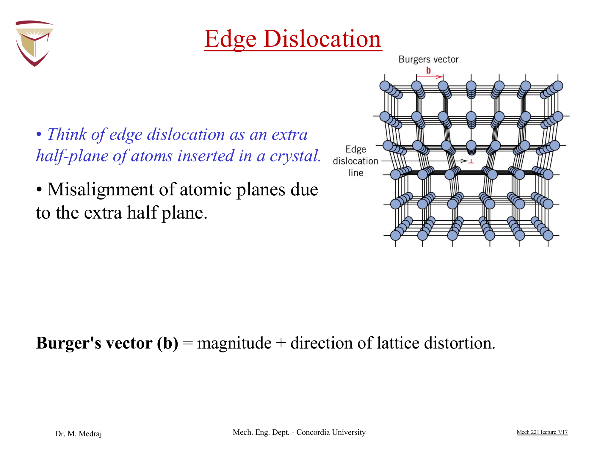
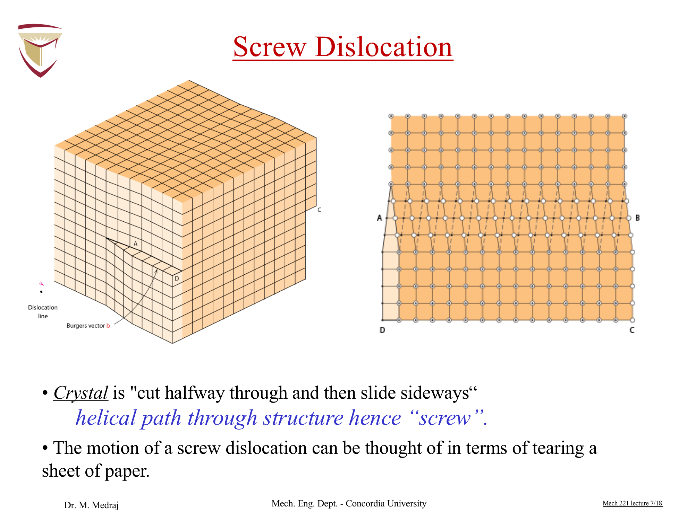
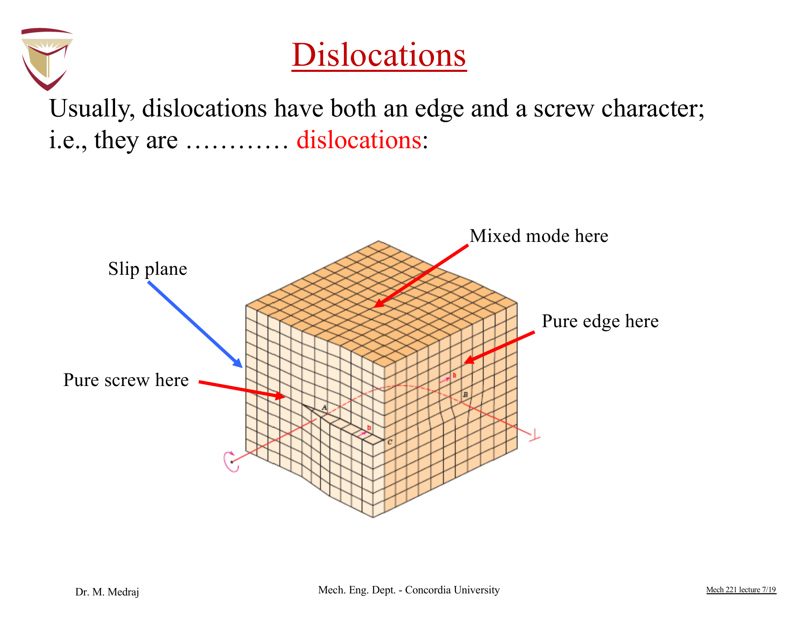

# MIAE 221: Materials Science for Engineers
# Part 5: Imperfections in Solids, Point Defects, Solid Solutions & Dislocations Master Guide

---

## Executive Overview & Core Concepts

A common misconception among early engineering students is that defects in crystals are undesirable flaws. In reality:
> **"Crystals are like people: it is their imperfections that make them interesting and useful."** — Sir Colin Humphreys

Without crystal defects:
* Pure metals would have theoretical shear strengths $1000\times$ higher than observed, but would be hopelessly brittle with zero ductility.
* Modern semiconductors and microprocessors could not function (doping is the intentional introduction of point defects).
* Steel alloys could not be heat-treated, forged, or hardened.

This comprehensive guide covers:
1. **Thermodynamic Imperfection Law**: Why a defect-free crystal cannot exist at temperatures above absolute zero ($T > 0\text{ K}$).
2. **Point Defects**: Vacancies, self-interstitials, activation energy $Q_v$, and Arrhenius equilibrium concentration modeling.
3. **Solid Solutions**: Substitutional vs. interstitial solid solubility, the Hume-Rothery Rules, and composition conversions ($wt\% \leftrightarrow at\%$).
4. **Dislocations (Linear Defects)**: Edge, screw, and mixed dislocations, strain fields, Burgers vector geometry, and the mechanics of plastic deformation.

---

## 1. The Thermodynamics of Crystal Imperfections

### Why Perfect Crystals Cannot Exist
In classical thermodynamics, the equilibrium state of a crystal at constant temperature and pressure is governed by the **Gibbs Free Energy ($G$)**:

$$G = H - TS$$

Where:
* $H$ = Enthalpy (internal bond energy of the crystal).
* $T$ = Absolute temperature ($\text{K}$).
* $S$ = Entropy (degree of spatial disorder / randomness).

When an atom is removed from its lattice site to form a vacancy:
1. **Enthalpy Cost ($\Delta H > 0$)**: Chemical bonds are broken and neighboring bonds are strained, requiring an input of energy ($\Delta H$ increases the free energy).
2. **Entropy Gain ($\Delta S > 0$)**: Introducing missing sites introduces massive configurational entropy, because there are millions of possible arrangements to distribute vacancies among regular lattice sites ($S = k_B \ln \Omega$).
3. **Net Free Energy Change ($\Delta G = \Delta H - T\Delta S$)**:
   * At very low defect concentrations, the $-T\Delta S$ term dominates, causing Gibbs free energy $G$ to **decrease**.
   * Consequently, the crystal spontaneously minimizes its free energy by generating a thermodynamically stable equilibrium concentration of vacancies!

> [!IMPORTANT]
> A completely defect-free crystal is **thermodynamically impossible** at any temperature $T > 0\text{ K}$. Vacancies and impurities must always exist in thermal equilibrium.

---

## 2. Point Defects (0-Dimensional)

Point defects are spatial interruptions in the regular lattice involving one or a few atomic sites:

*Figure 5.1: Point defects in a crystalline lattice (Dr. Medraj MIAE 221 Lecture 7). (a) Vacancy: a vacant lattice site missing an atom, surrounded by inward tensile relaxation strain. (b) Self-interstitial: a host atom crowded into an interstitial void, inducing severe local compressive strain.*

### 1. Vacancy
* **Definition**: A vacant regular lattice site that is unoccupied because an atom is missing.
* **Origin**: Formed during solidification from the melt, or produced by thermal vibrational excitation at elevated temperatures.
* **Lattice Distortion**: Surrounding atoms relax slightly inward toward the void, creating a localized tensile strain field.

### 2. Self-Interstitial
* **Definition**: An atom from the host crystal that crowds itself into an interstitial void (a small space between regular lattice sites that is normally vacant).
* **Lattice Distortion**: Because the interstitial space is substantially smaller than the atomic diameter, inserting a host atom requires pushing adjacent atoms forcefully outward, inducing **severe compressive lattice strain**.
* **Relative Abundance**: Because the formation energy of a self-interstitial is far greater than that of a vacancy ($Q_{\text{interstitial}} \gg Q_v$), the equilibrium concentration of self-interstitials in metals is negligibly small (typically many orders of magnitude below vacancies).

---

## 3. Equilibrium Vacancy Concentration (Arrhenius Equation)

*Figure 5.2: Temperature dependence of the equilibrium vacancy concentration (Dr. Medraj Lecture 7). Vacancy fraction $N_v/N$ increases exponentially with temperature.*

The equilibrium number of vacancies ($N_v$) in a crystal lattice increases exponentially with absolute temperature according to the classic **Arrhenius equation**:

$$\frac{N_v}{N} = \exp\left(-\frac{Q_v}{k_B T}\right)$$

Where:
* $N_v$ = Number of vacant lattice sites per unit volume ($\text{vacancies/m}^3$ or $\text{vacancies/cm}^3$).
* $N$ = Total number of atomic lattice sites per unit volume:
  $$N = \frac{\rho \cdot N_A}{A}$$
  * $\rho$ = Density ($\text{g/cm}^3$)
  * $N_A = 6.022 \times 10^{23} \text{ atoms/mol}$
  * $A$ = Atomic weight ($\text{g/mol}$)
* $Q_v$ = Activation energy required to form one vacancy ($\text{eV/atom}$ or $\text{J/mol}$).
* $k_B$ = Boltzmann's constant:
  $$k_B = 8.62 \times 10^{-5} \text{ eV/atom}\cdot\text{K} \quad \text{or} \quad 1.38 \times 10^{-23} \text{ J/atom}\cdot\text{K}$$
* $T$ = Absolute temperature in Kelvin ($\text{K} = ^\circ\text{C} + 273.15$).

---

### Experimental Measurement of Activation Energy ($Q_v$)

*Figure 5.3: Semilogarithmic Arrhenius plot of $\ln(N_v/N)$ versus $1/T$ (Dr. Medraj Lecture 7). The negative slope yields the vacancy activation energy: $\text{Slope} = -Q_v/k_B$.*

Taking the natural logarithm of both sides of the Arrhenius relation:

$$\ln\left(\frac{N_v}{N}\right) = -\frac{Q_v}{k_B}\left(\frac{1}{T}\right)$$

By plotting $\ln(N_v/N)$ on the vertical axis against reciprocal temperature $\frac{1}{T}$ on the horizontal axis:
1. The resulting curve is a straight line ($y = m x + b$).
2. The slope ($m$) directly provides the vacancy activation energy:
   $$\text{Slope} = -\frac{Q_v}{k_B} \implies Q_v = -k_B \times \text{Slope}$$

---

## 4. Step-by-Step Quantitative Exam Problem

*(Directly adapted from Dr. Medraj MIAE 221 Lecture 7, Slide 8)*

### Problem Statement
Calculate the fraction of atomic lattice sites that are vacant in pure Lead ($\text{Pb}$) at its melting temperature of $327^\circ\text{C}$ ($600\text{ K}$). Assume an activation energy for vacancy formation of $Q_v = 0.55\text{ eV/atom}$.

---

### Step-by-Step Numerical Solution

#### Step 1: Identify Given Variables
* Absolute temperature: $T = 327^\circ\text{C} + 273.15 = 600.15\text{ K} \approx \mathbf{600 \text{ K}}$
* Activation energy: $Q_v = 0.55\text{ eV/atom}$
* Boltzmann constant: $k_B = 8.62 \times 10^{-5} \text{ eV/atom}\cdot\text{K}$

#### Step 2: Calculate the Thermal Energy Exponent ($k_B T$)
$$k_B T = (8.62 \times 10^{-5} \text{ eV/atom}\cdot\text{K})(600 \text{ K}) = 0.05172 \text{ eV/atom}$$

#### Step 3: Compute the Dimensionless Exponent
$$\frac{Q_v}{k_B T} = \frac{0.55\text{ eV}}{0.05172\text{ eV}} \approx 10.6342$$

#### Step 4: Evaluate the Exponential Vacancy Fraction
$$\frac{N_v}{N} = \exp\left(-\frac{Q_v}{k_B T}\right) = \exp(-10.6342) = e^{-10.6342}$$

$$\frac{N_v}{N} = \mathbf{2.41 \times 10^{-4}}$$

---

### Physical Interpretation & Real-World Context
* The fraction $2.41 \times 10^{-4}$ means that at the melting point:
  $$\frac{1}{2.41 \times 10^{-4}} \approx 4150$$
  **Approximately 1 out of every 4,150 lattice sites in lead is vacant!**
* By contrast, at room temperature ($25^\circ\text{C} = 298\text{ K}$):
  $$\frac{Q_v}{k_B T} = \frac{0.55}{(8.62 \times 10^{-5})(298)} = 21.41 \implies \frac{N_v}{N} = e^{-21.41} = \mathbf{5.0 \times 10^{-10}}$$
  At room temperature, only 1 in 2 billion sites is vacant. Heating lead from room temperature to its melting point increases the vacancy concentration by a factor of nearly **$500,000\times$**!

---

## 5. Impurities in Solids & Solid Solutions

Pure metals containing $100\%$ of one element do not exist in engineering practice. Impurities are either unavoidable contaminants from refining, or are intentionally added as alloying elements to produce superior engineering materials.

*Figure 5.4: Impurity point defects in metallic alloys (Dr. Medraj Lecture 7). (a) Substitutional solid solution: solute atoms (blue) substitute on regular solvent lattice sites. (b) Interstitial solid solution: small solute atoms reside within interstitial gaps. (c) Two-phase mixture: high solute concentrations precipitate secondary phase particles.*

### Fundamental Definitions
* **Solvent (Host / Matrix)**: The metallic element present in the greatest abundance.
* **Solute**: The alloying element present in minor concentration that dissolves into the host.
* **Solid Solution**: A single, homogeneous solid phase consisting of two or more elements where the solute atoms are incorporated into the solvent matrix **without altering the solvent's crystal structure or forming a new phase**.

---

### Types of Solid Solutions

1. **Substitutional Solid Solution**:
   * Solute atoms physically substitute for host atoms on regular lattice sites.
   * *Examples*: Brass (Zinc dissolved substitutionally into Copper), Monel (Copper in Nickel), 316 Stainless Steel (Chromium and Nickel in Iron).
2. **Interstitial Solid Solution**:
   * Solute atoms occupy small voids (interstitial sites) between the regular host atoms.
   * Because interstitial voids in metallic lattices are very small, this only occurs when the solute atom has a very small atomic radius ($\text{C, H, N, O, B}$).
   * *Classic Example*: Carbon in Iron (the basis of steel). In BCC $\alpha$-iron, maximum carbon solubility is only $0.022\text{ wt\%}$; in FCC $\gamma$-iron (austenite), larger interstitial voids accommodate up to $2.14\text{ wt\%}$ carbon.

---

## 6. The Hume-Rothery Rules for Substitutional Solubility

To determine whether an alloying element will exhibit high or complete substitutional solubility in a solvent metal, British metallurgist William Hume-Rothery established four empirical criteria:

*Figure 5.5: The Hume-Rothery Rules governing substitutional solid solubility (Dr. Medraj Lecture 7). Size factor, crystal structure match, electronegativity proximity, and valency rules.*

### The 4 Hume-Rothery Criteria

| Rule # | Hume-Rothery Criterion | Quantitative Condition | Physical Mechanism |
| :---: | :--- | :--- | :--- |
| **1** | **Atomic Size Factor** | **$\Delta r = \frac{\|r_{\text{solute}} - r_{\text{solvent}}\|}{r_{\text{solvent}}} \times 100\% < 15\%$** | If radii differ by $>15\%$, severe lattice strain energy makes solid solution thermodynamically unstable. |
| **2** | **Crystal Structure Match** | Both metals must have the **same crystal structure** (e.g., both FCC, or both BCC). | Ensures that the lattice geometry is compatible across the entire binary composition range. |
| **3** | **Electronegativity Proximity** | **$\Delta X = \|X_{\text{solute}} - X_{\text{solvent}}\| \le \pm 0.4$** | If $\Delta X$ is large, elements transfer electrons and form brittle intermetallic chemical compounds (e.g., $Mg_2Pb$) rather than a solid solution. |
| **4** | **Valency Rule** | A metal has higher solubility for an element of **higher valency** than lower valency ($V_{\text{solute}} \ge V_{\text{solvent}}$). | Higher valency solutes increase the electron-to-atom ratio ($e/a$), stabilizing the metallic bonding Fermi energy. |

---

### Classic Case Study: The Cu-Ni Isomorphous System
Copper ($\text{Cu}$) and Nickel ($\text{Ni}$) satisfy all four Hume-Rothery rules perfectly:
1. Atomic Radii: $r_{Cu} = 0.128\text{ nm}$, $r_{Ni} = 0.125\text{ nm} \implies \Delta r = \frac{|0.125 - 0.128|}{0.128} = \mathbf{2.3\%} \ll 15\%$.
2. Crystal Structure: Both $\text{Cu}$ and $\text{Ni}$ are **FCC**.
3. Electronegativity: $X_{Cu} = 1.9$, $X_{Ni} = 1.8 \implies \Delta X = \mathbf{0.1} \le 0.4$.
4. Valency: Both exhibit common valency of $+2$ (or $+1$ for Cu).
* **Result**: Copper and Nickel exhibit **complete liquid and solid miscibility** (100% mutual solubility across all concentrations from pure Cu to pure Ni, forming an isomorphous binary phase diagram).

---

## 7. Composition Conversions: Weight % $\longleftrightarrow$ Atomic %

In manufacturing and casting, alloy compositions are specified in **weight percent (wt%)** because raw metals are weighed on scales. In solid-state physics and crystallography, however, behaviors depend on the count of atoms, requiring **atomic percent (at%)**.

### Definitions
For a two-component binary alloy containing element 1 and element 2:

* **Weight Percent ($C_1$)**:
  $$C_1 = \frac{m_1}{m_1 + m_2} \times 100\%$$

* **Atomic Percent ($C'_1$)**:
  $$C'_1 = \frac{n_{m1}}{n_{m1} + n_{m2}} \times 100\% = \frac{\frac{m_1}{A_1}}{\frac{m_1}{A_1} + \frac{m_2}{A_2}} \times 100\%$$

---

### Conversion Formulas

#### Converting Weight Percent to Atomic Percent ($wt\% \to at\%$):
$$C'_1 = \frac{C_1 A_2}{C_1 A_2 + C_2 A_1} \times 100\% = \frac{\frac{C_1}{A_1}}{\frac{C_1}{A_1} + \frac{C_2}{A_2}} \times 100\%$$

#### Converting Atomic Percent to Weight Percent ($at\% \to wt\%$):
$$C_1 = \frac{C'_1 A_1}{C'_1 A_1 + C'_2 A_2} \times 100\%$$

Where $A_1$ and $A_2$ are the standard atomic weights ($\text{g/mol}$) of elements 1 and 2.

---

## 8. Linear Defects: Dislocations (1-Dimensional)

Dislocations are one-dimensional line defects around which atomic planes are misaligned. They were theoretically postulated in 1934 by Taylor, Orowan, and Polanyi to resolve the paradox between theoretical and actual metal yield strengths, and were directly confirmed by transmission electron microscopy (TEM) in the 1950s.

### Why Are Dislocations Central to Metallurgy?
* To permanently deform a defect-free crystal, millions of atomic bonds across an entire plane would have to be sheared **simultaneously**, requiring theoretical shear stresses of $\tau_{\text{theoretical}} \approx \frac{G}{10} \approx 10 - 40\text{ GPa}$.
* Real metals yield at stresses of only $\tau_{\text{yield}} \approx 10 - 100\text{ MPa}$ ($1000\times$ lower!).
* **The Caterpillar Analogy**: A caterpillar does not move its entire body at once. It forms a small hump (a dislocation) and propagates the hump forward one segment at a time. Dislocations allow atomic planes to slide **one row of atoms at a time**, requiring orders of magnitude less force!

---

### A. The Edge Dislocation

*Figure 5.6: Atomic configuration of an edge dislocation (Dr. Medraj Lecture 7). An extra half-plane of atoms terminates at the dislocation line $\mathbf{t}$. Above the slip plane, atoms experience compressive strain; below the slip plane, atoms experience tensile strain. The Burgers vector $\mathbf{b}$ is strictly perpendicular to the dislocation line ($\mathbf{b} \perp \mathbf{t}$).*

1. **Physical Nature**:
   Formed by inserting an **extra half-plane of atoms** into a portion of the crystal lattice.
2. **Dislocation Line ($\mathbf{t}$)**:
   The edge of the extra half-plane of atoms (denoted by the symbol $\top$ for a positive edge dislocation, or $\bot$ for an inverted negative edge dislocation).
3. **Internal Strain Fields**:
   * **Above the slip plane**: Atoms are squeezed tightly together to accommodate the extra half-plane $\implies$ **Hydrostatic Compressive Stress**.
   * **Below the slip plane**: Atoms are pulled apart $\implies$ **Tensile Stress**.
4. **Burgers Vector Relationship**:
   The **Burgers vector ($\mathbf{b}$)** represents the magnitude and direction of atomic displacement produced by dislocation motion.
   $$\mathbf{b} \perp \mathbf{t} \quad \text{(Burgers vector is strictly PERPENDICULAR to the dislocation line)}$$

---

### B. The Screw Dislocation

*Figure 5.7: Atomic configuration of a screw dislocation (Dr. Medraj Lecture 7). The crystal is sheared halfway through and displaced by one atomic spacing, transforming planar atomic layers into a continuous helical spiral ramp. The Burgers vector $\mathbf{b}$ is strictly parallel to the dislocation line ($\mathbf{b} \parallel \mathbf{t}$).*

1. **Physical Nature**:
   Formed by applying a shear stress that cuts halfway through the crystal and shifts one half relative to the other by one atomic spacing.
2. **Helical Structure**:
   Atomic planes are no longer parallel flat sheets; they form a continuous, single helical spiral ramp (like a spiral staircase or screw thread) winding around the dislocation line.
3. **Strain Field**:
   A screw dislocation produces **pure shear strain** in the surrounding lattice (no hydrostatic compression or tension).
4. **Burgers Vector Relationship**:
   $$\mathbf{b} \parallel \mathbf{t} \quad \text{(Burgers vector is strictly PARALLEL to the dislocation line)}$$

---

### C. Mixed Dislocations

*Figure 5.8: A mixed dislocation transitioning smoothly along a curved line within the slip plane (Dr. Medraj Lecture 7). At the left surface, $\mathbf{b} \perp \mathbf{t}$ (pure edge); at the right surface, $\mathbf{b} \parallel \mathbf{t}$ (pure screw); along the interior curve, it possesses mixed edge-screw character.*

In real engineering metals, dislocations rarely exist as straight, isolated lines. Instead, they form curved loops:
* The **Burgers vector $\mathbf{b}$ is invariant**: it is identical in magnitude and direction everywhere along the entire dislocation line.
* However, because the dislocation line $\mathbf{t}$ curves:
  * Where $\mathbf{t}$ is perpendicular to $\mathbf{b}$ $\implies$ **Pure Edge Character**.
  * Where $\mathbf{t}$ is parallel to $\mathbf{b}$ $\implies$ **Pure Screw Character**.
  * Everywhere in between $\implies$ **Mixed Dislocation Character** (having both edge and screw components).

---

## 9. Comprehensive Synthesis & Exam Traps Matrix

| Dislocation Type | Dislocation Line vs. Burgers Vector | Type of Lattice Strain Field | Motion Direction Relative to Applied Shear Stress |
| :--- | :---: | :--- | :--- |
| **Edge Dislocation ($\top$)** | **$\mathbf{b} \perp \mathbf{t}$** (Perpendicular) | Compressive (top) + Tensile (bottom) | **Parallel** to shear stress direction |
| **Screw Dislocation** | **$\mathbf{b} \parallel \mathbf{t}$** (Parallel) | Pure Shear strain | **Perpendicular** to shear stress direction |
| **Mixed Dislocation** | Angle $\theta \neq 0^\circ, 90^\circ$ | Combined Compressive, Tensile & Shear | Intermediate angle |

---

### High-Yield Exam Traps

1. **Burgers Vector Direction**:
   * *Trap*: Believing Burgers vector changes direction along a curved dislocation loop.
   * *Fact*: **$\mathbf{b}$ is constant and uniform along the entire length of any dislocation loop**. What changes is the angle between the dislocation line tangent and $\mathbf{b}$.
2. **Equilibrium Vacancy vs. Temperature**:
   * *Trap*: Assuming vacancies are manufacturing mistakes that can be eliminated by slow cooling or annealing.
   * *Fact*: Vacancies are thermodynamically required. Annealing reduces non-equilibrium vacancies to the baseline equilibrium Arrhenius concentration, but never zero.
3. **Hume-Rothery Size Rule**:
   * *Trap*: Calculating size difference as $\frac{r_1 - r_2}{r_{\text{solute}}}$.
   * *Fact*: Always divide by the **solvent (host)** radius: $\Delta r = \frac{|r_{\text{solute}} - r_{\text{solvent}}|}{r_{\text{solvent}}} \times 100\%$.
