# MIAE 221: Materials Science for Engineers
# Part 5B: Grain Boundaries, Stacking Faults, Volume Defects & Microscopy Master Guide
**Concordia University · Gina Cody School of Engineering** · Based on Dr. M. Medraj, Lecture 8 (*Defects 2*) · Callister, Chapter 4 (Sections 4.6–4.11)

---

## Executive Overview & Core Concepts

Part 5 (Lecture 7) covered defects with **zero dimensions** (vacancies, interstitials, impurity atoms) and **one dimension** (edge, screw and mixed dislocations). Lecture 8 completes the classification of crystal imperfections with the larger-scale defects, and then answers a practical question: **how do engineers actually see these features?**

| Dimensionality | Defect family | Typical size | Covered in |
| :---: | :--- | :--- | :--- |
| 0-D | Vacancies, self-interstitials, impurity atoms | ~1 atom | Part 5 (Lecture 7) |
| 1-D | Dislocations (edge, screw, mixed) | Lines, nm wide | Part 5 (Lecture 7) |
| **2-D (interfacial)** | **Grain boundaries, low/high-angle boundaries, stacking faults** | Planes, ~1 atom thick | **This guide (Lecture 8)** |
| **3-D (volumetric)** | **Inclusions, precipitates, pores/voids, cracks** | nm to mm | **This guide (Lecture 8)** |

**Lecture 8 outline (slide 1):**
1. Crystallization and polycrystalline materials
2. Grain boundaries (high-angle and low-angle; tilt and twist)
3. Grain size determination
4. Stacking faults
5. Volumetric defects
6. Types of microscopes: optical (LOM), scanning electron (SEM), transmission electron (TEM), scanning probe (SPM)

### Fill-in-the-blank answers for the student slides

The student version of the slides has blanks. The answers below follow the slide context and Callister Chapter 4. Confirm any value your instructor states differently in class.

| Slide | Blank | Answer |
| :---: | :--- | :--- |
| 2 | "junction of grains are ………" | **grain boundaries** |
| 5 | "……… is when the grains can only be observed with a microscope" | **Microstructure** (as opposed to *macrostructure*, visible to the naked eye) |
| 6 | "the microstructure is revealed by attack using ………" | **etching** (etchants: chemical reagents) |
| 10 | "scanning electron microscope (…)" / "transmission electron microscope (…)" | **SEM** / **TEM** |
| 12 | Clicker question (optical microscopy) | **C** — etching attacks grain boundaries preferentially, so they scatter light and create contrast |
| 19 | "TEMs and SEMs were ……… technology initially" | **analog** (images recorded directly on photographic film) |
| 20 | Human-eye resolution "……… Å" | **≈ 750 000–1 000 000 Å** (about 0.1 mm) |
| 20 | SPM resolution "… Å, atomic" | **≈ 1 Å or better** (about 0.1 Å vertically) |
| 21 | Clicker question (electron microscopy) | **A** — the SEM has a much larger depth of field |

---

## 1. Crystallization: How Polycrystalline Materials Form (Slide 2)

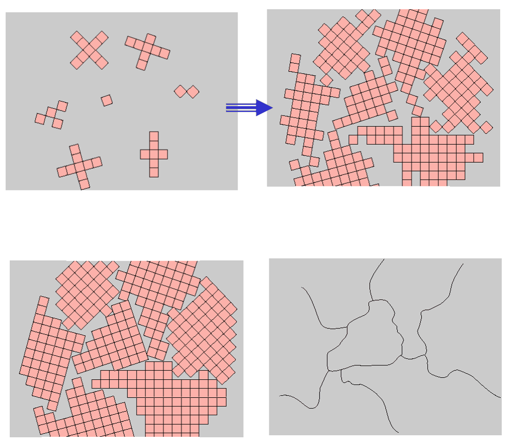
*Figure 1: Stages of solidification of a polycrystalline material (Lecture 8, slide 2). The small squares represent unit cells.*

**What the figure shows, panel by panel:**
1. **Top left — nucleation.** Small crystallites (nuclei) form at random places in the liquid (grey). Each nucleus has its own **random crystallographic orientation**, which is why the little grids are rotated differently.
2. **Top right — growth.** Atoms from the liquid attach to the nuclei, so each crystal grows outward while keeping its own orientation.
3. **Bottom left — impingement.** Near the end of solidification the growing crystals run into each other. Where two crystals meet, their lattices do not line up.
4. **Bottom right — final microstructure.** All the liquid is gone. Each former crystal is now a **grain**, and the lines where grains meet are **grain boundaries**. This is exactly what you see under a microscope after polishing and etching.

**Key definitions:**
* **Single crystal**: the periodic atomic arrangement extends through the entire specimen without interruption (turbine blades for jet engines, silicon wafers).
* **Polycrystalline material**: made of many small crystals (grains) with different orientations. **Most engineering metals and ceramics are polycrystalline.**
* **Grain**: one individual crystal inside a polycrystalline solid.

**Why it matters.** The number of nuclei controls the final grain size. Many nuclei (fast cooling, added inoculants) give **many small grains**; few nuclei (slow cooling) give **few large grains**. Grain size strongly controls strength (Section 4).

---

## 2. Grain Boundaries (Slides 3–4)

### 2.1 What a grain boundary is

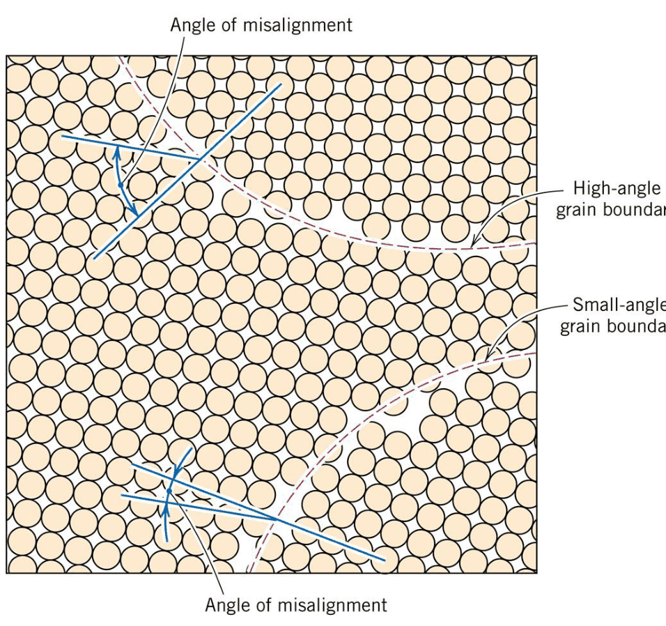
*Figure 2: High-angle and small-angle grain boundaries and the adjacent atom positions (Lecture 8, slide 3).*

**What the figure shows.** Each circle is an atom. Inside each grain the atoms sit in a perfect, regular pattern, but the pattern is **rotated** from one grain to the next. The blue lines measure the **angle of misalignment** between neighbouring lattices:
* where the misorientation is large (top), the boundary is a **high-angle grain boundary**;
* where it is only a few degrees (bottom), the boundary is a **small-angle (low-angle) grain boundary**.

Along the boundary (pink region) atoms cannot satisfy both neighbouring lattices at once. They are **less bonded**, the **atomic packing is lower** and each atom has fewer nearest neighbours (**lower coordination**) than inside the grain.

### 2.2 Grain boundary energy

Because boundary atoms have broken or strained bonds, they sit at a higher energy than interior atoms. This excess is the **interfacial (grain boundary) energy**, usually given per unit area (J/m²). It is largest for high-angle boundaries. The consequences, listed on slide 4:

| Consequence | Physical reason | Engineering example |
| :--- | :--- | :--- |
| Grain boundaries are **more chemically reactive** | Higher-energy atoms leave the surface more easily | Etching reveals grain boundaries; intergranular corrosion in stainless steels |
| **Impurities segregate** to grain boundaries | Odd-sized impurity atoms fit more easily into the disordered boundary, lowering its energy | Temper embrittlement of steels (P, Sb, Sn at boundaries) |
| **Coarse-grained** material has **less total boundary area** than fine-grained | Bigger grains → fewer boundaries per volume | Fine grains: stronger but more boundary diffusion; coarse grains: better high-temperature creep resistance |
| Grains **grow** at high temperature | The system lowers its total energy by reducing boundary area | Grain growth during annealing; uncontrolled growth weakens the metal |
| Boundaries are **fast diffusion paths** | Looser packing lets atoms move easily | Grain-boundary diffusion is much faster than lattice diffusion (next topic) |

### 2.3 Low-angle boundaries as arrays of dislocations

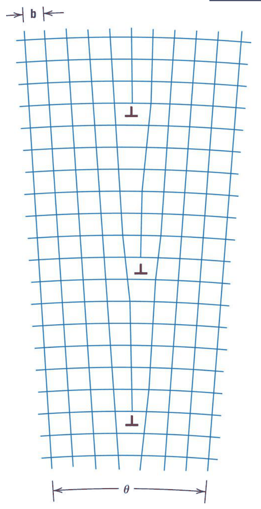
*Figure 3: A small-angle tilt boundary built from a vertical wall of edge dislocations (⊥ symbols), with spacing $D$ and Burgers vector $b$ (Lecture 8, slide 4).*

**What the figure shows.** Each **⊥** is an edge dislocation (an extra half-plane of atoms ending at that point). Stacking several of them one above the other, a distance $D$ apart, makes the lattice planes on the left and right **tilt** by a small angle $\theta$. So a low-angle boundary is not a new type of defect; it is simply **an ordered wall of dislocations** (Part 5).

* **Tilt boundary**: the wall is made of **edge** dislocations; the misorientation axis lies in the boundary plane.
* **Twist boundary**: the wall is made of **screw** dislocations; the misorientation axis is perpendicular to the boundary plane.

**The geometry (Frank / Read–Shockley relation).** Each dislocation adds one extra half-plane, i.e. a step of length $b$ every distance $D$. For small angles:
$$\theta \approx \tan\theta = \frac{b}{D} \qquad (\theta \text{ in radians})$$

**Worked example.** In aluminium (FCC, $a = 0.405\text{ nm}$), $b = \dfrac{a}{\sqrt{2}} = \dfrac{0.405}{1.414} = 0.286\text{ nm}$. For a $1°$ tilt boundary:
$$\theta = 1° = 0.01745\text{ rad} \implies D = \frac{b}{\theta} = \frac{0.286\text{ nm}}{0.01745} \approx 16.4\text{ nm}$$
A $1°$ boundary is therefore a wall of edge dislocations spaced about 16 nm (≈ 57 atomic spacings) apart. As $\theta$ grows, $D$ shrinks; above roughly $10°$–$15°$ the dislocation cores overlap and the boundary becomes a **high-angle** boundary that can no longer be described as separate dislocations.

---

## 3. Observing Grain Structure (Slides 5–6)

### 3.1 Macrostructure: grains seen with the naked eye

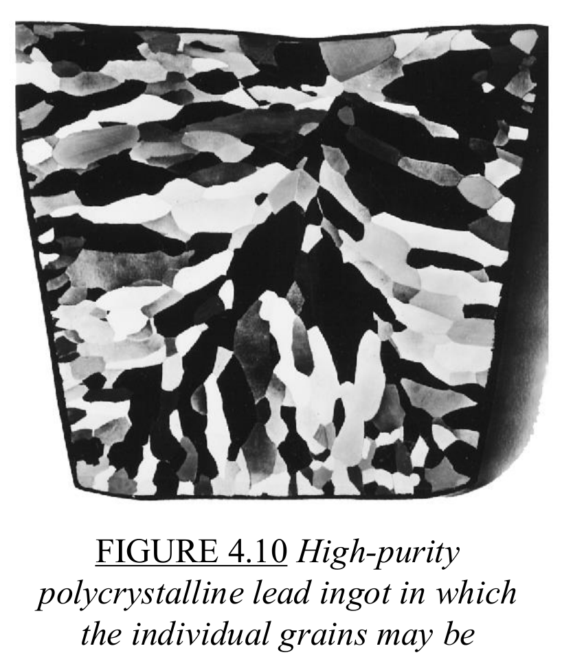
*Figure 4: High-purity polycrystalline lead ingot in which the individual grains may be discerned (Lecture 8, slide 5; Callister Fig. 4.10).*

**What the figure shows.** This lead ingot has been etched, and each light or dark patch is **one grain**. The patches reflect light differently because each grain has a different crystal orientation, so the etchant attacks each surface at a different rate and leaves facets angled differently. The long grains growing inward from the mould walls are **columnar grains**; they grew fastest along the direction of heat flow.

* **Macrostructure**: grains large enough to see with the **naked eye** (e.g. aluminium street-light posts, zinc-galvanized garbage cans, this lead ingot).
* **Microstructure**: grains so small that they can only be seen with a **microscope**. Most structural metals have grains of a few to a few hundred micrometres.
* A microscope image recorded with a camera is a **photomicrograph**.

### 3.2 Sample preparation for optical microscopy

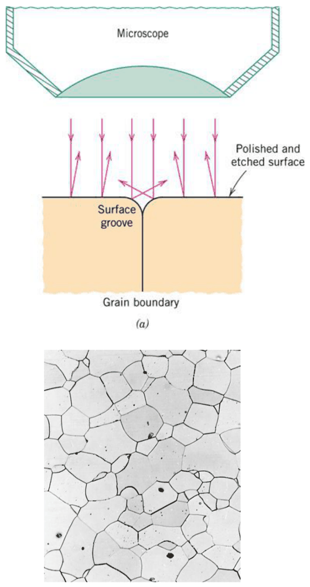
*Figure 5: (Top) Light reflected from a polished and etched surface near a grain boundary groove. (Bottom) The resulting photomicrograph of a polycrystalline metal (Lecture 8, slide 6).*

**Steps:**
1. **Grinding** with progressively finer abrasive papers to make the surface flat.
2. **Polishing** with fine diamond or alumina pastes to a mirror finish. At this point the surface looks **uniform and featureless**: every grain reflects light straight back.
3. **Etching** with a chemical reagent (etchant). The etchant attacks the higher-energy grain boundaries faster than the grain interiors, cutting small **grooves** along every boundary.

**What the figure shows.** Light comes straight down from the microscope objective. On flat grain interiors it reflects straight back up into the lens, so grains look **bright**. At a grain-boundary groove, the sloped walls reflect light **sideways**, away from the objective, so boundaries look like **dark lines**. That difference is the **optical contrast** that makes the network of grain boundaries in the bottom photomicrograph visible.

> **Clicker question (slide 12).** A polished sample looks like a uniform mirror; after etching the grains appear. Why?  
> **Answer: C.** Etching attacks grain boundaries preferentially, so the surface is no longer uniform and these features scatter the incident light differently, creating contrast.  
> *Why not the others:* etching does not change magnification (A); it does not dye grains (B); and the sample was polycrystalline all along (D), the grains were just invisible on a perfectly flat surface.

---

## 4. Grain Size Determination (Outline Topic; Callister Section 4.11)

The outline lists grain size determination, but the slides do not include a worked page, so this section follows Callister. Grain size matters because **smaller grains make a metal stronger and tougher** (more boundaries block dislocation motion — the Hall–Petch effect in Part 7).

### 4.1 ASTM grain size number $G$ (counting method)

ASTM defines the grain size number $G$ (older Callister editions write it as $n$) from the number of grains $N$ per square inch on a photomicrograph taken at **100× magnification**:
$$N = 2^{G - 1} \qquad \Longleftrightarrow \qquad G = 1 + \frac{\ln N}{\ln 2}$$

A **larger $G$ means smaller grains** (more grains per square inch).

For a photomicrograph taken at a magnification $M$ other than 100×, first convert to the 100× count:
$$N_M\left(\frac{M}{100}\right)^2 = 2^{G - 1}$$

**Example A.** At 100×, 45 grains are counted per square inch:
$$G = 1 + \frac{\ln 45}{\ln 2} = 1 + \frac{3.807}{0.693} = 1 + 5.49 = 6.49$$

**Example B.** At 250×, 24 grains are counted per square inch. Equivalent count at 100×:
$$N = 24\left(\frac{250}{100}\right)^2 = 24 \times 6.25 = 150 \implies G = 1 + \frac{\ln 150}{\ln 2} = 1 + \frac{5.011}{0.693} = 8.23$$

### 4.2 Intercept method

Straight test lines are drawn across the photomicrograph and the number of grain-boundary intersections $P$ is counted. With total line length $L_T$ (measured on the photo) and magnification $M$, the **mean intercept length** (average grain diameter along a line) is
$$\bar{\ell} = \frac{L_T}{P\,M}$$
and Callister (10th ed.) relates it to the ASTM number ($\bar{\ell}$ in millimetres):
$$G = -6.6457\log_{10}\bar{\ell} - 3.298$$

**Example C.** Lines totalling 500 mm are drawn on a 100× photomicrograph and cross 50 grain boundaries:
$$\bar{\ell} = \frac{500\text{ mm}}{50 \times 100} = 0.100\text{ mm} \implies G = -6.6457\log_{10}(0.100) - 3.298 = 6.6457 - 3.298 = 3.35$$

---

## 5. Stacking Faults (Slides 7–8)

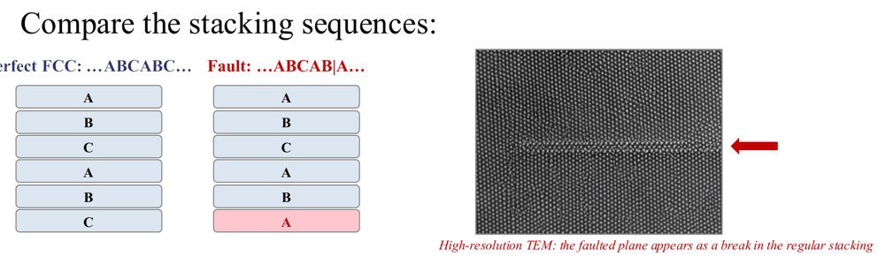
*Figure 6: Perfect FCC stacking (…ABCABC…) versus a faulted sequence (…ABCAB|A…), and a high-resolution TEM image where the faulted plane appears as a break in the regular stacking (Lecture 8, slide 7).*

### 5.1 What a stacking fault is

Recall from Part 3: both FCC and HCP are built by stacking **close-packed planes** of atoms. The only difference is the order:
* **FCC**: $\ldots ABC\,ABC\,ABC \ldots$ (every fourth plane repeats the first)
* **HCP**: $\ldots AB\,AB\,AB \ldots$ (every third plane repeats the first)

A **stacking fault** is a **planar (2-D) defect**: a mistake in the stacking order. In the figure, the perfect sequence $\ldots ABCABC\ldots$ becomes $\ldots ABCAB|A\ldots$ — the plane that should have been **C** (red) is missing.

**What the figure shows.** Each box is one close-packed plane, labelled by its stacking position. Left column: perfect FCC. Right column: one C plane is missing, so the sequence reads **…A B | A…**. Around the fault the local order is **ABA**, which is the **HCP stacking rule**. So a stacking fault is effectively a **thin slab of HCP inside an FCC crystal**. On the right, the high-resolution TEM image shows the faulted plane as a line (red arrow) where the regular pattern of atomic columns is interrupted.

Key points from the slide:
* The **atoms are still in proper close-packed positions**; only the **order of the planes** is wrong. Every atom still has 12 nearest neighbours.
* Because the mistake is small, its **energy is low**, so stacking faults are **common**.
* They form during **solidification** and during **plastic deformation**, and they affect **how easily a metal deforms**.

**Types:** removing a plane (as in the slide) gives an **intrinsic** stacking fault; inserting an extra plane gives an **extrinsic** stacking fault. A **twin boundary** (Callister Section 4.6) is a closely related planar defect where the stacking order reverses, $\ldots ABCABC|BACBA\ldots$, so the two sides are mirror images.

### 5.2 Stacking fault energy (SFE) and why it matters

The energy per unit area of the fault is the **stacking fault energy**. It decides how dislocations behave in FCC metals:

| SFE | Typical metals (approximate values) | Dislocation behaviour | Mechanical consequence |
| :--- | :--- | :--- | :--- |
| **High** | Aluminium (≈ 150–200 mJ/m²) | Dislocations stay compact and **cross-slip** easily | Lower work-hardening rate; recovers readily |
| **Medium** | Copper (≈ 45–80 mJ/m²) | Intermediate | Moderate work hardening |
| **Low** | Austenitic stainless steel (≈ 20 mJ/m²), brass | Dislocations split into **partial dislocations** separated by a wide ribbon of stacking fault; cross-slip is hard | **High work hardening**, deformation twinning; very formable |

### 5.3 A stacking fault seen at the atomic scale

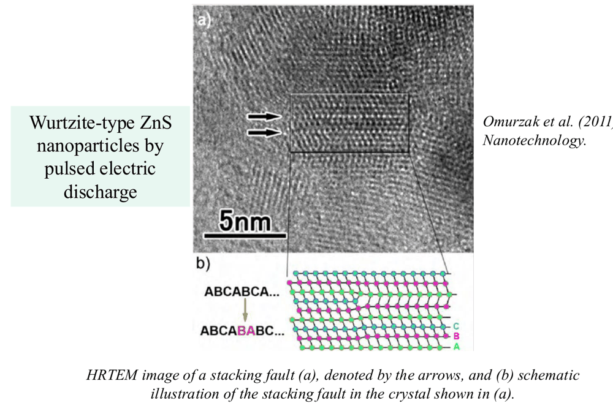
*Figure 7: (a) HRTEM image of a stacking fault (arrows) in wurtzite-type ZnS nanoparticles; (b) schematic of the stacking sequence ABCABCA… vs. ABCABABC… (Lecture 8, slide 8; Omurzak et al., Nanotechnology, 2011).*

**What the figure shows.** In (a), each bright dot row is a column of atoms seen end-on; the 5 nm scale bar shows we are looking at individual atomic planes. The arrows mark where the pattern **shifts**. Panel (b) translates that image into letters: in the lower sequence, after **…ABCAB** the next plane is **A** instead of **C** (red letters), giving a local **ABA** (hexagonal) arrangement inside the cubic **ABC** stacking. This is the real-world version of the boxes in Figure 6.

---

## 6. Three-Dimensional (Volumetric) Defects (Slide 9)

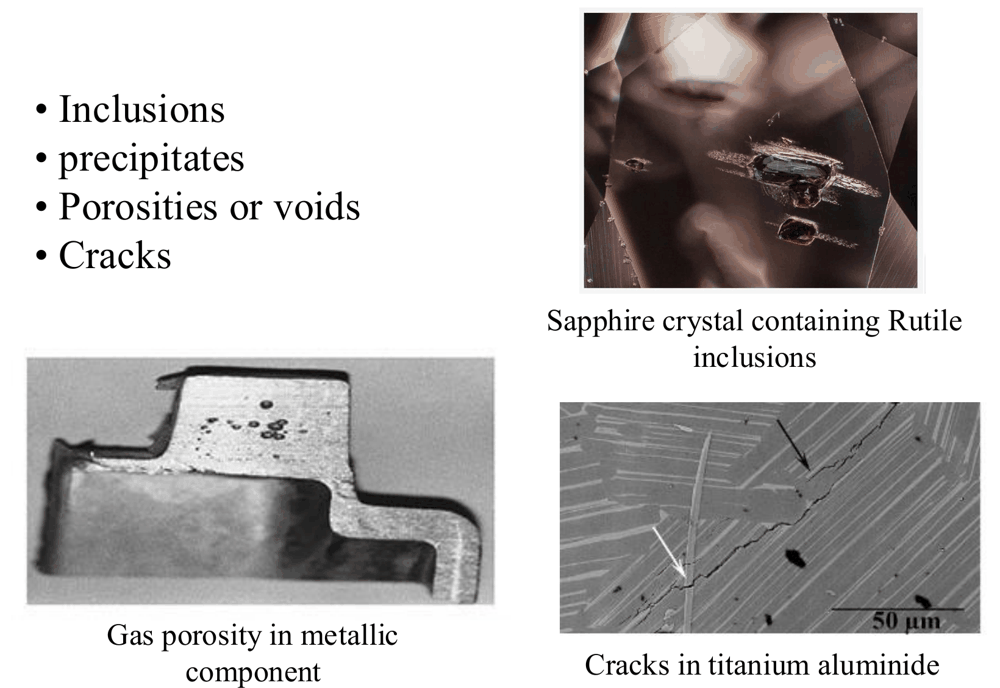
*Figure 8: Volumetric defects — rutile inclusions in a sapphire crystal (top right), gas porosity in a metallic component (bottom left) and cracks in titanium aluminide (bottom right) (Lecture 8, slide 9).*

Volume defects are much larger than atoms, from nanometres to millimetres:

| Defect | What it is | Where it comes from | Effect on properties |
| :--- | :--- | :--- | :--- |
| **Inclusions** | Foreign particles trapped in the material (oxides, sulfides, slag) | Impurities in the melt, reaction with air or the mould | Act as stress concentrators and crack initiation sites; lower toughness and fatigue life |
| **Precipitates** | Small particles of a **second phase** that form inside the grains | Controlled heat treatment (precipitation hardening) | Usually **beneficial**: they block dislocations and strengthen alloys (e.g. Al 2024, 7075) |
| **Pores / voids** | Empty cavities | Gas released during solidification, shrinkage, incomplete sintering of powders | Reduce load-bearing area, density and strength; seal/leak problems in castings |
| **Cracks** | Sharp separations in the material | Thermal stresses, machining, fatigue, brittle behaviour | Most dangerous: the sharp tip concentrates stress (fracture mechanics, later chapters) |

**What the figure shows.** In the sapphire (top right), the dark needle-shaped features are **rutile (TiO₂) inclusions** — a second material trapped inside the crystal. The cast metal part (bottom left) shows small dark holes on its machined face: **gas porosity**. The titanium aluminide micrograph (bottom right, 50 µm scale bar) shows thin dark lines running across the lamellar structure: **cracks** (arrows).

> **Key distinction:** inclusions are usually **unwanted** contaminants, while precipitates are usually **engineered** on purpose to strengthen the alloy, even though both are "particles inside the matrix".

---

## 7. Types of Microscopy (Slides 10–11)

### 7.1 Why electrons instead of light?

The smallest detail a microscope can resolve is limited by the **wavelength** $\lambda$ of what it uses to form the image. A common estimate (Abbe limit) is
$$d \approx \frac{0.61\,\lambda}{\text{NA}}$$
where NA is the numerical aperture of the lens (at most about 1.4).

| | Visible light | Electrons (100–200 kV) |
| :--- | :--- | :--- |
| Wavelength | $\lambda \approx 500\text{ nm}$ | $\lambda \approx 0.003\text{ nm}$ |
| Best resolution | ≈ 0.2–0.3 µm (2000–3000 Å) | atomic scale |
| Useful magnification | up to ≈ **2000×** | up to ≈ **1 000 000×** |

With $\lambda = 500\text{ nm}$ and NA ≈ 1, $d \approx 0.3\ \mu\text{m} = 3000\text{ Å}$, which matches the optical value in the slide 20 table. Electrons accelerated through high voltage have wavelengths about **100 000 times shorter**, which is why electron microscopes can reveal features down to individual atomic columns.

**Optical microscope (light optical microscope, LOM/OLM).** Slide 11 shows instruments from the 1670s (Leeuwenhoek-type), the 1930s (Zeiss laboratory microscope) and a modern Olympus research microscope with camera ports. Metallurgical versions work in **reflection** because metals are opaque. Limitations: about **2000×** maximum and a **shallow depth of field**.

### 7.2 Scanning Electron Microscope (SEM) — Slides 13–14

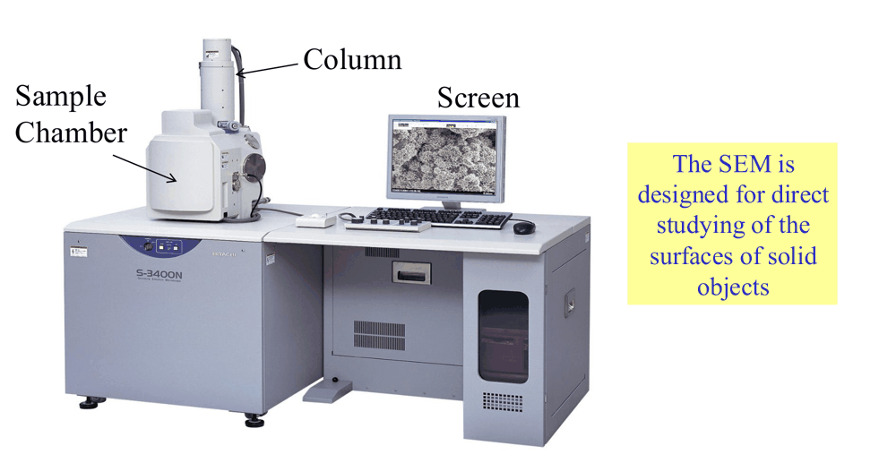
*Figure 9: A scanning electron microscope: electron column, sample chamber and display screen (Lecture 8, slide 13).*

**What the figure shows.** The tall **column** contains the electron gun and magnetic lenses that focus electrons into a fine beam. The beam is **scanned** across the specimen in the **sample chamber** (under vacuum), and detectors collect the electrons that come back. The computer builds the image point by point on the **screen**. The SEM is designed for studying the **surfaces** of solid objects.

* **Signals:** *secondary electrons* (low-energy, from the top few nm) show **surface topography**; *backscattered electrons* show **atomic-number (composition) contrast**; emitted X-rays analysed by **EDS** give the **chemical composition** of a spot.
* **Sample preparation** is similar to optical microscopy (or none at all for fracture surfaces). Non-conductive samples are coated with a thin conductive layer (gold or carbon) to prevent charging.
* SEM is the standard tool for **fractography** (studying fracture surfaces).

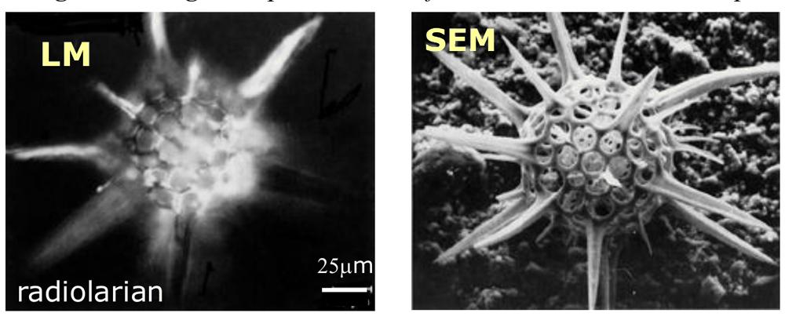
*Figure 10: The same radiolarian (a microscopic marine organism, 25 µm scale) imaged by a light microscope (left) and an SEM (right) (Lecture 8, slide 14).*

**What the figure shows.** In the light-microscope image only a thin slice of the spiky skeleton is sharp; everything above or below is a blur. In the SEM image the **whole three-dimensional object** is in focus at once. This is the SEM's **large depth of field**: the beam is very narrow (small convergence angle), so it stays focused over a large height range.

**Advantages of SEM over LM (slide 14):**
1. **Large depth of field** — rough, 3-D surfaces are entirely in focus.
2. **High resolution** — fine features can be examined at high magnification.
3. The combination of **higher magnification, larger depth of field and greater resolution** makes the SEM one of the most heavily used instruments in research and industry, especially the **semiconductor industry**.

> **Clicker question (slide 21).** A fracture surface is very rough. Why does the SEM give a clear image of it while the optical microscope shows only part in focus?  
> **Answer: A.** The SEM has a much larger depth of field.  
> *Why not the others:* higher magnification (B) would make the focus problem worse, not better; SEM images are greyscale (C); fracture surfaces are examined unetched (D).

### 7.3 Transmission Electron Microscope (TEM) — Slides 15–16

> **Terminology note:** slides 15–16 are titled "Transition Electron Microscope". The correct name is **Transmission** Electron Microscope — the electrons are *transmitted through* the sample.

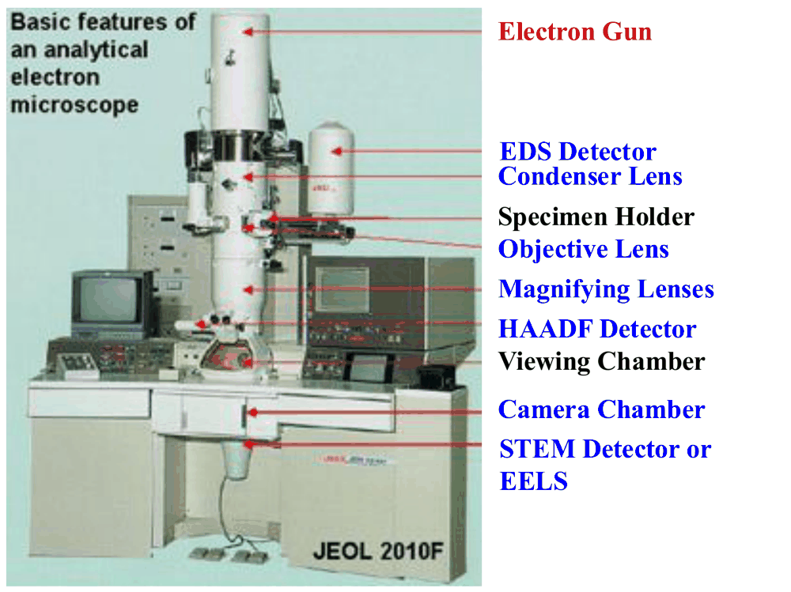
*Figure 11: Basic features of an analytical transmission electron microscope (JEOL 2010F) (Lecture 8, slide 15).*

**What the figure shows, top to bottom:** the **electron gun** produces the beam; **condenser lenses** focus it onto the sample in the **specimen holder**; the **objective lens** forms the first image from electrons that pass **through** the sample; **magnifying (projector) lenses** enlarge it onto the **viewing chamber** screen or the **camera chamber**. Analytical attachments: the **EDS detector** (X-ray chemical analysis), the **HAADF** and **STEM** detectors (scanning-transmission imaging with atomic-number contrast) and **EELS** (electron energy-loss spectroscopy).

**Key requirements:**
* Samples must be **very thin** (typically < 100 nm) so electrons can pass through — they must be **electron transparent**. Preparation (ion milling, electropolishing, focused ion beam) is slow and delicate.
* Samples are therefore **very small**, so TEM looks at tiny volumes.
* Resolution reaches **2–5 Å, near atomic**; modern aberration-corrected TEMs resolve individual atomic columns.

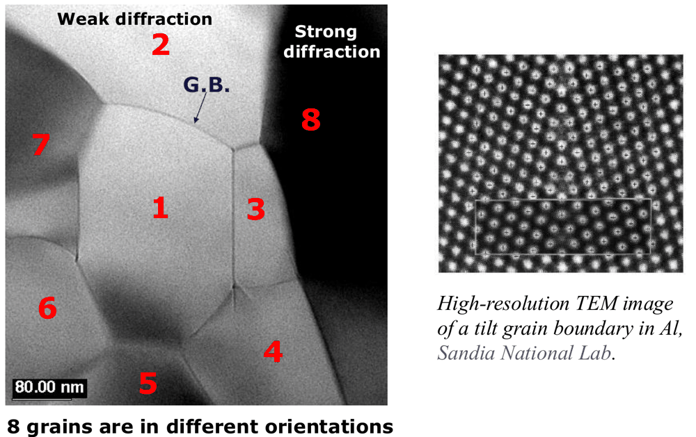
*Figure 12: (Left) Bright-field TEM image of eight grains in different orientations; (right) high-resolution TEM image of a tilt grain boundary in aluminium (Lecture 8, slide 16; Sandia National Laboratories).*

**What the figure shows.**
* **Left:** eight grains (numbered 1–8, 80 nm scale bar) appear in different shades of grey. This is **diffraction contrast**: a grain whose planes are oriented to **strongly diffract** the beam (e.g. grain 8) sends electrons away from the objective aperture and looks **dark**; a **weakly diffracting** grain (e.g. grain 2) looks **bright**. The thin lines between them (e.g. "G.B.") are grain boundaries.
* **Right:** at much higher magnification each bright dot is an **atomic column**. The pattern changes direction across the boundary — the atomic-scale view of the **tilt grain boundary** described in Section 2.3.

### 7.4 Scanning Probe Microscope (SPM) — Slides 17–18

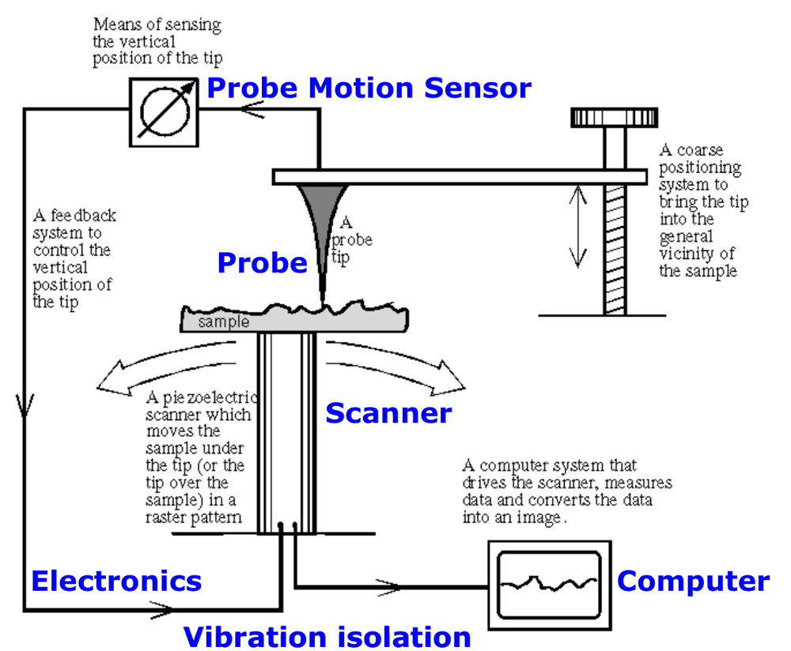
*Figure 13: Main components of a scanning probe microscope (Lecture 8, slide 17).*

**What the figure shows.** An SPM does not use lenses at all. A **probe** with an extremely sharp tip is brought almost into contact with the sample. A **piezoelectric scanner** moves the sample (or tip) in a raster pattern. The **probe motion sensor** detects the tip's vertical position; a **feedback loop** in the **electronics** adjusts the height to keep the tip–surface interaction constant. The **computer** records the height at every point and **constructs a 3-D map** of the surface. **Vibration isolation** is essential because the measured movements are fractions of a nanometre.

Common types: the **scanning tunnelling microscope (STM, 1981)** measures a tunnelling current (needs a conductive sample); the **atomic force microscope (AFM, 1986)** measures the force on a tiny cantilever and works on any material.

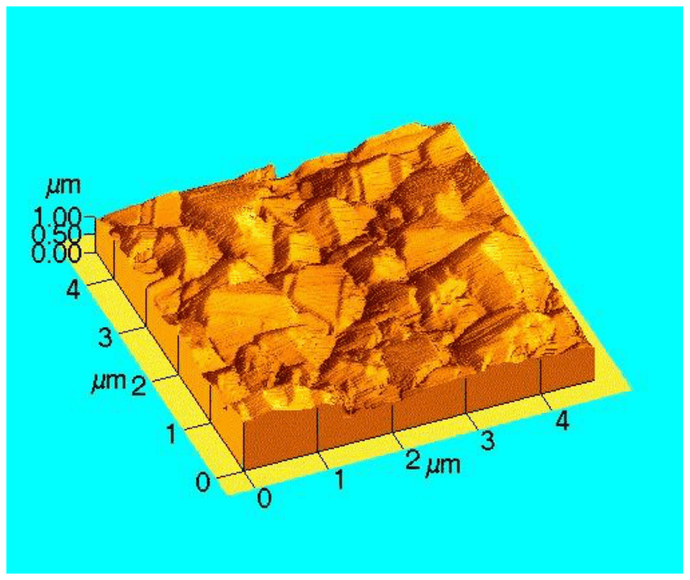
*Figure 14: Three-dimensional SPM topography map of a surface (axes in µm) (Lecture 8, slide 18).*

**What the figure shows.** A surface roughly 4 µm × 4 µm, with height exaggerated on the vertical axis. Each colour level is a height, so the SPM gives true **quantitative 3-D topography** — something optical and electron images (which are 2-D projections) cannot directly provide. SPMs study **surface topography and properties from the atomic to the micron level**.

### 7.5 Why did SPM come so late? (Slide 19)

> **Question.** Why were commercial TEMs developed from about 1938 and SEMs from about 1965, whereas SPMs did not exist before the 1980s?  
> **Answer.** TEMs and SEMs were **analog** technology initially: their images could be recorded directly on **photographic film**, which had existed for a long time and offers high resolution. SPMs, on the other hand, **depend on computers** to control the scan, run the feedback loop and construct the 3-D image from millions of height readings. They only became practical once affordable computing power was available.

---

## 8. Resolution of Microscopes — Summary Table (Slide 20)

| Type of microscope | Approximate resolution | Information obtained | Sample requirements |
| :--- | :--- | :--- | :--- |
| Human eye | ≈ 750 000–1 000 000 Å (~0.1 mm) | Macrostructure | None |
| Optical light (OLM) | **3000 Å** | Grain structure, phases (2-D) | Ground, polished, etched |
| Scanning electron (SEM) | **10–50 Å** | Surface topography, fracture surfaces, composition (EDS) | Conductive (or coated), fits in vacuum chamber |
| Transmission electron (TEM) | **2–5 Å, near atomic** | Internal structure: dislocations, precipitates, boundaries, atomic columns | Electron-transparent foil (< 100 nm thick) |
| Scanning probe (SPM) | **≈ 1 Å or better, atomic** | Quantitative 3-D surface topography and surface properties | Very flat, clean surface |

(1 Å = 0.1 nm = $10^{-10}$ m.)

---

## 9. Synthesis & Exam Traps

### Concept map
* **Solidification** → many randomly oriented nuclei → **grains** separated by **grain boundaries**.
* **Grain boundaries** have extra energy → reactive, attract impurities, grow on heating, can be revealed by **etching**.
* **Low-angle boundaries** = walls of dislocations ($\theta \approx b/D$): **tilt** = edge, **twist** = screw.
* **Stacking faults** = wrong order of close-packed planes; low energy, common; **SFE** controls cross-slip and work hardening.
* **Volume defects**: inclusions (bad), precipitates (usually good), pores, cracks (worst).
* **Seeing defects**: eye → OLM → SEM (surfaces, depth of field) → TEM (thin foils, internal, near atomic) → SPM (3-D surface, atomic).

### High-yield exam traps
1. **"Larger ASTM number = larger grains"** — **False.** Larger $G$ means **more, smaller** grains.
2. **"Low-angle boundaries are a separate defect type."** They are **arrays of dislocations**: edge → tilt, screw → twist.
3. **"In a stacking fault the atoms are out of position."** — **False.** Atoms are in proper close-packed sites; only the **plane sequence** is wrong.
4. **Fine vs. coarse grains:** fine-grained material has **more** total grain-boundary area (stronger at room temperature); coarse-grained has **less**.
5. **Why etching works:** grain boundaries are higher-energy and **more reactive**, so they are attacked first and **scatter light** (not because etching colours or magnifies anything).
6. **SEM vs. TEM:** SEM looks at **surfaces** with backscattered/secondary electrons and needs little preparation; TEM sends electrons **through** very thin samples and shows internal defects.
7. **SEM's main advantage for rough surfaces** is **depth of field**, not just magnification.
8. **SPM came late** because it needs **computers** to build the image; TEM/SEM were analog (film).
9. **Precipitates vs. inclusions:** both are particles, but precipitates are usually formed deliberately to **strengthen**; inclusions are unwanted contaminants.
