# MIAE 221: Materials Science for Engineers
# Part 6: Mechanical Properties of Metals Master Guide
**Concordia University · Gina Cody School of Engineering** · Based on Dr. M. Medraj, Lecture 10 (*Mechanical Properties I*) · Callister & Rethwisch, Chapter 6 (*Mechanical Properties of Metals*)

---

## Executive Overview & Midterm Scope

Lecture 10 opens Chapter 6 with the **elastic** half of mechanical behaviour: how a metal stretches when loaded and springs back when unloaded. The next lecture (*Plastic Deformation*) covers what happens past the elastic limit. Chapter 6 is fully inside the midterm scope (Ch 1–6 and 7.1–7.4, Friday October 30), so this guide covers both halves:

| Part of this guide | Source | What you must be able to do |
| :--- | :--- | :--- |
| **Sections 1–5** | Lecture 10, slides 2–17 | Define stress and strain (normal, lateral, shear), apply Hooke's law, compute $E$ from test data, explain why $E$ falls with temperature, tell tangent from secant modulus, use Poisson's ratio and $E = 2G(1+\nu)$, define anelasticity |
| **Sections 6–11** | Callister §6.6–6.10 (the plastic-deformation lecture follows) | Read yield strength (0.2 % offset), tensile strength, ductility, resilience and toughness from a curve; convert to true stress and strain; hardness |

**The one idea that ties it together.** Atoms are masses joined by springs (the interatomic bonds). A small load stretches the springs (elastic, reversible). A large load makes whole planes of atoms slip past each other (plastic, permanent). $E$ measures the spring stiffness, so it is a property of the *bonds* and barely changes with processing. Strength and ductility depend on how easily planes slip, so they change a lot with processing.

---

### Student Slide Fill-in-the-Blank Reference (Lecture 10)

| Slide | Blank / Prompt | Answer | Why |
| :---: | :--- | :--- | :--- |
| **3** | Four loading forms: *pulling/stretching, squeezing/squashing, sliding, twisting* | **Tension, Compression, Shear, Torsion** | Each loading mode has its own standard test (Figure 1). |
| **10** | *"Materials possessing high stiffness: W, Ta, Mo → ……… slope"* | **steep (high)** slope | Stiffness is $E$, the slope of the elastic line. Refractory metals have strong bonds and $E \approx 300$–$410$ GPa. |
| **10** | *"Materials possessing low stiffness: Al, Cu, Ag → ……… slope"* | **shallow (low)** slope | $E_{\text{Al}} \approx 69$ GPa, $E_{\text{Cu}} \approx 110$ GPa, $E_{\text{Ag}} \approx 83$ GPa. |
| **12** | *"Can you think of why this happens?"* ($E$ decreases with temperature) | **Thermal expansion increases the interatomic spacing**, where the force–separation curve is less steep, so $E = (dF/dr)$ is lower | See Section 3.3. |
| **16** | *"So far we have assumed that elastic deformation is time ………"* | **independent** | Applied stress was assumed to produce instantaneous elastic strain. |
| **16** | *"The effect is normally small for metals but can be significant for ………"* | **polymers** | Polymers are viscoelastic: chains uncoil and recoil over time. |
| **17** | *"Which tensile engineering stress–strain curve represents the least stiff material?"* | **C** | Lowest initial (elastic) slope. B is stiffer than C, A is the stiffest. See Section 5. |

---

## 1. Why Mechanical Properties, and How They Are Measured (Slides 2–4)

Almost every component has to carry load, even one chosen mainly for another property (an electronic substrate must still not crack). The key mechanical properties are **strength, hardness, stiffness, ductility and toughness**. Laboratory tests try to **replicate service conditions**, and **standardised tests** make sure everyone measures the same thing the same way. **ASTM** (American Society for Testing and Materials) maintains the standards; SAE, ANSI and DIN are other standards bodies.

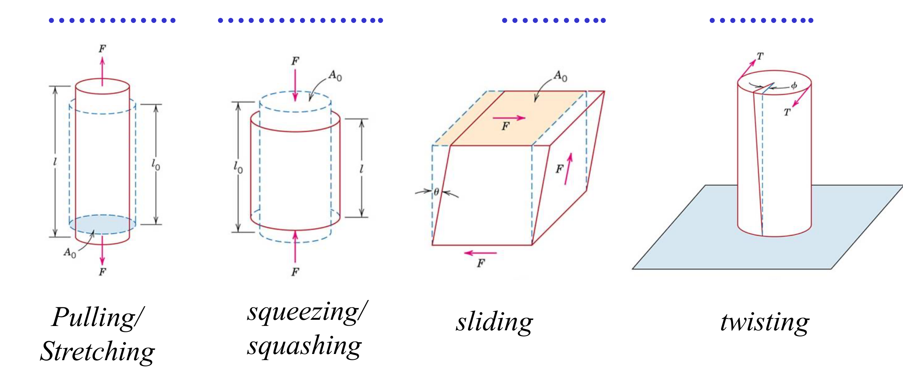
*Figure 1: The four loading modes, from Lecture 10, slide 3 (Callister Fig. 6.1). Dashed outlines are the unloaded shapes; solid outlines are the deformed shapes.*

**Reading Figure 1.**
* **Tension** (pulling/stretching): $F$ acts outward along the axis on area $A_0$; the bar gets longer, $l > l_0$.
* **Compression** (squeezing/squashing): $F$ acts inward; the bar gets shorter and fatter, $l < l_0$.
* **Shear** (sliding): $F$ acts *parallel* to the top and bottom faces; the block tilts by an angle $\theta$ without changing length.
* **Torsion** (twisting): a torque $T$ rotates one end relative to the other by an angle $\phi$. Torsion is shear distributed around a shaft.

Real structures from slide 4: a ski-lift **cable** is in simple tension ($\sigma = F/A_0$), a bridge **column** is in simple compression, and a car **drive shaft** is in torsion. Different tests measure different loading conditions, so the test you run should match how the part is loaded in service.

---

## 2. Stress and Strain (Slides 5–8)

### 2.1 The tensile test (slides 5 and 7)

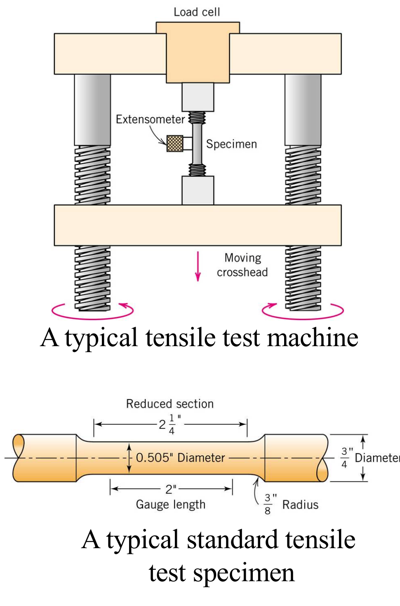
*Figure 2: A typical tensile test machine and a standard tensile specimen, from Lecture 10, slide 5 (Callister Figs. 6.2–6.3).*

**Reading Figure 2.** The **moving crosshead** pulls the specimen at a constant rate; the **load cell** at the top measures the force $F$; the **extensometer** clipped to the gauge section measures the change in length very precisely. The standard specimen has thick ends for gripping and a **reduced section** (0.505 in diameter, 2 in **gauge length**) so that deformation, and eventually fracture, happens in the middle, where it is measured. The generous **radius** between the sections avoids stress concentration at the shoulders.

Why normalise? A thin wire breaks under a lower load than a thick wire of the same material (slide 7). Load and elongation depend on the specimen's size; **stress and strain do not**, so they describe the material itself. That is why results are plotted as **engineering stress versus engineering strain**.

### 2.2 Engineering stress (slides 7–8)

$$\sigma = \frac{F}{A_0} \qquad \text{(tension or compression, } F \perp \text{area)}, \qquad\qquad \tau = \frac{F_s}{A_0} \qquad \text{(shear, } F \parallel \text{area)}$$

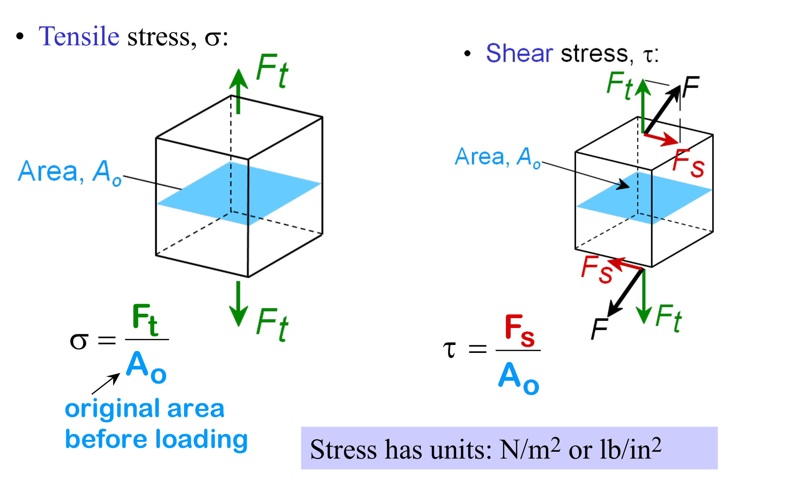
*Figure 3: Tensile stress and shear stress, from Lecture 10, slide 8.*

**Reading Figure 3.** On the left, the force $F_t$ is *perpendicular* to the blue plane, so it produces a **normal (tensile) stress** $\sigma = F_t/A_0$. On the right, the applied force $F$ is inclined: it splits into a component $F_t$ perpendicular to the plane and a component $F_s$ lying *in* the plane. Only the in-plane part produces **shear stress** $\tau = F_s/A_0$. The area used is always the **original area before loading**, $A_0$.

* Dividing by the **original** area gives **engineering stress**. Dividing by the **actual (instantaneous)** area gives **true stress** (slide 7, Section 7).
* Units: $\text{N/m}^2 = \text{Pa}$ or $\text{lb/in}^2$ (psi). Useful: $1\ \text{MPa} = 1\ \text{N/mm}^2$, so newtons divided by mm² give MPa directly.

### 2.3 Engineering strain (slides 5–6)

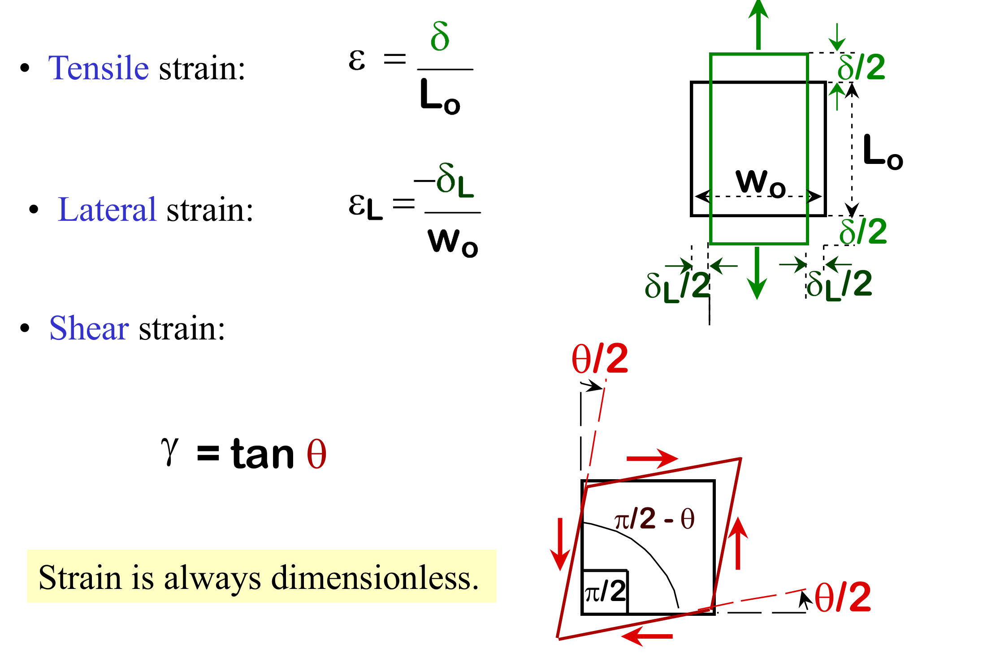
*Figure 4: Tensile, lateral and shear strain, from Lecture 10, slide 6.*

$$\varepsilon = \frac{l - l_0}{l_0} = \frac{\Delta l}{l_0} = \frac{\delta}{L_0} \qquad\qquad \varepsilon_L = \frac{-\delta_L}{w_0} \qquad\qquad \gamma = \tan\theta$$

**Reading Figure 4.** The black square is the unloaded block (width $w_0$, length $L_0$); the green rectangle is the loaded block. Pulling vertically adds $\delta/2$ at the top and at the bottom (total $\delta$), so the **tensile strain** is $\delta/L_0$. At the same time each side moves inward by $\delta_L/2$, so the width shrinks by $\delta_L$: the **lateral strain** is $-\delta_L/w_0$, negative because the block gets narrower. In the red sketch, shear tilts the square: each right angle $\pi/2$ becomes $\pi/2 - \theta$, and the **shear strain** is $\gamma = \tan\theta$ (≈ $\theta$ in radians for small angles).

**Strain is always dimensionless** (m/m or in/in), often quoted in %.

---

## 3. Elastic Deformation and Hooke's Law (Slides 9–13)

### 3.1 Elastic means reversible (slide 9)

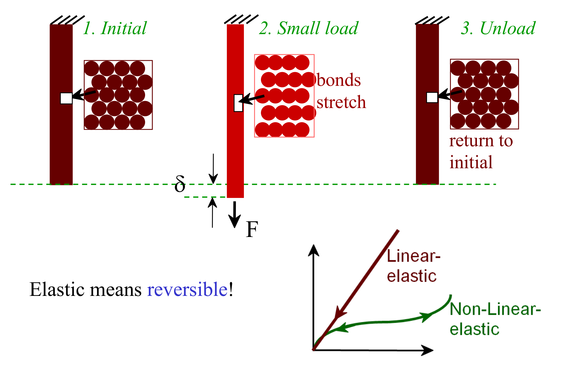
*Figure 5: Elastic deformation at the atomic scale, from Lecture 10, slide 9.*

**Reading Figure 5.** (1) Initially the atoms sit at their equilibrium spacing. (2) A small load $F$ stretches the **bonds**, and the bar lengthens by $\delta$. (3) When the load is removed the bonds pull the atoms back and the bar **returns to its initial length**. No atom changes neighbours, so nothing is permanent. The small plot shows that elastic does not have to mean straight: most metals are **linear-elastic** (load and unload along the same straight line), while some materials are **non-linear elastic** (curved, but still fully recovered).

### 3.2 Hooke's law and Young's modulus (slides 10–11)

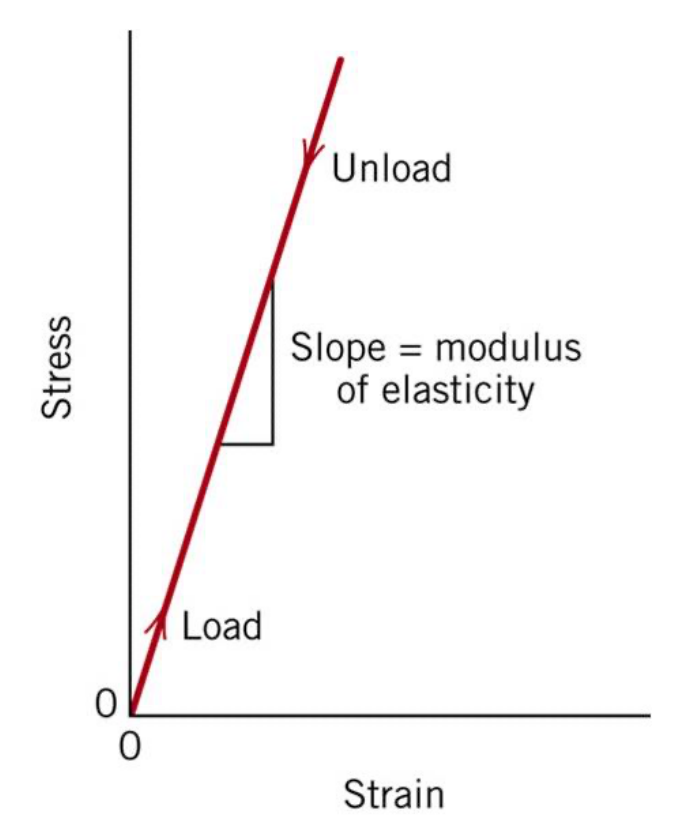
*Figure 6: Linear elastic response, from Lecture 10, slide 10 (Callister Fig. 6.5). Loading and unloading follow the same line; its slope is the modulus of elasticity.*

Initially, stress and strain are **directly proportional**. The reason (slide 10): atoms behave like masses connected by a network of **springs**, and a spring obeys Hooke's law $F = -kx$. For a material:

$$\boxed{\;\sigma = E\,\varepsilon \qquad\text{or}\qquad \frac{F}{A_0} = E\,\frac{\Delta l}{l_0}\;}$$

$E$, the **Young's modulus** or **modulus of elasticity**, measures **stiffness**: how much the material stretches elastically under a given stress. Stiff materials have a **steep** elastic line (W, Ta, Mo); compliant ones a **shallow** line (Al, Cu, Ag).

| Material (slide 12) | $E$ | Stiffness |
| :--- | :---: | :--- |
| Ceramics | 300 GPa | High: very stiff |
| Steel | 207 GPa | High |
| Copper | 110 GPa | Medium |
| Plastics | 3 GPa | Low: not stiff |

> **Stiffness is not strength.** $E$ tells you how much a part *deflects* under load; strength tells you when it *yields or breaks*. All steels have $E \approx 207$ GPa whether annealed or hardened, because heat treatment changes how easily dislocations move, not how stiff the bonds are (F24 midterm Q9 tests exactly this).

### 3.3 Lecture example (slide 11): modulus of a steel wire

> A steel wire with a cross-sectional area of 0.55 mm² and length of 10 m is extended **elastically** 1.68 mm by a force of 17.24 N. What is the modulus of elasticity for this steel specimen?

**Step 1: stress.** Newtons over mm² give MPa directly:
$$\sigma = \frac{F}{A_0} = \frac{17.24\ \text{N}}{0.55\ \text{mm}^2} = 31.35\ \text{MPa} = 31.35\times10^{6}\ \text{Pa}$$

**Step 2: strain.** Use the same length unit top and bottom:
$$\varepsilon = \frac{\Delta l}{l_0} = \frac{1.68\ \text{mm}}{10\,000\ \text{mm}} = 1.68\times10^{-4}$$

**Step 3: modulus.** The problem says *elastically*, so Hooke's law applies:
$$E = \frac{\sigma}{\varepsilon} = \frac{31.35\times10^{6}\ \text{Pa}}{1.68\times10^{-4}} = 1.866\times10^{11}\ \text{Pa} \approx \mathbf{187\ GPa}$$

**Sanity check.** Steel is usually quoted at about 207 GPa; 187 GPa is about 10 % lower, which is within the normal scatter for steels and wires. If you got 0.187 GPa or 187 000 GPa, a unit conversion went wrong (the 10 m length is the usual culprit).

**Rearranged forms you will need on the exam:**
$$\Delta l = \frac{F\,l_0}{A_0\,E} \qquad\qquad F = \frac{E\,A_0\,\Delta l}{l_0} \qquad\qquad A_0 = \frac{\pi d_0^2}{4}$$

### 3.4 Why $E$ falls with temperature (slide 12)

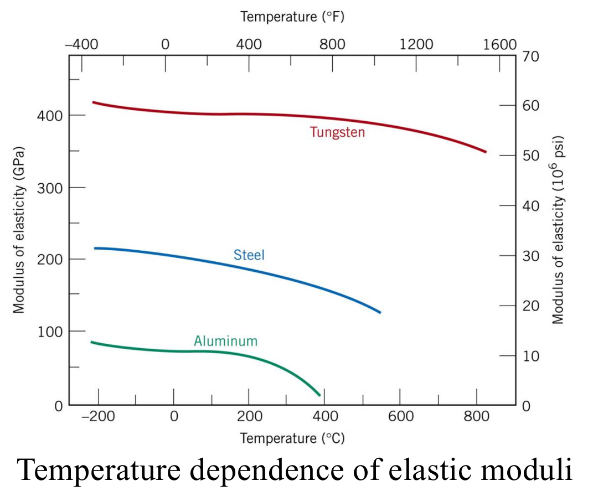
*Figure 7: Temperature dependence of the elastic modulus for tungsten, steel and aluminum, from Lecture 10, slide 12 (Callister Fig. 6.8).*

**Reading Figure 7.** Each curve starts high at low temperature and falls as temperature rises, gently at first and then faster. Tungsten stays highest (about 400 GPa near room temperature) because its bonds are strongest. Steel drops from about 207 GPa toward 120 GPa by 550 °C, and aluminum from about 70 GPa to almost nothing near 400 °C, as it approaches its melting point (660 °C). The order of the curves matches the order of melting points: stronger bonds mean higher $E$ *and* higher $T_m$.

**Answer to slide 12's question ("Can you think of why this happens?").** $E$ is proportional to the slope of the interatomic force–separation curve at the equilibrium spacing, $E \propto (dF/dr)_{r_0}$ (Lecture 2–3 bonding curves). Heating makes atoms vibrate with larger amplitude, and because the energy well is asymmetric the average spacing grows (**thermal expansion**). At this larger spacing the force curve is **less steep**, so the bonds act like softer springs and $E$ drops. Near the melting point the bonds can barely resist stretching, and $E$ heads toward zero.

### 3.5 Tangent and secant modulus (slide 13)

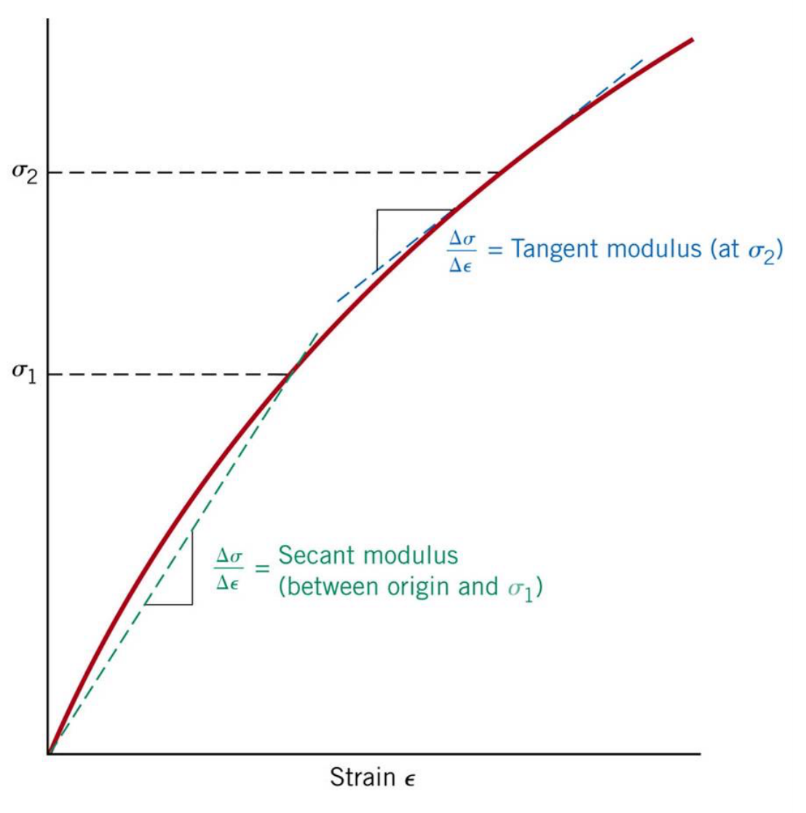
*Figure 8: Tangent and secant modulus for a non-linear elastic material, from Lecture 10, slide 13 (Callister Fig. 6.6).*

Some materials have a **non-linear** elastic region: **gray cast iron, concrete and some polymers**. Then "the slope" is not unique, and $E$ is harder to define. Two conventions:

* **Tangent modulus** at $\sigma_2$: the slope of the **tangent** to the curve at that stress level, $\left(d\sigma/d\varepsilon\right)_{\sigma_2}$. It describes how stiff the material is *at that load*, for a small extra load.
* **Secant modulus** between the origin and $\sigma_1$: the slope of the straight **line from the origin** to the point at $\sigma_1$, i.e. $\sigma_1/\varepsilon_1$. It gives the *average* stiffness from zero up to that stress, which is what you need to predict the total deflection at that load.

**Reading Figure 8.** The red curve bends over, getting less stiff as stress rises. The dashed tangent at $\sigma_2$ just touches the curve; the dashed secant cuts through it from the origin. Because the curve bends downward, the secant slope to any point is *higher* than the tangent slope at that same point.

---

## 4. Compression, Shear, Torsion and Poisson's Ratio (Slides 14–15)

### 4.1 Other test modes (slide 14)

* **Compression.** By convention, **stress and strain are negative**. Compression tests are used to measure the strength of **brittle** materials (they fail early and unpredictably in tension) and to calculate forming forces in manufacturing processes such as forging and rolling.
* **Shear.** $\tau = F/A_0$ and $\gamma = \tan\theta$. In the elastic range, **$\tau = G\gamma$**, where $G$ is the **shear modulus**. Shear tests are used for adhesive bonds, riveted joints and similar.
* **Torsion.** A variation of shear found in machine axles, drive shafts and twist drills. The applied torque $T$ is a function of the shear stress, $T = f(\tau)$, and the angle of twist $\phi$ gives the shear strain, $\gamma = f(\phi)$.

### 4.2 Poisson's ratio (slide 15)

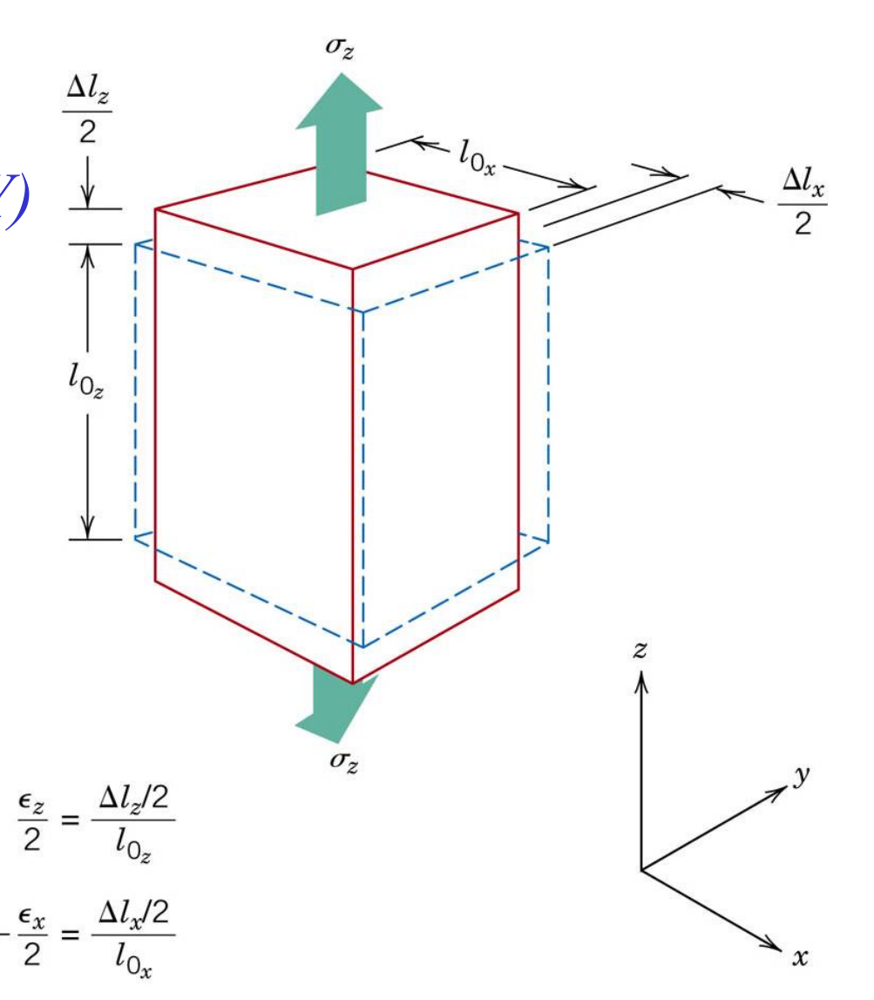
*Figure 9: A block pulled along $z$ gets longer and thinner, from Lecture 10, slide 15 (Callister Fig. 6.9).*

**Reading Figure 9.** The red outline is the loaded block, the dashed blue outline the original. Pulling along $z$ adds $\Delta l_z/2$ at each end, so $\varepsilon_z/2 = (\Delta l_z/2)/l_{0z}$ and $\varepsilon_z > 0$. Each side face moves inward by $\Delta l_x/2$, so $\varepsilon_x < 0$ (and $\varepsilon_y < 0$ the same way). In compression the block gets shorter and *fatter*.

**Poisson's ratio** measures how much lateral strain accompanies an axial strain:
$$\boxed{\;\nu = -\frac{\text{lateral strain}}{\text{longitudinal strain}} = -\frac{\varepsilon_x}{\varepsilon_z} = -\frac{\varepsilon_y}{\varepsilon_z}\;}$$

* The minus sign makes $\nu$ positive, because the lateral strain has the opposite sign to the axial strain.
* **Typical values: 0.2 to 0.5** (metals about 0.3; 0.5 would mean no change in volume, like rubber).
* For **isotropic** materials, the three elastic constants are linked:
$$\boxed{\;E = 2G(1+\nu)\;} \qquad\Longrightarrow\qquad G = \frac{E}{2(1+\nu)}$$
For steel with $E = 207$ GPa and $\nu = 0.30$: $G = 207/2.6 = 79.6$ GPa. So $G \approx 0.4E$ for most metals.
* **Anisotropic** materials (composites, single crystals) have $E$ and $G$ that **vary with direction**, and this simple relation does not hold.

**Exam-style use (F24 midterm Q19, brass rod).** $l_0 = 50$ mm stretches by 0.01 mm while $d_0 = 10$ mm shrinks by $6\times10^{-4}$ mm:
$$\varepsilon_z = \frac{0.01}{50} = 2\times10^{-4}, \qquad \varepsilon_x = \frac{-6\times10^{-4}}{10} = -6\times10^{-5}, \qquad \nu = -\frac{-6\times10^{-5}}{2\times10^{-4}} = 0.30$$

---

## 5. Anelasticity and the Stiffness Review Question (Slides 16–17)

### 5.1 Anelasticity (slide 16)

So far elastic deformation has been assumed **time-independent**: the stress produces its elastic strain instantly, and removing the stress removes it instantly. In some materials the elastic strain **builds up gradually** after loading and **recovers gradually** after unloading. This **time-dependent, recoverable** deformation is called **anelasticity**.

* In **metals** the effect is normally **small** and is usually neglected.
* In **polymers** it can be **significant**, and is called **viscoelastic behaviour**: long chains need time to uncoil under load and to recoil afterwards.
* Do not confuse it with plastic deformation: anelastic strain *does* fully recover, it just takes time.

### 5.2 Review question (slide 17): which curve is least stiff?

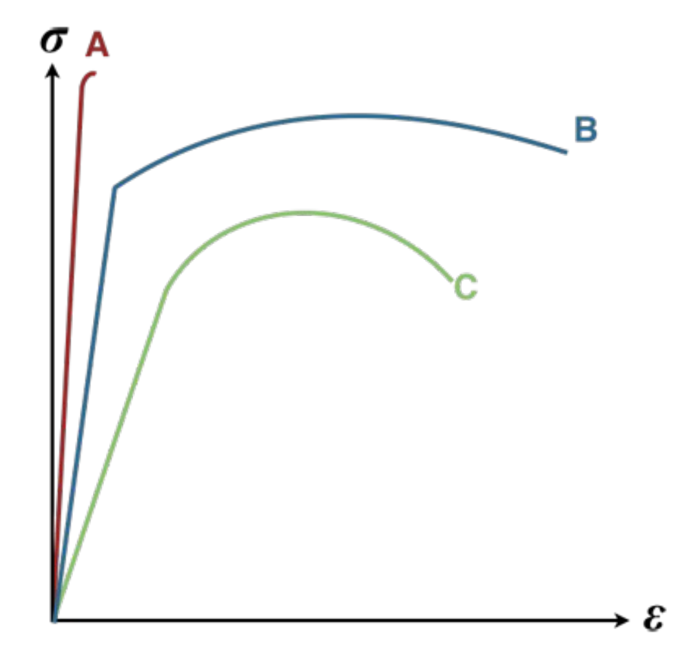
*Figure 10: The in-class review question, from Lecture 10, slide 17.*

**Answer: C.** Stiffness is the modulus $E$, the slope of the **initial straight (elastic) part** of the curve. A rises almost vertically (stiffest), B is steep, and C has the shallowest initial slope, so **C is the least stiff**.

**Why the other features do not matter here.** B reaches the highest stress in the plastic region and C the lowest, and B stretches furthest, but those are *strength* and *ductility*, not stiffness. A looks like a brittle material (very stiff, little plastic strain). The question is designed to catch students who pick the "weakest" curve instead of the one with the lowest slope; here both happen to be C, so justify the answer with the slope.

---

## 6. Beyond the Elastic Limit: The Full Engineering Stress–Strain Curve

The next lecture, Plastic Deformation, continues from here. The sections below follow Callister §6.6–6.10, which are part of the midterm scope.

Once the stress passes the elastic limit, bonds do not just stretch: whole planes of atoms slide past one another by the motion of **dislocations** (Chapter 7.1–7.4). This deformation is **permanent**: it is **plastic deformation**.

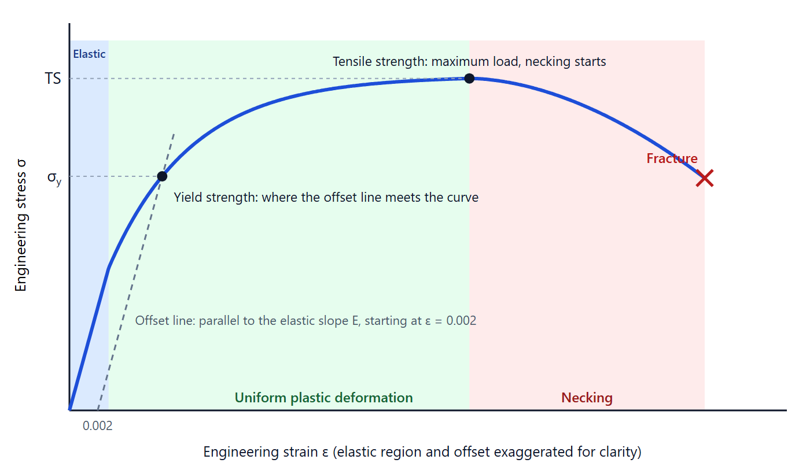
*Figure 11: Schematic engineering stress–strain curve for a ductile metal (generated for this guide; the elastic region and the 0.002 offset are drawn wider than real scale so they are visible).*

**Reading Figure 11.** The blue band is the **elastic** region from Lecture 10: a straight line of slope $E$. In the green band the metal deforms **plastically and uniformly** along the whole gauge length, and the stress keeps rising because the metal strain-hardens. The **yield strength** $\sigma_y$ is where the dashed **offset line** (parallel to the elastic line, starting at $\varepsilon = 0.002$) meets the curve. The peak is the **tensile strength** (TS): the maximum load the specimen can carry. After it, deformation concentrates in a **neck** (red band), the load the specimen carries falls, and the specimen finally **fractures**.

### 6.1 Yield strength $\sigma_y$ and the 0.002 offset method
In most metals (copper, aluminum, austenitic stainless steel), the transition from elastic to plastic behaviour is smooth and gradual. To get an unambiguous, reproducible value:

1. Locate $\varepsilon = 0.002$ (0.2 %) on the strain axis.
2. Draw a straight line parallel to the elastic slope: $\sigma = E(\varepsilon - 0.002)$.
3. The stress where this line meets the curve is the **0.2 % offset yield strength** $\sigma_y$.

### 6.2 Yield point phenomenon (upper and lower yield in low-carbon steels)
Some annealed low-carbon steels show a distinct upper yield point followed by a sudden drop to a fluctuating lower yield plateau:
* **Upper yield point**: interstitial carbon and nitrogen atoms cluster around dislocations and pin them. A high stress is needed to tear the dislocations free.
* **Lower yield point**: once free, dislocations multiply and glide at a lower stress, producing visible bands of localised deformation (**Lüders bands**).
* For design with these steels, the **lower yield point** is used as the yield strength.

---

## 7. Tensile Strength, Ductility, Resilience & Toughness

### Ultimate Tensile Strength (UTS, $\sigma_{\text{UTS}}$)
The **tensile strength** is the maximum engineering stress sustained by the specimen, corresponding to the peak of the engineering stress-strain curve:

$$\sigma_{\text{UTS}} = \frac{F_{\max}}{A_0}$$

* **Prior to UTS**: Plastic deformation is uniform across the entire gauge length. Strain hardening strengthens the metal faster than the cross-section shrinks.
* **At UTS**: A geometric instability occurs—the rate of strain hardening can no longer compensate for the reduction in cross-sectional area.
* **Beyond UTS**: Deformation concentrates exclusively into a localized region known as the **neck**, where the cross-sectional area contracts rapidly until rupture.

### Ductility ($\%EL$ and $\%RA$)
Ductility is the degree of plastic deformation a material can endure before fracture. Materials that experience little or no plastic strain prior to breaking are termed **brittle** ($\%EL < 5\%$).

Ductility is quantified by two parameters measured on the fractured specimen:
1. **Percent Elongation ($\%EL$)**:
   $$\%EL = \left(\frac{l_f - l_0}{l_0}\right) \times 100\%$$
   * $l_0$ = Original gauge length (typically $50\text{ mm}$ or $2\text{ inches}$).
   * $l_f$ = Gauge length after fracture (measured by fitting the broken pieces back together).

2. **Percent Reduction in Area ($\%RA$)**:
   $$\%RA = \left(\frac{A_0 - A_f}{A_0}\right) \times 100\% = \left(1 - \frac{d_f^2}{d_0^2}\right) \times 100\%$$
   * $A_0 = \frac{\pi}{4}d_0^2$ = Original cross-sectional area.
   * $A_f = \frac{\pi}{4}d_f^2$ = Minimum cross-sectional area measured at the fracture neck.

> **Warning.**
> Always verify whether a question asks for reduction in diameter or reduction in area! Area scales with $d^2$. For example, a specimen necking from $d_0 = 12.8\text{ mm}$ to $d_f = 6.6\text{ mm}$ undergoes a $48.4\%$ reduction in diameter, but a **$73.4\%$ reduction in area**!

### Modulus of Resilience ($U_r$)
**Resilience** is the capacity of a material to absorb energy when deformed elastically and then release that energy upon unloading without permanent deformation (crucial for springs, shock absorbers, and tennis rackets).

The **Modulus of Resilience ($U_r$)** is the strain energy per unit volume absorbed up to yielding, represented by the area under the linear elastic portion of the stress-strain curve:

$$U_r = \int_0^{\epsilon_y} \sigma \, d\epsilon = \frac{1}{2} \sigma_y \cdot \epsilon_y = \frac{1}{2} \sigma_y \left(\frac{\sigma_y}{E}\right) = \frac{\sigma_y^2}{2E}$$

* **Units**: Joules per cubic meter ($\text{J/m}^3$) or $\text{kJ/m}^3$ ($1\text{ Pa} = 1\text{ J/m}^3$).
* To maximize resilience: A material must have a **high yield strength ($\sigma_y$)** combined with a **low modulus of elasticity ($E$)** (e.g. spring steels, titanium alloys).

### Toughness
**Toughness** is the ability of a material to absorb energy and deform plastically before fracturing. It is represented by the **total area under the complete stress-strain curve** from zero to fracture:
* A strong, ductile material (such as medium-carbon steel) exhibits high toughness.
* A high-strength ceramic may have high yield and tensile strength, but near-zero ductility, making its area small and its toughness very low (brittle).

---

## 8. True Stress and True Strain Mechanics

On an engineering stress-strain curve, the stress appears to decrease after the UTS until fracture occurs. This is an artifact of the calculation method, because the engineering formula divides load by the *initial* undeformed area $A_0$.

In reality, the metal continues to work-harden vigorously inside the neck. To describe true mechanical state, we use **true stress** and **true strain**.

### True Stress ($\sigma_T$)
The applied load divided by the **actual, instantaneous cross-sectional area** $A_i$:

$$\sigma_T = \frac{F}{A_i}$$

### True Strain ($\epsilon_T$)
The instantaneous rate of change in length integrated over the deformation history:

$$\epsilon_T = \int_{l_0}^{l_i} \frac{dl}{l} = \ln\left(\frac{l_i}{l_0}\right)$$

### Conversion Relationships (Valid Prior to Necking)
Assuming constant specimen volume during plastic deformation ($A_0 l_0 = A_i l_i$):

$$\sigma_T = \sigma(1 + \epsilon)$$

$$\epsilon_T = \ln(1 + \epsilon)$$

> **Caution.**
> These conversion formulas are **only valid up to the onset of necking (UTS)**! Once localized necking begins, strain is no longer uniform along the gauge length, and $A_i$ must be measured directly with an optical or mechanical extensometer at the neck.

### The Hollomon Power Law for Strain Hardening
For many metals in the region of uniform plastic deformation between yielding and necking, the true stress-strain curve follows the empirical **Hollomon equation**:

$$\sigma_T = K \cdot \epsilon_T^n$$

Where:
* $K$ = **Strength Coefficient** ($\text{MPa}$).
* $n$ = **Strain-Hardening Exponent** (dimensionless, typically $0.10 - 0.50$). A higher $n$ indicates greater work-hardening capacity (e.g., $n \approx 0.50$ for annealed copper/brass vs. $n \approx 0.15$ for high-strength steels).

---

## 9. Hardness Testing: Mechanics & Correlations

**Hardness** is a measure of a material's resistance to localized permanent surface indentation or scratching. Because hardness tests are non-destructive, inexpensive, and require no special specimen geometry, they are universally used in quality control.

### Comparison of Standard Hardness Testing Methods

| Test Method | Indenter Geometry | Applied Load | Measurement Metric | Typical Use / Applications |
| :--- | :--- | :--- | :--- | :--- |
| **Rockwell** (ASTM E18) | Diamond cone ($120^\circ$) or hardened steel sphere ($1/16''$) | Minor: $10\text{ kgf}$ Major: $60, 100, 150\text{ kgf}$ | **Depth of indentation** (read directly on dial/digital gauge) | Standard workshop QC; Scales: **HRA** (hard carbides), **HRB** (brass/Al), **HRC** (hardened steels). |
| **Brinell** (ASTM E10) | Hardened steel or tungsten carbide ball ($D = 10\text{ mm}$) | $500 - 3000\text{ kgf}$ (held for $10-15\text{ s}$) | **Diameter of indentation ($d$)** measured with optical microscope | Cast irons, forged structural steels, coarse-grained alloys. |
| **Vickers** (ASTM E92) | Diamond square-based pyramid ($136^\circ$ face angle) | $1 - 120\text{ kgf}$ | Both diagonal lengths of the square impression ($d = [d_1+d_2]/2$) | All metals; creates a continuous single scale from soft lead to hard ceramic. |
| **Knoop** (ASTM E384) | Elongated rhombic diamond pyramid | $10 - 1000\text{ gf}$ | Long diagonal length under high-magnification microscope | **Microhardness**: thin coatings, individual microstructural phases, brittle glass. |

### Mathematical Derivation of Brinell Hardness Number ($HB$)
The Brinell Hardness Number is defined as the applied load $P$ (in $\text{kgf}$) divided by the curved surface area of the spherical cap impression $A_{\text{cap}}$:

1. Surface area of a spherical cap of depth $h$ cut from a sphere of diameter $D$:
   $$A_{\text{cap}} = \pi D h$$
2. From the Pythagorean theorem on the indenter geometry:
   $$\left(\frac{D}{2} - h\right)^2 + \left(\frac{d}{2}\right)^2 = \left(\frac{D}{2}\right)^2$$
   $$\frac{D^2}{4} - Dh + h^2 + \frac{d^2}{4} = \frac{D^2}{4} \implies Dh - h^2 = \frac{d^2}{4}$$
   Solving for depth $h$:
   $$h = \frac{D - \sqrt{D^2 - d^2}}{2}$$
3. Substituting $h$ into the cap area formula:
   $$A_{\text{cap}} = \pi D \left(\frac{D - \sqrt{D^2 - d^2}}{2}\right) = \frac{\pi D}{2}\left(D - \sqrt{D^2 - d^2}\right)$$
4. Dividing load $P$ by $A_{\text{cap}}$ gives the standard **Brinell Hardness Formula**:

$$HB = \frac{2P}{\pi D \left(D - \sqrt{D^2 - d^2}\right)}$$

### Empirical Correlation Between Hardness and Tensile Strength
For most structural steels and cast irons, there is an empirical linear relationship between Brinell hardness and ultimate tensile strength ($TS$):

$$TS\,(\text{MPa}) \approx 3.45 \times HB$$

$$TS\,(\text{psi}) \approx 500 \times HB$$

---

## 10. Fully Solved Master Problems

### Problem 1: Complete 4-Part Brass Tensile Analysis (Callister Example 6.3)
**Problem Statement**:
A cylindrical specimen of a brass alloy with initial diameter $d_0 = 12.8\text{ mm}$ and original length $l_0 = 250\text{ mm}$ is pulled in tension. From its experimental $\sigma-\epsilon$ curve:
* At stress $\sigma_1 = 150\text{ MPa}$, the engineering strain is $\epsilon_1 = 0.0016$.
* The $0.002$ offset line intersects the curve at $250\text{ MPa}$.
* The ultimate tensile strength is $\sigma_{\text{UTS}} = 450\text{ MPa}$.
* At tensile stress $\sigma = 345\text{ MPa}$, the total strain is $\epsilon = 0.060$.

Determine:
1. The modulus of elasticity ($E$).
2. The yield strength at $0.002$ strain offset ($\sigma_y$).
3. The maximum tensile load ($F_{\max}$) sustainable before necking.
4. The total elongation ($\Delta l$) of the specimen under a tensile stress of $345\text{ MPa}$.

#### Step-by-Step Solution:
**Part 1: Modulus of Elasticity ($E$)**
Within the initial linear elastic portion:
$$E = \frac{\Delta \sigma}{\Delta \epsilon} = \frac{150\text{ MPa} - 0}{0.0016 - 0} = \frac{150 \times 10^6\text{ N/m}^2}{0.0016} = 9.375 \times 10^{10}\text{ Pa} = \mathbf{93.8\text{ GPa}}$$

**Part 2: Yield Strength ($\sigma_y$)**
Directly read at the intersection of the $0.002$ strain offset line with the curve:
$$\sigma_y = \mathbf{250\text{ MPa}}$$

**Part 3: Maximum Tensile Load ($F_{\max}$)**
First calculate the original cross-sectional area:
$$A_0 = \frac{\pi d_0^2}{4} = \frac{\pi (12.8 \times 10^{-3}\text{ m})^2}{4} = 1.2868 \times 10^{-4}\text{ m}^2$$
The maximum load occurs at the ultimate tensile strength ($\sigma_{\text{UTS}} = 450\text{ MPa}$):
$$F_{\max} = \sigma_{\text{UTS}} \cdot A_0 = (450 \times 10^6\text{ N/m}^2) \times (1.2868 \times 10^{-4}\text{ m}^2) = 57,906\text{ N} \approx \mathbf{57.9\text{ kN}}$$

**Part 4: Elongation ($\Delta l$) at $345\text{ MPa}$**
Because $345\text{ MPa} > \sigma_y$ ($250\text{ MPa}$), deformation is plastic, so we cannot use Hooke's law! Reading directly from the stress-strain curve, $\sigma = 345\text{ MPa}$ corresponds to $\epsilon = 0.060$.
$$\Delta l = \epsilon \cdot l_0 = 0.060 \times 250\text{ mm} = \mathbf{15.0\text{ mm}}$$

---

### Problem 2: Ductility Metrics (textbook-style)
**Problem Statement**:
A cylindrical metal specimen having an initial diameter $d_0 = 12.80\text{ mm}$ and gauge length $l_0 = 50.80\text{ mm}$ is pulled in tension to fracture. The broken pieces are fitted together:
* Fractured gauge length: $l_f = 72.14\text{ mm}$
* Minimum diameter at fracture neck: $d_f = 6.60\text{ mm}$

Calculate the ductility in terms of:
1. Percent elongation ($\%EL$)
2. Percent reduction in area ($\%RA$)

#### Step-by-Step Solution:
**1. Percent Elongation**:
$$\%EL = \left(\frac{l_f - l_0}{l_0}\right) \times 100\% = \left(\frac{72.14 - 50.80}{50.80}\right) \times 100\% = \left(\frac{21.34}{50.80}\right) \times 100\% = \mathbf{42.01\%}$$

**2. Percent Reduction in Area**:
$$\%RA = \left(\frac{A_0 - A_f}{A_0}\right) \times 100\% = \left(1 - \frac{d_f^2}{d_0^2}\right) \times 100\%$$
$$\%RA = \left(1 - \frac{6.60^2}{12.80^2}\right) \times 100\% = \left(1 - \frac{43.56}{163.84}\right) \times 100\% = (1 - 0.26587) \times 100\% = \mathbf{73.41\%}$$

---

### Problem 3: Modulus of Resilience Calculation
**Problem Statement**:
A high-strength alloy has a yield strength $\sigma_y = 300\text{ MPa}$ and a modulus of elasticity $E = 100\text{ GPa}$. Calculate its modulus of resilience $U_r$.

#### Step-by-Step Solution:
$$U_r = \frac{\sigma_y^2}{2E} = \frac{(300 \times 10^6\text{ Pa})^2}{2 \times (100 \times 10^9\text{ Pa})} = \frac{9.0 \times 10^{16}}{2.0 \times 10^{11}} = 4.5 \times 10^5\text{ J/m}^3 = \mathbf{450\text{ kJ/m}^3}$$

---

## 11. Exam Pitfalls & High-Yield Summary Table

| Metric | Formula | Key Units | Frequent Exam Pitfall |
| :--- | :--- | :--- | :--- |
| **Engineering Stress** | $\sigma = F / A_0$ | $\text{MPa}$ | Using instantaneous area $A_i$ instead of original area $A_0$. |
| **Young's Modulus** | $E = \Delta \sigma / \Delta \epsilon$ | $\text{GPa}$ | Unit conversion errors ($1\text{ GPa} = 10^3\text{ MPa} = 10^9\text{ Pa}$). |
| **Poisson's Ratio** | $\nu = -\epsilon_{\text{lateral}} / \epsilon_{\text{axial}}$ | Dimensionless | Dropping the negative sign (tensile lateral strain is negative). |
| **Shear Modulus** | $G = E / [2(1+\nu)]$ | $\text{GPa}$ | Using it for anisotropic materials (composites, single crystals), where it does not hold. |
| **Stiffness vs. Strength** | Stiffness $= E$ (initial slope) | $\text{GPa}$ | Picking the curve with the lowest strength when asked for the least *stiff* (Lecture 10 slide 17). |
| **Non-linear Elastic $E$** | Tangent: slope at $\sigma$; Secant: $\sigma/\epsilon$ from origin | $\text{GPa}$ | Swapping the two definitions (Lecture 10 slide 13). |
| **$E$ vs. Temperature** | $E$ decreases as $T$ rises | — | Saying $E$ increases with $T$; thermal expansion moves atoms to a less steep part of the force curve. |
| **Anelasticity** | Time-dependent, recoverable strain | — | Calling it plastic (it recovers) or significant in metals (it is in polymers). |
| **Yield Strength** | Read at $\epsilon = 0.002$ offset | $\text{MPa}$ | Drawing the offset line vertically rather than parallel to slope $E$. |
| **Tensile Strength** | $\sigma_{\text{UTS}} = F_{\max} / A_0$ | $\text{MPa}$ | Dividing by fracture area $A_f$ instead of original area $A_0$. |
| **Ductility ($\%RA$)** | $\%RA = (1 - d_f^2/d_0^2) \times 100\%$ | $\%$ | Subtracting diameters linearly instead of squaring to compute areas! |
| **Resilience** | $U_r = \sigma_y^2 / (2E)$ | $\text{kJ/m}^3$ | Forgetting the $1/2$ factor in the triangular elastic energy area. |
| **True Stress** | $\sigma_T = \sigma(1 + \epsilon)$ | $\text{MPa}$ | Applying this conversion beyond the UTS (invalid in the neck!). |
| **Brinell Hardness** | $HB = \frac{2P}{\pi D (D - \sqrt{D^2 - d^2})}$ | $\text{kgf/mm}^2$ | Using flat circle area ($\frac{\pi}{4}d^2$) instead of spherical cap area. |

---
*MIAE 221 · Concordia University · Course Engineering Hub · Part 6 (Lecture 10 and Callister Chapter 6)*
