# MIAE 221: Materials Science for Engineers
# Part 9: Diffusion in Solids Master Guide
**Concordia University · Gina Cody School of Engineering** · Based on Dr. M. Medraj, Lecture 9 (*Diffusion*) · Callister & Rethwisch, Chapter 5 (*Diffusion*)

---

## Executive Overview & Core Concepts

Diffusion is the phenomenon of **mass transport within a material by atomic motion**. In solids, atoms are not locked rigidly in place; thermal energy causes continuous lattice vibrations, and when sufficient vibrational energy is concentrated in an atom adjacent to an empty site, the atom jumps to a new equilibrium position. 

Diffusion governs virtually every thermal, chemical, and structural transformation in materials science:
* **Surface Hardening (Carburization)**: Infusing carbon into the outer case of low-carbon steel gears and camshafts to provide extreme surface wear resistance while retaining a ductile, shock-absorbing core.
* **Semiconductor Doping**: Introducing minute, highly controlled concentrations of donor and acceptor impurities (phosphorus, boron, arsenic) into silicon wafers to manufacture microprocessors and integrated circuits.
* **Corrosion Resistance & Protective Coatings**: Sintering, galvanizing, and chrome-plating steel components, where atomic interdiffusion creates metallurgical bonds.
* **Phase Transformations & Precipitation Hardening**: Nucleation and growth of strengthening precipitates (such as $\theta\text{-Al}_2\text{Cu}$ in aerospace aluminium alloys or pearlite in carbon steels).

```
                 MASS TRANSPORT REGIMES IN MATERIALS
                 
          ┌──────────────────────────────────────────────┐
          │                  DIFFUSION                   │
          └──────────────────────┬───────────────────────┘
                                 │
         ┌───────────────────────┴───────────────────────┐
         ▼                                               ▼
┌─────────────────────────────────┐     ┌─────────────────────────────────┐
│          SELF-DIFFUSION         │     │         INTERDIFFUSION          │
│  - Mass transport in pure host  │     │  - Mass transport between two   │
│  - No concentration gradient     │     │    different materials/alloys   │
│  - Tracked via radioactive      │     │  - Driven by chemical potential │
│    tracer isotopes              │     │    / concentration gradients    │
└─────────────────────────────────┘     └─────────────────────────────────┘
```

---

### Student Slide Fill-in-the-Blank Reference (Lecture 9)

Dr. Medraj's lecture slides contain fill-in-the-blank checkpoints designed to test fundamental conceptual mastery. The verified answers are compiled below:

| Slide | Blank / Prompt | Exact Technical Answer | Physical & Engineering Justification |
| :---: | :--- | :--- | :--- |
| **3** | *"The process of substitutional diffusion requires the presence of ……… (Vacancies give the atoms a place to move)"* | **vacancies** | Substitutional host atoms cannot squeeze past close-packed neighbors without an adjacent vacant lattice site to jump into. |
| **6** | *"Example [of interstitial diffusion]: ………"* | **Carbon in iron (steels)** (or **Hydrogen in palladium / titanium**) | Small non-metallic solute atoms ($r_{\text{solute}} \ll r_{\text{host}}$) migrate through interstitial voids rather than regular lattice sites. |
| **7** | *"Diffusion is a ……… process"* | **time-dependent** | Mass transport rate ($dM/dt$) is governed by elapsed time; diffusion requires finite time for atoms to overcome energy barriers. |
| **7** | *"If flux does not change with time: ………"* | **steady-state** | By definition, steady-state diffusion means $\partial J / \partial t = 0$ and $\partial C / \partial t = 0$; the concentration profile is invariant with time. |
| **12** | *"In most real situations diffusion is not ………"* | **steady state** (it is **non-steady state**) | In practical processes (carburizing, semiconductor doping, oxidation), concentration profiles change continuously over time. |
| **12** | *"The changes of the concentration profile is given in this case by a differential equation, ……… second law"* | **Fick's** | Adolf Fick's Second Law: $\dfrac{\partial C}{\partial t} = \dfrac{\partial}{\partial x}\left(D\dfrac{\partial C}{\partial x}\right)$. |
| **12** | *"Solution of this equation is concentration profile as function of time, ………"* | **$C(x, t)$** | The mathematical solution yields concentration as an explicit function of both spatial depth ($x$) and elapsed time ($t$). |
| **17** | *"If it is desired to achieve a particular concentration of solute atoms in an alloy then: ……… and ………"* | $\mathbf{\dfrac{x}{2\sqrt{Dt}} = \text{constant}}$ and $\mathbf{\dfrac{x^2}{Dt} = \text{constant}}$ | Setting $(C_x - C_0)/(C_s - C_0) = \text{const}$ forces the error function argument $z$ to be constant, establishing the scaling rule $x^2 / Dt = \text{const}$. |
| **18** | *"faster in more open lattice (BCC faster than FCC) (………)"* | **$\text{APF}_{\text{BCC}} = 0.68 < \text{APF}_{\text{FCC}} = 0.74$** | The lower atomic packing factor of BCC leaves more free volume, lowering the activation energy barrier for atomic migration. |
| **20** | *"slope = ……… , intercept = ………"* | $\mathbf{\text{Slope} = -\dfrac{Q_d}{2.303 R}}$ (or $-\dfrac{Q_d}{R}$ for $\ln D$); $\mathbf{\text{Intercept} = \log_{10} D_0}$ | Derived directly by taking common or natural logarithms of the Arrhenius rate equation $D = D_0 \exp(-Q_d/RT)$. |
| **22** | Polling Summary Questions 1–4 | **1: Open structure is faster; 2: Lower-melting is faster; 3: Secondary interactions are faster; 4: Smaller atoms are faster.** | See complete in-depth pedagogical breakdown in Section 7. |

---

## 1. Physical Foundations: The Diffusion Couple & Atomic Motion

### 1.1 Interdiffusion and the Diffusion Couple (Slide 3)

The classical demonstration of solid-state diffusion is the **diffusion couple**, formed by joining two distinct pure metals (for example, copper and nickel) with intimately polished, atomic-contact interfaces:

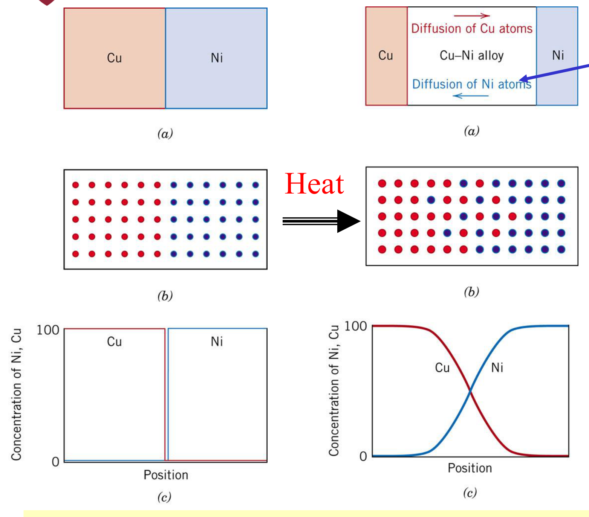
*Figure 1: The Copper-Nickel diffusion couple (Lecture 9, Slide 3; Callister Fig. 5.1). Left: Initial configuration before heat treatment, exhibiting a sharp step-function interface at $x=0$. Right: Concentration profiles across the couple following an extended high-temperature anneal, demonstrating interdiffusion across the original interface.*

**Step-by-step physical breakdown:**
1. **Initial State ($t = 0$)**: The couple has a sharp boundary. On the left side ($x < 0$), copper concentration is $100\text{ at}\%$ and nickel is $0\text{ at}\%$. On the right side ($x > 0$), nickel is $100\text{ at}\%$ and copper is $0\text{ at}\%$.
2. **Thermal Activation ($T > 0.5 T_m$)**: The couple is placed in a furnace at elevated temperature ($1000^\circ\text{C}$). Heat causes atoms to vibrate with large amplitudes around their equilibrium positions.
3. **Net Mass Transport**: Due to the concentration gradient, copper atoms randomly jump across the interface into the nickel bar, while nickel atoms jump into the copper bar.
4. **Final Concentration Profile ($t > 0$)**: The step-function profile smooths into a continuous, S-shaped concentration gradient curve. A solid solution alloy of $\text{Cu-Ni}$ is formed across the diffusion zone.

### 1.2 Self-Diffusion (Slide 2)
In pure metals (such as pure copper or pure iron), atoms undergo continuous random walk jumps into adjacent vacancies. Because all atoms are chemically identical, there is no macroscopic concentration gradient ($\nabla C = 0$) and no net compositional change occurs. This process is called **self-diffusion**. 

Experimentally, self-diffusion is measured by depositing a microscopic layer of radioactive tracer isotopes (e.g., radioactive $^{64}\text{Cu}$ on non-radioactive $^{63}\text{Cu}$) and sectioning the specimen after heat treatment to count radiation emissions as a function of depth.

---

## 2. Atomic Mechanisms of Diffusion (Slides 4–6)

For an atom in a solid crystal to change its position, two physical prerequisites must be satisfied simultaneously:
1. **Adjacent Empty Site**: There must be an adjacent empty site (either a lattice vacancy or an empty interstitial void).
2. **Activation Energy ($E \ge Q$)**: The atom must possess sufficient thermal vibrational energy to break neighboring atomic bonds and mechanically distort the surrounding lattice to squeeze past adjacent host atoms.

```
                         DIFFUSION MECHANISMS
                         
       ┌───────────────────────────┴───────────────────────────┐
       ▼                                                       ▼
┌───────────────────────────────┐               ┌───────────────────────────────┐
│       VACANCY DIFFUSION       │               │    INTERSTITIAL DIFFUSION     │
│ - Solute and host atoms of    │               │ - Small solute atoms (C, H,   │
│   similar atomic size         │               │   N, O) migrating in host     │
│ - Requires adjacent vacancy   │               │ - Vacancies NOT required      │
│ - Atom jump direction OPPOSITE│               │ - Every adjacent interstitial │
│   to vacancy motion direction │               │   site is empty and open      │
│ - High activation energy      │               │ - Low activation energy       │
│ - Slow process                │               │ - Rapid process (100-1000x)   │
└───────────────────────────────┘               └───────────────────────────────┘
```

---

### 2.1 Vacancy Diffusion Mechanism (Slide 5)

In **vacancy (substitutional) diffusion**, an atom moves from a normal lattice site into an adjacent empty vacant site.

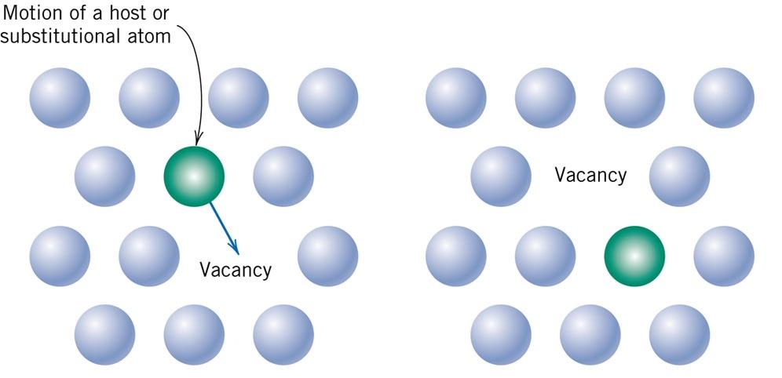
*Figure 2: Vacancy diffusion mechanism (Lecture 9, Slide 5; Callister Fig. 5.3a). As a host or substitutional atom jumps to the right into the vacant site, the vacancy effectively translates to the left.*

* **Opposite Flux Vector**: The flux of atoms in one direction is mathematically and physically equivalent to an **equal and opposite flux of vacancies**:
  $$\vec{J}_{\text{atoms}} = -\vec{J}_{\text{vacancies}}$$
* **Energy Requirement ($Q_d = Q_v + Q_m$)**: Because a vacancy must first be formed in the lattice before an atom can jump into it, the overall activation energy for substitutional diffusion ($Q_d$) equals the sum of the **vacancy formation energy ($Q_v$)** and the **vacancy migration energy ($Q_m$)**:
  $$Q_d = Q_v + Q_m$$
* **Temperature Dependence of Vacancies (Slide 4)**:
  From Part 5, the equilibrium fraction of vacancies in a crystal increases exponentially with temperature:
  $$\frac{N_v}{N_0} = \exp\left(-\frac{Q_v}{k_B T}\right)$$

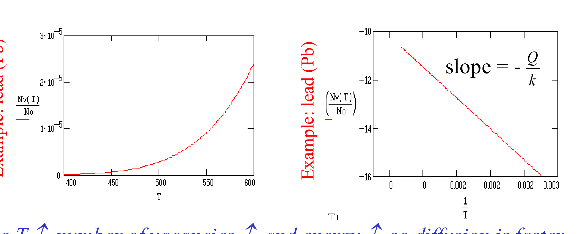
*Figure 3: Semilogarithmic plot of equilibrium vacancy concentration versus $1/T$ for pure lead (Lecture 9, Slide 4). As temperature rises, both vacancy population and atomic vibrational energy multiply, drastically accelerating diffusion.*

---

### 2.2 Interstitial Diffusion Mechanism (Slide 6)

In **interstitial diffusion**, relatively small impurity atoms (such as carbon, hydrogen, nitrogen, and oxygen) migrate from one interstitial void site to an adjacent, empty interstitial site:

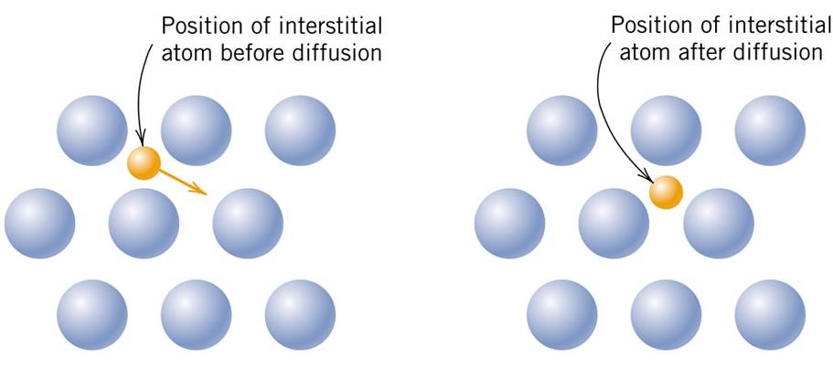
*Figure 4: Interstitial diffusion mechanism (Lecture 9, Slide 6; Callister Fig. 5.3b). Small solute atoms jump directly between interstitial voids within the host solvent crystal lattice.*

#### Why is Interstitial Diffusion Much Faster than Vacancy Diffusion?
On exams, this is one of the most frequently tested conceptual questions:
1. **No Vacancy Creation Required ($Q_d = Q_m$)**: Because the vast majority of interstitial voids in a metal lattice are unoccupied, an interstitial atom almost always has empty neighboring sites available. No energy is spent creating a vacancy ($Q_v = 0$). Thus, the activation energy for interstitial diffusion is solely the migration barrier ($Q_d = Q_m$).
2. **Smaller Solute Radius ($r_{\text{solute}} \ll r_{\text{host}}$)**: The small atomic radii of carbon ($0.071\text{ nm}$) or nitrogen ($0.065\text{ nm}$) relative to iron ($0.124\text{ nm}$) mean that surrounding host lattice atoms need to be pushed apart only slightly to allow the atom to pass through.
3. **Quantitative Difference**: At $1000^\circ\text{C}$ in FCC iron ($\gamma$-austenite):
   * Diffusivity of interstitial Carbon: $D_{\text{C}} \approx 2.4 \times 10^{-11}\text{ m}^2/\text{s}$
   * Diffusivity of substitutional Iron self-diffusion: $D_{\text{Fe}} \approx 2.2 \times 10^{-16}\text{ m}^2/\text{s}$
   * **Result**: Carbon diffuses more than **$100\,000\text{ times}$ faster** than iron host atoms at the exact same temperature!

---

## 3. Case Hardening of Steels: Practical Interstitial Diffusion (Slide 10)

An essential industrial application of interstitial diffusion is the **case hardening (carburization)** of steel components such as transmission gears, pinions, and crankshafts:


*Figure 5: Case-hardened gear showing the hard, wear-resistant outer carburized case and the tough, ductile core (Lecture 9, Slide 10; Callister Chapter 5).*

### The Engineering Rationale for Case Hardening:
Gear teeth experience two distinct structural demands:
1. **Surface Tooth Contact**: High localized contact stresses and repetitive frictional sliding require high surface hardness to prevent abrasive wear, galling, and contact fatigue spalling.
2. **Tooth Root Bending**: High cyclical bending stresses at the root fillet demand excellent fracture toughness and impact resistance to prevent catastrophic tooth breakage.

A single uniform material cannot optimize both:
* A high-carbon steel ($>0.8\text{ wt}\%\text{ C}$) through-hardened is brittle and snaps under sudden shock loads.
* A low-carbon steel ($0.15\text{–}0.25\text{ wt}\%\text{ C}$) is tough but too soft; gear teeth wear away rapidly.

### How Carburizing Solves This:
1. **Process**: A gear forged from low-carbon steel ($0.2\text{ wt}\%\text{ C}$) is exposed at $900\text{–}950^\circ\text{C}$ to a carbon-rich gas atmosphere ($\text{CO}/\text{CH}_4$).
2. **Surface Carbon Enrichment**: Carbon interstitially diffuses into the outer surface layer (depth of $0.5\text{–}2.0\text{ mm}$), creating a carbon gradient ($C_s \approx 0.8\text{–}1.0\text{ wt}\%\text{ C}$).
3. **Quenching & Martensite Formation**: Upon rapid oil quenching, the high-carbon surface case transforms into high-hardness **martensite**, locking crystal slip planes and resisting shear deformation.
4. **Residual Compressive Stresses**: Because the high-carbon martensite experiences a volume expansion upon transformation, the case is placed into **residual compression**. Compressive surface stresses actively suppress surface microcrack initiation and fatigue failure!

---

## 4. Mathematics of Diffusion: Steady-State Diffusion & Fick's First Law (Slides 7–11)

### 4.1 Diffusion Flux ($J$) (Slide 7)

Diffusion is a **rate process**. The rate at which mass is transported through a solid is quantified by the **diffusion flux ($J$)**:

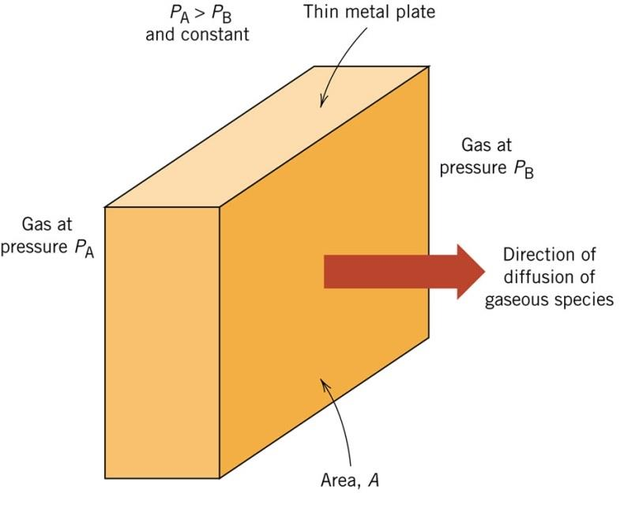
*Figure 6: Schematic representation of diffusion flux $J = M / (A t)$ across cross-sectional area $A$ normal to the direction of flow (Lecture 9, Slide 7).*

**Mathematical Definition:**
$$J = \frac{M}{A t} \quad \text{or differential form} \quad J = \frac{1}{A}\frac{dM}{dt}$$

Where:
* $J$ = Diffusion flux ($\text{kg}/(\text{m}^2\cdot\text{s})$ or $\text{atoms}/(\text{m}^2\cdot\text{s})$ or $\text{mol}/(\text{m}^2\cdot\text{s})$).
* $M$ = Mass or number of diffusing atoms ($\text{kg}$ or $\text{atoms}$ or $\text{mol}$).
* $A$ = Cross-sectional area perpendicular to the diffusion direction ($\text{m}^2$).
* $t$ = Elapsed diffusion time ($\text{s}$).

---

### 4.2 Fick's First Law (Slide 8)

For one-dimensional diffusion, Adolf Fick demonstrated in 1855 that the diffusion flux is directly proportional to the spatial **concentration gradient**:

$$J = -D \frac{dC}{dx}$$

Where:
* $D$ = **Diffusion coefficient (diffusivity)** ($\text{m}^2/\text{s}$).
* $\dfrac{dC}{dx}$ = **Concentration gradient** ($\text{kg}/\text{m}^4$ or $\text{atoms}/\text{m}^4$).
* **The Negative Sign ($-$)**: Indicates that mass spontaneously diffuses **down** the concentration gradient—from regions of higher chemical concentration to regions of lower concentration ($dC/dx < 0 \implies J > 0$).

---

### 4.3 The Steady-State Condition (Slide 11)

**Definition of Steady State**: A diffusion condition in which the diffusion flux $J$ and the concentration profile $C(x)$ at any given position do not change with time:

$$\frac{\partial C}{\partial t} = 0 \quad \text{and} \quad \frac{\partial J}{\partial t} = 0$$

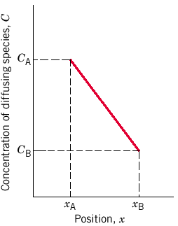
*Figure 7: Steady-state linear concentration profile across a plate of thickness $\Delta x$ (Lecture 9, Slide 8).*

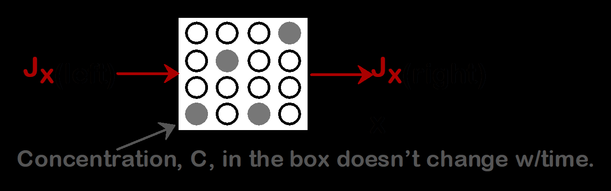
*Figure 8: Steady-state diffusion across a flat membrane: $J_{\text{left}} = J_{\text{right}}$, mandating a constant slope $(dC/dx)_{\text{left}} = (dC/dx)_{\text{right}}$ (Lecture 9, Slide 11).*

**Key Steady-State Deductions:**
1. **Conservation of Mass**: Because no diffusing atoms accumulate inside any slice of the solid, the flux entering any cross section must equal the flux leaving that section:
   $$J_{\text{in}} = J_{\text{out}} \implies J = \text{constant}$$
2. **Linear Concentration Profile**: Since $J = -D (dC/dx) = \text{constant}$, the spatial derivative $dC/dx$ must be constant:
   $$\frac{dC}{dx} = \frac{\Delta C}{\Delta x} = \frac{C_B - C_A}{x_B - x_A} = \text{constant}$$
   The concentration profile through the membrane is a **straight line**!

---

### 4.4 Fully Solved Lecture Example 1: Hydrogen Purification through Palladium (Slide 9)

> **Lecture 9 Problem Statement:**
> The purification of $\text{H}_2$ gas is achieved by diffusion through a Palladium ($\text{Pd}$) sheet. Compute the number of kilograms of hydrogen that pass per hour through a $5\text{ mm}$ thick sheet of $\text{Pd}$ having an area of $0.20\text{ m}^2$ at $500^\circ\text{C}$. Assume a diffusion coefficient $D = 1.0 \times 10^{-8}\text{ m}^2/\text{s}$, that the concentrations at the high and low pressure sides of the plate are $2.4$ and $0.6\text{ kg of H}_2\text{ per m}^3\text{ of Pd}$, and that steady-state conditions have been attained.

#### Step 1: Identify Given Parameters and Convert to SI Base Units
* Diffusion coefficient: $D = 1.0 \times 10^{-8}\text{ m}^2/\text{s}$
* Plate thickness: $\Delta x = 5\text{ mm} = 5 \times 10^{-3}\text{ m} = 0.005\text{ m}$
* Surface area: $A = 0.20\text{ m}^2$
* High-pressure surface concentration: $C_A = 2.4\text{ kg/m}^3$ (at $x_A = 0$)
* Low-pressure surface concentration: $C_B = 0.6\text{ kg/m}^3$ (at $x_B = 5 \times 10^{-3}\text{ m}$)
* Time elapsed: $t = 1\text{ hour} = 3600\text{ s}$

#### Step 2: Compute the Concentration Gradient ($dC/dx$)
$$\frac{dC}{dx} = \frac{C_B - C_A}{x_B - x_A} = \frac{0.6\text{ kg/m}^3 - 2.4\text{ kg/m}^3}{0.005\text{ m} - 0\text{ m}} = \frac{-1.8\text{ kg/m}^3}{0.005\text{ m}} = -360\text{ kg/m}^4$$

#### Step 3: Compute the Steady-State Diffusion Flux ($J$)
Using Fick's First Law:
$$J = -D \frac{dC}{dx} = -(1.0 \times 10^{-8}\text{ m}^2/\text{s}) \times (-360\text{ kg/m}^4) = +3.6 \times 10^{-6}\text{ kg}/(\text{m}^2\cdot\text{s})$$

#### Step 4: Calculate the Total Mass Transported ($M$)
From the definition of flux: $J = \dfrac{M}{A t} \implies M = J \times A \times t$
$$M = (3.6 \times 10^{-6}\text{ kg}/(\text{m}^2\cdot\text{s})) \times (0.20\text{ m}^2) \times (3600\text{ s})$$
$$M = (3.6 \times 10^{-6}) \times (720) = 2.592 \times 10^{-3}\text{ kg} = 2.592\text{ g}$$

> **Final Result**: **$2.59 \times 10^{-3}\text{ kg}$** of hydrogen passes through the palladium sheet per hour ($2.59\text{ g/hr}$).

---

## 5. Non-Steady State Diffusion: Fick's Second Law & Error Function Solutions (Slides 12–17)

### 5.1 Fick's Second Law (Slide 12)

In virtually all practical heat-treating, surface-hardening, and semiconductor doping processes, diffusion is **non-steady state**. The concentration of diffusing solute at any given spatial coordinate changes continuously as time progresses:

$$\frac{\partial C}{\partial t} \neq 0$$

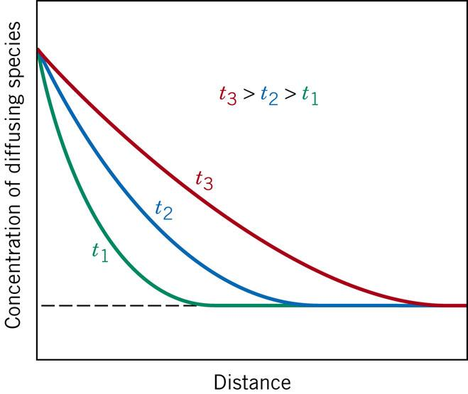
*Figure 9: Non-steady state concentration profiles $C(x, t)$ at successive elapsed diffusion times $t_1 < t_2 < t_3$ (Lecture 9, Slide 12; Callister Fig. 5.4).*

By applying a mass-balance continuity equation to an infinitesimal volume element ($dx \cdot A$), Adolf Fick derived **Fick's Second Law**:

$$\frac{\partial C}{\partial t} = \frac{\partial}{\partial x}\left(D \frac{\partial C}{\partial x}\right)$$

When the diffusion coefficient $D$ is assumed independent of composition and spatial position (a standard engineering approximation for dilute solutions):

$$\frac{\partial C}{\partial t} = D \frac{\partial^2 C}{\partial x^2}$$

---

### 5.2 Semi-Infinite Solid with Constant Surface Concentration (Slides 13–15)

To solve this second-order partial differential equation, boundary and initial conditions must be established:

#### Boundary & Initial Conditions:
1. **Initial Uniform Solute Concentration**: Before diffusion begins ($t = 0$), the solute is distributed uniformly throughout the bar at concentration $C_0$:
   $$C = C_0 \quad \text{for } 0 \le x \le \infty \quad \text{at } t = 0$$
2. **Constant Surface Concentration**: For all times $t > 0$, the surface at $x = 0$ is held at a constant concentration $C_s$ (for example, by maintaining a steady partial pressure of carburizing gas):
   $$C = C_s \quad \text{at } x = 0 \quad \text{for } t > 0$$
3. **Semi-Infinite Solid Criterion**: The solid is sufficiently thick that diffusing atoms never reach the far end during the processing time $t$:
   $$C \to C_0 \quad \text{as } x \to \infty \quad \text{for } t > 0$$
   * **Engineering Criterion (Slide 13)**: A bar of length $l$ acts as semi-infinite if:
     $$l > 10\sqrt{Dt}$$

---

### 5.3 The Error Function Analytical Solution (Slide 14–15)

Applying these boundary conditions using Laplace transform or similarity transformation methods yields the classic **error function solution**:

$$\frac{C_x - C_0}{C_s - C_0} = 1 - \text{erf}\left(\frac{x}{2\sqrt{Dt}}\right)$$

Or equivalently:

$$\frac{C_s - C_x}{C_s - C_0} = \text{erf}\left(\frac{x}{2\sqrt{Dt}}\right)$$

Where:
* $C_x$ = Concentration at depth $x$ after elapsed time $t$.
* $C_0$ = Initial uniform concentration in the solid before diffusion ($t = 0$).
* $C_s$ = Constant surface concentration maintained at $x = 0$.
* $x$ = Distance / penetration depth from the surface ($\text{m}$).
* $D$ = Diffusion coefficient ($\text{m}^2/\text{s}$).
* $t$ = Elapsed diffusion time ($\text{s}$).
* $z = \dfrac{x}{2\sqrt{Dt}}$ = Dimensionless similarity parameter.
* $\text{erf}(z)$ = **Gaussian Error Function**, defined by the integral:
  $$\text{erf}(z) = \frac{2}{\sqrt{\pi}} \int_0^z e^{-y^2} dy$$

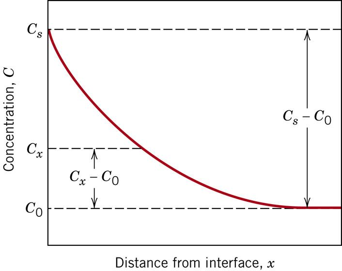
*Figure 10: Non-steady state concentration profile $(C_x - C_0)/(C_s - C_0) = 1 - \text{erf}(z)$ plotted versus penetration distance $x$ (Lecture 9, Slide 15; Callister Fig. 5.5).*

---

### 5.4 Error Function Tabulation & Linear Interpolation Guide (Slide 16)

The Gaussian error function cannot be evaluated analytically in closed elementary form; it must be evaluated via numerical integration or looked up in standard reference tables.

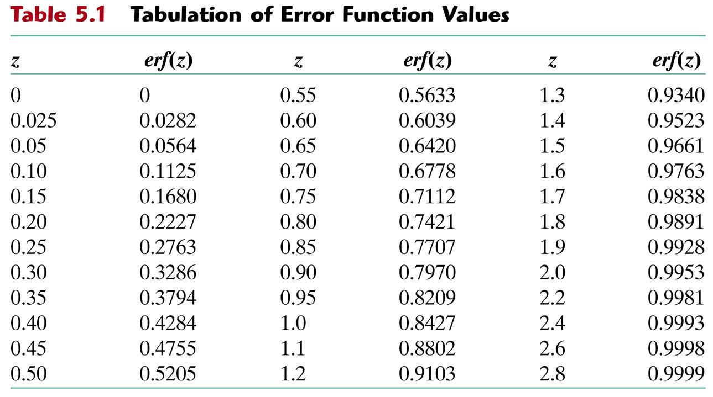
*Figure 11: Callister Table 5.1 Tabulation of Error Function Values (Lecture 9, Slide 16).*

| $z$ | $\text{erf}(z)$ | $z$ | $\text{erf}(z)$ | $z$ | $\text{erf}(z)$ | $z$ | $\text{erf}(z)$ |
| :---: | :---: | :---: | :---: | :---: | :---: | :---: | :---: |
| **0.000** | 0.0000 | **0.400** | 0.4284 | **0.850** | 0.7707 | **1.400** | 0.9523 |
| **0.025** | 0.0282 | **0.450** | 0.4755 | **0.900** | 0.7969 | **1.500** | 0.9661 |
| **0.050** | 0.0564 | **0.500** | 0.5205 | **0.950** | 0.8209 | **1.600** | 0.9763 |
| **0.100** | 0.1125 | **0.550** | 0.5633 | **1.000** | 0.8427 | **1.700** | 0.9838 |
| **0.150** | 0.1680 | **0.600** | 0.6039 | **1.100** | 0.8802 | **1.800** | 0.9891 |
| **0.200** | 0.2227 | **0.650** | 0.6420 | **1.200** | 0.9103 | **1.900** | 0.9928 |
| **0.250** | 0.2763 | **0.700** | 0.6778 | **1.300** | 0.9340 | **2.000** | 0.9953 |
| **0.300** | 0.3286 | **0.750** | 0.7112 | — | — | **2.200** | 0.9981 |
| **0.350** | 0.3794 | **0.800** | 0.7421 | — | — | **2.400** | 0.9993 |

#### How to Linearly Interpolate Error Function Values:
When an exact value of $\text{erf}(z)$ falls between two table entries $z_1$ and $z_2$:
$$\frac{z - z_1}{z_2 - z_1} = \frac{\text{erf}(z) - \text{erf}(z_1)}{\text{erf}(z_2) - \text{erf}(z_1)}$$

Solving explicitly for the target argument $z$:
$$z = z_1 + \left(\frac{\text{erf}(z) - \text{erf}(z_1)}{\text{erf}(z_2) - \text{erf}(z_1)}\right) (z_2 - z_1)$$

---

### 5.5 The Constant-Concentration Scaling Laws (Slide 17)

When designing heat treatments where an engineer wishes to achieve a **specific target solute concentration ($C_x$)** at depth $x$:

$$\frac{C_x - C_0}{C_s - C_0} = \text{constant}$$

This immediately requires that the error function argument must remain constant:

$$\text{erf}\left(\frac{x}{2\sqrt{Dt}}\right) = \text{constant} \implies \frac{x}{2\sqrt{Dt}} = \text{constant}$$

Squaring both sides yields the universal **Diffusion Scaling Rule**:

$$\frac{x^2}{Dt} = \text{constant} \quad \Longleftrightarrow \quad \frac{x_1^2}{D_1 t_1} = \frac{x_2^2}{D_2 t_2}$$

#### Critical Engineering Deductions:
1. **At Constant Temperature ($D_1 = D_2 = D$)**:
   $$\frac{x_1^2}{t_1} = \frac{x_2^2}{t_2} \implies \frac{x_1}{\sqrt{t_1}} = \frac{x_2}{\sqrt{t_2}}$$
   * > **The Depth-Time Paradox**: To double the penetration depth ($x_2 = 2 x_1$), the required diffusion time **must increase by a factor of FOUR** ($t_2 = 4 t_1$)! To triple the depth, time increases by $9\times$.
2. **At Constant Depth ($x_1 = x_2 = x$)**:
   $$D_1 t_1 = D_2 t_2 \implies t_2 = t_1 \left(\frac{D_1}{D_2}\right)$$
   * Processing time is inversely proportional to diffusivity! By raising furnace temperature and increasing $D$, process cycle time can be drastically reduced.

---

## 6. Factors Affecting Diffusion Rates (Slides 18–20)

### 6.1 Physical and Structural Factors (Slide 18)

1. **Diffusing Species & Mechanism**:
   * Interstitial atoms ($C, H, N$) diffuse orders of magnitude faster than host substitutional atoms ($Fe, Ni, Cu$).
2. **Crystal Structure & Packing Density**:
   * Diffusion is substantially faster in **open, less densely packed lattices** than in close-packed lattices:
     $$\text{Rate in BCC } (\text{APF} = 0.68) \gg \text{Rate in FCC } (\text{APF} = 0.74)$$
   * *Example*: At $912^\circ\text{C}$, the diffusivity of carbon in BCC $\alpha$-ferrite ($D \approx 1.7 \times 10^{-10}\text{ m}^2/\text{s}$) is approximately **$100\times$ faster** than in FCC $\gamma$-austenite ($D \approx 1.5 \times 10^{-12}\text{ m}^2/\text{s}$), even though austenite dissolves more carbon!
3. **Melting Temperature & Interatomic Bond Strength**:
   * Metals with lower melting temperatures ($T_m$) have weaker interatomic bonds, shallower potential energy wells, and lower activation energies ($Q_d$). Diffusion occurs at much lower absolute temperatures (e.g., lead or tin vs tungsten or molybdenum).
4. **Diffusion Pathways (Short-Circuit Diffusion)**:
   * Atomic migration occurs much more easily along open microstructural defects than through the perfect crystal lattice:
     $$D_{\text{surface}} > D_{\text{grain boundary}} > D_{\text{dislocation pipe}} > D_{\text{lattice (bulk)}}$$
     $$Q_{\text{surface}} < Q_{\text{grain boundary}} < Q_{\text{dislocation pipe}} < Q_{\text{lattice (bulk)}}$$
   * Although grain boundaries and surfaces diffuse faster, bulk lattice diffusion dominates mass transport at high temperatures because lattice volume represents $>99.9\%$ of the material.

---

### 6.2 Temperature Dependence: The Arrhenius Rate Equation (Slide 18)

The diffusion coefficient $D$ increases exponentially with absolute temperature according to the **Arrhenius equation**:

$$D = D_0 \exp\left(-\frac{Q_d}{RT}\right) \quad \text{or} \quad D = D_0 \exp\left(-\frac{Q_d}{k_B T}\right)$$

Where:
* $D$ = Diffusion coefficient at temperature $T$ ($\text{m}^2/\text{s}$).
* $D_0$ = Temperature-independent pre-exponential frequency factor ($\text{m}^2/\text{s}$).
* $Q_d$ = Activation energy for diffusion:
  * In molar units: $\text{J/mol}$ or $\text{kJ/mol}$ (used with $R = 8.314\text{ J/mol}\cdot\text{K}$).
  * In atomic units: $\text{eV/atom}$ (used with $k_B = 8.62 \times 10^{-5}\text{ eV/atom}\cdot\text{K}$).
* $T$ = Absolute temperature in Kelvin ($\text{K} = ^\circ\text{C} + 273.15$).

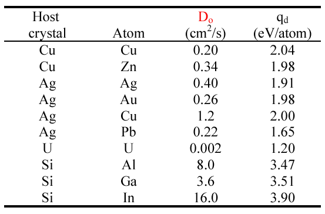
*Figure 12: Typical experimental diffusion parameters $D_0$ and $Q_d$ for representative interstitial, self-diffusion, and substitutional systems (Lecture 9, Slide 19; after Kittel).*

---

### 6.3 Experimental Determination of Activation Energy ($Q_d$) (Slide 20)

To experimentally determine $Q_d$ and $D_0$, diffusivity is measured at several temperatures. Taking logarithms of the Arrhenius relation:

#### Base $e$ (Natural Logarithm):
$$\ln D = \ln D_0 - \frac{Q_d}{R} \left(\frac{1}{T}\right)$$
Plotting $\ln D$ versus $\frac{1}{T}$ yields a straight line ($y = mx + b$):
$$\text{Slope} = -\frac{Q_d}{R} \implies Q_d = -R \times \text{Slope}$$
$$\text{Y-Intercept} = \ln D_0 \implies D_0 = e^{\text{Intercept}}$$

#### Base 10 (Common Logarithm) (Slide 20):
$$\log_{10} D = \log_{10} D_0 - \frac{Q_d}{2.303 R} \left(\frac{1}{T}\right)$$
Plotting $\log_{10} D$ versus $\frac{1}{T}$:
$$\text{Slope} = -\frac{Q_d}{2.303 R} \implies Q_d = -2.303 R \times \text{Slope}$$
$$\text{Y-Intercept} = \log_{10} D_0 \implies D_0 = 10^{\text{Intercept}}$$

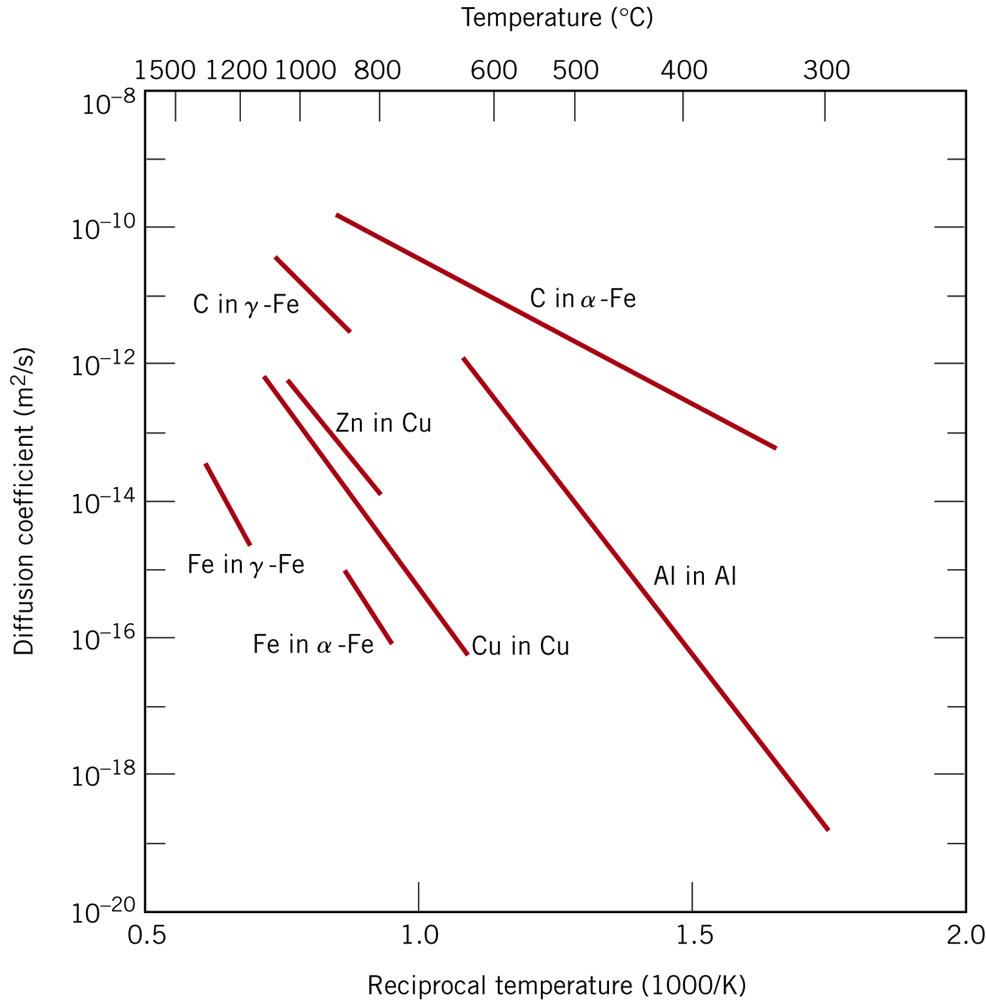
*Figure 13: Arrhenius plot of $\log_{10} D$ versus reciprocal absolute temperature ($1000/T$) for various metallic systems (Lecture 9, Slide 20; Callister Fig. 5.6).*

---

## 7. Slide 22 Polling Summary Questions: Deep Pedagogical Rationale

Dr. Medraj concludes Lecture 9 with four fundamental conceptual comparison questions (Slide 22). Master these physical explanations for the midterm and final:

### Scenario 1: Close-packed vs. Open crystal structure
> **Answer: Diffusion is FASTER in the open structure.**  
* **Physical Rationale**: An open crystal structure (such as BCC, $\text{APF} = 0.68$) has $32\%$ unoccupied free volume, compared to only $26\%$ in close-packed structures (FCC or HCP, $\text{APF} = 0.74$). The larger interstitial voids and lower atomic packing density reduce the steric hindrance and mechanical distortion required for an atom to squeeze through adjacent lattice planes. Consequently, the activation energy barrier ($Q_d$) is significantly lower in the open structure.

### Scenario 2: Lower-melting vs. Higher-melting-point materials
> **Answer: Diffusion is FASTER in the lower-melting-point material (at any given temperature).**  
* **Physical Rationale**: Melting point ($T_m$) directly reflects interatomic bond strength and the depth of the potential energy well ($E_0$). A low $T_m$ implies weak bonding forces. Weaker interatomic bonds require substantially less energy to rupture and distort during an atomic jump, resulting in a lower activation energy ($Q_d$). At any identical operating temperature $T$, a material closer to its melting point possesses a vastly higher thermal vacancy concentration and higher jump frequency.

### Scenario 3: Covalent bonding vs. Secondary interactions
> **Answer: Diffusion is FASTER in materials held by secondary interactions.**  
* **Physical Rationale**: Covalent bonds are highly directional, localized, and exceptionally strong (bond energies of $400\text{–}1000\text{ kJ/mol}$). An atom cannot jump without breaking multiple rigid, directional hybrid orbitals simultaneously, presenting an enormous activation barrier. Conversely, secondary van der Waals and hydrogen interactions are weak ($10\text{–}40\text{ kJ/mol}$) and non-directional, allowing molecular chains and atomic species to translate past one another with minimal activation energy.

### Scenario 4: Smaller vs. Larger atoms
> **Answer: Diffusion is FASTER for smaller atoms.**  
* **Physical Rationale**: Smaller solute atoms ($r_{\text{solute}} \ll r_{\text{host}}$, such as $\text{H, C, N}$) diffuse via the interstitial mechanism, requiring no lattice vacancies and creating minimal elastic distortion strains. Larger atoms must migrate substitutionally via vacancies, which requires waiting for a vacancy to arrive ($Q_v + Q_m$) and overcoming substantial steric resistance.

---

## 8. Fully Solved Quantitative Examination Problems

---

### Problem 1 (Lecture 9 Slide 21 Decarburization Problem)

> **Problem Statement:**
> An FCC $\text{Fe-C}$ alloy initially containing $0.35\text{ wt}\%\text{ C}$ is exposed to an oxygen-rich (and carbon-free) atmosphere at $1400\text{ K}$ ($1127^\circ\text{C}$). Under these conditions, the carbon in the alloy diffuses toward the surface and reacts with the oxygen in the atmosphere; that is, the carbon concentration at the surface is maintained essentially at $0\text{ wt}\%\text{ C}$. (This process of carbon depletion is termed **decarburization**). At what position will the carbon concentration be $0.15\text{ wt}\%\text{ C}$ after a $10\text{-hour}$ treatment? The value of $D$ at $1400\text{ K}$ is $6.9 \times 10^{-11}\text{ m}^2/\text{s}$.

#### Step 1: Identify Given Parameters and Boundary Conditions
* Initial uniform concentration: $C_0 = 0.35\text{ wt}\%\text{ C}$
* Surface concentration: $C_s = 0\text{ wt}\%\text{ C}$
* Target concentration: $C_x = 0.15\text{ wt}\%\text{ C}$
* Temperature: $T = 1400\text{ K}$
* Diffusion coefficient: $D = 6.9 \times 10^{-11}\text{ m}^2/\text{s}$
* Time: $t = 10\text{ hours} = 10 \times 3600\text{ s} = 36\,000\text{ s}$
* Target: Depth $x$ where $C_x = 0.15\text{ wt}\%$

#### Step 2: Set Up Fick's Second Law Error Function Ratio
$$\frac{C_x - C_0}{C_s - C_0} = 1 - \text{erf}(z)$$

Substitute known concentrations:
$$\frac{0.15 - 0.35}{0 - 0.35} = \frac{-0.20}{-0.35} = \frac{0.20}{0.35} = \frac{4}{7} \approx 0.5714$$

Equating to the right-hand side:
$$1 - \text{erf}(z) = 0.5714 \implies \text{erf}(z) = 1 - 0.5714 = 0.4286$$

#### Step 3: Interpolate the Argument $z$ from Table 5.1
From Callister Table 5.1:
* At $z_1 = 0.40$: $\text{erf}(z_1) = 0.4284$
* At $z_2 = 0.45$: $\text{erf}(z_2) = 0.4755$

Our target value $\text{erf}(z) = 0.4286$ lies between $0.4284$ and $0.4755$:
$$\frac{z - 0.40}{0.45 - 0.40} = \frac{0.4286 - 0.4284}{0.4755 - 0.4284}$$
$$\frac{z - 0.40}{0.05} = \frac{0.0002}{0.0471} \approx 0.004246$$
$$z = 0.40 + 0.05 \times 0.004246 = 0.40021 \approx 0.4002$$

#### Step 4: Solve for Penetration Depth $x$
Recall that the argument $z$ is defined as:
$$z = \frac{x}{2\sqrt{Dt}} \implies x = 2 z \sqrt{Dt}$$

Calculate $\sqrt{Dt}$:
$$Dt = (6.9 \times 10^{-11}\text{ m}^2/\text{s}) \times (36\,000\text{ s}) = 2.484 \times 10^{-6}\text{ m}^2$$
$$\sqrt{Dt} = \sqrt{2.484 \times 10^{-6}} = 1.576 \times 10^{-3}\text{ m}$$

Compute depth $x$:
$$x = 2 \times 0.4002 \times (1.576 \times 10^{-3}\text{ m}) = 1.261 \times 10^{-3}\text{ m} = 1.26\text{ mm}$$

> **Final Result**: The carbon concentration will be $0.15\text{ wt}\%\text{ C}$ at a depth of **$1.26\text{ mm}$** ($1.26 \times 10^{-3}\text{ m}$).

---

### Problem 2 (Callister Example 5.2 Carburization Scaling Problem)

> **Problem Statement:**
> A gear made of $0.20\text{ wt}\%\text{ C}$ steel is to be carburized at $927^\circ\text{C}$ in a gas maintaining $C_s = 1.0\text{ wt}\%\text{ C}$. If it takes $10\text{ hours}$ to achieve a carbon concentration of $0.40\text{ wt}\%\text{ C}$ at a depth of $0.8\text{ mm}$, how many hours will be required to achieve the exact same carbon concentration ($0.40\text{ wt}\%$) at a depth of $1.6\text{ mm}$ at the same temperature?

#### Step 1: Identify the Constant-Concentration Condition
Because $C_0$, $C_s$, $C_x$, and temperature $T$ (and therefore diffusivity $D$) are identical in both cases:
$$\frac{C_x - C_0}{C_s - C_0} = \text{constant} \implies \frac{x}{2\sqrt{Dt}} = \text{constant}$$

Since temperature is constant, $D_1 = D_2 = D$:
$$\frac{x_1}{\sqrt{t_1}} = \frac{x_2}{\sqrt{t_2}} \implies \frac{x_1^2}{t_1} = \frac{x_2^2}{t_2}$$

#### Step 2: Solve for Unknown Time $t_2$
$$t_2 = t_1 \left(\frac{x_2}{x_1}\right)^2$$
Substitute $x_1 = 0.8\text{ mm}$, $x_2 = 1.6\text{ mm}$, and $t_1 = 10\text{ hr}$:
$$t_2 = 10\text{ hr} \times \left(\frac{1.6\text{ mm}}{0.8\text{ mm}}\right)^2 = 10\text{ hr} \times (2)^2 = 10 \times 4 = 40\text{ hours}$$

> **Final Result**: **$40\text{ hours}$** are required. Doubling the case depth quadruples the necessary furnace time!

---

### Problem 3 (Determining $Q_d$ and $D_0$ from Two Temperature Points)

> **Problem Statement:**
> The diffusion coefficient for copper in aluminium is measured as $D_1 = 4.8 \times 10^{-14}\text{ m}^2/\text{s}$ at $500^\circ\text{C}$ ($773.15\text{ K}$) and $D_2 = 5.3 \times 10^{-13}\text{ m}^2/\text{s}$ at $600^\circ\text{C}$ ($873.15\text{ K}$).
> (a) Calculate the activation energy for diffusion $Q_d$ in $\text{kJ/mol}$.
> (b) Calculate the pre-exponential factor $D_0$ in $\text{m}^2/\text{s}$.

#### Step 1: Formulate the Two-Point Ratio
From the Arrhenius equation:
$$\frac{D_2}{D_1} = \exp\left[-\frac{Q_d}{R}\left(\frac{1}{T_2} - \frac{1}{T_1}\right)\right]$$
Taking the natural logarithm:
$$\ln\left(\frac{D_2}{D_1}\right) = -\frac{Q_d}{R}\left(\frac{1}{T_2} - \frac{1}{T_1}\right) = \frac{Q_d}{R}\left(\frac{1}{T_1} - \frac{1}{T_2}\right)$$

#### Step 2: Solve for $Q_d$
$$Q_d = R \times \frac{\ln(D_2 / D_1)}{\dfrac{1}{T_1} - \dfrac{1}{T_2}}$$

Compute the components:
* $\dfrac{D_2}{D_1} = \dfrac{5.3 \times 10^{-13}}{4.8 \times 10^{-14}} = 11.0417$
* $\ln(11.0417) = 2.4017$
* $\dfrac{1}{T_1} = \dfrac{1}{773.15\text{ K}} = 1.29341 \times 10^{-3}\text{ K}^{-1}$
* $\dfrac{1}{T_2} = \dfrac{1}{873.15\text{ K}} = 1.14528 \times 10^{-3}\text{ K}^{-1}$
* $\dfrac{1}{T_1} - \dfrac{1}{T_2} = (1.29341 - 1.14528) \times 10^{-3} = 1.4813 \times 10^{-4}\text{ K}^{-1}$

Substitute into $Q_d$ ($R = 8.314\text{ J/mol}\cdot\text{K}$):
$$Q_d = 8.314 \times \frac{2.4017}{1.4813 \times 10^{-4}} = 8.314 \times 16\,213.5 = 134\,800\text{ J/mol} = 134.8\text{ kJ/mol}$$

#### Step 3: Compute Pre-Exponential Factor $D_0$
Using $D_1$ at $T_1 = 773.15\text{ K}$:
$$D_1 = D_0 \exp\left(-\frac{Q_d}{R T_1}\right) \implies D_0 = D_1 \exp\left(\frac{Q_d}{R T_1}\right)$$
$$\frac{Q_d}{R T_1} = \frac{134\,800\text{ J/mol}}{(8.314\text{ J/mol}\cdot\text{K})(773.15\text{ K})} = \frac{134\,800}{6427.97} = 20.9708$$
$$D_0 = (4.8 \times 10^{-14}\text{ m}^2/\text{s}) \times e^{20.9708} = (4.8 \times 10^{-14}) \times (1.2777 \times 10^9) = 6.13 \times 10^{-5}\text{ m}^2/\text{s}$$

> **Final Results**:
> (a) Activation energy: **$Q_d = 134.8\text{ kJ/mol}$**  
> (b) Pre-exponential factor: **$D_0 = 6.13 \times 10^{-5}\text{ m}^2/\text{s}$**

---

## 9. Common Midterm & Final Exam Traps and Pitfalls

| # | Fatal Trap | Why Students Lose Marks | The Bulletproof Solution |
| :---: | :--- | :--- | :--- |
| **1** | **Temperature in Celsius instead of Kelvin** | Entering $T = 500$ directly into $\exp(-Q/RT)$ gives a totally wild, meaningless number. | **Always convert to Kelvin immediately**: $T(\text{K}) = T(^\circ\text{C}) + 273.15$. |
| **2** | **Time in hours or minutes instead of seconds** | Using $t = 10\text{ hr}$ directly with $D$ ($\text{m}^2/\text{s}$) produces an error by a factor of $3600$. | **Always convert time to seconds**: $t = (\text{hours}) \times 3600\text{ s}$. |
| **3** | **Penetration depth in $\text{mm}$ or $\mu\text{m}$ instead of meters** | Entering $x = 1.2\text{ mm}$ into $x / (2\sqrt{Dt})$ produces an answer $1000\times$ too high. | **Always convert distance to meters**: $x = (\text{mm}) \times 10^{-3}\text{ m}$. |
| **4** | **Gas Constant ($R$) vs. Boltzmann's Constant ($k_B$)** | Using $R = 8.314$ when $Q_d$ is given in $\text{eV/atom}$, or using $k_B$ when $Q_d$ is in $\text{kJ/mol}$. | Check units of $Q_d$:<br>• If $\text{J/mol}$ or $\text{kJ/mol}$ $\implies R = 8.314\text{ J/mol}\cdot\text{K}$<br>• If $\text{eV/atom}$ $\implies k_B = 8.62 \times 10^{-5}\text{ eV/atom}\cdot\text{K}$. |
| **5** | **Natural Log ($\ln$) vs. Common Log ($\log_{10}$) Slope** | Forgetting the $2.303$ factor when reading slopes from base-10 plots. | • For $\ln D$ vs $1/T$: $\text{Slope} = -Q_d / R$<br>• For $\log_{10} D$ vs $1/T$: $\text{Slope} = -Q_d / (2.303 R)$. |
| **6** | **Decarburization Double-Negative Signs** | In decarburization, $C_s < C_0$. Students flip the fraction or panic when they see negative numbers in $(C_x - C_0)/(C_s - C_0)$. | Both numerator and denominator are negative: $\dfrac{0.15 - 0.35}{0 - 0.35} = \dfrac{-0.20}{-0.35} = +0.5714$. The ratio is strictly positive! |
| **7** | **Confusing Steady State with Non-Steady State** | Applying Fick's First Law ($J = -D dC/dx$) to a case-hardening problem where concentration changes with time. | • If problem asks for mass passing per unit time through a sheet $\implies$ **Steady State (Fick 1)**.<br>• If problem asks for concentration at a depth after a time $\implies$ **Non-Steady State (Fick 2 & Error Function)**. |

---

## 10. Master Formula Sheet & Summary Card

$$\begin{array}{|l|l|l|}
\hline
\textbf{Concept / Law} & \textbf{Governing Mathematical Engine} & \textbf{Key Units \& Constants} \\
\hline
\text{Diffusion Flux } (J) & J = \dfrac{M}{A t} = \dfrac{1}{A}\dfrac{dM}{dt} & \text{kg}/(\text{m}^2\cdot\text{s}) \text{ or } \text{atoms}/(\text{m}^2\cdot\text{s}) \\
\hline
\text{Fick's 1st Law (Steady State)} & J = -D \dfrac{dC}{dx} \approx -D \left(\dfrac{C_B - C_A}{x_B - x_A}\right) & D \text{ in } \text{m}^2/\text{s}, \, \dfrac{dC}{dx} \text{ in } \text{kg/m}^4 \\
\hline
\text{Fick's 2nd Law (General)} & \dfrac{\partial C}{\partial t} = \dfrac{\partial}{\partial x}\left(D \dfrac{\partial C}{\partial x}\right) & \text{Non-steady state general form} \\
\hline
\text{Fick's 2nd Law (Constant } D) & \dfrac{\partial C}{\partial t} = D \dfrac{\partial^2 C}{\partial x^2} & \text{Homogeneous isotropic medium} \\
\hline
\text{Error Function Solution} & \dfrac{C_x - C_0}{C_s - C_0} = 1 - \text{erf}\left(\dfrac{x}{2\sqrt{Dt}}\right) & C_s: \text{surface}, \, C_0: \text{initial}, \, C_x: \text{at depth } x \\
\hline
\text{Constant-Concentration Scaling} & \dfrac{x^2}{Dt} = \text{const} \implies \dfrac{x_1^2}{D_1 t_1} = \dfrac{x_2^2}{D_2 t_2} & \text{At constant } T: \, \dfrac{x_1}{\sqrt{t_1}} = \dfrac{x_2}{\sqrt{t_2}} \\
\hline
\text{Arrhenius Temperature Law} & D = D_0 \exp\left(-\dfrac{Q_d}{RT}\right) & R = 8.314\text{ J/mol}\cdot\text{K}, \, T \text{ in Kelvin} \\
\hline
\text{Arrhenius Linear Form (Ln)} & \ln D = \ln D_0 - \dfrac{Q_d}{R}\left(\dfrac{1}{T}\right) & \text{Slope} = -Q_d / R, \, \text{Intercept} = \ln D_0 \\
\hline
\text{Arrhenius Linear Form (Log10)} & \log_{10} D = \log_{10} D_0 - \dfrac{Q_d}{2.303 R}\left(\dfrac{1}{T}\right) & \text{Slope} = -Q_d / (2.303 R) \\
\hline
\text{Semi-Infinite Bar Condition} & l > 10\sqrt{Dt} & l: \text{length of bar (m)} \\
\hline
\end{array}$$
